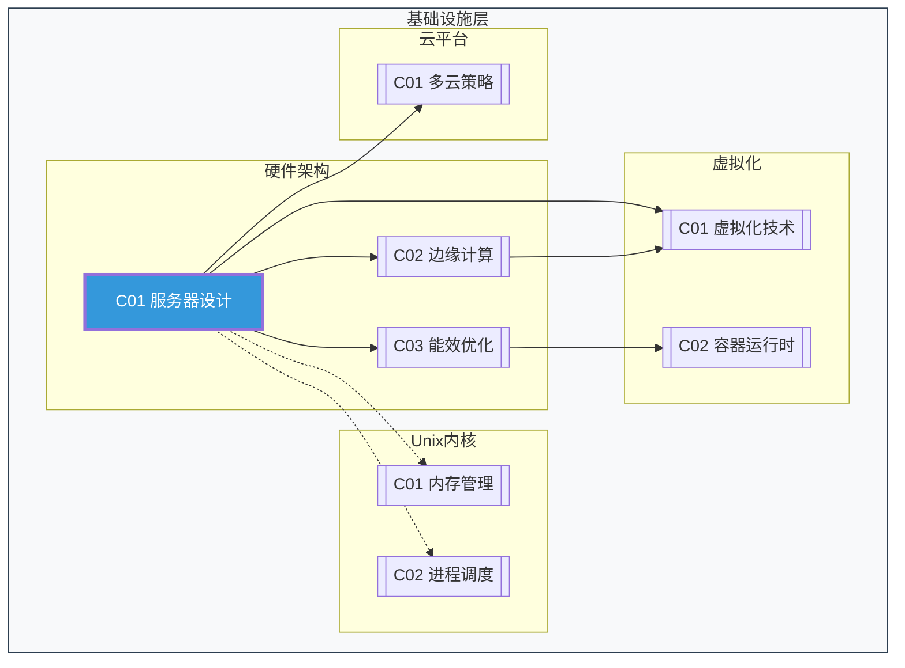

# C01 Server Design

**所属子领域**: [B01_Hardware_Arch](../README.md)  
**创建日期**: 2026-01-30  
**最后更新**: 2026-01-30

## 📋 主题定位

服务器设计是现代数据中心基础设施的核心组成部分，涵盖了从单机硬件架构到大规模集群部署的全方位技术体系。本专题深入探讨服务器硬件选型、架构设计原则、高可用设计、性能优化以及绿色计算等关键领域，为构建可靠、高效、可扩展的服务器基础设施提供系统性指导。

服务器设计不仅关乎硬件规格的堆砌，更涉及系统工程的思维方式——需要在性能、成本、能耗、可靠性之间取得平衡，同时考虑运维效率和业务增长需求。随着云计算、边缘计算和AI工作负载的兴起，服务器设计正经历从通用化向场景化、从标准化向定制化演进的重要转变。

## 🎯 核心概念

### 基本定义

**服务器（Server）**: 为客户端提供计算服务、数据存储或应用运行环境的高性能计算机系统，具有高性能、高可靠性、高可用性、高扩展性的特点。

**机架式服务器（Rack Server）**: 设计为安装在标准19英寸机架中的服务器，常见高度规格为1U、2U、4U等，是数据中心最常见的服务器形态。

**刀片服务器（Blade Server）**: 在标准机箱内插入多块服务器主板的高密度服务器方案，共享电源、散热、网络等基础设施。

**整机柜服务器（Rack-scale Server）**: 将计算、存储、网络资源整合在完整机柜内的设计方案，如Open Compute Project (OCP) 倡导的开放硬件架构。

### 服务器硬件架构

```
┌─────────────────────────────────────────────────────────────────┐
│                      服务器硬件架构全景                          │
├─────────────────────────────────────────────────────────────────┤
│  ┌─────────────┐  ┌─────────────┐  ┌─────────────┐  ┌─────────┐ │
│  │   CPU/处理器 │  │    内存    │  │   存储系统   │  │  网络   │ │
│  │  ├─多路架构 │  │  ├─DRAM   │  │  ├─HDD    │  │ ├─NIC  │ │
│  │  ├─核心数   │  │  ├─NVDIMM │  │  ├─SSD    │  │ ├─HBA  │ │
│  │  ├─频率/TDP │  │  ├─通道数  │  │  ├─NVMe   │  │ ├─RDMA │ │
│  │  └─加速指令 │  │  └─容量   │  │  └─RAID   │  │ └─智能网卡│ │
│  └─────────────┘  └─────────────┘  └─────────────┘  └─────────┘ │
├─────────────────────────────────────────────────────────────────┤
│  ┌─────────────┐  ┌─────────────┐  ┌─────────────┐  ┌─────────┐ │
│  │   扩展总线   │  │   电源系统   │  │   散热系统   │  │  管理   │ │
│  │  ├─PCIe   │  │  ├─冗余电源  │  │  ├─风冷   │  │ ├─BMC  │ │
│  │  ├─NVLink │  │  ├─能效等级  │  │  ├─液冷   │  │ ├─IPMI │ │
│  │  └─CXL   │  │  └─热插拔   │  │  └─浸没式  │  │ └─Redfish│ │
│  └─────────────┘  └─────────────┘  └─────────────┘  └─────────┘ │
└─────────────────────────────────────────────────────────────────┘
```

### 关键硬件组件

**1. 处理器架构选择**

| 架构类型 | 代表厂商 | 优势 | 适用场景 |
|---------|---------|------|----------|
| **x86_64** | Intel Xeon, AMD EPYC | 生态成熟，软件兼容性好 | 通用计算，企业应用 |
| **ARM** | Ampere Altra, AWS Graviton | 高能效比，核心密度高 | 云原生，Web服务 |
| **RISC-V** | SiFive, 中科院 | 开源架构，可定制化 | 专用加速，边缘计算 |
| **GPU** | NVIDIA, AMD | 并行计算能力强 | AI训练推理，HPC |
| **FPGA** | Xilinx, Intel | 硬件可编程，低延迟 | 网络加速，加密处理 |

**2. 内存子系统设计**

```
内存架构演进路线：
DDR4 (3200 MT/s) → DDR5 (4800-6400 MT/s) → DDR6 (规划中)
     ↓
持久内存 (Intel Optane PMem) - 已停产，但技术路径有价值
     ↓
CXL.memory (Compute Express Link) - 内存扩展与池化新标准
```

**内存配置关键参数**：
- **通道数**: 影响带宽，现代处理器通常支持8-12通道
- **Rank配置**: 影响容量与性能的平衡
- **频率与时序**: 决定访问延迟和吞吐量
- **ECC支持**: 企业级服务器必需的错误校验机制

**3. 存储架构设计**

```
存储层次结构：
┌──────────────────────────────────────────────────────┐
│  Tier 0: 内存 (DRAM/NVDIMM) - 纳秒级延迟，易失性      │
├──────────────────────────────────────────────────────┤
│  Tier 1: NVMe SSD - 微秒级延迟，高IOPS               │
├──────────────────────────────────────────────────────┤
│  Tier 2: SATA/SAS SSD - 毫秒级延迟，中等性能          │
├──────────────────────────────────────────────────────┤
│  Tier 3: HDD - 毫秒级延迟，大容量低成本               │
├──────────────────────────────────────────────────────┤
│  Tier 4: 对象存储/磁带 - 秒级访问，归档存储            │
└──────────────────────────────────────────────────────┘
```

**4. 网络接口演进**

| 代际 | 标准 | 速率 | 主要应用 |
|-----|------|------|---------|
| 1GbE | 千兆以太网 | 1 Gbps | 管理网络，边缘节点 |
| 10GbE | 万兆以太网 | 10 Gbps | 通用服务器连接 |
| 25GbE | 二十五兆 | 25 Gbps | 现代数据中心主流 |
| 40GbE | 四十兆 | 40 Gbps | 核心交换机互联 |
| 100GbE | 百兆以太网 | 100 Gbps | 高性能计算，AI集群 |
| 400GbE | 四百兆 | 400 Gbps | 超大规模数据中心 |

### 服务器形态演进

**1. 传统塔式/机架式**
- 独立部署，易于维护
- 适合中小企业和边缘场景

**2. 高密度刀片式**
- 共享基础设施，空间利用率高
- 适合计算密集型数据中心

**3. 整机柜/模块化**
- 如OCP Open Rack, Project Olympus
- 统一供电、散热、管理
- 适合超大规模云数据中心

**4. 异构计算服务器**
- CPU + GPU/FPGA/DPU组合
- 针对AI、大数据等场景优化

**5. 边缘服务器**
- 宽温设计，紧凑型形态
- 支持5G MEC、IoT网关等场景

### 高可用设计原则

**RAS特性（Reliability, Availability, Serviceability）**：

```
┌──────────────────────────────────────────────────────────────┐
│                    服务器RAS体系                              │
├──────────────────────────────────────────────────────────────┤
│  可靠性(Reliability)                                          │
│  ├── 组件级: ECC内存, RAID存储, 冗余电源                      │
│  ├── 系统级: 故障预测, 健康监控, 自愈机制                     │
│  └── 架构级: 集群冗余, 负载均衡, 故障转移                     │
├──────────────────────────────────────────────────────────────┤
│  可用性(Availability)                                         │
│  ├── 99.9%   (3个9)  - 年停机<8.76小时                        │
│  ├── 99.99%  (4个9)  - 年停机<52.6分钟                        │
│  ├── 99.999% (5个9)  - 年停机<5.26分钟                        │
│  └── 设计目标: 消除单点故障，支持在线维护                     │
├──────────────────────────────────────────────────────────────┤
│  可服务性(Serviceability)                                     │
│  ├── 热插拔: 硬盘, 电源, 风扇, PCIe卡                         │
│  ├── 带外管理: IPMI, Redfish, 远程KVM                        │
│  └── 预测维护: 故障预警, 自动报修, 部件跟踪                   │
└──────────────────────────────────────────────────────────────┘
```

## 🛠️ 技术实践

### 服务器选型方法论

**1. 工作负载分析框架**

```python
class WorkloadAnalyzer:
    """服务器工作负载分析器"""
    
    def __init__(self):
        self.metrics = {
            'cpu_profile': {},    # CPU使用模式
            'memory_profile': {}, # 内存使用模式
            'io_profile': {},     # I/O使用模式
            'network_profile': {} # 网络使用模式
        }
    
    def analyze_compute_pattern(self, workload_data):
        """分析计算模式"""
        patterns = {
            'compute_intensive': {  # 计算密集型
                'cpu_utilization': '> 70%',
                'memory_bandwidth': 'high',
                'examples': ['科学计算', '视频编码', '加密解密']
            },
            'memory_intensive': {   # 内存密集型
                'memory_capacity': 'large',
                'memory_bandwidth': 'critical',
                'examples': ['内存数据库', '缓存服务', '实时分析']
            },
            'io_intensive': {       # I/O密集型
                'storage_iops': 'high',
                'storage_throughput': 'high',
                'examples': ['OLTP数据库', '日志处理', '文件服务']
            },
            'balanced': {           # 均衡型
                'all_resources': 'moderate',
                'examples': ['Web应用', '开发测试', '通用服务']
            }
        }
        return self._match_pattern(workload_data, patterns)
    
    def recommend_server_config(self, pattern):
        """根据模式推荐服务器配置"""
        recommendations = {
            'compute_intensive': {
                'cpu': '高主频多核处理器',
                'memory': '适中容量，高频率',
                'storage': 'NVMe SSD',
                'network': '25GbE+'
            },
            'memory_intensive': {
                'cpu': '核心数适中',
                'memory': '大容量，多通道',
                'storage': 'NVMe SSD',
                'network': '25GbE+'
            },
            'io_intensive': {
                'cpu': '适中',
                'memory': '适中',
                'storage': '多NVMe，高IOPS',
                'network': '25GbE+，RDMA'
            }
        }
        return recommendations.get(pattern, {})
```

**2. 容量规划计算**

```python
class CapacityPlanner:
    """服务器容量规划工具"""
    
    def calculate_cpu_requirement(self, 
                                   current_tps,
                                   peak_multiplier,
                                   growth_rate,
                                   years):
        """计算CPU需求"""
        # 当前所需核心数
        base_cores = current_tps / self.tps_per_core
        
        # 峰值缓冲
        peak_cores = base_cores * peak_multiplier
        
        # 增长预测
        future_cores = peak_cores * ((1 + growth_rate) ** years)
        
        # 冗余考虑 (N+1)
        total_cores = future_cores * 1.25
        
        return {
            'base_cores': base_cores,
            'peak_cores': peak_cores,
            'future_cores': future_cores,
            'recommended_cores': int(total_cores)
        }
    
    def calculate_memory_requirement(self,
                                     app_memory_gb,
                                     os_overhead_gb,
                                     cache_ratio,
                                     buffer_percent):
        """计算内存需求"""
        base_memory = app_memory_gb + os_overhead_gb
        with_cache = base_memory * (1 + cache_ratio)
        with_buffer = with_cache * (1 + buffer_percent / 100)
        
        # 对齐到标准内存条容量
        dimm_sizes = [16, 32, 64, 128, 256]
        for size in dimm_sizes:
            if size >= with_buffer / 2:  # 假设双通道配置
                recommended = size * 2
                break
        
        return {
            'base_gb': base_memory,
            'with_cache_gb': with_cache,
            'recommended_gb': recommended
        }
```

**3. 服务器配置脚本示例**

```bash
#!/bin/bash
# 服务器初始化配置脚本
# 适用于RHEL/CentOS/Ubuntu系统

set -e

# 配置参数
HOSTNAME_PREFIX="srv"
DATACENTER="dc1"
RACK="rack01"
ROLE="compute"  # compute/storage/network

# 1. 系统基础配置
setup_base_system() {
    echo "=== 配置系统基础 ==="
    
    # 设置主机名
    HOSTNAME="${HOSTNAME_PREFIX}-${DATACENTER}-${RACK}-$(uuidgen | cut -d'-' -f1)"
    hostnamectl set-hostname $HOSTNAME
    
    # 配置时区
    timedatectl set-timezone Asia/Shanghai
    
    # 启用NTP同步
    systemctl enable chronyd
    systemctl start chronyd
    
    # 配置DNS
    cat >> /etc/resolv.conf << EOF
nameserver 8.8.8.8
nameserver 114.114.114.114
EOF
}

# 2. 内核优化配置
optimize_kernel() {
    echo "=== 优化内核参数 ==="
    
    cat > /etc/sysctl.d/99-server-optimize.conf << 'EOF'
# 网络优化
net.core.rmem_max = 134217728
net.core.wmem_max = 134217728
net.ipv4.tcp_rmem = 4096 87380 134217728
net.ipv4.tcp_wmem = 4096 65536 134217728
net.core.netdev_max_backlog = 30000
net.ipv4.tcp_congestion_control = bbr
net.ipv4.tcp_notsent_lowat = 16384

# 内存优化
vm.swappiness = 10
vm.dirty_ratio = 40
vm.dirty_background_ratio = 10
vm.vfs_cache_pressure = 50

# 文件描述符
fs.file-max = 2097152
fs.nr_open = 2097152

# 调度器优化
kernel.sched_migration_cost_ns = 5000000
kernel.sched_autogroup_enabled = 0
EOF
    
    sysctl --system
}

# 3. CPU性能模式配置
configure_cpu() {
    echo "=== 配置CPU性能模式 ==="
    
    # 安装cpufrequtils
    apt-get update && apt-get install -y cpufrequtils || \
    yum install -y cpufrequtils
    
    # 设置为性能模式
    echo 'GOVERNOR="performance"' > /etc/default/cpufrequtils
    
    # 禁用CPU深度睡眠(C-state)
    sed -i 's/GRUB_CMDLINE_LINUX_DEFAULT="/GRUB_CMDLINE_LINUX_DEFAULT="intel_idle.max_cstate=1 processor.max_cstate=1 /' /etc/default/grub
    update-grub || grub2-mkconfig -o /boot/grub2/grub.cfg
    
    # 禁用睿频 (如果需要稳定性能)
    # echo 1 > /sys/devices/system/cpu/intel_pstate/no_turbo
}

# 4. 存储优化配置
configure_storage() {
    echo "=== 配置存储优化 ==="
    
    # NVMe SSD优化
    for disk in $(ls /dev/nvme*n1 2>/dev/null); do
        # 启用discard (TRIM)
        systemctl enable fstrim.timer
        
        # 设置I/O调度器
        echo none > /sys/block/$(basename $disk)/queue/scheduler
        
        # 增大队列深度
        echo 1024 > /sys/block/$(basename $disk)/queue/nr_requests
    done
    
    # 创建优化的挂载选项
    cat >> /etc/fstab << 'EOF'
# SSD优化挂载选项
UUID=<your-uuid> /data ext4 defaults,noatime,nodiratime,nobarrier,discard 0 2
EOF
}

# 5. 网络优化配置
configure_network() {
    echo "=== 配置网络优化 ==="
    
    # 查找高速网卡
    for nic in $(ls /sys/class/net/ | grep -E "eth|ens|enp"); do
        speed=$(cat /sys/class/net/$nic/speed 2>/dev/null || echo "0")
        
        if [ "$speed" -ge 10000 ]; then
            echo "优化 $nic (速度: ${speed}Mbps)"
            
            # 增大 ring buffer
            ethtool -G $nic rx 4096 tx 4096 2>/dev/null || true
            
            # 启用中断合并
            ethtool -C $nic rx-usecs 50 tx-usecs 50 2>/dev/null || true
            
            # 开启大帧 (如果交换机支持)
            # ethtool -K $nic tso on gso on gro on 2>/dev/null || true
        fi
    done
    
    # 配置中断亲和性 (多队列网卡)
    configure_irq_affinity() {
        local nic=$1
        local num_queues=$(ls /sys/class/net/$nic/queues/ | grep rx | wc -l)
        
        for ((i=0; i<num_queues; i++)); do
            # 将队列绑定到特定CPU核心
            echo $((i % $(nproc))) > /proc/irq/$(cat /sys/class/net/$nic/queues/rx-$i/rps_cpus 2>/dev/null || echo 0)/smp_affinity 2>/dev/null || true
        done
    }
}

# 6. 监控和日志配置
setup_monitoring() {
    echo "=== 配置监控 ==="
    
    # 安装Node Exporter
    NODE_EXPORTER_VERSION="1.7.0"
    wget https://github.com/prometheus/node_exporter/releases/download/v${NODE_EXPORTER_VERSION}/node_exporter-${NODE_EXPORTER_VERSION}.linux-amd64.tar.gz
    tar xzf node_exporter-${NODE_EXPORTER_VERSION}.linux-amd64.tar.gz
    cp node_exporter-${NODE_EXPORTER_VERSION}.linux-amd64/node_exporter /usr/local/bin/
    
    # 创建systemd服务
    cat > /etc/systemd/system/node_exporter.service << 'EOF'
[Unit]
Description=Node Exporter
After=network.target

[Service]
Type=simple
ExecStart=/usr/local/bin/node_exporter --path.rootfs=/host
Restart=always

[Install]
WantedBy=multi-user.target
EOF
    
    systemctl daemon-reload
    systemctl enable node_exporter
    systemctl start node_exporter
}

# 7. 安全加固
harden_security() {
    echo "=== 安全加固 ==="
    
    # 禁用不必要的服务
    systemctl disable bluetooth 2>/dev/null || true
    systemctl disable cups 2>/dev/null || true
    
    # 配置防火墙
    ufw default deny incoming
    ufw default allow outgoing
    ufw allow ssh
    ufw allow 9100/tcp  # node_exporter
    ufw --force enable
    
    # 配置fail2ban
    apt-get install -y fail2ban || yum install -y fail2ban
    systemctl enable fail2ban
}

# 主执行流程
main() {
    setup_base_system
    optimize_kernel
    configure_cpu
    configure_storage
    configure_network
    setup_monitoring
    harden_security
    
    echo "=== 服务器配置完成 ==="
    echo "主机名: $(hostname)"
    echo "IP地址: $(hostname -I)"
    echo "建议重启系统以应用所有更改"
}

main "$@"
```

### 服务器性能调优

**1. BIOS/UEFI优化设置**

```yaml
# 服务器BIOS优化配置清单

Power Management:
  电源配置文件: "最高性能"  # 或 "Performance"
  处理器C状态: "禁用"  # 减少延迟
  处理器C1E状态: "禁用"
  睿频模式: "启用"  # 或根据需求禁用
  协作处理器性能控制: "禁用"

Processor Settings:
  超线程: "启用"  # 通常启用，除非特定工作负载
  虚拟化技术(VT-x/AMD-V): "启用"
  IOMMU: "启用"  # 用于设备直通
  子NUMA集群: "启用"  # 大内存系统

Memory Settings:
  内存频率: "最高支持频率"
  内存刷新率: "1x"
   patrol scrub: "启用"
  备用内存: "禁用"  # 除非需要高可用

PCIe Settings:
  SR-IOV: "启用"  # 虚拟化环境
  ACS (访问控制服务): "启用"
  ARI (替代路由ID): "启用"
```

**2. 性能监控脚本**

```python
#!/usr/bin/env python3
"""
服务器性能监控与诊断工具
"""

import psutil
import json
import time
from datetime import datetime
from collections import defaultdict

class ServerPerformanceMonitor:
    def __init__(self):
        self.metrics_history = defaultdict(list)
        self.alert_thresholds = {
            'cpu_percent': 80,
            'memory_percent': 85,
            'disk_percent': 90,
            'load_average': psutil.cpu_count(),
            'temperature': 80  # 摄氏度
        }
    
    def collect_cpu_metrics(self):
        """收集CPU指标"""
        cpu_times = psutil.cpu_times_percent(interval=1)
        cpu_freq = psutil.cpu_freq()
        cpu_stats = psutil.cpu_stats()
        load_avg = psutil.getloadavg()
        
        return {
            'usage_percent': psutil.cpu_percent(interval=1),
            'user_time': cpu_times.user,
            'system_time': cpu_times.system,
            'iowait': getattr(cpu_times, 'iowait', 0),
            'frequency_mhz': cpu_freq.current if cpu_freq else 0,
            'ctx_switches': cpu_stats.ctx_switches,
            'interrupts': cpu_stats.interrupts,
            'load_1m': load_avg[0],
            'load_5m': load_avg[1],
            'load_15m': load_avg[2],
            'core_count': psutil.cpu_count(),
            'thread_count': psutil.cpu_count(logical=True)
        }
    
    def collect_memory_metrics(self):
        """收集内存指标"""
        mem = psutil.virtual_memory()
        swap = psutil.swap_memory()
        
        return {
            'total_gb': mem.total / (1024**3),
            'available_gb': mem.available / (1024**3),
            'used_gb': mem.used / (1024**3),
            'percent': mem.percent,
            'buffers_gb': mem.buffers / (1024**3),
            'cached_gb': mem.cached / (1024**3),
            'swap_total_gb': swap.total / (1024**3),
            'swap_used_gb': swap.used / (1024**3),
            'swap_percent': swap.percent
        }
    
    def collect_disk_metrics(self):
        """收集磁盘指标"""
        disks = {}
        for partition in psutil.disk_partitions():
            if partition.fstype:
                try:
                    usage = psutil.disk_usage(partition.mountpoint)
                    disk_io = psutil.disk_io_counters(perdisk=True)
                    disk_name = partition.device.split('/')[-1]
                    
                    disks[partition.mountpoint] = {
                        'device': partition.device,
                        'fstype': partition.fstype,
                        'total_gb': usage.total / (1024**3),
                        'used_gb': usage.used / (1024**3),
                        'free_gb': usage.free / (1024**3),
                        'percent': usage.percent,
                        'read_bytes': getattr(disk_io.get(disk_name), 'read_bytes', 0),
                        'write_bytes': getattr(disk_io.get(disk_name), 'write_bytes', 0)
                    }
                except PermissionError:
                    continue
        return disks
    
    def collect_network_metrics(self):
        """收集网络指标"""
        net_io = psutil.net_io_counters(pernic=True)
        net_stats = {}
        
        for iface, stats in net_io.items():
            if iface != 'lo':  # 排除回环接口
                net_stats[iface] = {
                    'bytes_sent': stats.bytes_sent,
                    'bytes_recv': stats.bytes_recv,
                    'packets_sent': stats.packets_sent,
                    'packets_recv': stats.packets_recv,
                    'errors_in': stats.errin,
                    'errors_out': stats.errout,
                    'drops_in': stats.dropin,
                    'drops_out': stats.dropout
                }
        return net_stats
    
    def collect_thermal_metrics(self):
        """收集温度指标"""
        temps = {}
        try:
            thermal = psutil.sensors_temperatures()
            for name, entries in thermal.items():
                temps[name] = [
                    {
                        'label': entry.label or name,
                        'current': entry.current,
                        'high': entry.high,
                        'critical': entry.critical
                    }
                    for entry in entries
                ]
        except AttributeError:
            pass
        return temps
    
    def check_alerts(self, metrics):
        """检查告警条件"""
        alerts = []
        
        if metrics['cpu']['usage_percent'] > self.alert_thresholds['cpu_percent']:
            alerts.append(f"CPU使用率告警: {metrics['cpu']['usage_percent']:.1f}%")
        
        if metrics['memory']['percent'] > self.alert_thresholds['memory_percent']:
            alerts.append(f"内存使用率告警: {metrics['memory']['percent']:.1f}%")
        
        for mount, disk in metrics['disk'].items():
            if disk['percent'] > self.alert_thresholds['disk_percent']:
                alerts.append(f"磁盘空间告警 [{mount}]: {disk['percent']:.1f}%")
        
        if metrics['cpu']['load_1m'] > self.alert_thresholds['load_average']:
            alerts.append(f"系统负载告警: {metrics['cpu']['load_1m']:.2f}")
        
        return alerts
    
    def generate_report(self):
        """生成完整性能报告"""
        metrics = {
            'timestamp': datetime.now().isoformat(),
            'cpu': self.collect_cpu_metrics(),
            'memory': self.collect_memory_metrics(),
            'disk': self.collect_disk_metrics(),
            'network': self.collect_network_metrics(),
            'thermal': self.collect_thermal_metrics()
        }
        
        metrics['alerts'] = self.check_alerts(metrics)
        
        return metrics
    
    def continuous_monitor(self, interval=60):
        """持续监控模式"""
        print(f"开始服务器性能监控 (间隔: {interval}s)")
        print("=" * 60)
        
        while True:
            report = self.generate_report()
            
            # 显示关键指标
            print(f"\n[{report['timestamp']}]")
            print(f"CPU: {report['cpu']['usage_percent']:.1f}% | "
                  f"内存: {report['memory']['percent']:.1f}% | "
                  f"负载: {report['cpu']['load_1m']:.2f}")
            
            if report['alerts']:
                print("⚠️  告警:")
                for alert in report['alerts']:
                    print(f"   - {alert}")
            
            # 保存历史
            self.metrics_history['cpu'].append(report['cpu']['usage_percent'])
            self.metrics_history['memory'].append(report['memory']['percent'])
            
            # 保持最近100个数据点
            for key in self.metrics_history:
                if len(self.metrics_history[key]) > 100:
                    self.metrics_history[key] = self.metrics_history[key][-100:]
            
            time.sleep(interval)


if __name__ == '__main__':
    import argparse
    
    parser = argparse.ArgumentParser(description='服务器性能监控工具')
    parser.add_argument('--interval', '-i', type=int, default=60,
                        help='监控间隔(秒)')
    parser.add_argument('--output', '-o', type=str,
                        help='输出JSON文件路径')
    args = parser.parse_args()
    
    monitor = ServerPerformanceMonitor()
    
    if args.output:
        report = monitor.generate_report()
        with open(args.output, 'w') as f:
            json.dump(report, f, indent=2)
        print(f"报告已保存到: {args.output}")
    else:
        try:
            monitor.continuous_monitor(args.interval)
        except KeyboardInterrupt:
            print("\n监控已停止")
```

### 硬件故障诊断

```python
#!/usr/bin/env python3
"""
服务器硬件故障诊断工具
"""

import subprocess
import re
import json
from dataclasses import dataclass
from typing import List, Optional

@dataclass
class HardwareIssue:
    component: str
    severity: str  # critical, warning, info
    description: str
    recommendation: str

class HardwareDiagnostics:
    def __init__(self):
        self.issues: List[HardwareIssue] = []
    
    def check_memory_errors(self):
        """检查内存错误"""
        try:
            # 使用EDAC (Error Detection and Correction) 驱动
            result = subprocess.run(
                ['grep', '-r', '.*', '/sys/devices/system/edac/mc/'],
                capture_output=True, text=True
            )
            
            # 解析CE (Correctable Errors) 和 UE (Uncorrectable Errors)
            ce_pattern = re.compile(r'ce_count:(\d+)')
            ue_pattern = re.compile(r'ue_count:(\d+)')
            
            ce_count = sum(int(m) for m in ce_pattern.findall(result.stdout))
            ue_count = sum(int(m) for m in ue_pattern.findall(result.stdout))
            
            if ue_count > 0:
                self.issues.append(HardwareIssue(
                    component='Memory',
                    severity='critical',
                    description=f'检测到 {ue_count} 个不可纠正内存错误',
                    recommendation='立即更换故障内存条，检查系统稳定性'
                ))
            elif ce_count > 100:
                self.issues.append(HardwareIssue(
                    component='Memory',
                    severity='warning',
                    description=f'检测到 {ce_count} 个可纠正内存错误',
                    recommendation='监控内存错误趋势，准备更换内存'
                ))
                
        except Exception as e:
            pass
    
    def check_disk_health(self):
        """检查磁盘健康状态"""
        try:
            # 查找所有磁盘
            result = subprocess.run(
                ['lsblk', '-d', '-o', 'NAME,TYPE', '-n'],
                capture_output=True, text=True
            )
            
            for line in result.stdout.strip().split('\n'):
                parts = line.split()
                if len(parts) == 2 and parts[1] == 'disk':
                    disk = parts[0]
                    
                    # 使用smartctl检查SMART状态
                    smart_result = subprocess.run(
                        ['smartctl', '-H', f'/dev/{disk}'],
                        capture_output=True, text=True
                    )
                    
                    if 'PASSED' not in smart_result.stdout:
                        self.issues.append(HardwareIssue(
                            component=f'Disk /dev/{disk}',
                            severity='critical',
                            description='SMART状态检查失败',
                            recommendation='立即备份数据并更换磁盘'
                        ))
                    
                    # 获取详细SMART属性
                    smart_all = subprocess.run(
                        ['smartctl', '-A', f'/dev/{disk}'],
                        capture_output=True, text=True
                    )
                    
                    # 检查关键属性
                    for attr_line in smart_all.stdout.split('\n'):
                        if 'Reallocated_Sector_Ct' in attr_line:
                            parts = attr_line.split()
                            if len(parts) >= 10:
                                raw_value = int(parts[9])
                                if raw_value > 0:
                                    self.issues.append(HardwareIssue(
                                        component=f'Disk /dev/{disk}',
                                        severity='warning',
                                        description=f'发现 {raw_value} 个重映射扇区',
                                        recommendation='监控磁盘健康，准备更换'
                                    ))
                                    
        except Exception as e:
            pass
    
    def check_thermal_status(self):
        """检查散热状态"""
        try:
            # 使用sensors命令获取温度
            result = subprocess.run(
                ['sensors', '-u'],
                capture_output=True, text=True
            )
            
            temp_pattern = re.compile(r'temp\d+_input: ([\d.]+)')
            temps = [float(m) for m in temp_pattern.findall(result.stdout)]
            
            if temps:
                max_temp = max(temps)
                if max_temp > 85:
                    self.issues.append(HardwareIssue(
                        component='Thermal',
                        severity='critical',
                        description=f'温度过高: {max_temp}°C',
                        recommendation='检查风扇运行状态，清洁散热器，改善机房空调'
                    ))
                elif max_temp > 75:
                    self.issues.append(HardwareIssue(
                        component='Thermal',
                        severity='warning',
                        description=f'温度偏高: {max_temp}°C',
                        recommendation='监控温度趋势，检查散热系统'
                    ))
                    
        except Exception as e:
            pass
    
    def check_raid_status(self):
        """检查RAID阵列状态"""
        # MegaCLI / StorCLI for LSI
        try:
            result = subprocess.run(
                [' MegaCli64', '-AdpAllInfo', '-aALL'],
                capture_output=True, text=True
            )
            
            if 'Degraded' in result.stdout or 'Failed' in result.stdout:
                self.issues.append(HardwareIssue(
                    component='RAID Controller',
                    severity='critical',
                    description='RAID阵列降级或故障',
                    recommendation='检查RAID状态，更换故障磁盘，重建阵列'
                ))
        except:
            pass
        
        # mdadm for Linux software RAID
        try:
            result = subprocess.run(
                ['cat', '/proc/mdstat'],
                capture_output=True, text=True
            )
            
            if '[_U]' in result.stdout or '[U_]' in result.stdout:
                self.issues.append(HardwareIssue(
                    component='Software RAID',
                    severity='critical',
                    description='软件RAID阵列降级',
                    recommendation='检查/proc/mdstat，更换故障磁盘'
                ))
        except:
            pass
    
    def check_power_supply(self):
        """检查电源状态"""
        try:
            # 使用IPMI工具检查电源
            result = subprocess.run(
                ['ipmitool', 'sdr', 'type', 'Power Supply'],
                capture_output=True, text=True
            )
            
            for line in result.stdout.split('\n'):
                if 'fail' in line.lower() or 'critical' in line.lower():
                    self.issues.append(HardwareIssue(
                        component='Power Supply',
                        severity='critical',
                        description=f'电源故障: {line}',
                        recommendation='检查电源模块状态，必要时更换'
                    ))
                    
        except Exception as e:
            pass
    
    def run_full_diagnostic(self):
        """运行完整诊断"""
        print("正在运行硬件诊断...")
        
        self.check_memory_errors()
        self.check_disk_health()
        self.check_thermal_status()
        self.check_raid_status()
        self.check_power_supply()
        
        return self.issues
    
    def generate_report(self):
        """生成诊断报告"""
        issues = self.run_full_diagnostic()
        
        report = {
            'summary': {
                'total_issues': len(issues),
                'critical': len([i for i in issues if i.severity == 'critical']),
                'warning': len([i for i in issues if i.severity == 'warning']),
                'info': len([i for i in issues if i.severity == 'info'])
            },
            'issues': [
                {
                    'component': i.component,
                    'severity': i.severity,
                    'description': i.description,
                    'recommendation': i.recommendation
                }
                for i in issues
            ]
        }
        
        return report


if __name__ == '__main__':
    diag = HardwareDiagnostics()
    report = diag.generate_report()
    
    print(json.dumps(report, indent=2, ensure_ascii=False))
    
    if report['summary']['critical'] > 0:
        exit(1)  # 有严重问题，返回错误码
    elif report['summary']['warning'] > 0:
        exit(2)  # 有警告
    else:
        exit(0)  # 正常
```

## 📚 资源索引

### 硬件厂商文档

| 厂商 | 资源类型 | 链接 | 说明 |
|-----|---------|------|------|
| **Intel** | 处理器手册 | [ark.intel.com](https://ark.intel.com) | 产品规格与特性 |
| **AMD** | EPYC文档 | [amd.com/epyc](https://www.amd.com/en/processors/epyc) | 服务器处理器 |
| **NVIDIA** | DGX系统 | [nvidia.com/dgx](https://www.nvidia.com/en-us/data-center/dgx-systems/) | AI服务器参考架构 |
| **Supermicro** | 产品手册 | [supermicro.com](https://www.supermicro.com) | 服务器与主板 |
| **Dell EMC** | PowerEdge | [dell.com/poweredge](https://www.dell.com/en-us/dt/servers/index.htm) | 企业服务器 |
| **HPE** | ProLiant | [hpe.com/servers](https://www.hpe.com/us/en/servers.html) | 服务器产品 |
| **Open Compute** | 开放硬件 | [opencompute.org](https://www.opencompute.org) | 开源硬件标准 |

### 技术规范与标准

| 标准 | 说明 | 重要性 |
|-----|------|-------|
| **IPMI 2.0** | 智能平台管理接口 | ★★★★★ |
| **Redfish API** | 现代服务器管理RESTful API | ★★★★★ |
| **PCIe 5.0/6.0** | 高速扩展总线标准 | ★★★★☆ |
| **DDR5** | 下一代内存标准 | ★★★★★ |
| **NVMe 2.0** | 高速存储协议 | ★★★★★ |
| **CXL 2.0/3.0** | 内存扩展与一致性互联 | ★★★★☆ |
| **OCP** | 开放计算项目规范 | ★★★★☆ |

### 开源工具与项目

| 工具 | 用途 | 链接 |
|-----|------|------|
| **smartmontools** | 磁盘健康监控 | [smartmontools.org](https://www.smartmontools.org) |
| **lm-sensors** | 硬件传感器监控 | [github.com/lm-sensors/lm-sensors](https://github.com/lm-sensors/lm-sensors) |
| **ipmitool** | IPMI管理工具 | [github.com/ipmitool/ipmitool](https://github.com/ipmitool/ipmitool) |
| **stress-ng** | 系统压力测试 | [github.com/ColinIanKing/stress-ng](https://github.com/ColinIanKing/stress-ng) |
| **fio** | I/O性能测试 | [github.com/axboe/fio](https://github.com/axboe/fio) |
| **lmbench** | 系统性能基准测试 | [lmbench.sourceforge.net](http://lmbench.sourceforge.net) |
| **Phoronix Test Suite** | 综合性能测试 | [phoronix-test-suite.com](https://www.phoronix-test-suite.com) |

### 推荐书籍

1. **《Computer Architecture: A Quantitative Approach》** - Hennessy & Patterson
   - 计算机体系结构经典教材
   
2. **《The Datacenter as a Computer》** - Luiz André Barroso
   - 数据中心设计的权威著作
   
3. **《Open Compute Project: Principles and Practices》**
   - 开放硬件设计实践

### 技术社区与论坛

- **r/homelab** - Reddit服务器搭建社区
- **ServeTheHome** - 服务器硬件评测与讨论
- **Data Center Knowledge** - 数据中心行业新闻
- **AnandTech IT/Datacenter** - 深度技术分析

## 🔗 关联知识



### 上游依赖

| 关联领域 | 依赖关系 | 说明 |
|---------|---------|------|
| **B02_Unix_Kernel/C01_Memory_Management** | 依赖 | 内核内存管理策略影响服务器内存配置 |
| **B02_Unix_Kernel/C02_Process_Scheduling** | 依赖 | 调度算法与CPU架构紧密相关 |
| **A02_Engineering_Processes/B04_Resource_Optimization** | 依赖 | 容量规划方法论 |

### 下游应用

| 关联领域 | 关系类型 | 说明 |
|---------|---------|------|
| **B09_Virtualization/C01_Hypervisor_Tech** | 被依赖 | 服务器是虚拟化基础设施载体 |
| **B10_Cloud_Platforms/C01_Multi-Cloud_Strategies** | 被依赖 | 云平台的物理基础 |
| **B08_Network_Stack/C01_TCPIP_Optimization** | 协同 | 网络硬件与服务器集成 |

## 💡 学习建议

### 入门路径（1-3个月）

**第1-2周：基础概念**
- 阅读《计算机体系结构：量化研究方法》第1-3章
- 理解服务器硬件组成：CPU、内存、存储、网络
- 学习x86服务器BIOS/UEFI配置

**第3-4周：操作系统与驱动**
- Linux服务器安装与基础配置
- 学习设备驱动概念
- 掌握基础监控命令（top, vmstat, iostat, netstat）

**第5-8周：性能优化**
- 内核参数调优实践
- 存储性能优化（I/O调度器、文件系统选择）
- 网络优化（中断亲和性、网卡调优）

**第9-12周：生产实践**
- 服务器自动化部署（PXE、Kickstart）
- 监控告警系统搭建
- 故障诊断与排除

### 进阶路径（3-6个月）

**深入学习方向**：

1. **异构计算**
   - GPU服务器架构与设计
   - DPU/IPU offload技术
   - FPGA加速卡应用

2. **软件定义基础设施**
   - 可组合基础设施（Composable Infrastructure）
   - CXL内存池化技术
   - SmartNIC/DPU应用

3. **绿色计算**
   - 浸没式液冷技术
   - 动态功耗管理
   - 碳足迹优化

### 认证推荐

| 认证 | 提供商 | 难度 | 价值 |
|-----|-------|------|------|
| **RHCSA/RHCE** | Red Hat | 中等 | Linux服务器管理基础 |
| **CompTIA Server+** | CompTIA | 入门 | 服务器硬件通用知识 |
| **Dell EMC Proven Professional** | Dell | 中等 | 企业服务器专业认证 |
| **HPE ASE** | HPE | 中等 | HPE服务器与存储 |

### 实践项目建议

1. **家庭实验室搭建**
   - 使用旧硬件或迷你主机搭建Homelab
   - 实践虚拟化集群部署
   - 配置监控与自动化

2. **性能基准测试**
   - 设计标准化性能测试流程
   - 对比不同配置的性能差异
   - 建立性能基线数据库

3. **故障模拟与恢复**
   - 模拟硬件故障场景
   - 练习数据恢复流程
   - 编写故障处理SOP

---

*最后更新: 2026-01-30*  
*维护者: Infrastructure Team*
