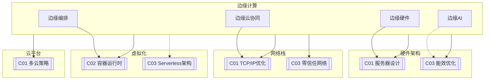

# C02 Edge Computing

**所属子领域**: [B01_Hardware_Arch](../README.md)  
**创建日期**: 2026-01-30  
**最后更新**: 2026-01-30

## 📋 主题定位

边缘计算（Edge Computing）是一种将计算、存储和网络资源部署在靠近数据源或用户的网络边缘的分布式计算范式。它通过在数据产生的源头附近处理数据，显著降低延迟、减少带宽消耗、增强隐私保护，并支持实时决策。

随着5G、物联网（IoT）、人工智能和自动驾驶等技术的发展，边缘计算已成为连接云中心与终端设备的关键技术层。从智能工厂的车间网关到自动驾驶汽车的 onboard 计算单元，从智慧城市的边缘节点到零售商店的AI摄像头，边缘计算正在重塑计算基础设施的拓扑结构。

本专题系统探讨边缘计算的架构设计、关键技术、部署实践以及典型应用场景，为构建高效、可靠、安全的边缘计算基础设施提供全面指导。

## 🎯 核心概念

### 基本定义

**边缘计算（Edge Computing）**: 在靠近数据源或用户的网络边缘侧，融合网络、计算、存储、应用核心能力的分布式开放平台，就近提供边缘智能服务。

**边缘节点（Edge Node）**: 部署在网络边缘的计算设备，可以是网关、服务器、工业PC或嵌入式设备，负责本地数据处理。

**多接入边缘计算（MEC, Multi-access Edge Computing）**: 3GPP和ETSI标准化的边缘计算架构，部署在移动通信网络边缘，为移动用户提供低延迟服务。

**雾计算（Fog Computing）**: 由Cisco提出的概念，强调云到设备之间的多层次计算，是边缘计算的扩展概念。

### 边缘计算架构层次

```
┌─────────────────────────────────────────────────────────────────────┐
│                         边缘计算架构全景                              │
├─────────────────────────────────────────────────────────────────────┤
│                                                                     │
│   ┌─────────────────────────────────────────────────────────────┐   │
│   │                     云层 (Cloud Layer)                       │   │
│   │  • 大规模数据中心 / 公有云 / 私有云                           │   │
│   │  • 长期数据存储 / 全局AI模型训练 / 集中管理                    │   │
│   │  • 高延迟容忍 / 高吞吐量 / 弹性计算                           │   │
│   └─────────────────────────────────────────────────────────────┘   │
│                              ↑↓ (WAN)                               │
│   ┌─────────────────────────────────────────────────────────────┐   │
│   │                   区域层 (Regional Layer)                    │   │
│   │  • 区域数据中心 / CDN节点 / 5G核心网                         │   │
│   │  • 区域内容分发 / 中间数据聚合 / 区域AI推理                   │   │
│   │  • 中等延迟 / 区域覆盖 / 数据汇聚                            │   │
│   └─────────────────────────────────────────────────────────────┘   │
│                              ↑↓ (Metro)                             │
│   ┌─────────────────────────────────────────────────────────────┐   │
│   │                    边缘层 (Edge Layer)                       │   │
│   │  • MEC服务器 / 边缘网关 / 本地数据中心                        │   │
│   │  • 实时数据处理 / 本地AI推理 / 设备管理                       │   │
│   │  • 低延迟 (<20ms) / 本地化计算 / 隐私保护                     │   │
│   └─────────────────────────────────────────────────────────────┘   │
│                              ↑↓ (LAN/5G)                            │
│   ┌─────────────────────────────────────────────────────────────┐   │
│   │                   现场层 (Far Edge/On-site)                  │   │
│   │  • 工业网关 / 智能摄像头 / 嵌入式设备 / 车载计算               │   │
│   │  • 毫秒级响应 / 协议转换 / 本地自治                           │   │
│   │  • 超低延迟 (<5ms) / 硬实时 / 离线运行                        │   │
│   └─────────────────────────────────────────────────────────────┘   │
│                              ↑↓ (Field Bus/WiFi/BLE)                │
│   ┌─────────────────────────────────────────────────────────────┐   │
│   │                   设备层 (Device Layer)                      │   │
│   │  • 传感器 / 执行器 / 智能终端 / 可穿戴设备                    │   │
│   │  • 数据采集 / 简单预处理 / 边缘协同                          │   │
│   │  • 资源受限 / 电池供电 / 多样协议                            │   │
│   └─────────────────────────────────────────────────────────────┘   │
│                                                                     │
└─────────────────────────────────────────────────────────────────────┘
```

### 边缘计算与云计算的对比

| 特性 | 云计算 (Cloud) | 边缘计算 (Edge) | 雾计算 (Fog) |
|-----|---------------|----------------|-------------|
| **延迟** | 50-200ms | 1-20ms | 5-50ms |
| **带宽需求** | 高（全量数据上传） | 低（本地处理，筛选上传） | 中 |
| **计算能力** | 几乎无限 | 有限但足够 | 中等 |
| **数据位置** | 集中数据中心 | 数据源附近 | 多层次分布 |
| **隐私安全** | 依赖传输加密 | 本地处理，数据不出场 | 分层安全 |
| **运维复杂度** | 统一管理 | 分布式管理挑战 | 中等 |
| **适用场景** | 批处理、大数据分析 | 实时响应、本地自治 | 混合场景 |

### 边缘计算关键技术

**1. 边缘计算硬件形态**

| 形态 | 特点 | 典型应用 |
|-----|------|---------|
| **边缘服务器** | 标准机架式，性能强大 | 区域数据中心，MEC |
| **工业网关** | 工业级可靠性，多协议支持 | 智能制造，工业4.0 |
| **嵌入式设备** | 低功耗，紧凑设计 | 智能摄像头，无人机 |
| **车载计算单元** | 车规级，高可靠性 | 自动驾驶，智能座舱 |
| **智能NIC/DPU** | 网络卸载，硬件加速 | 高性能边缘网关 |
| **边缘AI芯片** | 低功耗AI推理 | 智能IoT设备 |

**2. 边缘AI与模型优化**

```
┌────────────────────────────────────────────────────────────────┐
│                     边缘AI模型优化技术栈                          │
├────────────────────────────────────────────────────────────────┤
│                                                                │
│  模型压缩                                                      │
│  ├── 量化 (Quantization)                                       │
│  │   ├── INT8 量化 - 减少4x内存，加速2-4x                      │
│  │   ├── INT4/二值化 - 极端压缩                                │
│  │   └── 混合精度 - 精度与效率平衡                             │
│  ├── 剪枝 (Pruning)                                            │
│  │   ├── 结构化剪枝 - 移除整个通道                             │
│  │   └── 非结构化剪枝 - 稀疏化权重                             │
│  └── 知识蒸馏 (Knowledge Distillation)                         │
│      └── 大模型 → 小模型迁移知识                               │
│                                                                │
│  编译优化                                                      │
│  ├── TensorRT (NVIDIA)                                         │
│  ├── ONNX Runtime                                              │
│  ├── OpenVINO (Intel)                                          │
│  ├── TFLite (Google)                                           │
│  └── MNN/NCNN (移动端优化)                                     │
│                                                                │
│  硬件加速                                                      │
│  ├── GPU (CUDA/OpenCL)                                         │
│  ├── NPU/TPU (专用AI芯片)                                      │
│  ├── FPGA (可编程加速)                                         │
│  └── DSP (数字信号处理)                                        │
│                                                                │
└────────────────────────────────────────────────────────────────┘
```

**3. 边缘编排与容器化**

```yaml
# 边缘容器编排特点
边缘容器化:
  挑战:
    - 资源受限: CPU/内存/存储有限
    - 网络不稳定: 间歇性连接
    - 异构硬件: ARM/x86/GPU等多样架构
    - 安全边界: 物理可接触性风险
    
  解决方案:
    K3s:
      描述: 轻量级Kubernetes发行版
      特点:
        - 单二进制文件 (<100MB)
        - 低内存占用 (<512MB运行)
        - 内置sqlite替代etcd
        - 支持ARM/ARM64
        
    KubeEdge:
      描述: Kubernetes原生边缘计算框架
      特点:
        - 云边协同架构
        - 边缘自治能力
        - 设备管理插件
        - 边缘-云同步
        
    OpenYurt:
      描述: 阿里云开源的边缘Kubernetes
      特点:
        - 零侵入扩展
        - 边缘单元化
        - 节点池治理
        
    SuperEdge:
      描述: 腾讯云开源边缘容器
      特点:
        - 分布式健康检查
        - 边缘隧道网络
        - 边缘 Ingress
```

### 5G MEC架构详解

```
┌─────────────────────────────────────────────────────────────────────┐
│                        5G MEC 系统架构                               │
├─────────────────────────────────────────────────────────────────────┤
│                                                                     │
│  ┌───────────────────────────────────────────────────────────────┐  │
│  │                      5G Core Network                           │  │
│  │  ┌──────────────┐  ┌──────────────┐  ┌──────────────────────┐│  │
│  │  │     AMF      │  │     SMF      │  │        UPF           ││  │
│  │  │ 接入管理功能  │  │ 会话管理功能  │  │ 用户面功能           ││  │
│  │  └──────────────┘  └──────────────┘  └──────────────────────┘│  │
│  │         ↑                   ↑                    ↑            │  │
│  └─────────┼───────────────────┼────────────────────┼────────────┘  │
│            │                   │                    │               │
│            └───────────────────┴────────────────────┘               │
│                         N6接口 (数据面)                              │
│                              ↓                                      │
│  ┌───────────────────────────────────────────────────────────────┐  │
│  │                      MEC Platform                              │  │
│  │  ┌──────────────┐  ┌──────────────┐  ┌──────────────────────┐│  │
│  │  │  MEPM        │  │  MEP         │  │  MEC Applications    ││  │
│  │  │ 平台管理器    │  │ 平台实体      │  │  ├─AI推理服务        ││  │
│  │  │              │  │              │  │  ├─视频分析          ││  │
│  │  │              │  │  ├─服务注册   │  │  ├─IoT网关           ││  │
│  │  │              │  │  ├─流量规则   │  │  ├─CDN缓存           ││  │
│  │  │              │  │  └─DNS管理    │  │  └─游戏服务器        ││  │
│  │  └──────────────┘  └──────────────┘  └──────────────────────┘│  │
│  │                                                                │  │
│  │  能力开放: Location API │ QoS API │ Bandwidth Mgmt │ AF API   │  │
│  └───────────────────────────────────────────────────────────────┘  │
│                              ↓                                      │
│  ┌───────────────────────────────────────────────────────────────┐  │
│  │                    RAN (无线接入网)                             │  │
│  │         gNB (5G基站) ──────── UE (用户设备)                    │  │
│  │                                                                │  │
│  │  MEC部署选项:                                                  │  │
│  │  • 选项1: 共址部署 (MEP与gNB同机房)                             │  │
│  │  • 选项2: 边缘DC (接入汇聚点)                                   │  │
│  │  • 选项3: 区域DC (多个基站汇聚)                                 │  │
│  └───────────────────────────────────────────────────────────────┘  │
│                                                                     │
└─────────────────────────────────────────────────────────────────────┘
```

## 🛠️ 技术实践

### 边缘设备选型与配置

**1. 边缘设备性能对比**

| 设备 | CPU | GPU/NPU | 内存 | 功耗 | 适用场景 |
|-----|-----|---------|------|------|---------|
| **NVIDIA Jetson Nano** | Quad-core ARM | 128-core Maxwell | 4GB | 5-10W | 入门级AI |
| **NVIDIA Jetson Orin** | 12-core ARM | 2048-core Ampere | 32GB | 15-60W | 高级边缘AI |
| **Intel NUC** | x86 Core i5/i7 | Intel Iris Xe | 32GB+ | 65W | 通用边缘服务器 |
| **Raspberry Pi 5** | Quad-core ARM | VideoCore VII | 8GB | 5-8W | 轻量级网关 |
| **Coral Dev Board** | Quad-core ARM | Edge TPU | 1GB | 3W | 专用推理 |
| **AWS Panorama** | Intel Atom | NVIDIA Jetson | 8GB | 25W | 工业视觉 |

**2. 边缘网关配置脚本**

```bash
#!/bin/bash
# 边缘网关初始化配置脚本
# 适用于工业边缘网关设备

set -e

# 配置参数
EDGE_NODE_ID="edge-$(cat /sys/class/net/eth0/address | tr -d ':')"
EDGE_LOCATION="factory-floor-1"
CLOUD_ENDPOINT="mqtt.cloud-platform.example.com"

# 1. 系统基础配置
setup_edge_system() {
    echo "=== 配置边缘节点基础 ==="
    
    # 设置主机名
    hostnamectl set-hostname "$EDGE_NODE_ID"
    
    # 配置时区
    timedatectl set-timezone Asia/Shanghai
    
    # 启用硬件看门狗
    modprobe softdog
    echo 'softdog' >> /etc/modules
    
    # 配置日志限制（边缘存储有限）
    cat > /etc/systemd/journald.conf << 'EOF'
[Journal]
SystemMaxUse=500M
SystemMaxFileSize=50M
MaxFileSec=7day
EOF
    systemctl restart systemd-journald
}

# 2. 网络优化（边缘网络不稳定）
configure_edge_network() {
    echo "=== 配置边缘网络优化 ==="
    
    cat > /etc/sysctl.d/99-edge-network.conf << 'EOF'
# 边缘网络优化
net.ipv4.tcp_keepalive_time = 60
net.ipv4.tcp_keepalive_intvl = 10
net.ipv4.tcp_keepalive_probes = 6

# 快速回收失效连接
net.ipv4.tcp_tw_reuse = 1
net.ipv4.tcp_fin_timeout = 10

# 更大的缓冲区（应对间歇性高带宽）
net.core.rmem_max = 16777216
net.core.wmem_max = 16777216
net.ipv4.tcp_rmem = 4096 87380 16777216
net.ipv4.tcp_wmem = 4096 65536 16777216

# MQTT优化
net.ipv4.tcp_notsent_lowat = 16384
EOF
    
    sysctl --system
    
    # 配置双网卡（上行/下行分离）
    cat > /etc/netplan/01-edge-network.yaml << EOF
network:
  version: 2
  ethernets:
    eth0:
      dhcp4: true
      dhcp4-overrides:
        route-metric: 100
      nameservers:
        addresses: [8.8.8.8, 114.114.114.114]
    eth1:
      addresses:
        - 192.168.100.1/24
      nameservers:
        addresses: [192.168.100.1]
EOF
    netplan apply
}

# 3. 安装边缘运行时
install_edge_runtime() {
    echo "=== 安装边缘运行时 ==="
    
    # 安装Docker
    curl -fsSL https://get.docker.com | sh
    systemctl enable docker
    systemctl start docker
    
    # 安装K3s (轻量级Kubernetes)
    curl -sfL https://get.k3s.io | INSTALL_K3S_EXEC="server --disable traefik --write-kubeconfig-mode 644" sh -
    
    # 安装MQTT Broker (本地消息总线)
    docker run -d \
        --name mosquitto \
        --restart always \
        -p 1883:1883 \
        -p 9001:9001 \
        -v /opt/mosquitto:/mosquitto \
        eclipse-mosquitto
    
    # 安装Node-RED (流式处理)
    docker run -d \
        --name nodered \
        --restart always \
        -p 1880:1880 \
        -v /opt/nodered:/data \
        nodered/node-red
}

# 4. 配置边缘AI运行时（NVIDIA设备）
setup_edge_ai() {
    echo "=== 配置边缘AI环境 ==="
    
    # 安装JetPack (Jetson设备)
    if [ -f /etc/nv_tegra_release ]; then
        # 安装TensorRT
        apt-get update
        apt-get install -y tensorrt python3-libnvinfer-dev
        
        # 安装PyTorch (ARM版本)
        pip3 install torch torchvision torchaudio --index-url https://download.pytorch.org/whl/cpu
        
        # 配置Jetson时钟和功耗模式
        jetson_clocks
        nvpmodel -m 0  # 最大功率模式
    fi
    
    # 安装Edge TPU Runtime (Coral设备)
    if [ -d /sys/bus/usb/devices ]; then
        echo "deb https://packages.cloud.google.com/apt coral-edgetpu-stable main" | tee /etc/apt/sources.list.d/coral-edgetpu.list
        curl https://packages.cloud.google.com/apt/doc/apt-key.gpg | apt-key add -
        apt-get update
        apt-get install -y libedgetpu1-std python3-pycoral
    fi
}

# 5. 配置边缘数据采集
setup_data_collection() {
    echo "=== 配置数据采集 ==="
    
    # 安装Telegraf
    curl -s https://repos.influxdata.com/influxdata-archive_compat.key | apt-key add -
    echo "deb https://repos.influxdata.com/debian stable main" | tee /etc/apt/sources.list.d/influxdb.list
    apt-get update && apt-get install -y telegraf
    
    # 配置Telegraf
    cat > /etc/telegraf/telegraf.conf << EOF
[agent]
  interval = "10s"
  flush_interval = "10s"

[[inputs.cpu]]
[[inputs.mem]]
[[inputs.disk]]
[[inputs.diskio]]
[[inputs.net]]
[[inputs.temp]]

[[outputs.mqtt]]
  servers = ["$CLOUD_ENDPOINT:1883"]
  topic_prefix = "edge/$EDGE_NODE_ID/metrics"
  data_format = "json"
EOF
    
    systemctl enable telegraf
    systemctl start telegraf
}

# 6. 配置离线自治能力
setup_offline_autonomy() {
    echo "=== 配置离线自治能力 ==="
    
    # 本地规则引擎
    mkdir -p /opt/edge-rules
    cat > /opt/edge-rules/local-controller.py << 'PYTHON'
#!/usr/bin/env python3
"""边缘本地自治控制器"""

import json
import paho.mqtt.client as mqtt
from datetime import datetime

class LocalController:
    def __init__(self):
        self.rules = []
        self.cloud_connected = False
        
    def load_rules(self):
        """加载本地规则"""
        try:
            with open('/opt/edge-rules/rules.json') as f:
                self.rules = json.load(f)
        except:
            self.rules = []
    
    def evaluate_rules(self, sensor_data):
        """评估规则并执行动作"""
        for rule in self.rules:
            if self._check_condition(rule['condition'], sensor_data):
                self._execute_action(rule['action'])
    
    def _check_condition(self, condition, data):
        """检查条件是否满足"""
        sensor = condition.get('sensor')
        threshold = condition.get('threshold')
        operator = condition.get('operator', '>')
        
        value = data.get(sensor)
        if value is None:
            return False
        
        if operator == '>':
            return value > threshold
        elif operator == '<':
            return value < threshold
        return False
    
    def _execute_action(self, action):
        """执行动作"""
        print(f"[LOCAL] 执行动作: {action}")
        # 控制本地执行器
        # 记录本地事件
        with open('/opt/edge-rules/events.log', 'a') as f:
            f.write(f"{datetime.now()}: {json.dumps(action)}\n")

if __name__ == '__main__':
    controller = LocalController()
    controller.load_rules()
    print("本地自治控制器已启动")
PYTHON
    
    chmod +x /opt/edge-rules/local-controller.py
    
    # 创建systemd服务
    cat > /etc/systemd/system/edge-controller.service << 'EOF'
[Unit]
Description=Edge Local Controller
After=network.target

[Service]
Type=simple
ExecStart=/usr/bin/python3 /opt/edge-rules/local-controller.py
Restart=always

[Install]
WantedBy=multi-user.target
EOF
    
    systemctl daemon-reload
    systemctl enable edge-controller
}

# 7. 安全加固
harden_edge_security() {
    echo "=== 边缘安全加固 ==="
    
    # 配置防火墙（仅允许必要端口）
    ufw default deny incoming
    ufw default allow outgoing
    ufw allow 22/tcp      # SSH
    ufw allow 1883/tcp    # MQTT
    ufw allow 6443/tcp    # K3s API
    ufw allow from 192.168.100.0/24  # 本地设备网段
    ufw --force enable
    
    # 配置fail2ban
    apt-get install -y fail2ban
    
    # 禁用root SSH登录
    sed -i 's/#PermitRootLogin yes/PermitRootLogin no/' /etc/ssh/sshd_config
    systemctl restart sshd
    
    # 配置自动安全更新
    apt-get install -y unattended-upgrades
}

# 主执行流程
main() {
    setup_edge_system
    configure_edge_network
    install_edge_runtime
    setup_edge_ai
    setup_data_collection
    setup_offline_autonomy
    harden_edge_security
    
    echo "=== 边缘网关配置完成 ==="
    echo "节点ID: $EDGE_NODE_ID"
    echo "请检查各项服务状态"
}

main "$@"
```

### 边缘AI应用开发

**1. 边缘AI推理服务（Python + TFLite）**

```python
#!/usr/bin/env python3
"""
边缘AI推理服务
支持模型热更新、批量推理、本地缓存
"""

import os
import time
import json
import logging
from pathlib import Path
from typing import Dict, List, Optional, Tuple
from dataclasses import dataclass
from datetime import datetime
import threading
import queue

import numpy as np

# 条件导入推理引擎
try:
    import tflite_runtime.interpreter as tflite
    TFLITE_AVAILABLE = True
except ImportError:
    TFLITE_AVAILABLE = False

try:
    import tensorrt as trt
    import pycuda.driver as cuda
    import pycuda.autoinit
    TRT_AVAILABLE = True
except ImportError:
    TRT_AVAILABLE = False


@dataclass
class InferenceResult:
    """推理结果"""
    model_name: str
    prediction: np.ndarray
    confidence: float
    inference_time_ms: float
    timestamp: datetime
    metadata: Dict


class EdgeInferenceEngine:
    """边缘推理引擎"""
    
    def __init__(self, model_dir: str = "/opt/edge-models"):
        self.model_dir = Path(model_dir)
        self.model_dir.mkdir(exist_ok=True)
        
        self.models: Dict[str, any] = {}
        self.model_info: Dict[str, Dict] = {}
        self.batch_queue: queue.Queue = queue.Queue(maxsize=100)
        self.is_running = False
        
        self.logger = logging.getLogger(__name__)
        
        # 性能统计
        self.stats = {
            'total_inferences': 0,
            'total_latency_ms': 0,
            'errors': 0
        }
    
    def load_model(self, model_name: str, model_type: str = "tflite") -> bool:
        """加载模型"""
        model_path = self.model_dir / f"{model_name}.{model_type}"
        
        if not model_path.exists():
            self.logger.error(f"模型文件不存在: {model_path}")
            return False
        
        try:
            if model_type == "tflite" and TFLITE_AVAILABLE:
                interpreter = tflite.Interpreter(model_path=str(model_path))
                interpreter.allocate_tensors()
                
                self.models[model_name] = interpreter
                self.model_info[model_name] = {
                    'type': 'tflite',
                    'input_details': interpreter.get_input_details(),
                    'output_details': interpreter.get_output_details(),
                    'loaded_at': datetime.now()
                }
                
            elif model_type == "trt" and TRT_AVAILABLE:
                # TensorRT模型加载
                logger = trt.Logger(trt.Logger.WARNING)
                runtime = trt.Runtime(logger)
                
                with open(model_path, 'rb') as f:
                    engine = runtime.deserialize_cuda_engine(f.read())
                
                self.models[model_name] = engine
                self.model_info[model_name] = {
                    'type': 'tensorrt',
                    'loaded_at': datetime.now()
                }
            
            self.logger.info(f"模型加载成功: {model_name}")
            return True
            
        except Exception as e:
            self.logger.error(f"模型加载失败: {e}")
            return False
    
    def infer(self, 
              model_name: str, 
              input_data: np.ndarray,
              batch_size: int = 1) -> Optional[InferenceResult]:
        """执行推理"""
        start_time = time.time()
        
        try:
            model = self.models.get(model_name)
            if model is None:
                raise ValueError(f"模型未加载: {model_name}")
            
            model_type = self.model_info[model_name]['type']
            
            if model_type == 'tflite':
                result = self._infer_tflite(model, input_data)
            elif model_type == 'tensorrt':
                result = self._infer_tensorrt(model, input_data)
            else:
                raise ValueError(f"不支持的模型类型: {model_type}")
            
            inference_time = (time.time() - start_time) * 1000
            
            # 更新统计
            self.stats['total_inferences'] += 1
            self.stats['total_latency_ms'] += inference_time
            
            return InferenceResult(
                model_name=model_name,
                prediction=result['prediction'],
                confidence=result.get('confidence', 0.0),
                inference_time_ms=inference_time,
                timestamp=datetime.now(),
                metadata={
                    'model_type': model_type,
                    'batch_size': batch_size,
                    'input_shape': input_data.shape
                }
            )
            
        except Exception as e:
            self.stats['errors'] += 1
            self.logger.error(f"推理失败: {e}")
            return None
    
    def _infer_tflite(self, interpreter, input_data: np.ndarray) -> Dict:
        """TFLite推理"""
        input_details = interpreter.get_input_details()
        output_details = interpreter.get_output_details()
        
        # 准备输入
        input_shape = input_details[0]['shape']
        if input_data.shape != tuple(input_shape):
            input_data = np.resize(input_data, input_shape)
        
        # 设置输入
        interpreter.set_tensor(input_details[0]['index'], input_data.astype(np.float32))
        
        # 执行推理
        interpreter.invoke()
        
        # 获取输出
        output = interpreter.get_tensor(output_details[0]['index'])
        
        return {
            'prediction': output,
            'confidence': float(np.max(output))
        }
    
    def _infer_tensorrt(self, engine, input_data: np.ndarray) -> Dict:
        """TensorRT推理"""
        context = engine.create_execution_context()
        
        # 分配内存
        d_input = cuda.mem_alloc(input_data.nbytes)
        output = np.empty(engine.get_binding_shape(1), dtype=np.float32)
        d_output = cuda.mem_alloc(output.nbytes)
        
        # 数据传输
        cuda.memcpy_htod(d_input, input_data)
        
        # 执行
        context.execute_v2([int(d_input), int(d_output)])
        
        # 获取结果
        cuda.memcpy_dtoh(output, d_output)
        
        return {
            'prediction': output,
            'confidence': float(np.max(output))
        }
    
    def batch_infer(self, 
                    model_name: str,
                    requests: List[Dict]) -> List[InferenceResult]:
        """批量推理（提高吞吐量）"""
        results = []
        
        # 批量准备数据
        batch_data = np.stack([r['input'] for r in requests])
        
        # 执行批量推理
        result = self.infer(model_name, batch_data, batch_size=len(requests))
        
        if result:
            # 拆分结果
            for i, req in enumerate(requests):
                results.append(InferenceResult(
                    model_name=model_name,
                    prediction=result.prediction[i],
                    confidence=float(result.prediction[i].max()),
                    inference_time_ms=result.inference_time_ms / len(requests),
                    timestamp=result.timestamp,
                    metadata={**result.metadata, 'request_id': req.get('id')}
                ))
        
        return results
    
    def get_stats(self) -> Dict:
        """获取统计信息"""
        total = self.stats['total_inferences']
        avg_latency = (self.stats['total_latency_ms'] / total 
                      if total > 0 else 0)
        
        return {
            'total_inferences': total,
            'average_latency_ms': round(avg_latency, 2),
            'error_rate': round(self.stats['errors'] / (total + 1e-10) * 100, 2),
            'loaded_models': list(self.models.keys()),
            'uptime_seconds': time.time() - getattr(self, '_start_time', time.time())
        }
    
    def start_batch_service(self, model_name: str, max_batch_size: int = 8):
        """启动批量推理服务"""
        self.is_running = True
        self._start_time = time.time()
        
        def batch_processor():
            while self.is_running:
                batch = []
                timeout = 0.01  # 10ms超时
                
                # 收集批量请求
                try:
                    while len(batch) < max_batch_size:
                        item = self.batch_queue.get(timeout=timeout)
                        batch.append(item)
                        timeout = 0.001  # 后续请求更短的等待
                except queue.Empty:
                    pass
                
                if batch:
                    results = self.batch_infer(model_name, batch)
                    # 分发结果
                    for i, result in enumerate(results):
                        if i < len(batch) and 'callback' in batch[i]:
                            batch[i]['callback'](result)
        
        thread = threading.Thread(target=batch_processor, daemon=True)
        thread.start()
        self.logger.info(f"批量推理服务已启动: {model_name}")


# 边缘AI应用示例
class EdgeAIApplication:
    """边缘AI应用封装"""
    
    def __init__(self):
        self.engine = EdgeInferenceEngine()
        
    def init_object_detection(self):
        """初始化目标检测应用"""
        # 加载MobileNet SSD模型
        self.engine.load_model("mobilenet_ssd", "tflite")
        self.engine.start_batch_service("mobilenet_ssd", max_batch_size=4)
        
    def init_anomaly_detection(self):
        """初始化异常检测应用"""
        # 加载自编码器模型
        self.engine.load_model("autoencoder", "tflite")
    
    def process_video_frame(self, frame: np.ndarray) -> Dict:
        """处理视频帧"""
        # 预处理
        input_data = self._preprocess_frame(frame)
        
        # 提交到批量队列
        result_event = threading.Event()
        result_container = {}
        
        def callback(result):
            result_container['result'] = result
            result_event.set()
        
        self.engine.batch_queue.put({
            'input': input_data,
            'callback': callback
        })
        
        # 等待结果（设置超时）
        if result_event.wait(timeout=5.0):
            return self._postprocess_detection(result_container['result'])
        else:
            return {'error': '推理超时'}
    
    def _preprocess_frame(self, frame: np.ndarray) -> np.ndarray:
        """帧预处理"""
        # 调整大小、归一化等
        resized = np.resize(frame, (300, 300, 3))
        normalized = resized / 255.0
        return np.expand_dims(normalized, axis=0).astype(np.float32)
    
    def _postprocess_detection(self, result: InferenceResult) -> Dict:
        """检测结果后处理"""
        predictions = result.prediction
        
        detections = []
        # 解析检测框
        for i in range(predictions.shape[1]):
            confidence = predictions[0, i, 2]
            if confidence > 0.5:
                detections.append({
                    'class_id': int(predictions[0, i, 1]),
                    'confidence': float(confidence),
                    'bbox': predictions[0, i, 3:7].tolist()
                })
        
        return {
            'detections': detections,
            'inference_time_ms': result.inference_time_ms,
            'timestamp': result.timestamp.isoformat()
        }


if __name__ == '__main__':
    # 测试代码
    logging.basicConfig(level=logging.INFO)
    
    app = EdgeAIApplication()
    app.init_object_detection()
    
    # 模拟推理
    test_frame = np.random.rand(480, 640, 3) * 255
    result = app.process_video_frame(test_frame.astype(np.uint8))
    print(f"检测结果: {result}")
    
    # 打印统计
    print(f"引擎统计: {app.engine.get_stats()}")
```

**2. 边缘-云协同数据同步**

```python
#!/usr/bin/env python3
"""
边缘-云协同数据同步模块
支持断点续传、数据压缩、优先级队列
"""

import json
import gzip
import queue
import threading
import time
from dataclasses import dataclass, asdict
from datetime import datetime
from enum import IntEnum
from pathlib import Path
import sqlite3
from typing import Optional

import paho.mqtt.client as mqtt


class Priority(IntEnum):
    """数据优先级"""
    CRITICAL = 0    # 告警、异常
    HIGH = 1        # 重要业务数据
    NORMAL = 2      # 常规数据
    LOW = 3         # 日志、统计


@dataclass
class DataPacket:
    """数据包"""
    id: str
    timestamp: datetime
    priority: Priority
    data_type: str
    payload: bytes
    compressed: bool = False
    retry_count: int = 0
    
    def to_bytes(self) -> bytes:
        """序列化"""
        data = {
            'id': self.id,
            'timestamp': self.timestamp.isoformat(),
            'priority': self.priority.value,
            'data_type': self.data_type,
            'payload': self.payload.decode('latin-1'),
            'compressed': self.compressed
        }
        return json.dumps(data).encode()
    
    @classmethod
    def from_bytes(cls, data: bytes) -> 'DataPacket':
        """反序列化"""
        obj = json.loads(data)
        return cls(
            id=obj['id'],
            timestamp=datetime.fromisoformat(obj['timestamp']),
            priority=Priority(obj['priority']),
            data_type=obj['data_type'],
            payload=obj['payload'].encode('latin-1'),
            compressed=obj['compressed']
        )


class LocalStorage:
    """本地持久化存储（SQLite）"""
    
    def __init__(self, db_path: str = "/opt/edge-data/sync.db"):
        self.db_path = Path(db_path)
        self.db_path.parent.mkdir(parents=True, exist_ok=True)
        self._init_db()
    
    def _init_db(self):
        """初始化数据库"""
        with sqlite3.connect(self.db_path) as conn:
            conn.execute('''
                CREATE TABLE IF NOT EXISTS pending_packets (
                    id TEXT PRIMARY KEY,
                    timestamp TEXT,
                    priority INTEGER,
                    data_type TEXT,
                    payload BLOB,
                    compressed INTEGER,
                    retry_count INTEGER DEFAULT 0,
                    created_at TEXT DEFAULT CURRENT_TIMESTAMP
                )
            ''')
            conn.execute('''
                CREATE INDEX IF NOT EXISTS idx_priority 
                ON pending_packets(priority, timestamp)
            ''')
    
    def save(self, packet: DataPacket):
        """保存数据包"""
        with sqlite3.connect(self.db_path) as conn:
            conn.execute('''
                INSERT OR REPLACE INTO pending_packets 
                (id, timestamp, priority, data_type, payload, compressed, retry_count)
                VALUES (?, ?, ?, ?, ?, ?, ?)
            ''', (
                packet.id,
                packet.timestamp.isoformat(),
                packet.priority.value,
                packet.data_type,
                packet.payload,
                int(packet.compressed),
                packet.retry_count
            ))
    
    def load_pending(self, limit: int = 100) -> list:
        """加载待发送数据"""
        with sqlite3.connect(self.db_path) as conn:
            cursor = conn.execute('''
                SELECT * FROM pending_packets 
                ORDER BY priority ASC, timestamp ASC 
                LIMIT ?
            ''', (limit,))
            
            packets = []
            for row in cursor:
                packets.append(DataPacket(
                    id=row[0],
                    timestamp=datetime.fromisoformat(row[1]),
                    priority=Priority(row[2]),
                    data_type=row[3],
                    payload=row[4],
                    compressed=bool(row[5]),
                    retry_count=row[6]
                ))
            return packets
    
    def delete(self, packet_id: str):
        """删除已发送数据"""
        with sqlite3.connect(self.db_path) as conn:
            conn.execute('DELETE FROM pending_packets WHERE id = ?', (packet_id,))
    
    def increment_retry(self, packet_id: str):
        """增加重试计数"""
        with sqlite3.connect(self.db_path) as conn:
            conn.execute('''
                UPDATE pending_packets 
                SET retry_count = retry_count + 1 
                WHERE id = ?
            ''', (packet_id,))
    
    def cleanup_old(self, days: int = 7):
        """清理过期数据"""
        with sqlite3.connect(self.db_path) as conn:
            conn.execute('''
                DELETE FROM pending_packets 
                WHERE created_at < datetime('now', '-{} days')
            '''.format(days))


class EdgeCloudSync:
    """边缘云同步管理器"""
    
    def __init__(self, 
                 cloud_endpoint: str,
                 device_id: str,
                 compress_threshold: int = 1024):
        self.cloud_endpoint = cloud_endpoint
        self.device_id = device_id
        self.compress_threshold = compress_threshold
        
        self.local_storage = LocalStorage()
        self.mqtt_client: Optional[mqtt.Client] = None
        self.is_connected = False
        
        # 优先级队列（内存中）
        self.mem_queue = queue.PriorityQueue(maxsize=10000)
        
        # 统计
        self.stats = {
            'sent': 0,
            'queued': 0,
            'failed': 0,
            'bytes_sent': 0
        }
        
        self._stop_event = threading.Event()
    
    def connect(self):
        """连接云平台"""
        self.mqtt_client = mqtt.Client(client_id=f"edge-{self.device_id}")
        
        def on_connect(client, userdata, flags, rc):
            if rc == 0:
                self.is_connected = True
                print(f"已连接到云平台: {self.cloud_endpoint}")
                # 订阅云端命令
                client.subscribe(f"cloud/{self.device_id}/cmd")
            else:
                print(f"连接失败，返回码: {rc}")
        
        def on_disconnect(client, userdata, rc):
            self.is_connected = False
            print(f"与云平台断开连接: {rc}")
        
        def on_message(client, userdata, msg):
            # 处理云端命令
            print(f"收到云端命令: {msg.topic} - {msg.payload}")
        
        self.mqtt_client.on_connect = on_connect
        self.mqtt_client.on_disconnect = on_disconnect
        self.mqtt_client.on_message = on_message
        
        # 配置重连
        self.mqtt_client.reconnect_delay_set(min_delay=1, max_delay=60)
        
        # 连接（异步）
        self.mqtt_client.connect_async(self.cloud_endpoint, 1883, keepalive=60)
        self.mqtt_client.loop_start()
    
    def publish(self, 
                data: dict,
                data_type: str = "telemetry",
                priority: Priority = Priority.NORMAL,
                compress: bool = True):
        """发布数据"""
        # 序列化
        payload = json.dumps(data).encode()
        original_size = len(payload)
        
        # 压缩（如果启用且超过阈值）
        is_compressed = False
        if compress and original_size > self.compress_threshold:
            payload = gzip.compress(payload)
            is_compressed = True
        
        packet = DataPacket(
            id=f"{self.device_id}-{int(time.time()*1000)}",
            timestamp=datetime.now(),
            priority=priority,
            data_type=data_type,
            payload=payload,
            compressed=is_compressed
        )
        
        # 高优先级直接尝试发送
        if priority == Priority.CRITICAL and self.is_connected:
            if self._send_packet(packet):
                return
        
        # 否则加入队列
        try:
            self.mem_queue.put((priority.value, packet), block=False)
            self.stats['queued'] += 1
        except queue.Full:
            # 内存队列满，持久化到本地存储
            self.local_storage.save(packet)
    
    def _send_packet(self, packet: DataPacket) -> bool:
        """发送单个数据包"""
        if not self.is_connected or not self.mqtt_client:
            return False
        
        try:
            topic = f"edge/{self.device_id}/{packet.data_type}"
            payload = packet.to_bytes()
            
            # 根据优先级设置QoS
            qos = 0 if packet.priority == Priority.LOW else 1
            if packet.priority == Priority.CRITICAL:
                qos = 2
            
            result = self.mqtt_client.publish(topic, payload, qos=qos)
            
            if result.rc == mqtt.MQTT_ERR_SUCCESS:
                self.stats['sent'] += 1
                self.stats['bytes_sent'] += len(payload)
                return True
            else:
                return False
                
        except Exception as e:
            print(f"发送失败: {e}")
            return False
    
    def start_sync_worker(self):
        """启动同步工作线程"""
        def sync_loop():
            while not self._stop_event.is_set():
                if self.is_connected:
                    # 1. 优先处理内存队列
                    try:
                        _, packet = self.mem_queue.get(timeout=0.1)
                        if not self._send_packet(packet):
                            # 发送失败，持久化到本地
                            packet.retry_count += 1
                            self.local_storage.save(packet)
                            self.stats['failed'] += 1
                        continue
                    except queue.Empty:
                        pass
                    
                    # 2. 处理本地存储的积压数据
                    pending = self.local_storage.load_pending(limit=10)
                    for packet in pending:
                        if self._send_packet(packet):
                            self.local_storage.delete(packet.id)
                        else:
                            self.local_storage.increment_retry(packet.id)
                            break  # 连接可能有问题，等待下次循环
                
                time.sleep(0.1)
        
        thread = threading.Thread(target=sync_loop, daemon=True)
        thread.start()
        print("同步工作线程已启动")
    
    def get_stats(self) -> dict:
        """获取统计信息"""
        return {
            **self.stats,
            'is_connected': self.is_connected,
            'queue_size': self.mem_queue.qsize(),
            'storage_pending': len(self.local_storage.load_pending(limit=999999))
        }
    
    def stop(self):
        """停止同步服务"""
        self._stop_event.set()
        if self.mqtt_client:
            self.mqtt_client.loop_stop()
            self.mqtt_client.disconnect()


# 使用示例
if __name__ == '__main__':
    sync = EdgeCloudSync(
        cloud_endpoint="mqtt.example.com",
        device_id="edge-001"
    )
    
    sync.connect()
    sync.start_sync_worker()
    
    # 模拟数据上报
    for i in range(100):
        sync.publish(
            data={
                'temperature': 25 + i % 10,
                'humidity': 60 + i % 20,
                'timestamp': datetime.now().isoformat()
            },
            data_type="sensors",
            priority=Priority.NORMAL
        )
        time.sleep(0.1)
    
    # 发送高优先级告警
    sync.publish(
        data={'alert': 'temperature_critical', 'value': 85},
        data_type="alerts",
        priority=Priority.CRITICAL
    )
    
    print(f"同步统计: {sync.get_stats()}")
    
    time.sleep(5)
    sync.stop()
```

## 📚 资源索引

### 边缘计算标准与规范

| 标准组织 | 规范名称 | 说明 |
|---------|---------|------|
| **ETSI** | MEC标准系列 (GS MEC 003-011) | 多接入边缘计算框架 |
| **3GPP** | TS 23.501/23.502 | 5G系统架构中的边缘计算 |
| **IEC** | IEC 61499 | 分布式工业自动化 |
| **IEEE** | IEEE 1934 | Fog Computing参考架构 |
| **LF Edge** | Akraino/EdgeX Foundry | 开源边缘计算框架 |

### 开源项目与平台

| 项目 | 类型 | 链接 | 说明 |
|-----|------|------|------|
| **KubeEdge** | 边缘编排 | [kubeedge.io](https://kubeedge.io) | Kubernetes原生边缘框架 |
| **EdgeX Foundry** | IoT平台 | [edgexfoundry.org](https://www.edgexfoundry.org) | 通用边缘IoT平台 |
| **K3s** | 轻量级K8s | [k3s.io](https://k3s.io) | 边缘Kubernetes发行版 |
| **OpenYurt** | 边缘容器 | [openyurt.io](https://openyurt.io) | 阿里云开源边缘容器 |
| **Akraino** | 边缘堆栈 | [akraino.org](https://www.akraino.org) | LF Edge蓝图项目 |
| **Eclipse ioFog** | 边缘平台 | [iofog.org](https://iofog.org) | Eclipse边缘计算平台 |
| **Baidu Edge Computing** | 商业平台 | [bce.baidu.com](https://bce.baidu.com) | 百度智能云边缘计算 |
| **AWS IoT Greengrass** | 商业平台 | [aws.amazon.com/greengrass](https://aws.amazon.com/greengrass/) | AWS边缘计算服务 |
| **Azure IoT Edge** | 商业平台 | [azure.microsoft.com/iotedge](https://azure.microsoft.com/services/iot-edge/) | Azure边缘计算 |

### 边缘AI框架与工具

| 框架 | 厂商 | 适用平台 | 说明 |
|-----|------|---------|------|
| **TensorRT** | NVIDIA | Jetson, GPU | 高性能推理优化 |
| **OpenVINO** | Intel | x86, Movidius | Intel设备优化 |
| **TFLite** | Google | ARM, MCU | 移动端/嵌入式推理 |
| **ONNX Runtime** | Microsoft | 跨平台 | 通用推理引擎 |
| **NCNN** | Tencent | ARM | 移动端高性能 |
| **MNN** | Alibaba | 跨平台 | 轻量推理引擎 |
| **Paddle Lite** | Baidu | ARM, FPGA | 飞桨轻量版 |

### 边缘硬件参考设计

| 平台 | 类型 | 性能 | 适用场景 |
|-----|------|------|---------|
| **NVIDIA Jetson** | 嵌入式AI | 0.5-275 TOPS | 机器人、视觉 |
| **Intel NUC** | 迷你PC | Core i5/i7 | 边缘网关 |
| **Raspberry Pi** | SBC | 1.8GHz ARM | 教育、原型 |
| **Coral Dev Board** | Edge TPU | 4 TOPS | IoT推理 |
| **HiKey 970** | 开发板 | NPU | 移动端AI |
| **BeagleBone AI** | 工业板 | 8 TOPS | 工业控制 |

### 推荐论文与报告

1. **《Edge Computing: Vision and Challenges》** - IEEE IoT Journal
   - 边缘计算综述，定义核心挑战

2. **《The Emerging Landscape of Edge Computing》** - ACM GETMobile
   - 边缘计算生态系统分析

3. **《MEC in 5G Networks》** - ETSI White Paper
   - 5G MEC技术白皮书

4. **《Architectural Imperatives for Edge Computing》** - IEEE Cloud Computing
   - 边缘计算架构设计原则

## 🔗 关联知识



### 上游依赖

| 关联领域 | 依赖关系 | 说明 |
|---------|---------|------|
| **B01_Hardware_Arch/C01_Server_Design** | 依赖 | 边缘节点硬件设计基础 |
| **B01_Hardware_Arch/C03_Energy_Efficiency** | 依赖 | 边缘设备功耗优化 |
| **B08_Network_Stack/C01_TCPIP_Optimization** | 依赖 | 边缘网络通信优化 |

### 下游应用

| 关联领域 | 关系类型 | 说明 |
|---------|---------|------|
| **B09_Virtualization/C02_Container_Runtimes** | 被依赖 | 边缘容器化部署 |
| **B10_Cloud_Platforms/C01_Multi-Cloud_Strategies** | 协同 | 边缘云协同架构 |
| **A05_Spec_Expertise/B01_AI_LLM_Engineering** | 协同 | 边缘AI模型部署 |

## 💡 学习建议

### 入门路径（1-2个月）

**第1-2周：概念建立**
- 阅读边缘计算综述论文
- 理解边缘与云的区别和联系
- 学习5G MEC基础知识

**第3-4周：动手实践**
- 搭建Raspberry Pi边缘网关
- 部署K3s轻量级Kubernetes
- 实现简单的传感器数据采集

**第5-6周：边缘AI入门**
- 学习模型量化与压缩
- 在边缘设备部署TFLite模型
- 实现图像分类或目标检测

**第7-8周：系统集成**
- 搭建边缘-云协同架构
- 实现数据同步与离线自治
- 配置监控与告警

### 进阶方向

1. **边缘网络优化**
   - 研究TSN（时间敏感网络）
   - 5G网络切片与边缘部署
   - 边缘DNS与流量调度

2. **边缘安全**
   - 边缘设备安全启动
   - 零信任边缘架构
   - 安全多方计算在边缘的应用

3. **异构边缘计算**
   - GPU/DPU在边缘的应用
   - 存算一体边缘架构
   - 联邦学习与边缘协同

### 实践项目建议

1. **智能工厂边缘网关**
   - 多协议工业设备接入
   - 实时质量检测AI
   - 设备预测性维护

2. **智慧零售边缘节点**
   - 客流分析系统
   - 智能货架监控
   - 边缘POS系统

3. **车载边缘计算平台**
   - 多摄像头融合
   - 实时障碍物检测
   - 车云协同数据上传

---

*最后更新: 2026-01-30*  
*维护者: Infrastructure Team*
