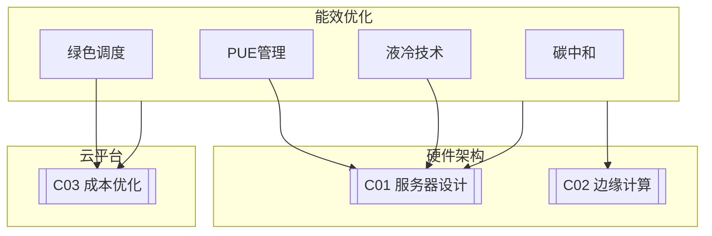

# C03 Energy Efficiency

**所属子领域**: [B01_Hardware_Arch](../README.md)  
**创建日期**: 2026-01-30  
**最后更新**: 2026-01-30

## 📋 主题定位

能源效率（Energy Efficiency）是数据中心和计算基础设施可持续发展的核心议题。随着全球数字化转型加速，数据中心的能源消耗呈现指数级增长，预计到2030年将占全球电力消耗的3-8%。能源效率优化不仅关乎运营成本控制，更是企业履行环境责任、实现碳中和目标的关键。

本专题系统探讨数据中心能源效率的测量指标、优化技术、冷却方案、硬件能效设计以及绿色计算实践，为构建高能效、低碳排放的计算基础设施提供全面指导。

## 🎯 核心概念

### 基本定义

**能源效率（Energy Efficiency）**: 在完成特定计算任务时，能源投入与计算产出的比率。通常用每瓦特功耗完成的计算工作量（如FLOPS/Watt）来衡量。

**PUE（Power Usage Effectiveness）**: 数据中心总能耗与IT设备能耗的比值，是衡量数据中心能源效率的核心指标。理想值为1.0，行业平均约1.5-1.6。

**碳排放强度（Carbon Intensity）**: 单位计算工作量的CO₂排放量，通常用gCO₂/kWh表示。

**WUE（Water Usage Effectiveness）**: 数据中心用水量与IT设备能耗的比值，衡量水资源利用效率。

### 数据中心能源流分析

```
┌─────────────────────────────────────────────────────────────────────────┐
│                          数据中心能源流全景图                             │
├─────────────────────────────────────────────────────────────────────────┤
│                                                                         │
│  电网输入 ─── 1000 kW                                                   │
│      │                                                                  │
│      ▼                                                                  │
│  ┌─────────────────────────────────────────────────────────────────┐   │
│  │                      电力基础设施                                 │   │
│  │  ┌─────────┐    ┌─────────┐    ┌─────────┐                     │   │
│  │  │ 中压配电 │───→│ UPS系统  │───→│ 低压配电 │                     │   │
│  │  │  (5%)   │    │  (7%)   │    │  (3%)   │                     │   │
│  │  └─────────┘    └─────────┘    └─────────┘                     │   │
│  │       总计损耗: 15% (150 kW)                                     │   │
│  └─────────────────────────────────────────────────────────────────┘   │
│                              │                                          │
│                              ▼                                          │
│  ┌─────────────────────────────────────────────────────────────────┐   │
│  │                      IT设备 (目标: 850 kW)                       │   │
│  │                                                                  │   │
│  │   ┌─────────────┐   ┌─────────────┐   ┌─────────────┐          │   │
│  │   │   服务器    │   │   存储      │   │   网络      │          │   │
│  │   │   (70%)     │   │   (15%)     │   │   (15%)     │          │   │
│  │   │  595 kW     │   │  127.5 kW   │   │  127.5 kW   │          │   │
│  │   └─────────────┘   └─────────────┘   └─────────────┘          │   │
│  │                                                                  │   │
│  │   能源转换: 100% 电力 → 95% 热量 + 5% 计算输出                    │   │
│  │                                                                  │   │
│  └─────────────────────────────────────────────────────────────────┘   │
│                              │                                          │
│                              ▼                                          │
│  ┌─────────────────────────────────────────────────────────────────┐   │
│  │                      冷却系统 (目标: <150 kW)                    │   │
│  │                                                                  │   │
│  │   ┌─────────────┐   ┌─────────────┐   ┌─────────────┐          │   │
│  │   │   冷冻水    │   │   精密空调   │   │   冷却塔    │          │   │
│  │   │   系统      │   │   (CRAC)    │   │             │          │   │
│  │   │   (40%)     │   │   (35%)     │   │   (25%)     │          │   │
│  │   └─────────────┘   └─────────────┘   └─────────────┘          │   │
│  │                                                                  │   │
│  │   PUE = 总输入 / IT能耗 = 1000 / 850 ≈ 1.18                      │   │
│  │                                                                  │   │
│  └─────────────────────────────────────────────────────────────────┘   │
│                              │                                          │
│                              ▼                                          │
│  废热回收 ─── 可选：区域供暖、吸收式制冷、工业用热                        │
│                                                                         │
└─────────────────────────────────────────────────────────────────────────┘
```

### PUE计算与分解

**PUE（Power Usage Effectiveness）公式**：

```
PUE = 数据中心总设施能耗 / IT设备能耗
    = (IT能耗 + 制冷能耗 + 供电损耗 + 其他) / IT能耗
    = 1 + 制冷系数 + 供电损耗系数 + 其他系数
```

| PUE值 | 效率等级 | 说明 |
|-------|---------|------|
| 1.0-1.2 | 世界级 | 先进冷却技术，废热回收 |
| 1.2-1.4 | 优秀 | 优化气流管理，高效制冷 |
| 1.4-1.6 | 良好 | 行业标准水平 |
| 1.6-2.0 | 一般 | 传统设计，有优化空间 |
| >2.0 | 较差 | 急需能效改造 |

**PUE的局限性**：
- 不考虑IT设备内部效率差异
- 不反映可再生能源使用比例
- 不衡量水资源消耗
- 不计算碳排放强度

### 扩展效率指标

| 指标 | 全称 | 计算公式 | 用途 |
|-----|------|---------|------|
| **PUE** | Power Usage Effectiveness | 总能耗/IT能耗 | 整体能效 |
| **DCIE** | Data Center Infrastructure Efficiency | IT能耗/总能耗 | PUE的倒数 |
| **WUE** | Water Usage Effectiveness | 年用水量/IT能耗 | 水资源效率 |
| **CUE** | Carbon Usage Effectiveness | CO₂排放量/IT能耗 | 碳排放效率 |
| **ERE** | Energy Reuse Effectiveness | 总能耗-回收热/IT能耗 | 废热利用 |
| **DCeP** | Data Center Performance | 有用功/总能耗 | 产出效率 |

### 服务器能效指标

| 指标 | 说明 | 典型值 |
|-----|------|-------|
| **TDP** | 热设计功耗 | CPU: 65-250W |
| **TDP/Watt** | 性能功耗比 | varies |
| **FLOPS/Watt** | 每瓦浮点运算 | GPU: 10-50 GFLOPS/W |
| **Performance/Watt** | 每瓦性能 | workload dependent |
| **Idle Power** | 空闲功耗 | 服务器: 100-300W |
| **Load Efficiency** | 负载效率 | 80-95% @ optimal load |

## 🛠️ 技术实践

### 数据中心能效优化

**1. 制冷系统优化（Python）**

```python
#!/usr/bin/env python3
"""
数据中心冷却优化控制系统
基于AI的预测性冷却控制
"""

import numpy as np
from dataclasses import dataclass
from typing import List, Dict, Tuple
from datetime import datetime, timedelta
import json


@dataclass
class CoolingZone:
    """冷却区域"""
    zone_id: str
    current_temp: float
    target_temp: float
    server_load: float  # 0-1
    airflow_cfm: float
    cooling_kw: float
    efficiency: float  # COP


class AIOptimizedCooling:
    """AI优化的冷却控制系统"""
    
    def __init__(self):
        self.zones: Dict[str, CoolingZone] = {}
        self.outdoor_temp = 20.0
        self.historical_data = []
        
        # 冷却模式配置
        self.cooling_modes = {
            'free_cooling': {'min_outdoor': 10, 'max_outdoor': 18, 'cop': 8.0},
            'partial_free': {'min_outdoor': 18, 'max_outdoor': 25, 'cop': 5.0},
            'mechanical': {'min_outdoor': 25, 'max_outdoor': 45, 'cop': 3.0}
        }
    
    def add_zone(self, zone: CoolingZone):
        """添加冷却区域"""
        self.zones[zone.zone_id] = zone
    
    def predict_heat_load(self, zone_id: str, lookahead_hours: int = 1) -> float:
        """预测热负荷"""
        zone = self.zones.get(zone_id)
        if not zone:
            return 0.0
        
        # 基于历史数据预测（简化版）
        base_load = zone.server_load * 500  # kW
        hour = datetime.now().hour
        time_factor = 1.2 if 9 <= hour <= 18 else 0.8
        predicted_load = base_load * time_factor
        return predicted_load
    
    def optimize_cooling(self) -> Dict[str, Dict]:
        """优化冷却策略"""
        recommendations = {}
        current_mode = self._determine_cooling_mode()
        
        for zone_id, zone in self.zones.items():
            predicted_load = self.predict_heat_load(zone_id)
            temp_diff = zone.current_temp - zone.target_temp
            required_cooling = predicted_load + (temp_diff * 10)
            
            recommendation = self._generate_recommendation(
                zone, predicted_load, required_cooling, current_mode
            )
            recommendations[zone_id] = recommendation
        
        return recommendations
    
    def _determine_cooling_mode(self) -> str:
        """确定最佳冷却模式"""
        for mode, config in self.cooling_modes.items():
            if config['min_outdoor'] <= self.outdoor_temp <= config['max_outdoor']:
                return mode
        return 'mechanical'
    
    def _generate_recommendation(self, 
                                  zone: CoolingZone,
                                  predicted_load: float,
                                  required_cooling: float,
                                  mode: str) -> Dict:
        """生成优化建议"""
        cop = self.cooling_modes[mode]['cop']
        power_consumption = required_cooling / cop
        efficiency_score = (zone.cooling_kw / power_consumption) * 100 if power_consumption > 0 else 0
        
        adjustments = []
        if zone.current_temp > zone.target_temp + 2:
            adjustments.append({'action': 'increase_airflow', 'value': zone.airflow_cfm * 1.1})
        elif zone.current_temp < zone.target_temp - 1:
            adjustments.append({'action': 'decrease_cooling', 'value': zone.cooling_kw * 0.9})
        
        return {
            'zone_id': zone.zone_id,
            'current_mode': mode,
            'predicted_load_kw': round(predicted_load, 2),
            'efficiency_score': round(efficiency_score, 1),
            'potential_savings_kw': round(zone.cooling_kw - power_consumption, 2),
            'adjustments': adjustments
        }
    
    def calculate_pue(self, it_power: float) -> Dict:
        """计算PUE及分解"""
        total_cooling = sum(z.cooling_kw for z in self.zones.values())
        power_loss = it_power * 0.15
        other_load = it_power * 0.05
        total_facility = it_power + total_cooling + power_loss + other_load
        pue = total_facility / it_power
        
        return {
            'pue': round(pue, 3),
            'components': {
                'it_power_kw': round(it_power, 2),
                'cooling_kw': round(total_cooling, 2),
                'power_loss_kw': round(power_loss, 2),
                'other_kw': round(other_load, 2)
            },
            'improvement_potential': {
                'target_pue': 1.2,
                'potential_savings_percent': round((pue - 1.2) / pue * 100, 1)
            }
        }


if __name__ == '__main__':
    cooling = AIOptimizedCooling()
    cooling.outdoor_temp = 15
    cooling.add_zone(CoolingZone('zone-a1', 24.5, 23.0, 0.75, 5000, 150, 3.5))
    cooling.add_zone(CoolingZone('zone-a2', 22.8, 23.0, 0.45, 4000, 100, 4.0))
    
    recommendations = cooling.optimize_cooling()
    print("冷却优化建议:", json.dumps(recommendations, indent=2))
    print("PUE计算:", json.dumps(cooling.calculate_pue(1000), indent=2))
```

**2. 服务器功耗管理脚本（Bash）**

```bash
#!/bin/bash
# 服务器功耗管理与优化脚本

set -e

CPU_GOVERNOR=${CPU_GOVERNOR:-"powersave"}
DISABLE_TURBO=${DISABLE_TURBO:-"no"}

echo "=== 服务器功耗管理脚本 ==="
echo "CPU调节器: $CPU_GOVERNOR"
echo "禁用睿频: $DISABLE_TURBO"

# 设置CPU调节器
for cpu in /sys/devices/system/cpu/cpu[0-9]*; do
    if [ -f $cpu/cpufreq/scaling_governor ]; then
        echo $CPU_GOVERNOR > $cpu/cpufreq/scaling_governor 2>/dev/null || true
    fi
done
echo "CPU调节器已设置"

# 配置睿频
if [ -f /sys/devices/system/cpu/intel_pstate/no_turbo ]; then
    if [ "$DISABLE_TURBO" = "yes" ]; then
        echo 1 > /sys/devices/system/cpu/intel_pstate/no_turbo
        echo "睿频已禁用"
    else
        echo 0 > /sys/devices/system/cpu/intel_pstate/no_turbo
        echo "睿频已启用"
    fi
fi

# 硬盘电源管理
for disk in $(ls /dev/sd[a-z] 2>/dev/null); do
    disk_name=$(basename $disk)
    rotational=$(cat /sys/block/$disk_name/queue/rotational 2>/dev/null)
    if [ "$rotational" = "1" ]; then
        hdparm -S 240 $disk 2>/dev/null || true
        echo "$disk_name: HDD电源管理已配置"
    fi
done

echo "=== 功耗管理配置完成 ==="
```

**3. 绿色调度算法（Python）**

```python
#!/usr/bin/env python3
"""
绿色计算调度器
基于碳强度的任务调度
"""

from dataclasses import dataclass
from typing import List, Dict, Optional
from datetime import datetime, timedelta
import heapq


@dataclass
class CarbonIntensity:
    """碳强度数据"""
    timestamp: datetime
    gco2_per_kwh: float
    region: str


@dataclass
class ComputeTask:
    """计算任务"""
    task_id: str
    estimated_kwh: float
    deadline: datetime
    priority: int  # 1-10, 10为最高
    flexibility_hours: float  # 可调度窗口


class GreenScheduler:
    """绿色计算调度器"""
    
    def __init__(self):
        self.carbon_forecast: List[CarbonIntensity] = []
        self.pending_tasks: List[ComputeTask] = []
        
    def load_carbon_forecast(self, forecast_data: List[Dict]):
        """加载碳强度预测"""
        self.carbon_forecast = [
            CarbonIntensity(
                timestamp=datetime.fromisoformat(d['timestamp']),
                gco2_per_kwh=d['carbon_intensity'],
                region=d.get('region', 'default')
            )
            for d in forecast_data
        ]
        self.carbon_forecast.sort(key=lambda x: x.timestamp)
    
    def schedule_tasks(self) -> Dict[str, datetime]:
        """
        基于碳强度的任务调度
        策略：将灵活任务调度到碳强度最低的时段
        """
        schedule = {}
        
        # 按优先级和灵活性排序
        sorted_tasks = sorted(
            self.pending_tasks,
            key=lambda t: (-t.priority, t.flexibility_hours)
        )
        
        for task in sorted_tasks:
            best_slot = self._find_best_time_slot(task)
            if best_slot:
                schedule[task.task_id] = best_slot
        
        return schedule
    
    def _find_best_time_slot(self, task: ComputeTask) -> Optional[datetime]:
        """为任务找到最佳的执行时间窗口"""
        now = datetime.now()
        best_time = None
        min_carbon = float('inf')
        
        # 在时间窗口内寻找碳强度最低的时段
        for carbon_data in self.carbon_forecast:
            # 检查是否在可调度窗口内
            if now <= carbon_data.timestamp <= task.deadline:
                # 检查是否足够提前完成任务
                completion_time = carbon_data.timestamp + timedelta(hours=1)
                if completion_time <= task.deadline:
                    if carbon_data.gco2_per_kwh < min_carbon:
                        min_carbon = carbon_data.gco2_per_kwh
                        best_time = carbon_data.timestamp
        
        return best_time
    
    def calculate_carbon_savings(self, schedule: Dict[str, datetime]) -> Dict:
        """计算碳排放节省"""
        total_original = 0
        total_optimized = 0
        
        task_map = {t.task_id: t for t in self.pending_tasks}
        
        for task_id, scheduled_time in schedule.items():
            task = task_map.get(task_id)
            if not task:
                continue
            
            # 原始碳排放（立即执行）
            current_intensity = self._get_carbon_intensity(datetime.now())
            original_emission = task.estimated_kwh * current_intensity
            
            # 优化后碳排放
            optimized_intensity = self._get_carbon_intensity(scheduled_time)
            optimized_emission = task.estimated_kwh * optimized_intensity
            
            total_original += original_emission
            total_optimized += optimized_emission
        
        savings = total_original - total_optimized
        
        return {
            'original_emissions_gco2': round(total_original, 2),
            'optimized_emissions_gco2': round(total_optimized, 2),
            'savings_gco2': round(savings, 2),
            'savings_percent': round(savings / total_original * 100, 1) if total_original > 0 else 0
        }
    
    def _get_carbon_intensity(self, timestamp: datetime) -> float:
        """获取指定时间的碳强度"""
        for carbon_data in self.carbon_forecast:
            if abs((carbon_data.timestamp - timestamp).total_seconds()) < 3600:
                return carbon_data.gco2_per_kwh
        return 500.0  # 默认值
    
    def region_selection(self, 
                         regions: List[str],
                         task: ComputeTask) -> Optional[str]:
        """
        多区域选择：选择碳强度最低的区域执行任务
        """
        best_region = None
        min_carbon = float('inf')
        
        for region in regions:
            # 获取该区域的当前碳强度
            region_intensity = self._get_region_carbon_intensity(region)
            
            if region_intensity < min_carbon:
                min_carbon = region_intensity
                best_region = region
        
        return best_region
    
    def _get_region_carbon_intensity(self, region: str) -> float:
        """获取区域的碳强度"""
        for carbon_data in self.carbon_forecast:
            if carbon_data.region == region:
                return carbon_data.gco2_per_kwh
        return 500.0


# 使用示例
if __name__ == '__main__':
    scheduler = GreenScheduler()
    
    # 加载碳强度预测（模拟数据）
    forecast = []
    base_time = datetime.now()
    for i in range(24):
        # 模拟昼夜变化：夜间碳强度低（更多风电）
        intensity = 300 + 200 * abs(12 - i) / 12  # 夜间约300，白天约500
        forecast.append({
            'timestamp': (base_time + timedelta(hours=i)).isoformat(),
            'carbon_intensity': intensity,
            'region': 'default'
        })
    
    scheduler.load_carbon_forecast(forecast)
    
    # 添加任务
    scheduler.pending_tasks = [
        ComputeTask('ml-training-1', 50.0, base_time + timedelta(hours=24), 5, 12),
        ComputeTask('data-processing', 20.0, base_time + timedelta(hours=12), 7, 8),
        ComputeTask('batch-job', 30.0, base_time + timedelta(hours=48), 3, 24),
    ]
    
    # 执行调度
    schedule = scheduler.schedule_tasks()
    print("任务调度方案:")
    for task_id, time in schedule.items():
        print(f"  {task_id}: 执行时间 {time}")
    
    # 计算节省
    savings = scheduler.calculate_carbon_savings(schedule)
    print(f"\n碳排放优化:")
    print(f"  原始排放: {savings['original_emissions_gco2']} gCO2")
    print(f"  优化后排放: {savings['optimized_emissions_gco2']} gCO2")
    print(f"  节省: {savings['savings_gco2']} gCO2 ({savings['savings_percent']}%)")
```

## 📚 资源索引

### 行业标准与规范

| 标准 | 组织 | 说明 |
|-----|------|------|
| **PUE标准** | The Green Grid | 数据中心能效测量标准 |
| **ISO/IEC 30134** | ISO | 数据中心关键性能指标 |
| **ASHRAE标准** | ASHRAE | 数据中心热环境指南 |
| **EPA Energy Star** | EPA | 数据中心能源之星认证 |
| **LEED** | USGBC | 绿色建筑认证 |

### 能效评估工具

| 工具 | 用途 | 链接 |
|-----|------|------|
| **PUE Calculator** | PUE计算 | Green Grid提供 |
| **DC Pro** | 数据中心评估 | 美国能源部 |
| **Capex/opex Calculator** | TCO计算 | Uptime Institute |
| **Carbon Footprint Calculator** | 碳足迹计算 | Various |

### 液冷技术厂商

| 厂商 | 技术类型 | 说明 |
|-----|---------|------|
| **CoolIT Systems** | 冷板式液冷 | 企业级液冷方案 |
| **Asetek** | 冷板式液冷 | 数据中心液冷 |
| **GRC (Green Revolution)** | 浸没式液冷 | 单相浸没冷却 |
| **LiquidStack** | 浸没式液冷 | 两相浸没冷却 |
| **Iceotope** | 精密浸没冷却 | 服务器级浸没 |

### 可再生能源与碳中和

| 资源 | 类型 | 说明 |
|-----|------|------|
| **RE100** | 倡议 | 100%可再生能源承诺 |
| **Science Based Targets** | 倡议 | 科学碳目标 |
| **Carbon Disclosure Project** | 披露 | 碳排放披露 |
| **Climate Neutral Now** | UNFCCC | 气候中和倡议 |

## 🔗 关联知识



### 关联关系

| 关联领域 | 关系 | 说明 |
|---------|------|------|
| **B01_Hardware_Arch/C01_Server_Design** | 上游 | 服务器能效设计基础 |
| **B01_Hardware_Arch/C02_Edge_Computing** | 上游 | 边缘设备功耗优化 |
| **B10_Cloud_Platforms/C03_Cost_Optimization** | 协同 | 能源成本是重要组成部分 |

## 💡 学习建议

### 入门路径

1. **基础概念**（1-2周）
   - 理解PUE、WUE等核心指标
   - 学习数据中心能源流
   - 了解制冷基础原理

2. **技术实践**（3-4周）
   - 搭建PUE监控系统
   - 学习液冷技术原理
   - 实践服务器功耗管理

3. **高级优化**（5-8周）
   - AI驱动的冷却控制
   - 碳感知工作负载调度
   - 可再生能源集成

### 认证推荐

| 认证 | 提供商 | 说明 |
|-----|-------|------|
| **CDCP** | EPI | 数据中心专业人员 |
| **BEMP** | AEE | 能源管理师 |
| **LEED AP** | USGBC | 绿色建筑专家 |

---

*最后更新: 2026-01-30*  
*维护者: Infrastructure Team*
