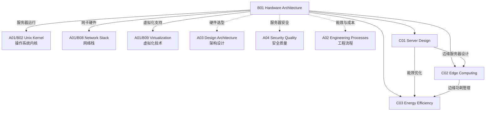

# B01 Hardware Architecture

**所属领域**: [A01_Infrastructure](../readme.md)
**创建日期**: 2026-01-30
**最后更新**: 2026-01-30

## 📋 子领域定位

硬件架构是基础设施层的物理基础，涵盖服务器设计、边缘计算部署和能效优化三大核心方向。随着云计算、AI 工作负载和边缘智能的快速发展，硬件架构正经历从通用计算向异构计算、从集中式数据中心向分布式边缘节点的重大转变。

本领域关注如何在性能、成本、能耗和可靠性之间取得最佳平衡，为上层软件栈提供稳定、高效、可扩展的硬件支撑。现代硬件架构师需要掌握从芯片级到数据中心级的全栈知识，理解 ARM/x86 架构差异、GPU/TPU 加速原理、以及液冷/浸没式等新型散热技术。

**核心关注点**：
- **服务器架构**：机架式/刀片式/整机柜服务器设计，NUMA 架构优化
- **异构计算**：CPU+GPU/FPGA/DPU 协同架构，AI 加速卡选型
- **边缘硬件**：宽温设计、低功耗嵌入式系统、5G MEC 节点
- **绿色计算**：PUE 优化、液冷技术、可再生能源集成

## 🗂️ 专项列表

### [C01. Server_Design](C01_Server_Design/README.md)

服务器设计是现代数据中心的核心，涵盖从单机硬件选型到大规模集群架构的全方位技术。本专项深入探讨 x86/ARM 架构对比、多路处理器配置、内存通道优化、NVMe 存储架构、以及高可用 RAS 特性设计。包括服务器性能基准测试、容量规划方法论、以及基于工作负载特征的选型决策框架。

### [C02. Edge_Computing](C02_Edge_Computing/README.md)

边缘计算将计算能力下沉到数据源头，降低延迟并减少带宽消耗。本专项覆盖边缘节点硬件选型（工业级单板计算机、边缘服务器）、5G MEC 架构设计、边缘-云协同机制、以及边缘设备的远程运维管理。重点关注边缘场景的约束条件：宽温环境、有限功耗、间歇性网络连接和安全加固需求。

### [C03. Energy_Efficiency](C03_Energy_Efficiency/README.md)

能效优化是可持续计算的关键，涉及从芯片级功耗管理到数据中心级 PUE 优化的全栈技术。本专项探讨动态电压频率调整 (DVFS)、ARM 架构能效优势、液冷与浸没式散热技术、余热回收利用、以及基于 AI 的能耗预测与优化策略。包括绿色数据中心设计标准和碳足迹计算方法。

## 🛠️ 技术栈概览

### 核心技术

| 技术领域 | 关键技术 | 说明 |
|----------|----------|------|
| **处理器架构** | x86_64 (Intel Xeon/AMD EPYC), ARM (Ampere/AWS Graviton), RISC-V | 主流服务器处理器架构对比与选型 |
| **加速计算** | NVIDIA GPU (A100/H100), AMD MI series, Intel Gaudi, FPGA | AI/HPC 工作负载加速方案 |
| **内存技术** | DDR5, HBM3, CXL (Compute Express Link), NVMe-oF | 高带宽低延迟内存架构 |
| **存储介质** | NVMe SSD, ZNS SSD, SCM (Storage Class Memory) | 新一代存储技术演进 |
| **网络互联** | InfiniBand, RoCEv2, CXL Fabric, PCIe Gen5 | 高性能计算网络技术 |
| **散热技术** | 液冷 (冷板/浸没), 相变散热, 热管技术 | 高密度计算散热方案 |

### 工具链

| 类别 | 工具/平台 | 用途 |
|------|-----------|------|
| **硬件监控** | IPMI, Redfish, Prometheus Node Exporter | 服务器健康状态监控 |
| **性能测试** | LINPACK, SPEC CPU, FIO, iperf3 | 基准性能测试工具 |
| **功耗分析** | Intel RAPL, AMD uProf, NVIDIA NVML | 能耗监测与分析 |
| **配置管理** | Ansible, Chef, PXE/kickstart | 大规模服务器配置 |
| **固件管理** | fwupd, SUM (Supermicro), iDRAC (Dell) | 固件更新与管理 |

### 硬件厂商生态

| 厂商 | 产品线 | 特点 |
|------|--------|------|
| **Dell EMC** | PowerEdge 系列 | 企业级服务器市场领导者 |
| **HPE** | ProLiant, Apollo, Cray | 超算与高性能计算专家 |
| **Supermicro** | Ultra, SuperBlade, GPU 系统 | 高密度与定制化方案 |
| **Lenovo** | ThinkSystem | 企业级与边缘服务器 |
| ** Inspur** | NF5488A5, AGX-2 | AI 服务器专业厂商 |
| **Quanta** | QCT 产品线 | 云服务商 ODM 首选 |

## 💼 实践案例索引

### 案例 1: 超大规模 AI 训练集群架构

**场景**: 构建 1000+ GPU 的分布式 AI 训练集群

**架构要点**:
- 采用 NVIDIA DGX SuperPOD 参考架构
- 每个计算节点配备 8×H100 GPU + NVLink + NVSwitch
- 存储层采用并行文件系统 (WekaFS/BeeGFS) + NVMe-oF
- 网络层采用 InfiniBand NDR 400Gbps 全 fat-tree 拓扑
- 液冷散热系统支持 40kW+ 单机柜功率密度

**关键指标**:
| 指标 | 目标值 | 说明 |
|------|--------|------|
| GPU 利用率 | >80% | 训练效率关键指标 |
| 网络带宽 | 400 Gbps | 节点间 AllReduce 带宽 |
| PUE | <1.2 | 液冷系统能效比 |
| 故障恢复 | <30min | 自动故障检测与替换 |

### 案例 2: 边缘 AI 推理节点设计

**场景**: 智能制造产线实时质检系统

**硬件方案**:
- 边缘网关: NVIDIA Jetson AGX Orin (275 TOPS AI 算力)
- 工业相机: 高帧率 GigE Vision 相机阵列
- 网络: 5G 模组 + 工业以太网双连接
- 环境: IP65 防护等级，-20°C~60°C 工作温度

**功耗优化**:
```
满负载运行: 60W (GPU 计算 + 视频编码)
空闲状态: 15W (动态频率调节)
平均功耗: 35W (产线节拍匹配)
```

### 案例 3: 绿色数据中心 PUE 优化

**场景**: 新建 10MW 数据中心能效优化

**技术措施**:
| 层级 | 措施 | PUE 贡献 |
|------|------|----------|
| 芯片级 | ARM 处理器替代 x86 | 降低 15% 计算功耗 |
| 服务器级 | 整机柜液冷 (40°C 进水) | 消除风扇功耗 |
| 机柜级 | 热通道封闭 + 变频空调 | 提高 30% 制冷效率 |
| 园区级 | 自然冷却 + 余热回收 | 年节电 200 万度 |

**最终 PUE**: 1.08 (行业领先)

## 🔗 知识关联图谱



## 📖 学习资源

### 推荐书籍

| 书名 | 作者 | 重点内容 |
|------|------|----------|
| 《Computer Architecture: A Quantitative Approach》 | Hennessy & Patterson | 计算机体系结构圣经 |
| 《Modern Processor Design》 | John Shen | 现代处理器设计原理 |
| 《The Datacenter as a Computer》 | Luiz André Barroso | 数据中心设计原理 |
| 《Open Compute Project: Hardware Design》 | OCP 社区 | 开放硬件设计规范 |

### 在线课程

| 课程 | 平台 | 链接 |
|------|------|------|
| Computer Architecture (ETH Zurich) | Coursera | https://www.coursera.org/learn/comparch |
| Hardware Security | edX | https://www.edx.org/learn/computer-hardware-security |
| High Performance Computing | Coursera | https://www.coursera.org/specializations/high-performance-computing |

### 技术博客与资源

| 资源 | 链接 | 说明 |
|------|------|------|
| AnandTech | https://www.anandtech.com | 深度硬件评测 |
| ServeTheHome | https://www.servethehome.com | 服务器与数据中心 |
| Open Compute Project | https://www.opencompute.org | 开放硬件标准 |
| SPEC Benchmarks | https://www.spec.org | 标准化性能测试 |
| Top500 Supercomputers | https://www.top500.org | 超算排行榜 |

### 厂商技术文档

| 厂商 | 资源 | 链接 |
|------|------|------|
| Intel | ARK 产品数据库 | https://ark.intel.com |
| AMD | EPYC 技术文档 | https://www.amd.com/en/processors/epyc |
| NVIDIA | DGX 系统文档 | https://docs.nvidia.com/dgx/ |
| ARM | Neoverse 架构 | https://www.arm.com/architecture/cpu/neoverse |

### 开源项目

| 项目 | GitHub | 说明 |
|------|--------|------|
| OpenBMC | https://github.com/openbmc/openbmc | 开源基板管理控制器 |
| LinuxBoot | https://github.com/linuxboot/linuxboot | 开源固件替代方案 |
| OpenCompute | https://github.com/opencomputeproject | OCP 开源硬件设计 |

## 🔄 维护说明

- **内容审查**: 每季度检查硬件产品更新链接有效性
- **更新机制**: 关注 Intel/AMD/NVIDIA 新产品发布周期，及时更新架构信息
- **质量标准**: 确保技术规格数据准确，引用官方文档作为数据来源
- **贡献方式**: 欢迎提交硬件实测数据和架构优化案例
