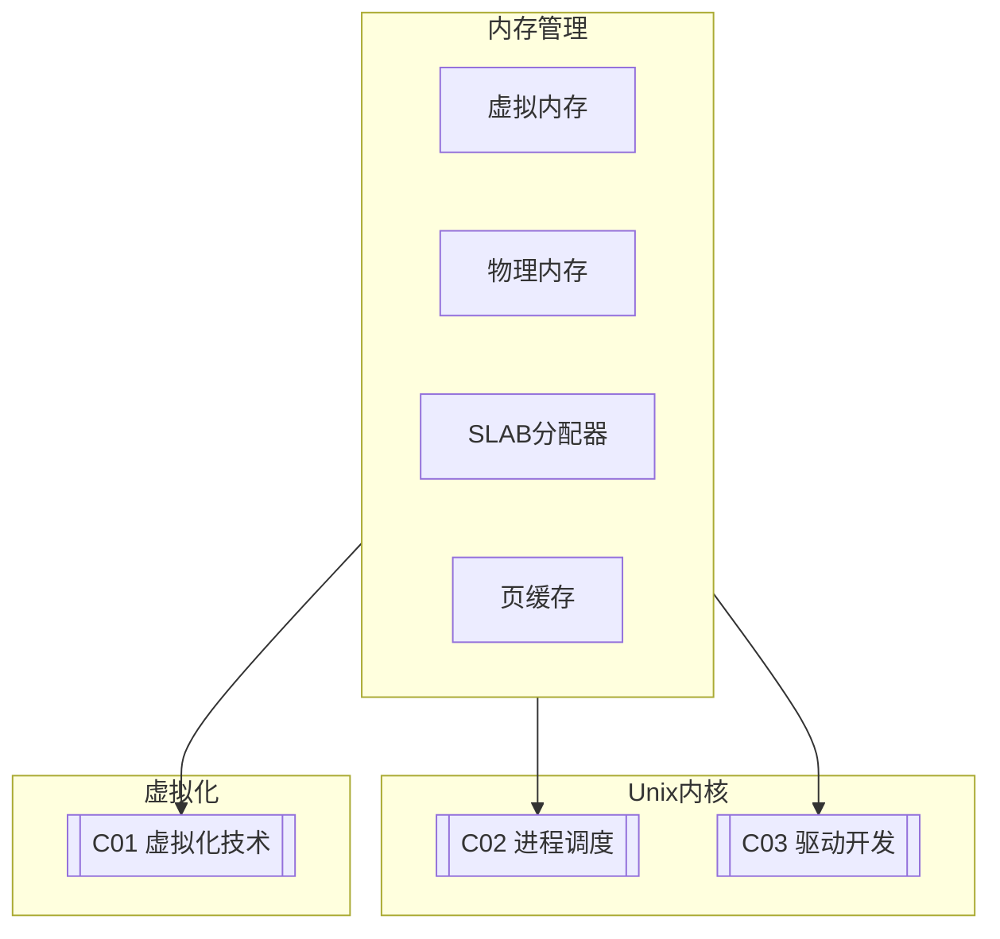

# C01 Memory Management

**所属子领域**: [B02_Unix_Kernel](../README.md)  
**创建日期**: 2026-01-30  
**最后更新**: 2026-01-30

## 📋 主题定位

内存管理是操作系统内核最核心的子系统之一，它负责管理计算机的物理内存和虚拟内存，为进程提供内存分配、回收、共享和保护等基础服务。高效的内存管理直接影响系统的性能、稳定性和可扩展性。

在现代计算环境中，内存管理面临着诸多挑战：大内存系统的页表开销、NUMA架构下的内存访问优化、容器化场景下的内存隔离、cgroup v2的复杂限制机制，以及持久内存（PMEM）等新型存储级内存的引入。

本专题深入探讨Linux内存管理的原理、算法、实现细节以及调优实践，帮助工程师理解和优化系统内存行为。

## 🎯 核心概念

### 内存管理基础

**虚拟内存（Virtual Memory）**: 为每个进程提供独立的地址空间，通过页表映射到物理内存，实现内存隔离、共享和超额分配。

**页（Page）**: 内存管理的基本单位，x86_64架构中默认4KB，支持大页（2MB/1GB）。

**页表（Page Table）**: 虚拟地址到物理地址的映射结构，采用多级页表（x86_64使用4级或5级页表）。

**TLB（Translation Lookaside Buffer）**: 页表缓存，加速虚拟地址转换。

### Linux内存架构

```
┌─────────────────────────────────────────────────────────────────────────┐
│                          Linux内存管理架构                               │
├─────────────────────────────────────────────────────────────────────────┤
│                                                                         │
│  ┌─────────────────────────────────────────────────────────────────┐   │
│  │                       进程地址空间                                 │   │
│  │  ┌──────────────┐ ┌──────────────┐ ┌──────────────┐             │   │
│  │  │   用户空间    │ │   内核空间   │ │   特殊映射   │             │   │
│  │  │  ├─代码段     │ │  ├─直接映射  │ │  ├─vmalloc   │             │   │
│  │  │  ├─数据段     │ │  ├─vmalloc   │ │  ├─ioremap   │             │   │
│  │  │  ├─堆        │ │  ├─固定映射  │ │  ├─持久内存   │             │   │
│  │  │  ├─栈        │ │  └─kmap      │ │              │             │   │
│  │  │  └─mmap区域  │ │              │ │              │             │   │
│  │  └──────────────┘ └──────────────┘ └──────────────┘             │   │
│  │                              │                                   │   │
│  │                              ▼                                   │   │
│  │  ┌─────────────────────────────────────────────────────────────┐│   │
│  │  │                    虚拟内存管理（VM）                         ││   │
│  │  │  ├─ 页表管理（pgd/p4d/pud/pmd/pte）                         ││   │
│  │  │  ├─ 页分配/释放（alloc_pages/free_pages）                    ││   │
│  │  │  ├─ 缺页处理（do_page_fault）                                ││   │
│  │  │  ├─ 页面回收（kswapd/direct reclaim）                        ││   │
│  │  │  └─ 内存压缩（zRAM/zswap）                                   ││   │
│  │  └─────────────────────────────────────────────────────────────┘│   │
│  │                              │                                   │   │
│  │                              ▼                                   │   │
│  │  ┌─────────────────────────────────────────────────────────────┐│   │
│  │  │                    物理内存管理                               ││   │
│  │  │  ├─ 伙伴系统（Buddy System）                                 ││   │
│  │  │  ├─ SLAB/SLUB分配器                                         ││   │
│  │  │  ├─ CMA（连续内存分配器）                                     ││   │
│  │  │  └─ 内存热插拔                                              ││   │
│  │  └─────────────────────────────────────────────────────────────┘│   │
│  │                              │                                   │   │
│  │                              ▼                                   │   │
│  │  ┌─────────────────────────────────────────────────────────────┐│   │
│  │  │                    NUMA内存管理                               ││   │
│  │  │  ├─ 节点本地分配                                            ││   │
│  │  │  ├─ 页面迁移                                                ││   │
│  │  │  └─ 自动NUMA平衡                                            ││   │
│  │  └─────────────────────────────────────────────────────────────┘│   │
│  └─────────────────────────────────────────────────────────────────┘   │
│                                                                         │
│  ┌─────────────────────────────────────────────────────────────────┐   │
│  │                    页缓存与文件系统                               │   │
│  │  ├─ Page Cache                                                  │   │
│  │  ├─ Buffer Cache                                                │   │
│  │  ├─ Swap Cache                                                  │   │
│  │  └─ 写回策略                                                    │   │
│  └─────────────────────────────────────────────────────────────────┘   │
│                                                                         │
└─────────────────────────────────────────────────────────────────────────┘
```

### 内存区域与节点

```
┌─────────────────────────────────────────────────────────────────────────┐
│                         NUMA内存架构示例                                  │
├─────────────────────────────────────────────────────────────────────────┤
│                                                                         │
│                    Node 0 (Socket 0)                                    │
│  ┌─────────────────────────────────────────────────────────────────┐   │
│  │  ┌──────────────┐  ┌──────────────┐  ┌──────────────┐          │   │
│  │  │   ZONE_DMA   │  │  ZONE_DMA32  │  │  ZONE_NORMAL │          │   │
│  │  │   < 16MB     │  │  < 4GB       │  │  > 4GB       │          │   │
│  │  │  遗留设备    │  │  32位设备    │  │  主内存区    │          │   │
│  │  └──────────────┘  └──────────────┘  └──────────────┘          │   │
│  │                                                                │   │
│  │  CPU0, CPU1, CPU2, CPU3 ←── 本地访问 ─── 100ns                 │   │
│  └─────────────────────────────────────────────────────────────────┘   │
│                              ↕ 远程访问 (200ns)                         │
│                    Node 1 (Socket 1)                                    │
│  ┌─────────────────────────────────────────────────────────────────┐   │
│  │  ┌──────────────┐  ┌──────────────┐  ┌──────────────┐          │   │
│  │  │   ZONE_DMA   │  │  ZONE_DMA32  │  │  ZONE_NORMAL │          │   │
│  │  └──────────────┘  └──────────────┘  └──────────────┘          │   │
│  │                                                                │   │
│  │  CPU4, CPU5, CPU6, CPU7 ←── 本地访问                           │   │
│  └─────────────────────────────────────────────────────────────────┘   │
│                                                                         │
│  关键参数：                                                              │
│  - 本地访问延迟: ~100ns                                                 │
│  - 跨Node访问延迟: ~200ns (2x)                                          │
│  - 默认策略: 优先在本地Node分配内存                                      │
│  - numactl: 控制内存分配策略                                             │
│                                                                         │
└─────────────────────────────────────────────────────────────────────────┘
```

### 伙伴系统（Buddy System）

```
伙伴系统内存分配原理：

初始状态:  64页连续块

分配请求: 需要8页
           
           64页块
              │
              ▼ 分割
        ┌─────┴─────┐
       32页        32页
                      │
                      ▼ 分割
                ┌─────┴─────┐
               16页        16页
                              │
                              ▼ 分割
                        ┌─────┴─────┐
                       8页 ◄─────────┘ 8页 (分配给用户)
                       
释放8页块后合并:  
                       8页 + 8页 → 16页
                       16页 + 16页 → 32页
                       32页 + 32页 → 64页 (恢复到初始状态)

优点:
- 快速分配和释放
- 避免外部碎片（合并相邻空闲块）
- O(logN)时间复杂度

缺点:
- 内部碎片（可能分配比请求更大的块）
```

### SLAB/SLUB分配器

```
┌─────────────────────────────────────────────────────────────────────────┐
│                        SLUB分配器架构                                     │
├─────────────────────────────────────────────────────────────────────────┤
│                                                                         │
│  每个CPU缓存 (cpu_slab)                                                  │
│  ┌─────────────────────────────────────────────────────────────────┐   │
│  │  freelist: 指向当前可用对象的指针                                │   │
│  │  page: 当前正在使用的slab页                                      │   │
│  │  partial: 部分使用的slab列表                                     │   │
│  └─────────────────────────────────────────────────────────────────┘   │
│                              │                                          │
│                              ▼                                          │
│  Node缓存                                                                 │
│  ┌─────────────────────────────────────────────────────────────────┐   │
│  │  partial: 各Node的部分使用slab链表                               │   │
│  │  full: 完全使用的slab链表                                        │   │
│  └─────────────────────────────────────────────────────────────────┘   │
│                              │                                          │
│                              ▼                                          │
│  Slab页 (struct page)                                                    │
│  ┌─────────────────────────────────────────────────────────────────┐   │
│  │  ┌────────┐ ┌────────┐ ┌────────┐ ┌────────┐                 │   │
│  │  │ Object │ │ Object │ │ Object │ │  ...   │  固定大小对象    │   │
│  │  │  64B   │ │  64B   │ │  64B   │ │        │                 │   │
│  │  └────────┘ └────────┘ └────────┘ └────────┘                 │   │
│  │                                                                │   │
│  │  freelist: 空闲对象链表                                        │   │
│  │  inuse: 已使用对象数                                           │   │
│  │  frozen: 是否被CPU缓存                                         │   │
│  └─────────────────────────────────────────────────────────────────┘   │
│                                                                         │
│  常见kmem_cache:                                                         │
│  - kmalloc-64, kmalloc-128, ... kmalloc-8192                          │
│  - dentry, inode_cache, buffer_head                                   │
│  - task_struct, mm_struct                                             │
│                                                                         │
└─────────────────────────────────────────────────────────────────────────┘
```

## 🛠️ 技术实践

### 内存监控与分析

**1. 内存使用监控脚本（Python）**

```python
#!/usr/bin/env python3
"""
Linux内存使用监控与分析工具
"""

import os
import re
import json
import time
from dataclasses import dataclass
from typing import Dict, List, Optional
from datetime import datetime


@dataclass
class MemoryStats:
    """内存统计信息"""
    timestamp: datetime
    total_kb: int
    free_kb: int
    available_kb: int
    buffers_kb: int
    cached_kb: int
    swap_total_kb: int
    swap_free_kb: int
    active_kb: int
    inactive_kb: int
    dirty_kb: int
    writeback_kb: int
    anon_pages_kb: int
    mapped_kb: int
    shmem_kb: int
    slab_kb: int
    sreclaimable_kb: int
    sunreclaim_kb: int


class MemoryMonitor:
    """内存监控器"""
    
    def __init__(self):
        self.history: List[MemoryStats] = []
        
    def parse_meminfo(self) -> MemoryStats:
        """解析/proc/meminfo"""
        stats = {'timestamp': datetime.now()}
        
        with open('/proc/meminfo', 'r') as f:
            for line in f:
                match = re.match(r'(\w+):\s+(\d+)', line)
                if match:
                    key = match.group(1).lower()
                    value = int(match.group(2))
                    stats[key] = value
        
        # 计算派生指标
        stats['sunreclaim_kb'] = (
            stats.get('slab', 0) - stats.get('sreclaimable', 0)
        )
        
        return MemoryStats(**{
            k: stats.get(k, 0) for k in [
                'timestamp', 'total_kb', 'free_kb', 'available_kb',
                'buffers_kb', 'cached_kb', 'swap_total_kb', 'swap_free_kb',
                'active_kb', 'inactive_kb', 'dirty_kb', 'writeback_kb',
                'anon_pages_kb', 'mapped_kb', 'shmem_kb', 'slab_kb',
                'sreclaimable_kb', 'sunreclaim_kb'
            ]
        })
    
    def calculate_derived_metrics(self, stats: MemoryStats) -> Dict:
        """计算派生指标"""
        used_kb = stats.total_kb - stats.free_kb
        used_percent = (used_kb / stats.total_kb) * 100
        
        # 实际使用的内存（不含缓存）
        used_real_kb = used_kb - stats.buffers_kb - stats.cached_kb - stats.sreclaimable_kb
        
        # 缓存命中率估算（简化）
        cache_total = stats.cached_kb + stats.buffers_kb
        
        # 交换使用率
        swap_used_kb = stats.swap_total_kb - stats.swap_free_kb
        swap_percent = (swap_used_kb / stats.swap_total_kb * 100) if stats.swap_total_kb > 0 else 0
        
        return {
            'used_kb': used_kb,
            'used_percent': round(used_percent, 2),
            'used_real_kb': used_real_kb,
            'cache_total_kb': cache_total,
            'swap_used_kb': swap_used_kb,
            'swap_percent': round(swap_percent, 2),
            'dirty_percent': round(stats.dirty_kb / stats.total_kb * 100, 4),
        }
    
    def check_memory_pressure(self, stats: MemoryStats) -> List[str]:
        """检查内存压力"""
        alerts = []
        
        used_percent = (stats.total_kb - stats.free_kb) / stats.total_kb * 100
        
        if used_percent > 95:
            alerts.append(f"CRITICAL: 内存使用率 {used_percent:.1f}%")
        elif used_percent > 90:
            alerts.append(f"WARNING: 内存使用率 {used_percent:.1f}%")
        
        if stats.swap_total_kb > 0:
            swap_used = (stats.swap_total_kb - stats.swap_free_kb) / stats.swap_total_kb * 100
            if swap_used > 80:
                alerts.append(f"WARNING: 交换空间使用率 {swap_used:.1f}%")
        
        if stats.dirty_kb > stats.total_kb * 0.1:  # 脏页超过10%
            alerts.append(f"WARNING: 脏页过多 {stats.dirty_kb}KB")
        
        return alerts
    
    def get_zone_info(self) -> List[Dict]:
        """获取内存区域信息"""
        zones = []
        
        try:
            with open('/proc/zoneinfo', 'r') as f:
                content = f.read()
                
            # 解析zone信息
            zone_blocks = content.split('Node ')[1:]
            
            for block in zone_blocks:
                lines = block.strip().split('\n')
                node_zone = lines[0].split(',')[0]
                
                zone_data = {'node_zone': node_zone}
                
                for line in lines[1:]:
                    if 'pages free' in line:
                        zone_data['free_pages'] = int(line.split()[2])
                    elif 'min' in line and 'low' not in line and 'high' not in line:
                        zone_data['min_pages'] = int(line.split()[1])
                    elif 'low' in line:
                        zone_data['low_pages'] = int(line.split()[1])
                    elif 'high' in line:
                        zone_data['high_pages'] = int(line.split()[1])
                
                zones.append(zone_data)
                
        except Exception as e:
            print(f"读取zoneinfo失败: {e}")
        
        return zones
    
    def get_slab_info(self) -> Dict[str, int]:
        """获取SLAB分配器信息"""
        slabs = {}
        
        try:
            with open('/proc/slabinfo', 'r') as f:
                lines = f.readlines()[2:]  # 跳过头部
                
            for line in lines:
                parts = line.split()
                if len(parts) >= 4:
                    name = parts[0]
                    active_objs = int(parts[1])
                    total_objs = int(parts[2])
                    obj_size = int(parts[3])
                    
                    slabs[name] = {
                        'active': active_objs,
                        'total': total_objs,
                        'size': obj_size,
                        'total_kb': (total_objs * obj_size) // 1024
                    }
                    
        except Exception as e:
            print(f"读取slabinfo失败: {e}")
        
        return slabs
    
    def get_numa_info(self) -> Dict:
        """获取NUMA内存信息"""
        numa_info = {}
        
        try:
            # 检查numactl是否可用
            if os.path.exists('/sys/devices/system/node'):
                nodes = []
                for node_dir in os.listdir('/sys/devices/system/node'):
                    if node_dir.startswith('node'):
                        node_id = node_dir.replace('node', '')
                        meminfo_path = f'/sys/devices/system/node/{node_dir}/meminfo'
                        
                        if os.path.exists(meminfo_path):
                            with open(meminfo_path, 'r') as f:
                                meminfo = f.read()
                                
                            # 提取Total和Free
                            total_match = re.search(r'MemTotal:\s+(\d+)', meminfo)
                            free_match = re.search(r'MemFree:\s+(\d+)', meminfo)
                            
                            nodes.append({
                                'node_id': int(node_id),
                                'total_kb': int(total_match.group(1)) if total_match else 0,
                                'free_kb': int(free_match.group(1)) if free_match else 0
                            })
                
                numa_info['nodes'] = nodes
                numa_info['node_count'] = len(nodes)
                
        except Exception as e:
            print(f"读取NUMA信息失败: {e}")
        
        return numa_info
    
    def generate_report(self) -> Dict:
        """生成完整内存报告"""
        stats = self.parse_meminfo()
        self.history.append(stats)
        
        # 保留最近100个数据点
        if len(self.history) > 100:
            self.history = self.history[-100:]
        
        derived = self.calculate_derived_metrics(stats)
        alerts = self.check_memory_pressure(stats)
        zones = self.get_zone_info()
        slabs = self.get_slab_info()
        numa = self.get_numa_info()
        
        # 找出最大的slab
        top_slabs = sorted(
            slabs.items(),
            key=lambda x: x[1].get('total_kb', 0),
            reverse=True
        )[:10]
        
        return {
            'timestamp': stats.timestamp.isoformat(),
            'summary': {
                'total_gb': round(stats.total_kb / (1024*1024), 2),
                'used_gb': round(derived['used_kb'] / (1024*1024), 2),
                'available_gb': round(stats.available_kb / (1024*1024), 2),
                'used_percent': derived['used_percent'],
                'swap_percent': derived['swap_percent']
            },
            'alerts': alerts,
            'memory_stats': {
                'total_kb': stats.total_kb,
                'free_kb': stats.free_kb,
                'available_kb': stats.available_kb,
                'buffers_kb': stats.buffers_kb,
                'cached_kb': stats.cached_kb,
                'active_kb': stats.active_kb,
                'inactive_kb': stats.inactive_kb
            },
            'derived_metrics': derived,
            'zones': zones,
            'numa': numa,
            'top_slabs': [
                {'name': name, **data} for name, data in top_slabs
            ]
        }
    
    def continuous_monitor(self, interval: int = 5):
        """持续监控"""
        print(f"开始内存监控 (间隔: {interval}秒)")
        print("=" * 60)
        
        while True:
            report = self.generate_report()
            
            print(f"\n[{report['timestamp']}]")
            print(f"内存: {report['summary']['used_gb']}GB / "
                  f"{report['summary']['total_gb']}GB "
                  f"({report['summary']['used_percent']}%)")
            print(f"可用: {report['summary']['available_gb']}GB")
            
            if report['alerts']:
                print("⚠️  告警:")
                for alert in report['alerts']:
                    print(f"   - {alert}")
            
            time.sleep(interval)


if __name__ == '__main__':
    import argparse
    
    parser = argparse.ArgumentParser(description='Linux内存监控工具')
    parser.add_argument('--interval', '-i', type=int, default=5)
    parser.add_argument('--output', '-o', type=str)
    args = parser.parse_args()
    
    monitor = MemoryMonitor()
    
    if args.output:
        report = monitor.generate_report()
        with open(args.output, 'w') as f:
            json.dump(report, f, indent=2)
        print(f"报告已保存: {args.output}")
    else:
        try:
            monitor.continuous_monitor(args.interval)
        except KeyboardInterrupt:
            print("\n监控已停止")
```

**2. 内存泄漏检测（Bash + C）**

```bash
#!/bin/bash
# 内存泄漏检测脚本
# 使用memleak工具（基于BPF）

set -e

PID=${1:-}
INTERVAL=${2:-5}

if [ -z "$PID" ]; then
    echo "用法: $0 <PID> [interval_seconds]"
    echo "示例: $0 1234 5"
    exit 1
fi

echo "=== 内存泄漏检测 ==="
echo "目标PID: $PID"
echo "检测间隔: ${INTERVAL}秒"
echo "按Ctrl+C停止"
echo ""

# 检查bpftrace是否安装
if ! command -v bpftrace &> /dev/null; then
    echo "错误: bpftrace未安装"
    echo "安装命令: sudo apt-get install bpftrace"
    exit 1
fi

# 使用bpftrace跟踪内存分配和释放
bpftrace -e '
uprobe:/lib/x86_64-linux-gnu/libc.so.6:malloc {
    @allocations[tid] = nsecs;
    @malloc_count[tid]++;
}

uretprobe:/lib/x86_64-linux-gnu/libc.so.6:malloc /@allocations[tid]/ {
    @allocated_bytes[tid] += retval;
    @allocations[tid] = 0;
}

uprobe:/lib/x86_64-linux-gnu/libc.so.6:free {
    @free_count[tid]++;
}

interval:s:5 {
    printf("\n=== %s ===\n", strftime("%H:%M:%S"));
    printf("Thread\tMalloc Count\tFree Count\tNet Allocations\n");
    
    @malloc_count = count();
    @free_count = count();
}
' -p $PID
```

### 内存调优参数

**3. sysctl内存参数调优**

```bash
#!/bin/bash
# Linux内存管理sysctl参数调优
# 适用于高性能服务器和大数据场景

set -e

BACKUP_DIR="/etc/sysctl.d/memory-backup-$(date +%Y%m%d)"
mkdir -p "$BACKUP_DIR"

# 备份当前配置
cp /etc/sysctl.conf "$BACKUP_DIR/" 2>/dev/null || true
cp /etc/sysctl.d/*.conf "$BACKUP_DIR/" 2>/dev/null || true

echo "=== Linux内存管理调优 ==="
echo "备份目录: $BACKUP_DIR"
echo ""

# 创建内存优化配置文件
cat > /etc/sysctl.d/99-memory-optimize.conf << 'EOF'
# =====================================================
# Linux内存管理调优配置
# 适用场景: 高内存负载、大数据处理、内存数据库
# =====================================================

# ========== VM调优 ==========

# swappiness: 控制swap使用倾向
# 默认值: 60
# 建议值: 10 (减少swap使用，优先使用内存)
# 注意: 设置为0可能导致OOM killer过早触发
vm.swappiness = 10

# dirty_ratio: 系统脏页占总内存的最大比例，触发同步写回
# 默认值: 20 (%)
# 建议值: 40 (大数据场景)
vm.dirty_ratio = 40

# dirty_background_ratio: 后台刷新脏页的阈值
# 默认值: 10 (%)
# 建议值: 10-15
vm.dirty_background_ratio = 10

# dirty_expire_centisecs: 脏页在内存中可以停留的最长时间
# 默认值: 3000 (30秒)
# 建议值: 500 (5秒) - 更快的写回
vm.dirty_expire_centisecs = 500

# dirty_writeback_centisecs: pdflush唤醒间隔
# 默认值: 500 (5秒)
# 建议值: 100 (1秒) - 更频繁的写回检查
vm.dirty_writeback_centisecs = 100

# vfs_cache_pressure: 控制回收inode/dentry缓存的倾向
# 默认值: 100
# 建议值: 50 (保留更多文件系统缓存)
# 注意: 设置为0可能导致OOM
vm.vfs_cache_pressure = 50

# min_free_kbytes: 保留的最小空闲内存
# 计算: 通常设置为总内存的0.5-1%
# 对于64GB内存系统: 约65536
vm.min_free_kbytes = 65536

# zone_reclaim_mode: NUMA节点内存回收模式
# 0: 禁用，允许跨节点分配 (推荐用于大多数场景)
# 1: 启用，优先本地节点回收
# 默认值根据内核版本不同
vm.zone_reclaim_mode = 0

# numa_balancing: 自动NUMA内存平衡
# 1: 启用 (推荐)
kernel.numa_balancing = 1

# ========== 内存Overcommit调优 ==========

# overcommit_memory: 内存分配策略
# 0: 启发式overcommit
# 1: 总是overcommit
# 2: 永不overcommit (严格模式)
# 建议: 1 (容器/K8s环境通常需要)
vm.overcommit_memory = 1

# overcommit_ratio: 当overcommit_memory=2时的可用内存比例
# 默认值: 50
vm.overcommit_ratio = 50

# ========== OOM Killer调优 ==========

# panic_on_oom: OOM时是否触发panic
# 0: 不panic，触发OOM killer
# 1: 触发panic
# 2: 如果限制在cpuset/mempolicy/memcg内，则强制panic
vm.panic_on_oom = 0

# oom_kill_allocating_task: 直接kill分配内存的任务
# 1: 直接kill (更快)
# 0: 选择最占用内存的进程 (默认)
vm.oom_kill_allocating_task = 0

# ========== HugePages调优 ==========

# 透明大页设置
# always: 总是尝试使用THP
# madvise: 仅在MADV_HUGEPAGE区域使用 (推荐)
# never: 禁用THP
kernel.mm.transparent_hugepage.enabled = madvise

# THP碎片整理
# always: 总是整理
# defer: 延迟整理
# defer+madvise: 结合延迟和madvise
# never: 不整理
echo 'defer+madvise' > /sys/kernel/mm/transparent_hugepage/defrag

# ========== 网络内存调优 ==========

# TCP内存 (pages)
# min pressure max
net.ipv4.tcp_mem = 8388608 12582912 16777216
net.ipv4.tcp_rmem = 4096 87380 16777216
net.ipv4.tcp_wmem = 4096 65536 16777216

# 通用网络内存
net.core.rmem_max = 16777216
net.core.wmem_max = 16777216
net.core.rmem_default = 262144
net.core.wmem_default = 262144
net.core.netdev_max_backlog = 30000

EOF

echo "配置文件已创建: /etc/sysctl.d/99-memory-optimize.conf"
echo ""

# 应用配置
echo "正在应用配置..."
sysctl --system

echo ""
echo "=== 当前内存参数 ==="
echo "swappiness: $(sysctl -n vm.swappiness)"
echo "dirty_ratio: $(sysctl -n vm.dirty_ratio)"
echo "vfs_cache_pressure: $(sysctl -n vm.vfs_cache_pressure)"
echo "min_free_kbytes: $(sysctl -n vm.min_free_kbytes)"
echo ""

# 显示HugePages状态
echo "=== HugePages状态 ==="
if [ -f /proc/sys/vm/nr_hugepages ]; then
    echo "当前HugePages数量: $(cat /proc/sys/vm/nr_hugepages)"
fi

if [ -d /sys/kernel/mm/transparent_hugepage ]; then
    echo "THP状态: $(cat /sys/kernel/mm/transparent_hugepage/enabled)"
fi

echo ""
echo "=== 调优完成 ==="
echo "建议重启应用以使所有更改生效"
```

### 用户态内存管理

**4. 高性能内存池实现（C）**

```c
/*
 * 高性能内存池实现
 * 适用于频繁分配固定大小对象的场景
 */

#ifndef _MEMORY_POOL_H
#define _MEMORY_POOL_H

#include <stddef.h>
#include <stdint.h>
#include <stdbool.h>

/* 内存池结构 */
typedef struct mempool_s mempool_t;

/* 内存块结构 */
typedef struct memblock_s {
    struct memblock_s *next;
} memblock_t;

/* 内存池统计 */
typedef struct {
    size_t total_blocks;
    size_t free_blocks;
    size_t used_blocks;
    size_t peak_used;
    size_t alloc_count;
    size_t free_count;
} mempool_stats_t;

/* 创建内存池 */
mempool_t *mempool_create(size_t block_size, size_t block_count);

/* 销毁内存池 */
void mempool_destroy(mempool_t *pool);

/* 从内存池分配 */
void *mempool_alloc(mempool_t *pool);

/* 释放回内存池 */
void mempool_free(mempool_t *pool, void *ptr);

/* 获取统计信息 */
void mempool_get_stats(mempool_t *pool, mempool_stats_t *stats);

/* 打印统计 */
void mempool_print_stats(mempool_t *pool);

#endif /* _MEMORY_POOL_H */
```

```c
/*
 * memory_pool.c - 内存池实现
 */

#include "memory_pool.h"
#include <stdlib.h>
#include <string.h>
#include <stdio.h>
#include <assert.h>
#include <sys/mman.h>

/* 内存对齐 */
#define ALIGN_SIZE 64  /* 缓存行对齐 */
#define ALIGN_MASK (ALIGN_SIZE - 1)
#define ALIGN_UP(x) (((x) + ALIGN_MASK) & ~ALIGN_MASK)

struct mempool_s {
    size_t block_size;      /* 块大小（对齐后） */
    size_t block_count;     /* 块数量 */
    
    void *memory;           /* 原始内存块 */
    size_t memory_size;     /* 总内存大小 */
    
    memblock_t *free_list;  /* 空闲链表 */
    
    /* 统计 */
    mempool_stats_t stats;
};

/* 创建内存池 */
mempool_t *mempool_create(size_t block_size, size_t block_count) {
    mempool_t *pool = NULL;
    
    /* 参数检查 */
    if (block_size < sizeof(memblock_t)) {
        block_size = sizeof(memblock_t);
    }
    
    /* 对齐块大小 */
    block_size = ALIGN_UP(block_size);
    
    /* 分配池结构 */
    pool = (mempool_t *)malloc(sizeof(mempool_t));
    if (!pool) {
        return NULL;
    }
    
    memset(pool, 0, sizeof(mempool_t));
    
    pool->block_size = block_size;
    pool->block_count = block_count;
    
    /* 计算总内存需求 */
    pool->memory_size = block_size * block_count;
    pool->memory_size = ALIGN_UP(pool->memory_size);
    
    /* 使用mmap分配大页对齐内存 */
    pool->memory = mmap(NULL, pool->memory_size,
                        PROT_READ | PROT_WRITE,
                        MAP_PRIVATE | MAP_ANONYMOUS,
                        -1, 0);
    
    if (pool->memory == MAP_FAILED) {
        free(pool);
        return NULL;
    }
    
    /* 初始化空闲链表 */
    pool->free_list = NULL;
    char *ptr = (char *)pool->memory;
    
    for (size_t i = 0; i < block_count; i++) {
        memblock_t *block = (memblock_t *)(ptr + i * block_size);
        block->next = pool->free_list;
        pool->free_list = block;
    }
    
    /* 初始化统计 */
    pool->stats.total_blocks = block_count;
    pool->stats.free_blocks = block_count;
    pool->stats.used_blocks = 0;
    pool->stats.peak_used = 0;
    
    return pool;
}

/* 销毁内存池 */
void mempool_destroy(mempool_t *pool) {
    if (!pool) return;
    
    /* 检查内存泄漏 */
    if (pool->stats.used_blocks > 0) {
        fprintf(stderr, "警告: 内存池销毁时仍有 %zu 个块未释放\n",
                pool->stats.used_blocks);
    }
    
    /* 释放内存 */
    if (pool->memory) {
        munmap(pool->memory, pool->memory_size);
    }
    
    free(pool);
}

/* 从内存池分配 */
void *mempool_alloc(mempool_t *pool) {
    if (!pool) return NULL;
    
    /* 快速路径: 从空闲链表取一个块 */
    if (pool->free_list) {
        memblock_t *block = pool->free_list;
        pool->free_list = block->next;
        
        /* 清零内存 */
        memset(block, 0, pool->block_size);
        
        /* 更新统计 */
        pool->stats.free_blocks--;
        pool->stats.used_blocks++;
        pool->stats.alloc_count++;
        
        if (pool->stats.used_blocks > pool->stats.peak_used) {
            pool->stats.peak_used = pool->stats.used_blocks;
        }
        
        return block;
    }
    
    /* 内存池耗尽 */
    fprintf(stderr, "错误: 内存池已耗尽 (分配请求: %zu bytes)\n",
            pool->block_size);
    return NULL;
}

/* 释放回内存池 */
void mempool_free(mempool_t *pool, void *ptr) {
    if (!pool || !ptr) return;
    
    /* 验证指针是否属于本内存池 */
    if (ptr < pool->memory || 
        ptr >= (char *)pool->memory + pool->memory_size) {
        fprintf(stderr, "错误: 尝试释放不属于本内存池的指针\n");
        return;
    }
    
    /* 验证对齐 */
    size_t offset = (char *)ptr - (char *)pool->memory;
    if (offset % pool->block_size != 0) {
        fprintf(stderr, "错误: 释放的指针未对齐\n");
        return;
    }
    
    /* 加入空闲链表 */
    memblock_t *block = (memblock_t *)ptr;
    block->next = pool->free_list;
    pool->free_list = block;
    
    /* 更新统计 */
    pool->stats.free_blocks++;
    pool->stats.used_blocks--;
    pool->stats.free_count++;
}

/* 获取统计信息 */
void mempool_get_stats(mempool_t *pool, mempool_stats_t *stats) {
    if (!pool || !stats) return;
    memcpy(stats, &pool->stats, sizeof(mempool_stats_t));
}

/* 打印统计 */
void mempool_print_stats(mempool_t *pool) {
    if (!pool) return;
    
    printf("=== 内存池统计 ===\n");
    printf("块大小: %zu bytes\n", pool->block_size);
    printf("总块数: %zu\n", pool->stats.total_blocks);
    printf("空闲块: %zu\n", pool->stats.free_blocks);
    printf("使用中: %zu\n", pool->stats.used_blocks);
    printf("峰值使用: %zu\n", pool->stats.peak_used);
    printf("分配次数: %zu\n", pool->stats.alloc_count);
    printf("释放次数: %zu\n", pool->stats.free_count);
    printf("使用率: %.2f%%\n",
           100.0 * pool->stats.used_blocks / pool->stats.total_blocks);
}

/* 使用示例 */
#ifdef MEMORY_POOL_TEST

#include <time.h>

typedef struct {
    int id;
    char data[128];
    double value;
} my_object_t;

int main() {
    printf("内存池测试程序\n");
    
    /* 创建内存池 */
    mempool_t *pool = mempool_create(sizeof(my_object_t), 1000);
    if (!pool) {
        fprintf(stderr, "创建内存池失败\n");
        return 1;
    }
    
    /* 模拟分配和释放 */
    void *objects[100];
    
    clock_t start = clock();
    
    for (int round = 0; round < 10000; round++) {
        /* 分配 */
        for (int i = 0; i < 100; i++) {
            objects[i] = mempool_alloc(pool);
            if (objects[i]) {
                my_object_t *obj = (my_object_t *)objects[i];
                obj->id = round * 100 + i;
                obj->value = 3.14159 * i;
            }
        }
        
        /* 释放 */
        for (int i = 0; i < 100; i++) {
            mempool_free(pool, objects[i]);
        }
    }
    
    clock_t end = clock();
    double elapsed = (double)(end - start) / CLOCKS_PER_SEC;
    
    printf("完成 1000000 次分配/释放操作\n");
    printf("耗时: %.4f 秒\n", elapsed);
    printf("平均: %.2f 操作/秒\n", 1000000.0 / elapsed);
    
    mempool_print_stats(pool);
    
    mempool_destroy(pool);
    
    return 0;
}

#endif /* MEMORY_POOL_TEST */
```

## 📚 资源索引

### 内核文档

| 文档 | 路径 | 说明 |
|-----|------|------|
| **Memory Management** | Documentation/mm/ | 内核内存管理文档 |
| **vmstat** | Documentation/filesystems/proc.txt | /proc文件系统 |
| **cgroups v2** | Documentation/admin-guide/cgroup-v2.rst | cgroup v2内存管理 |
| **numa** | Documentation/x86/x86_64/mm.txt | NUMA内存管理 |

### 工具与项目

| 工具 | 用途 | 链接 |
|-----|------|------|
| **valgrind** | 内存检测 | [valgrind.org](https://valgrind.org) |
| **address sanitizer** | 内存错误检测 | 内置GCC/Clang |
| **bpftrace** | 内存跟踪 | [bpftrace.io](https://bpftrace.io) |
| **bcc** | BPF编译集合 | [github.com/iovisor/bcc](https://github.com/iovisor/bcc) |

### 推荐书籍

1. **《Understanding the Linux Virtual Memory Manager》** - Mel Gorman
   - Linux VM详细分析

2. **《Professional Linux Kernel Architecture》** - Wolfgang Mauerer
   - Linux内核架构详解

## 🔗 关联知识



## 💡 学习建议

### 入门路径

1. **基础概念**（1-2周）
   - 虚拟内存原理
   - 页表和TLB
   - 内存分配算法

2. **内核实现**（3-4周）
   - 阅读mm/目录代码
   - 理解伙伴系统
   - 学习SLUB实现

3. **性能调优**（5-6周）
   - sysctl参数调优
   - NUMA优化
   - 内存泄漏检测

---

*最后更新: 2026-01-30*  
*维护者: Infrastructure Team*
