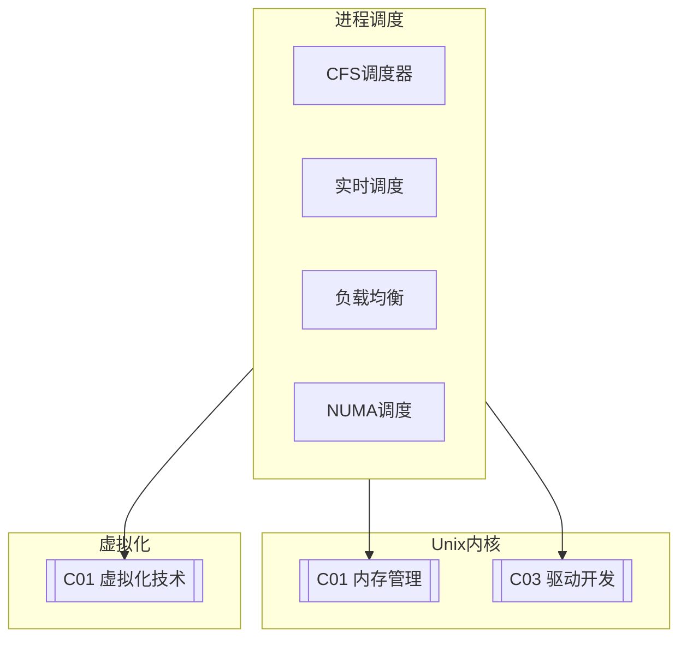

# C02 Process Scheduling

**所属子领域**: [B02_Unix_Kernel](../README.md)  
**创建日期**: 2026-01-30  
**最后更新**: 2026-01-30

## 📋 主题定位

进程调度是操作系统内核的核心功能之一，它决定哪个进程在何时使用CPU资源。高效的进程调度直接影响系统的响应性、吞吐量和公平性。在现代多核系统中，调度器还需要考虑NUMA拓扑、CPU缓存亲和性、能耗管理以及实时性需求等复杂因素。

Linux内核经历了多次调度器的重大演进：从O(n)调度器到O(1)调度器，再到现在的完全公平调度器（CFS, Completely Fair Scheduler）和实时调度器。CFS通过红黑树实现O(log n)的时间复杂度，为普通进程提供公平的时间分配；而实时调度器则采用优先级队列，满足硬实时和软实时应用的需求。

本专题深入探讨Linux调度器的原理、实现、调优实践以及与容器化、虚拟化技术的结合。

## 🎯 核心概念

### 调度基础

**进程状态**: 进程在其生命周期中经历多种状态
- **TASK_RUNNING**: 可运行状态，可能在CPU上运行或在运行队列中等待
- **TASK_INTERRUPTIBLE**: 可中断睡眠，等待事件或信号
- **TASK_UNINTERRUPTIBLE**: 不可中断睡眠，通常等待I/O
- **TASK_STOPPED**: 被信号停止
- **TASK_ZOMBIE**: 僵尸状态，等待父进程回收

**调度策略**: Linux支持多种调度策略

| 策略 | 值 | 说明 | 适用场景 |
|-----|-----|------|---------|
| **SCHED_NORMAL** | 0 | 普通进程，基于CFS | 一般应用 |
| **SCHED_FIFO** | 1 | 实时FIFO，直到阻塞或被抢占 | 硬实时 |
| **SCHED_RR** | 2 | 实时轮转，时间片轮转 | 软实时 |
| **SCHED_BATCH** | 3 | 批处理，低优先级 | 后台任务 |
| **SCHED_IDLE** | 5 | 空闲调度，最低优先级 | 极低优先级 |
| **SCHED_DEADLINE** | 6 | 截止时间调度，EDF算法 | 实时系统 |

### Linux调度器架构

```
┌─────────────────────────────────────────────────────────────────────────┐
│                         Linux调度器架构                                  │
├─────────────────────────────────────────────────────────────────────────┤
│                                                                         │
│  ┌─────────────────────────────────────────────────────────────────┐   │
│  │                     调度类（Sched Class）                         │   │
│  │                                                                 │   │
│  │  调度类优先级（从高到低）:                                         │   │
│  │                                                                 │   │
│  │  ┌─────────────────────────────────────────────────────────┐   │   │
│  │  │  stop_sched_class     - 停止/迁移任务 (最高优先级)        │   │   │
│  │  ├─────────────────────────────────────────────────────────┤   │   │
│  │  │  dl_sched_class       - 截止时间调度 (EDF算法)            │   │   │
│  │  ├─────────────────────────────────────────────────────────┤   │   │
│  │  │  rt_sched_class       - 实时调度 (FIFO/RR)                │   │   │
│  │  ├─────────────────────────────────────────────────────────┤   │   │
│  │  │  fair_sched_class     - CFS公平调度 (普通进程)            │   │   │
│  │  ├─────────────────────────────────────────────────────────┤   │   │
│  │  │  idle_sched_class     - 空闲调度 (最低优先级)             │   │   │
│  │  └─────────────────────────────────────────────────────────┘   │   │
│  │                                                                 │   │
│  │  特点: 高优先级调度类抢占低优先级调度类                            │   │
│  │                                                                 │   │
│  └─────────────────────────────────────────────────────────────────┘   │
│                              │                                          │
│                              ▼                                          │
│  ┌─────────────────────────────────────────────────────────────────┐   │
│  │                    CFS (完全公平调度器)                          │   │
│  │                                                                 │   │
│  │  核心概念: vruntime (虚拟运行时间)                               │   │
│  │                                                                 │   │
│  │  vruntime = 实际运行时间 × (nice_0_weight / 进程权重)            │   │
│  │                                                                 │   │
│  │  选择vruntime最小的进程运行，实现公平性                            │   │
│  │                                                                 │   │
│  │  数据结构:                                                      │   │
│  │  ┌─────────────────────────────────────────────────────────┐   │   │
│  │  │  struct rb_root_cached tasks_timeline;  // 红黑树          │   │   │
│  │  │  struct sched_entity *curr;              // 当前任务        │   │   │
│  │  │  unsigned long nr_running;               // 可运行任务数    │   │   │
│  │  │  u64 min_vruntime;                       // 最小vruntime    │   │   │
│  │  └─────────────────────────────────────────────────────────┘   │   │
│  │                                                                 │   │
│  │  时间片计算:                                                    │   │
│  │  slice = sched_period × (进程权重 / 所有进程权重之和)            │   │
│  │                                                                 │   │
│  └─────────────────────────────────────────────────────────────────┘   │
│                              │                                          │
│                              ▼                                          │
│  ┌─────────────────────────────────────────────────────────────────┐   │
│  │                    多核调度 (SMP)                                 │   │
│  │                                                                 │   │
│  │  每个CPU有自己的运行队列:                                        │   │
│  │  struct rq {                                                    │   │
│  │      struct cfs_rq cfs;      // CFS运行队列                      │   │
│  │      struct rt_rq rt;        // RT运行队列                       │   │
│  │      struct dl_rq dl;        // DL运行队列                       │   │
│  │      struct task_struct *curr;  // 当前运行任务                  │   │
│  │      int cpu;                // CPU编号                          │   │
│  │      ...                                                        │   │
│  │  }                                                              │   │
│  │                                                                 │   │
│  │  负载均衡:                                                      │   │
│  │  - 周期性负载均衡 (tick时检查)                                    │   │
│  │  - 空闲时负载均衡 (CPU空闲时)                                     │   │
│  │  - 繁忙时负载均衡 (fork/exec时)                                   │   │
│  │                                                                 │   │
│  │  NUMA感知:                                                      │   │
│  │  - 优先在同NUMA节点内迁移                                        │   │
│  │  - 考虑内存本地性                                                │   │
│  │                                                                 │   │
│  └─────────────────────────────────────────────────────────────────┘   │
│                                                                         │
└─────────────────────────────────────────────────────────────────────────┘
```

### CFS调度原理

```
┌─────────────────────────────────────────────────────────────────────────┐
│                       CFS调度原理详解                                    │
├─────────────────────────────────────────────────────────────────────────┤
│                                                                         │
│  1. vruntime计算                                                        │
│                                                                         │
│     权重表（nice值对应权重）:                                            │
│     nice: -20  -10   0   10   19                                        │
│     weight: 88761  3121  1024  95   15                                  │
│                                                                         │
│     vruntime增长速率:                                                    │
│     - nice 0 (权重1024): 实际时间 = vruntime                            │
│     - nice -5 (权重3121): vruntime增长慢3倍，获得更多CPU时间            │
│     - nice 5 (权重335): vruntime增长快3倍，获得更少CPU时间              │
│                                                                         │
│  2. 红黑树调度                                                           │
│                                                                         │
│           ┌─────────┐                                                   │
│           │  v=100  │  ← 当前运行进程（最左节点）                         │
│           └────┬────┘                                                   │
│         ┌──────┴──────┐                                                 │
│      ┌──┴──┐       ┌──┴──┐                                              │
│   ┌──┤v=150├─┐   ┌─┤v=200├──┐                                           │
│   │  └─────┘ │   │ └─────┘  │                                           │
│ ┌─┴┐       ┌─┴┐ ┌┴┐       ┌┴┐                                           │
│ │250│      │300│ │220│     │180│                                          │
│ └───┘      └───┘ └───┘     └───┘                                         │
│                                                                         │
│  调度器总是选择最左侧（vruntime最小）的进程运行                           │
│                                                                         │
│  3. 调度周期                                                            │
│                                                                         │
│  sched_latency (默认6ms)                                                │
│       │                                                                 │
│       ▼                                                                 │
│  ┌─────────────────────────────────────────────────────────────────┐   │
│  │  进程A    │  进程B    │  进程C    │  进程D    │  进程E    │      │   │
│  │  (20%)   │  (20%)   │  (20%)   │  (20%)   │  (20%)   │      │   │
│  │  1.2ms   │  1.2ms   │  1.2ms   │  1.2ms   │  1.2ms   │      │   │
│  └─────────────────────────────────────────────────────────────────┘   │
│                                                                         │
│  当进程数超过sched_nr_latency (8)时，使用sched_min_granularity (0.75ms) │
│                                                                         │
└─────────────────────────────────────────────────────────────────────────┘
```

### 负载均衡机制

```
┌─────────────────────────────────────────────────────────────────────────┐
│                        CPU负载均衡机制                                   │
├─────────────────────────────────────────────────────────────────────────┤
│                                                                         │
│  场景1: 周期性负载均衡                                                   │
│                                                                         │
│  CPU 0 (负载高)              CPU 1 (负载低)                              │
│  ┌─────────────┐             ┌─────────────┐                            │
│  │  P1 P2 P3   │  ───────→  │  P1 P2      │                            │
│  │  P4 P5 P6   │   迁移P5   │  P3 P4      │                            │
│  └─────────────┘             └─────────────┘                            │
│                                                                         │
│  场景2: 新进程创建 (fork/exec)                                           │
│                                                                         │
│  选择负载最低的CPU执行新进程:                                             │
│  target_cpu = min_load_cpu()                                           │
│                                                                         │
│  场景3: 进程唤醒                                                           │
│                                                                         │
│  考虑因素:                                                              │
│  - 上次运行的CPU (缓存亲和性)                                            │
│  - 当前负载                                                             │
│  - NUMA节点亲和性                                                        │
│  - 节能考虑                                                             │
│                                                                         │
│  wakeup_cpu = select_task_rq_fair(task, prev_cpu)                      │
│                                                                         │
│  场景4: 繁忙负载均衡                                                     │
│                                                                         │
│  当CPU过载且其他CPU空闲时，主动拉取任务                                  │
│                                                                         │
└─────────────────────────────────────────────────────────────────────────┘
```

## 🛠️ 技术实践

### 调度监控与分析

**1. 调度延迟监控（BPF工具）**

```bash
#!/bin/bash
# 调度延迟监控脚本
# 使用bpftrace分析调度延迟

set -e

DURATION=${1:-30}

echo "=== 调度延迟监控 ==="
echo "监控时长: ${DURATION}秒"
echo ""

# 检查bpftrace
if ! command -v bpftrace &> /dev/null; then
    echo "错误: bpftrace未安装"
    exit 1
fi

# 调度延迟直方图
bpftrace -e '
BEGIN {
    printf("开始监控调度延迟...\n");
}

sched:::sched_switch {
    // 记录任务离开CPU的时间
    @start[args->next->comm] = nsecs;
}

sched:::sched_switch /@start[args->prev->comm]/ {
    // 计算调度延迟 (等待时间)
    $lat_us = (nsecs - @start[args->prev->comm]) / 1000;
    @latency_us = hist($lat_us);
    delete(@start[args->prev->comm]);
}

interval:s:5 {
    printf("\n=== %s ===\n", strftime("%H:%M:%S"));
    print(@latency_us);
    clear(@latency_us);
}

END {
    printf("监控结束\n");
    print(@latency_us);
}
' 2>/dev/null &

BPID=$!
sleep $DURATION
kill $BPID 2>/dev/null || true

echo ""
echo "=== 调度延迟分析完成 ==="
```

**2. 进程调度分析（Python）**

```python
#!/usr/bin/env python3
"""
进程调度分析工具
分析/proc/schedstat和/proc/sched_debug
"""

import os
import re
import time
from dataclasses import dataclass
from typing import Dict, List, Optional
from collections import defaultdict


@dataclass
class SchedStats:
    """调度统计"""
    pid: int
    comm: str
    cpu_time_ns: int
    wait_time_ns: int
    timeslices: int
    nr_migrations: int


class SchedulerAnalyzer:
    """调度器分析器"""
    
    def __init__(self):
        self.prev_stats: Dict[int, SchedStats] = {}
        
    def read_schedstat(self) -> Dict[int, SchedStats]:
        """读取/proc/schedstat"""
        stats = {}
        
        try:
            with open('/proc/schedstat', 'r') as f:
                lines = f.readlines()
            
            # 版本信息在第一行
            version = lines[0].strip()
            
            for line in lines[1:]:
                # 格式: cpuN <running> <waiting> <timeslices> ...
                if line.startswith('cpu'):
                    parts = line.split()
                    cpu = parts[0]
                    running_ns = int(parts[1])
                    waiting_ns = int(parts[2])
                    timeslices = int(parts[3])
                    
                    # 这里简化处理，实际需要解析更多字段
                    
        except Exception as e:
            print(f"读取schedstat失败: {e}")
        
        return stats
    
    def read_task_schedstat(self, pid: int) -> Optional[SchedStats]:
        """读取单个任务的调度统计"""
        try:
            path = f'/proc/{pid}/schedstat'
            with open(path, 'r') as f:
                data = f.read().strip()
            
            # 格式: cpu_time_ns wait_time_ns timeslices
            parts = data.split()
            if len(parts) >= 3:
                # 获取进程名
                with open(f'/proc/{pid}/comm', 'r') as f:
                    comm = f.read().strip()
                
                return SchedStats(
                    pid=pid,
                    comm=comm,
                    cpu_time_ns=int(parts[0]),
                    wait_time_ns=int(parts[1]),
                    timeslices=int(parts[2]),
                    nr_migrations=0  # 需要额外读取
                )
        except:
            pass
        
        return None
    
    def get_all_tasks_stats(self) -> Dict[int, SchedStats]:
        """获取所有任务的调度统计"""
        stats = {}
        
        for pid_str in os.listdir('/proc'):
            try:
                pid = int(pid_str)
                task_stat = self.read_task_schedstat(pid)
                if task_stat:
                    stats[pid] = task_stat
            except ValueError:
                continue
        
        return stats
    
    def calculate_delta(self, 
                        current: Dict[int, SchedStats]) -> List[Dict]:
        """计算两次采样之间的差异"""
        deltas = []
        
        for pid, curr in current.items():
            if pid in self.prev_stats:
                prev = self.prev_stats[pid]
                
                cpu_delta = curr.cpu_time_ns - prev.cpu_time_ns
                wait_delta = curr.wait_time_ns - prev.wait_time_ns
                slice_delta = curr.timeslices - prev.timeslices
                
                if cpu_delta > 0 or wait_delta > 0:
                    deltas.append({
                        'pid': pid,
                        'comm': curr.comm,
                        'cpu_ms': cpu_delta / 1_000_000,
                        'wait_ms': wait_delta / 1_000_000,
                        'timeslices': slice_delta,
                        'avg_slice_us': (cpu_delta / slice_delta / 1000) if slice_delta > 0 else 0
                    })
        
        self.prev_stats = current
        return deltas
    
    def analyze_scheduler_tunables(self) -> Dict:
        """分析调度器可调参数"""
        tunables = {}
        
        try:
            # CFS调度参数
            with open('/proc/sys/kernel/sched_latency_ns', 'r') as f:
                tunables['sched_latency_ns'] = int(f.read().strip())
            
            with open('/proc/sys/kernel/sched_min_granularity_ns', 'r') as f:
                tunables['sched_min_granularity_ns'] = int(f.read().strip())
            
            with open('/proc/sys/kernel/sched_wakeup_granularity_ns', 'r') as f:
                tunables['sched_wakeup_granularity_ns'] = int(f.read().strip())
            
            with open('/proc/sys/kernel/sched_migration_cost_ns', 'r') as f:
                tunables['sched_migration_cost_ns'] = int(f.read().strip())
            
            with open('/proc/sys/kernel/sched_nr_migrate', 'r') as f:
                tunables['sched_nr_migrate'] = int(f.read().strip())
            
            # 负载均衡
            with open('/proc/sys/kernel/sched_domain/cpu0/domain0/min_interval', 'r') as f:
                tunables['load_balance_min_interval'] = int(f.read().strip())
                
        except Exception as e:
            print(f"读取调度参数失败: {e}")
        
        return tunables
    
    def generate_report(self) -> Dict:
        """生成调度分析报告"""
        stats = self.get_all_tasks_stats()
        deltas = self.calculate_delta(stats)
        tunables = self.analyze_scheduler_tunables()
        
        # 按CPU时间排序
        top_cpu = sorted(deltas, key=lambda x: x['cpu_ms'], reverse=True)[:10]
        
        # 按等待时间排序
        top_wait = sorted(deltas, key=lambda x: x['wait_ms'], reverse=True)[:10]
        
        # 计算平均调度延迟
        total_wait = sum(d['wait_ms'] for d in deltas)
        avg_wait = total_wait / len(deltas) if deltas else 0
        
        return {
            'timestamp': time.time(),
            'tunables': tunables,
            'summary': {
                'total_tasks': len(stats),
                'active_tasks': len(deltas),
                'avg_wait_ms': round(avg_wait, 2)
            },
            'top_cpu_consumers': top_cpu,
            'top_wait_tasks': top_wait
        }
    
    def continuous_monitor(self, interval: int = 5):
        """持续监控"""
        print(f"开始调度监控 (间隔: {interval}秒)")
        print("=" * 60)
        
        while True:
            # 第一次采样
            self.get_all_tasks_stats()
            time.sleep(interval)
            
            # 第二次采样并计算
            report = self.generate_report()
            
            print(f"\n[{time.strftime('%H:%M:%S')}]")
            print(f"活跃任务: {report['summary']['active_tasks']}")
            print(f"平均等待: {report['summary']['avg_wait_ms']:.2f} ms")
            
            print("\nCPU使用TOP5:")
            for i, task in enumerate(report['top_cpu_consumers'][:5], 1):
                print(f"  {i}. {task['comm']}({task['pid']}): "
                      f"{task['cpu_ms']:.1f}ms CPU, "
                      f"{task['wait_ms']:.1f}ms wait")


if __name__ == '__main__':
    import json
    import argparse
    
    parser = argparse.ArgumentParser(description='调度分析工具')
    parser.add_argument('--interval', '-i', type=int, default=5)
    parser.add_argument('--output', '-o', type=str)
    args = parser.parse_args()
    
    analyzer = SchedulerAnalyzer()
    
    if args.output:
        report = analyzer.generate_report()
        with open(args.output, 'w') as f:
            json.dump(report, f, indent=2)
        print(f"报告已保存: {args.output}")
    else:
        try:
            analyzer.continuous_monitor(args.interval)
        except KeyboardInterrupt:
            print("\n监控已停止")
```

### 调度参数调优

**3. 调度器调优脚本**

```bash
#!/bin/bash
# Linux调度器参数调优
# 适用于不同工作负载场景

set -e

SCENARIO=${1:-"general"}

# 颜色输出
RED='\033[0;31m'
GREEN='\033[0;32m'
YELLOW='\033[1;33m'
NC='\033[0m'

echo "=== Linux调度器调优 ==="
echo "场景: $SCENARIO"
echo ""

# 备份当前配置
BACKUP_DIR="/etc/sysctl.d/sched-backup-$(date +%Y%m%d)"
mkdir -p "$BACKUP_DIR"
cp /etc/sysctl.d/*.conf "$BACKUP_DIR/" 2>/dev/null || true

case "$SCENARIO" in
    "latency")
        echo "配置: 低延迟场景（桌面/交互式应用）"
        cat > /etc/sysctl.d/99-sched-latency.conf << 'EOF'
# 低延迟调度配置

# 减少调度延迟
kernel.sched_latency_ns = 4000000          # 4ms (默认6ms)
kernel.sched_min_granularity_ns = 500000   # 0.5ms
kernel.sched_wakeup_granularity_ns = 500000

# 减少负载均衡开销
kernel.sched_migration_cost_ns = 250000
kernel.sched_nr_migrate = 16

# 优先保护前台任务
kernel.sched_tunable_scaling = 1
kernel.sched_child_runs_first = 1
EOF
        ;;
        
    "throughput")
        echo "配置: 高吞吐场景（服务器/批处理）"
        cat > /etc/sysctl.d/99-sched-throughput.conf << 'EOF'
# 高吞吐调度配置

# 增加时间片，减少上下文切换
kernel.sched_latency_ns = 12000000         # 12ms
kernel.sched_min_granularity_ns = 1500000  # 1.5ms
kernel.sched_wakeup_granularity_ns = 2000000

# 增加迁移成本，减少缓存失效
kernel.sched_migration_cost_ns = 10000000
kernel.sched_nr_migrate = 32

# 禁用子进程优先（批处理场景）
kernel.sched_child_runs_first = 0
EOF
        ;;
        
    "realtime")
        echo "配置: 实时场景（工业控制/音视频）"
        cat > /etc/sysctl.d/99-sched-realtime.conf << 'EOF'
# 实时调度配置

# 最小化调度延迟
kernel.sched_latency_ns = 2000000          # 2ms
kernel.sched_min_granularity_ns = 250000
kernel.sched_wakeup_granularity_ns = 250000

# 减少迁移延迟
kernel.sched_migration_cost_ns = 100000

# 实时进程优先级提升
kernel.sched_rt_period_us = 1000000
kernel.sched_rt_runtime_us = 950000        # 允许RT占用95%的CPU

# 禁用自动NUMA均衡（减少延迟抖动）
kernel.numa_balancing = 0
EOF
        ;;
        
    *)
        echo "配置: 通用场景"
        cat > /etc/sysctl.d/99-sched-general.conf << 'EOF'
# 通用调度配置（平衡延迟和吞吐）

kernel.sched_latency_ns = 6000000          # 6ms (默认)
kernel.sched_min_granularity_ns = 750000   # 0.75ms
kernel.sched_wakeup_granularity_ns = 1000000

kernel.sched_migration_cost_ns = 500000
kernel.sched_nr_migrate = 32
EOF
        ;;
esac

# 应用配置
echo ""
echo "正在应用配置..."
sysctl --system

echo ""
echo "=== 当前调度参数 ==="
echo "sched_latency_ns: $(sysctl -n kernel.sched_latency_ns)"
echo "sched_min_granularity_ns: $(sysctl -n kernel.sched_min_granularity_ns)"
echo "sched_wakeup_granularity_ns: $(sysctl -n kernel.sched_wakeup_granularity_ns)"
echo "sched_migration_cost_ns: $(sysctl -n kernel.sched_migration_cost_ns)"

echo ""
echo "=== 调优完成 ==="
echo "配置文件: /etc/sysctl.d/99-sched-*.conf"
```

## 📚 资源索引

### 内核文档

| 文档 | 路径 | 说明 |
|-----|------|------|
| **Scheduler** | Documentation/scheduler/ | 调度器文档 |
| **CFS** | Documentation/scheduler/sched-design-CFS.rst | CFS设计文档 |
| **RT** | Documentation/scheduler/sched-rt-group.rst | 实时调度 |
| **Deadline** | Documentation/scheduler/sched-deadline.rst | 截止时间调度 |

### 工具与项目

| 工具 | 用途 | 链接 |
|-----|------|------|
| **schedtool** | 调度策略控制 | Debian/Ubuntu包 |
| **chrt** | 实时优先级设置 | util-linux |
| **taskset** | CPU亲和性设置 | util-linux |
| **numactl** | NUMA控制 | numactl包 |

### 推荐资源

1. **《Linux Kernel Development》** - Robert Love
   - 第4章详细讲解进程调度

2. **《Understanding Linux CPU Scheduling》** - Red Hat
   - Red Hat官方调度文档

## 🔗 关联知识



## 💡 学习建议

### 入门路径

1. **基础概念**（1-2周）
   - 理解进程状态
   - 调度策略分类
   - CFS基本原理

2. **内核实现**（3-4周）
   - 阅读kernel/sched/代码
   - 理解红黑树实现
   - 负载均衡机制

3. **性能调优**（5-6周）
   - 调度参数调优
   - 实时性能优化
   - 调度延迟分析

---

*最后更新: 2026-01-30*  
*维护者: Infrastructure Team*
