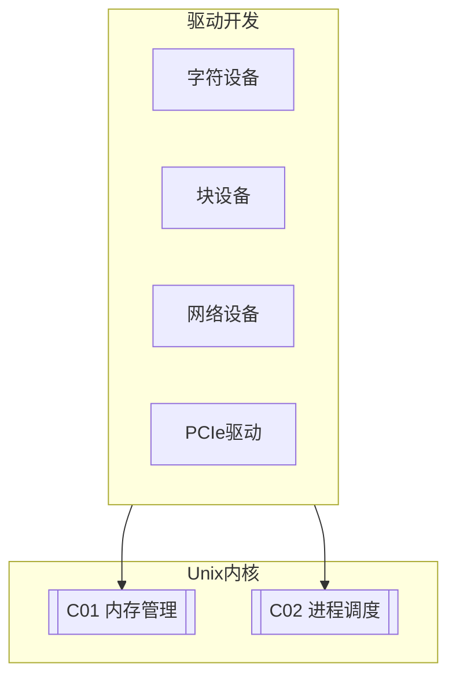

# C03 Driver Development

**所属子领域**: [B02_Unix_Kernel](../README.md)  
**创建日期**: 2026-01-30  
**最后更新**: 2026-01-30

## 📋 主题定位

设备驱动程序是操作系统内核与硬件设备之间的桥梁，它负责将通用的系统调用转换为特定硬件的操作指令，同时管理硬件资源、处理中断、提供并发控制。驱动开发是内核开发中最具挑战性也最能体现硬件交互细节的领域。

Linux驱动子系统经历了从单一的整体式驱动模型到现代的总线-设备-驱动分离架构的演进。当前Linux内核支持多种驱动模型：字符设备、块设备、网络设备、PCIe设备、USB设备、平台设备等，每种都有其特定的编程接口和生命周期管理。

本专题系统介绍Linux设备驱动开发的基础知识、核心机制、调试技巧以及现代驱动框架（如DPDK、VFIO）的应用，帮助开发者掌握从简单字符设备到高性能驱动的开发技能。

## 🎯 核心概念

### 设备类型

| 设备类型 | 说明 | 示例 | 主要接口 |
|---------|------|------|---------|
| **字符设备** | 字节流访问 | 串口、GPIO | file_operations |
| **块设备** | 随机访问，有缓存 | 硬盘、SSD | block_device_operations |
| **网络设备** | 包传输 | 网卡 | net_device_ops |
| **PCIe设备** | 高速扩展设备 | GPU、NVMe | pci_driver |
| **USB设备** | 热插拔设备 | U盘、摄像头 | usb_driver |
| **平台设备** | SoC内置设备 | I2C、SPI、Timer | platform_driver |

### Linux设备模型

```
┌─────────────────────────────────────────────────────────────────────────┐
│                         Linux设备模型架构                                │
├─────────────────────────────────────────────────────────────────────────┤
│                                                                         │
│  ┌─────────────────────────────────────────────────────────────────┐   │
│  │                      总线 (Bus)                                  │   │
│  │  ┌─────────┐  ┌─────────┐  ┌─────────┐  ┌─────────┐            │   │
│  │  │  platform│  │   pci   │  │   usb   │  │   i2c   │  ...      │   │
│  │  │  总线   │  │  总线   │  │  总线   │  │  总线   │           │   │
│  │  └────┬────┘  └────┬────┘  └────┬────┘  └────┬────┘            │   │
│  │       │            │            │            │                  │   │
│  │       └────────────┴────────────┴────────────┘                  │   │
│  │                    match() - 匹配设备和驱动                      │   │
│  │                    probe() - 初始化设备                          │   │
│  │                    remove() - 移除设备                           │   │
│  └─────────────────────────────────────────────────────────────────┘   │
│                              │                                          │
│           ┌──────────────────┼──────────────────┐                      │
│           ▼                  ▼                  ▼                      │
│  ┌───────────────┐  ┌───────────────┐  ┌───────────────┐              │
│  │    设备       │  │    驱动       │  │   类 (Class)   │              │
│  │  (Device)     │  │  (Driver)     │  │                │              │
│  │               │  │               │  │ 抽象设备类型    │              │
│  │ 硬件的抽象    │  │ 驱动的抽象    │  │                │              │
│  │               │  │               │  │ • input        │              │
│  │ • 设备树节点  │  │ • probe/remove│  │ • net          │              │
│  │ • 资源描述    │  │ • 操作接口    │  │ • block        │              │
│  │ • 属性        │  │ • 配置参数    │  │ • tty          │              │
│  │               │  │               │  │ • usb          │              │
│  └───────────────┘  └───────────────┘  └───────────────┘              │
│                                                                         │
│  sysfs文件系统映射:                                                      │
│  /sys/bus/      - 所有注册的总线                                         │
│  /sys/devices/  - 设备树                                                 │
│  /sys/class/    - 按类别组织的设备                                       │
│  /sys/module/   - 已加载的模块                                           │
│                                                                         │
└─────────────────────────────────────────────────────────────────────────┘
```

### 字符设备驱动框架

```
┌─────────────────────────────────────────────────────────────────────────┐
│                       字符设备驱动架构                                   │
├─────────────────────────────────────────────────────────────────────────┤
│                                                                         │
│  用户空间                                                                │
│  ┌─────────────────────────────────────────────────────────────────┐   │
│  │  open()  read()  write()  ioctl()  mmap()  close()              │   │
│  └─────────────────────────────────────────────────────────────────┘   │
│                              ↓ 系统调用                                 │
│  内核空间                                                                │
│  ┌─────────────────────────────────────────────────────────────────┐   │
│  │                     虚拟文件系统 (VFS)                            │   │
│  │                      chrdev_open()                                │   │
│  └─────────────────────────────────────────────────────────────────┘   │
│                              ↓                                          │
│  ┌─────────────────────────────────────────────────────────────────┐   │
│  │                    字符设备核心层                                 │   │
│  │                                                                 │   │
│  │  设备号 (dev_t) = 主设备号 (12bit) + 次设备号 (20bit)            │   │
│  │                                                                 │   │
│  │  cdev结构:                                                      │   │
│  │  struct cdev {                                                  │   │
│  │      struct kobject kobj;                                       │   │
│  │      struct module *owner;                                      │   │
│  │      const struct file_operations *ops;                         │   │
│  │      struct list_head list;                                     │   │
│  │      dev_t dev;                                                 │   │
│  │      unsigned int count;                                        │   │
│  │  };                                                             │   │
│  │                                                                 │   │
│  └─────────────────────────────────────────────────────────────────┘   │
│                              ↓                                          │
│  ┌─────────────────────────────────────────────────────────────────┐   │
│  │                    设备驱动实现                                   │   │
│  │                                                                 │   │
│  │  struct file_operations my_fops = {                             │   │
│  │      .owner = THIS_MODULE,                                      │   │
│  │      .open = my_open,                                           │   │
│  │      .read = my_read,                                           │   │
│  │      .write = my_write,                                         │   │
│  │      .ioctl = my_ioctl,                                         │   │
│  │      .mmap = my_mmap,                                           │   │
│  │      .release = my_release,                                     │   │
│  │  };                                                             │   │
│  │                                                                 │   │
│  │  static int __init my_init(void) {                              │   │
│  │      alloc_chrdev_region(&dev, 0, 1, "mydev");                   │   │
│  │      cdev_init(&my_cdev, &my_fops);                             │   │
│  │      cdev_add(&my_cdev, dev, 1);                                │   │
│  │  }                                                              │   │
│  │                                                                 │   │
│  └─────────────────────────────────────────────────────────────────┘   │
│                              ↓                                          │
│  ┌─────────────────────────────────────────────────────────────────┐   │
│  │                    硬件操作层                                     │   │
│  │                                                                 │   │
│  │  • MMIO寄存器访问 (ioremap/readl/writel)                        │   │
│  │  • DMA操作                                                      │   │
│  │  • 中断处理 (request_irq/free_irq)                              │   │
│  │  • 时钟/定时器                                                  │   │
│  │                                                                 │   │
│  └─────────────────────────────────────────────────────────────────┘   │
│                                                                         │
└─────────────────────────────────────────────────────────────────────────┘
```

### 中断处理机制

```
┌─────────────────────────────────────────────────────────────────────────┐
│                        Linux中断处理机制                                 │
├─────────────────────────────────────────────────────────────────────────┤
│                                                                         │
│  硬件中断                                                                │
│      │                                                                  │
│      ▼                                                                  │
│  ┌─────────────────────────────────────────────────────────────────┐   │
│  │                    上半部 (Top Half) - 硬中断                     │   │
│  │                                                                 │   │
│  │  特点:                                                          │   │
│  │  • 快速执行，关中断运行                                          │   │
│  │  • 保存状态，调度下半部                                          │   │
│  │  • 最小化关键代码                                                │   │
│  │                                                                 │   │
│  │  static irqreturn_t my_irq_handler(int irq, void *dev_id) {     │   │
│  │      // 1. 确认中断源                                            │   │
│  │      // 2. 读取关键数据                                          │   │
│  │      // 3. 调度下半部                                            │   │
│  │      schedule_work(&my_work);  // 或 tasklet_schedule()          │   │
│  │      return IRQ_HANDLED;                                        │   │
│  │  }                                                              │   │
│  │                                                                 │   │
│  └─────────────────────────────────────────────────────────────────┘   │
│                              ↓                                          │
│  ┌─────────────────────────────────────────────────────────────────┐   │
│  │                    下半部 (Bottom Half)                           │   │
│  │                                                                 │   │
│  │  机制选择:                                                       │   │
│  │                                                                 │   │
│  │  ┌─────────────┐  ┌─────────────┐  ┌─────────────────────────┐ │   │
│  │  │   softirq   │  │   tasklet   │  │       workqueue         │ │   │
│  │  ├─────────────┤  ├─────────────┤  ├─────────────────────────┤ │   │
│  │  │ • 最高性能   │  │ • softirq   │  │ • 进程上下文            │ │   │
│  │  │ • 静态分配   │  │   的封装    │  │ • 可以睡眠              │ │   │
│  │  │ • 不能睡眠   │  │ • 同一tasklet│ │ • 延迟较大              │ │   │
│  │  │ • 同类型串行 │  │   不会并行  │  │ • 推荐用于I/O操作        │ │   │
│  │  │ • 网络/块层  │  │ • 不可睡眠  │  │                         │ │   │
│  │  │   使用      │  │ • 简单设备  │  │                         │ │   │
│  │  └─────────────┘  └─────────────┘  └─────────────────────────┘ │   │
│  │                                                                 │   │
│  │  void my_work_handler(struct work_struct *work) {               │   │
│  │      // 可以睡眠的操作                                           │   │
│  │      // 数据处理                                                 │   │
│  │      // 用户态通知                                               │   │
│  │  }                                                              │   │
│  │                                                                 │   │
│  └─────────────────────────────────────────────────────────────────┘   │
│                                                                         │
│  现代替代方案: threaded IRQ                                             │
│  request_threaded_irq(irq, handler, thread_fn, ...)                     │
│  - handler为NULL时，所有处理都在线程中                                  │
│  - 自动将中断处理线程化，简化编程                                        │
│                                                                         │
└─────────────────────────────────────────────────────────────────────────┘
```

## 🛠️ 技术实践

### 简单字符设备驱动

**1. Hello World字符设备驱动**

```c
/*
 * hello_cdev.c - 简单字符设备驱动示例
 * 演示基本的字符设备注册、file_operations实现
 */

#include <linux/module.h>
#include <linux/fs.h>
#include <linux/cdev.h>
#include <linux/uaccess.h>
#include <linux/device.h>

#define DEVICE_NAME "hello_cdev"
#define CLASS_NAME "hello"
#define BUFFER_SIZE 1024

static int major;
static struct class *hello_class = NULL;
static struct cdev hello_cdev;
static dev_t dev_num;

/* 设备缓冲区 */
static char device_buffer[BUFFER_SIZE];
static size_t buffer_pos = 0;

/* 打开设备 */
static int hello_open(struct inode *inode, struct file *file)
{
    pr_info("hello_cdev: 设备被打开\n");
    return 0;
}

/* 释放设备 */
static int hello_release(struct inode *inode, struct file *file)
{
    pr_info("hello_cdev: 设备被释放\n");
    return 0;
}

/* 读取设备 */
static ssize_t hello_read(struct file *file, char __user *user_buffer,
                         size_t count, loff_t *offset)
{
    size_t available = buffer_pos - *offset;
    size_t to_read = min(count, available);
    
    if (to_read == 0)
        return 0;
    
    if (copy_to_user(user_buffer, device_buffer + *offset, to_read))
        return -EFAULT;
    
    *offset += to_read;
    pr_info("hello_cdev: 读取 %zu 字节\n", to_read);
    
    return to_read;
}

/* 写入设备 */
static ssize_t hello_write(struct file *file, const char __user *user_buffer,
                          size_t count, loff_t *offset)
{
    size_t available = BUFFER_SIZE - buffer_pos;
    size_t to_write = min(count, available);
    
    if (to_write == 0)
        return -ENOSPC;
    
    if (copy_from_user(device_buffer + buffer_pos, user_buffer, to_write))
        return -EFAULT;
    
    buffer_pos += to_write;
    *offset = buffer_pos;
    
    pr_info("hello_cdev: 写入 %zu 字节\n", to_write);
    
    return to_write;
}

/* ioctl 控制 */
static long hello_ioctl(struct file *file, unsigned int cmd, unsigned long arg)
{
    switch (cmd) {
    case 0x01:  /* 清空缓冲区 */
        buffer_pos = 0;
        memset(device_buffer, 0, BUFFER_SIZE);
        pr_info("hello_cdev: 缓冲区已清空\n");
        break;
        
    case 0x02:  /* 获取缓冲区大小 */
        return put_user(buffer_pos, (size_t __user *)arg);
        
    default:
        return -EINVAL;
    }
    
    return 0;
}

/* 文件操作表 */
static struct file_operations hello_fops = {
    .owner = THIS_MODULE,
    .open = hello_open,
    .release = hello_release,
    .read = hello_read,
    .write = hello_write,
    .unlocked_ioctl = hello_ioctl,
    .llseek = default_llseek,
};

/* 模块初始化 */
static int __init hello_init(void)
{
    int ret;
    
    pr_info("hello_cdev: 模块加载\n");
    
    /* 1. 分配设备号 */
    ret = alloc_chrdev_region(&dev_num, 0, 1, DEVICE_NAME);
    if (ret < 0) {
        pr_err("hello_cdev: 分配设备号失败\n");
        return ret;
    }
    major = MAJOR(dev_num);
    pr_info("hello_cdev: 主设备号 %d\n", major);
    
    /* 2. 创建设备类 */
    hello_class = class_create(THIS_MODULE, CLASS_NAME);
    if (IS_ERR(hello_class)) {
        pr_err("hello_cdev: 创建类失败\n");
        unregister_chrdev_region(dev_num, 1);
        return PTR_ERR(hello_class);
    }
    
    /* 3. 初始化并添加字符设备 */
    cdev_init(&hello_cdev, &hello_fops);
    hello_cdev.owner = THIS_MODULE;
    
    ret = cdev_add(&hello_cdev, dev_num, 1);
    if (ret) {
        pr_err("hello_cdev: 添加字符设备失败\n");
        class_destroy(hello_class);
        unregister_chrdev_region(dev_num, 1);
        return ret;
    }
    
    /* 4. 创建设备节点 */
    device_create(hello_class, NULL, dev_num, NULL, DEVICE_NAME);
    
    pr_info("hello_cdev: 设备 /dev/%s 创建成功\n", DEVICE_NAME);
    return 0;
}

/* 模块卸载 */
static void __exit hello_exit(void)
{
    pr_info("hello_cdev: 模块卸载\n");
    
    device_destroy(hello_class, dev_num);
    cdev_del(&hello_cdev);
    class_destroy(hello_class);
    unregister_chrdev_region(dev_num, 1);
    
    pr_info("hello_cdev: 设备已移除\n");
}

module_init(hello_init);
module_exit(hello_exit);

MODULE_LICENSE("GPL");
MODULE_AUTHOR("Your Name");
MODULE_DESCRIPTION("Hello World字符设备驱动");
MODULE_VERSION("1.0");
```

**Makefile:**

```makefile
# Makefile for hello_cdev driver

obj-m += hello_cdev.o

KDIR ?= /lib/modules/$(shell uname -r)/build
PWD := $(shell pwd)

all:
	$(MAKE) -C $(KDIR) M=$(PWD) modules

clean:
	$(MAKE) -C $(KDIR) M=$(PWD) clean

install:
	$(MAKE) -C $(KDIR) M=$(PWD) modules_install
	depmod -a

load:
	insmod hello_cdev.ko
	mknod /dev/hello_cdev c $$(grep hello_cdev /proc/devices | awk '{print $$1}') 0 2>/dev/null || true

unload:
	rmmod hello_cdev
	rm -f /dev/hello_cdev
```

**测试程序:**

```c
/*
 * test_hello_cdev.c - 测试程序
 */

#include <stdio.h>
#include <stdlib.h>
#include <string.h>
#include <fcntl.h>
#include <unistd.h>
#include <sys/ioctl.h>

#define DEVICE_PATH "/dev/hello_cdev"

int main() {
    int fd;
    char write_buf[] = "Hello from userspace!";
    char read_buf[256];
    ssize_t ret;
    
    /* 打开设备 */
    fd = open(DEVICE_PATH, O_RDWR);
    if (fd < 0) {
        perror("打开设备失败");
        return 1;
    }
    
    printf("设备打开成功\n");
    
    /* 写入数据 */
    ret = write(fd, write_buf, strlen(write_buf));
    if (ret < 0) {
        perror("写入失败");
        close(fd);
        return 1;
    }
    printf("写入 %zd 字节: %s\n", ret, write_buf);
    
    /* 重置文件位置 */
    lseek(fd, 0, SEEK_SET);
    
    /* 读取数据 */
    ret = read(fd, read_buf, sizeof(read_buf) - 1);
    if (ret < 0) {
        perror("读取失败");
        close(fd);
        return 1;
    }
    read_buf[ret] = '\0';
    printf("读取 %zd 字节: %s\n", ret, read_buf);
    
    /* ioctl测试 */
    size_t buf_size;
    ret = ioctl(fd, 0x02, &buf_size);
    if (ret == 0) {
        printf("缓冲区大小: %zu\n", buf_size);
    }
    
    /* 清空缓冲区 */
    ret = ioctl(fd, 0x01, NULL);
    if (ret == 0) {
        printf("缓冲区已清空\n");
    }
    
    close(fd);
    return 0;
}
```

### 驱动调试工具

**2. 驱动调试脚本**

```bash
#!/bin/bash
# Linux驱动调试工具集合

set -e

ACTION=${1:-help}

help() {
    echo "驱动调试工具"
    echo "用法: $0 <action>"
    echo ""
    echo "Actions:"
    echo "  dmesg      - 查看内核日志"
    echo "  devices    - 列出字符设备"
    echo "  modules    - 列出已加载模块"
    echo "  debug      - 启用动态调试"
    echo "  trace      - 启用ftrace"
    echo "  probe      - 查看设备probe状态"
}

cmd_dmesg() {
    echo "=== 内核日志 (最近50条) ==="
    dmesg -T | tail -50
    
    echo ""
    echo "=== 驱动相关日志 ==="
    dmesg -T | grep -E "(driver|module|probe|register)" | tail -20
}

cmd_devices() {
    echo "=== 字符设备 ==="
    cat /proc/devices | grep -E "Character|^[0-9]+"
    
    echo ""
    echo "=== 块设备 ==="
    cat /proc/devices | grep -E "Block|^[0-9]+"
}

cmd_modules() {
    echo "=== 已加载模块 (按大小排序) ==="
    lsmod | head -1
    lsmod | tail -n +2 | sort -k2 -n -r | head -20
}

cmd_debug() {
    echo "=== 启用动态调试 ==="
    
    # 检查debugfs是否挂载
    if ! mount | grep -q debugfs; then
        mount -t debugfs none /sys/kernel/debug
    fi
    
    # 列出可用的动态调试点
    echo "可用的动态调试点:"
    cat /sys/kernel/debug/dynamic_debug/control | head -20
    
    echo ""
    echo "启用所有驱动的调试信息:"
    echo 'echo "module your_module +p" > /sys/kernel/debug/dynamic_debug/control'
}

cmd_trace() {
    echo "=== ftrace跟踪设置 ==="
    
    TRACING_DIR="/sys/kernel/debug/tracing"
    
    if [ ! -d "$TRACING_DIR" ]; then
        echo "ftrace不可用，请检查内核配置"
        return 1
    fi
    
    # 启用function tracer
    echo function > $TRACING_DIR/current_tracer 2>/dev/null || true
    
    # 设置要跟踪的函数（例如驱动相关）
    echo "__platform_driver_register" > $TRACING_DIR/set_ftrace_filter 2>/dev/null || true
    echo "driver_probe_device" >> $TRACING_DIR/set_ftrace_filter 2>/dev/null || true
    
    echo "跟踪已启用，查看结果:"
    echo "cat $TRACING_DIR/trace"
}

cmd_probe() {
    echo "=== 设备Probe状态 ==="
    
    if [ -d /sys/kernel/debug/devices_deferred ]; then
        echo "延迟probe的设备:"
        cat /sys/kernel/debug/devices_deferred 2>/dev/null || echo "无"
    fi
    
    echo ""
    echo "驱动绑定状态:"
    ls /sys/bus/platform/drivers/ 2>/dev/null | head -10
}

# 执行命令
case "$ACTION" in
    dmesg) cmd_dmesg ;;
    devices) cmd_devices ;;
    modules) cmd_modules ;;
    debug) cmd_debug ;;
    trace) cmd_trace ;;
    probe) cmd_probe ;;
    *) help ;;
esac
```

## 📚 资源索引

### 内核文档

| 文档 | 路径 | 说明 |
|-----|------|------|
| **Driver API** | Documentation/driver-api/ | 驱动开发API文档 |
| **PCI** | Documentation/PCI/ | PCI驱动开发 |
| **DMA** | Documentation/core-api/dma-api.rst | DMA API指南 |
| **Device Model** | Documentation/driver-api/driver-model/ | 设备模型 |

### 工具与资源

| 资源 | 说明 | 链接 |
|-----|------|------|
| **LDD3** | Linux设备驱动程序（第3版）| 经典教材 |
| **ELDD** | Essential Linux Device Drivers | 深入讲解 |
| **kernelnewbies** | 内核新手社区 | kernelnewbies.org |

## 🔗 关联知识



## 💡 学习建议

### 入门路径

1. **基础准备**（1-2周）
   - 学习C语言和Linux系统编程
   - 理解内核模块基础
   - 搭建内核编译环境

2. **简单驱动**（3-4周）
   - 字符设备驱动开发
   - 理解file_operations
   - 学习中断和并发控制

3. **高级主题**（5-8周）
   - 平台设备和设备树
   - DMA和内存映射
   - 总线驱动（PCI/USB）

---

*最后更新: 2026-01-30*  
*维护者: Infrastructure Team*
