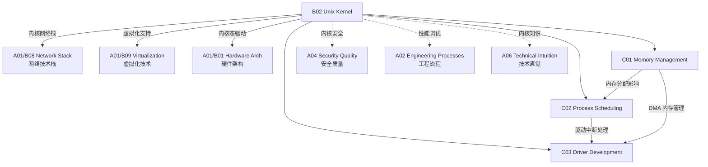

# B02 Unix Kernel

**所属领域**: [A01_Infrastructure](../readme.md)
**创建日期**: 2026-01-30
**最后更新**: 2026-01-30

## 📋 子领域定位

Unix/Linux 内核是操作系统的心脏，负责管理硬件资源、提供系统调用接口、调度进程执行、管理内存分配和维护文件系统。深入理解内核机制是系统工程师、性能优化工程师和底层开发者的核心能力。

本领域涵盖 Linux 内核的三大核心子系统：内存管理、进程调度和设备驱动开发。随着 eBPF、io_uring 等新技术的兴起，内核编程范式正在发生革命性变化，为可观测性、网络安全和高性能 I/O 提供了全新的解决方案。

**核心关注点**：
- **内存管理**: 虚拟内存、页表机制、内存分配器 (SLAB/SLUB)、OOM 杀手
- **进程调度**: CFS 完全公平调度器、实时调度策略、cgroups 资源控制
- **驱动开发**: 字符/块设备驱动、PCIe 设备、网络驱动、内核模块编程
- **内核新技术**: eBPF 可编程内核、io_uring 异步 I/O、BPF 安全监控

## 🗂️ 专项列表

### [C01. Memory_Management](C01_Memory_Management/README.md)

内存管理是操作系统最核心的功能之一，决定了系统的性能和稳定性。本专项深入剖析 Linux 虚拟内存架构，包括页表层级、TLB 管理、页面置换算法、内存分配器实现 (SLAB/SLUB/SLOB)、以及大页 (HugePages) 和内存压缩 (zRAM) 等优化技术。涵盖 OOM 杀手机制、内存水位线控制和容器内存限制实现原理。

### [C02. Process_Scheduling](C02_Process_Scheduling/README.md)

进程调度器决定了 CPU 资源的分配效率和系统响应性。本专项详解 Linux CFS (Completely Fair Scheduler) 的红黑树实现、vruntime 计算逻辑、nice 值权重影响、以及实时调度策略 (FIFO/RR) 的应用场景。包括 CPU 亲和性设置、NUMA 感知调度、cgroup CPU 子系统、以及多队列调度器 (MuQSS) 和 BFS 等替代方案。

### [C03. Driver_Development](C03_Driver_Development/README.md)

设备驱动是内核与硬件交互的桥梁。本专项覆盖字符设备、块设备、网络设备三大类驱动的开发方法，包括设备树 (Device Tree) 机制、PCIe 驱动框架、DMA 内存管理、中断处理下半部机制 (tasklet/workqueue)。探讨内核模块的编译加载、内核符号导出、sysfs/proc 接口设计、以及驱动调试技巧。

## 🛠️ 技术栈概览

### 核心技术

| 技术领域 | 关键技术 | 说明 |
|----------|----------|------|
| **内存子系统** | VMA, Page Cache, Swap, zRAM, HugePages | 虚拟内存与物理内存管理 |
| **调度器** | CFS, RT Scheduler, Deadline, EEVDF | 进程与线程调度策略 |
| **同步机制** | Spinlock, Mutex, RWLock, RCU, seqlock | 内核并发控制原语 |
| **中断管理** | IRQ, SoftIRQ, Tasklet, Workqueue, NAPI | 中断处理与下半部机制 |
| **文件系统** | VFS, ext4, XFS, Btrfs, ZFS (fuse) | 内核文件系统架构 |
| **网络栈** | Netfilter, XDP, DPDK, io_uring | 内核网络处理路径 |

### 工具链

| 类别 | 工具 | 用途 |
|------|------|------|
| **内核编译** | GCC, Clang, Make, Kbuild, kconfig | 内核源码编译 |
| **调试工具** | GDB (kgdb), kdb, JTAG, QEMU | 内核调试 |
| **跟踪分析** | ftrace, perf, eBPF/bcc, SystemTap | 性能分析与追踪 |
| **内存检查** | KASAN, UBSAN, kmemleak, slub_debug | 内存错误检测 |
| **静态分析** | Sparse, Smatch, Coccinelle | 代码静态检查 |
| **构建工具** | Docker (kernel-dev), virtme, mkrootfs | 测试环境构建 |

### eBPF 生态

| 工具 | 说明 | GitHub |
|------|------|--------|
| **BCC** | BPF Compiler Collection | https://github.com/iovisor/bcc |
| **bpftrace** | 高级 BPF 追踪语言 | https://github.com/bpftrace/bpftrace |
| **libbpf** | BPF 程序加载库 | https://github.com/libbpf/libbpf |
| **eBPF Exporter** | Prometheus eBPF 指标 | https://github.com/cloudflare/ebpf_exporter |
| **Cilium** | 基于 eBPF 的网络与安全 | https://github.com/cilium/cilium |
| **Falco** | 运行时安全监控 | https://github.com/falcosecurity/falco |

## 💼 实践案例索引

### 案例 1: 高性能数据库内存优化

**场景**: 为 PostgreSQL 数据库服务器优化内核内存参数

**优化措施**:
```bash
# /etc/sysctl.conf 内核参数优化

# 内存子系统
vm.swappiness = 10              # 减少交换倾向
vm.dirty_ratio = 40             # 脏页比例上限
vm.dirty_background_ratio = 10  # 后台刷盘阈值
vm.vfs_cache_pressure = 50      # 保留更多目录缓存

# 启用大页
vm.nr_hugepages = 1024          # 预分配大页
vm.hugetlb_shm_group = 1000     # postgres 用户组

# 网络优化
net.core.rmem_max = 134217728
net.core.wmem_max = 134217728
net.ipv4.tcp_rmem = 4096 87380 134217728
```

**效果**:
- 查询延迟降低 25%
- 缓冲命中率提升至 98%
- 减少 I/O 等待时间 40%

### 案例 2: 实时系统调度优化

**场景**: 金融交易系统低延迟优化

**调度策略**:
```bash
# 隔离 CPU 核心 (GRUB 参数)
isolcpus=2,3,4,5 nohz_full=2,3,4,5 rcu_nocbs=2,3,4,5

# 实时进程设置
chrt -f -p 99 $TRADING_APP_PID   # FIFO 调度，最高优先级

taskset -c 2,3 $TRADING_APP       # 绑定到隔离核心
```

**内核配置**:
- 启用 CONFIG_PREEMPT_RT (实时补丁)
- 禁用 CPU 频率调节 (performance governor)
- 禁用 NUMA balancing
- 启用 tickless 内核

**延迟指标**:
| 指标 | 优化前 | 优化后 |
|------|--------|--------|
| 平均延迟 | 50μs | 5μs |
| P99 延迟 | 200μs | 15μs |
| 最大延迟 | 5ms | 50μs |

### 案例 3: eBPF 网络安全监控

**场景**: 基于 eBPF 的容器网络安全监控

**实现方案**:
```c
// trace_connect.c - 监控 TCP 连接
#include "vmlinux.h"
#include <bpf/bpf_helpers.h>
#include <bpf/bpf_tracing.h>

SEC("kprobe/tcp_v4_connect")
int BPF_KPROBE(trace_tcp_v4_connect, struct sock *sk)
{
    u32 pid = bpf_get_current_pid_tgid() >> 32;
    u32 dst_ip = BPF_CORE_READ(sk, __sk_common.skc_daddr);
    u16 dst_port = BPF_CORE_READ(sk, __sk_common.skc_dport);
    
    // 记录连接日志
    struct event evt = {};
    evt.pid = pid;
    evt.dst_ip = dst_ip;
    evt.dst_port = bpf_ntohs(dst_port);
    bpf_get_current_comm(&evt.comm, sizeof(evt.comm));
    
    bpf_perf_event_output(ctx, &events, BPF_F_CURRENT_CPU, &evt, sizeof(evt));
    return 0;
}
```

**监控能力**:
- 实时检测异常网络连接
- 零开销 (overhead < 1%)
- 无需修改内核源码
- 安全沙箱执行

## 🔗 知识关联图谱



## 📖 学习资源

### 推荐书籍

| 书名 | 作者 | 说明 |
|------|------|------|
| 《Linux 内核设计与实现》(LKD) | Robert Love | 内核入门经典 |
| 《深入理解 Linux 内核》(ULK) | Daniel Bovet | 深度原理剖析 |
| 《Linux 设备驱动程序》(LDD3) | Jonathan Corbet | 驱动开发圣经 |
| 《深入 Linux 内核架构》 | Wolfgang Mauerer | 架构全景解析 |
| 《Systems Performance》 | Brendan Gregg | 系统性能分析 |
| 《BPF Performance Tools》 | Brendan Gregg | eBPF 性能分析 |

### 在线课程

| 课程 | 平台 | 链接 |
|------|------|------|
| Linux Kernel Development | Linux Foundation | https://www.linuxfoundation.org/courses/linux-kernel-development-and-debugging |
| eBPF 开发实践 | Cilium 社区 | https://ebpf.io/get-started/ |
| Kernel Programming | Coursera | https://www.coursera.org/learn/linux-kernel-programming |

### 官方文档与资源

| 资源 | 链接 | 说明 |
|------|------|------|
| Linux Kernel Documentation | https://www.kernel.org/doc/html/latest/ | 官方内核文档 |
| Kernel Source Tree | https://git.kernel.org | 内核源码仓库 |
| LWN.net | https://lwn.net/Kernel/ | 内核开发新闻 |
| Kernel Newbies | https://kernelnewbies.org | 内核开发入门 |
| eBPF 文档 | https://docs.kernel.org/bpf/ | eBPF 官方文档 |

### 社区与会议

| 资源 | 链接 | 说明 |
|------|------|------|
| Linux Kernel Mailing List | https://lkml.org | 内核邮件列表 |
| eBPF 社区 | https://ebpf.io | eBPF 生态门户 |
| Linux Plumbers | https://linuxplumbersconf.org | 内核开发者大会 |
| LPC (LinuxCon) | https://events.linuxfoundation.org | Linux 基金会会议 |

### 开源项目

| 项目 | GitHub | 说明 |
|------|--------|------|
| Linux Kernel | https://github.com/torvalds/linux | 官方内核仓库 |
| BCC | https://github.com/iovisor/bcc | BPF 编译器集合 |
| bpftrace | https://github.com/bpftrace/bpftrace | 高级 BPF 追踪 |
| Kernel Self Protection | https://kernsec.org/wiki/index.php/Kernel_Self_Protection_Project | 内核自我保护项目 |

## 🔄 维护说明

- **内容审查**: 每月追踪内核新版本特性，更新 eBPF 工具链链接
- **更新机制**: 关注 LWN.net 和 lkml，及时纳入新技术趋势
- **质量标准**: 所有代码示例需在最新 LTS 内核上验证
- **贡献方式**: 欢迎提交内核调试经验和性能优化案例
