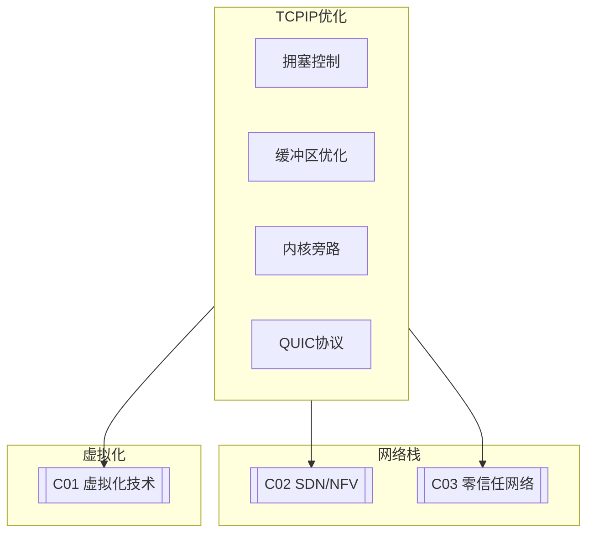

# C01 TCP/IP Optimization

**所属子领域**: [B08_Network_Stack](../README.md)  
**创建日期**: 2026-01-30  
**最后更新**: 2026-01-30

## 📋 主题定位

TCP/IP协议栈是现代互联网的基础，其性能直接影响应用的响应速度和吞吐量。在高带宽、低延迟网络环境下（如数据中心、5G网络），传统的TCP/IP实现面临着新的挑战：TCP队头阻塞、拥塞控制算法适应性、内核协议栈处理延迟、网络虚拟化开销等问题日益突出。

本专题深入探讨TCP/IP协议栈的性能优化技术，包括内核参数调优、拥塞控制算法选择、网络栈内核旁路（DPDK/RDMA）、QUIC协议等前沿技术，为构建高性能网络基础设施提供系统性指导。

## 🎯 核心概念

### TCP核心机制

**TCP可靠传输**: TCP通过序列号、确认应答（ACK）、重传机制、流量控制和拥塞控制实现可靠传输。

**滑动窗口**: TCP使用滑动窗口机制实现流量控制，包括接收窗口（rwnd）和拥塞窗口（cwnd）。

**拥塞控制**: TCP通过慢启动、拥塞避免、快速重传、快速恢复等算法动态调整发送速率，避免网络拥塞。

### TCP/IP协议栈架构

```
┌─────────────────────────────────────────────────────────────────────────┐
│                       Linux TCP/IP协议栈架构                             │
├─────────────────────────────────────────────────────────────────────────┤
│                                                                         │
│  应用层 (Application Layer)                                              │
│  ┌─────────────────────────────────────────────────────────────────┐   │
│  │  socket API → read/write/send/recv/accept/connect              │   │
│  └─────────────────────────────────────────────────────────────────┘   │
│                              ↓                                          │
│  套接字层 (Socket Layer)                                                 │
│  ┌─────────────────────────────────────────────────────────────────┐   │
│  │  struct sock → 协议无关的套接字状态管理                           │   │
│  │  struct socket → 文件系统接口                                    │   │
│  │  sockfs → /proc/net/tcp                                         │   │
│  └─────────────────────────────────────────────────────────────────┘   │
│                              ↓                                          │
│  传输层 (Transport Layer)                                                │
│  ┌─────────────────────────┬─────────────────────────────────────────┐ │
│  │          TCP            │              UDP                        │ │
│  │  ┌─────────────────┐    │  ┌─────────────────┐                   │ │
│  │  │ 状态机管理       │    │  │ 无连接数据报     │                   │ │
│  │  │ (LISTEN/ESTAB)  │    │  │                 │                   │ │
│  │  ├─────────────────┤    │  ├─────────────────┤                   │ │
│  │  │ 拥塞控制         │    │  │ 校验和计算       │                   │ │
│  │  │ (cubic/bbr)     │    │  │                 │                   │ │
│  │  ├─────────────────┤    │  ├─────────────────┤                   │ │
│  │  │ 滑动窗口         │    │  │ 组包/分片        │                   │ │
│  │  │ (rwnd/cwnd)     │    │  │                 │                   │ │
│  │  ├─────────────────┤    │  └─────────────────┘                   │ │
│  │  │ 重传机制         │    │                                        │ │
│  │  │ (RTO/快速重传)  │    │                                        │ │
│  │  └─────────────────┘    │                                        │ │
│  └─────────────────────────┴─────────────────────────────────────────┘ │
│                              ↓                                          │
│  网络层 (Network Layer)                                                  │
│  ┌─────────────────────────────────────────────────────────────────┐   │
│  │                          IP层                                    │   │
│  │  ┌─────────────┐  ┌─────────────┐  ┌─────────────────────────┐  │   │
│  │  │   IPv4/IPv6 │  │   路由查找   │  │      分片/重组          │  │   │
│  │  │   协议处理   │  │   FIB/RIB   │  │                         │  │   │
│  │  └─────────────┘  └─────────────┘  └─────────────────────────┘  │   │
│  │                                                                 │   │
│  │  XDP (eXpress Data Path) - 网络包快速处理路径                    │   │
│  │  ├─ 在驱动层处理，绕过内核协议栈                                 │   │
│  │  ├─ 支持BPF程序进行包过滤/转发                                   │   │
│  │  └─ 性能可达线速                                                │   │
│  │                                                                 │   │
│  └─────────────────────────────────────────────────────────────────┘   │
│                              ↓                                          │
│  数据链路层 (Data Link Layer)                                            │
│  ┌─────────────────────────────────────────────────────────────────┐   │
│  │  ┌─────────────┐  ┌─────────────┐  ┌─────────────────────────┐  │   │
│  │  │  网卡驱动    │  │  qdisc队列  │  │       GRO/GSO           │  │   │
│  │  │  (eth/ib)   │  │  调度        │  │    硬件卸载             │  │   │
│  │  └─────────────┘  └─────────────┘  └─────────────────────────┘  │   │
│  │                                                                 │   │
│  │  硬件队列: tx-N, rx-N (多队列网卡支持RSS/RPS)                    │   │
│  └─────────────────────────────────────────────────────────────────┘   │
│                                                                         │
└─────────────────────────────────────────────────────────────────────────┘
```

### 拥塞控制算法对比

| 算法 | 设计目标 | 特点 | 适用场景 |
|-----|---------|------|---------|
| **Cubic** | 高带宽网络 | 使用立方函数调整窗口，稳定 | 通用，Linux默认 |
| **BBR** | 带宽和RTT探测 | 不依赖丢包，带宽利用率更高 | 高BDP网络，YouTube使用 |
| **Reno** | 经典算法 | 加性增乘性减(AIMD) | 教育、兼容 |
| **Vegas** | 延迟感知 | 基于RTT变化检测拥塞 | 低延迟网络 |
| **Westwood** | 无线环境 | 带宽估计，对丢包不敏感 | 无线网络 |

### TCP优化参数体系

```
┌─────────────────────────────────────────────────────────────────────────┐
│                      TCP关键性能参数体系                                  │
├─────────────────────────────────────────────────────────────────────────┤
│                                                                         │
│  缓冲区参数                                                              │
│  ┌─────────────────────────────────────────────────────────────────┐   │
│  │  net.core.rmem_max / wmem_max      - 最大缓冲区                  │   │
│  │  net.ipv4.tcp_rmem / tcp_wmem      - TCP自动调优范围             │   │
│  │  net.ipv4.tcp_moderate_rcvbuf      - 启用自动调优                │   │
│  │  net.ipv4.tcp_mem                  - TCP全局内存限制             │   │
│  └─────────────────────────────────────────────────────────────────┘   │
│                                                                         │
│  拥塞控制参数                                                            │
│  ┌─────────────────────────────────────────────────────────────────┐   │
│  │  net.ipv4.tcp_congestion_control   - 算法选择 (cubic/bbr)        │   │
│  │  net.ipv4.tcp_slow_start_after_idle - 空闲后慢启动              │   │
│  │  net.ipv4.tcp_no_metrics_save      - 不保存连接指标              │   │
│  └─────────────────────────────────────────────────────────────────┘   │
│                                                                         │
│  连接管理参数                                                            │
│  ┌─────────────────────────────────────────────────────────────────┐   │
│  │  net.ipv4.tcp_tw_reuse             - TIME_WAIT重用               │   │
│  │  net.ipv4.tcp_tw_recycle           - TIME_WAIT快速回收 (已废弃)  │   │
│  │  net.ipv4.tcp_fin_timeout          - FIN_WAIT_2超时              │   │
│  │  net.ipv4.tcp_keepalive_xxx        - 保活参数                    │   │
│  └─────────────────────────────────────────────────────────────────┘   │
│                                                                         │
│  性能优化参数                                                            │
│  ┌─────────────────────────────────────────────────────────────────┐   │
│  │  net.ipv4.tcp_notsent_lowat        - 未发送字节低水位            │   │
│  │  net.ipv4.tcp_fastopen             - TCP Fast Open               │   │
│  │  net.core.busy_poll / busy_budget  - 忙轮询优化                  │   │
│  │  net.ipv4.tcp_ecn                  - 显式拥塞通知                │   │
│  └─────────────────────────────────────────────────────────────────┘   │
│                                                                         │
└─────────────────────────────────────────────────────────────────────────┘
```

## 🛠️ 技术实践

### TCP性能调优

**1. TCP优化配置脚本**

```bash
#!/bin/bash
# TCP/IP性能优化脚本
# 适用于高吞吐、低延迟网络环境

set -e

SCENARIO=${1:-"general"}

echo "=== TCP/IP性能优化 ==="
echo "场景: $SCENARIO"
echo ""

# 备份当前配置
BACKUP_DIR="/etc/sysctl.d/tcp-backup-$(date +%Y%m%d)"
mkdir -p "$BACKUP_DIR"
cp /etc/sysctl.d/*.conf "$BACKUP_DIR/" 2>/dev/null || true

case "$SCENARIO" in
    "datacenter")
        echo "配置: 数据中心/高吞吐场景"
        cat > /etc/sysctl.d/99-tcp-datacenter.conf << 'EOF'
# 数据中心TCP优化配置

# ========== 缓冲区优化 ==========
# 最大缓冲区 32MB
net.core.rmem_max = 33554432
net.core.wmem_max = 33554432
net.core.rmem_default = 1048576
net.core.wmem_default = 1048576

# TCP自动调优范围
net.ipv4.tcp_rmem = 4096 1048576 33554432
net.ipv4.tcp_wmem = 4096 1048576 33554432

# 启用自动调优
net.ipv4.tcp_moderate_rcvbuf = 1

# 全局TCP内存限制 (单位:页)
net.ipv4.tcp_mem = 786432 1048576 26777216

# ========== 拥塞控制优化 ==========
# 使用BBR算法 (需要内核4.9+)
net.ipv4.tcp_congestion_control = bbr

# 显式拥塞通知
net.ipv4.tcp_ecn = 1

# 禁用空闲后慢启动
net.ipv4.tcp_slow_start_after_idle = 0

# ========== 连接优化 ==========
# 重用TIME_WAIT连接
net.ipv4.tcp_tw_reuse = 1

# 减少FIN超时
net.ipv4.tcp_fin_timeout = 10

# 保持连接参数
net.ipv4.tcp_keepalive_time = 600
net.ipv4.tcp_keepalive_intvl = 30
net.ipv4.tcp_keepalive_probes = 3

# ========== 性能优化 ==========
# TCP Fast Open
net.ipv4.tcp_fastopen = 3

# 降低延迟
net.ipv4.tcp_notsent_lowat = 16384

# 禁用metrics缓存 (数据中心连接变化快)
net.ipv4.tcp_no_metrics_save = 1

# ========== 核心网络优化 ==========
net.core.netdev_max_backlog = 30000
net.core.somaxconn = 65535
net.ipv4.tcp_max_syn_backlog = 65535

# IRQ亲和性 (需要结合网卡队列配置)
EOF
        ;;
        
    "webserver")
        echo "配置: Web服务器场景"
        cat > /etc/sysctl.d/99-tcp-webserver.conf << 'EOF'
# Web服务器TCP优化

# 缓冲区设置
net.core.rmem_max = 16777216
net.core.wmem_max = 16777216
net.ipv4.tcp_rmem = 4096 87380 16777216
net.ipv4.tcp_wmem = 4096 65536 16777216

# 使用Cubic (Web场景稳定)
net.ipv4.tcp_congestion_control = cubic

# 快速回收TIME_WAIT
net.ipv4.tcp_tw_reuse = 1
net.ipv4.tcp_fin_timeout = 15

# 高并发支持
net.core.somaxconn = 65535
net.ipv4.tcp_max_syn_backlog = 65535

# 防御SYN Flood
net.ipv4.tcp_syncookies = 1
net.ipv4.tcp_max_syn_backlog = 65535
EOF
        ;;
        
    "lowlatency")
        echo "配置: 低延迟场景（游戏/金融）"
        cat > /etc/sysctl.d/99-tcp-lowlatency.conf << 'EOF'
# 低延迟TCP优化

# 小缓冲区减少延迟
net.core.rmem_max = 134217728
net.core.wmem_max = 134217728
net.ipv4.tcp_rmem = 4096 87380 134217728
net.ipv4.tcp_wmem = 4096 65536 134217728

# 使用BBR
net.ipv4.tcp_congestion_control = bbr

# 最小化延迟
net.ipv4.tcp_notsent_lowat = 16384
net.ipv4.tcp_slow_start_after_idle = 0

# 快速重传
net.ipv4.tcp_frto = 0

# 禁用Nagle算法 (应用层控制)
# TCP_NODELAY socket选项

# 忙轮询 (需要网卡支持)
net.core.busy_poll = 50
net.core.busy_budget = 200
EOF
        ;;
        
    *)
        echo "配置: 通用场景"
        cat > /etc/sysctl.d/99-tcp-general.conf << 'EOF'
# 通用TCP优化

net.core.rmem_max = 16777216
net.core.wmem_max = 16777216
net.ipv4.tcp_rmem = 4096 87380 16777216
net.ipv4.tcp_wmem = 4096 65536 16777216
net.ipv4.tcp_congestion_control = cubic
net.core.somaxconn = 4096
EOF
        ;;
esac

# 应用配置
echo ""
echo "正在应用配置..."
sysctl --system

echo ""
echo "=== 当前TCP配置 ==="
echo "拥塞控制算法: $(sysctl -n net.ipv4.tcp_congestion_control)"
echo "TCP缓冲区范围: $(sysctl -n net.ipv4.tcp_rmem)"
echo "核心最大rmem: $(sysctl -n net.core.rmem_max)"

echo ""
echo "=== 调优完成 ==="

# 检查BBR是否可用
if [ "$SCENARIO" = "datacenter" ] || [ "$SCENARIO" = "lowlatency" ]; then
    echo ""
    echo "检查BBR支持:"
    if sysctl net.ipv4.tcp_available_congestion_control | grep -q bbr; then
        echo "  BBR可用 ✓"
    else
        echo "  BBR不可用 ✗ (需要内核4.9+)"
        echo "  可用算法: $(sysctl -n net.ipv4.tcp_available_congestion_control)"
    fi
fi
```

**2. TCP连接监控与分析（Python）**

```python
#!/usr/bin/env python3
"""
TCP连接监控与分析工具
分析连接状态、重传率、吞吐量等指标
"""

import os
import re
import time
import socket
import struct
from dataclasses import dataclass
from typing import Dict, List, Optional, Tuple
from collections import defaultdict
import json


@dataclass
class TCPConnection:
    """TCP连接信息"""
    local_addr: str
    local_port: int
    remote_addr: str
    remote_port: int
    state: str
    inode: int
    tx_queue: int  # 发送队列字节
    rx_queue: int  # 接收队列字节
    timer_active: int
    retransmits: int
    uid: int
    timeout: int


class TCPAnalyzer:
    """TCP分析器"""
    
    # TCP状态映射
    TCP_STATES = {
        '01': 'ESTABLISHED',
        '02': 'SYN_SENT',
        '03': 'SYN_RECV',
        '04': 'FIN_WAIT1',
        '05': 'FIN_WAIT2',
        '06': 'TIME_WAIT',
        '07': 'CLOSE',
        '08': 'CLOSE_WAIT',
        '09': 'LAST_ACK',
        '0A': 'LISTEN',
        '0B': 'CLOSING',
        '0C': 'NEW_SYN_RECV',
    }
    
    def __init__(self):
        self.prev_stats = {}
        self.prev_time = time.time()
        
    def parse_tcp_line(self, line: str, is_ipv6: bool = False) -> Optional[TCPConnection]:
        """解析/proc/net/tcp的一行"""
        parts = line.split()
        if len(parts) < 10:
            return None
        
        try:
            # 本地地址:端口
            local = parts[1]
            local_ip, local_port = self._parse_addr(local, is_ipv6)
            
            # 远程地址:端口
            remote = parts[2]
            remote_ip, remote_port = self._parse_addr(remote, is_ipv6)
            
            # 状态
            state_code = parts[3]
            state = self.TCP_STATES.get(state_code, f'UNKNOWN({state_code})')
            
            # 队列信息 (tx_queue:rx_queue)
            queues = parts[4].split(':')
            tx_queue = int(queues[0], 16)
            rx_queue = int(queues[1], 16)
            
            # 其他信息
            timer_info = int(parts[5], 16)
            retrans = int(parts[6], 16) if len(parts) > 6 else 0
            uid = int(parts[7]) if len(parts) > 7 else 0
            timeout = int(parts[8]) if len(parts) > 8 else 0
            inode = int(parts[9]) if len(parts) > 9 else 0
            
            return TCPConnection(
                local_addr=local_ip,
                local_port=local_port,
                remote_addr=remote_ip,
                remote_port=remote_port,
                state=state,
                inode=inode,
                tx_queue=tx_queue,
                rx_queue=rx_queue,
                timer_active=timer_info & 0x0F,
                retransmits=retrans,
                uid=uid,
                timeout=timeout
            )
        except Exception as e:
            return None
    
    def _parse_addr(self, addr_str: str, is_ipv6: bool = False) -> Tuple[str, int]:
        """解析地址字符串"""
        ip_hex, port_hex = addr_str.split(':')
        port = int(port_hex, 16)
        
        if is_ipv6:
            # IPv6地址解析
            ip_parts = [ip_hex[i:i+8] for i in range(0, 32, 8)]
            ip_str = ':'.join([str(struct.unpack('<I', bytes.fromhex(p))[0]) for p in ip_parts])
        else:
            # IPv4地址解析 (小端序)
            ip_int = int(ip_hex, 16)
            ip_str = socket.inet_ntoa(struct.pack('<I', ip_int))
        
        return ip_str, port
    
    def read_connections(self, proto: str = 'tcp') -> List[TCPConnection]:
        """读取所有TCP连接"""
        connections = []
        
        files = [f'/proc/net/{proto}']
        if os.path.exists(f'/proc/net/{proto}6'):
            files.append(f'/proc/net/{proto}6')
        
        for filepath in files:
            is_ipv6 = '6' in filepath
            try:
                with open(filepath, 'r') as f:
                    lines = f.readlines()[1:]  # 跳过标题行
                    
                for line in lines:
                    conn = self.parse_tcp_line(line.strip(), is_ipv6)
                    if conn:
                        connections.append(conn)
            except Exception as e:
                print(f"读取 {filepath} 失败: {e}")
        
        return connections
    
    def get_tcp_statistics(self) -> Dict:
        """获取TCP统计信息"""
        stats = {}
        
        try:
            with open('/proc/net/snmp', 'r') as f:
                lines = f.readlines()
                
            for i, line in enumerate(lines):
                if line.startswith('Tcp:'):
                    keys = lines[i].strip().split()[1:]
                    values = lines[i+1].strip().split()[1:]
                    stats = dict(zip(keys, [int(v) for v in values]))
                    break
        except Exception as e:
            print(f"读取SNMP失败: {e}")
        
        return stats
    
    def analyze_connections(self, connections: List[TCPConnection]) -> Dict:
        """分析连接状态"""
        # 按状态统计
        state_count = defaultdict(int)
        high_tx = []  # 高发送队列
        high_rx = []  # 高接收队列
        
        for conn in connections:
            state_count[conn.state] += 1
            
            if conn.tx_queue > 65536:  # 64KB
                high_tx.append(conn)
            
            if conn.rx_queue > 65536:
                high_rx.append(conn)
        
        return {
            'total': len(connections),
            'by_state': dict(state_count),
            'high_tx_queue': [(c.local_addr, c.local_port, c.tx_queue) for c in high_tx[:5]],
            'high_rx_queue': [(c.local_addr, c.local_port, c.rx_queue) for c in high_rx[:5]],
        }
    
    def calculate_retrans_rate(self) -> Dict:
        """计算重传率"""
        current_stats = self.get_tcp_statistics()
        current_time = time.time()
        
        result = {
            'retrans_rate': 0.0,
            'retrans_segs': current_stats.get('RetransSegs', 0),
            'out_segs': current_stats.get('OutSegs', 0)
        }
        
        if self.prev_stats and current_stats:
            time_delta = current_time - self.prev_time
            
            retrans_delta = (current_stats.get('RetransSegs', 0) - 
                           self.prev_stats.get('RetransSegs', 0))
            out_delta = (current_stats.get('OutSegs', 0) - 
                        self.prev_stats.get('OutSegs', 0))
            
            if out_delta > 0:
                result['retrans_rate'] = round(retrans_delta / out_delta * 100, 4)
                result['retrans_per_sec'] = round(retrans_delta / time_delta, 2)
                result['out_per_sec'] = round(out_delta / time_delta, 2)
        
        self.prev_stats = current_stats
        self.prev_time = current_time
        
        return result
    
    def get_congestion_control(self) -> Dict:
        """获取拥塞控制信息"""
        result = {}
        
        try:
            with open('/proc/sys/net/ipv4/tcp_congestion_control', 'r') as f:
                result['current'] = f.read().strip()
            
            with open('/proc/sys/net/ipv4/tcp_available_congestion_control', 'r') as f:
                result['available'] = f.read().strip().split()
                
        except Exception as e:
            print(f"读取拥塞控制信息失败: {e}")
        
        return result
    
    def generate_report(self) -> Dict:
        """生成完整报告"""
        connections = self.read_connections()
        conn_analysis = self.analyze_connections(connections)
        retrans = self.calculate_retrans_rate()
        tcp_stats = self.get_tcp_statistics()
        cc = self.get_congestion_control()
        
        return {
            'timestamp': time.time(),
            'connections': conn_analysis,
            'retransmission': retrans,
            'congestion_control': cc,
            'tcp_stats': {
                'active_opens': tcp_stats.get('ActiveOpens', 0),
                'passive_opens': tcp_stats.get('PassiveOpens', 0),
                'attempt_fails': tcp_stats.get('AttemptFails', 0),
                'estab_resets': tcp_stats.get('EstabResets', 0),
                'in_segs': tcp_stats.get('InSegs', 0),
                'out_segs': tcp_stats.get('OutSegs', 0),
                'retrans_segs': tcp_stats.get('RetransSegs', 0),
            }
        }
    
    def continuous_monitor(self, interval: int = 5):
        """持续监控"""
        print(f"开始TCP监控 (间隔: {interval}秒)")
        print("=" * 60)
        
        # 初始化
        self.calculate_retrans_rate()
        time.sleep(interval)
        
        while True:
            report = self.generate_report()
            
            print(f"\n[{time.strftime('%H:%M:%S')}]")
            print(f"连接数: {report['connections']['total']}")
            print(f"ESTABLISHED: {report['connections']['by_state'].get('ESTABLISHED', 0)}")
            print(f"TIME_WAIT: {report['connections']['by_state'].get('TIME_WAIT', 0)}")
            print(f"重传率: {report['retransmission']['retrans_rate']}%")
            print(f"拥塞控制: {report['congestion_control'].get('current', 'unknown')}")
            
            time.sleep(interval)


if __name__ == '__main__':
    import argparse
    
    parser = argparse.ArgumentParser(description='TCP分析工具')
    parser.add_argument('--interval', '-i', type=int, default=5)
    parser.add_argument('--output', '-o', type=str)
    args = parser.parse_args()
    
    analyzer = TCPAnalyzer()
    
    if args.output:
        report = analyzer.generate_report()
        with open(args.output, 'w') as f:
            json.dump(report, f, indent=2)
        print(f"报告已保存: {args.output}")
    else:
        try:
            analyzer.continuous_monitor(args.interval)
        except KeyboardInterrupt:
            print("\n监控已停止")
```

### 高性能网络编程

**3. 高性能Socket服务器（C）**

```c
/*
 * high_perf_server.c - 高性能TCP服务器示例
 * 使用epoll、SO_REUSEPORT、TCP Fast Open等优化
 */

#define _GNU_SOURCE
#include <stdio.h>
#include <stdlib.h>
#include <string.h>
#include <unistd.h>
#include <errno.h>
#include <fcntl.h>
#include <sys/socket.h>
#include <sys/epoll.h>
#include <netinet/in.h>
#include <netinet/tcp.h>
#include <arpa/inet.h>

#define PORT 8080
#define MAX_EVENTS 10000
#define BUFFER_SIZE 8192

/* 设置非阻塞 */
static int set_nonblocking(int fd) {
    int flags = fcntl(fd, F_GETFL, 0);
    if (flags == -1) return -1;
    return fcntl(fd, F_SETFL, flags | O_NONBLOCK);
}

/* 设置socket选项 */
static void setup_socket_opts(int fd) {
    int opt = 1;
    
    /* SO_REUSEADDR */
    setsockopt(fd, SOL_SOCKET, SO_REUSEADDR, &opt, sizeof(opt));
    
    /* TCP_NODELAY - 禁用Nagle算法，降低延迟 */
    setsockopt(fd, IPPROTO_TCP, TCP_NODELAY, &opt, sizeof(opt));
    
    /* TCP_QUICKACK - 快速ACK */
    setsockopt(fd, IPPROTO_TCP, TCP_QUICKACK, &opt, sizeof(opt));
    
    /* SO_BUSY_POLL - 忙轮询 (如果内核支持) */
    int busy_poll = 50;  /* 微秒 */
    int busy_budget = 200;
    setsockopt(fd, SOL_SOCKET, SO_BUSY_POLL, &busy_poll, sizeof(busy_poll));
    setsockopt(fd, SOL_SOCKET, SO_BUSY_BUDGET, &busy_budget, sizeof(busy_budget));
    
    /* 设置缓冲区大小 */
    int bufsize = 1024 * 1024;  /* 1MB */
    setsockopt(fd, SOL_SOCKET, SO_RCVBUF, &bufsize, sizeof(bufsize));
    setsockopt(fd, SOL_SOCKET, SO_SNDBUF, &bufsize, sizeof(bufsize));
}

/* 创建监听socket */
static int create_listener(int port) {
    int listen_fd = socket(AF_INET, SOCK_STREAM, 0);
    if (listen_fd < 0) {
        perror("socket");
        return -1;
    }
    
    setup_socket_opts(listen_fd);
    
    /* SO_REUSEPORT - 允许多个进程绑定同一端口 */
    int opt = 1;
    setsockopt(listen_fd, SOL_SOCKET, SO_REUSEPORT, &opt, sizeof(opt));
    
    /* TCP Fast Open - 减少握手延迟 (需要内核3.7+) */
    int qlen = 5;
    setsockopt(listen_fd, SOL_TCP, TCP_FASTOPEN, &qlen, sizeof(qlen));
    
    struct sockaddr_in addr = {
        .sin_family = AF_INET,
        .sin_port = htons(port),
        .sin_addr.s_addr = INADDR_ANY
    };
    
    if (bind(listen_fd, (struct sockaddr *)&addr, sizeof(addr)) < 0) {
        perror("bind");
        close(listen_fd);
        return -1;
    }
    
    if (listen(listen_fd, 4096) < 0) {
        perror("listen");
        close(listen_fd);
        return -1;
    }
    
    set_nonblocking(listen_fd);
    
    printf("监听端口 %d\n", port);
    return listen_fd;
}

/* 处理客户端连接 */
static void handle_client(int client_fd) {
    char buffer[BUFFER_SIZE];
    ssize_t n;
    
    while ((n = read(client_fd, buffer, sizeof(buffer))) > 0) {
        /* 简单的echo服务器 */
        ssize_t written = write(client_fd, buffer, n);
        if (written < 0 && errno != EAGAIN) {
            break;
        }
    }
    
    if (n == 0 || (n < 0 && errno != EAGAIN)) {
        close(client_fd);
    }
}

/* 主循环 */
static void run_event_loop(int listen_fd) {
    int epoll_fd = epoll_create1(EPOLL_CLOEXEC);
    if (epoll_fd < 0) {
        perror("epoll_create1");
        return;
    }
    
    /* 添加监听fd到epoll */
    struct epoll_event ev = {
        .events = EPOLLIN | EPOLLET,  /* 边缘触发模式 */
        .data.fd = listen_fd
    };
    epoll_ctl(epoll_fd, EPOLL_CTL_ADD, listen_fd, &ev);
    
    struct epoll_event events[MAX_EVENTS];
    
    printf("服务器运行中...\n");
    
    while (1) {
        int nfds = epoll_wait(epoll_fd, events, MAX_EVENTS, -1);
        
        for (int i = 0; i < nfds; i++) {
            if (events[i].data.fd == listen_fd) {
                /* 接受新连接 */
                while (1) {
                    struct sockaddr_in client_addr;
                    socklen_t addr_len = sizeof(client_addr);
                    
                    int client_fd = accept4(listen_fd, 
                                           (struct sockaddr *)&client_addr,
                                           &addr_len, SOCK_NONBLOCK);
                    
                    if (client_fd < 0) {
                        if (errno == EAGAIN || errno == EWOULDBLOCK) {
                            break;  /* 没有更多连接 */
                        }
                        perror("accept4");
                        break;
                    }
                    
                    setup_socket_opts(client_fd);
                    
                    /* 添加到epoll */
                    ev.events = EPOLLIN | EPOLLET | EPOLLONESHOT;
                    ev.data.fd = client_fd;
                    epoll_ctl(epoll_fd, EPOLL_CTL_ADD, client_fd, &ev);
                }
            } else {
                /* 处理客户端数据 */
                handle_client(events[i].data.fd);
            }
        }
    }
    
    close(epoll_fd);
}

int main() {
    int listen_fd = create_listener(PORT);
    if (listen_fd < 0) {
        return 1;
    }
    
    run_event_loop(listen_fd);
    
    close(listen_fd);
    return 0;
}
```

## 📚 资源索引

### RFC文档

| RFC | 标题 | 说明 |
|-----|------|------|
| **RFC 793** | TCP规范 | 原始TCP协议 |
| **RFC 896** | Nagle算法 | 小包合并 |
| **RFC 2018** | SACK | 选择性确认 |
| **RFC 5681** | TCP拥塞控制 | 现代拥塞控制 |
| **RFC 8312** | CUBIC | Linux默认算法 |
| **RFC 9000** | QUIC | 下一代传输协议 |

### 工具与项目

| 工具 | 用途 | 链接 |
|-----|------|------|
| **iperf3** | 带宽测试 | iperf.fr |
| **tc** | 流量控制 | iproute2 |
| **ss** | socket统计 | iproute2 |
| **tcpdump** | 包分析 | tcpdump.org |
| **wireshark** | 协议分析 | wireshark.org |

## 🔗 关联知识



## 💡 学习建议

### 入门路径

1. **TCP基础**（1-2周）
   - 学习TCP协议原理
   - 理解三次握手/四次挥手
   - 掌握拥塞控制基础

2. **性能调优**（3-4周）
   - sysctl参数调优
   - 拥塞控制算法对比
   - 网络监控工具使用

3. **高级优化**（5-8周）
   - DPDK/内核旁路
   - XDP/eBPF编程
   - QUIC协议实现

---

*最后更新: 2026-01-30*  
*维护者: Infrastructure Team*
