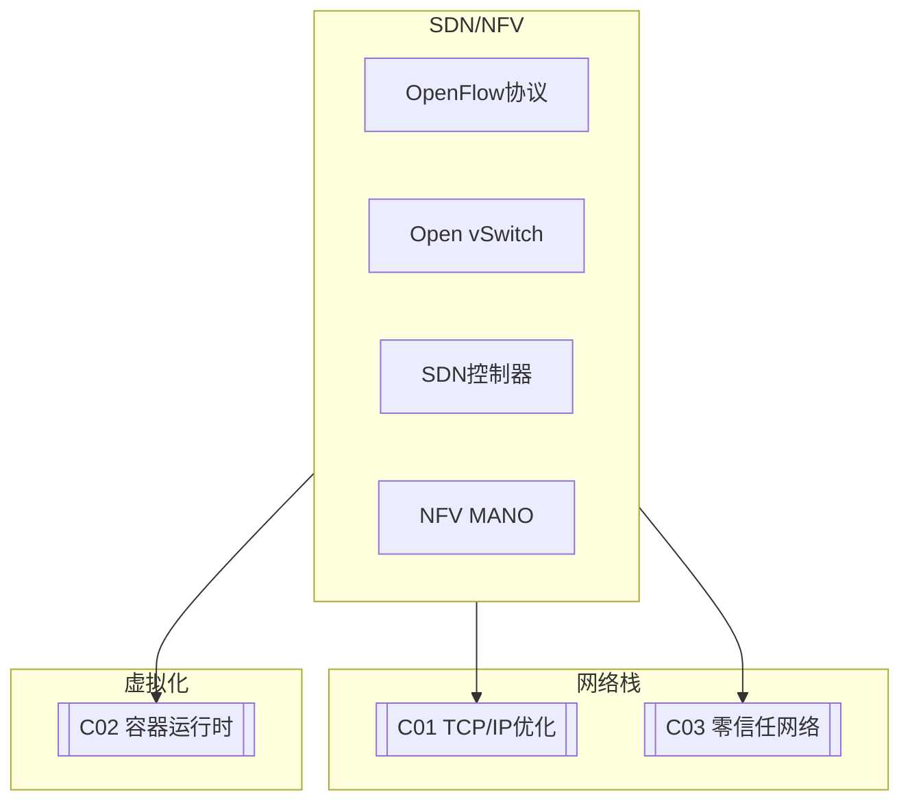

# C02 SDN/NFV

**所属子领域**: [B08_Network_Stack](../README.md)  
**创建日期**: 2026-01-30  
**最后更新**: 2026-01-30

## 📋 主题定位

软件定义网络（SDN, Software Defined Networking）和网络功能虚拟化（NFV, Network Functions Virtualization）是网络领域最具变革性的两大技术趋势。SDN通过控制平面与数据平面分离，实现了网络的集中化编程控制；NFV则将传统专用网络设备功能（如防火墙、负载均衡器）虚拟化为软件应用，运行在通用服务器上。

这两项技术共同推动了网络架构的现代化转型：从硬件为中心转向软件为中心，从静态配置转向动态编排，从封闭系统转向开放生态。在云计算、5G、边缘计算等场景中，SDN/NFV已成为构建灵活、可扩展网络基础设施的核心技术。

本专题系统探讨SDN/NFV的架构原理、关键技术、开源实现以及在生产环境中的部署实践。

## 🎯 核心概念

### SDN基本定义

**软件定义网络（SDN）**: 一种网络架构方法，通过将网络设备的控制平面与数据平面分离，并将控制逻辑集中到软件控制器中，实现网络的集中编程和动态管理。

**关键特征**:
- **控制与转发分离**: 控制逻辑集中在控制器，转发设备只负责数据包处理
- **集中式控制**: 全局网络视图，统一策略部署
- **可编程接口**: 通过北向API实现应用与网络交互
- **开放标准**: 使用OpenFlow等开放协议

### NFV基本定义

**网络功能虚拟化（NFV）**: 使用虚拟化技术将网络功能（如路由、防火墙、NAT）从专用硬件设备迁移到通用服务器上运行的软件实现。

**NFV架构组件**:
- **VNF（Virtualized Network Function）**: 虚拟网络功能实例
- **NFVI（NFV Infrastructure）**: 虚拟化基础设施（计算、存储、网络）
- **MANO（Management and Orchestration）**: 管理和编排系统

### SDN架构

```
┌─────────────────────────────────────────────────────────────────────────┐
│                           SDN架构全景                                    │
├─────────────────────────────────────────────────────────────────────────┤
│                                                                         │
│  ┌─────────────────────────────────────────────────────────────────┐   │
│  │                      应用层 (Application Layer)                   │   │
│  │                                                                 │   │
│  │  ┌──────────┐  ┌──────────┐  ┌──────────┐  ┌──────────┐        │   │
│  │  │ 网络管理  │  │ 流量工程  │  │ 安全策略  │  │ 业务编排  │        │   │
│  │  │   系统    │  │   应用    │  │   管理    │  │   平台    │        │   │
│  │  └────┬─────┘  └────┬─────┘  └────┬─────┘  └────┬─────┘        │   │
│  │       └──────────────┴──────────────┴──────────────┘            │   │
│  │                         │                                      │   │
│  │                    北向接口 (Northbound API)                     │   │
│  │              RESTful API / RESTCONF / gNMI                      │   │
│  │                         │                                      │   │
│  └─────────────────────────┼──────────────────────────────────────┘   │
│                            ▼                                           │
│  ┌─────────────────────────────────────────────────────────────────┐   │
│  │                    控制层 (Control Layer)                        │   │
│  │                                                                 │   │
│  │  ┌─────────────────────────────────────────────────────────┐   │   │
│  │  │                  SDN Controller                          │   │   │
│  │  │                                                          │   │   │
│  │  │  ┌─────────────┐  ┌─────────────┐  ┌─────────────────┐  │   │   │
│  │  │  │  拓扑发现   │  │  路径计算   │  │   策略引擎      │  │   │   │
│  │  │  │  (LLDP)     │  │  (Dijkstra) │  │                 │  │   │   │
│  │  │  └─────────────┘  └─────────────┘  └─────────────────┘  │   │   │
│  │  │                                                          │   │   │
│  │  │  ┌─────────────┐  ┌─────────────┐  ┌─────────────────┐  │   │   │
│  │  │  │  流表管理   │  │  流量统计   │  │   北向API服务   │  │   │   │
│  │  │  │             │  │  (sFlow)    │  │                 │  │   │   │
│  │  │  └─────────────┘  └─────────────┘  └─────────────────┘  │   │   │
│  │  │                                                          │   │   │
│  │  └─────────────────────────────────────────────────────────┘   │   │
│  │                                                                 │   │
│  │  主流控制器:                                                     │   │
│  │  • ONOS (Open Network Operating System) - 运营商级              │   │
│  │  • OpenDaylight (ODL) - 企业级，模块化设计                       │   │
│  │  • Ryu - Python编写，简单易用                                   │   │
│  │  • Floodlight - Java，高性能                                   │   │
│  │                                                                 │   │
│  └─────────────────────────────────────────────────────────────────┘   │
│                            ▼                                           │
│  ┌─────────────────────────────────────────────────────────────────┐   │
│  │                    南向接口 (Southbound Interface)                │   │
│  │                                                                 │   │
│  │  OpenFlow / P4Runtime / NETCONF / OVSDB / BGP-LS / gRPC         │   │
│  │                                                                 │   │
│  └─────────────────────────────────────────────────────────────────┘   │
│                            ▼                                           │
│  ┌─────────────────────────────────────────────────────────────────┐   │
│  │                    基础设施层 (Infrastructure Layer)              │   │
│  │                                                                 │   │
│  │  ┌──────────────┐  ┌──────────────┐  ┌──────────────┐          │   │
│  │  │   OpenFlow   │  │     传统     │  │    混合      │          │   │
│  │  │   交换机     │  │    路由器    │  │    设备      │          │   │
│  │  │              │  │              │  │              │          │   │
│  │  │ ┌──────────┐ │  │ ┌──────────┐ │  │ ┌──────────┐ │          │   │
│  │  │ │ Flow Table│ │  │ │   CLI    │ │  │ │ 流表+CLI │ │          │   │
│  │  │ │ (多级)   │ │  │ │   SNMP   │ │  │ │         │ │          │   │
│  │  │ │ 匹配+动作│ │  │ │   NETCONF│ │  │ │         │ │          │   │
│  │  │ └──────────┘ │  │ └──────────┘ │  │ └──────────┘ │          │   │
│  │  └──────────────┘  └──────────────┘  └──────────────┘          │   │
│  │                                                                │   │
│  │  虚拟交换机: OVS (Open vSwitch) - 基于流表的多层虚拟交换机        │   │
│  │                                                                │   │
│  └─────────────────────────────────────────────────────────────────┘   │
│                                                                         │
└─────────────────────────────────────────────────────────────────────────┘
```

### NFV架构

```
┌─────────────────────────────────────────────────────────────────────────┐
│                           NFV架构 (ETSI标准)                             │
├─────────────────────────────────────────────────────────────────────────┤
│                                                                         │
│  ┌─────────────────────────────────────────────────────────────────┐   │
│  │                  OSS/BSS (运营支撑系统)                          │   │
│  │             服务门户 / 计费 / 客户管理 / 故障管理                  │   │
│  └─────────────────────────────────────────────────────────────────┘   │
│                              ↑↓ (API)                                   │
│  ┌─────────────────────────────────────────────────────────────────┐   │
│  │                     NFV MANO (管理和编排)                        │   │
│  │                                                                 │   │
│  │  ┌─────────────────┐  ┌─────────────────┐  ┌─────────────────┐ │   │
│  │  │     NFVO        │  │      VNFM       │  │      VIM        │ │   │
│  │  │  (编排器)        │  │  (VNF管理器)    │  │  (虚拟基础设施)  │ │   │
│  │  │                 │  │                 │  │                 │ │   │
│  │  │ • NS生命周期   │  │ • VNF实例化    │  │ • 资源管理      │ │   │
│  │  │ • 全局资源编排 │  │ • 配置/监控    │  │ • VM管理        │ │   │
│  │  │ • 策略管理     │  │ • 扩缩容/ healed│  │ • 网络/存储     │ │   │
│  │  └─────────────────┘  └─────────────────┘  └─────────────────┘ │   │
│  │           ↑                   ↑                   ↑            │   │
│  │           └───────────────────┴───────────────────┘            │   │
│  │                        Or-Vi / Or-Vnfm / Ve-Vnfm              │   │
│  └─────────────────────────────────────────────────────────────────┘   │
│                              ↑↓ (API)                                   │
│  ┌─────────────────────────────────────────────────────────────────┐   │
│  │                     NFVI (NFV基础设施)                          │   │
│  │                                                                 │   │
│  │  ┌─────────────────────────────────────────────────────────┐   │   │
│  │  │                  虚拟化层 (Hypervisor)                   │   │   │
│  │  │        KVM / VMware vSphere / Microsoft Hyper-V         │   │   │
│  │  └─────────────────────────────────────────────────────────┘   │   │
│  │                              ↓                                  │   │
│  │  ┌─────────────────────────────────────────────────────────┐   │   │
│  │  │            硬件资源 (COTS服务器)                         │   │   │
│  │  │   计算 (x86/ARM)  +  存储 (SSD/HDD)  +  网络 (NIC)       │   │   │
│  │  └─────────────────────────────────────────────────────────┘   │   │
│  └─────────────────────────────────────────────────────────────────┘   │
│                              ↑↓ (API)                                   │
│  ┌─────────────────────────────────────────────────────────────────┐   │
│  │                   VNFs (虚拟网络功能)                            │   │
│  │                                                                 │   │
│  │  ┌─────────┐  ┌─────────┐  ┌─────────┐  ┌─────────┐  ┌────────┐│   │
│  │  │   vFW   │  │   vLB   │  │   vRouter│  │   vEPC  │  │  vIMS  ││   │
│  │  │ 虚拟防火墙│  │ 虚拟负载 │  │ 虚拟路由器│  │ 虚拟核心网│  │虚拟IMS││   │
│  │  └─────────┘  │ 均衡器   │  └─────────┘  └─────────┘  └────────┘│   │
│  │               └─────────┘                                       │   │
│  │                                                                 │   │
│  └─────────────────────────────────────────────────────────────────┘   │
│                                                                         │
└─────────────────────────────────────────────────────────────────────────┘
```

### OpenFlow协议

```
┌─────────────────────────────────────────────────────────────────────────┐
│                       OpenFlow协议详解                                   │
├─────────────────────────────────────────────────────────────────────────┤
│                                                                         │
│  OpenFlow版本演进:                                                       │
│  v1.0 (2009) → v1.3 (2012) → v1.4 → v1.5 → v1.6                       │
│                                                                         │
│  流表结构 (Flow Table):                                                  │
│  ┌─────────────────────────────────────────────────────────────────┐   │
│  │  匹配字段 (Match Fields)          │  优先级 │ 计数器 │ 指令 │ 超时│   │
│  ├─────────────────────────────────────────────────────────────────┤   │
│  │  • 入端口 (In Port)               │         │        │      │     │   │
│  │  • 源MAC (Ether SRC)              │         │        │      │     │   │
│  │  • 目的MAC (Ether DST)            │  高优先级│ 包/字节│ 动作 │ 硬/软│   │
│  │  • VLAN ID                        │  先匹配 │  计数  │ 集合 │ 超时│   │
│  │  • EtherType (0x0800=IP)          │         │        │      │     │   │
│  │  • 源IP / 目的IP                  │         │        │      │     │   │
│  │  • IP协议 (TCP=6, UDP=17)         │         │        │      │     │   │
│  │  • TCP/UDP 源端口/目的端口         │         │        │      │     │   │
│  │  • MPLS标签 / IPv6扩展等          │         │        │      │     │   │
│  └─────────────────────────────────────────────────────────────────┘   │
│                                                                         │
│  动作 (Actions):                                                         │
│  • OUTPUT:port - 转发到指定端口                                          │
│  • SET_FIELD:field:value - 修改字段                                      │
│  • PUSH_VLAN / POP_VLAN - VLAN操作                                       │
│  • PUSH_MPLS / POP_MPLS - MPLS操作                                       │
│  • GROUP:group_id - 转到组表                                             │
│  • DROP - 丢弃包                                                         │
│                                                                         │
│  多流表流水线 (v1.1+):                                                    │
│  ┌────────┐    ┌────────┐    ┌────────┐    ┌────────┐                  │
│  │ Table 0│───→│ Table 1│───→│ Table 2│───→│  输出  │                  │
│  │ 入口   │    │ L2处理 │    │ L3路由 │    │        │                  │
│  └────────┘    └────────┘    └────────┘    └────────┘                  │
│       ↑ Goto-Table指令传递处理                                           │
│                                                                         │
│  组表 (Group Table) - 多路径/负载均衡:                                     │
│  • ALL: 发送到所有桶                                                      │
│  • SELECT: 基于哈希选择一个桶                                              │
│  • INDIRECT: 单一路径（容错）                                              │
│  • FAST_FAILOVER: 主备切换                                                │
│                                                                         │
└─────────────────────────────────────────────────────────────────────────┘
```

## 🛠️ 技术实践

### Open vSwitch配置

**1. OVS基础配置脚本**

```bash
#!/bin/bash
# Open vSwitch配置脚本
# 演示SDN基础环境搭建

set -e

BRIDGE_NAME=${BRIDGE_NAME:-"br0"}
CONTROLLER_IP=${CONTROLLER_IP:-""}
ACTION=${1:-"setup"}

echo "=== Open vSwitch配置工具 ==="
echo "网桥: $BRIDGE_NAME"
echo ""

# 检查OVS是否安装
check_ovs() {
    if ! command -v ovs-vsctl &> /dev/null; then
        echo "错误: Open vSwitch未安装"
        echo "安装: apt-get install openvswitch-switch"
        exit 1
    fi
}

# 创建基础网桥
setup_bridge() {
    echo "=== 创建网桥 ==="
    
    # 删除已存在的网桥
    ovs-vsctl --if-exists del-br $BRIDGE_NAME
    
    # 创建网桥
    ovs-vsctl add-br $BRIDGE_NAME
    
    # 设置协议版本 (支持OpenFlow 1.0, 1.3, 1.4, 1.5)
    ovs-vsctl set bridge $BRIDGE_NAME protocols=OpenFlow10,OpenFlow13,OpenFlow14,OpenFlow15
    
    # 设置控制器 (如果指定)
    if [ -n "$CONTROLLER_IP" ]; then
        ovs-vsctl set-controller $BRIDGE_NAME tcp:$CONTROLLER_IP:6653
        echo "控制器: tcp:$CONTROLLER_IP:6653"
    else
        # 设置为独立模式
        ovs-vsctl del-controller $BRIDGE_NAME
        echo "模式: 独立 (无控制器)"
    fi
    
    # 启用STP (防止环路)
    ovs-vsctl set bridge $BRIDGE_NAME stp_enable=true
    
    echo "网桥 $BRIDGE_NAME 创建成功"
}

# 添加物理端口
add_port() {
    local port=$1
    echo "添加端口: $port"
    
    # 将物理接口添加到网桥
    ovs-vsctl add-port $BRIDGE_NAME $port
    
    # 配置端口 (可选)
    # ovs-vsctl set interface $port type=internal
}

# 创建内部端口 (用于VM/容器连接)
add_internal_port() {
    local port=$1
    local ip=$2
    
    echo "创建内部端口: $port (IP: $ip)"
    
    ovs-vsctl add-port $BRIDGE_NAME $port -- set interface $port type=internal
    
    if [ -n "$ip" ]; then
        ip addr add $ip dev $port
        ip link set $port up
    fi
}

# 配置VLAN
configure_vlan() {
    local port=$1
    local vlan=$2
    
    echo "配置VLAN: $port -> VLAN $vlan"
    
    # Access端口 (untagged)
    ovs-vsctl set port $port tag=$vlan
}

# 配置隧道 (VXLAN/GRE)
configure_tunnel() {
    local name=$1
    local type=$2  # vxlan or gre
    local remote_ip=$3
    local key=${4:-0}
    
    echo "创建隧道: $name (类型: $type, 远端: $remote_ip)"
    
    if [ "$type" = "vxlan" ]; then
        ovs-vsctl add-port $BRIDGE_NAME $name -- \
            set interface $name type=vxlan options:remote_ip=$remote_ip \
            options:key=$key
    elif [ "$type" = "gre" ]; then
        ovs-vsctl add-port $BRIDGE_NAME $name -- \
            set interface $name type=gre options:remote_ip=$remote_ip \
            options:key=$key
    fi
}

# 流表操作
add_flow() {
    local match=$1
    local action=$2
    
    echo "添加流表: $match -> $action"
    ovs-ofctl add-flow $BRIDGE_NAME "$match,actions=$action"
}

# 显示状态
show_status() {
    echo ""
    echo "=== OVS状态 ==="
    
    echo ""
    echo "网桥列表:"
    ovs-vsctl list-br
    
    echo ""
    echo "网桥 $BRIDGE_NAME 详情:"
    ovs-vsctl show $BRIDGE_NAME
    
    echo ""
    echo "流表:"
    ovs-ofctl dump-flows $BRIDGE_NAME 2>/dev/null || echo "无流表"
    
    echo ""
    echo "端口统计:"
    ovs-ofctl dump-ports $BRIDGE_NAME 2>/dev/null || echo "无统计"
}

# 清空流表
flush_flows() {
    echo "清空网桥 $BRIDGE_NAME 的流表"
    ovs-ofctl del-flows $BRIDGE_NAME
}

# 主逻辑
case "$ACTION" in
    setup)
        check_ovs
        setup_bridge
        show_status
        ;;
    add-port)
        check_ovs
        add_port $2
        ;;
    add-internal)
        check_ovs
        add_internal_port $2 $3
        ;;
    add-flow)
        check_ovs
        add_flow "$2" "$3"
        ;;
    tunnel)
        check_ovs
        configure_tunnel $2 $3 $4 $5
        ;;
    status)
        show_status
        ;;
    flush)
        flush_flows
        ;;
    *)
        echo "用法: $0 <action> [options]"
        echo ""
        echo "Actions:"
        echo "  setup                 - 创建网桥"
        echo "  add-port <iface>      - 添加物理端口"
        echo "  add-internal <name> <ip> - 创建内部端口"
        echo "  add-flow <match> <action> - 添加流表"
        echo "  tunnel <name> <vxlan|gre> <remote_ip> [key] - 创建隧道"
        echo "  status                - 显示状态"
        echo "  flush                 - 清空流表"
        ;;
esac
```

### SDN控制器应用

**2. Ryu SDN控制器应用（Python）**

```python
#!/usr/bin/env python3
"""
Ryu SDN控制器应用示例
实现简单的L2交换和学习功能
"""

from ryu.base import app_manager
from ryu.controller import ofp_event
from ryu.controller.handler import CONFIG_DISPATCHER, MAIN_DISPATCHER
from ryu.controller.handler import set_ev_cls
from ryu.ofproto import ofproto_v1_3
from ryu.lib.packet import packet
from ryu.lib.packet import ethernet
from ryu.lib.packet import ether_types


class SimpleSwitch(app_manager.RyuApp):
    """
    简单L2交换机应用
    实现MAC地址学习和二层转发
    """
    OFP_VERSIONS = [ofproto_v1_3.OFP_VERSION]

    def __init__(self, *args, **kwargs):
        super(SimpleSwitch, self).__init__(*args, **kwargs)
        # MAC地址表: {dpid: {mac: port}}
        self.mac_to_port = {}

    @set_ev_cls(ofp_event.EventOFPSwitchFeatures, CONFIG_DISPATCHER)
    def switch_features_handler(self, ev):
        """
        处理交换机连接事件
        配置默认流表 (Table-miss)
        """
        datapath = ev.msg.datapath
        ofproto = datapath.ofproto
        parser = datapath.ofproto_parser

        # 安装Table-miss流表项
        # 优先级0，匹配所有包，发送到控制器
        match = parser.OFPMatch()
        actions = [parser.OFPActionOutput(ofproto.OFPP_CONTROLLER,
                                          ofproto.OFPCML_NO_BUFFER)]
        self.add_flow(datapath, 0, match, actions)
        
        self.logger.info(f"交换机 {datapath.id} 已连接")

    def add_flow(self, datapath, priority, match, actions, buffer_id=None):
        """添加流表项"""
        ofproto = datapath.ofproto
        parser = datapath.ofproto_parser

        inst = [parser.OFPInstructionActions(ofproto.OFPIT_APPLY_ACTIONS,
                                             actions)]
        
        if buffer_id:
            mod = parser.OFPFlowMod(datapath=datapath, buffer_id=buffer_id,
                                    priority=priority, match=match,
                                    instructions=inst)
        else:
            mod = parser.OFPFlowMod(datapath=datapath, priority=priority,
                                    match=match, instructions=inst)
        
        datapath.send_msg(mod)

    @set_ev_cls(ofp_event.EventOFPPacketIn, MAIN_DISPATCHER)
    def packet_in_handler(self, ev):
        """
        处理PacketIn事件
        学习MAC地址并安装转发流表
        """
        msg = ev.msg
        datapath = msg.datapath
        ofproto = datapath.ofproto
        parser = datapath.ofproto_parser
        in_port = msg.match['in_port']

        # 解析包
        pkt = packet.Packet(msg.data)
        eth = pkt.get_protocols(ethernet.ethernet)[0]

        # 忽略LLDP包
        if eth.ethertype == ether_types.ETH_TYPE_LLDP:
            return

        dst = eth.dst
        src = eth.src
        dpid = datapath.id

        self.mac_to_port.setdefault(dpid, {})
        
        self.logger.info(f"PacketIn: dpid={dpid} src={src} dst={dst} in_port={in_port}")

        # 学习源MAC地址
        self.mac_to_port[dpid][src] = in_port

        # 决定输出端口
        if dst in self.mac_to_port[dpid]:
            out_port = self.mac_to_port[dpid][dst]
        else:
            # 未知目的，泛洪
            out_port = ofproto.OFPP_FLOOD

        actions = [parser.OFPActionOutput(out_port)]

        # 如果已知目的，安装流表项
        if out_port != ofproto.OFPP_FLOOD:
            match = parser.OFPMatch(in_port=in_port, eth_dst=dst, eth_src=src)
            
            # 设置超时: 60秒空闲超时，300秒硬超时
            if msg.buffer_id != ofproto.OFP_NO_BUFFER:
                self.add_flow(datapath, 1, match, actions, msg.buffer_id)
                return
            else:
                self.add_flow(datapath, 1, match, actions)

        # 发送包出去
        data = None
        if msg.buffer_id == ofproto.OFP_NO_BUFFER:
            data = msg.data

        out = parser.OFPPacketOut(datapath=datapath, buffer_id=msg.buffer_id,
                                  in_port=in_port, actions=actions, data=data)
        datapath.send_msg(out)


# 扩展应用: 流量监控
class TrafficMonitor(app_manager.RyuApp):
    """简单流量监控应用"""
    
    OFP_VERSIONS = [ofproto_v1_3.OFP_VERSION]
    
    def __init__(self, *args, **kwargs):
        super(TrafficMonitor, self).__init__(*args, **kwargs)
        self.stats = {}

    @set_ev_cls(ofp_event.EventOFPFlowStatsReply, MAIN_DISPATCHER)
    def flow_stats_reply_handler(self, ev):
        """处理流统计回复"""
        body = ev.msg.body
        
        for stat in sorted([flow for flow in body if flow.priority == 1],
                          key=lambda flow: (flow.match.get('in_port'),
                                          flow.match.get('eth_dst'))):
            self.logger.info(f"Flow: in_port={stat.match.get('in_port')} "
                           f"dst={stat.match.get('eth_dst')} "
                           f"packets={stat.packet_count} bytes={stat.byte_count}")

    def request_stats(self, datapath):
        """请求流统计"""
        ofproto = datapath.ofproto
        parser = datapath.ofproto_parser
        
        req = parser.OFPFlowStatsRequest(datapath)
        datapath.send_msg(req)
```

### NFV部署实践

**3. VNF部署脚本**

```bash
#!/bin/bash
# VNF部署脚本
# 使用KVM/QEMU部署虚拟网络功能

set -e

VNF_NAME=${VNF_NAME:-"vnf-router"}
VNF_IMAGE=${VNF_IMAGE:-"ubuntu-22.04.qcow2"}
ACTION=${1:-"create"}

echo "=== VNF部署工具 ==="
echo "VNF名称: $VNF_NAME"
echo ""

# 创建VNF
create_vnf() {
    echo "创建VNF: $VNF_NAME"
    
    # 创建磁盘镜像
    qemu-img create -f qcow2 -b $VNF_IMAGE /var/lib/libvirt/images/${VNF_NAME}.qcow2 20G
    
    # 创建虚拟机
    virt-install \
        --name $VNF_NAME \
        --ram 4096 \
        --vcpus 2 \
        --disk path=/var/lib/libvirt/images/${VNF_NAME}.qcow2,format=qcow2 \
        --network bridge=br-mgmt,model=virtio \
        --network bridge=br-data,model=virtio \
        --os-variant ubuntu22.04 \
        --import \
        --noautoconsole \
        --cpu host-passthrough
    
    echo "VNF创建完成"
    echo "等待启动..."
    sleep 10
    
    # 获取IP
    virsh domifaddr $VNF_NAME
}

# 配置VNF网络功能
configure_vnf() {
    echo "配置VNF网络功能"
    
    # 获取VNF IP
    VNF_IP=$(virsh domifaddr $VNF_NAME | grep ipv4 | awk '{print $4}' | cut -d'/' -f1)
    
    if [ -z "$VNF_IP" ]; then
        echo "无法获取VNF IP地址"
        return 1
    fi
    
    echo "VNF IP: $VNF_IP"
    
    # 配置为路由器
    ssh -o StrictHostKeyChecking=no ubuntu@$VNF_IP << 'EOF'
        # 启用IP转发
        echo "net.ipv4.ip_forward=1" >> /etc/sysctl.conf
        sysctl -p
        
        # 配置防火墙 (作为vFW)
        apt-get update
        apt-get install -y iptables
        
        # NAT配置示例
        iptables -t nat -A POSTROUTING -o eth0 -j MASQUERADE
        iptables -A FORWARD -i eth1 -o eth0 -j ACCEPT
        
        # 保存规则
        iptables-save > /etc/iptables/rules.v4
EOF
}

# 删除VNF
delete_vnf() {
    echo "删除VNF: $VNF_NAME"
    
    virsh destroy $VNF_NAME 2>/dev/null || true
    virsh undefine $VNF_NAME
    rm -f /var/lib/libvirt/images/${VNF_NAME}.qcow2
    
    echo "VNF已删除"
}

# 显示状态
show_status() {
    echo "VNF列表:"
    virsh list --all | grep $VNF_NAME || echo "无VNF"
    
    if virsh list --all | grep -q $VNF_NAME; then
        echo ""
        echo "VNF详情:"
        virsh dominfo $VNF_NAME
        
        echo ""
        echo "网络接口:"
        virsh domiflist $VNF_NAME
        
        echo ""
        echo "IP地址:"
        virsh domifaddr $VNF_NAME
    fi
}

# 主逻辑
case "$ACTION" in
    create)
        create_vnf
        ;;
    configure)
        configure_vnf
        ;;
    delete)
        delete_vnf
        ;;
    status)
        show_status
        ;;
    *)
        echo "用法: $0 <action>"
        echo ""
        echo "Actions:"
        echo "  create     - 创建VNF"
        echo "  configure  - 配置VNF"
        echo "  delete     - 删除VNF"
        echo "  status     - 显示状态"
        ;;
esac
```

## 📚 资源索引

### 开源项目

| 项目 | 类型 | 链接 |
|-----|------|------|
| **Open vSwitch** | 虚拟交换机 | openvswitch.org |
| **ONOS** | SDN控制器 | onosproject.org |
| **OpenDaylight** | SDN控制器 | opendaylight.org |
| **Ryu** | SDN控制器 | osrg.github.io/ryu |
| **FD.io/VPP** | 高性能数据平面 | fd.io |

### 标准组织

| 组织 | 说明 |
|-----|------|
| **ONF** | 开放网络基金会，OpenFlow标准 |
| **ETSI NFV** | NFV标准规范 |
| **MEF** | 城域以太网论坛 |

## 🔗 关联知识



## 💡 学习建议

### 入门路径

1. **SDN基础**（1-2周）
   - 理解SDN架构
   - 学习OpenFlow协议
   - 搭建Mininet实验环境

2. **控制器开发**（3-4周）
   - Ryu控制器应用开发
   - 流表编程
   - 网络可视化

3. **NFV实践**（5-6周）
   - VNF生命周期管理
   - MANO平台使用
   - 服务链编排

---

*最后更新: 2026-01-30*  
*维护者: Infrastructure Team*
