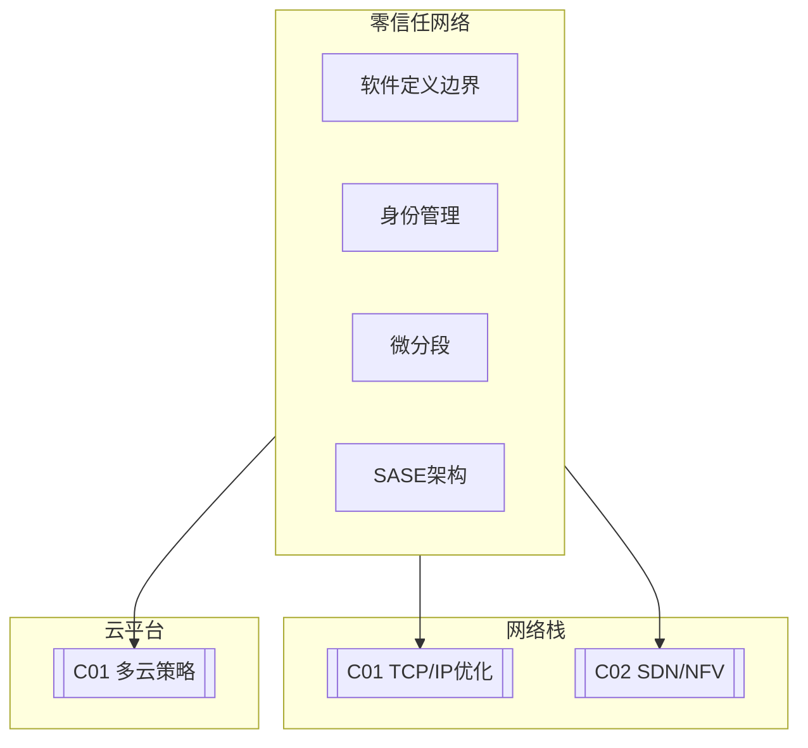

# C03 Zero Trust Networks

**所属子领域**: [B08_Network_Stack](../README.md)  
**创建日期**: 2026-01-30  
**最后更新**: 2026-01-30

## 📋 主题定位

零信任网络（Zero Trust Network）是一种全新的网络安全架构理念，其核心原则是"永不信任，始终验证"。与传统基于边界的安全模型不同，零信任假设网络内外都存在威胁，要求对每个访问请求进行严格的身份验证、授权和加密，无论请求来自何处。

零信任架构由Forrester Research在2010年首次提出，随着云计算、移动办公和物联网的普及，这一理念已成为企业网络安全转型的核心战略。Google的BeyondCorp项目是成功实施零信任架构的典型案例，证明了在不依赖VPN的情况下实现安全远程访问的可行性。

本专题系统探讨零信任网络的核心原则、架构组件、实现技术以及落地实践，帮助组织构建更安全、更灵活的网络安全体系。

## 🎯 核心概念

### 零信任核心原则

| 原则 | 说明 | 实践要点 |
|-----|------|---------|
| **永不信任，始终验证** | 不基于网络位置默认信任 | 所有访问都需要认证 |
| **最小权限访问** | 只授予必要的最小权限 | 动态权限控制，持续评估 |
| **假设已攻破** | 假设攻击者已在网络内部 | 微分段、持续监控 |
| **显式验证** | 基于所有可用数据点验证 | 设备状态、用户身份、行为分析 |

### 零信任架构组件

```
┌─────────────────────────────────────────────────────────────────────────┐
│                         零信任架构全景                                   │
├─────────────────────────────────────────────────────────────────────────┤
│                                                                         │
│  ┌─────────────────────────────────────────────────────────────────┐   │
│  │                     用户/设备身份层                               │   │
│  │                                                                 │   │
│  │  ┌─────────────┐  ┌─────────────┐  ┌─────────────────────────┐ │   │
│  │  │   用户认证   │  │   设备认证   │  │      行为分析           │ │   │
│  │  │  (IdP/MFA)  │  │  (证书/TPM) │  │  - 异常行为检测         │ │   │
│  │  │             │  │             │  │  - 风险评分             │ │   │
│  │  └──────┬──────┘  └──────┬──────┘  └───────────┬─────────────┘ │   │
│  │         └─────────────────┴─────────────────────┘               │   │
│  │                              │                                  │   │
│  │                              ▼                                  │   │
│  │  ┌─────────────────────────────────────────────────────────┐   │   │
│  │  │              策略决策点 (Policy Decision Point, PDP)       │   │   │
│  │  │                                                          │   │   │
│  │  │  • 策略引擎 - 评估访问请求，计算风险评分                    │   │   │
│  │  │  • 信任引擎 - 基于历史行为建立信任基线                      │   │   │
│  │  │  • 策略管理 - 定义和执行访问策略                           │   │   │
│  │  │                                                          │   │   │
│  │  └─────────────────────────────────────────────────────────┘   │   │
│  │                              │                                  │   │
│  │                              ▼                                  │   │
│  └──────────────────────────────┼──────────────────────────────────┘   │
│                                 │                                       │
│  ┌──────────────────────────────┼──────────────────────────────────┐   │
│  │                    策略执行点 (Policy Enforcement Point, PEP)      │   │
│  │                              │                                   │   │
│  │  ┌───────────────────────────┴───────────────────────────────┐  │   │
│  │  │                    安全访问服务边缘 (SASE)                    │  │   │
│  │  │                                                              │  │   │
│  │  │  ┌─────────────┐  ┌─────────────┐  ┌─────────────────────┐ │  │   │
│  │  │  │  SDP/IAP    │  │  SWG/防火墙  │  │      CASB           │ │  │   │
│  │  │  │ (软件定义边界)│  │            │  │ (云访问安全代理)      │ │  │   │
│  │  │  └─────────────┘  └─────────────┘  └─────────────────────┘ │  │   │
│  │  │                                                              │  │   │
│  │  └──────────────────────────────────────────────────────────┘  │   │
│  │                              │                                   │   │
│  │                              ▼                                   │   │
│  │  ┌─────────────────────────────────────────────────────────┐    │   │
│  │  │                    资源层                                  │    │   │
│  │  │                                                          │    │   │
│  │  │  ┌──────────┐  ┌──────────┐  ┌──────────┐  ┌──────────┐ │    │   │
│  │  │  │  SaaS应用  │  │ 私有应用  │  │ 云平台    │  │ 网络资源  │ │    │   │
│  │  │  │ (Salesforce│  │ (内部系统) │  │ (AWS/Azure│  │ (数据库)  │ │    │   │
│  │  │  │  Office365)│  │          │  │  GCP)     │  │          │ │    │   │
│  │  │  └──────────┘  └──────────┘  └──────────┘  └──────────┘ │    │   │
│  │  │                                                          │    │   │
│  │  │  保护机制:                                                 │    │   │
│  │  │  • 微分段 - 细粒度网络隔离                                  │    │   │
│  │  │  • 加密传输 - mTLS/WireGuard                               │    │   │
│  │  │  • 持续验证 - 会话生命周期管理                               │    │   │
│  │  │                                                          │    │   │
│  │  └─────────────────────────────────────────────────────────┘    │   │
│  └──────────────────────────────────────────────────────────────────┘   │
│                                                                         │
│  身份和访问管理 (IAM)                                                    │
│  ┌─────────────────────────────────────────────────────────────────┐   │
│  │  • 统一身份源 (IdP) - Okta/Azure AD/Keycloak                    │   │
│  │  • 多因素认证 (MFA) - TOTP/WebAuthn/生物识别                     │   │
│  │  • 权限管理 - RBAC/ABAC/动态权限                                 │   │
│  └─────────────────────────────────────────────────────────────────┘   │
│                                                                         │
└─────────────────────────────────────────────────────────────────────────┘
```

### 软件定义边界（SDP）

```
┌─────────────────────────────────────────────────────────────────────────┐
│                      软件定义边界（SDP）架构                              │
├─────────────────────────────────────────────────────────────────────────┤
│                                                                         │
│  SDP核心概念: 先认证，后连接 (Authenticate before Connect)               │
│                                                                         │
│  ┌─────────────────────────────────────────────────────────────────┐   │
│  │                      SDP控制器 (SDP Controller)                   │   │
│  │                                                                 │   │
│  │  ┌─────────────────────────────────────────────────────────┐   │   │
│  │  │                    策略管理                               │   │   │
│  │  │  ├─ 用户/设备认证                                        │   │   │
│  │  │  ├─ 访问策略配置                                         │   │   │
│  │  │  └─ 实时策略更新                                         │   │   │
│  │  ├─────────────────────────────────────────────────────────┤   │   │
│  │  │                    SPA处理 (Single Packet Authorization)  │   │   │
│  │  │  ├─ 验证SPA单包                                          │   │   │
│  │  │  ├─ 防止端口扫描                                         │   │   │
│  │  │  └─ 动态防火墙规则                                        │   │   │
│  │  ├─────────────────────────────────────────────────────────┤   │   │
│  │  │                    网关管理                               │   │   │
│  │  │  ├─ 用户-网关映射                                         │   │   │
│  │  │  ├─ 网关健康检查                                          │   │   │
│  │  │  └─ 负载均衡                                              │   │   │
│  │  └─────────────────────────────────────────────────────────┘   │   │
│  └─────────────────────────────────────────────────────────────────┘   │
│                              ▲                                          │
│                              │ SPA (Single Packet Authorization)        │
│  ┌───────────────────────────┴───────────────────────────────────────┐  │
│  │                                                                     │  │
│  │   客户端发起SPA请求:                                                 │  │
│  │   ┌─────────────────────────────────────────────────────────────┐  │  │
│  │   │  加密数据包包含: 用户凭证 + 时间戳 + 目标服务 + HMAC        │  │  │
│  │   │  防火墙默认DROP所有包，只有验证SPA后才允许连接              │  │  │
│  │   └─────────────────────────────────────────────────────────────┘  │  │
│  │                                                                     │  │
│  └─────────────────────────────────────────────────────────────────────┘  │
│                              │                                          │
│                              ▼ (认证通过后)                               │
│  ┌─────────────────────────────────────────────────────────────────┐   │
│  │                    SDP网关 (SDP Gateway)                          │   │
│  │                                                                 │   │
│  │  ┌─────────────────────────────────────────────────────────┐   │   │
│  │  │                    隧道终端                               │   │   │
│  │  │  ├─ TLS/mTLS隧道                                         │   │   │
│  │  │  ├─ WireGuard/IPsec                                      │   │   │
│  │  │  └─ DTLS (移动场景)                                       │   │   │
│  │  ├─────────────────────────────────────────────────────────┤   │   │
│  │  │                    访问代理                               │   │   │
│  │  │  ├─ L4代理 (TCP/UDP)                                      │   │   │
│  │  │  ├─ L7代理 (HTTP/HTTPS/WebSocket)                         │   │   │
│  │  │  └─ 协议检查                                               │   │   │
│  │  ├─────────────────────────────────────────────────────────┤   │   │
│  │  │                    安全控制                               │   │   │
│  │  │  ├─ DLP (数据防泄漏)                                       │   │   │
│  │  │  ├─ 内容过滤                                               │   │   │
│  │  │  └─ 会话审计                                               │   │   │
│  │  └─────────────────────────────────────────────────────────┘   │   │
│  └─────────────────────────────────────────────────────────────────┘   │
│                              ▲                                          │
│                              │ 加密隧道                                  │
│  ┌───────────────────────────┴───────────────────────────────────────┐  │
│  │                    SDP客户端 (SDP Client)                          │  │
│  │                                                                     │  │
│  │  ┌─────────────────────────────────────────────────────────────┐   │  │
│  │  │  • 设备证书管理                                             │   │  │
│  │  │  • SPA包生成和发送                                          │   │  │
│  │  │  • 隧道建立和维护                                           │   │  │
│  │  │  • 应用层代理                                               │   │  │
│  │  └─────────────────────────────────────────────────────────────┘   │  │
│  │                                                                     │  │
│  │  支持平台: Windows / macOS / Linux / iOS / Android                 │  │
│  │                                                                     │  │
│  └─────────────────────────────────────────────────────────────────────┘  │
│                                                                         │
└─────────────────────────────────────────────────────────────────────────┘
```

### 微分段（Micro-segmentation）

```
┌─────────────────────────────────────────────────────────────────────────┐
│                        微分段架构示例                                    │
├─────────────────────────────────────────────────────────────────────────┤
│                                                                         │
│  传统网络分段 vs 微分段:                                                  │
│                                                                         │
│  传统分段 (VLAN/子网):                                                    │
│  ┌──────────┬──────────┬──────────┬──────────┐                          │
│  │ VLAN 10  │ VLAN 20  │ VLAN 30  │ VLAN 40  │  ← 粗粒度，基于子网      │
│  │  Web层   │  App层   │  DB层    │  管理    │                          │
│  └──────────┴──────────┴──────────┴──────────┘                          │
│       防火墙规则: 允许VLAN10 → VLAN20                                    │
│                  允许VLAN20 → VLAN30                                    │
│                                                                         │
│  微分段 (工作负载级):                                                      │
│  ┌─────────────────────────────────────────────────────────────────┐   │
│  │                                                                 │   │
│  │  工作负载A        工作负载B        工作负载C       工作负载D      │   │
│  │  ┌────────┐      ┌────────┐      ┌────────┐      ┌────────┐    │   │
│  │  │Web-01  │      │App-01  │      │App-02  │      │DB-01   │    │   │
│  │  │标签:   │      │标签:   │      │标签:   │      │标签:   │    │   │
│  │  │env=prod│      │env=prod│      │env=dev │      │env=prod│    │   │
│  │  │tier=web│      │tier=app│      │tier=app│      │tier=db │    │   │
│  │  │app=shop│      │app=shop│      │app=test│      │app=shop│    │   │
│  │  └────┬───┘      └────┬───┘      └────┬───┘      └────┬───┘    │   │
│  │       │               │               │               │        │   │
│  │       └───────────────┼───────────────┘               │        │   │
│  │       允许 (env=prod, tier=web → tier=app)            │        │   │
│  │                       │                               │        │   │
│  │                       └───────────────────────────────┤        │   │
│  │                       允许 (env=prod, tier=app → tier=db)       │   │
│  │                                                       │        │   │
│  │                               ┌───────────────────────┘        │   │
│  │                               │ 拒绝 (env=dev → env=prod)       │   │
│  │                                                               │   │
│  └───────────────────────────────────────────────────────────────┘   │
│                                                                         │
│  标签驱动的策略:                                                         │
│  • 允许: tier=web AND env=prod → tier=app AND env=prod                 │
│  • 拒绝: tier=app AND env=dev → tier=db                                 │
│  • 默认: deny-all                                                         │
│                                                                         │
└─────────────────────────────────────────────────────────────────────────┘
```

## 🛠️ 技术实践

### 零信任网络部署

**1. 基于WireGuard的零信任网络**

```bash
#!/bin/bash
# WireGuard零信任网络部署脚本
# 实现基于身份的网格网络

set -e

ROLE=${1:-"server"}  # server/client
WG_INTERFACE=${WG_INTERFACE:-"wg0"}
WG_PORT=${WG_PORT:-"51820"}

echo "=== WireGuard零信任网络部署 ==="
echo "角色: $ROLE"
echo ""

# 安装WireGuard
install_wireguard() {
    if ! command -v wg &> /dev/null; then
        echo "安装WireGuard..."
        apt-get update
        apt-get install -y wireguard wireguard-tools
    fi
}

# 生成密钥对
generate_keys() {
    local private_key=$(wg genkey)
    local public_key=$(echo "$private_key" | wg pubkey)
    echo "$private_key $public_key"
}

# 配置服务器
setup_server() {
    echo "配置WireGuard服务器..."
    
    # 生成服务器密钥
    read -r SERVER_PRIVATE SERVER_PUBLIC <<< $(generate_keys)
    
    # 创建配置文件
    cat > /etc/wireguard/${WG_INTERFACE}.conf << EOF
[Interface]
PrivateKey = $SERVER_PRIVATE
Address = 10.200.200.1/24
ListenPort = $WG_PORT
PostUp = iptables -A FORWARD -i $WG_INTERFACE -j ACCEPT; iptables -t nat -A POSTROUTING -o eth0 -j MASQUERADE
PostDown = iptables -D FORWARD -i $WG_INTERFACE -j ACCEPT; iptables -t nat -D POSTROUTING -o eth0 -j MASQUERADE

# 客户端配置 (示例)
# [Peer]
# PublicKey = <客户端公钥>
# AllowedIPs = 10.200.200.2/32
# PersistentKeepalive = 25
EOF
    
    chmod 600 /etc/wireguard/${WG_INTERFACE}.conf
    
    # 启用IP转发
    echo "net.ipv4.ip_forward=1" >> /etc/sysctl.conf
    sysctl -p
    
    # 启动服务
    systemctl enable wg-quick@$WG_INTERFACE
    systemctl start wg-quick@$WG_INTERFACE
    
    echo ""
    echo "=== 服务器公钥 (分发给客户端) ==="
    echo "$SERVER_PUBLIC"
    echo ""
    echo "服务器IP: 10.200.200.1"
}

# 配置客户端
setup_client() {
    local server_public=$2
    local server_endpoint=$3
    
    echo "配置WireGuard客户端..."
    
    # 生成客户端密钥
    read -r CLIENT_PRIVATE CLIENT_PUBLIC <<< $(generate_keys)
    
    # 分配客户端IP (示例)
    local client_ip="10.200.200.2/24"
    
    cat > /etc/wireguard/${WG_INTERFACE}.conf << EOF
[Interface]
PrivateKey = $CLIENT_PRIVATE
Address = $client_ip
DNS = 1.1.1.1

[Peer]
PublicKey = $server_public
AllowedIPs = 0.0.0.0/0  # 所有流量通过隧道
Endpoint = $server_endpoint:$WG_PORT
PersistentKeepalive = 25
EOF
    
    chmod 600 /etc/wireguard/${WG_INTERFACE}.conf
    
    echo ""
    echo "=== 客户端公钥 (添加到服务器) ==="
    echo "$CLIENT_PUBLIC"
    echo ""
}

# 添加对等节点 (服务器上执行)
add_peer() {
    local peer_public=$2
    local peer_ip=$3
    
    echo "添加对等节点..."
    
    # 动态添加peer
    wg set $WG_INTERFACE peer $peer_public allowed-ips $peer_ip
    
    # 持久化到配置文件
    cat >> /etc/wireguard/${WG_INTERFACE}.conf << EOF

[Peer]
PublicKey = $peer_public
AllowedIPs = $peer_ip
PersistentKeepalive = 25
EOF
    
    echo "对等节点已添加: $peer_ip"
}

# 显示状态
show_status() {
    echo "=== WireGuard状态 ==="
    wg show $WG_INTERFACE
    
    echo ""
    echo "=== 接口信息 ==="
    ip addr show $WG_INTERFACE 2>/dev/null || echo "接口未启动"
}

# 主逻辑
case "$ROLE" in
    server)
        install_wireguard
        setup_server
        show_status
        ;;
    client)
        if [ -z "$2" ] || [ -z "$3" ]; then
            echo "用法: $0 client <服务器公钥> <服务器地址:端口>"
            exit 1
        fi
        install_wireguard
        setup_client "$@"
        ;;
    add-peer)
        if [ -z "$2" ] || [ -z "$3" ]; then
            echo "用法: $0 add-peer <peer公钥> <peer IP>"
            exit 1
        fi
        add_peer "$@"
        ;;
    status)
        show_status
        ;;
    *)
        echo "用法: $0 <server|client|add-peer|status>"
        ;;
esac
```

**2. 基于SPIFFE/SPIRE的身份管理**

```yaml
# SPIRE服务器配置示例
# server.conf
server {
    bind_address = "0.0.0.0"
    bind_port = "8081"
    trust_domain = "example.org"
    
    data_dir = "/opt/spire/data/server"
    log_level = "DEBUG"
    
    # CA配置
    ca_key_type = "ec-p256"
    ca_ttl = "24h"
    
    # JWT签名密钥
    jwt_issuer = "https://spire.example.org"
}

# 节点认证 (Node Attestation)
plugins {
    NodeAttestor "join_token" {
        plugin_data {
            # 简单token认证 (测试用)
        }
    }
    
    NodeAttestor "aws_iid" {
        plugin_data {
            # AWS实例身份认证
        }
    }
    
    NodeAttestor "k8s_psat" {
        plugin_data {
            # Kubernetes Projected Service Account Token
            clusters = {
                "production" = {
                    service_account_allow_list = ["spire:spire-agent"]
                }
            }
        }
    }
    
    # 数据存储
    DataStore "sql" {
        plugin_data {
            database_type = "sqlite3"
            connection_string = "/opt/spire/data/server/datastore.sqlite3"
        }
    }
    
    # KeyManager
    KeyManager "disk" {
        plugin_data {
            keys_path = "/opt/spire/data/server/keys.json"
        }
    }
}
```

```yaml
# SPIRE Agent配置
# agent.conf
agent {
    data_dir = "/opt/spire/data/agent"
    log_level = "DEBUG"
    server_address = "spire-server"
    server_port = "8081"
    socket_path = "/tmp/spire-agent/public/api.sock"
    trust_bundle_path = "/opt/spire/conf/agent/bootstrap.crt"
    trust_domain = "example.org"
}

plugins {
    NodeAttestor "join_token" {
        plugin_data {}
    }
    
    WorkloadAttestor "unix" {
        plugin_data {}
    }
    
    WorkloadAttestor "k8s" {
        plugin_data {
            # Kubernetes workload认证
            kubelet_read_only_port = 10255
        }
    }
}
```

**3. 基于Istio的零信任服务网格**

```yaml
# Istio零信任配置示例
# peer-authentication.yaml
# 启用mTLS (Workload级别)

apiVersion: security.istio.io/v1beta1
kind: PeerAuthentication
metadata:
  name: default
  namespace: istio-system
spec:
  mtls:
    mode: STRICT  # 强制mTLS

---
# 特定命名空间允许PERMISSIVE (渐进式迁移)
apiVersion: security.istio.io/v1beta1
kind: PeerAuthentication
metadata:
  name: legacy
  namespace: legacy-apps
spec:
  mtls:
    mode: PERMISSIVE  # 允许明文和mTLS

---
# AuthorizationPolicy - 授权策略
apiVersion: security.istio.io/v1beta1
kind: AuthorizationPolicy
metadata:
  name: frontend-policy
  namespace: production
spec:
  selector:
    matchLabels:
      app: frontend
  action: ALLOW
  rules:
    # 允许来自ingress gateway的流量
    - from:
        - source:
            principals: ["cluster.local/ns/istio-system/sa/istio-ingressgateway"]
      to:
        - operation:
            methods: ["GET", "POST"]
            paths: ["/api/*"]

---
# 拒绝所有访问 (默认拒绝)
apiVersion: security.istio.io/v1beta1
kind: AuthorizationPolicy
metadata:
  name: deny-all
  namespace: production
spec:
  action: DENY

---
# 微服务间细粒度访问控制
apiVersion: security.istio.io/v1beta1
kind: AuthorizationPolicy
metadata:
  name: service-to-service
  namespace: production
spec:
  selector:
    matchLabels:
      app: backend
  action: ALLOW
  rules:
    # 只允许来自frontend服务的JWT token访问
    - from:
        - source:
            principals: ["cluster.local/ns/production/sa/frontend"]
      to:
        - operation:
            methods: ["GET"]
            paths: ["/data/*"]
      when:
        - key: request.auth.claims[iss]
          values: ["https://accounts.google.com"]
```

### 零信任安全监控

**4. 安全事件监控脚本（Python）**

```python
#!/usr/bin/env python3
"""
零信任安全监控工具
分析访问日志、检测异常行为
"""

import json
import re
import time
from dataclasses import dataclass
from typing import Dict, List, Set
from collections import defaultdict
import hashlib


@dataclass
class AccessEvent:
    """访问事件"""
    timestamp: float
    user_id: str
    device_id: str
    source_ip: str
    resource: str
    action: str
    result: str
    risk_score: float = 0.0


class ZeroTrustMonitor:
    """零信任监控器"""
    
    def __init__(self):
        self.user_history: Dict[str, List[AccessEvent]] = defaultdict(list)
        self.device_history: Dict[str, List[AccessEvent]] = defaultdict(list)
        self.baseline: Dict[str, Dict] = {}  # 用户行为基线
        
    def parse_access_log(self, log_line: str) -> AccessEvent:
        """解析访问日志"""
        # 示例日志格式: JSON
        try:
            data = json.loads(log_line)
            return AccessEvent(
                timestamp=data.get('timestamp', time.time()),
                user_id=data.get('user_id', 'unknown'),
                device_id=data.get('device_id', 'unknown'),
                source_ip=data.get('source_ip', 'unknown'),
                resource=data.get('resource', 'unknown'),
                action=data.get('action', 'unknown'),
                result=data.get('result', 'unknown')
            )
        except:
            return None
    
    def calculate_risk_score(self, event: AccessEvent) -> float:
        """计算风险评分"""
        risk = 0.0
        
        # 1. 异常时间访问 (非工作时间)
        hour = time.localtime(event.timestamp).tm_hour
        if hour < 8 or hour > 20:
            risk += 0.2
        
        # 2. 新设备
        if event.device_id not in self.device_history:
            risk += 0.3
        
        # 3. 异地访问 (简化判断)
        user_ips = {e.source_ip for e in self.user_history.get(event.user_id, [])}
        if user_ips and event.source_ip not in user_ips:
            risk += 0.3
        
        # 4. 敏感资源访问
        sensitive_resources = {'admin', 'finance', 'hr'}
        if any(r in event.resource.lower() for r in sensitive_resources):
            risk += 0.2
        
        # 5. 访问失败次数
        recent_failures = sum(
            1 for e in self.user_history.get(event.user_id, [])[-10:]
            if e.result == 'denied'
        )
        if recent_failures > 3:
            risk += 0.2
        
        return min(risk, 1.0)
    
    def detect_anomalies(self, event: AccessEvent) -> List[str]:
        """检测异常行为"""
        alerts = []
        
        # 检查 Impossible Travel (不可能旅行)
        user_events = self.user_history.get(event.user_id, [])
        if len(user_events) > 0:
            last_event = user_events[-1]
            time_diff = event.timestamp - last_event.timestamp
            
            # 简化: 如果IP变化很快 (实际情况需要地理位置信息)
            if (event.source_ip != last_event.source_ip and 
                time_diff < 3600):  # 1小时内IP变化
                alerts.append(f"可能的账户共享或被盗用: IP从 {last_event.source_ip} 变为 {event.source_ip}")
        
        # 检查权限提升尝试
        if event.action == 'admin_access' and 'admin' not in event.user_id:
            alerts.append(f"非管理员用户尝试管理员操作: {event.user_id}")
        
        # 检查暴力破解
        recent_denied = [
            e for e in self.user_history.get(event.user_id, [])[-10:]
            if e.result == 'denied'
        ]
        if len(recent_denied) >= 5:
            alerts.append(f"多次访问被拒绝，可能的暴力破解尝试")
        
        return alerts
    
    def process_event(self, event: AccessEvent):
        """处理访问事件"""
        # 计算风险评分
        event.risk_score = self.calculate_risk_score(event)
        
        # 检测异常
        alerts = self.detect_anomalies(event)
        
        # 存储历史
        self.user_history[event.user_id].append(event)
        self.device_history[event.device_id].append(event)
        
        # 输出结果
        return {
            'event': {
                'user': event.user_id,
                'resource': event.resource,
                'action': event.action,
                'risk_score': round(event.risk_score, 2)
            },
            'alerts': alerts
        }
    
    def generate_user_baseline(self, user_id: str) -> Dict:
        """生成用户行为基线"""
        events = self.user_history.get(user_id, [])
        if not events:
            return {}
        
        # 常用IP
        common_ips = defaultdict(int)
        for e in events:
            common_ips[e.source_ip] += 1
        
        # 常用时间
        hours = [time.localtime(e.timestamp).tm_hour for e in events]
        hour_dist = defaultdict(int)
        for h in hours:
            hour_dist[h] += 1
        
        # 访问资源
        resources = set(e.resource for e in events)
        
        baseline = {
            'user_id': user_id,
            'common_ips': dict(common_ips),
            'active_hours': dict(hour_dist),
            'known_resources': list(resources),
            'total_events': len(events)
        }
        
        self.baseline[user_id] = baseline
        return baseline


if __name__ == '__main__':
    monitor = ZeroTrustMonitor()
    
    # 模拟事件
    test_events = [
        json.dumps({
            'timestamp': time.time(),
            'user_id': 'user1@example.com',
            'device_id': 'device-001',
            'source_ip': '192.168.1.100',
            'resource': '/api/data',
            'action': 'read',
            'result': 'success'
        }),
        json.dumps({
            'timestamp': time.time() + 60,
            'user_id': 'user1@example.com',
            'device_id': 'device-002',  # 新设备
            'source_ip': '10.0.0.50',   # 新IP
            'resource': '/admin/users',
            'action': 'admin_access',
            'result': 'denied'
        })
    ]
    
    for log in test_events:
        event = monitor.parse_access_log(log)
        if event:
            result = monitor.process_event(event)
            print(json.dumps(result, indent=2))
```

## 📚 资源索引

### 零信任框架与标准

| 资源 | 组织 | 说明 |
|-----|------|------|
| **NIST SP 800-207** | NIST | 零信任架构标准 |
| **BeyondCorp** | Google | Google零信任实践 |
| **Azure AD ZTNA** | Microsoft | Azure零信任网络访问 |
| **Zscaler ZPA** | Zscaler | 零信任私有访问 |

### 开源项目

| 项目 | 说明 | 链接 |
|-----|------|------|
| **SPIFFE/SPIRE** | 工作负载身份 | spiffe.io |
| **OpenZiti** | 零信任网络覆盖 | openziti.io |
| **Teleport** | 零信任访问平台 | goteleport.com |
| **Boundary** | HashiCorp零信任 | boundaryproject.io |

## 🔗 关联知识



## 💡 学习建议

### 入门路径

1. **概念学习**（1-2周）
   - 理解零信任核心原则
   - 学习NIST SP 800-207
   - 研究Google BeyondCorp

2. **技术实践**（3-4周）
   - 部署WireGuard网络
   - 配置SPIFFE身份
   - 实施Istio零信任

3. **架构设计**（5-8周）
   - 设计SDP架构
   - 微分段实施
   - 持续验证系统

---

*最后更新: 2026-01-30*  
*维护者: Infrastructure Team*
