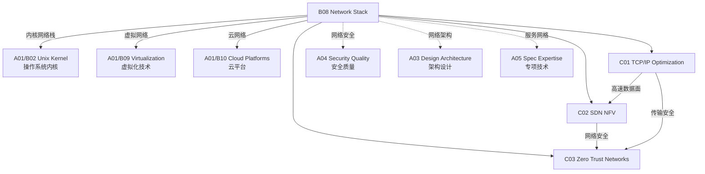

# B08 Network Stack

**所属领域**: [A01_Infrastructure](../readme.md)
**创建日期**: 2026-01-30
**最后更新**: 2026-01-30

## 📋 子领域定位

网络技术栈是连接计算资源的神经系统，决定了分布式系统的性能、可靠性和安全性。随着云计算、边缘计算和 AI 大模型训练的兴起，网络技术正在经历从软件定义到硬件卸载、从尽力而为到确定性保证的重大变革。

本领域涵盖从内核网络协议栈优化到软件定义网络 (SDN)、网络功能虚拟化 (NFV) 和零信任网络安全架构的全方位技术。现代网络工程师需要掌握传统 TCP/IP 协议栈的深层原理，同时理解 DPDK/XDP 高性能数据面、SR-IOV 硬件虚拟化、以及基于 eBPF 的可观测性和安全策略执行。

**核心关注点**：
- **协议栈优化**: TCP/UDP 拥塞控制、内核网络路径优化、io_uring 网络 I/O
- **SDN/NFV**: OpenFlow、OVN、DPDK、智能网卡卸载
- **零信任网络**: mTLS、服务网格、微分段、身份感知代理
- **高性能网络**: RDMA、RoCEv2、InfiniBand、DPU 卸载

## 🗂️ 专项列表

### [C01. TCP/IP_Optimization](C01_TCPIP_Optimization/README.md)

TCP/IP 协议栈优化是提升网络应用性能的关键。本专项深入剖析 Linux 内核网络栈的实现机制，包括 TCP 拥塞控制算法 (BBR/CUBIC/RENO)、连接建立优化 (TFO/TCP Fast Open)、零拷贝技术 (sendfile/splice)、以及内核旁路技术 (DPDK/XDP)。涵盖网络命名空间、虚拟网桥、iptables/nftables 数据包过滤和 NAT 实现原理。

### [C02. SDN_NFV](C02_SDN_NFV/README.md)

软件定义网络和网络功能虚拟化正在重塑网络架构。本专项详解 OpenFlow 协议、Open vSwitch 架构、OVN (Open Virtual Network) 逻辑网络抽象、以及基于 DPDK 的高性能数据包处理。探讨云原生网络方案 (Cilium/Calico)、服务网格数据面 (Envoy/Linkerd)、以及智能网卡 (SmartNIC/DPU) 的卸载能力。

### [C03. Zero_Trust_Networks](C03_Zero_Trust_Networks/README.md)

零信任安全模型改变了网络安全的基本假设。本专项覆盖零信任架构的核心原则（永不信任，始终验证）、身份感知代理 (IAP)、微分段实现、服务间 mTLS 认证、以及基于 SPIFFE/SPIRE 的工作负载身份管理。探讨 BeyondCorp 模型实现、设备信任评估、以及持续风险监控技术。

## 🛠️ 技术栈概览

### 核心技术

| 技术领域 | 关键技术 | 说明 |
|----------|----------|------|
| **传输层** | TCP BBR, QUIC, SCTP, MPTCP | 现代传输协议优化 |
| **网络虚拟化** | VXLAN, Geneve, SR-IOV, EVPN | 数据中心 Overlay 网络 |
| **SDN 控制** | OpenFlow, OVSDB, BGP-LS, P4 | 软件定义网络控制平面 |
| **数据面加速** | DPDK, XDP, AF_XDP, io_uring | 内核旁路高性能包处理 |
| **服务网格** | Istio, Linkerd, Consul Connect | L7 流量管理与安全 |
| **零信任** | mTLS, SPIFFE, OPA, Teleport | 身份驱动的安全访问 |

### 工具链

| 类别 | 工具 | 用途 |
|------|------|------|
| **网络调试** | tcpdump, Wireshark, tshark, termshark | 数据包捕获分析 |
| **性能测试** | iperf3, netperf, pktgen, moongen | 网络吞吐延迟测试 |
| **连接跟踪** | ss, netstat, lsof, conntrack | 连接状态监控 |
| **路由诊断** | traceroute, mtr, bgpq4, pathping | 路由路径分析 |
| **流量控制** | tc, nftables, iptables, ebtables | 流量整形与过滤 |
| **配置管理** | Ansible, Terraform, SaltStack | 网络配置自动化 |

### CNI 插件生态

| CNI 插件 | 特点 | 适用场景 |
|----------|------|----------|
| **Calico** | BGP 路由，网络策略 | 大规模集群，高性能 |
| **Cilium** | eBPF 驱动，可观测性 | 云原生安全，服务网格 |
| **Flannel** | 简单易用，VXLAN/host-gw | 中小型集群 |
| **Weave Net** | 加密通信，自动发现 | 多租户环境 |
| **Multus** | 多网卡支持 | NFV，电信云 |
| **OVN-Kubernetes** | OVN 集成，逻辑网络 | OpenStack 整合 |

## 💼 实践案例索引

### 案例 1: 高吞吐存储网络优化

**场景**: 分布式存储集群网络性能优化 (100GbE)

**优化配置**:
```bash
# /etc/sysctl.conf 网络优化

# 缓冲区大小
net.core.rmem_max = 134217728
net.core.wmem_max = 134217728
net.core.rmem_default = 16777216
net.core.wmem_default = 16777216
net.ipv4.tcp_rmem = 4096 87380 134217728
net.ipv4.tcp_wmem = 4096 65536 134217728

# BBR 拥塞控制
net.ipv4.tcp_congestion_control = bbr
net.core.default_qdisc = fq

# 连接跟踪优化
net.netfilter.nf_conntrack_max = 2000000
net.ipv4.tcp_max_syn_backlog = 65536

# 中断亲和性 (多队列网卡)
# /etc/udev/rules.d/99-network.rules
ACTION=="add", SUBSYSTEM=="net", NAME=="ens*", \
    RUN+="/usr/local/bin/set_irq_affinity.sh $name"
```

**网卡优化**:
```bash
# 启用 RPS/RFS (Receive Packet Steering/Flow Steering)
echo f > /sys/class/net/eth0/queues/rx-0/rps_cpus
echo 32768 > /proc/sys/net/core/rps_sock_flow_entries
echo 32768 > /sys/class/net/eth0/queues/rx-0/rps_flow_cnt

# 增大 Ring Buffer
ethtool -G eth0 rx 4096 tx 4096

# 启用大帧 (Jumbo Frames)
ip link set eth0 mtu 9000
```

**效果**:
| 指标 | 优化前 | 优化后 |
|------|--------|--------|
| 单流吞吐 | 15 Gbps | 95 Gbps |
| 延迟 (P99) | 500μs | 50μs |
| CPU 使用率 | 80% | 25% |

### 案例 2: 基于 XDP 的 DDoS 防护

**场景**: 边缘网关的 Layer 3/4 DDoS 防护

**XDP 程序**:
```c
// xdp_ddos_filter.c
#include <linux/bpf.h>
#include <linux/if_ether.h>
#include <linux/ip.h>
#include <linux/tcp.h>

SEC("xdp")
int xdp_ddos_filter(struct xdp_md *ctx)
{
    void *data_end = (void *)(long)ctx->data_end;
    void *data = (void *)(long)ctx->data;
    
    struct ethhdr *eth = data;
    if ((void *)(eth + 1) > data_end)
        return XDP_DROP;
    
    if (eth->h_proto != __constant_htons(ETH_P_IP))
        return XDP_PASS;
    
    struct iphdr *ip = (void *)(eth + 1);
    if ((void *)(ip + 1) > data_end)
        return XDP_DROP;
    
    // 检查源 IP 黑名单
    __u32 src_ip = ip->saddr;
    if (is_blacklisted(src_ip)) {
        __sync_fetch_and_add(&drop_stats, 1);
        return XDP_DROP;
    }
    
    // SYN Flood 检测
    if (ip->protocol == IPPROTO_TCP) {
        struct tcphdr *tcp = (void *)ip + (ip->ihl * 4);
        if ((void *)(tcp + 1) > data_end)
            return XDP_DROP;
        
        if (tcp->syn && !tcp->ack) {
            if (check_syn_flood(src_ip)) {
                return XDP_DROP;
            }
        }
    }
    
    return XDP_PASS;
}
```

**性能指标**:
- 包处理速率: 20Mpps (单核)
- 延迟增加: < 1μs
- CPU 开销: < 5%

### 案例 3: 零信任网络架构实现

**场景**: 云原生应用的零信任安全访问

**架构组件**:
| 组件 | 技术选型 | 功能 |
|------|----------|------|
| 身份中心 | Keycloak / Okta | 统一身份认证 |
| 工作负载身份 | SPIRE | SVID 颁发与验证 |
| 服务网格 | Istio + Envoy | mTLS 自动注入 |
| 策略引擎 | OPA/Gatekeeper | 细粒度访问控制 |
| 设备信任 | Google BeyondCorp | 设备健康检查 |

**mTLS 配置**:
```yaml
# PeerAuthentication 策略
apiVersion: security.istio.io/v1beta1
kind: PeerAuthentication
metadata:
  name: default
  namespace: production
spec:
  mtls:
    mode: STRICT  # 强制 mTLS
---
# AuthorizationPolicy 策略
apiVersion: security.istio.io/v1beta1
kind: AuthorizationPolicy
metadata:
  name: service-access
  namespace: production
spec:
  selector:
    matchLabels:
      app: payment-service
  action: ALLOW
  rules:
  - from:
    - source:
        principals: ["cluster.local/ns/production/sa/frontend-sa"]
    to:
    - operation:
        methods: ["POST"]
        paths: ["/api/v1/pay"]
```

## 🔗 知识关联图谱



## 📖 学习资源

### 推荐书籍

| 书名 | 作者 | 说明 |
|------|------|------|
| 《TCP/IP Illustrated, Vol 1》 | W. Richard Stevens | TCP/IP 协议圣经 |
| 《Unix Network Programming》 | W. Richard Stevens | 网络编程经典 |
| 《Software-Defined Networking: A Systems Approach》 | Peterson et al. | SDN 系统方法 |
| 《Linux Kernel Networking》 | Rami Rosen | 内核网络实现 |
| 《Zero Trust Networks》 | Evan Gilman | 零信任架构指南 |

### 在线课程

| 课程 | 平台 | 链接 |
|------|------|------|
| Computer Networks (Stanford) | Coursera | https://www.coursera.org/specializations/computer-communications |
| Software Defined Networking | Coursera | https://www.coursera.org/learn/sdn |
| Kubernetes Networking | Linux Foundation | https://www.linuxfoundation.org/courses/kubernetes-networking |

### 官方文档与标准

| 资源 | 链接 | 说明 |
|------|------|------|
| IETF RFC | https://www.rfc-editor.org | 网络协议标准 |
| Linux Networking Docs | https://docs.kernel.org/networking/ | 内核网络文档 |
| DPDK Documentation | https://doc.dpdk.org/guides/ | DPDK 开发指南 |
| Cilium Docs | https://docs.cilium.io | eBPF 网络方案 |
| Istio Docs | https://istio.io/latest/docs/ | 服务网格文档 |

### 技术博客

| 博客 | 链接 | 说明 |
|------|------|------|
| Cloudflare Blog | https://blog.cloudflare.com | 网络与安全前沿 |
| Netflix Tech Blog | https://netflixtechblog.com | 大规模网络实践 |
| Kubernetes Blog | https://kubernetes.io/blog/ | K8s 网络更新 |
| eBPF 社区 | https://ebpf.io/blog/ | eBPF 技术动态 |

### 开源项目

| 项目 | GitHub | 说明 |
|------|--------|------|
| Open vSwitch | https://github.com/openvswitch/ovs | 虚拟交换机 |
| Cilium | https://github.com/cilium/cilium | eBPF 网络与安全 |
| Envoy | https://github.com/envoyproxy/envoy | 高性能代理 |
| Calico | https://github.com/projectcalico/calico | K8s 网络方案 |
| DPDK | https://github.com/DPDK/dpdk | 数据面开发套件 |
| Wireshark | https://github.com/wireshark/wireshark | 协议分析器 |

### 工具资源

| 工具 | 链接 | 说明 |
|------|------|------|
| Iperf3 | https://github.com/esnet/iperf | 网络性能测试 |
| Wireshark | https://www.wireshark.org | 协议分析 |
| P4 Language | https://p4.org | 可编程数据面 |
| BGPStream | https://bgpstream.caida.org | BGP 数据分析 |

## 🔄 维护说明

- **内容审查**: 每季度检查网络协议新版本和 CNI 插件更新
- **更新机制**: 关注 IETF 标准进展和内核网络子系统更新
- **质量标准**: 所有配置示例需在真实环境验证
- **贡献方式**: 欢迎提交网络优化案例和故障排查经验
