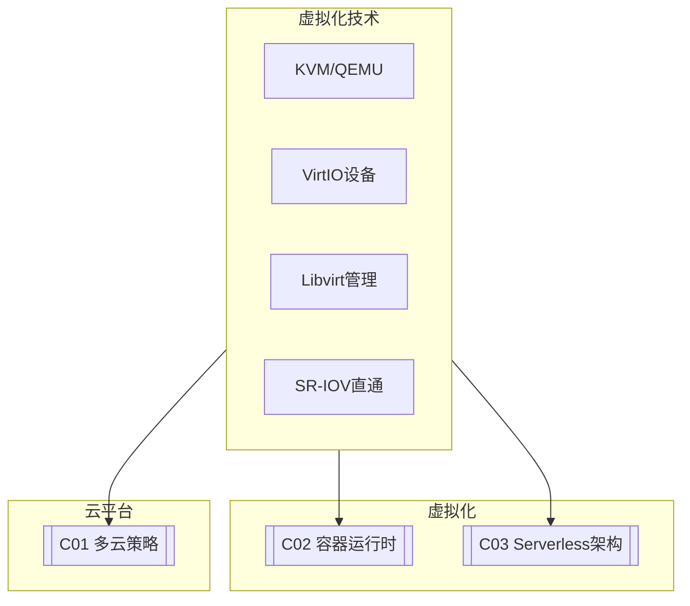

# C01 Hypervisor Tech

**所属子领域**: [B09_Virtualization](../README.md)  
**创建日期**: 2026-01-30  
**最后更新**: 2026-01-30

## 📋 主题定位

虚拟化技术（Hypervisor Technology）是现代云计算基础设施的基石。通过在物理硬件和操作系统之间引入虚拟化层（Hypervisor），单台物理服务器可以运行多个独立的虚拟机（VM），每个虚拟机都拥有独立的操作系统和完整的硬件抽象。这种技术显著提高了硬件资源利用率，简化了IT基础设施管理，并为云计算的弹性扩展奠定了基础。

从早期的全虚拟化、硬件辅助虚拟化，到现代的轻量级虚拟化和安全容器，虚拟化技术不断演进。KVM作为Linux内核的原生虚拟化解决方案，已成为企业级虚拟化和云计算平台的事实标准；而基于KVM的oVirt、OpenStack等管理平台，则提供了完整的虚拟化数据中心解决方案。

本专题深入探讨虚拟化技术的原理、Hypervisor架构、KVM实践以及性能优化，为构建企业级虚拟化平台提供全面指导。

## 🎯 核心概念

### 虚拟化类型

| 类型 | 说明 | 代表产品 | 适用场景 |
|-----|------|---------|---------|
| **裸金属型 (Type 1)** | 直接运行在硬件上 | VMware ESXi, Xen, Hyper-V | 企业数据中心 |
| **宿主型 (Type 2)** | 运行在宿主OS上 | VMware Workstation, VirtualBox | 开发测试 |
| **硬件辅助虚拟化** | CPU提供虚拟化支持 | Intel VT-x, AMD-V | 主流方案 |
| **准虚拟化** | Guest OS修改以配合 | Xen (PV模式) | 性能敏感场景 |
| **操作系统级** | 共享宿主OS内核 | LXC, OpenVZ | 轻量级隔离 |

### Hypervisor架构对比

```
┌─────────────────────────────────────────────────────────────────────────┐
│                        虚拟化架构对比                                    │
├─────────────────────────────────────────────────────────────────────────┤
│                                                                         │
│  Type 1 - 裸金属型 (VMware ESXi):                                        │
│  ┌─────────────────────────────────────────────────────────────────┐   │
│  │                     虚拟机 (VM)                                    │   │
│  │  ┌──────────┐  ┌──────────┐  ┌──────────┐                      │   │
│  │  │  Guest OS│  │  Guest OS│  │  Guest OS│                      │   │
│  │  │    +     │  │    +     │  │    +     │                      │   │
│  │  │   App    │  │   App    │  │   App    │                      │   │
│  │  └────┬─────┘  └────┬─────┘  └────┬─────┘                      │   │
│  │       └──────────────┴──────────────┘                            │   │
│  │                     Hypervisor (VMkernel)                        │   │
│  └─────────────────────────────────────────────────────────────────┘   │
│                              ↓                                          │
│                        物理硬件 (CPU/Mem/IO)                             │
│                                                                         │
│  Type 2 - 宿主型 (VirtualBox):                                           │
│  ┌─────────────────────────────────────────────────────────────────┐   │
│  │                     虚拟机 (VM)                                    │   │
│  │  ┌──────────┐  ┌──────────┐                                     │   │
│  │  │  Guest OS│  │  Guest OS│                                     │   │
│  │  └────┬─────┘  └────┬─────┘                                     │   │
│  │       └──────────────┘                                           │   │
│  │              Hypervisor                                          │   │
│  │       (依赖宿主OS的设备驱动)                                      │   │
│  ├─────────────────────────────────────────────────────────────────┤   │
│  │                    宿主操作系统 (Host OS)                          │   │
│  └─────────────────────────────────────────────────────────────────┘   │
│                              ↓                                          │
│                        物理硬件                                          │
│                                                                         │
│  KVM - 内核虚拟化:                                                        │
│  ┌─────────────────────────────────────────────────────────────────┐   │
│  │                     QEMU/KVM                                      │   │
│  │  ┌──────────┐  ┌──────────┐  ┌──────────┐                      │   │
│  │  │  Guest OS│  │  Guest OS│  │  Guest OS│                      │   │
│  │  │    +     │  │    +     │  │    +     │                      │   │
│  │  │   App    │  │   App    │  │   App    │                      │   │
│  │  └────┬─────┘  └────┬─────┘  └────┬─────┘                      │   │
│  │       └──────────────┴──────────────┘                            │   │
│  │              /dev/kvm (设备接口)                                  │   │
│  ├─────────────────────────────────────────────────────────────────┤   │
│  │                    Linux Kernel                                  │   │
│  │              (KVM模块: kvm.ko, kvm-intel.ko/kvm-amd.ko)          │   │
│  └─────────────────────────────────────────────────────────────────┘   │
│                              ↓                                          │
│                        物理硬件                                          │
│                                                                         │
└─────────────────────────────────────────────────────────────────────────┘
```

### KVM架构详解

```
┌─────────────────────────────────────────────────────────────────────────┐
│                        KVM/QEMU架构详解                                  │
├─────────────────────────────────────────────────────────────────────────┤
│                                                                         │
│  ┌─────────────────────────────────────────────────────────────────┐   │
│  │                         QEMU 用户空间                             │   │
│  │                     (设备模拟、I/O处理)                            │   │
│  │                                                                 │   │
│  │  ┌─────────────────────────────────────────────────────────┐   │   │
│  │  │                    前端设备 (Front-end)                   │   │   │
│  │  │  ┌─────────┐ ┌─────────┐ ┌─────────┐ ┌─────────┐       │   │   │
│  │  │  │virtio-net│ │virtio-blk│ │virtio-rng│ │virtio-console│   │   │   │
│  │  │  └────┬────┘ └────┬────┘ └────┬────┘ └────┬────┘       │   │   │
│  │  │       └─────────────┴─────────────┴───────────┘          │   │   │
│  │  │                         │                                │   │   │
│  │  │                         ▼                                │   │   │
│  │  │              ┌─────────────────────┐                     │   │   │
│  │  │              │   vhost/vhost-user  │                     │   │   │
│  │  │              │   (内核/用户态加速)  │                     │   │   │
│  │  │              └─────────────────────┘                     │   │   │
│  │  └─────────────────────────────────────────────────────────┘   │   │
│  │                              │                                  │   │
│  │  ┌───────────────────────────┴──────────────────────────────┐  │   │
│  │  │                    后端设备 (Back-end)                    │  │   │
│  │  │  ┌─────────┐ ┌─────────┐ ┌─────────┐ ┌─────────────────┐ │  │   │
│  │  │  │TAP接口  │ │  文件   │ │ /dev/   │ │   其他设备       │ │  │   │
│  │  │  │桥接    │ │镜像文件  │ │random  │ │   模拟           │ │  │   │
│  │  │  └─────────┘ └─────────┘ └─────────┘ └─────────────────┘ │  │   │
│  │  └──────────────────────────────────────────────────────────┘  │   │
│  │                                                                 │   │
│  └─────────────────────────────────────────────────────────────────┘   │
│                              ↓ ioctl()                                  │
│  ┌─────────────────────────────────────────────────────────────────┐   │
│  │                      KVM内核模块                                  │   │
│  │                                                                 │   │
│  │  ┌─────────────────────────────────────────────────────────┐   │   │
│  │  │                    VM管理 (struct kvm)                    │   │   │
│  │  │  ┌─────────────────────────────────────────────────┐   │   │   │
│  │  │  │              虚拟CPU (vCPU)                        │   │   │   │
│  │  │  │  ┌─────────┐  ┌─────────┐  ┌─────────┐          │   │   │   │
│  │  │  │  │  vCPU 0 │  │  vCPU 1 │  │  vCPU N │          │   │   │   │
│  │  │  │  │         │  │         │  │         │          │   │   │   │
│  │  │  │  │ struct  │  │ struct  │  │ struct  │          │   │   │   │
│  │  │  │  │kvm_vcpu │  │kvm_vcpu │  │kvm_vcpu │          │   │   │   │
│  │  │  │  └────┬────┘  └────┬────┘  └────┬────┘          │   │   │   │
│  │  │  │       └─────────────┴─────────────┘              │   │   │   │
│  │  │  │                    │                             │   │   │   │
│  │  │  │  KVM_RUN ioctl ────▶ VM Entry (VMX root → non-root) │   │   │   │
│  │  │  │                    │                             │   │   │   │
│  │  │  │  ◀───────────────── VM Exit (处理异常)            │   │   │   │
│  │  │  │                                                 │   │   │   │
│  │  │  └─────────────────────────────────────────────────┘   │   │   │
│  │  ├─────────────────────────────────────────────────────────┤   │   │
│  │  │                    内存管理                               │   │   │
│  │  │  ┌─────────────────────────────────────────────────┐   │   │   │
│  │  │  │  影子页表 (Shadow Page Tables)                    │   │   │   │
│  │  │  │  EPT (Extended Page Tables) - Intel VT-x          │   │   │   │
│  │  │  │  NPT (Nested Page Tables) - AMD-V                 │   │   │   │
│  │  │  │  KSM (Kernel Samepage Merging) - 内存共享         │   │   │   │
│  │  │  └─────────────────────────────────────────────────┘   │   │   │
│  │  └─────────────────────────────────────────────────────────┘   │   │
│  └─────────────────────────────────────────────────────────────────┘   │
│                              ↓                                          │
│  ┌─────────────────────────────────────────────────────────────────┐   │
│  │                      物理硬件                                     │   │
│  │  ┌─────────┐ ┌─────────┐ ┌─────────┐ ┌─────────────────────┐   │   │
│  │  │   CPU   │ │  内存   │ │   I/O   │ │   SR-IOV/VT-d设备    │   │   │
│  │  │VT-x/AMD-V│ │         │ │         │ │   (PCI直通)          │   │   │
│  │  └─────────┘ └─────────┘ └─────────┘ └─────────────────────┘   │   │
│  └─────────────────────────────────────────────────────────────────┘   │
│                                                                         │
└─────────────────────────────────────────────────────────────────────────┘
```

### CPU虚拟化技术

| 技术 | Intel | AMD | 说明 |
|-----|-------|-----|------|
| **CPU虚拟化** | VT-x | AMD-V | 核心虚拟化扩展 |
| **内存虚拟化** | EPT | NPT | 扩展页表/嵌套页表 |
| **I/O虚拟化** | VT-d | AMD-Vi | I/O设备直通 |
| **网络虚拟化** | VT-c | N/A | 网络设备虚拟化 |
| **中断虚拟化** | APICv | AVIC | 虚拟中断加速 |

## 🛠️ 技术实践

### KVM部署与管理

**1. KVM环境初始化脚本**

```bash
#!/bin/bash
# KVM虚拟化环境初始化脚本
# 配置主机支持虚拟机运行

set -e

ACTION=${1:-"setup"}

echo "=== KVM虚拟化环境管理 ==="
echo ""

# 检查CPU虚拟化支持
check_cpu_vtx() {
    echo "=== 检查CPU虚拟化支持 ==="
    
    if grep -qE '(vmx|svm)' /proc/cpuinfo; then
        echo "✓ CPU支持虚拟化"
        
        if grep -q 'vmx' /proc/cpuinfo; then
            echo "  - Intel VT-x (vmx) 已支持"
        fi
        
        if grep -q 'svm' /proc/cpuinfo; then
            echo "  - AMD-V (svm) 已支持"
        fi
    else
        echo "✗ CPU不支持虚拟化，请在BIOS中启用"
        exit 1
    fi
    
    # 检查是否在虚拟机中 (嵌套虚拟化)
    if [[ -d /proc/xen ]] || grep -q "hypervisor" /proc/cpuinfo 2>/dev/null; then
        echo "  注意: 当前运行在虚拟化环境中"
        echo "  嵌套虚拟化: $(cat /sys/module/kvm_intel/parameters/nested 2>/dev/null || echo 'unknown')"
    fi
}

# 安装KVM及相关工具
install_kvm() {
    echo ""
    echo "=== 安装KVM软件包 ==="
    
    apt-get update
    
    # 核心包
    apt-get install -y \
        qemu-kvm \
        libvirt-daemon-system \
        libvirt-clients \
        bridge-utils \
        virtinst \
        virt-manager \
        qemu-utils
    
    # 额外工具
    apt-get install -y \
        libguestfs-tools \
        guestfsd \
        virt-top \
        virt-viewer
    
    # 启动libvirtd
    systemctl enable libvirtd
    systemctl start libvirtd
    
    # 添加当前用户到libvirt组
    usermod -aG libvirt $(logname 2>/dev/null || echo $SUDO_USER)
    usermod -aG kvm $(logname 2>/dev/null || echo $SUDO_USER)
    
    echo "✓ KVM安装完成"
}

# 配置网络
configure_network() {
    echo ""
    echo "=== 配置虚拟网络 ==="
    
    # 创建默认NAT网络
    cat > /tmp/default-network.xml << 'EOF'
<network>
  <name>default</name>
  <forward mode='nat'/>
  <bridge name='virbr0' stp='on' delay='0'/>
  <ip address='192.168.122.1' netmask='255.255.255.0'>
    <dhcp>
      <range start='192.168.122.2' end='192.168.122.254'/>
    </dhcp>
  </ip>
</network>
EOF
    
    # 检查是否已存在
    if ! virsh net-info default &>/dev/null; then
        virsh net-define /tmp/default-network.xml
        virsh net-autostart default
        virsh net-start default
        echo "✓ 默认NAT网络已创建"
    else
        echo "✓ 默认网络已存在"
    fi
    
    # 创建桥接网络配置 (可选)
    cat > /tmp/bridged-network.xml << 'EOF'
<network>
  <name>bridged</name>
  <forward mode='bridge'/>
  <bridge name='br0'/>
</network>
EOF
    
    echo "  网络列表:"
    virsh net-list --all
}

# 配置存储池
configure_storage() {
    echo ""
    echo "=== 配置存储池 ==="
    
    # 创建默认存储池
    POOL_DIR="/var/lib/libvirt/images"
    mkdir -p $POOL_DIR
    
    if ! virsh pool-info default &>/dev/null; then
        cat > /tmp/default-pool.xml << EOF
<pool type='dir'>
  <name>default</name>
  <target>
    <path>$POOL_DIR</path>
  </target>
</pool>
EOF
        virsh pool-define /tmp/default-pool.xml
        virsh pool-autostart default
        virsh pool-start default
        echo "✓ 默认存储池已创建: $POOL_DIR"
    fi
    
    echo "  存储池列表:"
    virsh pool-list --all
}

# 性能优化
optimize_performance() {
    echo ""
    echo "=== 性能优化配置 ==="
    
    # 启用 hugepages
    echo "配置大页内存..."
    
    # 计算大页数量 (假设使用2MB大页，分配10GB)
    HUGE_PAGES=5120
    
    if ! grep -q "vm.nr_hugepages" /etc/sysctl.conf; then
        echo "vm.nr_hugepages = $HUGE_PAGES" >> /etc/sysctl.conf
        sysctl -p
    fi
    
    # 挂载 hugetlbfs
    if ! mount | grep -q hugetlbfs; then
        mount -t hugetlbfs hugetlbfs /dev/hugepages
        echo "hugetlbfs /dev/hugepages hugetlbfs defaults 0 0" >> /etc/fstab
    fi
    
    # I/O调度器优化 (SSD)
    for disk in /sys/block/sd*; do
        if [ -d "$disk" ]; then
            disk_name=$(basename $disk)
            rotational=$(cat /sys/block/$disk_name/queue/rotational 2>/dev/null)
            if [ "$rotational" = "0" ]; then
                echo none > /sys/block/$disk_name/queue/scheduler 2>/dev/null || true
                echo "  $disk_name: 设置为none调度器 (SSD)"
            fi
        fi
    done
    
    # KVM模块参数优化
    modprobe -r kvm_intel kvm 2>/dev/null || true
    modprobe kvm ignore_msrs=1
    modprobe kvm_intel nested=1
    
    echo "✓ 性能优化完成"
}

# 创建虚拟机
vm_create() {
    local name=${1:-"ubuntu-vm"}
    local memory=${2:-"4096"}
    local vcpus=${3:-"2"}
    local disk_size=${4:-"20"}
    local iso=${5:-"/var/lib/libvirt/images/ubuntu.iso"}
    
    echo ""
    echo "=== 创建虚拟机 ==="
    echo "名称: $name"
    echo "内存: ${memory}MB"
    echo "vCPU: $vcpus"
    echo "磁盘: ${disk_size}GB"
    
    # 创建磁盘镜像
    qemu-img create -f qcow2 \
        /var/lib/libvirt/images/${name}.qcow2 \
        ${disk_size}G
    
    # 创建虚拟机
    virt-install \
        --name $name \
        --ram $memory \
        --vcpus $vcpus \
        --disk path=/var/lib/libvirt/images/${name}.qcow2,format=qcow2 \
        --network network=default,model=virtio \
        --graphics vnc,listen=0.0.0.0 \
        --cdrom $iso \
        --os-variant ubuntu22.04 \
        --virt-type kvm \
        --boot cdrom,hd \
        --noautoconsole
    
    echo ""
    echo "✓ 虚拟机 $name 创建完成"
    echo "  使用 'virt-viewer $name' 连接控制台"
}

# 克隆虚拟机
vm_clone() {
    local source=${1}
    local target=${2}
    
    if [ -z "$source" ] || [ -z "$target" ]; then
        echo "用法: $0 clone <源VM> <目标VM>"
        return 1
    fi
    
    echo "克隆 $source -> $target"
    
    virt-clone \
        --original $source \
        --name $target \
        --file /var/lib/libvirt/images/${target}.qcow2
    
    echo "✓ 克隆完成"
}

# 显示状态
show_status() {
    echo ""
    echo "=== KVM状态 ==="
    
    echo ""
    echo "运行中的虚拟机:"
    virsh list
    
    echo ""
    echo "所有虚拟机:"
    virsh list --all
    
    echo ""
    echo "存储池使用情况:"
    virsh pool-info default
    
    echo ""
    echo "节点信息:"
    virsh nodeinfo
}

# 主逻辑
case "$ACTION" in
    setup|install)
        check_cpu_vtx
        install_kvm
        configure_network
        configure_storage
        optimize_performance
        show_status
        echo ""
        echo "=== KVM环境就绪 ==="
        echo "请重新登录以应用组权限更改"
        ;;
    create)
        vm_create ${2:-"vm1"} ${3:-"4096"} ${4:-"2"} ${5:-"20"} ${6:-""}
        ;;
    clone)
        vm_clone $2 $3
        ;;
    status)
        show_status
        ;;
    network)
        configure_network
        ;;
    optimize)
        optimize_performance
        ;;
    *)
        echo "KVM虚拟化管理工具"
        echo ""
        echo "用法: $0 <action> [options]"
        echo ""
        echo "Actions:"
        echo "  setup              - 初始化KVM环境"
        echo "  create [name] [mem] [cpus] [disk] [iso] - 创建VM"
        echo "  clone <src> <dst>  - 克隆VM"
        echo "  status             - 显示状态"
        echo "  network            - 配置网络"
        echo "  optimize           - 性能优化"
        ;;
esac
```

### 虚拟机性能优化

**2. Virtio与设备优化配置**

```xml
<!-- 优化的虚拟机XML配置示例 -->
<domain type='kvm'>
  <name>optimized-vm</name>
  <memory unit='KiB'>8388608</memory>  <!-- 8GB -->
  <currentMemory unit='KiB'>8388608</currentMemory>
  
  <!-- CPU优化 -->
  <vcpu placement='static'>4</vcpu>
  <cpu mode='host-passthrough'>
    <!-- 使用host-passthrough获得最佳性能 -->
    <topology sockets='1' cores='4' threads='1'/>
    <feature policy='require' name='vmx'/>
    <numa>
      <cell id='0' cpus='0-3' memory='8388608'/>
    </numa>
  </cpu>
  
  <!-- 大页内存 -->
  <memoryBacking>
    <hugepages/>
    <nosharepages/>
  </memoryBacking>
  
  <os>
    <type arch='x86_64' machine='pc-q35-6.2'>hvm</type>
    <boot dev='hd'/>
  </os>
  
  <features>
    <acpi/>
    <apic/>
    <vmport state='off'/>
    <pmu state='off'/>
  </features>
  
  <!-- 时钟优化 -->
  <clock offset='utc'>
    <timer name='rtc' tickpolicy='catchup'/>
    <timer name='pit' tickpolicy='delay'/>
    <timer name='hpet' present='no'/>
    <timer name='tsc' present='yes' mode='native'/>
  </clock>
  
  <devices>
    <!-- VirtIO磁盘 - 最佳性能 -->
    <disk type='file' device='disk'>
      <driver name='qemu' type='qcow2' cache='none' io='native' iothread='1'/>
      <source file='/var/lib/libvirt/images/vm-disk.qcow2'/>
      <target dev='vda' bus='virtio'/>
    </disk>
    
    <!-- VirtIO网卡 -->
    <interface type='network'>
      <source network='default'/>
      <model type='virtio'/>
      <!-- 多队列支持 -->
      <driver name='vhost' queues='4'/>
    </interface>
    
    <!-- VirtIO RNG -->
    <rng model='virtio'>
      <backend model='random'>/dev/urandom</backend>
    </rng>
    
    <!-- 禁用不必要的设备 -->
    <controller type='usb' model='none'/>
    <memballoon model='none'/>
  </devices>
  
  <!-- I/O线程优化 -->
  <iothreads>1</iothreads>
  <cputune>
    <vcpupin vcpu='0' cpuset='0'/>
    <vcpupin vcpu='1' cpuset='1'/>
    <vcpupin vcpu='2' cpuset='2'/>
    <vcpupin vcpu='3' cpuset='3'/>
    <iothreadpin iothread='1' cpuset='4-5'/>
    <vcpusched vcpus='0-3' scheduler='fifo' priority='1'/>
  </cputune>
</domain>
```

### 虚拟机生命周期管理

**3. Libvirt管理脚本（Python）**

```python
#!/usr/bin/env python3
"""
Libvirt虚拟机管理工具
提供VM生命周期管理功能
"""

import libvirt
import sys
import xml.etree.ElementTree as ET
from typing import Optional, List, Dict


class KVMManager:
    """KVM虚拟机管理器"""
    
    def __init__(self, uri: str = "qemu:///system"):
        self.uri = uri
        self.conn: Optional[libvirt.virConnect] = None
        
    def connect(self) -> bool:
        """连接到Hypervisor"""
        try:
            self.conn = libvirt.open(self.uri)
            print(f"已连接到: {self.conn.getHostname()}")
            return True
        except libvirt.libvirtError as e:
            print(f"连接失败: {e}")
            return False
    
    def disconnect(self):
        """断开连接"""
        if self.conn:
            self.conn.close()
            self.conn = None
    
    def list_vms(self, active_only: bool = True) -> List[Dict]:
        """列出虚拟机"""
        vms = []
        
        try:
            if active_only:
                domain_ids = self.conn.listDomainsID()
                for domain_id in domain_ids:
                    domain = self.conn.lookupByID(domain_id)
                    vms.append(self._get_domain_info(domain))
            else:
                domain_names = self.conn.listDefinedDomains()
                for name in domain_names:
                    domain = self.conn.lookupByName(name)
                    vms.append(self._get_domain_info(domain))
        except libvirt.libvirtError as e:
            print(f"获取VM列表失败: {e}")
        
        return vms
    
    def _get_domain_info(self, domain: libvirt.virDomain) -> Dict:
        """获取虚拟机信息"""
        info = domain.info()
        return {
            'name': domain.name(),
            'id': domain.ID(),
            'uuid': domain.UUIDString(),
            'state': info[0],  # 0=无, 1=运行, 5=关机
            'max_memory': info[1],
            'memory': info[2],
            'vcpus': info[3],
            'cpu_time': info[4]
        }
    
    def start_vm(self, name: str) -> bool:
        """启动虚拟机"""
        try:
            domain = self.conn.lookupByName(name)
            if domain.isActive():
                print(f"VM {name} 已在运行")
                return True
            domain.create()
            print(f"VM {name} 已启动")
            return True
        except libvirt.libvirtError as e:
            print(f"启动失败: {e}")
            return False
    
    def stop_vm(self, name: str, graceful: bool = True) -> bool:
        """停止虚拟机"""
        try:
            domain = self.conn.lookupByName(name)
            if not domain.isActive():
                print(f"VM {name} 未运行")
                return True
            
            if graceful:
                domain.shutdown()
                print(f"VM {name} 正在关机...")
            else:
                domain.destroy()
                print(f"VM {name} 已强制停止")
            return True
        except libvirt.libvirtError as e:
            print(f"停止失败: {e}")
            return False
    
    def get_vm_stats(self, name: str) -> Dict:
        """获取虚拟机统计信息"""
        try:
            domain = self.conn.lookupByName(name)
            stats = domain.getCPUStats(True)
            mem_stats = domain.memoryStats()
            
            return {
                'cpu_time': stats[0]['cpu_time'] / 1e9,  # 转换为秒
                'system_time': stats[0]['system_time'] / 1e9,
                'user_time': stats[0]['user_time'] / 1e9,
                'memory_used': mem_stats.get('rss', 0) / 1024,  # MB
                'memory_available': mem_stats.get('available', 0) / 1024
            }
        except libvirt.libvirtError as e:
            print(f"获取统计失败: {e}")
            return {}
    
    def clone_vm(self, source_name: str, target_name: str) -> bool:
        """克隆虚拟机"""
        try:
            source = self.conn.lookupByName(source_name)
            xml_desc = source.XMLDesc()
            
            # 修改XML中的名称
            root = ET.fromstring(xml_desc)
            name_elem = root.find('name')
            name_elem.text = target_name
            
            # 移除UUID让系统自动生成
            uuid_elem = root.find('uuid')
            if uuid_elem is not None:
                root.remove(uuid_elem)
            
            new_xml = ET.tostring(root, encoding='unicode')
            
            # 定义新VM
            self.conn.defineXML(new_xml)
            print(f"VM {target_name} 已从 {source_name} 克隆")
            return True
        except Exception as e:
            print(f"克隆失败: {e}")
            return False


# 命令行接口
if __name__ == '__main__':
    import argparse
    
    parser = argparse.ArgumentParser(description='KVM管理工具')
    parser.add_argument('action', choices=['list', 'start', 'stop', 'stats', 'clone'])
    parser.add_argument('--name', '-n', help='VM名称')
    parser.add_argument('--source', '-s', help='源VM名称(克隆用)')
    parser.add_argument('--force', '-f', action='store_true', help='强制停止')
    args = parser.parse_args()
    
    manager = KVMManager()
    if not manager.connect():
        sys.exit(1)
    
    try:
        if args.action == 'list':
            vms = manager.list_vms(active_only=False)
            print(f"{'名称':<20} {'状态':<10} {'内存(MB)':<12} {'vCPUs':<6}")
            print("-" * 50)
            for vm in vms:
                state = "运行" if vm['state'] == 1 else "停止"
                print(f"{vm['name']:<20} {state:<10} {vm['memory']:<12} {vm['vcpus']:<6}")
        
        elif args.action == 'start' and args.name:
            manager.start_vm(args.name)
        
        elif args.action == 'stop' and args.name:
            manager.stop_vm(args.name, graceful=not args.force)
        
        elif args.action == 'stats' and args.name:
            stats = manager.get_vm_stats(args.name)
            for key, value in stats.items():
                print(f"{key}: {value}")
        
        elif args.action == 'clone' and args.source and args.name:
            manager.clone_vm(args.source, args.name)
    finally:
        manager.disconnect()
```

## 📚 资源索引

### 虚拟化平台

| 平台 | 类型 | 说明 |
|-----|------|------|
| **KVM** | 开源 | Linux内核虚拟化 |
| **VMware vSphere** | 商业 | 企业级虚拟化 |
| **Hyper-V** | 商业 | Windows虚拟化 |
| **Xen** | 开源 | 准虚拟化 |

### 管理工具

| 工具 | 说明 | 链接 |
|-----|------|------|
| **libvirt** | 虚拟化管理API | libvirt.org |
| **oVirt** | 虚拟化平台 | ovirt.org |
| **Proxmox VE** | 开源虚拟化 | proxmox.com |
| **OpenStack** | 云平台 | openstack.org |

## 🔗 关联知识



## 💡 学习建议

### 入门路径

1. **基础概念**（1-2周）
   - 理解虚拟化类型
   - 学习KVM架构
   - 熟悉libvirt

2. **动手实践**（3-4周）
   - 部署KVM环境
   - 创建管理虚拟机
   - 配置网络和存储

3. **性能优化**（5-6周）
   - Virtio设备优化
   - CPU/内存调优
   - SR-IOV配置

---

*最后更新: 2026-01-30*  
*维护者: Infrastructure Team*
