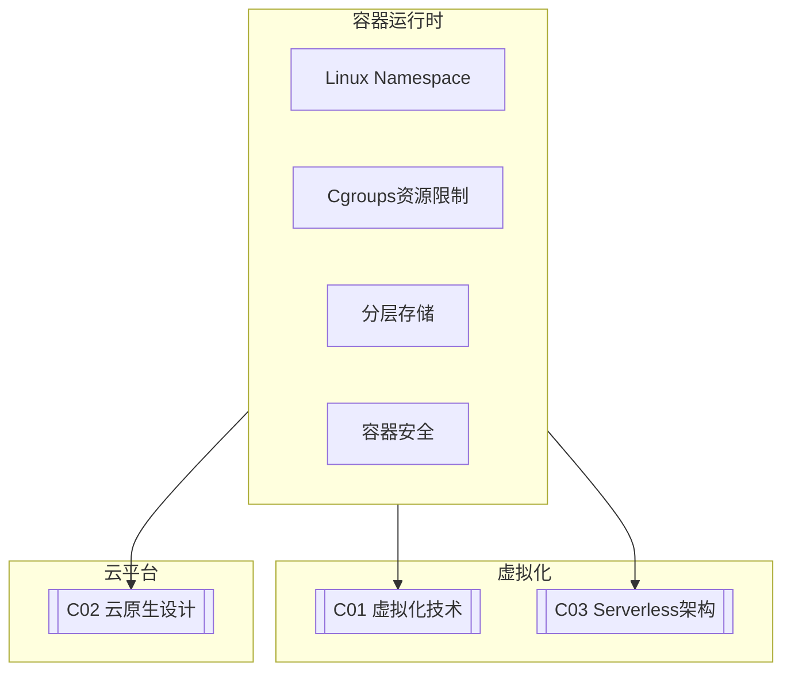

# C02 Container Runtimes

**所属子领域**: [B09_Virtualization](../README.md)  
**创建日期**: 2026-01-30  
**最后更新**: 2026-01-30

## 📋 主题定位

容器运行时（Container Runtime）是容器化技术的核心组件，负责容器的创建、运行、资源隔离和管理。从早期的LXC到Docker的革命性创新，再到OCI（Open Container Initiative）标准的建立和containerd的崛起，容器技术已成为现代应用部署的标准范式。

容器与虚拟机不同，它共享宿主机的操作系统内核，通过Linux Namespace实现进程隔离，通过Cgroups实现资源限制，通过UnionFS实现分层存储。这种轻量级虚拟化方式使得容器启动更快、资源占用更少、部署密度更高，完美契合云原生应用的需求。

本专题深入探讨容器运行时的原理、OCI标准、主流运行时实现以及安全实践，为构建高效、安全的容器基础设施提供全面指导。

## 🎯 核心概念

### Linux容器基础

**Namespace（命名空间）**: Linux内核提供的资源隔离机制

| Namespace | 隔离资源 | 内核版本 |
|-----------|---------|---------|
| **PID** | 进程ID | 2.6.24 |
| **Network** | 网络设备、端口 | 2.6.29 |
| **Mount** | 文件系统挂载点 | 2.4.19 |
| **IPC** | 进程间通信 | 2.6.19 |
| **UTS** | 主机名和域名 | 2.6.19 |
| **User** | 用户和组ID | 3.8 |
| **Cgroup** | Cgroup根目录 | 4.6 |
| **Time** | 系统时钟 | 5.6 |

**Cgroups（控制组）**: 资源限制和统计机制

| 子系统 | 功能 | 说明 |
|-------|------|------|
| **cpu** | CPU时间分配 | shares, quota, period |
| **memory** | 内存限制 | limit, swap, swappiness |
| **blkio** | 块设备I/O | throttle.read/write_bps_device |
| **pids** | 进程数量限制 | max |
| **devices** | 设备访问控制 | allow/deny |
| **net_cls** | 网络分类 | classid |

### 容器运行时架构

```
┌─────────────────────────────────────────────────────────────────────────┐
│                       容器运行时架构                                     │
├─────────────────────────────────────────────────────────────────────────┤
│                                                                         │
│  ┌─────────────────────────────────────────────────────────────────┐   │
│  │                    容器编排层 (Orchestration)                      │   │
│  │                                                                 │   │
│  │  ┌─────────────┐  ┌─────────────┐  ┌─────────────────────────┐ │   │
│  │  │  Kubernetes │  │   Docker    │  │    containerd/cri-o     │ │   │
│  │  │  (K8s)      │  │   Compose   │  │    (CRI实现)            │ │   │
│  │  │             │  │             │  │                         │ │   │
│  │  │  Pod调度    │  │  单主机编排  │  │  与Kubelet集成           │ │   │
│  │  │  服务发现   │  │  多容器应用  │  │                         │ │   │
│  │  └──────┬──────┘  └──────┬──────┘  └───────────┬─────────────┘ │   │
│  │         └─────────────────┴─────────────────────┘               │   │
│  │                              │                                  │   │
│  │                    CRI (Container Runtime Interface)            │   │
│  │                              │                                  │   │
│  └──────────────────────────────┼──────────────────────────────────┘   │
│                                 │                                       │
│  ┌──────────────────────────────┼──────────────────────────────────┐   │
│  │                    高层运行时 (High-Level Runtime)                 │   │
│  │                              │                                   │   │
│  │  ┌───────────────────────────┴───────────────────────────────┐  │   │
│  │  │                      containerd                            │  │   │
│  │  │                                                            │  │   │
│  │  │  • 镜像管理 (pull/push/remove)                             │  │   │
│  │  │  • 容器生命周期 (create/start/stop/delete)                 │  │   │
│  │  │  • 快照管理 (快照驱动: overlayfs/zfs/btrfs)                 │  │   │
│  │  │  • 网络管理 (CNI集成)                                       │  │   │
│  │  │  • gRPC API                                                │  │   │
│  │  │                                                            │  │   │
│  │  │  架构: 守护进程 + containerd-shim (每个容器一个)             │  │   │
│  │  │                                                            │  │   │
│  │  └───────────────────────────┬───────────────────────────────┘  │   │
│  │                              │                                   │   │
│  │  ┌───────────────────────────┴───────────────────────────────┐  │   │
│  │  │                      Docker Daemon (旧架构)                  │  │   │
│  │  │  (现代Docker使用containerd作为运行时)                        │  │   │
│  │  └───────────────────────────────────────────────────────────┘  │   │
│  │                              │                                   │   │
│  └──────────────────────────────┼──────────────────────────────────┘   │
│                                 │                                       │
│  ┌──────────────────────────────┼──────────────────────────────────┐   │
│  │                    低层运行时 (Low-Level Runtime / OCI Runtime)    │   │
│  │                              │                                   │   │
│  │  ┌───────────────────────────┴───────────────────────────────┐  │   │
│  │  │                      runc (参考实现)                        │  │   │
│  │  │                                                            │  │   │
│  │  │  • OCI Runtime Spec 标准实现                               │  │   │
│  │  │  • 创建容器进程                                            │  │   │
│  │  │  • 设置Namespace和Cgroups                                  │  │   │
│  │  │  • 执行容器启动命令                                        │  │   │
│  │  │                                                            │  │   │
│  │  │  调用: runc create → runc start → runc delete              │  │   │
│  │  │                                                            │  │   │
│  │  └───────────────────────────────────────────────────────────┘  │   │
│  │                              │                                   │   │
│  │  ┌───────────────────────────┼───────────────────────────────┐  │   │
│  │  │         其他OCI运行时:     │                                │  │   │
│  │  │  ┌─────────┐ ┌─────────┐ │ ┌─────────┐ ┌────────────────┐ │  │   │
│  │  │  │  crun   │ │  kata   │ │ │ gVisor  │ │  Wasm runtime  │ │  │   │
│  │  │  │ (C写)   │ │ (轻量VM)│ │ │ (沙箱)  │ │  (wasmtime)    │ │  │   │
│  │  │  └─────────┘ └─────────┘ │ └─────────┘ └────────────────┘ │  │   │
│  │  └───────────────────────────┴───────────────────────────────┘  │   │
│  └──────────────────────────────────────────────────────────────────┘   │
│                                                                         │
└─────────────────────────────────────────────────────────────────────────┘
```

### OCI标准

```
┌─────────────────────────────────────────────────────────────────────────┐
│                       OCI (Open Container Initiative) 标准               │
├─────────────────────────────────────────────────────────────────────────┤
│                                                                         │
│  OCI Runtime Spec - 运行时规范                                           │
│  ┌─────────────────────────────────────────────────────────────────┐   │
│  │                                                                 │   │
│  │  config.json 示例:                                              │   │
│  │  {                                                              │   │
│  │    "ociVersion": "1.0.0",                                      │   │
│  │    "process": {                                                 │   │
│  │      "terminal": false,                                        │   │
│  │      "user": { "uid": 0, "gid": 0 },                           │   │
│  │      "args": ["sh"],                                           │   │
│  │      "env": ["PATH=/usr/local/sbin:/usr/local/bin..."]         │   │
│  │    },                                                           │   │
│  │    "root": { "path": "rootfs", "readonly": true },             │   │
│  │    "hostname": "container1",                                   │   │
│  │    "mounts": [                                                  │   │
│  │      { "destination": "/proc", "type": "proc", "source": "proc" }│   │
│  │    ],                                                           │   │
│  │    "linux": {                                                   │   │
│  │      "namespaces": [                                            │   │
│  │        { "type": "pid" },                                       │   │
│  │        { "type": "network" },                                   │   │
│  │        { "type": "mount" },                                     │   │
│  │        { "type": "ipc" },                                       │   │
│  │        { "type": "uts" }                                        │   │
│  │      ],                                                         │   │
│  │      "cgroupsPath": "/containerd/abc",                         │   │
│  │      "resources": {                                             │   │
│  │        "memory": { "limit": 104857600 },  # 100MB             │   │
│  │        "cpu": { "shares": 512 }                                │   │
│  │      },                                                         │   │
│  │      "seccomp": { ... }  # 系统调用过滤                        │   │
│  │    }                                                            │   │
│  │  }                                                              │   │
│  │                                                                 │   │
│  └─────────────────────────────────────────────────────────────────┘   │
│                                                                         │
│  OCI Image Spec - 镜像规范                                               │
│  ┌─────────────────────────────────────────────────────────────────┐   │
│  │                                                                 │   │
│  │  镜像结构:                                                      │   │
│  │                                                                 │   │
│  │  manifest.json ───→ config.json + layer.tar.gz layers          │   │
│  │                                                                 │   │
│  │  层级结构:                                                      │   │
│  │  ┌─────────────┐                                                │   │
│  │  │   Layer 3   │  ← 应用代码 (可写层)                           │   │
│  │  ├─────────────┤                                                │   │
│  │  │   Layer 2   │  ← 依赖库                                       │   │
│  │  ├─────────────┤                                                │   │
│  │  │   Layer 1   │  ← 基础系统                                     │   │
│  │  ├─────────────┤                                                │   │
│  │  │   Layer 0   │  ← 基础镜像 (alpine/ubuntu)                     │   │
│  │  └─────────────┘                                                │   │
│  │                                                                 │   │
│  │  UnionFS (overlay2):                                            │   │
│  │  lowerdir=Layer0:Layer1:Layer2, upperdir=Layer3, workdir=work  │   │
│  │                                                                 │   │
│  └─────────────────────────────────────────────────────────────────┘   │
│                                                                         │
│  OCI Distribution Spec - 分发规范                                        │
│  • 镜像仓库API标准 (Docker Registry API v2)                             │
│  • 支持内容寻址 (digest)                                                │
│  • 镜像签名和验证                                                       │
│                                                                         │
└─────────────────────────────────────────────────────────────────────────┘
```

## 🛠️ 技术实践

### 容器运行时部署

**1. containerd安装配置脚本**

```bash
#!/bin/bash
# containerd安装与配置脚本

set -e

VERSION=${1:-"1.7.11"}
ACTION=${2:-"install"}

echo "=== containerd 管理工具 ==="
echo "版本: $VERSION"
echo "操作: $ACTION"
echo ""

install_containerd() {
    echo "=== 安装containerd ==="
    
    # 下载containerd
    wget -q https://github.com/containerd/containerd/releases/download/v${VERSION}/containerd-${VERSION}-linux-amd64.tar.gz
    tar Cxzvf /usr/local containerd-${VERSION}-linux-amd64.tar.gz
    
    # 安装runc
    wget -q https://github.com/opencontainers/runc/releases/download/v1.1.10/runc.amd64
    install -m 755 runc.amd64 /usr/local/sbin/runc
    
    # 安装CNI插件
    wget -q https://github.com/containernetworking/plugins/releases/download/v1.3.0/cni-plugins-linux-amd64-v1.3.0.tgz
    mkdir -p /opt/cni/bin
    tar Cxzvf /opt/cni/bin cni-plugins-linux-amd64-v1.3.0.tgz
    
    # 创建systemd服务
    cat > /etc/systemd/system/containerd.service << 'EOF'
[Unit]
Description=containerd container runtime
Documentation=https://containerd.io
After=network.target

[Service]
ExecStartPre=-/sbin/modprobe overlay
ExecStart=/usr/local/bin/containerd
Restart=always
RestartSec=5
Delegate=yes
KillMode=process
OOMScoreAdjust=-999
LimitNOFILE=1048576
LimitNPROC=infinity
LimitCORE=infinity

[Install]
WantedBy=multi-user.target
EOF
    
    # 创建配置目录
    mkdir -p /etc/containerd
    
    # 生成默认配置
    containerd config default > /etc/containerd/config.toml
    
    # 配置镜像加速
    sed -i 's|registry\.docker\.io|docker.mirrors.ustc.edu.cn|g' /etc/containerd/config.toml
    
    # 启用systemd cgroup
    sed -i 's/SystemdCgroup = false/SystemdCgroup = true/g' /etc/containerd/config.toml
    
    # 启动服务
    systemctl daemon-reload
    systemctl enable containerd
    systemctl start containerd
    
    # 安装ctr客户端工具 (nerdctl)
    wget -q https://github.com/containerd/nerdctl/releases/download/v1.7.0/nerdctl-1.7.0-linux-amd64.tar.gz
    tar Cxzvf /usr/local/bin nerdctl-1.7.0-linux-amd64.tar.gz
    
    # 安装buildkit
    wget -q https://github.com/moby/buildkit/releases/download/v0.12.4/buildkit-v0.12.4.linux-amd64.tar.gz
    tar Cxzvf /usr/local buildkit-v0.12.4.linux-amd64.tar.gz
    
    echo "✓ containerd安装完成"
    echo "  ctr version: $(ctr version | head -2)"
    echo "  nerdctl version: $(nerdctl version | head -2)"
}

# 配置镜像仓库
configure_registry() {
    echo "=== 配置镜像仓库 ==="
    
    cat >> /etc/containerd/config.toml << 'EOF'

[plugins."io.containerd.grpc.v1.cri".registry.mirrors]
  [plugins."io.containerd.grpc.v1.cri".registry.mirrors."docker.io"]
    endpoint = ["https://docker.mirrors.ustc.edu.cn", "https://hub-mirror.c.163.com"]
  [plugins."io.containerd.grpc.v1.cri".registry.mirrors."gcr.io"]
    endpoint = ["https://gcr.mirrors.ustc.edu.cn"]
  [plugins."io.containerd.grpc.v1.cri".registry.mirrors."k8s.gcr.io"]
    endpoint = ["https://registry.aliyuncs.com/google_containers"]

[plugins."io.containerd.grpc.v1.cri".registry.configs]
  [plugins."io.containerd.grpc.v1.cri".registry.configs."harbor.example.com".tls]
    insecure_skip_verify = true
EOF
    
    systemctl restart containerd
    echo "✓ 镜像仓库配置完成"
}

# 性能优化
optimize_containerd() {
    echo "=== 性能优化 ==="
    
    # 配置snapshotter
    sed -i 's/snapshotter = "overlayfs"/snapshotter = "overlayfs"/g' /etc/containerd/config.toml
    
    # 配置垃圾回收
    cat >> /etc/containerd/config.toml << 'EOF'

[gc]
  # 保留最近7天的镜像
  default_policy = "7d"
EOF
    
    # 启用无根容器支持 (可选)
    # modprobe ip_tables
    # sysctl -w net.ipv4.ip_forward=1
    
    echo "✓ 优化配置完成"
}

# 基本操作示例
container_ops() {
    echo "=== 容器基本操作 ==="
    
    # 拉取镜像
    echo "拉取nginx镜像..."
    ctr images pull docker.io/library/nginx:latest
    
    # 运行容器
    echo "运行容器..."
    ctr run -d docker.io/library/nginx:latest webserver
    
    # 查看容器
    echo "运行中的容器:"
    ctr containers list
    
    # 停止容器
    echo "停止容器..."
    ctr task kill -9 webserver
    ctr containers delete webserver
    
    echo "✓ 操作演示完成"
}

# 显示状态
show_status() {
    echo "=== containerd状态 ==="
    
    systemctl status containerd --no-pager || true
    
    echo ""
    echo "版本信息:"
    containerd --version
    runc --version
    
    echo ""
    echo "命名空间:"
    ctr namespaces list
    
    echo ""
    echo "镜像列表:"
    ctr images list | head -10 || true
}

# 主逻辑
case "$ACTION" in
    install)
        install_containerd
        configure_registry
        optimize_containerd
        show_status
        ;;
    configure)
        configure_registry
        ;;
    optimize)
        optimize_containerd
        ;;
    demo)
        container_ops
        ;;
    status)
        show_status
        ;;
    *)
        echo "用法: $0 [version] <action>"
        echo ""
        echo "Actions:"
        echo "  install    - 安装containerd"
        echo "  configure  - 配置镜像仓库"
        echo "  optimize   - 性能优化"
        echo "  demo       - 运行演示"
        echo "  status     - 显示状态"
        ;;
esac
```

### 容器安全实践

**2. 容器安全扫描与加固脚本**

```bash
#!/bin/bash
# 容器安全扫描与加固工具

set -e

IMAGE=${1:-""}
CONTAINER=${2:-""}

echo "=== 容器安全扫描工具 ==="
echo ""

# 镜像安全扫描
scan_image() {
    local image=$1
    
    echo "=== 扫描镜像: $image ==="
    
    # 使用Trivy扫描漏洞
    if command -v trivy &> /dev/null; then
        echo "使用Trivy扫描..."
        trivy image --severity HIGH,CRITICAL $image
    else
        echo "Trivy未安装，跳过漏洞扫描"
    fi
    
    # 使用docker-bench-security检查配置
    if command -v docker-bench-security &> /dev/null; then
        echo ""
        echo "运行Docker Bench Security..."
        docker-bench-security
    fi
    
    # 分析镜像层
    echo ""
    echo "镜像历史 (检查敏感信息):"
    docker history $image | head -20
}

# 运行时安全检查
check_runtime() {
    echo "=== 运行时安全检查 ==="
    
    # 检查特权容器
    echo "特权容器:"
    docker ps -q | while read container; do
        privileged=$(docker inspect --format='{{.HostConfig.Privileged}}' $container)
        if [ "$privileged" = "true" ]; then
            name=$(docker inspect --format='{{.Name}}' $container)
            echo "  WARNING: $name 以特权模式运行"
        fi
    done
    
    # 检查挂载敏感目录
    echo ""
    echo "挂载敏感目录的容器:"
    docker ps -q | while read container; do
        mounts=$(docker inspect --format='{{range .Mounts}}{{if eq .Source "/"}}{{.Destination}}{{end}}{{end}}' $container)
        if [ -n "$mounts" ]; then
            name=$(docker inspect --format='{{.Name}}' $container)
            echo "  WARNING: $name 挂载了根目录"
        fi
    done
    
    # 检查root用户运行
    echo ""
    echo "以root运行的容器:"
    docker ps -q | while read container; do
        user=$(docker inspect --format='{{.Config.User}}' $container)
        if [ -z "$user" ] || [ "$user" = "root" ]; then
            name=$(docker inspect --format='{{.Name}}' $container)
            echo "  $name (User: ${user:-root})"
        fi
    done
}

# 容器加固配置示例
harden_container() {
    echo "=== 容器加固运行示例 ==="
    
    docker run -d \
        --name hardened-app \
        --read-only \                           # 只读根文件系统
        --tmpfs /tmp:noexec,nosuid,size=100m \  # tmpfs挂载
        --security-opt=no-new-privileges:true \ # 禁止提升权限
        --security-opt seccomp=default.json \   # seccomp配置
        --cap-drop ALL \                        # 移除所有capabilities
        --cap-add CHOWN \                       # 只添加必要的cap
        --memory 512m \                         # 内存限制
        --memory-swap 512m \                    # 禁用swap
        --cpus 1.0 \                            # CPU限制
        --pids-limit 100 \                      # 进程数限制
        --restart unless-stopped \
        nginx:alpine
    
    echo "✓ 加固容器已启动"
}

# 生成seccomp配置
generate_seccomp() {
    echo "=== 生成seccomp配置 ==="
    
    cat > default-seccomp.json << 'EOF'
{
  "defaultAction": "SCMP_ACT_ERRNO",
  "architectures": ["SCMP_ARCH_X86_64", "SCMP_ARCH_X86"],
  "syscalls": [
    {
      "names": [
        "accept", "accept4", "access", "adjtimex", "alarm", "bind",
        "brk", "capget", "capset", "chdir", "chmod", "chown",
        "clock_getres", "clock_gettime", "clock_nanosleep",
        "close", "connect", "copy_file_range", "creat", "dup",
        "dup2", "dup3", "epoll_create", "epoll_create1",
        "epoll_ctl", "epoll_pwait", "epoll_wait", "eventfd",
        "eventfd2", "execve", "execveat", "exit", "exit_group",
        "faccessat", "fadvise64", "fadvise64_64", "fallocate",
        "fanotify_mark", "fchdir", "fchmod", "fchmodat",
        "fchown", "fchownat", "fcntl", "fdatasync", "fgetxattr",
        "flistxattr", "flock", "fork", "fremovexattr",
        "fsetxattr", "fstat", "fstat64", "fstatat64", "fstatfs",
        "fstatfs64", "fsync", "ftruncate", "ftruncate64",
        "futex", "getcpu", "getcwd", "getdents", "getdents64",
        "getegid", "getegid32", "geteuid", "geteuid32",
        "getgid", "getgid32", "getgroups", "getgroups32",
        "getitimer", "getpeername", "getpgid", "getpgrp",
        "getpid", "getppid", "getpriority", "getrandom",
        "getresgid", "getresgid32", "getresuid", "getresuid32",
        "getrlimit", "get_robust_list", "getrusage", "getsid",
        "getsockname", "getsockopt", "get_thread_area",
        "gettid", "gettimeofday", "getuid", "getuid32",
        "getxattr", "inotify_add_watch", "inotify_init",
        "inotify_init1", "inotify_rm_watch", "io_cancel",
        "ioctl", "io_destroy", "io_getevents", "io_setup",
        "io_submit", "ioprio_get", "ioprio_set", "kill",
        "lchown", "lgetxattr", "link", "linkat", "listen",
        "listxattr", "llistxattr", "lremovexattr", "lseek",
        "lsetxattr", "lstat", "lstat64", "madvise", "memfd_create",
        "mincore", "mkdir", "mkdirat", "mknod", "mknodat",
        "mlock", "mlock2", "mlockall", "mmap", "mmap2",
        "mprotect", "mq_getsetattr", "mq_notify", "mq_open",
        "mq_timedreceive", "mq_timedsend", "mq_unlink",
        "mremap", "msgctl", "msgget", "msgrcv", "msgsnd",
        "msync", "munlock", "munlockall", "munmap", "nanosleep",
        "newfstatat", "open", "openat", "pause", "pipe",
        "pipe2", "poll", "ppoll", "prctl", "pread64",
        "preadv", "prlimit64", "pselect6", "pwrite64",
        "pwritev", "read", "readahead", "readdir", "readlink",
        "readlinkat", "readv", "recv", "recvfrom", "recvmmsg",
        "recvmsg", "remap_file_pages", "removexattr", "rename",
        "renameat", "renameat2", "restart_syscall", "rmdir",
        "rt_sigaction", "rt_sigpending", "rt_sigprocmask",
        "rt_sigqueueinfo", "rt_sigreturn", "rt_sigsuspend",
        "rt_sigtimedwait", "rt_tgsigqueueinfo", "sched_getaffinity",
        "sched_getattr", "sched_getparam", "sched_get_priority_max",
        "sched_get_priority_min", "sched_getscheduler",
        "sched_rr_get_interval", "sched_setaffinity",
        "sched_setattr", "sched_setparam", "sched_setscheduler",
        "sched_yield", "select", "semctl", "semget", "semop",
        "semtimedop", "send", "sendfile", "sendfile64",
        "sendmmsg", "sendmsg", "sendto", "setfsgid", "setfsgid32",
        "setfsuid", "setfsuid32", "setgid", "setgid32",
        "setgroups", "setgroups32", "setitimer", "setpgid",
        "setpriority", "setregid", "setregid32", "setresgid",
        "setresgid32", "setresuid", "setresuid32", "setreuid",
        "setreuid32", "setrlimit", "set_robust_list", "setsid",
        "setsockopt", "set_thread_area", "set_tid_address",
        "setuid", "setuid32", "setxattr", "shmat", "shmctl",
        "shmdt", "shmget", "shutdown", "sigaltstack", "signalfd",
        "signalfd4", "sigpending", "sigprocmask", "sigreturn",
        "socket", "socketcall", "socketpair", "splice", "stat",
        "stat64", "statfs", "statfs64", "statx", "symlink",
        "symlinkat", "sync", "sync_file_range", "syncfs",
        "sysinfo", "tee", "tgkill", "time", "timer_create",
        "timer_delete", "timer_getoverrun", "timer_gettime",
        "timer_settime", "timerfd_create", "timerfd_gettime",
        "timerfd_settime", "times", "tkill", "truncate",
        "truncate64", "ugetrlimit", "umask", "uname",
        "unlink", "unlinkat", "utime", "utimensat", "utimes",
        "vfork", "wait4", "waitid", "waitpid", "write", "writev"
      ],
      "action": "SCMP_ACT_ALLOW"
    }
  ]
}
EOF
    
    echo "✓ seccomp配置已生成: default-seccomp.json"
}

# 主逻辑
if [ -n "$IMAGE" ]; then
    scan_image $IMAGE
elif [ -n "$CONTAINER" ]; then
    check_runtime
else
    echo "用法: $0 <image> [container]"
    echo ""
    echo "示例:"
    echo "  $0 nginx:latest              # 扫描镜像"
    echo "  $0 "" mycontainer            # 检查运行时"
    echo "  $0 "" ""                     # 显示帮助"
    echo ""
    echo "其他功能:"
    echo "  harden    - 运行加固容器示例"
    echo "  seccomp   - 生成seccomp配置"
fi

case "$IMAGE" in
    harden)
        harden_container
        ;;
    seccomp)
        generate_seccomp
        ;;
esac
```

### 容器运行时对比分析

```python
#!/usr/bin/env python3
"""
容器运行时对比分析
分析不同运行时的性能和资源占用
"""

import subprocess
import json
import time
from dataclasses import dataclass
from typing import Dict, List


@dataclass
class RuntimeBenchmark:
    """运行时基准测试结果"""
    runtime: str
    cold_start_ms: float
    memory_mb: float
    cpu_percent: float
    image_size_mb: float


class ContainerRuntimeBenchmark:
    """容器运行时基准测试"""
    
    RUNTIMES = ['docker', 'podman', 'containerd', 'crun']
    TEST_IMAGE = 'alpine:latest'
    
    def measure_cold_start(self, runtime: str) -> float:
        """测量冷启动时间"""
        start = time.time()
        
        if runtime == 'docker':
            cmd = ['docker', 'run', '--rm', self.TEST_IMAGE, 'echo', 'hello']
        elif runtime == 'podman':
            cmd = ['podman', 'run', '--rm', self.TEST_IMAGE, 'echo', 'hello']
        elif runtime == 'containerd':
            cmd = ['ctr', 'run', '--rm', self.TEST_IMAGE, 'test', 'echo', 'hello']
        else:
            return 0.0
        
        try:
            subprocess.run(cmd, capture_output=True, timeout=30)
            return (time.time() - start) * 1000
        except:
            return 0.0
    
    def get_memory_usage(self, runtime: str) -> Dict[str, float]:
        """获取内存使用情况"""
        result = {'daemon_mb': 0, 'container_mb': 0}
        
        try:
            if runtime == 'docker':
                # Docker daemon内存
                output = subprocess.check_output(
                    ['docker', 'system', 'df', '-v'],
                    text=True
                )
                # 解析输出...
            
            elif runtime == 'containerd':
                # containerd内存
                output = subprocess.check_output(
                    ['ps', '-o', 'rss=', '-C', 'containerd'],
                    text=True
                )
                result['daemon_mb'] = int(output.strip()) / 1024
        
        except:
            pass
        
        return result
    
    def compare_runtimes(self) -> List[RuntimeBenchmark]:
        """对比所有运行时"""
        results = []
        
        for runtime in self.RUNTIMES:
            print(f"测试 {runtime}...")
            
            cold_start = self.measure_cold_start(runtime)
            memory = self.get_memory_usage(runtime)
            
            benchmark = RuntimeBenchmark(
                runtime=runtime,
                cold_start_ms=cold_start,
                memory_mb=memory.get('daemon_mb', 0),
                cpu_percent=0.0,
                image_size_mb=0.0
            )
            results.append(benchmark)
        
        return results
    
    def generate_report(self, results: List[RuntimeBenchmark]):
        """生成对比报告"""
        print("\n" + "="*60)
        print("容器运行时对比报告")
        print("="*60)
        
        print(f"\n{'运行时':<15} {'冷启动(ms)':<15} {'内存(MB)':<15}")
        print("-"*60)
        
        for r in results:
            print(f"{r.runtime:<15} {r.cold_start_ms:<15.1f} {r.memory_mb:<15.1f}")
        
        # 找出最佳
        fastest = min(results, key=lambda x: x.cold_start_ms if x.cold_start_ms > 0 else float('inf'))
        lightest = min(results, key=lambda x: x.memory_mb if x.memory_mb > 0 else float('inf'))
        
        print("\n结论:")
        print(f"  最快冷启动: {fastest.runtime} ({fastest.cold_start_ms:.1f}ms)")
        print(f"  最小内存: {lightest.runtime} ({lightest.memory_mb:.1f}MB)")


if __name__ == '__main__':
    benchmark = ContainerRuntimeBenchmark()
    results = benchmark.compare_runtimes()
    benchmark.generate_report(results)
```

## 📚 资源索引

### 容器标准与规范

| 规范 | 说明 | 链接 |
|-----|------|------|
| **OCI Runtime Spec** | 运行时规范 | opencontainers.org |
| **OCI Image Spec** | 镜像规范 | opencontainers.org |
| **CRI** | 容器运行时接口 | kubernetes.io |
| **CNI** | 容器网络接口 | cni.dev |

### 容器运行时项目

| 运行时 | 类型 | 说明 |
|-------|------|------|
| **containerd** | 高层运行时 | CNCF毕业项目 |
| **runc** | 低层运行时 | OCI参考实现 |
| **crun** | 低层运行时 | C语言实现，更快 |
| **gVisor** | 安全运行时 | 用户态内核 |
| **Kata** | 安全运行时 | 轻量虚拟机 |
| **Wasmtime** | Wasm运行时 | WebAssembly容器 |

## 🔗 关联知识



## 💡 学习建议

### 入门路径

1. **基础概念**（1-2周）
   - Linux Namespace实验
   - Cgroups资源限制
   - UnionFS原理

2. **容器工具**（3-4周）
   - Docker/containerd使用
   - 镜像构建优化
   - 网络配置

3. **高级主题**（5-8周）
   - 自定义运行时
   - 安全加固
   - 与Kubernetes集成

---

*最后更新: 2026-01-30*  
*维护者: Infrastructure Team*
