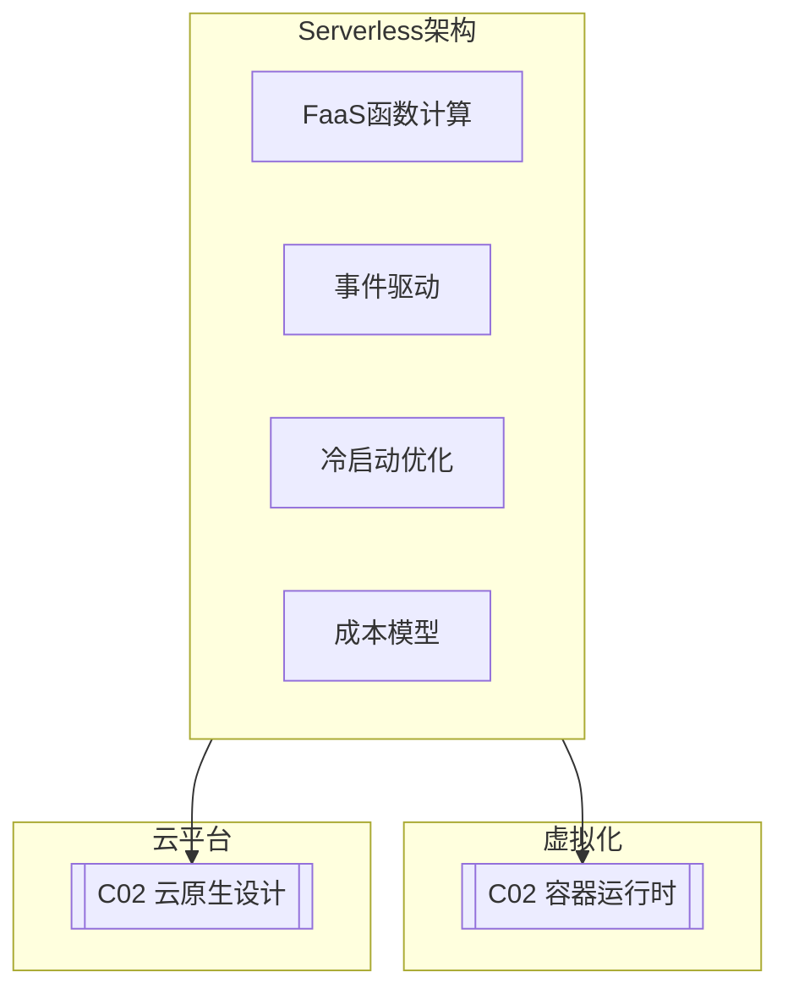

# C03 Serverless Architecture

**所属子领域**: [B09_Virtualization](../README.md)  
**创建日期**: 2026-01-30  
**最后更新**: 2026-01-30

## 📋 主题定位

Serverless（无服务器）架构是一种云计算执行模型，云提供商动态管理计算资源的分配，开发者只需关注业务代码，无需管理服务器基础设施。Serverless不仅代表技术实现（如函数计算），更是一种架构理念：按实际使用付费、自动扩缩容、事件驱动、快速部署。

从2014年AWS Lambda的发布，Serverless已发展成为一个完整的生态系统：函数即服务（FaaS）、后端即服务（BaaS）、Serverless容器、Serverless数据库等。在企业数字化转型的浪潮中，Serverless正成为构建敏捷、低成本、高弹性应用的首选架构。

本专题深入探讨Serverless架构的核心概念、实现技术、开源框架（如Knative、OpenFaaS）以及在生产环境的最佳实践。

## 🎯 核心概念

### Serverless定义与特征

**Serverless（无服务器）**: 一种云计算模型，云提供商完全管理底层基础设施，开发者以函数或事件处理单元的形式提交代码，平台自动处理资源的分配、扩展和计费。

**核心特征**:

| 特征 | 说明 | 优势 |
|-----|------|------|
| **无服务器管理** | 无需维护物理或虚拟服务器 | 降低运维成本 |
| **自动扩缩容** | 根据负载自动调整实例数量 | 应对流量高峰 |
| **按使用付费** | 仅为实际执行时间和资源付费 | 成本优化 |
| **事件驱动** | 由事件触发执行 | 松耦合架构 |
| **快速部署** | 代码变更秒级生效 | 加速交付 |

### Serverless架构模式

```
┌─────────────────────────────────────────────────────────────────────────┐
│                       Serverless架构模式                                 │
├─────────────────────────────────────────────────────────────────────────┤
│                                                                         │
│  模式1: 函数即服务 (FaaS)                                                 │
│  ┌─────────────────────────────────────────────────────────────────┐   │
│  │                                                                 │   │
│  │  事件源 ───→ 函数编排 ───→ 函数执行 ───→ 结果输出               │   │
│  │    │           引擎          环境                                 │   │
│  │    │                                                            │   │
│  │    ├─── HTTP/API Gateway                                        │   │
│  │    ├─── 定时触发 (Cron)                                         │   │
│  │    ├─── 消息队列 (SQS/Kafka)                                    │   │
│  │    ├─── 存储事件 (S3上传)                                       │   │
│  │    └─── 数据库变更 (CDC)                                        │   │
│  │                                                                 │   │
│  └─────────────────────────────────────────────────────────────────┘   │
│                                                                         │
│  模式2: 后端即服务 (BaaS)                                                 │
│  ┌─────────────────────────────────────────────────────────────────┐   │
│  │                                                                 │   │
│  │  客户端应用 ───→ 认证服务 (Cognito/Auth0)                        │   │
│  │       │         数据库 (DynamoDB/Firestore)                      │   │
│  │       │         存储 (S3/Cloud Storage)                          │   │
│  │       │         通知 (SNS/FCM)                                   │   │
│  │       │         ├──── 全托管服务，无需运维 ────┤                 │   │
│  │       │                                                         │   │
│  │       └──→ 少量FaaS处理业务逻辑                                 │   │
│  │                                                                 │   │
│  └─────────────────────────────────────────────────────────────────┘   │
│                                                                         │
│  模式3: Serverless容器                                                    │
│  ┌─────────────────────────────────────────────────────────────────┐   │
│  │                                                                 │   │
│  │  传统容器 ──── 改进 ──── Serverless容器                         │   │
│  │     │                    • 按请求计费                           │   │
│  │     │                    • 零实例时缩容到0                      │   │
│  │     │                    • 快速启动 (秒级/毫秒级)               │   │
│  │     │                    • 自动HTTPS                           │   │
│  │     │                    • 自定义运行时                         │   │
│  │     │                                                           │   │
│  │  持续运行              有请求时才运行                           │   │
│  │  (即使空闲也付费)      (空闲时0成本)                            │   │
│  │                                                                 │   │
│  │  代表: Google Cloud Run, AWS App Runner, Knative               │   │
│  │                                                                 │   │
│  └─────────────────────────────────────────────────────────────────┘   │
│                                                                         │
│  模式4: Serverless工作流                                                  │
│  ┌─────────────────────────────────────────────────────────────────┐   │
│  │                                                                 │   │
│  │  Step Functions / Logic Apps / Durable Functions               │   │
│  │                                                                 │   │
│  │  可视化编排复杂业务流程                                          │   │
│  │  • 顺序执行                                                      │   │
│  │  • 并行分支                                                      │   │
│  │  • 条件判断                                                      │   │
│  │  • 错误重试                                                      │   │
│  │  • 人工审批                                                      │   │
│  │                                                                 │   │
│  └─────────────────────────────────────────────────────────────────┘   │
│                                                                         │
└─────────────────────────────────────────────────────────────────────────┘
```

### Serverless平台对比

| 平台 | 类型 | 冷启动 | 运行时间限制 | 并发限制 | 特色功能 |
|-----|------|-------|-------------|---------|---------|
| **AWS Lambda** | 公有云 | 100-1000ms | 15分钟 | 1000 | 最成熟生态 |
| **Azure Functions** | 公有云 | 100-500ms | 10分钟(消费级) | 200 | 与Azure集成 |
| **GCP Cloud Functions** | 公有云 | 100-500ms | 60分钟 | 1000 | 与GCP集成 |
| **Cloudflare Workers** | Edge | 0ms | 50ms CPU | 无限制 | 全球边缘部署 |
| **Knative** | 开源 | 100ms-秒级 | 无限制 | 可配置 | K8s原生 |
| **OpenFaaS** | 开源 | 100ms-秒级 | 可配置 | 可配置 | 简单易用 |

### Serverless冷启动问题

```
┌─────────────────────────────────────────────────────────────────────────┐
│                       Serverless冷启动优化                               │
├─────────────────────────────────────────────────────────────────────────┤
│                                                                         │
│  冷启动流程 (以AWS Lambda为例):                                          │
│                                                                         │
│  请求到达 ──→ 创建执行环境 ──→ 下载代码 ──→ 启动运行时 ──→ 执行函数   │
│    │              │              │             │             │          │
│    │           ~100ms         ~500ms        ~200ms       实际执行      │
│    │                                                           │        │
│    └──────────────────── 总延迟: ~800ms-2s ─────────────────────┘        │
│                                                                         │
│  优化策略:                                                               │
│  ┌─────────────────────────────────────────────────────────────────┐   │
│  │                                                                 │   │
│  │  1. 预置并发 (Provisioned Concurrency)                          │   │
│  │     • 保持指定数量的函数实例热启动                               │   │
│  │     • 适合关键路径API                                           │   │
│  │     • 成本: 预置实例按运行时间计费                               │   │
│  │                                                                 │   │
│  │  2. 单并发执行 (Reserved Concurrency)                           │   │
│  │     • 限制函数并发，保证单个实例不超时                           │   │
│  │     • 避免过载导致冷启动激增                                     │   │
│  │                                                                 │   │
│  │  3. 运行时优化                                                    │   │
│  │     • 选择启动更快的运行时 (Node.js > Java)                      │   │
│  │     • 精简依赖包大小                                             │   │
│  │     • 使用Lambda Layer复用依赖                                   │   │
│  │     • 延迟初始化 (延迟加载大对象)                                │   │
│  │                                                                 │   │
│  │  4. 架构优化                                                      │   │
│  │     • 使用API Gateway缓存                                        │   │
│  │     • 异步处理非关键路径                                         │   │
│  │     • 使用Step Functions编排                                     │   │
│  │     • 就近部署 (Edge Computing)                                  │   │
│  │                                                                 │   │
│  │  5. 监控告警                                                      │   │
│  │     • 追踪冷启动指标                                             │   │
│  │     • 设置延迟告警阈值                                           │   │
│  │     • 分析冷启动模式                                             │   │
│  │                                                                 │   │
│  └─────────────────────────────────────────────────────────────────┘   │
│                                                                         │
│  不同运行时冷启动时间对比:                                                │
│  ┌─────────────┬─────────────┬─────────────┬─────────────┐             │
│  │   Python    │   Node.js   │    Go       │    Java     │             │
│  │   ~100ms    │   ~150ms    │   ~200ms    │   ~3-5s     │             │
│  │  (最快)     │             │             │  (JVM启动)  │             │
│  └─────────────┴─────────────┴─────────────┴─────────────┘             │
│                                                                         │
└─────────────────────────────────────────────────────────────────────────┘
```

## 🛠️ 技术实践

### Knative部署

**1. Knative安装配置脚本**

```bash
#!/bin/bash
# Knative Serverless平台安装脚本
# 基于Kubernetes

set -e

VERSION=${1:-"1.12.0"}
ACTION=${2:-"install"}

echo "=== Knative Serverless平台管理 ==="
echo "版本: $VERSION"
echo "操作: $ACTION"
echo ""

# 检查Kubernetes集群
check_k8s() {
    if ! command -v kubectl &> /dev/null; then
        echo "错误: kubectl未安装"
        exit 1
    fi
    
    if ! kubectl cluster-info &> /dev/null; then
        echo "错误: 无法连接Kubernetes集群"
        exit 1
    fi
    
    echo "✓ Kubernetes集群已连接"
    kubectl version --short
}

# 安装Knative Serving
install_serving() {
    echo "=== 安装Knative Serving ==="
    
    # 安装CRDs
    kubectl apply -f https://github.com/knative/serving/releases/download/knative-v${VERSION}/serving-crds.yaml
    
    # 安装核心组件
    kubectl apply -f https://github.com/knative/serving/releases/download/knative-v${VERSION}/serving-core.yaml
    
    # 安装网络层 (Kourier)
    kubectl apply -f https://github.com/knative/net-kourier/releases/download/knative-v${VERSION}/kourier.yaml
    
    # 配置默认Ingress
    kubectl patch configmap/config-network \
        --namespace knative-serving \
        --type merge \
        --patch '{"data":{"ingress.class":"kourier.ingress.networking.knative.dev"}}'
    
    # 等待就绪
    echo "等待Knative Serving就绪..."
    kubectl wait --for=condition=Available deployment --all -n knative-serving --timeout=300s
    
    echo "✓ Knative Serving安装完成"
}

# 安装Knative Eventing
install_eventing() {
    echo ""
    echo "=== 安装Knative Eventing ==="
    
    kubectl apply -f https://github.com/knative/eventing/releases/download/knative-v${VERSION}/eventing-crds.yaml
    kubectl apply -f https://github.com/knative/eventing/releases/download/knative-v${VERSION}/eventing-core.yaml
    
    # 安装In-Memory Channel (测试用)
    kubectl apply -f https://github.com/knative/eventing/releases/download/knative-v${VERSION}/in-memory-channel.yaml
    
    # 安装Broker
    kubectl apply -f https://github.com/knative/eventing/releases/download/knative-v${VERSION}/mt-channel-broker.yaml
    
    echo "等待Knative Eventing就绪..."
    kubectl wait --for=condition=Available deployment --all -n knative-eventing --timeout=300s
    
    echo "✓ Knative Eventing安装完成"
}

# 配置DNS
configure_dns() {
    echo ""
    echo "=== 配置DNS ==="
    
    # 获取Kourier负载均衡器IP
    INGRESS_IP=$(kubectl get service kourier -n kourier-system -o jsonpath='{.status.loadBalancer.ingress[0].ip}')
    
    if [ -n "$INGRESS_IP" ]; then
        echo "Ingress IP: $INGRESS_IP"
        echo "配置通配符DNS: *.knative.example.com → $INGRESS_IP"
        
        # 配置默认域名
        kubectl patch configmap/config-domain \
            --namespace knative-serving \
            --type merge \
            --patch '{"data":{"knative.example.com":""}}'
    else
        echo "使用Magic DNS (sslip.io)"
        kubectl apply -f https://github.com/knative/serving/releases/download/knative-v${VERSION}/serving-default-domain.yaml
    fi
}

# 安装Knative CLI (kn)
install_cli() {
    echo ""
    echo "=== 安装Knative CLI ==="
    
    wget -q https://github.com/knative/client/releases/download/knative-v${VERSION}/kn-linux-amd64
    chmod +x kn-linux-amd64
    mv kn-linux-amd64 /usr/local/bin/kn
    
    echo "✓ kn CLI安装完成"
    kn version
}

# 部署示例应用
deploy_demo() {
    echo ""
    echo "=== 部署示例服务 ==="
    
    # 创建Hello World服务
    cat << 'EOF' | kubectl apply -f -
apiVersion: serving.knative.dev/v1
kind: Service
metadata:
  name: hello
  namespace: default
spec:
  template:
    spec:
      containers:
        - image: gcr.io/knative-samples/helloworld-go
          ports:
            - containerPort: 8080
          env:
            - name: TARGET
              value: "Knative"
EOF
    
    echo "等待服务就绪..."
    kubectl wait ksvc/hello --all --timeout=-1s --for=condition=Ready
    
    echo ""
    echo "服务URL:"
    kubectl get ksvc hello -o jsonpath='{.status.url}'
    echo ""
    
    # 测试访问
    SERVICE_URL=$(kubectl get ksvc hello -o jsonpath='{.status.url}')
    echo ""
    echo "测试访问:"
    curl -s $SERVICE_URL || echo "(需要配置DNS后才能访问)"
}

# 监控安装
install_monitoring() {
    echo ""
    echo "=== 安装监控组件 ==="
    
    # Prometheus + Grafana
    kubectl apply -f https://github.com/knative/serving/releases/download/knative-v${VERSION}/monitoring-core.yaml
    
    echo "✓ 监控组件安装完成"
}

# 卸载
uninstall() {
    echo "=== 卸载Knative ==="
    
    kubectl delete -f https://github.com/knative/eventing/releases/download/knative-v${VERSION}/eventing-core.yaml --ignore-not-found=true
    kubectl delete -f https://github.com/knative/eventing/releases/download/knative-v${VERSION}/eventing-crds.yaml --ignore-not-found=true
    kubectl delete -f https://github.com/knative/serving/releases/download/knative-v${VERSION}/serving-core.yaml --ignore-not-found=true
    kubectl delete -f https://github.com/knative/serving/releases/download/knative-v${VERSION}/serving-crds.yaml --ignore-not-found=true
    kubectl delete -f https://github.com/knative/net-kourier/releases/download/knative-v${VERSION}/kourier.yaml --ignore-not-found=true
    
    echo "✓ Knative已卸载"
}

# 显示状态
show_status() {
    echo "=== Knative状态 ==="
    
    echo ""
    echo "Knative Serving Pods:"
    kubectl get pods -n knative-serving
    
    echo ""
    echo "Knative Eventing Pods:"
    kubectl get pods -n knative-eventing 2>/dev/null || echo "Eventing未安装"
    
    echo ""
    echo "服务列表:"
    kubectl get ksvc --all-namespaces 2>/dev/null || echo "无服务"
}

# 主逻辑
case "$ACTION" in
    install)
        check_k8s
        install_serving
        install_eventing
        configure_dns
        install_cli
        show_status
        echo ""
        echo "=== Knative安装完成 ==="
        echo "使用 'kn' 命令管理服务"
        echo "使用 'kubectl get ksvc' 查看服务"
        ;;
    demo)
        check_k8s
        deploy_demo
        ;;
    monitoring)
        install_monitoring
        ;;
    status)
        show_status
        ;;
    uninstall)
        uninstall
        ;;
    *)
        echo "用法: $0 [version] <action>"
        echo ""
        echo "Actions:"
        echo "  install     - 安装Knative"
        echo "  demo        - 部署示例服务"
        echo "  monitoring  - 安装监控"
        echo "  status      - 显示状态"
        echo "  uninstall   - 卸载Knative"
        ;;
esac
```

### Serverless函数开发

**2. OpenFaaS函数开发示例**

```python
#!/usr/bin/env python3
"""
OpenFaaS函数示例
演示Serverless函数开发模式
"""

import json
import os
import time
from datetime import datetime


def handle(event, context):
    """
    OpenFaaS函数入口
    
    Args:
        event: 请求对象，包含body, headers, method, query等
        context: 上下文对象，包含function_name, memory_limit等
    
    Returns:
        响应对象或字符串
    """
    
    # 解析请求
    if event.body:
        body = json.loads(event.body)
    else:
        body = {}
    
    # 获取调用信息
    method = event.method
    path = event.path
    
    # 处理逻辑
    start_time = time.time()
    
    # 示例: 数据处理
    result = process_data(body)
    
    # 构建响应
    response = {
        'statusCode': 200,
        'body': json.dumps({
            'result': result,
            'processed_at': datetime.now().isoformat(),
            'execution_time_ms': round((time.time() - start_time) * 1000, 2),
            'function_name': context.function_name,
            'memory_limit': context.memory_limit
        }),
        'headers': {
            'Content-Type': 'application/json'
        }
    }
    
    return response


def process_data(data):
    """
    业务逻辑处理
    """
    # 示例: 数据转换
    if not data:
        return {'message': 'No data provided'}
    
    # 处理逻辑...
    processed = {
        'input_size': len(str(data)),
        'processed': True,
        'items_count': len(data) if isinstance(data, list) else 1
    }
    
    return processed


# 本地测试
if __name__ == '__main__':
    # 模拟OpenFaaS事件和上下文
    class MockEvent:
        def __init__(self):
            self.body = json.dumps({'name': 'test', 'value': 123})
            self.method = 'POST'
            self.path = '/'
            self.headers = {}
    
    class MockContext:
        def __init__(self):
            self.function_name = 'test-function'
            self.memory_limit = '128m'
    
    result = handle(MockEvent(), MockContext())
    print(json.dumps(result, indent=2))
```

```yaml
# stack.yml - OpenFaaS函数定义
version: 1.0
provider:
  name: openfaas
  gateway: http://localhost:8080

functions:
  data-processor:
    lang: python3
    handler: ./data-processor
    image: registry.example.com/data-processor:latest
    environment:
      write_debug: true
      combine_output: false
    secrets:
      - api-key
    labels:
      com.openfaas.scale.min: "1"
      com.openfaas.scale.max: "10"
    limits:
      memory: 256Mi
      cpu: "500m"
    requests:
      memory: 128Mi
      cpu: "100m"
  
  image-classifier:
    lang: python3-debian
    handler: ./image-classifier
    image: registry.example.com/image-classifier:latest
    environment:
      read_timeout: 30s
      write_timeout: 30s
      exec_timeout: 30s
    constraints:
      - "gpu=true"
```

### Serverless成本分析

**3. Serverless成本估算工具（Python）**

```python
#!/usr/bin/env python3
"""
Serverless成本估算工具
对比Serverless与传统部署成本
"""

from dataclasses import dataclass
from typing import Dict


@dataclass
class CostEstimate:
    """成本估算结果"""
    monthly_requests: int
    avg_duration_ms: float
    memory_mb: int
    
    # 计算结果
    lambda_cost: float
    ec2_cost: float
    k8s_cost: float


class ServerlessCostCalculator:
    """Serverless成本计算器"""
    
    # AWS Lambda定价 (us-east-1)
    LAMBDA_REQUEST_COST = 0.20 / 1_000_000  # $0.20 per 1M requests
    LAMBDA_DURATION_COST = 0.0000166667  # per GB-second
    
    # EC2定价 (t3.medium, on-demand)
    EC2_HOURLY_COST = 0.0416
    
    # EKS定价
    EKS_HOURLY_COST = 0.10
    
    def __init__(self):
        pass
    
    def calculate_lambda_cost(self, 
                               monthly_requests: int,
                               avg_duration_ms: float,
                               memory_mb: int) -> Dict:
        """计算Lambda成本"""
        
        # 免费额度
        free_requests = 1_000_000
        free_duration_gb_seconds = 400_000
        
        # 请求费用
        billable_requests = max(0, monthly_requests - free_requests)
        request_cost = billable_requests * self.LAMBDA_REQUEST_COST
        
        # 计算费用
        duration_seconds = avg_duration_ms / 1000
        gb_seconds = (memory_mb / 1024) * duration_seconds * monthly_requests
        billable_gb_seconds = max(0, gb_seconds - free_duration_gb_seconds)
        duration_cost = billable_gb_seconds * self.LAMBDA_DURATION_COST
        
        total_cost = request_cost + duration_cost
        
        return {
            'request_cost': round(request_cost, 2),
            'duration_cost': round(duration_cost, 2),
            'total': round(total_cost, 2),
            'per_million_requests': round(total_cost / (monthly_requests / 1_000_000), 2)
        }
    
    def calculate_ec2_cost(self, monthly_requests: int) -> Dict:
        """计算EC2成本 (假设需要24/7运行)"""
        hours_per_month = 730
        
        # 单实例
        single_instance_cost = self.EC2_HOUR_COST * hours_per_month
        
        # 高可用 (2实例 + 负载均衡器)
        ha_cost = single_instance_cost * 2 + 25  # $25 for ALB
        
        return {
            'single_instance': round(single_instance_cost, 2),
            'high_availability': round(ha_cost, 2)
        }
    
    def calculate_k8s_cost(self, monthly_requests: int) -> Dict:
        """计算Kubernetes成本"""
        hours_per_month = 730
        
        # EKS集群费用
        eks_cost = self.EKS_HOURLY_COST * hours_per_month
        
        # 工作节点 (3个t3.medium)
        node_cost = self.EC2_HOURLY_COST * 3 * hours_per_month
        
        total = eks_cost + node_cost
        
        return {
            'eks_control_plane': round(eks_cost, 2),
            'worker_nodes': round(node_cost, 2),
            'total': round(total, 2)
        }
    
    def compare(self, 
                monthly_requests: int,
                avg_duration_ms: float,
                memory_mb: int) -> Dict:
        """对比不同方案成本"""
        
        lambda_cost = self.calculate_lambda_cost(
            monthly_requests, avg_duration_ms, memory_mb
        )
        ec2_cost = self.calculate_ec2_cost(monthly_requests)
        k8s_cost = self.calculate_k8s_cost(monthly_requests)
        
        return {
            'scenario': {
                'monthly_requests': monthly_requests,
                'avg_duration_ms': avg_duration_ms,
                'memory_mb': memory_mb
            },
            'lambda': lambda_cost,
            'ec2': ec2_cost,
            'kubernetes': k8s_cost,
            'recommendation': self._get_recommendation(
                lambda_cost['total'],
                ec2_cost['high_availability'],
                k8s_cost['total']
            )
        }
    
    def _get_recommendation(self, 
                           lambda_cost: float,
                           ec2_cost: float,
                           k8s_cost: float) -> str:
        """给出建议"""
        costs = {
            'Lambda': lambda_cost,
            'EC2': ec2_cost,
            'Kubernetes': k8s_cost
        }
        
        cheapest = min(costs, key=costs.get)
        
        if lambda_cost < ec2_cost * 0.8:
            return f"Lambda最经济 (${lambda_cost}/月)，适合当前负载模式"
        elif k8s_cost < ec2_cost * 0.9:
            return f"Kubernetes成本更优 (${k8s_cost}/月)，适合长期稳定负载"
        else:
            return f"{cheapest}成本最低 (${costs[cheapest]}/月)"


# 使用示例
if __name__ == '__main__':
    import json
    
    calculator = ServerlessCostCalculator()
    
    # 场景1: 低频API (100万请求/月)
    print("场景1: 低频API (100万请求/月, 200ms, 512MB)")
    result1 = calculator.compare(1_000_000, 200, 512)
    print(json.dumps(result1, indent=2))
    
    print("\n" + "="*60 + "\n")
    
    # 场景2: 高频API (10亿请求/月)
    print("场景2: 高频API (10亿请求/月, 100ms, 1024MB)")
    result2 = calculator.compare(1_000_000_000, 100, 1024)
    print(json.dumps(result2, indent=2))
```

## 📚 资源索引

### Serverless平台

| 平台 | 类型 | 说明 |
|-----|------|------|
| **AWS Lambda** | 公有云 | 最成熟的FaaS |
| **Knative** | 开源 | Kubernetes原生 |
| **OpenFaaS** | 开源 | 简单易用 |
| **Kubeless** | 开源 | 纯K8s实现 |
| **Fission** | 开源 | 快速启动 |

### 学习资源

| 资源 | 类型 | 链接 |
|-----|------|------|
| **Serverless Framework** | 工具 | serverless.com |
| **CNCF Serverless WG** | 标准 | cncf.io |
| **Knative Docs** | 文档 | knative.dev |

## 🔗 关联知识



## 💡 学习建议

### 入门路径

1. **概念理解**（1-2周）
   - Serverless架构模式
   - 事件驱动编程
   - 成本模型理解

2. **平台实践**（3-4周）
   - AWS Lambda/GCF体验
   - Knative部署
   - OpenFaaS开发

3. **架构设计**（5-8周）
   - 复杂应用拆分
   - 状态管理策略
   - 可观测性建设

---

*最后更新: 2026-01-30*  
*维护者: Infrastructure Team*
