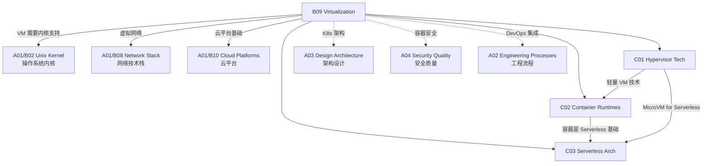

# B09 Virtualization

**所属领域**: [A01_Infrastructure](../readme.md)
**创建日期**: 2026-01-30
**最后更新**: 2026-01-30

## 📋 子领域定位

虚拟化技术是现代云计算的基石，通过抽象硬件资源实现更高的利用率、灵活性和隔离性。从早期的硬件仿真到现代的容器化和轻量级虚拟化，虚拟化技术不断演进以适应云原生、边缘计算和 Serverless 等新型计算范式。

本领域涵盖三大核心技术方向：Hypervisor 虚拟化（KVM/Xen/VMware）、容器运行时（containerd/runc/gVisor）和 Serverless 架构。随着安全容器（Kata Containers、gVisor）和 WebAssembly 的兴起，虚拟化正朝着更轻量、更安全、更快速的方向发展。

**核心关注点**：
- **Hypervisor 技术**: Type-1/Type-2 虚拟化、硬件辅助虚拟化 (VT-x/AMD-V)、SR-IOV
- **容器运行时**: OCI 规范、runc/crun、容器安全、gVisor/Kata 安全容器
- **Serverless 架构**: FaaS 平台、冷启动优化、事件驱动架构、边缘 Serverless

## 🗂️ 专项列表

### [C01. Hypervisor_Tech](C01_Hypervisor_Tech/README.md)

Hypervisor 是实现硬件虚拟化的核心软件层。本专项深入剖析 Type-1 (裸金属) 和 Type-2 (托管) 虚拟化架构，包括 Intel VT-x/AMD-V 硬件辅助虚拟化、内存虚拟化 (EPT/NPT)、I/O 虚拟化 (SR-IOV/VFIO) 和设备直通 (PCIe Passthrough)。涵盖 KVM/QEMU 架构、Xen 半虚拟化、VMware ESXi 企业特性、以及轻量级虚拟化方案 (Firecracker/cloud-hypervisor)。

### [C02. Container_Runtimes](C02_Container_Runtimes/README.md)

容器运行时是云原生应用的基础设施。本专项详解 OCI (Open Container Initiative) 规范、runc 容器运行时实现、低层级容器运行时 (crun/youki)、以及高级容器运行时 (containerd/cri-o)。探讨容器安全技术：namespace 隔离、cgroups 资源限制、capability 权限控制、seccomp/AppArmor 沙箱、以及安全容器方案 (Kata Containers、gVisor、Firecracker)。

### [C03. Serverless_Arch](C03_Serverless_Arch/README.md)

Serverless 架构让开发者专注于业务逻辑而无需管理基础设施。本专项覆盖 Function-as-a-Service (FaaS) 平台设计、冷启动优化策略（预置并发、快照恢复）、事件驱动架构模式、以及 Serverless 容器 (AWS Fargate/Azure Container Apps)。探讨边缘 Serverless (Cloudflare Workers、Vercel Edge Functions)、Serverless GPU (RunPod、Modal) 等新兴方向。

## 🛠️ 技术栈概览

### 核心技术

| 技术领域 | 关键技术 | 说明 |
|----------|----------|------|
| **Hypervisor** | KVM, Xen, VMware ESXi, Hyper-V | 硬件级虚拟化方案 |
| **轻量虚拟化** | Firecracker, Cloud Hypervisor, QEMU-microvm | 快速启动安全沙箱 |
| **容器运行时** | runc, containerd, cri-o, crun, youki | OCI 标准实现 |
| **安全容器** | Kata Containers, gVisor, Nabla, Unikraft | 强隔离容器方案 |
| **容器编排** | Kubernetes, Docker Swarm, Nomad | 大规模容器管理 |
| **Serverless** | Knative, OpenFaaS, Fission, kubeless | 开源 FaaS 平台 |

### 工具链

| 类别 | 工具 | 用途 |
|------|------|------|
| **容器构建** | Docker, Buildah, Kaniko, Podman | 容器镜像构建 |
| **镜像管理** | Harbor, distribution, skopeo | 镜像仓库管理 |
| **安全扫描** | Trivy, Clair, Snyk, Grype | 镜像漏洞扫描 |
| **运行时监控** | Falco, Sysdig, Tracee | 容器运行时安全 |
| **网络工具** | CNI plugins, Multus, bridge-utils | 容器网络配置 |
| **存储工具** | CSI drivers, Rook, Longhorn | 容器存储管理 |

### 虚拟化平台对比

| 平台 | 类型 | 启动时间 | 内存开销 | 适用场景 |
|------|------|----------|----------|----------|
| **KVM/QEMU** | Hypervisor | 10-30s | 512MB+ | 通用虚拟机 |
| **Firecracker** | MicroVM | <125ms | 5-10MB | Serverless/边缘 |
| **gVisor** | 用户态内核 | ~100ms | ~50MB | 不可信代码 |
| **Kata** | 轻量 VM | ~1s | 128MB+ | 安全容器 |
| **runC** | 容器 | ~100ms | ~10MB | 标准容器 |
| **Wasm** | 沙箱 | <1ms | ~1MB | 微服务/边缘 |

## 💼 实践案例索引

### 案例 1: 大规模 Kubernetes 集群架构

**场景**: 构建 5000+ 节点的生产级 K8s 集群

**架构设计**:
```
┌─────────────────────────────────────────────────────────────┐
│                     控制平面 (3-master HA)                    │
│  ┌─────────────┐  ┌─────────────┐  ┌─────────────┐         │
│  │   etcd      │  │ kube-apiserver│  │  scheduler  │         │
│  │ (5节点集群)  │  │  + controller │  │ + manager   │         │
│  └─────────────┘  └─────────────┘  └─────────────┘         │
└─────────────────────────────────────────────────────────────┘
                              │
        ┌─────────────────────┼─────────────────────┐
        ▼                     ▼                     ▼
┌───────────────┐     ┌───────────────┐     ┌───────────────┐
│   工作节点池    │     │   工作节点池    │     │   工作节点池    │
│  (通用计算)     │     │  (内存优化)     │     │  (GPU 计算)     │
│  3000 nodes   │     │  1000 nodes   │     │  1000 nodes   │
└───────────────┘     └───────────────┘     └───────────────┘
```

**关键技术决策**:
| 组件 | 选型 | 理由 |
|------|------|------|
| CNI | Cilium + eBPF | 高性能，可观测性 |
| CSI | Rook-Ceph | 统一存储平台 |
| 运行时 | containerd + runc | 标准 OCI 实现 |
| Ingress | Envoy Gateway | 统一入口管理 |

**性能优化**:
```yaml
# kubelet 配置优化
apiVersion: kubelet.config.k8s.io/v1beta1
kind: KubeletConfiguration
maxPods: 250               # 单节点最大 Pod 数
podPidsLimit: 10000        # Pod PID 限制
evictionHard:
  memory.available: "2Gi"  # 内存驱逐阈值
  nodefs.available: "10%"
```

### 案例 2: 基于 Firecracker 的 Serverless 平台

**场景**: 构建内部 Serverless 平台，实现函数级隔离

**架构**:
```
┌─────────────────────────────────────────────────────────────┐
│                        API Gateway                           │
└─────────────────────────────┬───────────────────────────────┘
                              │
                    ┌─────────▼─────────┐
                    │   Function Router  │
                    │  (基于请求路由函数) │
                    └─────────┬─────────┘
                              │
        ┌─────────────────────┼─────────────────────┐
        ▼                     ▼                     ▼
┌───────────────┐     ┌───────────────┐     ┌───────────────┐
│  MicroVM #1   │     │  MicroVM #2   │     │  MicroVM #n   │
│  (函数实例)    │     │  (函数实例)    │     │  (函数实例)    │
│  Firecracker  │     │  Firecracker  │     │  Firecracker  │
│  <125ms 启动  │     │  <125ms 启动  │     │  <125ms 启动  │
└───────────────┘     └───────────────┘     └───────────────┘
```

**性能指标**:
| 指标 | 数值 |
|------|------|
| 冷启动时间 | 50-125ms |
| 内存隔离开销 | 5-10MB |
| 并发实例数 | 10000+/host |
| 网络隔离 | vTap + IPTables |

### 案例 3: 多云容器平台设计

**场景**: 跨 AWS/Azure/阿里云 的统一容器平台

**技术方案**:
| 层级 | 技术 | 说明 |
|------|------|------|
| 编排层 | Kubernetes Federation | 跨集群资源调度 |
| 网络层 | Cilium Cluster Mesh | 跨云 Pod 互通 |
| 存储层 | Rook-Ceph + 云存储 | 统一存储抽象 |
| 镜像层 | Harbor 联邦 | 跨云镜像同步 |
| 监控层 | Thanos + Prometheus | 全局监控视图 |

**容灾设计**:
- 应用多活部署在 3 个云
- 数据跨云异步复制 (RPO < 5min)
- DNS 全局负载均衡
- 自动故障切换 (RTO < 5min)

## 🔗 知识关联图谱



## 📖 学习资源

### 推荐书籍

| 书名 | 作者 | 说明 |
|------|------|------|
| 《Virtual Machines》 | Smith & Nair | 虚拟化技术原理 |
| 《Docker Deep Dive》 | Nigel Poulton | Docker 深度解析 |
| 《Kubernetes in Action》 | Marko Lukša | K8s 实战指南 |
| 《Container Security》 | Liz Rice | 容器安全技术 |
| 《Production Kubernetes》 | Josh Rosso | 生产环境 K8s |

### 在线课程

| 课程 | 平台 | 链接 |
|------|------|------|
| Container Technologies | edX | https://www.edx.org/learn/containers |
| Kubernetes Fundamentals | Linux Foundation | https://www.linuxfoundation.org/courses/kubernetes-fundamentals |
| Docker for Developers | Docker | https://www.docker.com/resources/tutorials/ |

### 官方文档

| 资源 | 链接 | 说明 |
|------|------|------|
| Kubernetes Docs | https://kubernetes.io/docs/ | K8s 官方文档 |
| OCI Spec | https://specs.opencontainers.org/ | 容器标准规范 |
| containerd | https://containerd.io/docs/ | containerd 文档 |
| Firecracker | https://firecracker-microvm.github.io/ | Firecracker 文档 |
| gVisor | https://gvisor.dev/docs/ | gVisor 安全容器 |
| Kata Containers | https://katacontainers.io | Kata 容器 |

### 技术博客

| 博客 | 链接 | 说明 |
|------|------|------|
| Kubernetes Blog | https://kubernetes.io/blog/ | K8s 官方博客 |
| Docker Blog | https://www.docker.com/blog/ | Docker 技术动态 |
| CNCF Blog | https://www.cncf.io/blog/ | 云原生基金会 |
| AWS Containers | https://aws.amazon.com/blogs/containers/ | AWS 容器实践 |

### 开源项目

| 项目 | GitHub | 说明 |
|------|--------|------|
| Kubernetes | https://github.com/kubernetes/kubernetes | 容器编排 |
| containerd | https://github.com/containerd/containerd | 容器运行时 |
| runc | https://github.com/opencontainers/runc | OCI 运行时 |
| Firecracker | https://github.com/firecracker-microvm/firecracker | 轻量虚拟化 |
| gVisor | https://github.com/google/gvisor | 安全容器 |
| Kata | https://github.com/kata-containers/kata-containers | 安全容器 |
| Knative | https://github.com/knative | Serverless K8s |

### 社区资源

| 资源 | 链接 | 说明 |
|------|------|------|
| CNCF | https://www.cncf.io | 云原生计算基金会 |
| Docker Community | https://www.docker.com/community | Docker 社区 |
| KubeCon | https://events.linuxfoundation.org/kubecon-cloudnativecon-north-america/ | K8s 大会 |
| Cloud Native Community | https://cloudnative.to | 中文云原生社区 |

## 🔄 维护说明

- **内容审查**: 每月追踪 K8s 新版本和容器运行时更新
- **更新机制**: 关注 OCI 规范演进和 CNCF 项目毕业状态
- **质量标准**: 所有 K8s 配置示例需通过 API 验证
- **贡献方式**: 欢迎提交虚拟化性能优化案例和排障经验
