```mermaid
graph LR
    B[B09_Virtualization]

    %% 基础设施
    B --> A01[A01_Infrastructure/B01_Hardware_Arch]
    B --> A02[A01_Infrastructure/B02_Operating_Systems]
    B --> A03[A01_Infrastructure/B10_Cloud_Platforms]

    %% æ¶æ„设计
    B --> A04[A03_Design_Architecture/B01_Arch_Styles]
    B --> A05[A03_Design_Architecture/B04_Middleware]

    %% 工程å®è·µ
    B --> A06[A02_Engineering_Processes/B03_DevOps_Automation]
    B --> A07[A02_Engineering_Processes/B04_Observability]

    %% 安全质é‡
    B --> A08[A04_Security_Quality/B01_Information_Security]
    B --> A09[A04_Security_Quality/B02_Reliability_Evaluation]
```

# B09_Virtualization

**所属领域**: [A01_Infrastructure](../readme.md)
**创建日期**: 2026-01-30
**最后更新**: 2026-01-30

## 📋 子领域定位

容器与虚拟化技术领域，涵盖从传统虚拟机到容器、再到Serverless的演进路径。研究资源隔离、编排调度、运行时优化等核心技术，构建高效、弹性、可移植的应用运行环境。

**核心价值**：
- 提升资源利用率与应用密度
- 实现应用快速部署与弹性伸缩
- 保障多租户环境隔离与安全
- 简化应用交付与运维流程

## 🗂️ 专项列表

### [C01. Hypervisor_Tech](C01_Hypervisor_Tech/README.md)

虚拟机管理器（Hypervisor）是虚拟化的基础技术，分为Type-1（裸金属）和Type-2（宿主型）两类。涵盖KVM、Xen、VMware ESXi等主流技术，以及CPU虚拟化、内存虚拟化、I/O虚拟化等核心机制。

### [C02. Container_Runtimes](C02_Container_Runtimes/README.md)

容器运行时负责容器的生命周期管理，包括镜像拉取、容器创建、资源隔离等。涵盖Docker、containerd、CRI-O等运行时，以及OCI标准、Namespace、Cgroup等底层技术，以及Kubernetes容器编排。

### [C03. Serverless_Arch](C03_Serverless_Arch/README.md)

Serverless架构让开发者专注业务逻辑，无需管理服务器。包括FaaS（函数即服务）、BaaS（后端即服务）两大类，涵盖AWS Lambda、Knative等平台，以及冷启动优化、事件驱动等核心技术。

## 🛠️ 技术栈概览

### 核心技术
- **虚拟化技术**: KVM、Xen、QEMU、硬件辅助虚拟化（VT-x/AMD-V）
- **容器技术**: Docker、containerd、runc、Namespace、Cgroup、UnionFS
- **容器编排**: Kubernetes、Docker Swarm、Nomad、Mesos
- **Serverless**: FaaS、事件驱动、冷启动优化、函数编排
- **网络虚拟化**: OVS、Calico、Flannel、Cilium、eBPF
- **存储虚拟化**: Ceph、GlusterFS、Longhorn、CSI

### 工具链
- **容器运行时**: Docker、containerd、CRI-O、Podman、gVisor、Kata Containers
- **编排平台**: Kubernetes、K3s、MicroK8s、OpenShift、Rancher
- **Serverless平台**: AWS Lambda、Knative、OpenFaaS、Fission、Kubeless
- **镜像仓库**: Harbor、Docker Registry、Quay、ECR、ACR
- **监控工具**: Prometheus、Grafana、cAdvisor、Weave Scope
- **安全扫描**: Trivy、Clair、Anchore、Falco

### 框架与库
- **Kubernetes生态**: Helm、Kustomize、Operator Framework、Kubebuilder
- **服务网格**: Istio、Linkerd、Consul、Envoy
- **CI/CD集成**: Tekton、Argo CD、Flux、Jenkins X
- **开发工具**: Skaffold、Tilt、DevSpace、Garden
- **函数框架**: Serverless Framework、AWS SAM、Chalice、Zappa
- **边缘计算**: K3s、KubeEdge、OpenYurt、Akri

## 💼 实践案例索引

1. **微服务容器化改造**
   - Dockerfile优化：多阶段构建减小镜像体积
   - 容器编排：Kubernetes部署与服务发现
   - 配置管理：ConfigMap与Secret管理敏感信息

2. **Kubernetes集群管理**
   - 集群搭建：kubeadm部署高可用集群
   - 资源调度：亲和性、污点容忍、资源配额
   - 自动伸缩：HPA、VPA、Cluster Autoscaler

3. **Serverless应用架构**
   - 事件驱动：S3事件触发Lambda函数
   - API网关：API Gateway + Lambda构建RESTful API
   - 成本优化：按需计费与预留容量策略

4. **混合云容器平台**
   - 多集群管理：Rancher统一管理多个K8s集群
   - 跨云部署：Terraform + Kubernetes实现多云部署
   - 灾难恢复：Velero备份与恢复

5. **边缘计算容器化**
   - 轻量级K8s：K3s部署边缘节点
   - 边云协同：KubeEdge实现边缘设备管理
   - 离线运行：边缘自治与断网续传

## 🔗 关联知识

## 📖 学习资源

### 推荐书籍
1. **《Kubernetes权威指南》** - 龚正等
   - K8s全面系统的中文指南

2. **《Docker深入浅出》** - Nigel Poulton
   - Docker技术从入门到实践

3. **《Kubernetes in Action》** - Marko Lukša
   - K8s实战经典教材

4. **《深入剖析Kubernetes》** - 张磊
   - K8s核心原理与源码分析

5. **《Serverless Architectures on AWS》** - Peter Sbarski
   - AWS Serverless架构设计

6. **《Container Security》** - Liz Rice
   - 容器安全最佳实践

7. **《Cloud Native DevOps with Kubernetes》** - John Arundel
   - 云原生DevOps实践

### 在线课程
1. **Kubernetes for Developers** - Linux Foundation (LFD259)
   - K8s开发者认证课程

2. **Docker Mastery** - Udemy
   - Docker从入门到精通

3. **AWS Lambda & Serverless Framework** - Udemy
   - Serverless全栈开发

4. **Certified Kubernetes Administrator (CKA)** - Linux Foundation
   - K8s管理员认证

5. **Introduction to Kubernetes** - edX
   - K8s入门免费课程

### 技术博客
1. **Kubernetes Blog** - https://kubernetes.io/blog
   - K8s官方博客与发布公告

2. **Docker Blog** - https://www.docker.com/blog
   - Docker技术与最佳实践

3. **CNCF Blog** - https://www.cncf.io/blog
   - 云原生技术生态动态

4. **Brendan Gregg's Blog** - https://www.brendangregg.com/blog
   - 性能分析与eBPF技术

5. **Kelsey Hightower** - https://github.com/kelseyhightower
   - K8s布道者技术分享

6. **Serverless Blog** - https://www.serverless.com/blog
   - Serverless架构与实践

7. **Container Journal** - https://containerjournal.com
   - 容器技术新闻与分析

## 🔄 维护说明

- **内容审查**: 每月检查链接有效性
- **更新机制**: 发现新技术或最佳实践时及时更新
- **质量标准**: 确保所有专项主题内容完整且准确
