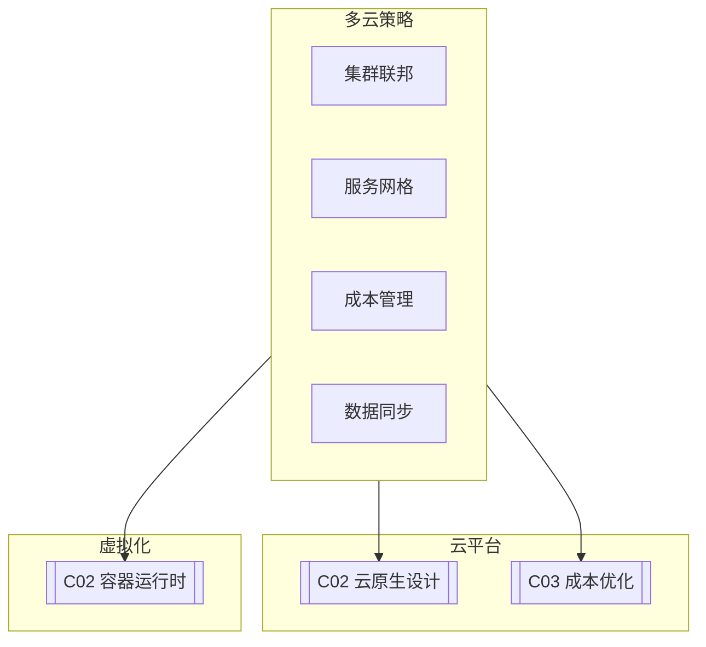

# C01 Multi-Cloud Strategies

**所属子领域**: [B10_Cloud_Platforms](../README.md)  
**创建日期**: 2026-01-30  
**最后更新**: 2026-01-30

## 📋 主题定位

多云策略（Multi-Cloud Strategies）是指企业同时使用两个或更多公有云服务商（如AWS、Azure、GCP）以及私有云/本地数据中心来部署和运行应用程序的IT架构方法。随着云服务的成熟和企业对云依赖的加深，多云已成为企业数字化转型的主流选择。

采用多云架构的驱动力包括：避免供应商锁定、优化成本、提升可用性和灾难恢复能力、利用各云平台的独特优势、满足数据主权合规要求等。然而，多云也带来复杂性挑战：不同的API和管理界面、网络连接复杂性、安全策略一致性、运维技能要求等。

本专题深入探讨多云架构的设计原则、管理策略、技术实现以及最佳实践，帮助企业构建高效、安全、可控的多云环境。

## 🎯 核心概念

### 多云架构模式

| 模式 | 说明 | 适用场景 |
|-----|------|---------|
| **多云并发** | 同一应用部署在多个云上 | 高可用、灾备 |
| **云爆发** | 本地为主，峰值用公有云 | 弹性需求 |
| **最佳服务** | 不同服务选最优云平台 | AI/大数据 |
| **数据主权** | 按地域选合规云 | 跨国企业 |
| **供应商规避** | 分散依赖多个供应商 | 风险分散 |

### 多云架构全景

```
┌─────────────────────────────────────────────────────────────────────────┐
│                         多云架构全景图                                    │
├─────────────────────────────────────────────────────────────────────────┤
│                                                                         │
│  ┌─────────────────────────────────────────────────────────────────┐   │
│  │                     统一管理层 (Unified Management)               │   │
│  │                                                                 │   │
│  │  ┌─────────────┐  ┌─────────────┐  ┌─────────────────────────┐ │   │
│  │  │  CMP平台    │  │  FinOps     │  │    统一监控/日志         │ │   │
│  │  │ (多云管理)   │  │ (成本优化)   │  │                         │ │   │
│  │  │             │  │             │  │  • 集中式可观测性        │ │   │
│  │  │ • Terraform │  │ • 成本分析   │  │  • 跨云日志聚合          │ │   │
│  │  │ • Crossplane│  │ • 预算告警   │  │  • 统一告警              │ │   │
│  │  │ • Rancher   │  │ • 优化建议   │  │  • 性能仪表盘            │ │   │
│  │  └──────┬──────┘  └──────┬──────┘  └───────────┬─────────────┘ │   │
│  │         └─────────────────┴─────────────────────┘               │   │
│  └─────────────────────────────────────────────────────────────────┘   │
│                              ↓                                          │
│  ┌─────────────────────────────────────────────────────────────────┐   │
│  │                    抽象层 (Abstraction Layer)                     │   │
│  │                                                                 │   │
│  │  ┌─────────────────────────────────────────────────────────┐   │   │
│  │  │              Kubernetes (多集群联邦)                       │   │   │
│  │  │                                                          │   │   │
│  │  │  • 跨云统一调度 (Federation v2 / Karmada)                │   │   │
│  │  │  • 服务网格 (Istio/Linkerd 跨云通信)                      │   │   │
│  │  │  • 多集群服务发现                                        │   │   │
│  │  │  • 跨云流量管理                                          │   │   │
│  │  └─────────────────────────────────────────────────────────┘   │   │
│  │                                                                 │   │
│  │  ┌─────────────────────────────────────────────────────────┐   │   │
│  │  │              服务抽象层                                    │   │   │
│  │  │  ┌─────────┐ ┌─────────┐ ┌─────────┐ ┌─────────────────┐ │   │   │
│  │  │  │ Ingress │ │ Service │ │ Config  │ │ Secret Store    │ │   │   │
│  │  │  │ Gateway │ │ Mesh    │ │ Management│ (Vault)         │ │   │   │
│  │  │  └─────────┘ └─────────┘ └─────────┘ └─────────────────┘ │   │   │
│  │  └─────────────────────────────────────────────────────────┘   │   │
│  └─────────────────────────────────────────────────────────────────┘   │
│                              ↓                                          │
│  ┌─────────────────────────────────────────────────────────────────┐   │
│  │                     网络连接层 (Network Connectivity)             │   │
│  │                                                                 │   │
│  │  ┌─────────────────────────────────────────────────────────┐   │   │
│  │  │  专线连接:                                               │   │   │
│  │  │  • AWS Direct Connect ←────┐                            │   │   │
│  │  │  • Azure ExpressRoute ←────┼──→ 云交换/SD-WAN → 混合网络  │   │   │
│  │  │  • Google Cloud Interconnect┘                            │   │   │
│  │  │                                                           │   │   │
│  │  │  VPN备选:                                                 │   │   │
│  │  │  • Site-to-Site VPN (IPSec)                              │   │   │
│  │  │  • SSL VPN (远程访问)                                     │   │   │
│  │  └─────────────────────────────────────────────────────────┘   │   │
│  │                                                                 │   │
│  │  ┌─────────────────────────────────────────────────────────┐   │   │
│  │  │  网络架构模式:                                           │   │   │
│  │  │  ┌─────────────────────────────────────────────────┐   │   │   │
│  │  │  │  Hub-Spoke: 中心VPC/网络连接所有云和本地          │   │   │   │
│  │  │  │  Full Mesh: 所有云直接互联                        │   │   │   │
│  │  │  │  Transit VPC: 中转VPC路由流量                     │   │   │   │
│  │  │  └─────────────────────────────────────────────────┘   │   │   │
│  │  └─────────────────────────────────────────────────────────┘   │   │
│  └─────────────────────────────────────────────────────────────────┘   │
│                              ↓                                          │
│  ┌─────────────────────────────────────────────────────────────────┐   │
│  │                    云服务提供商层                                  │   │
│  │                                                                 │   │
│  │  ┌───────────────┐  ┌───────────────┐  ┌───────────────┐       │   │
│  │  │     AWS       │  │     Azure     │  │      GCP      │       │   │
│  │  │               │  │               │  │               │       │   │
│  │  │ ┌───────────┐ │  │ ┌───────────┐ │  │ ┌───────────┐ │       │   │
│  │  │ │ EKS       │ │  │ │ AKS       │ │  │ │ GKE       │ │       │   │
│  │  │ │ Lambda    │ │  │ │ Functions │ │  │ │ Cloud Run │ │       │   │
│  │  │ │ S3        │ │  │ │ Blob      │ │  │ │ GCS       │ │       │   │
│  │  │ │ RDS       │ │  │ │ SQL       │ │  │ │ Cloud SQL │ │       │   │
│  │  │ │ DynamoDB  │ │  │ │ CosmosDB  │ │  │ │ Firestore │ │       │   │
│  │  │ └───────────┘ │  │ └───────────┘ │  │ └───────────┘ │       │   │
│  │  │  Region: us-  │  │  Region: west │  │  Region: asia │       │   │
│  │  │  east-1       │  │  us 2         │  │  east1        │       │   │
│  │  └───────────────┘  └───────────────┘  └───────────────┘       │   │
│  │                                                                 │   │
│  │  ┌───────────────┐  ┌─────────────────────────────────────────┐│   │
│  │  │   私有云/     │  │           边缘/本地                       ││   │
│  │  │   本地DC      │  │                                         ││   │
│  │  │               │  │  ┌─────────┐ ┌─────────┐ ┌─────────┐   ││   │
│  │  │ ┌───────────┐ │  │  │ Edge DC │ │ IoT     │ │ 5G MEC  │   ││   │
│  │  │ │ OpenStack │ │  │  │ Sites   │ │ Gateways│ │ Nodes   │   ││   │
│  │  │ │ VMware    │ │  │  └─────────┘ └─────────┘ └─────────┘   ││   │
│  │  │ │ Bare Metal│ │  │                                         ││   │
│  │  │ └───────────┘ │  │                                         ││   │
│  │  └───────────────┘  └─────────────────────────────────────────┘│   │
│  └─────────────────────────────────────────────────────────────────┘   │
│                                                                         │
└─────────────────────────────────────────────────────────────────────────┘
```

### 多云Kubernetes方案

```
┌─────────────────────────────────────────────────────────────────────────┐
│                    多云Kubernetes编排方案                                │
├─────────────────────────────────────────────────────────────────────────┤
│                                                                         │
│  方案1: Kubernetes Federation (Kubefed)                                 │
│  ┌─────────────────────────────────────────────────────────────────┐   │
│  │                      联邦控制平面 (Host Cluster)                  │   │
│  │                                                                 │   │
│  │  ┌─────────────┐  ┌─────────────┐  ┌─────────────────────────┐ │   │
│  │  │ Federated   │  │ Federated   │  │  Federated Service      │ │   │
│  │  │ Deployment  │  │ Service     │  │  DNS (Multi-Cluster)    │ │   │
│  │  │             │  │             │  │                         │ │   │
│  │  │ 定义分发策略  │  │ 跨集群服务发现 │  │  • 地域感知路由         │ │   │
│  │  │ 跨集群调度   │  │ 全局负载均衡  │  │  • 故障转移             │ │   │
│  │  └──────┬──────┘  └──────┬──────┘  └───────────┬─────────────┘ │   │
│  │         └─────────────────┴─────────────────────┘               │   │
│  │                              │                                  │   │
│  │         ┌────────────────────┼────────────────────┐             │   │
│  │         ▼                    ▼                    ▼             │   │
│  │    ┌─────────┐         ┌─────────┐         ┌─────────┐         │   │
│  │    │ Member  │         │ Member  │         │ Member  │         │   │
│  │    │ Cluster │◄───────►│ Cluster │◄───────►│ Cluster │         │   │
│  │    │  (AWS)  │         │  (Azure)│         │  (GCP)  │         │   │
│  │    └─────────┘         └─────────┘         └─────────┘         │   │
│  │                                                                 │   │
│  └─────────────────────────────────────────────────────────────────┘   │
│                                                                         │
│  方案2: Karmada (Kubernetes Armada)                                     │
│  ┌─────────────────────────────────────────────────────────────────┐   │
│  │                    Karmada控制平面                               │   │
│  │                                                                 │   │
│  │  ┌─────────────────────────────────────────────────────────┐   │   │
│  │  │  PropagationPolicy: 定义资源如何分发到成员集群             │   │   │
│  │  │  OverridePolicy: 定义特定集群的覆盖配置                   │   │   │
│  │  │  ResourceBinding: 资源与集群的绑定关系                    │   │   │
│  │  │  Work: 在成员集群执行的实际工作负载                        │   │   │
│  │  └─────────────────────────────────────────────────────────┘   │   │
│  │                              │                                  │   │
│  │    ┌─────────────────────────┼─────────────────────────┐       │   │
│  │    ▼                         ▼                         ▼       │   │
│  │ ┌────────┐              ┌────────┐              ┌────────┐     │   │
│  │ │ Cluster│              │ Cluster│              │ Cluster│     │   │
│  │ │  A     │              │  B     │              │  C     │     │   │
│  │ │(Production)           │(Production)           │(DR)    │     │   │
│  │ │ 北京   │              │ 上海   │              │ 新加坡 │     │   │
│  │ └────────┘              └────────┘              └────────┘     │   │
│  │                                                                 │   │
│  └─────────────────────────────────────────────────────────────────┘   │
│                                                                         │
│  方案3: Istio多集群服务网格                                              │
│  ┌─────────────────────────────────────────────────────────────────┐   │
│  │                    Istio控制平面 (共享或副本集)                   │   │
│  │                                                                 │   │
│  │  ┌─────────────────────────────────────────────────────────┐   │   │
│  │  │  • 跨集群服务发现: service.namespace.global              │   │   │
│  │  │  • mTLS自动加密跨云通信                                   │   │   │
│  │  │  • 统一流量管理: 故障注入/重试/超时                        │   │   │
│  │  │  • 跨集群可观测性: 统一指标和追踪                          │   │   │
│  │  └─────────────────────────────────────────────────────────┘   │   │
│  │                                                                 │   │
│  │         单网络模型          vs         多网络模型                │   │
│  │    (共享扁平网络)                 (跨集群使用Ingress Gateway)     │   │
│  │                                                                 │   │
│  └─────────────────────────────────────────────────────────────────┘   │
│                                                                         │
└─────────────────────────────────────────────────────────────────────────┘
```

## 🛠️ 技术实践

### 多云基础设施即代码

**1. Terraform多云部署脚本**

```hcl
# main.tf - 多云Terraform配置示例
# 部署相同的应用到AWS和Azure

# ==================== AWS配置 ====================
provider "aws" {
  alias  = "us_east"
  region = "us-east-1"
}

# AWS VPC
module "aws_vpc" {
  source  = "terraform-aws-modules/vpc/aws"
  version = "5.0.0"
  providers = {
    aws = aws.us_east
  }
  
  name = "multicloud-vpc"
  cidr = "10.0.0.0/16"
  
  azs             = ["us-east-1a", "us-east-1b"]
  private_subnets = ["10.0.1.0/24", "10.0.2.0/24"]
  public_subnets  = ["10.0.101.0/24", "10.0.102.0/24"]
  
  enable_nat_gateway = true
  enable_vpn_gateway = true
}

# AWS EKS集群
module "aws_eks" {
  source  = "terraform-aws-modules/eks/aws"
  version = "19.0.0"
  providers = {
    aws = aws.us_east
  }
  
  cluster_name    = "multicloud-eks"
  cluster_version = "1.28"
  
  vpc_id     = module.aws_vpc.vpc_id
  subnet_ids = module.aws_vpc.private_subnets
  
  eks_managed_node_groups = {
    general = {
      desired_size = 2
      min_size     = 1
      max_size     = 10
      
      instance_types = ["t3.medium"]
      capacity_type  = "SPOT"
    }
  }
}

# ==================== Azure配置 ====================
provider "azurerm" {
  alias = "west_us"
  features {}
}

# Azure Resource Group
resource "azurerm_resource_group" "main" {
  provider = azurerm.west_us
  name     = "multicloud-rg"
  location = "West US 2"
}

# Azure VNet
module "azure_vnet" {
  source  = "Azure/vnet/azurerm"
  version = "4.0.0"
  
  resource_group_name = azurerm_resource_group.main.name
  location            = azurerm_resource_group.main.location
  
  vnet_name       = "multicloud-vnet"
  address_space   = ["10.1.0.0/16"]
  subnet_prefixes = ["10.1.1.0/24", "10.1.2.0/24"]
  subnet_names    = ["private-1", "private-2"]
}

# Azure AKS集群
module "azure_aks" {
  source  = "Azure/aks/azurerm"
  version = "7.0.0"
  
  resource_group_name = azurerm_resource_group.main.name
  location            = azurerm_resource_group.main.location
  
  cluster_name = "multicloud-aks"
  kubernetes_version = "1.28"
  
  vnet_subnet_id = module.azure_vnet.vnet_subnets[0]
  
  default_node_pool = {
    name       = "default"
    node_count = 2
    vm_size    = "Standard_D2_v3"
  }
}

# ==================== GCP配置 ====================
provider "google" {
  alias   = "us_central"
  region  = "us-central1"
  project = var.gcp_project_id
}

# GCP VPC
resource "google_compute_network" "vpc" {
  provider                = google.us_central
  name                    = "multicloud-vpc"
  auto_create_subnetworks = false
}

resource "google_compute_subnetwork" "subnet" {
  provider = google.us_central
  name          = "multicloud-subnet"
  ip_cidr_range = "10.2.0.0/16"
  region        = "us-central1"
  network       = google_compute_network.vpc.id
}

# GCP GKE集群
module "gke" {
  source  = "terraform-google-modules/kubernetes-engine/google"
  version = "29.0.0"
  
  project_id = var.gcp_project_id
  name       = "multicloud-gke"
  region     = "us-central1"
  
  network    = google_compute_network.vpc.name
  subnetwork = google_compute_subnetwork.subnet.name
  
  node_pools = [
    {
      name         = "default"
      machine_type = "e2-medium"
      min_count    = 1
      max_count    = 10
      auto_upgrade = true
    }
  ]
}

# ==================== 跨云输出 ====================
output "cluster_endpoints" {
  description = "All cluster endpoints"
  value = {
    aws   = module.aws_eks.cluster_endpoint
    azure = module.azure_aks.cluster_fqdn
    gcp   = module.gke.endpoint
  }
}

output "kubeconfig_commands" {
  description = "Commands to configure kubeconfig"
  value = {
    aws   = "aws eks update-kubeconfig --region us-east-1 --name multicloud-eks"
    azure = "az aks get-credentials --resource-group multicloud-rg --name multicloud-aks"
    gcp   = "gcloud container clusters get-credentials multicloud-gke --region us-central1"
  }
}
```

**2. Crossplane多云资源管理**

```yaml
# Crossplane配置示例
# 使用Kubernetes API管理多云资源

---
# Provider配置
apiVersion: pkg.crossplane.io/v1
kind: Provider
metadata:
  name: provider-aws
spec:
  package: xpkg.upbound.io/upbound/provider-aws:v0.40.0

---
apiVersion: pkg.crossplane.io/v1
kind: Provider
metadata:
  name: provider-azure
spec:
  package: xpkg.upbound.io/upbound/provider-azure:v0.35.0

---
# AWS ProviderConfig
apiVersion: aws.upbound.io/v1beta1
kind: ProviderConfig
metadata:
  name: aws-provider
spec:
  credentials:
    source: Secret
    secretRef:
      namespace: crossplane-system
      name: aws-creds
      key: credentials

---
# 跨云存储桶声明
apiVersion: storage.aws.upbound.io/v1beta1
kind: Bucket
metadata:
  name: multicloud-data-aws
  annotations:
    crossplane.io/external-name: mycompany-multicloud-data
spec:
  providerConfigRef:
    name: aws-provider
  forProvider:
    region: us-east-1
    versioning:
      - enabled: true
    serverSideEncryptionConfiguration:
      - rule:
          - applyServerSideEncryptionByDefault:
              - sseAlgorithm: AES256

---
# Azure存储账户
apiVersion: storage.azure.upbound.io/v1beta1
kind: Account
metadata:
  name: multicloud-data-azure
spec:
  forProvider:
    resourceGroupName: multicloud-rg
    location: West US 2
    accountTier: Standard
    accountReplicationType: LRS
    enableHttpsTrafficOnly: true

---
# 组合资源 (XRD) - 跨云数据库
apiVersion: apiextensions.crossplane.io/v1
kind: CompositeResourceDefinition
metadata:
  name: xpostgresqls.database.example.org
spec:
  group: database.example.org
  names:
    kind: XPostgreSQL
    plural: xpostgresqls
  claimNames:
    kind: PostgreSQL
    plural: postgresqls
  versions:
    - name: v1alpha1
      served: true
      referenceable: true
      schema:
        openAPIV3Schema:
          type: object
          properties:
            spec:
              type: object
              properties:
                parameters:
                  type: object
                  properties:
                    region:
                      type: string
                    size:
                      type: string
                      enum: [small, medium, large]
                    provider:
                      type: string
                      enum: [aws, azure, gcp]

---
# 组合资源组合 (Composition)
apiVersion: apiextensions.crossplane.io/v1
kind: Composition
metadata:
  name: postgresql-aws
  labels:
    provider: aws
type: PostgreSQL
spec:
  compositeTypeRef:
    apiVersion: database.example.org/v1alpha1
    kind: XPostgreSQL
  resources:
    - name: rds-instance
      base:
        apiVersion: rds.aws.upbound.io/v1beta1
        kind: Instance
        spec:
          forProvider:
            engine: postgres
            engineVersion: "14"
            instanceClass: db.t3.micro
            allocatedStorage: 20
      patches:
        - fromFieldPath: spec.parameters.size
          toFieldPath: spec.forProvider.instanceClass
          transforms:
            - type: map
              map:
                small: db.t3.micro
                medium: db.t3.medium
                large: db.r5.large
```

### 多云成本优化

**3. 多云成本分析工具（Python）**

```python
#!/usr/bin/env python3
"""
多云成本分析工具
汇总分析AWS、Azure、GCP的成本数据
"""

import json
from dataclasses import dataclass
from typing import Dict, List
from datetime import datetime, timedelta
import boto3
from azure.identity import DefaultAzureCredential
from azure.mgmt.costmanagement import CostManagementClient
from google.cloud import billing


@dataclass
class CloudCost:
    """云成本数据"""
    provider: str
    service: str
    cost: float
    currency: str
    date: str


class MultiCloudCostAnalyzer:
    """多云成本分析器"""
    
    def __init__(self):
        self.costs: List[CloudCost] = []
    
    def fetch_aws_costs(self, days: int = 30) -> List[CloudCost]:
        """获取AWS成本数据"""
        costs = []
        
        try:
            ce = boto3.client('ce')
            
            end_date = datetime.now().strftime('%Y-%m-%d')
            start_date = (datetime.now() - timedelta(days=days)).strftime('%Y-%m-%d')
            
            response = ce.get_cost_and_usage(
                TimePeriod={
                    'Start': start_date,
                    'End': end_date
                },
                Granularity='DAILY',
                Metrics=['BlendedCost'],
                GroupBy=[
                    {'Type': 'DIMENSION', 'Key': 'SERVICE'}
                ]
            )
            
            for result in response['ResultsByTime']:
                date = result['TimePeriod']['Start']
                for group in result['Groups']:
                    service = group['Keys'][0]
                    amount = float(group['Metrics']['BlendedCost']['Amount'])
                    
                    costs.append(CloudCost(
                        provider='AWS',
                        service=service,
                        cost=amount,
                        currency='USD',
                        date=date
                    ))
        except Exception as e:
            print(f"获取AWS成本失败: {e}")
        
        return costs
    
    def fetch_azure_costs(self, days: int = 30) -> List[CloudCost]:
        """获取Azure成本数据"""
        costs = []
        
        try:
            credential = DefaultAzureCredential()
            subscription_id = "your-subscription-id"
            
            client = CostManagementClient(credential, subscription_id)
            
            # Azure Cost Management查询
            query = {
                'type': 'Usage',
                'timeframe': f'Last{days}Days',
                'dataset': {
                    'granularity': 'Daily',
                    'aggregation': {
                        'totalCost': {
                            'name': 'PreTaxCost',
                            'function': 'Sum'
                        }
                    },
                    'grouping': [
                        {'type': 'Dimension', 'name': 'ServiceName'}
                    ]
                }
            }
            
            # 实际调用Azure API获取成本数据
            # 这里简化处理
            
        except Exception as e:
            print(f"获取Azure成本失败: {e}")
        
        return costs
    
    def analyze_costs(self) -> Dict:
        """分析成本数据"""
        # 按云提供商汇总
        provider_summary = {}
        service_summary = {}
        
        for cost in self.costs:
            # 按提供商汇总
            if cost.provider not in provider_summary:
                provider_summary[cost.provider] = 0
            provider_summary[cost.provider] += cost.cost
            
            # 按服务汇总
            key = f"{cost.provider}:{cost.service}"
            if key not in service_summary:
                service_summary[key] = 0
            service_summary[key] += cost.cost
        
        # 找出Top成本服务
        top_services = sorted(
            service_summary.items(),
            key=lambda x: x[1],
            reverse=True
        )[:10]
        
        return {
            'provider_summary': provider_summary,
            'top_services': [
                {'service': k, 'cost': round(v, 2)} 
                for k, v in top_services
            ],
            'total_cost': sum(provider_summary.values())
        }
    
    def generate_report(self) -> Dict:
        """生成成本报告"""
        print("获取AWS成本...")
        aws_costs = self.fetch_aws_costs()
        self.costs.extend(aws_costs)
        
        print("获取Azure成本...")
        azure_costs = self.fetch_azure_costs()
        self.costs.extend(azure_costs)
        
        analysis = self.analyze_costs()
        
        return {
            'generated_at': datetime.now().isoformat(),
            'period_days': 30,
            'analysis': analysis,
            'recommendations': self._generate_recommendations(analysis)
        }
    
    def _generate_recommendations(self, analysis: Dict) -> List[str]:
        """生成优化建议"""
        recommendations = []
        
        # 基于分析结果生成建议
        provider_summary = analysis['provider_summary']
        
        # 建议1: 成本分布不均衡
        total = sum(provider_summary.values())
        for provider, cost in provider_summary.items():
            percentage = (cost / total) * 100 if total > 0 else 0
            if percentage > 70:
                recommendations.append(
                    f"{provider}占总成本的{percentage:.1f}%，建议评估其他云以优化成本"
                )
        
        # 建议2: 预留实例
        recommendations.append(
            "考虑购买预留实例或节省计划以降低长期成本"
        )
        
        # 建议3: 存储优化
        recommendations.append(
            "审查存储使用情况，将不常访问的数据迁移到冷存储"
        )
        
        return recommendations


if __name__ == '__main__':
    analyzer = MultiCloudCostAnalyzer()
    report = analyzer.generate_report()
    
    print("\n" + "="*60)
    print("多云成本分析报告")
    print("="*60)
    print(json.dumps(report, indent=2))
```

## 📚 资源索引

### 多云管理工具

| 工具 | 类型 | 说明 |
|-----|------|------|
| **Terraform** | IaC | 多云基础设施编排 |
| **Crossplane** | K8s | Kubernetes多云管理 |
| **Rancher** | 容器 | 多集群Kubernetes管理 |
| **CloudHealth** | 成本 | 多云成本管理 |

### 网络连接方案

| 方案 | 提供商 | 说明 |
|-----|-------|------|
| **AWS Direct Connect** | AWS | 专线连接 |
| **Azure ExpressRoute** | Azure | 专线连接 |
| **Cloud Interconnect** | GCP | 专线连接 |
| **Megaport/Equinix** | 第三方 | 云交换服务 |

## 🔗 关联知识



## 💡 学习建议

### 入门路径

1. **基础概念**（1-2周）
   - 多云架构模式
   - 网络连接方案
   - 身份联邦

2. **工具实践**（3-4周）
   - Terraform多云部署
   - Kubernetes联邦
   - 服务网格跨云

3. **高级主题**（5-8周）
   - 多云治理
   - FinOps成本优化
   - 灾备架构设计

---

*最后更新: 2026-01-30*  
*维护者: Infrastructure Team*
