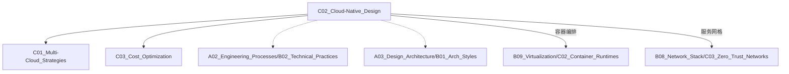

# C02 Cloud-Native Design

**所属子领域**: [B10_Cloud_Platforms](../README.md)  
**创建日期**: 2026-01-30  
**最后更新**: 2026-01-30

## 📋 主题定位

云原生设计（Cloud-Native Design）是一套利用云计算优势构建和运行应用程序的方法论，核心特征包括容器化封装、微服务架构、动态管理和 DevOps 实践。通过声明式 API 和自动化运维，实现系统的弹性、可观测性和快速迭代。

## 🎯 核心概念

### 云原生技术栈（CNCF 景观）

```
┌─────────────────────────────────────────────────────────────┐
│                       应用定义与开发                          │
│    数据库、流处理、消息队列、应用定义、持续集成               │
├─────────────────────────────────────────────────────────────┤
│                       编排与管理                             │
│    调度与编排、服务发现、服务代理、API 网关                   │
├─────────────────────────────────────────────────────────────┤
│                       运行时                                 │
│    容器运行时、Cloud Native 网络、Cloud Native 存储          │
├─────────────────────────────────────────────────────────────┤
│                       配置                                   │
│    自动化与配置、容器注册中心、安全与合规                     │
├─────────────────────────────────────────────────────────────┤
│                       可观测性                               │
│    监控、日志、追踪、混沌工程                                │
├─────────────────────────────────────────────────────────────┤
│                       平台                                   │
│    Kubernetes、Docker、etcd、CoreDNS                         │
└─────────────────────────────────────────────────────────────┘
```

### 核心原则

| 原则 | 说明 | 实现技术 |
|------|------|----------|
| **容器化** | 应用及其依赖打包为容器 | Docker, containerd |
| **微服务** | 细粒度服务，独立部署 | Service Mesh, gRPC |
| **动态编排** | 自动化部署、扩缩容 | Kubernetes, Nomad |
| **声明式 API** | 描述期望状态，系统自动达成 | YAML, Operator |
| **可观测性** | 日志、指标、追踪三位一体 | Prometheus, Jaeger |
| **弹性设计** | 容错、降级、自愈 | Circuit Breaker, HPA |

### 12-Factor App

1. **代码库**: 一份代码库，多处部署
2. **依赖**: 显式声明和隔离依赖
3. **配置**: 环境中存储配置
4. **后端服务**: 将后端服务视为附加资源
5. **构建、发布、运行**: 严格分离阶段
6. **进程**: 以一个或多个无状态进程运行
7. **端口绑定**: 通过端口绑定提供服务
8. **并发**: 通过进程模型扩展
9. **易处理**: 快速启动和优雅终止
10. **开发/生产一致**: 保持环境一致
11. **日志**: 日志作为事件流
12. **管理进程**: 管理任务作为一次性进程

## 🛠️ 技术实践

### 1. Kubernetes 应用部署

```yaml
# deployment.yaml
apiVersion: apps/v1
kind: Deployment
metadata:
  name: web-app
  labels:
    app: web-app
    version: v1
spec:
  replicas: 3
  strategy:
    type: RollingUpdate
    rollingUpdate:
      maxSurge: 25%
      maxUnavailable: 0
  selector:
    matchLabels:
      app: web-app
  template:
    metadata:
      labels:
        app: web-app
        version: v1
    spec:
      containers:
      - name: app
        image: myapp:v1.2.3
        ports:
        - containerPort: 8080
          name: http
        env:
        - name: DATABASE_URL
          valueFrom:
            secretKeyRef:
              name: db-secret
              key: url
        - name: LOG_LEVEL
          valueFrom:
            configMapKeyRef:
              name: app-config
              key: log_level
        resources:
          requests:
            memory: "256Mi"
            cpu: "250m"
          limits:
            memory: "512Mi"
            cpu: "500m"
        livenessProbe:
          httpGet:
            path: /health
            port: 8080
          initialDelaySeconds: 10
          periodSeconds: 10
        readinessProbe:
          httpGet:
            path: /ready
            port: 8080
          initialDelaySeconds: 5
          periodSeconds: 5
        volumeMounts:
        - name: tmp
          mountPath: /tmp
      volumes:
      - name: tmp
        emptyDir: {}
      affinity:
        podAntiAffinity:
          preferredDuringSchedulingIgnoredDuringExecution:
          - weight: 100
            podAffinityTerm:
              labelSelector:
                matchExpressions:
                - key: app
                  operator: In
                  values:
                  - web-app
              topologyKey: kubernetes.io/hostname
```

```yaml
# hpa.yaml - 自动扩缩容
apiVersion: autoscaling/v2
kind: HorizontalPodAutoscaler
metadata:
  name: web-app-hpa
spec:
  scaleTargetRef:
    apiVersion: apps/v1
    kind: Deployment
    name: web-app
  minReplicas: 3
  maxReplicas: 50
  metrics:
  - type: Resource
    resource:
      name: cpu
      target:
        type: Utilization
        averageUtilization: 70
  - type: Resource
    resource:
      name: memory
      target:
        type: Utilization
        averageUtilization: 80
  behavior:
    scaleDown:
      stabilizationWindowSeconds: 300
      policies:
      - type: Percent
        value: 50
        periodSeconds: 60
```

### 2. 服务网格（Istio）

```yaml
# VirtualService - 流量路由
apiVersion: networking.istio.io/v1beta1
kind: VirtualService
metadata:
  name: web-app-route
spec:
  hosts:
  - web-app
  http:
  - match:
    - headers:
        x-canary:
          exact: "true"
    route:
    - destination:
        host: web-app
        subset: v2
      weight: 100
  - route:
    - destination:
        host: web-app
        subset: v1
      weight: 90
    - destination:
        host: web-app
        subset: v2
      weight: 10
```

```yaml
# DestinationRule - 负载均衡和熔断
apiVersion: networking.istio.io/v1beta1
kind: DestinationRule
metadata:
  name: web-app-policy
spec:
  host: web-app
  trafficPolicy:
    connectionPool:
      tcp:
        maxConnections: 100
      http:
        http1MaxPendingRequests: 50
        maxRequestsPerConnection: 10
    loadBalancer:
      simple: LEAST_CONN
    outlierDetection:
      consecutive5xxErrors: 5
      interval: 30s
      baseEjectionTime: 30s
  subsets:
  - name: v1
    labels:
      version: v1
  - name: v2
    labels:
      version: v2
```

### 3. 可观测性配置

```yaml
# ServiceMonitor - Prometheus 监控
apiVersion: monitoring.coreos.com/v1
kind: ServiceMonitor
metadata:
  name: web-app-metrics
  labels:
    app: web-app
spec:
  selector:
    matchLabels:
      app: web-app
  endpoints:
  - port: http
    path: /metrics
    interval: 15s
    scrapeTimeout: 10s
```

```yaml
# PodMonitor - 日志收集
apiVersion: v1
kind: ConfigMap
metadata:
  name: fluent-bit-config
data:
  fluent-bit.conf: |
    [INPUT]
        Name              tail
        Tag               kube.*
        Path              /var/log/containers/*.log
        Parser            docker
        DB                /var/log/flb_kube.db
        Mem_Buf_Limit     5MB
        Skip_Long_Lines   On
        Refresh_Interval  10
    
    [FILTER]
        Name                kubernetes
        Match               kube.*
        Kube_URL            https://kubernetes.default.svc:443
        Kube_CA_File        /var/run/secrets/kubernetes.io/serviceaccount/ca.crt
        Kube_Token_File     /var/run/secrets/kubernetes.io/serviceaccount/token
        Merge_Log           On
        Keep_Log            Off
    
    [OUTPUT]
        Name            es
        Match           *
        Host            elasticsearch
        Port            9200
        Logstash_Format On
        Logstash_Prefix k8s
```

### 4. GitOps（ArgoCD）

```yaml
# Application - 声明式应用管理
apiVersion: argoproj.io/v1alpha1
kind: Application
metadata:
  name: web-app
  namespace: argocd
  finalizers:
  - resources-finalizer.argocd.argoproj.io
spec:
  project: production
  source:
    repoURL: https://github.com/org/gitops-repo.git
    targetRevision: HEAD
    path: apps/web-app/overlays/production
    helm:
      valueFiles:
      - values-production.yaml
  destination:
    server: https://kubernetes.default.svc
    namespace: production
  syncPolicy:
    automated:
      prune: true
      selfHeal: true
      allowEmpty: false
    syncOptions:
    - CreateNamespace=true
    - PrunePropagationPolicy=foreground
    retry:
      limit: 5
      backoff:
        duration: 5s
        factor: 2
        maxDuration: 3m
```

### 5. 多环境配置管理（Kustomize）

```yaml
# base/kustomization.yaml
apiVersion: kustomize.config.k8s.io/v1beta1
kind: Kustomization
resources:
- deployment.yaml
- service.yaml
- ingress.yaml

configMapGenerator:
- name: app-config
  literals:
  - LOG_LEVEL=info
  - CACHE_TTL=3600

images:
- name: web-app
  newTag: v1.0.0
```

```yaml
# overlays/production/kustomization.yaml
apiVersion: kustomize.config.k8s.io/v1beta1
kind: Kustomization
namespace: production
namePrefix: prod-

resources:
- ../../base
- hpa.yaml

patchesStrategicMerge:
- deployment-patch.yaml

configMapGenerator:
- name: app-config
  behavior: merge
  literals:
  - LOG_LEVEL=warn
  - CACHE_TTL=7200

replicas:
- name: web-app
  count: 5
```

## 📚 资源索引

### 核心资源

1. **CNCF Cloud Native Interactive Landscape**
   - https://landscape.cncf.io/
   - 云原生技术全景图

2. **12-Factor App**
   - https://12factor.net/
   - 云原生应用设计原则

3. **Kubernetes 官方文档**
   - https://kubernetes.io/docs/
   - 容器编排平台权威指南

### 开源项目

1. **Helm**
   - Kubernetes 包管理器
   - https://helm.sh/

2. **ArgoCD**
   - GitOps 持续交付
   - https://argo-cd.readthedocs.io/

3. **Prometheus**
   - 监控和告警
   - https://prometheus.io/

4. **Istio**
   - 服务网格
   - https://istio.io/

5. **Flux**
   - GitOps 工具
   - https://fluxcd.io/

## 🔗 关联知识



## 🔄 维护说明

- **更新频率**: 每季度更新 CNCF 新项目
- **质量标准**: K8s YAML 语法正确，可应用
- **贡献方式**: 提交新的云原生工具、最佳实践
