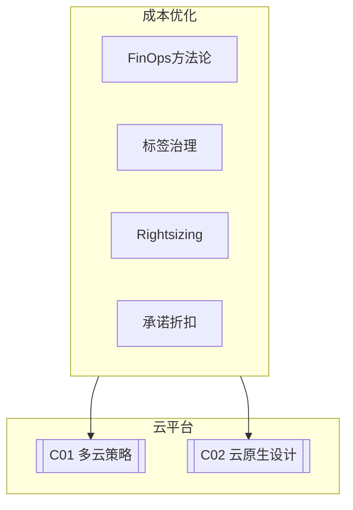

# C03 Cost Optimization

**所属子领域**: [B10_Cloud_Platforms](../README.md)  
**创建日期**: 2026-01-30  
**最后更新**: 2026-01-30

## 📋 主题定位

云成本优化（Cloud Cost Optimization）是企业在数字化转型过程中面临的核心挑战之一。随着云资源使用的增加，许多企业发现其云支出呈现失控增长，出现资源闲置、过度配置、缺乏治理等问题。据行业研究，平均30-35%的云支出被浪费在低效或闲置的资源上。

FinOps（Finance + DevOps）作为云成本管理的方法论，强调财务、技术和业务团队的协作，通过数据驱动的决策实现云支出的可视性、优化和治理。它不仅仅关注削减成本，更关注优化云投资的价值，实现业务敏捷性与成本效率的平衡。

本专题深入探讨云成本优化的策略、工具、FinOps实践以及自动化治理方法，帮助企业建立可持续的云成本管理能力。

## 🎯 核心概念

### 云成本构成

```
┌─────────────────────────────────────────────────────────────────────────┐
│                        典型云成本构成分析                                │
├─────────────────────────────────────────────────────────────────────────┤
│                                                                         │
│  ┌─────────────────────────────────────────────────────────────────┐   │
│  │                    云支出分布 (示例)                               │   │
│  │                                                                 │   │
│  │  计算资源 (Compute)          ████████████████████  45%         │   │
│  │  ├── 虚拟机/容器实例                                             │   │
│  │  ├── Serverless函数                                             │   │
│  │  └── 预留实例/节省计划                                           │   │
│  │                                                                 │   │
│  │  存储 (Storage)              ██████████████        25%         │   │
│  │  ├── 对象存储                                                   │   │
│  │  ├── 块存储                                                     │   │
│  │  ├── 文件存储                                                   │   │
│  │  └── 备份/归档                                                  │   │
│  │                                                                 │   │
│  │  网络 (Networking)           ██████                10%         │   │
│  │  ├── 数据传输                                                  │   │
│  │  ├── NAT网关/负载均衡                                          │   │
│  │  └── VPN/专线                                                  │   │
│  │                                                                 │   │
│  │  数据库 (Database)           ████████              15%         │   │
│  │  ├── 托管数据库服务                                            │   │
│  │  ├── 缓存                                                     │   │
│  │  └── 数据仓库                                                 │   │
│  │                                                                 │   │
│  │  其他服务                    ██                   5%          │   │
│  │  ├── 监控/日志                                                 │   │
│  │  ├── 安全服务                                                 │   │
│  │  └── 开发工具                                                 │   │
│  │                                                                 │   │
│  └─────────────────────────────────────────────────────────────────┘   │
│                                                                         │
│  常见浪费来源:                                                            │
│  ┌─────────────────────────────────────────────────────────────────┐   │
│  │  • 闲置资源 (Idle Resources)          ~15%                      │   │
│  │    - 非工作时间运行的开发/测试环境                                 │   │
│  │    - 已停止但未删除的存储卷                                       │   │
│  │    - 过度配置的实例规格                                           │   │
│  │                                                                 │   │
│  │  • 过度配置 (Over-provisioning)       ~20%                      │   │
│  │    - CPU利用率<20%的实例                                          │   │
│  │    - 未使用预留实例折扣                                           │   │
│  │    - 存储未分层，热数据用冷存储                                   │   │
│  │                                                                 │   │
│  │  • 管理缺失 (Lack of governance)      ~10%                      │   │
│  │    - 无标签/成本分配策略                                          │   │
│  │    - 缺少成本告警和预算控制                                       │   │
│  │    - 影子IT/未授权资源                                            │   │
│  └─────────────────────────────────────────────────────────────────┘   │
│                                                                         │
└─────────────────────────────────────────────────────────────────────────┘
```

### FinOps生命周期

```
┌─────────────────────────────────────────────────────────────────────────┐
│                     FinOps生命周期 (Inform-Optimize-Operate)             │
├─────────────────────────────────────────────────────────────────────────┤
│                                                                         │
│  ┌─────────────────────────────────────────────────────────────────┐   │
│  │                                                                 │   │
│  │  Phase 1: INFORM (信息)                                         │   │
│  │  ┌─────────────────────────────────────────────────────────┐   │   │
│  │  │  • 建立成本可视性                                          │   │   │
│  │  │    - 按团队/项目/环境分摊成本                               │   │   │
│  │  │    - 成本仪表盘和报告                                       │   │   │
│  │  │    - 异常检测和告警                                        │   │   │
│  │  │                                                           │   │   │
│  │  │  • 标签策略和治理                                          │   │   │
│  │  │    - 强制标签策略 (Owner, Project, Environment)            │   │   │
│  │  │    - 未标签资源识别和修复                                   │   │   │
│  │  │                                                           │   │   │
│  │  │  • 预算和预测                                              │   │   │
│  │  │    - 月度/季度预算设定                                      │   │   │
│  │  │    - 趋势分析和预测                                        │   │   │
│  │  └─────────────────────────────────────────────────────────┘   │   │
│  │                              ↓                                  │   │
│  │  Phase 2: OPTIMIZE (优化)                                       │   │
│  │  ┌─────────────────────────────────────────────────────────┐   │   │
│  │  │  • 资源优化                                              │   │   │
│  │  │    -  rightsizing (调整实例规格)                          │   │   │
│  │  │    - 自动伸缩配置优化                                     │   │   │
│  │  │    - 闲置资源清理                                         │   │   │
│  │  │                                                           │   │   │
│  │  │  • 定价优化                                              │   │   │
│  │  │    - 预留实例/节省计划购买                                 │   │   │
│  │  │    - Spot/Preemptible实例使用                             │   │   │
│  │  │    - 存储分层 (热/温/冷)                                  │   │   │
│  │  │                                                           │   │   │
│  │  │  • 架构优化                                              │   │   │
│  │  │    - Serverless替代长时间运行的VM                         │   │   │
│  │  │    - 数据本地化减少传输                                   │   │   │
│  │  │    - 缓存减少数据库查询                                   │   │   │
│  │  └─────────────────────────────────────────────────────────┘   │   │
│  │                              ↓                                  │   │
│  │  Phase 3: OPERATE (运营)                                        │   │
│  │  ┌─────────────────────────────────────────────────────────┐   │   │
│  │  │  • 持续监控和优化                                        │   │   │
│  │  │    - 定期成本审查会议                                     │   │   │
│  │  │    - 自动化优化策略                                       │   │   │
│  │  │                                                           │   │   │
│  │  │  • 组织协作                                              │   │   │
│  │  │    - FinOps团队建设                                       │   │   │
│  │  │    - 成本意识培训                                         │   │   │
│  │  │    - 将成本纳入工程评审                                   │   │   │
│  │  │                                                           │   │   │
│  │  │  • 持续改进                                              │   │   │
│  │  │    - 衡量优化效果                                         │   │   │
│  │  │    - 调整策略和目标                                       │   │   │
│  │  └─────────────────────────────────────────────────────────┘   │   │
│  │                                                                 │   │
│  └─────────────────────────────────────────────────────────────────┘   │
│                                                                         │
└─────────────────────────────────────────────────────────────────────────┘
```

### 云定价模型

| 定价模型 | 折扣 | 适用场景 | 风险 |
|---------|------|---------|------|
| **按需 (On-Demand)** | 0% | 短期/不可预测负载 | 无 |
| **预留实例 (RI)** | 30-72% | 稳定长期工作负载 | 长期承诺 |
| **节省计划 (SP)** | 20-50% | 灵活承诺计算使用 | 使用承诺 |
| **Spot/Preemptible** | 60-90% | 容错批处理 | 随时中断 |
| **专用主机** | 变体 | 许可/合规要求 | 高成本 |

## 🛠️ 技术实践

### 成本监控与告警

**1. 多云成本监控脚本**

```python
#!/usr/bin/env python3
"""
云成本监控与告警工具
支持AWS、Azure、GCP的成本监控
"""

import json
import os
from datetime import datetime, timedelta
from dataclasses import dataclass
from typing import Dict, List
import requests


@dataclass
class CostAlert:
    """成本告警"""
    severity: str  # info, warning, critical
    category: str
    message: str
    estimated_monthly: float
    threshold: float


class CloudCostMonitor:
    """云成本监控器"""
    
    def __init__(self, config_path: str = None):
        self.config = self._load_config(config_path)
        self.alerts: List[CostAlert] = []
    
    def _load_config(self, path: str) -> Dict:
        """加载配置文件"""
        default_config = {
            'thresholds': {
                'daily_spend': 100,      # 单日支出告警
                'monthly_budget': 3000,   # 月度预算
                'anomaly_percentage': 50  # 异常增长百分比
            },
            'slack_webhook': os.getenv('SLACK_WEBHOOK_URL'),
            'teams': {
                'engineering': {'budget': 2000, 'owner': 'eng-team'},
                'data': {'budget': 1000, 'owner': 'data-team'}
            }
        }
        
        if path and os.path.exists(path):
            with open(path) as f:
                default_config.update(json.load(f))
        
        return default_config
    
    def get_aws_costs(self, days: int = 7) -> Dict:
        """获取AWS成本数据"""
        try:
            import boto3
            ce = boto3.client('ce')
            
            end = datetime.now().strftime('%Y-%m-%d')
            start = (datetime.now() - timedelta(days=days)).strftime('%Y-%m-%d')
            
            # 按服务汇总
            response = ce.get_cost_and_usage(
                TimePeriod={'Start': start, 'End': end},
                Granularity='DAILY',
                Metrics=['BlendedCost'],
                GroupBy=[{'Type': 'DIMENSION', 'Key': 'SERVICE'}]
            )
            
            # 按标签汇总 (需要启用成本分配标签)
            tagged_response = ce.get_cost_and_usage(
                TimePeriod={'Start': start, 'End': end},
                Granularity='DAILY',
                Metrics=['BlendedCost'],
                GroupBy=[{'Type': 'TAG', 'Key': 'Team'}]
            )
            
            return {
                'by_service': self._parse_cost_response(response),
                'by_team': self._parse_cost_response(tagged_response)
            }
        except Exception as e:
            print(f"获取AWS成本失败: {e}")
            return {}
    
    def _parse_cost_response(self, response) -> Dict:
        """解析成本响应"""
        costs = {}
        for result in response.get('ResultsByTime', []):
            for group in result.get('Groups', []):
                key = group['Keys'][0]
                amount = float(group['Metrics']['BlendedCost']['Amount'])
                costs[key] = costs.get(key, 0) + amount
        return costs
    
    def check_thresholds(self, costs: Dict):
        """检查成本阈值"""
        thresholds = self.config['thresholds']
        
        # 检查总成本
        total = sum(costs.get('by_service', {}).values())
        daily_avg = total / 7
        monthly_estimate = daily_avg * 30
        
        if monthly_estimate > thresholds['monthly_budget']:
            self.alerts.append(CostAlert(
                severity='critical',
                category='Budget',
                message=f'预估月度成本 ${monthly_estimate:.2f} 超出预算 ${thresholds["monthly_budget"]}',
                estimated_monthly=monthly_estimate,
                threshold=thresholds['monthly_budget']
            ))
        
        # 检查各团队预算
        for team, config in self.config.get('teams', {}).items():
            team_cost = costs.get('by_team', {}).get(f'Team${team}', 0)
            team_monthly = (team_cost / 7) * 30
            
            if team_monthly > config['budget']:
                self.alerts.append(CostAlert(
                    severity='warning',
                    category=f'Team: {team}',
                    message=f'{team}团队预估成本 ${team_monthly:.2f} 超出预算 ${config["budget"]}',
                    estimated_monthly=team_monthly,
                    threshold=config['budget']
                ))
    
    def send_notifications(self):
        """发送通知"""
        if not self.alerts:
            return
        
        # Slack通知
        if self.config.get('slack_webhook'):
            self._send_slack_notification()
        
        # 控制台输出
        print("\n" + "="*60)
        print("成本告警")
        print("="*60)
        for alert in self.alerts:
            emoji = {'info': 'ℹ️', 'warning': '⚠️', 'critical': '🚨'}.get(alert.severity, '•')
            print(f"{emoji} [{alert.severity.upper()}] {alert.category}")
            print(f"   {alert.message}")
            print(f"   预估月度: ${alert.estimated_monthly:.2f} (阈值: ${alert.threshold})")
            print()
    
    def _send_slack_notification(self):
        """发送Slack通知"""
        message = {
            'text': '云成本告警',
            'blocks': [
                {
                    'type': 'header',
                    'text': {
                        'type': 'plain_text',
                        'text': '📊 云成本告警'
                    }
                }
            ]
        }
        
        for alert in self.alerts:
            message['blocks'].append({
                'type': 'section',
                'text': {
                    'type': 'mrkdwn',
                    'text': f"*{alert.severity.upper()}*: {alert.category}\n{alert.message}"
                }
            })
        
        try:
            requests.post(self.config['slack_webhook'], json=message)
        except Exception as e:
            print(f"发送Slack通知失败: {e}")
    
    def run(self):
        """运行监控"""
        print("获取成本数据...")
        costs = self.get_aws_costs(days=7)
        
        print("检查阈值...")
        self.check_thresholds(costs)
        
        print("发送通知...")
        self.send_notifications()
        
        return len(self.alerts)


if __name__ == '__main__':
    monitor = CloudCostMonitor()
    alert_count = monitor.run()
    exit(1 if alert_count > 0 else 0)
```

### 自动化成本优化

**2. 资源调度优化脚本**

```bash
#!/bin/bash
# 自动化成本优化脚本
# 定时任务：非工作时间自动启停资源

set -e

ACTION=${1:-"status"}
ENVIRONMENT=${2:-"dev"}  # dev, staging, prod

echo "=== 云成本自动优化工具 ==="
echo "操作: $ACTION"
echo "环境: $ENVIRONMENT"
echo ""

# 检查当前时间是否在工作时间
is_work_hours() {
    local hour=$(date +%H)
    local day=$(date +%u)  # 1-5 周一到周五
    
    # 工作日 9:00-18:00
    if [ "$day" -le 5 ] && [ "$hour" -ge 9 ] && [ "$hour" -lt 18 ]; then
        return 0  # 是工作时间
    else
        return 1  # 非工作时间
    fi
}

# AWS EC2自动启停
manage_aws_ec2() {
    local action=$1  # start, stop
    
    echo "=== AWS EC2 管理 ==="
    
    # 获取带AutoShutdown标签的实例
    instances=$(aws ec2 describe-instances \
        --filters "Name=tag:Environment,Values=$ENVIRONMENT" \
                  "Name=tag:AutoShutdown,Values=true" \
        --query 'Reservations[*].Instances[*].InstanceId' \
        --output text)
    
    if [ -z "$instances" ]; then
        echo "没有需要管理的实例"
        return
    fi
    
    if [ "$action" = "stop" ]; then
        echo "停止实例: $instances"
        aws ec2 stop-instances --instance-ids $instances
    elif [ "$action" = "start" ]; then
        echo "启动实例: $instances"
        aws ec2 start-instances --instance-ids $instances
    fi
}

# AWS RDS自动启停
manage_aws_rds() {
    local action=$1
    
    echo "=== AWS RDS 管理 ==="
    
    # 获取带auto-shutdown标签的数据库
    databases=$(aws rds describe-db-instances \
        --query 'DBInstances[?TagList[?Key==`Environment` && Value==`'$ENVIRONMENT'`] && TagList[?Key==`AutoShutdown` && Value==`true`]].DBInstanceIdentifier' \
        --output text)
    
    for db in $databases; do
        status=$(aws rds describe-db-instances \
            --db-instance-identifier $db \
            --query 'DBInstances[0].DBInstanceStatus' \
            --output text)
        
        if [ "$action" = "stop" ] && [ "$status" = "available" ]; then
            echo "停止RDS: $db"
            aws rds stop-db-instance --db-instance-identifier $db
        elif [ "$action" = "start" ] && [ "$status" = "stopped" ]; then
            echo "启动RDS: $db"
            aws rds start-db-instance --db-instance-identifier $db
        fi
    done
}

# Azure VM自动启停
manage_azure_vms() {
    local action=$1
    
    echo "=== Azure VM 管理 ==="
    
    # 获取带AutoShutdown标签的VM
    vms=$(az vm list --query "[?tags.Environment=='$ENVIRONMENT' && tags.AutoShutdown=='true'].name" -o tsv)
    
    for vm in $vms; do
        resource_group=$(az vm list --query "[?name=='$vm'].resourceGroup" -o tsv)
        
        if [ "$action" = "stop" ]; then
            echo "停止VM: $vm"
            az vm stop --name $vm --resource-group $resource_group --no-wait
        elif [ "$action" = "start" ]; then
            echo "启动VM: $vm"
            az vm start --name $vm --resource-group $resource_group --no-wait
        fi
    done
}

# 清理未使用的资源
cleanup_unused_resources() {
    echo "=== 清理未使用资源 ==="
    
    # 查找未 attached 的 EBS 卷
    echo "查找未使用的EBS卷..."
    unattached_volumes=$(aws ec2 describe-volumes \
        --filters "Name=status,Values=available" \
        --query 'Volumes[*].[VolumeId,Size,CreateTime]' \
        --output text)
    
    if [ -n "$unattached_volumes" ]; then
        echo "发现未附加的卷:"
        echo "$unattached_volumes"
        
        # 可选：创建快照后删除
        # aws ec2 create-snapshot --volume-id $volume_id
        # aws ec2 delete-volume --volume-id $volume_id
    fi
    
    # 查找旧的快照
    echo ""
    echo "查找30天前的快照..."
    cutoff_date=$(date -d '30 days ago' +%Y-%m-%d)
    
    old_snapshots=$(aws ec2 describe-snapshots \
        --owner-ids self \
        --query "Snapshots[?StartTime<='$cutoff_date'].[SnapshotId,StartTime,VolumeSize]" \
        --output text)
    
    if [ -n "$old_snapshots" ]; then
        echo "发现旧快照:"
        echo "$old_snapshots"
    fi
}

# 显示状态
show_status() {
    echo "=== 资源状态 ==="
    
    # AWS EC2
    echo ""
    echo "AWS EC2实例:"
    aws ec2 describe-instances \
        --filters "Name=tag:Environment,Values=$ENVIRONMENT" \
        --query 'Reservations[*].Instances[*].[InstanceId,State.Name,Tags[?Key==`Name`].Value|[0]]' \
        --output table || echo "无法获取AWS EC2状态"
    
    # 成本估算
    echo ""
    echo "当前月度成本 (预估):"
    aws ce get-cost-and-usage \
        --time-period Start=$(date -d '1 month ago' +%Y-%m-01),End=$(date +%Y-%m-%d) \
        --granularity MONTHLY \
        --metrics BlendedCost \
        --query 'ResultsByTime[0].Total.BlendedCost.[Amount,Unit]' \
        --output text 2>/dev/null || echo "无法获取成本数据"
}

# 主逻辑
case "$ACTION" in
    auto)
        # 自动判断并执行
        if is_work_hours; then
            echo "工作时间 - 启动资源"
            manage_aws_ec2 start
            manage_aws_rds start
            manage_azure_vms start
        else
            echo "非工作时间 - 停止资源"
            manage_aws_ec2 stop
            manage_aws_rds stop
            manage_azure_vms stop
        fi
        ;;
    start)
        manage_aws_ec2 start
        manage_aws_rds start
        manage_azure_vms start
        ;;
    stop)
        manage_aws_ec2 stop
        manage_aws_rds stop
        manage_azure_vms stop
        ;;
    cleanup)
        cleanup_unused_resources
        ;;
    status)
        show_status
        ;;
    *)
        echo "用法: $0 <action> [environment]"
        echo ""
        echo "Actions:"
        echo "  auto    - 根据时间自动启停"
        echo "  start   - 启动所有开发资源"
        echo "  stop    - 停止所有开发资源"
        echo "  cleanup - 清理未使用资源"
        echo "  status  - 显示资源状态"
        ;;
esac
```

### 预留实例优化

**3. RI购买建议工具（Python）**

```python
#!/usr/bin/env python3
"""
预留实例(RI)购买建议工具
分析历史使用情况，生成RI购买建议
"""

import json
from datetime import datetime, timedelta
from dataclasses import dataclass
from typing import Dict, List
import boto3


@dataclass
class RIPurchaseRecommendation:
    """RI购买建议"""
    instance_type: str
    platform: str
    region: str
    current_hourly: float
    ri_hourly: float
    savings_percent: float
    recommended_quantity: int
    payback_days: int


class RIOptimizer:
    """RI优化器"""
    
    def __init__(self):
        self.ce = boto3.client('ce')
    
    def get_instance_usage(self, days: int = 30) -> Dict:
        """获取实例使用情况"""
        end = datetime.now().strftime('%Y-%m-%d')
        start = (datetime.now() - timedelta(days=days)).strftime('%Y-%m-%d')
        
        response = self.ce.get_cost_and_usage(
            TimePeriod={'Start': start, 'End': end},
            Granularity='DAILY',
            Metrics=['UsageQuantity'],
            GroupBy=[
                {'Type': 'DIMENSION', 'Key': 'INSTANCE_TYPE'},
                {'Type': 'DIMENSION', 'Key': 'PLATFORM'}
            ],
            Filter={
                'Dimensions': {
                    'Key': 'SERVICE',
                    'Values': ['Amazon Elastic Compute Cloud - Compute']
                }
            }
        )
        
        usage = {}
        for result in response.get('ResultsByTime', []):
            for group in result.get('Groups', []):
                instance_type = group['Keys'][0]
                platform = group['Keys'][1]
                quantity = float(group['Metrics']['UsageQuantity']['Amount'])
                
                key = f"{instance_type}:{platform}"
                if key not in usage:
                    usage[key] = {'instance_type': instance_type, 'platform': platform, 'total_hours': 0}
                usage[key]['total_hours'] += quantity
        
        return usage
    
    def get_ri_recommendations(self) -> List[RIPurchaseRecommendation]:
        """获取RI购买建议"""
        # 使用AWS Cost Explorer的RI建议API
        try:
            response = self.ce.get_reservation_purchase_recommendation(
                Service='Amazon Elastic Compute Cloud - Compute',
                LookbackPeriod='THIRTY_DAYS',
                TermInYears='ONE_YEAR',
                PaymentOption='PARTIAL_UPFRONT'
            )
            
            recommendations = []
            for rec in response.get('Recommendations', []):
                for detail in rec.get('RecommendationDetails', []):
                    recommendations.append(RIPurchaseRecommendation(
                        instance_type=detail.get('InstanceDetails', {}).get('EC2InstanceDetails', {}).get('InstanceType'),
                        platform=detail.get('InstanceDetails', {}).get('EC2InstanceDetails', {}).get('Platform'),
                        region=detail.get('InstanceDetails', {}).get('EC2InstanceDetails', {}).get('Region'),
                        current_hourly=float(detail.get('CurrentAverageHourlyOnDemandSpend', 0)),
                        ri_hourly=float(detail.get('EstimatedAverageHourlyReservationSpend', 0)),
                        savings_percent=float(detail.get('EstimatedSavingsPercentage', 0)),
                        recommended_quantity=int(detail.get('RecommendedNumberOfInstancesToPurchase', 0)),
                        payback_days=int(detail.get('EstimatedBreakEvenInDays', 0))
                    ))
            
            return recommendations
        except Exception as e:
            print(f"获取RI建议失败: {e}")
            return []
    
    def analyze_savings_plan(self) -> Dict:
        """分析节省计划建议"""
        try:
            response = self.ce.get_savings_plans_purchase_recommendation(
                LookbackPeriodInDays=30,
                TermInYears='ONE_YEAR',
                PaymentOption='PARTIAL_UPFRONT',
                SavingsPlansType='COMPUTE_SPENDING'
            )
            
            if response.get('Recommendations'):
                rec = response['Recommendations'][0]
                return {
                    'hourly_commitment': rec.get('HourlyCommitment'),
                    'estimated_savings': rec.get('EstimatedSavingsAmount'),
                    'savings_percentage': rec.get('EstimatedSavingsPercentage'),
                    'currency': rec.get('CurrencyCode')
                }
        except Exception as e:
            print(f"获取SP建议失败: {e}")
        
        return {}
    
    def generate_report(self) -> Dict:
        """生成优化报告"""
        print("获取实例使用情况...")
        usage = self.get_instance_usage(days=30)
        
        print("获取RI购买建议...")
        ri_recommendations = self.get_ri_recommendations()
        
        print("分析节省计划...")
        sp_analysis = self.analyze_savings_plan()
        
        # 计算潜在节省
        total_current = sum(r.current_hourly * 730 for r in ri_recommendations)
        total_with_ri = sum(r.ri_hourly * 730 for r in ri_recommendations)
        total_savings = total_current - total_with_ri
        
        return {
            'generated_at': datetime.now().isoformat(),
            'analysis_period_days': 30,
            'instance_usage': list(usage.values()),
            'ri_recommendations': [
                {
                    'instance_type': r.instance_type,
                    'platform': r.platform,
                    'region': r.region,
                    'current_monthly': round(r.current_hourly * 730, 2),
                    'ri_monthly': round(r.ri_hourly * 730, 2),
                    'savings_percent': round(r.savings_percent, 1),
                    'recommended_quantity': r.recommended_quantity,
                    'payback_days': r.payback_days
                }
                for r in ri_recommendations
            ],
            'summary': {
                'total_instances_analyzed': len(usage),
                'ri_recommendations_count': len(ri_recommendations),
                'potential_monthly_savings': round(total_savings, 2),
                'potential_annual_savings': round(total_savings * 12, 2),
                'average_payback_days': sum(r.payback_days for r in ri_recommendations) / len(ri_recommendations) if ri_recommendations else 0
            },
            'savings_plan': sp_analysis
        }


if __name__ == '__main__':
    optimizer = RIOptimizer()
    report = optimizer.generate_report()
    
    print("\n" + "="*60)
    print("RI购买优化报告")
    print("="*60)
    print(json.dumps(report, indent=2))
```

## 📚 资源索引

### FinOps工具

| 工具 | 功能 | 链接 |
|-----|------|------|
| **CloudHealth** | 多云成本管理 | vmware.com/cloudhealth |
| **Cloudability** | 成本优化 | apptio.com |
| **Kubecost** | K8s成本 | kubecost.com |
| **Vantage** | 成本分析 | vantage.sh |

### 云厂商工具

| 厂商 | 工具 | 说明 |
|-----|------|------|
| **AWS** | Cost Explorer, Budgets | 原生成本管理 |
| **Azure** | Cost Management | 原生成本管理 |
| **GCP** | Cloud Billing | 原生成本管理 |

## 🔗 关联知识



## 💡 学习建议

### 入门路径

1. **基础概念**（1-2周）
   - FinOps框架学习
   - 云定价模型理解
   - 成本归因方法

2. **工具实践**（3-4周）
   - 成本监控部署
   - 标签策略实施
   - 预算告警配置

3. **高级优化**（5-8周）
   - RI/SP优化
   - 自动化治理
   - 组织FinOps建设

---

*最后更新: 2026-01-30*  
*维护者: Infrastructure Team*
