```mermaid
graph LR
    B[B10_Cloud_Platforms]

    %% 基础设施
    B --> A01[A01_Infrastructure/B09_Virtualization]
    B --> A02[A01_Infrastructure/B02_Operating_Systems]

    %% æ¶æ„设计
    B --> A03[A03_Design_Architecture/B01_Arch_Styles]
    B --> A04[A03_Design_Architecture/B03_Data_Storage]

    %% 工程å®è·µ
    B --> A05[A02_Engineering_Processes/B03_DevOps_Automation]
    B --> A06[A02_Engineering_Processes/B04_Observability]

    %% 安全质é‡
    B --> A07[A04_Security_Quality/B01_Information_Security]
    B --> A08[A04_Security_Quality/B02_Reliability_Evaluation]
```

# B10_Cloud_Platforms

**所属领域**: [A01_Infrastructure](../readme.md)
**创建日期**: 2026-01-30
**最后更新**: 2026-01-30

## 📋 子领域定位

云平台架构与多云管理领域，研究AWS、Azure、GCP等主流云平台的服务与架构模式。从单云到多云，从IaaS到云原生，构建弹性、可靠、成本优化的云上应用系统。

**核心价值**：
- 掌握主流云平台核心服务
- 设计云原生应用架构
- 实现多云/混合云策略
- 优化云成本与资源利用

## 🗂️ 专项列表

### [C01. Multi-Cloud_Strategies](C01_Multi-Cloud_Strategies/README.md)

多云策略帮助企业避免供应商锁定，提升系统韧性。涵盖多云架构设计、云服务抽象、数据同步、灾难恢复等核心技术，以及Terraform、Pulumi等IaC工具实现跨云资源管理，以及服务网格、API网关等跨云通信方案。

### [C02. Cloud_Native_Design](C02_Cloud_Native_Design/README.md)

云原生设计充分利用云平台特性构建现代应用。涵盖12因素应用、微服务架构、容器化、服务网格、可观测性等核心原则，以及Kubernetes、Istio、Prometheus等CNCF生态工具，实现弹性伸缩、故障自愈、持续交付。

### [C03. Cost_Optimization](C03_Cost_Optimization/README.md)

云成本优化是FinOps的核心实践，通过资源右sizing、预留实例、Spot实例、自动伸缩等策略降低成本。涵盖成本可视化、预算告警、标签管理、闲置资源清理等工程实践，以及Kubecost、CloudHealth等成本管理工具。

## 🛠️ 技术栈概览

### 核心技术
- **云计算模型**: IaaS、PaaS、SaaS、FaaS、CaaS
- **云原生架构**: 微服务、容器化、服务网格、声明式API、不可变基础设施
- **多云管理**: 云服务抽象、跨云网络、数据同步、统一监控
- **弹性伸缩**: 水平扩展、垂直扩展、自动伸缩、预测性伸缩
- **高可用设计**: 多可用区、跨区域、故障转移、灾难恢复
- **FinOps**: 成本可视化、预算管理、资源优化、Showback/Chargeback

### 工具链
- **IaC工具**: Terraform、Pulumi、CloudFormation、ARM Templates、CDK
- **云管平台**: Rancher、OpenShift、Anthos、Azure Arc、AWS Control Tower
- **成本管理**: Kubecost、CloudHealth、Cloudability、Infracost、OpenCost
- **监控工具**: CloudWatch、Azure Monitor、GCP Operations、Datadog、New Relic
- **安全工具**: AWS Security Hub、Azure Defender、GCP Security Command Center
- **迁移工具**: AWS Migration Hub、Azure Migrate、CloudEndure、Velero

### 框架与库
- **云SDK**: AWS SDK、Azure SDK、GCP Client Libraries、Boto3、Go Cloud
- **Kubernetes生态**: Helm、Kustomize、ArgoCD、Flux、Crossplane
- **服务网格**: Istio、Linkerd、Consul、AWS App Mesh、Azure Service Fabric
- **可观测性**: Prometheus、Grafana、Jaeger、OpenTelemetry、Loki
- **策略引擎**: Open Policy Agent、Kyverno、Cloud Custodian
- **备份恢复**: Velero、Kasten K10、Cohesity、Veeam

## 💼 实践案例索引

1. **多云架构设计**
   - 应用层：Kubernetes统一编排，跨云部署
   - 数据层：跨云数据同步与灾备
   - 网络层：VPN/专线互联，统一流量管理

2. **云原生应用改造**
   - 容器化：Docker镜像构建与优化
   - 编排：Kubernetes部署与服务治理
   - 可观测性：Prometheus + Grafana监控体系

3. **成本优化实践**
   - 资源优化：闲置资源清理，实例右sizing
   - 采购优化：预留实例、Savings Plans、Spot实例
   - 架构优化：Serverless替代常驻服务

4. **云迁移方案**
   - 评估：应用依赖分析与迁移策略制定
   - 迁移：6R策略（Rehost/Replatform/Refactor等）
   - 优化：迁移后性能与成本优化

5. **混合云架构**
   - 本地数据中心 + 公有云混合部署
   - 统一管理：Rancher/OpenShift多集群管理
   - 数据同步：本地与云端数据一致性

## 🔗 关联知识

## 📖 学习资源

### 推荐书籍
1. **《云原生架构：从技术演进到最佳实践》** - 张磊等
   - 云原生架构系统性讲解

2. **《AWS云计算实战》** - Andreas Wittig
   - AWS服务全面实战指南

3. **《Kubernetes权威指南》** - 龚正等
   - K8s云原生编排核心

4. **《Cloud Native Patterns》** - Cornelia Davis
   - 云原生设计模式

5. **《FinOps: A New Approach to Cloud Financial Management》** - J.R. Storment
   - 云成本管理方法论

6. **《Multi-Cloud Architecture and Governance》** - Jeroen Mulder
   - 多云架构设计与治理

7. **《Terraform: Up & Running》** - Yevgeniy Brikman
   - IaC实战权威指南

### 在线课程
1. **AWS Certified Solutions Architect** - AWS
   - AWS架构师认证课程

2. **Microsoft Azure Fundamentals** - Microsoft
   - Azure基础认证

3. **Google Cloud Architect** - Google Cloud
   - GCP架构师认证

4. **Cloud Native Computing Foundation (CNCF)** - Linux Foundation
   - 云原生技术认证体系

5. **FinOps Certified Practitioner** - FinOps Foundation
   - 云成本管理认证

### 技术博客
1. **AWS Architecture Blog** - https://aws.amazon.com/blogs/architecture
   - AWS架构最佳实践

2. **Azure Architecture Center** - https://learn.microsoft.com/azure/architecture
   - Azure参考架构

3. **Google Cloud Blog** - https://cloud.google.com/blog
   - GCP技术与案例

4. **CNCF Blog** - https://www.cncf.io/blog
   - 云原生生态动态

5. **The New Stack** - https://thenewstack.io
   - 云原生技术深度报道

6. **FinOps Foundation** - https://www.finops.org/blog
   - 云成本优化实践

7. **Kubernetes Blog** - https://kubernetes.io/blog
   - K8s官方技术博客

## 🔄 维护说明

- **内容审查**: 每月检查链接有效性
- **更新机制**: 发现新技术或最佳实践时及时更新
- **质量标准**: 确保所有专项主题内容完整且准确
