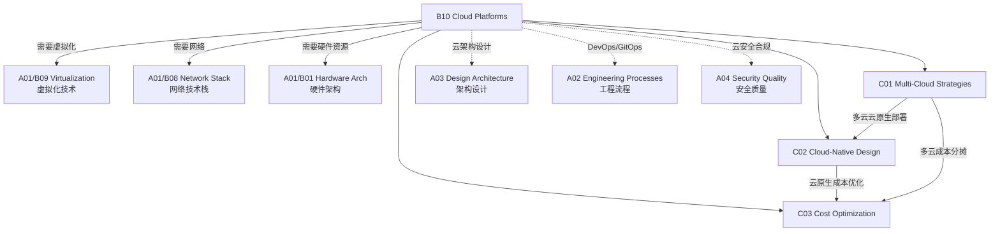

# B10 Cloud Platforms

**所属领域**: [A01_Infrastructure](../readme.md)
**创建日期**: 2026-01-30
**最后更新**: 2026-01-30

## 📋 子领域定位

云平台是现代 IT 基础设施的核心载体，提供按需获取、弹性扩展、按量付费的计算资源服务。随着企业数字化转型的深入，多云和混合云策略已成为主流，云架构师需要掌握跨云资源管理、云原生应用设计和 FinOps 成本优化等关键能力。

本领域涵盖三大核心方向：多云管理策略（跨云架构设计、供应商锁定避免）、云原生设计模式（微服务、容器化、Serverless）和成本优化（FinOps 实践、资源右调整、Spot 实例策略）。随着 AI 工作负载和主权云的兴起，云平台正在向智能化、合规化和行业化方向发展。

**核心关注点**：
- **多云管理**: 跨云架构、云间网络互联、统一身份认证、灾难恢复
- **云原生设计**: 12-Factor App、微服务架构、容器编排、GitOps
- **成本优化**: FinOps 框架、成本可视化、自动优化、预算告警

## 🗂️ 专项列表

### [C01. Multi-Cloud_Strategies](C01_Multi-Cloud_Strategies/README.md)

多云策略是企业避免供应商锁定、优化成本和提升韧性的关键。本专项详解多云架构模式（主动-主动、主动-被动、分层混合）、跨云网络互联方案（VPN、专线、SD-WAN）、统一身份与访问管理（IDaaS、SSO）、以及多云 Kubernetes 部署（Cluster API、Crossplane）。涵盖云间数据同步策略、跨云灾难恢复设计和云成本对比分析。

### [C02. Cloud-Native_Design](C02_Cloud-Native_Design/README.md)

云原生设计模式是现代应用开发的标准方法论。本专项深入 12-Factor App 原则、微服务拆分策略、容器化最佳实践、以及 Kubernetes 原生应用设计。涵盖服务网格（Istio/Linkerd）流量管理、GitOps 持续交付（ArgoCD/Flux）、可观测性三支柱（指标/日志/追踪）和云原生安全实践。

### [C03. Cost_Optimization](C03_Cost_Optimization/README.md)

云成本管理是云原生 FinOps 文化的核心。本专项覆盖云成本可视化（Kubecost/OpenCost）、资源右调整（Rightsizing）、Spot/Preemptible 实例策略、预留实例与 Savings Plans 优化、以及自动化成本治理（Cloud Custodian/Infracost）。探讨单位经济学分析、成本分摊（Showback/Chargeback）和预算告警机制。

## 🛠️ 技术栈概览

### 主流云平台服务

| 服务类型 | AWS | Azure | GCP | 阿里云 |
|----------|-----|-------|-----|--------|
| **计算 (VM)** | EC2 | Virtual Machines | Compute Engine | ECS |
| **容器编排** | EKS | AKS | GKE | ACK |
| **无服务器** | Lambda | Functions | Cloud Functions | 函数计算 |
| **对象存储** | S3 | Blob Storage | Cloud Storage | OSS |
| **托管数据库** | RDS | Azure SQL | Cloud SQL | RDS |
| **缓存** | ElastiCache | Cache for Redis | Memorystore | Redis 企业版 |
| **负载均衡** | ALB/NLB | Load Balancer | Cloud LB | SLB |
| **消息队列** | SQS/SNS | Service Bus | Pub/Sub | MNS |
| **IAM** | AWS IAM | Entra ID | Cloud IAM | RAM |

### 多云管理工具

| 工具 | 类型 | 说明 |
|------|------|------|
| **Terraform** | IaC | 多云基础设施即代码 |
| **Pulumi** | IaC | 编程式基础设施定义 |
| **Crossplane** | 控制平面 | K8s 风格多云资源管理 |
| **Rancher** | K8s 管理 | 多集群 Kubernetes 平台 |
| **Anthos** | 混合云 | Google 多云应用平台 |
| **Azure Arc** | 混合云 | Azure 混合云管理 |

### FinOps 工具链

| 工具 | 功能 | 支持平台 |
|------|------|----------|
| **Kubecost** | K8s 成本分析 | AWS/Azure/GCP/On-prem |
| **OpenCost** | 开源成本监控 | 多云 K8s |
| **CloudHealth** | 云成本管理 | AWS/Azure/GCP |
| **Infracost** | IaC 成本估算 | Terraform |
| **Cloud Custodian** | 资源治理 | AWS/Azure/GCP |

## 💼 实践案例索引

### 案例 1: 多云灾备架构

**场景**: 金融核心系统跨 AWS/Azure 双活部署

**架构设计**:
```
┌─────────────────────────────────────────────────────────────────────┐
│                         全局流量管理 (Route 53 + Traffic Manager)       │
└─────────────────────────────┬───────────────────────────────────────┘
                              │
              ┌───────────────┼───────────────┐
              ▼               ▼               ▼
    ┌─────────────────┐ ┌─────────────────┐ ┌─────────────────┐
    │   AWS 主区域     │ │   Azure 主区域   │ │   阿里云灾备区    │
    │   (us-east-1)   │ │  (East US)      │ │  (华东 1)       │
    ├─────────────────┤ ├─────────────────┤ ├─────────────────┤
    │  EKS (Primary)  │ │  AKS (Primary)  │ │  ACK (Standby)  │
    │  RDS (Primary)  │ │  Azure SQL      │ │  RDS (Replica)  │
    │  ElastiCache    │ │  Cache for Redis│ │  Redis 企业版    │
    │  ALB            │ │  App Gateway    │ │  SLB            │
    └─────────────────┘ └─────────────────┘ └─────────────────┘
             │                   │                   │
             └───────────────────┴───────────────────┘
                                 │
                    ┌────────────▼────────────┐
                    │    跨云数据同步层         │
                    │  (DMS + Data Sync)      │
                    │  RPO: < 5s, RTO: < 5min │
                    └─────────────────────────┘
```

**关键指标**:
| 指标 | 目标 | 实现方案 |
|------|------|----------|
| RTO | < 5分钟 | DNS 自动切换 + 预热备用集群 |
| RPO | < 5秒 | 同步复制 + 跨区域数据库只读副本 |
| 可用性 | 99.999% | 三云部署 + 自动故障转移 |

### 案例 2: 云原生改造 6 阶段路径

**场景**: 传统单体应用云原生转型

**演进路线**:
```
阶段 1: 容器化          阶段 2: K8s 化          阶段 3: 微服务化
┌─────────────┐        ┌─────────────┐        ┌─────────────┐
│ 单体应用     │   →    │ Pod 部署     │   →    │ 服务拆分     │
│ Dockerfile  │        │ Helm Chart  │        │ DDD 领域设计  │
└─────────────┘        └─────────────┘        └─────────────┘

阶段 4: 可观测性         阶段 5: GitOps          阶段 6: FinOps
┌─────────────┐        ┌─────────────┐        ┌─────────────┐
│ Prometheus  │   →    │ ArgoCD      │   →    │ Kubecost    │
│ Grafana     │        │ Flux        │        │ 自动扩缩容   │
│ Jaeger      │        │ 声明式交付   │        │ Spot 实例   │
└─────────────┘        └─────────────┘        └─────────────┘
```

**各阶段产出**:
| 阶段 | 技术投入 | 业务收益 |
|------|----------|----------|
| 容器化 | 2 人月 | 部署时间 -70% |
| K8s 化 | 3 人月 | 资源利用率 +40% |
| 微服务化 | 6 人月 | 故障隔离，迭代速度 +50% |
| 可观测性 | 2 人月 | MTTR -60% |
| GitOps | 1 人月 | 发布频率 +300% |
| FinOps | 持续 | 云成本 -35% |

### 案例 3: FinOps 成本优化实践

**场景**: 降低云成本 40%+

**优化措施**:
| 维度 | 措施 | 节省比例 |
|------|------|----------|
| **右调整** | 基于 CloudWatch 数据下调过度配置 EC2 | 25% |
| **Spot 实例** | 无状态工作负载使用 Spot (60% 折扣) | 35% |
| **存储分层** | S3 Intelligent-Tiering + 生命周期策略 | 40% |
| **预留实例** | 稳态负载购买 Savings Plans (1年) | 30% |
| **自动伸缩** | HPA + Cluster Autoscaler | 20% |
| **闲置清理** | Cloud Custodian 自动标记未使用资源 | 15% |

**FinOps 流程**:
```
┌─────────┐    ┌─────────┐    ┌─────────┐    ┌─────────┐
│ 成本可见 │ → │ 优化分析 │ → │ 执行优化 │ → │ 持续监控 │
│ 标签策略 │    │ 右调整   │    │ 自动脚本 │    │ 预算告警 │
│ 团队分摊 │    │ Spot 策略│    │ 预留购买 │    │ 异常检测 │
└─────────┘    └─────────┘    └─────────┘    └─────────┘
```

## 🔗 知识关联图谱



## 📖 学习资源

### 推荐书籍

| 书名 | 作者 | 说明 |
|------|------|------|
| 《Cloud Native Patterns》 | Cornelia Davis | 云原生设计模式 |
| 《Kubernetes Best Practices》 | Brendan Burns | K8s 最佳实践 |
| 《FinOps Foundation》 | J.R. Storment | 云财务管理 |
| 《Cloud FinOps》 | FinOps Foundation | FinOps 实践指南 |
| 《Multi-Cloud Architecture》 | Jeroen Mulder | 多云架构设计 |

### 云平台认证

| 认证 | 平台 | 链接 |
|------|------|------|
| AWS Solutions Architect | AWS | https://aws.amazon.com/certification/certified-solutions-architect-associate/ |
| Azure Solutions Architect | Azure | https://learn.microsoft.com/credentials/certifications/azure-solutions-architect/ |
| GCP Cloud Architect | GCP | https://cloud.google.com/certification/cloud-architect |
| CKA/CKAD | Kubernetes | https://www.cncf.io/certification/cka/ |
| FinOps Certified | FinOps Foundation | https://www.finops.org/certification/ |

### 官方文档中心

| 资源 | 链接 |
|------|------|
| AWS Architecture Center | https://aws.amazon.com/architecture |
| Azure Architecture Center | https://learn.microsoft.com/azure/architecture |
| Google Cloud Architecture | https://cloud.google.com/architecture |
| 阿里云解决方案 | https://www.aliyun.com/solution |
| CNCF Cloud Native Landscape | https://landscape.cncf.io |
| Kubernetes Docs | https://kubernetes.io/docs |

### 技术博客

| 博客 | 链接 | 说明 |
|------|------|------|
| AWS News Blog | https://aws.amazon.com/blogs/aws/ | AWS 产品更新 |
| Azure Blog | https://azure.microsoft.com/blog/ | Azure 技术动态 |
| Google Cloud Blog | https://cloud.google.com/blog | GCP 最新特性 |
| Kubernetes Blog | https://kubernetes.io/blog/ | K8s 社区动态 |
| CNCF Blog | https://www.cncf.io/blog/ | 云原生生态 |
| FinOps Foundation | https://www.finops.org/blog/ | FinOps 实践 |

### 开源项目

| 项目 | GitHub | 说明 |
|------|--------|------|
| Kubernetes | https://github.com/kubernetes/kubernetes | 容器编排 |
| Terraform | https://github.com/hashicorp/terraform | 多云 IaC |
| Crossplane | https://github.com/crossplane/crossplane | 多云控制平面 |
| Kubecost | https://github.com/kubecost/cost-analyzer | K8s 成本分析 |
| OpenCost | https://github.com/opencost/opencost | 开源成本监控 |
| ArgoCD | https://github.com/argoproj/argo-cd | GitOps 工具 |

### 社区与活动

| 资源 | 链接 | 说明 |
|------|------|------|
| CNCF | https://www.cncf.io | 云原生计算基金会 |
| FinOps Foundation | https://www.finops.org | FinOps 社区 |
| KubeCon | https://events.linuxfoundation.org/kubecon-cloudnativecon-north-america/ | K8s 大会 |
| AWS re:Invent | https://reinvent.awsevents.com/ | AWS 年度大会 |
| Microsoft Ignite | https://ignite.microsoft.com | 微软技术大会 |

## 🔄 维护说明

- **内容审查**: 每季度检查云平台新服务和新区域上线情况
- **更新机制**: 跟踪主要云厂商产品发布周期，及时更新服务对照表
- **质量标准**: 所有价格信息需标注时效性，架构方案需经过生产验证
- **贡献方式**: 欢迎提交多云架构案例和 FinOps 优化经验
