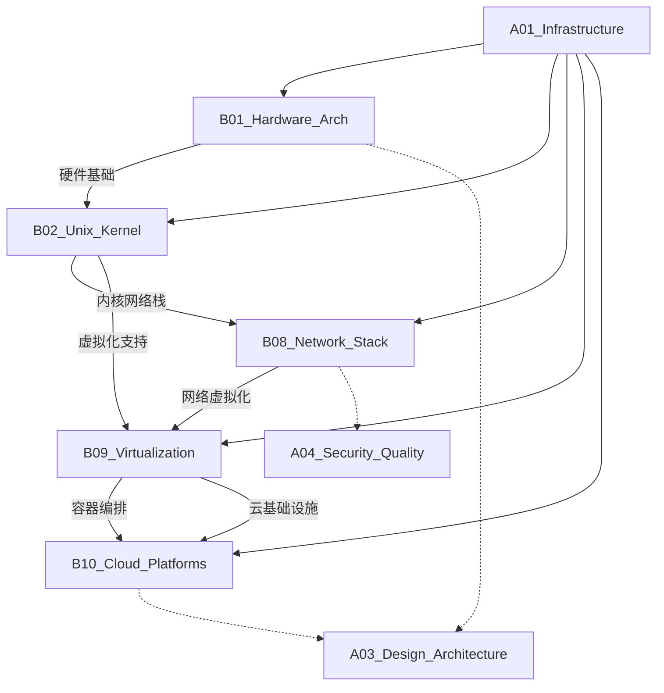

# A01_Infrastructure

**领域定位**: 硬件、操作系统、网络和云平台等底层技术
**创建日期**: 2026-01-30
**最后更新**: 2026-01-30

## 📋 领域概述

基础设施层是整个技术栈的基石，涵盖从物理硬件到云平台的所有底层技术。本领域关注系统性能、可靠性、可扩展性和成本效率，为上层应用提供稳定的运行环境。

**核心关注点**：
- **硬件架构**：服务器设计、边缘计算、能效优化
- **操作系统**：内核机制、进程管理、驱动开发
- **网络技术**：协议栈优化、SDN/NFV、零信任架构
- **虚拟化**：容器技术、Hypervisor、Serverless
- **云平台**：多云管理、云原生设计、成本控制

## 🗂️ 子领域结构

### [B01_Hardware_Arch](B01_Hardware_Arch/README.md)
**定位**：服务器架构设计、边缘计算部署、能效优化

涵盖 x86/ARM 架构对比、NUMA 架构优化、边缘计算节点设计、GPU/TPU 加速卡选型、能耗管理策略等内容。

### [B02_Unix_Kernel](B02_Unix_Kernel/README.md)
**定位**：内存管理机制、进程调度算法、驱动开发

深入 Linux/Unix 内核原理，包括虚拟内存管理、CFS 调度器、eBPF 技术、内核模块开发、系统调用优化等。

### [B08_Network_Stack](B08_Network_Stack/README.md)
**定位**：TCP/IP 性能优化、SDN/NFV 实现、零信任网络

覆盖网络协议栈深度优化、软件定义网络、网络功能虚拟化、零信任架构设计、高性能网络编程等。

### [B09_Virtualization](B09_Virtualization/README.md)
**定位**：Hypervisor 技术、容器运行时、Serverless 架构

包括 KVM/Xen 虚拟化、Docker/containerd 容器技术、Kubernetes 编排、Serverless 平台设计、轻量级虚拟化等。

### [B10_Cloud_Platforms](B10_Cloud_Platforms/README.md)
**定位**：多云管理策略、云原生设计模式、成本控制

涉及 AWS/Azure/GCP 平台特性、多云架构设计、云原生应用模式、FinOps 成本优化、云安全最佳实践等。

## 🔗 知识关联图谱

## 📚 学习路径建议

### 初级路径
**目标**：理解基础设施核心概念，掌握基本操作

1. **Linux 基础** (B02)
   - 文件系统与权限管理
   - 进程与线程概念
   - 基本网络配置

2. **容器入门** (B09)
   - Docker 基础操作
   - 镜像构建与管理
   - 容器网络基础

3. **云平台初探** (B10)
   - 云服务模型 (IaaS/PaaS/SaaS)
   - 基本资源管理
   - 云控制台操作

### 中级路径
**目标**：深入技术原理，具备架构设计能力

1. **内核机制** (B02)
   - 内存管理原理
   - 进程调度算法
   - 系统调用与性能分析

2. **网络深入** (B08)
   - TCP/IP 协议栈优化
   - 高性能网络编程
   - SDN 架构设计

3. **容器编排** (B09)
   - Kubernetes 架构与原理
   - 服务网格 (Service Mesh)
   - 容器安全加固

4. **云原生实践** (B10)
   - 微服务架构设计
   - 云原生应用模式
   - 多云架构策略

### 高级路径
**目标**：系统级优化，前沿技术探索

1. **硬件优化** (B01)
   - NUMA 架构调优
   - GPU/FPGA 加速
   - 边缘计算架构

2. **内核开发** (B02)
   - 内核模块开发
   - eBPF 高级应用
   - 实时系统优化

3. **网络前沿** (B08)
   - DPDK/XDP 高性能网络
   - 零信任网络架构
   - 网络可观测性

4. **Serverless 架构** (B09)
   - FaaS 平台设计
   - 冷启动优化
   - 事件驱动架构

5. **云平台深度** (B10)
   - FinOps 成本优化
   - 混合云架构
   - 云安全合规

## 📖 参考资源

### 核心资源

**书籍**：
- 《深入理解计算机系统》(CSAPP) - 系统基础必读
- 《Linux 内核设计与实现》- 内核原理经典
- 《UNIX 网络编程》- 网络编程圣经
- 《Kubernetes 权威指南》- 容器编排实战
- 《云原生架构白皮书》- 云原生设计指南

**在线资源**：
- Linux Kernel Documentation: https://www.kernel.org/doc/
- CNCF Cloud Native Landscape: https://landscape.cncf.io/
- AWS Well-Architected Framework: https://aws.amazon.com/architecture/well-architected/
- Kubernetes Documentation: https://kubernetes.io/docs/

**社区**：
- Linux Kernel Mailing List (LKML)
- CNCF Technical Oversight Committee
- Cloud Native Computing Foundation

### 扩展阅读

**性能优化**：
- 《Systems Performance: Enterprise and the Cloud》- Brendan Gregg
- 《BPF Performance Tools》- eBPF 性能分析

**网络技术**：
- 《TCP/IP Illustrated》- 协议栈详解
- 《Software Defined Networks》- SDN 架构

**云原生**：
- 《Cloud Native Patterns》- 云原生设计模式
- 《Production Kubernetes》- K8s 生产实践

**前沿技术**：
- USENIX ATC/OSDI 会议论文
- ACM SIGCOMM 网络技术论文
- KubeCon + CloudNativeCon 演讲

## 🔄 维护说明

- **内容更新频率**: 每季度审查一次
- **质量标准**: 确保所有子领域链接有效，内容准确完整
- **贡献方式**: 参见根目录 readme.md 中的贡献指南
