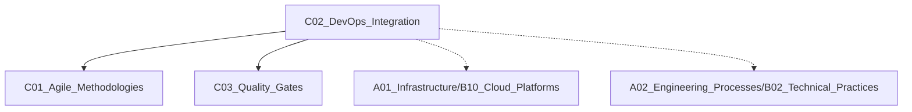

# C02 DevOps Integration

**所属子领域**: [B01_SDLC_Frameworks](../README.md)  
**创建日期**: 2026-01-30  
**最后更新**: 2026-01-30

## 📋 主题定位

DevOps 集成是将开发（Development）和运维（Operations）实践融合的方法论，通过自动化工具链、文化变革和流程优化，实现软件交付的高频、高质量和高可靠性。核心实践包括 CI/CD、基础设施即代码、监控反馈和持续改进。

## 🎯 核心概念

### DevOps 生命周期

```
┌──────────┐   ┌──────────┐   ┌──────────┐   ┌──────────┐
│   计划    │ → │   开发    │ → │   构建    │ → │   测试    │
│   Plan   │   │   Dev    │   │   Build  │   │   Test   │
└──────────┘   └──────────┘   └──────────┘   └──────────┘
                                              ↓
┌──────────┐   ┌──────────┐   ┌──────────┐   ┌──────────┐
│   监控    │ ← │   运维    │ ← │   部署    │ ← │   发布    │
│ Monitor  │   │   Operate│   │  Deploy  │   │  Release │
└──────────┘   └──────────┘   └──────────┘   └──────────┘
```

### CALMS 框架

| 维度 | 说明 | 实践 |
|------|------|------|
| **C**ulture | 协作文化 | 跨职能团队，共享责任 |
| **A**utomation | 自动化 | CI/CD, IaC, 自动化测试 |
| **L**ean | 精益 | 消除浪费，持续改进 |
| **M**easurement | 度量 | DORA 指标，可观测性 |
| **S**haring | 共享 | 知识分享，透明沟通 |

### DORA 核心指标

| 指标 | 定义 | 精英表现 |
|------|------|----------|
| **部署频率** | 代码部署到生产的频率 | 按需（每天多次） |
| **变更前置时间** | 提交到生产运行的时间 | < 1 小时 |
| **变更失败率** | 导致故障的变更比例 | < 5% |
| **服务恢复时间** | 故障到恢复的时间 | < 1 小时 |

## 🛠️ 技术实践

### 1. CI/CD 流水线（GitHub Actions）

```yaml
# .github/workflows/ci-cd.yml
name: CI/CD Pipeline

on:
  push:
    branches: [main, develop]
  pull_request:
    branches: [main]

env:
  REGISTRY: ghcr.io
  IMAGE_NAME: ${{ github.repository }}

jobs:
  # 阶段1: 代码质量检查
  lint-and-test:
    runs-on: ubuntu-latest
    steps:
      - uses: actions/checkout@v4
      
      - name: Set up Python
        uses: actions/setup-python@v4
        with:
          python-version: '3.11'
      
      - name: Cache dependencies
        uses: actions/cache@v3
        with:
          path: ~/.cache/pip
          key: ${{ runner.os }}-pip-${{ hashFiles('**/requirements.txt') }}
      
      - name: Install dependencies
        run: |
          pip install -r requirements.txt
          pip install black flake8 pytest coverage
      
      - name: Lint with Black
        run: black --check .
      
      - name: Lint with Flake8
        run: flake8 . --count --max-complexity=10
      
      - name: Run tests with coverage
        run: |
          coverage run -m pytest
          coverage xml
      
      - name: Upload coverage
        uses: codecov/codecov-action@v3
        with:
          file: ./coverage.xml

  # 阶段2: 安全扫描
  security-scan:
    runs-on: ubuntu-latest
    steps:
      - uses: actions/checkout@v4
      
      - name: Run Trivy vulnerability scanner
        uses: aquasecurity/trivy-action@master
        with:
          scan-type: 'fs'
          scan-ref: '.'
          format: 'sarif'
          output: 'trivy-results.sarif'
      
      - name: Upload scan results
        uses: github/codeql-action/upload-sarif@v2
        with:
          sarif_file: 'trivy-results.sarif'

  # 阶段3: 构建镜像
  build:
    needs: [lint-and-test, security-scan]
    runs-on: ubuntu-latest
    permissions:
      contents: read
      packages: write
    steps:
      - uses: actions/checkout@v4
      
      - name: Set up Docker Buildx
        uses: docker/setup-buildx-action@v3
      
      - name: Log in to Container Registry
        uses: docker/login-action@v3
        with:
          registry: ${{ env.REGISTRY }}
          username: ${{ github.actor }}
          password: ${{ secrets.GITHUB_TOKEN }}
      
      - name: Extract metadata
        id: meta
        uses: docker/metadata-action@v5
        with:
          images: ${{ env.REGISTRY }}/${{ env.IMAGE_NAME }}
          tags: |
            type=ref,event=branch
            type=ref,event=pr
            type=sha,prefix={{branch}}-
            type=raw,value=latest,enable={{is_default_branch}}
      
      - name: Build and push
        uses: docker/build-push-action@v5
        with:
          context: .
          push: true
          tags: ${{ steps.meta.outputs.tags }}
          labels: ${{ steps.meta.outputs.labels }}
          cache-from: type=gha
          cache-to: type=gha,mode=max

  # 阶段4: 部署到开发环境
  deploy-dev:
    needs: build
    if: github.ref == 'refs/heads/develop'
    runs-on: ubuntu-latest
    environment:
      name: development
      url: https://dev.example.com
    steps:
      - uses: actions/checkout@v4
      
      - name: Deploy to K8s
        run: |
          echo "${{ secrets.KUBECONFIG_DEV }}" | base64 -d > kubeconfig
          export KUBECONFIG=kubeconfig
          
          # 更新镜像
          kubectl set image deployment/app \
            app=${{ env.REGISTRY }}/${{ env.IMAGE_NAME }}:develop-${{ github.sha }} \
            -n dev
          
          # 等待部署完成
          kubectl rollout status deployment/app -n dev --timeout=5m

  # 阶段5: 生产部署（需要审批）
  deploy-prod:
    needs: build
    if: github.ref == 'refs/heads/main'
    runs-on: ubuntu-latest
    environment:
      name: production
      url: https://example.com
    steps:
      - uses: actions/checkout@v4
      
      - name: Deploy to Production
        run: |
          echo "${{ secrets.KUBECONFIG_PROD }}" | base64 -d > kubeconfig
          export KUBECONFIG=kubeconfig
          
          # 金丝雀部署
          kubectl apply -f k8s/canary/
          kubectl set image deployment/app-canary \
            app=${{ env.REGISTRY }}/${{ env.IMAGE_NAME }}:main-${{ github.sha }} \
            -n prod
```

### 2. 基础设施即代码（Terraform）

```hcl
# main.tf - AWS 基础设施
terraform {
  required_providers {
    aws = {
      source  = "hashicorp/aws"
      version = "~> 5.0"
    }
  }
  
  backend "s3" {
    bucket = "my-terraform-state"
    key    = "prod/terraform.tfstate"
    region = "us-east-1"
    encrypt = true
  }
}

provider "aws" {
  region = var.aws_region
  
  default_tags {
    tags = {
      Environment = var.environment
      Project     = var.project_name
      ManagedBy   = "terraform"
    }
  }
}

# VPC 网络
module "vpc" {
  source  = "terraform-aws-modules/vpc/aws"
  version = "5.0.0"
  
  name = "${var.project_name}-${var.environment}"
  cidr = var.vpc_cidr
  
  azs             = var.availability_zones
  private_subnets = var.private_subnet_cidrs
  public_subnets  = var.public_subnet_cidrs
  
  enable_nat_gateway = true
  single_nat_gateway = var.environment != "prod"
  
  enable_dns_hostnames = true
  enable_dns_support   = true
}

# EKS 集群
module "eks" {
  source  = "terraform-aws-modules/eks/aws"
  version = "19.0.0"
  
  cluster_name    = "${var.project_name}-${var.environment}"
  cluster_version = "1.28"
  
  vpc_id     = module.vpc.vpc_id
  subnet_ids = module.vpc.private_subnets
  
  eks_managed_node_groups = {
    general = {
      desired_size = var.node_desired_size
      min_size     = var.node_min_size
      max_size     = var.node_max_size
      
      instance_types = var.node_instance_types
      capacity_type  = var.environment == "prod" ? "ON_DEMAND" : "SPOT"
      
      labels = {
        workload = "general"
      }
    }
  }
}

# 输出
output "cluster_endpoint" {
  description = "EKS cluster endpoint"
  value       = module.eks.cluster_endpoint
}

output "cluster_name" {
  description = "EKS cluster name"
  value       = module.eks.cluster_name
}
```

### 3. 监控告警（Prometheus + Grafana）

```yaml
# prometheus-rules.yml
groups:
- name: app-alerts
  rules:
  # 高错误率告警
  - alert: HighErrorRate
    expr: |
      (
        sum(rate(http_requests_total{status=~"5.."}[5m]))
        /
        sum(rate(http_requests_total[5m]))
      ) > 0.05
    for: 2m
    labels:
      severity: critical
    annotations:
      summary: "High error rate detected"
      description: "Error rate is {{ $value | humanizePercentage }}"
  
  # 高延迟告警
  - alert: HighLatency
    expr: |
      histogram_quantile(0.95, 
        sum(rate(http_request_duration_seconds_bucket[5m])) by (le)
      ) > 2
    for: 5m
    labels:
      severity: warning
    annotations:
      summary: "High latency detected"
      description: "P95 latency is {{ $value }}s"
  
  # 服务不可用
  - alert: ServiceDown
    expr: up == 0
    for: 1m
    labels:
      severity: critical
    annotations:
      summary: "Service {{ $labels.job }} is down"
```

### 4. 特性开关（Feature Flags）

```python
# feature_flags.py
from dataclasses import dataclass
from typing import Dict, Callable
import json

@dataclass
class FeatureFlag:
    name: str
    enabled: bool
    rollout_percentage: int = 100
    user_ids: list = None
    
    def is_enabled_for(self, user_id: str = None) -> bool:
        if not self.enabled:
            return False
        
        if self.user_ids and user_id in self.user_ids:
            return True
        
        if user_id:
            # 基于用户ID的一致性哈希
            import hashlib
            hash_val = int(hashlib.md5(user_id.encode()).hexdigest(), 16)
            return (hash_val % 100) < self.rollout_percentage
        
        return True

class FeatureFlagManager:
    def __init__(self, config_source: Callable):
        self.config_source = config_source
        self._flags: Dict[str, FeatureFlag] = {}
        self._refresh()
    
    def _refresh(self):
        config = self.config_source()
        self._flags = {
            name: FeatureFlag(name=name, **cfg)
            for name, cfg in config.items()
        }
    
    def is_enabled(self, flag_name: str, user_id: str = None) -> bool:
        flag = self._flags.get(flag_name)
        if not flag:
            return False
        return flag.is_enabled_for(user_id)
    
    def get_all_flags(self, user_id: str = None) -> Dict[str, bool]:
        return {
            name: flag.is_enabled_for(user_id)
            for name, flag in self._flags.items()
        }

# 使用示例
flags = FeatureFlagManager(lambda: json.load(open('flags.json')))

# 检查特性开关
if flags.is_enabled('new_checkout_flow', user_id='user_123'):
    process_new_checkout()
else:
    process_legacy_checkout()
```

## 📚 资源索引

### 核心资源

1. **The DevOps Handbook**
   - Gene Kim 等著，DevOps 圣经

2. **Accelerate**
   - Nicole Forsgren 等著，DORA 研究总结

3. **Continuous Delivery**
   - Jez Humble 等著，持续交付经典

### 工具链

| 类别 | 工具 | 用途 |
|------|------|------|
| CI/CD | GitHub Actions, GitLab CI, Jenkins | 自动化流水线 |
| IaC | Terraform, Pulumi, CloudFormation | 基础设施管理 |
| 配置 | Ansible, Chef, Puppet | 配置管理 |
| 容器 | Docker, Kubernetes | 应用部署 |
| 监控 | Prometheus, Grafana, Datadog | 可观测性 |
| GitOps | ArgoCD, Flux | 持续交付 |

## 🔗 关联知识



## 🔄 维护说明

- **更新频率**: 跟踪 DORA 报告和 DevOps 趋势
- **质量标准**: 流水线配置经过生产验证
- **贡献方式**: 提交新的 DevOps 工具和最佳实践
