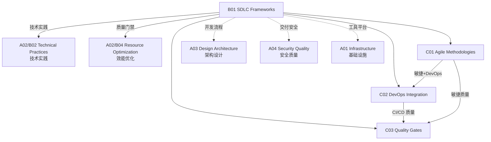

# B01 SDLC Frameworks

**所属领域**: [A02_Engineering_Processes](../readme.md)
**创建日期**: 2026-01-30
**最后更新**: 2026-01-30

## 📋 子领域定位

软件开发生命周期 (SDLC) 框架是组织软件工程活动的结构化方法论，决定了团队如何规划、设计、开发、测试和交付软件。随着敏捷思想的普及和 DevOps 文化的兴起，现代 SDLC 框架已经从瀑布式的顺序开发演进为迭代式、增量式的持续交付模式。

本领域涵盖三大核心方法论：敏捷方法论（Scrum、Kanban、XP）、DevOps 集成（CI/CD、GitOps、平台工程）和质量门禁（Definition of Done、Definition of Ready、阶段评审）。现代工程团队需要理解不同框架的适用场景，能够根据团队规模、产品特性和市场压力选择或定制合适的开发流程。

**核心关注点**：
- **敏捷实践**: Scrum 框架、Kanban 流管理、极限编程 (XP) 技术实践
- **DevOps 集成**: CI/CD 流水线、GitOps 交付模式、基础设施即代码
- **质量门禁**: DoD/DoR 定义、自动化质量检查、阶段门评审

## 🗂️ 专项列表

### [C01. Agile_Methodologies](C01_Agile_Methodologies/README.md)

敏捷方法论强调适应变化、快速交付和持续改进。本专项深入探讨 Scrum 框架（角色、事件、工件）、Kanban 流程管理（WIP 限制、累积流图）、以及极限编程 (XP) 的技术实践（结对编程、TDD、持续集成）。涵盖敏捷规模化框架（SAFe、LeSS、Spotify 模型）、敏捷成熟度评估和敏捷转型路径设计。

### [C02. DevOps_Integration](C02_DevOps_Integration/README.md)

DevOps 打破了开发与运维之间的壁垒，实现软件交付的全流程自动化。本专项详解 CI/CD 流水线设计（Jenkins/GitLab CI/GitHub Actions）、GitOps 交付模式（ArgoCD/Flux）、基础设施即代码（Terraform/Pulumi）、以及平台工程（内部开发者平台 IDP）。涵盖 DevOps 成熟度模型、DORA 指标度量和 DevOps 文化转型。

### [C03. Quality_Gates](C03_Quality_Gates/README.md)

质量门禁确保只有符合标准的软件才能进入下一阶段。本专项覆盖 Definition of Ready (DoR) 和 Definition of Done (DoD) 的制定、自动化代码质量检查（SonarQube/CodeClimate）、安全扫描（SAST/DAST/SCA）、以及发布审批流程。探讨基于策略的门禁（OPA）、A/B 测试和金丝雀发布策略。

## 🛠️ 技术栈概览

### 敏捷管理工具

| 工具 | 类型 | 特点 | 官网 |
|------|------|------|------|
| **Jira** | 项目管理 | 功能全面，生态丰富 | https://www.atlassian.com/software/jira |
| **Azure DevOps** | 全链路 | 微软生态集成 | https://azure.microsoft.com/services/devops/ |
| **Linear** | 现代敏捷 | 简洁高效，体验优秀 | https://linear.app |
| **Shortcut** | 敏捷专用 | 专为敏捷团队设计 | https://shortcut.com |
| **Trello** | 看板工具 | 简单直观 | https://trello.com |

### CI/CD 平台

| 平台 | 类型 | 特点 | 官网 |
|------|------|------|------|
| **GitHub Actions** | 托管 | 与 GitHub 深度集成 | https://github.com/features/actions |
| **GitLab CI** | 自托管/托管 | 一体化 DevOps 平台 | https://docs.gitlab.com/ee/ci/ |
| **Jenkins** | 自托管 | 生态最丰富，插件众多 | https://www.jenkins.io |
| **CircleCI** | 托管 | 快速，并行能力强 | https://circleci.com |
| **Argo Workflows** | K8s 原生 | 云原生 CI/CD | https://argoproj.github.io/workflows |
| **Drone CI** | 容器原生 | 轻量级，易配置 | https://www.drone.io |

### 质量门禁工具

| 工具 | 功能 | 支持语言 | 官网 |
|------|------|----------|------|
| **SonarQube** | 代码质量 | 多语言 | https://www.sonarqube.org |
| **CodeClimate** | 质量分析 | 多语言 | https://codeclimate.com |
| **Snyk** | 安全扫描 | 多语言/容器 | https://snyk.io |
| **Dependabot** | 依赖更新 | 多语言 | https://github.com/dependabot |
| **Semantic Pull Requests** | 提交规范 | Git | https://github.com/zeke/semantic-pull-requests |

### DevOps 指标平台

| 工具 | 功能 | 官网 |
|------|------|------|
| **DORA Metrics** | 效能度量标准 | https://cloud.google.com/blog/products/devops-sre/using-the-four-keys-to-measure-your-devops-performance |
| **Apache DevLake** | 开源效能平台 | https://devlake.apache.org |
| **LinearB** | 工程智能 | https://linearb.io |
| **Allstacks** | 价值流分析 | https://allstacks.com |
| **Swarmia** | 团队效能 | https://swarmia.com |

## 💼 实践案例索引

### 案例 1: 敏捷转型之路 - 从瀑布到 Scrum

**背景**: 传统软件团队（50 人）向敏捷转型

**转型阶段**:
```
阶段 1 (1-2月): 培训与试点
├── Scrum Master 认证培训
├── 选择 2 个试点团队
├── 建立产品待办列表
└── 每日站会 + 双周迭代

阶段 2 (3-6月): 全面推广
├── 所有团队采用 Scrum
├── 建立部落 (Tribe) 结构
├── 引入 Kanban 管理流动
└── 实施敏捷度量

阶段 3 (6-12月): 优化与扩展
├── 引入 SAFe 规模化框架
├── 建立 Communities of Practice
├── 敏捷成熟度评估
└── 持续改进文化
```

**关键成果**:
| 指标 | 转型前 | 转型后 | 提升 |
|------|--------|--------|------|
| 发布频率 | 季度 | 双周 | 6x |
| 需求交付周期 | 3个月 | 2周 | 6x |
| 缺陷密度 | 2.5/KLOC | 0.8/KLOC | 68%↓ |
| 团队满意度 | 5.2/10 | 7.8/10 | 50%↑ |

### 案例 2: 企业级 CI/CD 流水线设计

**场景**: 多语言微服务架构的持续交付

**流水线架构**:
```yaml
# .github/workflows/main.yml 示例
name: Enterprise CI/CD

on:
  push:
    branches: [main, develop]
  pull_request:
    branches: [main]

jobs:
  # 阶段 1: 代码质量门禁
  quality-gate:
    runs-on: ubuntu-latest
    steps:
      - uses: actions/checkout@v4
      - name: Lint
        run: make lint
      - name: Unit Tests
        run: make test-unit
      - name: SonarQube Scan
        uses: sonarqube-quality-gate-action@master
      - name: Snyk Security Scan
        uses: snyk/actions/node@master

  # 阶段 2: 构建与镜像推送
  build:
    needs: quality-gate
    runs-on: ubuntu-latest
    steps:
      - name: Build Image
        run: docker build -t app:${{ github.sha }} .
      - name: Push to Registry
        run: docker push app:${{ github.sha }}

  # 阶段 3: 集成测试
  integration-test:
    needs: build
    runs-on: ubuntu-latest
    steps:
      - name: Deploy to Test Env
        run: helm upgrade --install app ./chart
      - name: Run Integration Tests
        run: make test-integration
      - name: Performance Tests
        run: k6 run load-test.js

  # 阶段 4: 安全扫描
  security-scan:
    needs: build
    runs-on: ubuntu-latest
    steps:
      - name: Container Scan
        uses: aquasecurity/trivy-action@master
        with:
          image-ref: 'app:${{ github.sha }}'
      - name: SAST
        uses: returntocorp/semgrep-action@v1

  # 阶段 5: 生产部署 (GitOps)
  deploy:
    needs: [integration-test, security-scan]
    runs-on: ubuntu-latest
    steps:
      - name: Update GitOps Repo
        run: |
          git clone gitops-repo
          cd gitops-repo && kustomize edit set image app:${{ github.sha }}
          git commit -m "deploy: ${{ github.sha }}"
          git push
```

**效能指标 (DORA)**:
| 指标 | 目标 | 实际 |
|------|------|------|
| 部署频率 | 按需 | 每日 20+ 次 |
| 变更前置时间 | < 1天 | 2 小时 |
| 变更失败率 | < 15% | 8% |
| 恢复时间 | < 1小时 | 15 分钟 |

### 案例 3: 质量门禁体系设计

**场景**: 金融级软件质量保障

**门禁层级**:
```
┌─────────────────────────────────────────────────────────────────┐
│                        质量门禁体系                              │
├──────────────┬──────────────┬──────────────┬────────────────────┤
│   DoR 门禁    │   代码门禁    │   构建门禁   │    发布门禁        │
├──────────────┼──────────────┼──────────────┼────────────────────┤
│ ✓ 需求清晰    │ ✓ Lint 通过  │ ✓ 单元测试   │ ✓ 集成测试通过     │
│ ✓ 验收标准    │ ✓ 单元测试   │ ✓ 安全扫描   │ ✓ 性能基线达标     │
│ ✓ 技术方案    │ ✓ 代码评审   │ ✓ 代码覆盖率  │ ✓ 合规检查通过     │
│ ✓ 依赖就绪    │ ✓ 复杂度检查  │ ✓ 镜像扫描   │ ✓ 发布审批         │
└──────────────┴──────────────┴──────────────┴────────────────────┘
```

**门禁配置**:
```yaml
# SonarQube 质量门配置
qualitygate:
  conditions:
    - metric: coverage
      threshold: "80"
      operator: GT
    - metric: duplicated_lines_density
      threshold: "3"
      operator: LT
    - metric: critical_violations
      threshold: "0"
      operator: EQ
    - metric: security_rating
      threshold: "1"
      operator: EQ
```

## 🔗 知识关联图谱



## 📖 学习资源

### 推荐书籍

| 书名 | 作者 | 说明 |
|------|------|------|
| 《敏捷软件开发：原则、模式与实践》 | Robert Martin | 敏捷技术实践 |
| 《Scrum 指南》 | Schwaber & Sutherland | Scrum 官方指南 |
| 《持续交付》 | Jez Humble | CI/CD 圣经 |
| 《Accelerate》 | Nicole Forsgren | DevOps 科学研究 |
| 《Team Topologies》 | Matthew Skelton | 团队拓扑 |
| 《The DevOps Handbook》 | Gene Kim | DevOps 实践手册 |

### 在线课程

| 课程 | 平台 | 链接 |
|------|------|------|
| Agile Planning for Software Products | Coursera | https://www.coursera.org/learn/agile-planning |
| Continuous Delivery & DevOps | Coursera | https://www.coursera.org/learn/continuous-delivery |
| DevOps Culture and Mindset | Coursera | https://www.coursera.org/learn/devops-culture-and-mindset |
| DORA 研究 | Google Cloud | https://cloud.google.com/devops |

### 官方资源

| 资源 | 链接 | 说明 |
|------|------|------|
| Scrum Guide | https://scrumguides.org | Scrum 官方指南 |
| Agile Manifesto | https://agilemanifesto.org | 敏捷宣言 |
| DevOps Roadmap | https://roadmap.sh/devops | DevOps 学习路线 |
| DORA Metrics | https://dora.dev | DevOps 研究与评估 |
| State of DevOps Report | https://cloud.google.com/devops/state-of-devops | 年度 DevOps 报告 |

### 社区与组织

| 组织 | 链接 | 说明 |
|------|------|------|
| Scrum Alliance | https://www.scrumalliance.org | Scrum 认证机构 |
| Scaled Agile (SAFe) | https://www.scaledagile.com | SAFe 框架 |
| DevOps Institute | https://www.devopsinstitute.com | DevOps 认证 |
| Continuous Delivery Foundation | https://cd.foundation | CD 基金会 |

### 开源项目

| 项目 | GitHub | 说明 |
|------|--------|------|
| Jenkins | https://github.com/jenkinsci/jenkins | CI/CD 服务器 |
| GitLab | https://github.com/gitlabhq/gitlabhq | DevOps 平台 |
| ArgoCD | https://github.com/argoproj/argo-cd | GitOps 工具 |
| Tekton | https://github.com/tektoncd/pipeline | K8s 原生 CI/CD |
| SonarQube | https://github.com/SonarSource/sonarqube | 代码质量管理 |

## 🔄 维护说明

- **内容审查**: 每季度更新工具链版本和最佳实践
- **更新机制**: 跟踪 DORA 年度报告和敏捷社区发展
- **质量标准**: 确保方法论引用最新版本（如 Scrum Guide 2020）
- **贡献方式**: 欢迎提交团队转型案例和工具评测
