# B02_Technical_Practices

**所属领域**: [A02_Engineering_Processes](../readme.md)
**创建日期**: 2026-01-30
**最后更新**: 2026-01-30

## 📋 子领域定位

工程技术实践与代码质量领域，涵盖代码工艺、自动化策略、文档运维等核心方向。从编码规范到CI/CD流水线，构建高质量软件交付体系，提升团队工程效率与代码可维护性。

**核心价值**：
- 建立统一的代码质量标准
- 提升开发效率与交付速度
- 降低技术债务与维护成本
- 促进知识沉淀与团队协作

## 🗂️ 专项列表

### [C01. Code_Craftsmanship](C01_Code_Craftsmanship/README.md)

代码工艺关注代码质量与可维护性，涵盖编码规范、代码审查、重构技巧、设计原则（SOLID）等核心实践。包括静态代码分析、代码度量、技术债务管理等工程化方法，以及Clean Code、TDD等开发理念。

### [C02. Automation_Strategy](C02_Automation_Strategy/README.md)

自动化策略通过工具与流程提升效率，涵盖CI/CD流水线、自动化测试、自动化部署、基础设施即代码（IaC）等核心技术。包括GitLab CI、Jenkins、GitHub Actions等工具实践，以及质量门禁、发布策略等流程设计。

### [C03. Documentation_Ops](C03_Documentation_Ops/README.md)

文档运维将文档视为代码进行管理，涵盖文档即代码（Docs as Code）、API文档生成、架构决策记录（ADR）、知识库建设等实践。包括Markdown、AsciiDoc、Swagger等工具，以及文档版本管理、自动化发布等流程。

## 🛠️ 技术栈概览

### 核心技术
- **代码质量**: 编码规范、代码审查、静态分析、代码度量、重构
- **CI/CD**: 持续集成、持续交付、持续部署、流水线即代码
- **自动化测试**: 单元测试、集成测试、E2E测试、性能测试、安全测试
- **基础设施即代码**: Terraform、Ansible、CloudFormation、Pulumi
- **版本控制**: Git工作流、分支策略、代码合并、冲突解决
- **质量门禁**: 覆盖率检查、漏洞扫描、性能基准、合规检查

### 工具链
- **CI/CD平台**: GitLab CI、GitHub Actions、Jenkins、CircleCI、Travis CI
- **代码质量**: SonarQube、ESLint、Pylint、Checkstyle、RuboCop
- **测试框架**: Jest、Pytest、JUnit、Mocha、Cypress、Selenium
- **代码审查**: Gerrit、Crucible、Review Board、Phabricator
- **文档工具**: Docusaurus、MkDocs、Sphinx、GitBook、VuePress
- **API文档**: Swagger/OpenAPI、Postman、Redoc、Stoplight

### 框架与库
- **测试工具**: TestNG、RSpec、Jasmine、Karma、Puppeteer
- **Mock工具**: Mockito、WireMock、Sinon.js、unittest.mock
- **覆盖率**: JaCoCo、Istanbul、Coverage.py、SimpleCov
- **性能测试**: JMeter、Gatling、Locust、k6、Artillery
- **IaC工具**: Terraform、Ansible、Chef、Puppet、SaltStack
- **容器化**: Docker、Docker Compose、Buildah、Kaniko

## 💼 实践案例索引

1. **DevOps流水线建设**
   - CI流程：代码提交触发自动构建与测试
   - CD流程：自动部署到测试/生产环境
   - 质量门禁：覆盖率≥80%、无高危漏洞

2. **代码质量提升实践**
   - 静态分析：SonarQube集成到CI流水线
   - 代码审查：强制Code Review + 自动化检查
   - 技术债务：定期重构与代码清理

3. **自动化测试体系**
   - 单元测试：Jest + 覆盖率报告
   - 集成测试：Testcontainers模拟依赖
   - E2E测试：Cypress自动化UI测试

4. **文档即代码实践**
   - API文档：OpenAPI规范 + Swagger UI
   - 架构文档：ADR记录架构决策
   - 知识库：Docusaurus构建团队Wiki

5. **基础设施即代码**
   - 环境管理：Terraform管理云资源
   - 配置管理：Ansible自动化配置
   - 版本控制：基础设施代码Git管理

## 🔗 关联知识

## 📖 学习资源

### 推荐书籍
1. **《代码整洁之道》** - Robert C. Martin
   - Clean Code经典著作，代码质量圣经

2. **《重构：改善既有代码的设计》** - Martin Fowler
   - 重构技巧与模式系统讲解

3. **《持续交付》** - Jez Humble
   - CI/CD理论与实践权威指南

4. **《测试驱动开发》** - Kent Beck
   - TDD方法论与实践

5. **《凤凰项目》** - Gene Kim
   - DevOps理念小说化呈现

6. **《Google软件工程》** - Titus Winters等
   - Google工程实践经验总结

7. **《Terraform: Up & Running》** - Yevgeniy Brikman
   - IaC实战指南

### 在线课程
1. **Clean Code** - Udemy
   - Robert C. Martin代码整洁之道课程

2. **CI/CD with GitLab** - GitLab
   - GitLab CI/CD官方教程

3. **Test Automation University** - Applitools
   - 自动化测试免费课程

4. **Infrastructure as Code** - Pluralsight
   - Terraform与Ansible实战

5. **DevOps Foundations** - LinkedIn Learning
   - DevOps基础与最佳实践

### 技术博客
1. **Martin Fowler's Blog** - https://martinfowler.com
   - 重构、CI/CD、微服务等深度文章

2. **ThoughtWorks Insights** - https://www.thoughtworks.com/insights
   - 技术雷达与工程实践

3. **Google Testing Blog** - https://testing.googleblog.com
   - Google测试工程实践

4. **Atlassian DevOps Blog** - https://www.atlassian.com/devops
   - DevOps工具与实践

5. **GitLab Blog** - https://about.gitlab.com/blog
   - CI/CD与DevOps最佳实践

6. **HashiCorp Blog** - https://www.hashicorp.com/blog
   - IaC与云基础设施

7. **Continuous Delivery** - https://continuousdelivery.com
   - Jez Humble的持续交付博客

## 🔄 维护说明

- **内容审查**: 每月检查链接有效性
- **更新机制**: 发现新技术或最佳实践时及时更新
- **质量标准**: 确保所有专项主题内容完整且准确
