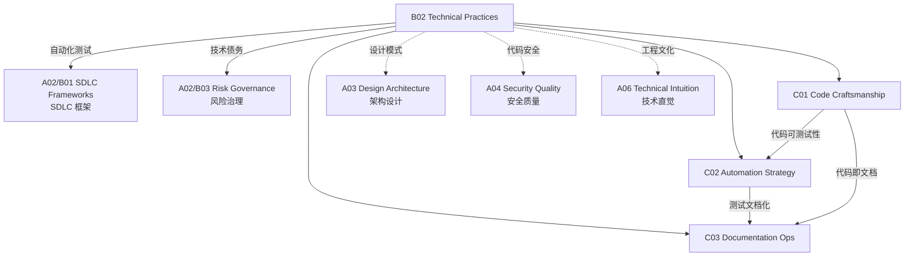

# B02 Technical Practices

**所属领域**: [A02_Engineering_Processes](../readme.md)
**创建日期**: 2026-01-30
**最后更新**: 2026-01-30

## 📋 子领域定位

技术实践是软件工程的核心能力，决定了代码质量、系统可维护性和团队生产效率。随着软件系统日益复杂，工程团队需要掌握从代码编写到系统设计的全方位技术实践，包括代码规范、重构技巧、自动化策略和文档管理。

本领域涵盖三大核心方向：代码工艺（Clean Code、重构、设计模式）、自动化策略（测试自动化、构建自动化、部署自动化）和文档运维（架构决策记录、API 文档、知识库管理）。现代工程师应当将质量内建于开发过程的每个环节，实现"一次做对"的工程文化。

**核心关注点**：
- **代码工艺**: Clean Code 原则、重构技术、代码审查、技术债务管理
- **自动化策略**: TDD/BDD、自动化测试金字塔、持续集成、IaC
- **文档运维**: ADR 架构决策、文档即代码、API 文档、知识管理

## 🗂️ 专项列表

### [C01. Code_Craftsmanship](C01_Code_Craftsmanship/README.md)

代码工艺关注如何编写高质量、可维护的代码。本专项深入探讨 Clean Code 原则（命名、函数、注释、格式）、代码重构技术（坏味道识别、重构手法）、设计模式应用和代码审查最佳实践。涵盖技术债务识别与管理、代码复杂度度量（圈复杂度、认知复杂度）和遗留代码改善策略。

### [C02. Automation_Strategy](C02_Automation_Strategy/README.md)

自动化是提升工程效能的关键杠杆。本专项详解测试自动化金字塔（单元/集成/E2E 测试）、TDD/BDD 开发模式、持续集成最佳实践、以及基础设施即代码（Terraform/Pulumi/CloudFormation）。涵盖自动化测试设计原则、测试数据管理、Mock/Stub 技术和并行测试策略。

### [C03. Documentation_Ops](C03_Documentation_Ops/README.md)

文档是软件系统的重要组成部分。本专项覆盖架构决策记录 (ADR) 方法论、文档即代码实践（Markdown/AsciiDoc）、API 文档工具（OpenAPI/Swagger、API Blueprint）、以及技术知识库管理。探讨文档驱动开发、文档版本控制、文档质量度量和知识共享文化。

## 🛠️ 技术栈概览

### 代码质量工具

| 工具 | 功能 | 支持语言 | 官网 |
|------|------|----------|------|
| **SonarQube** | 代码质量平台 | 多语言 | https://www.sonarqube.org |
| **ESLint** | JS/TS 代码检查 | JavaScript/TypeScript | https://eslint.org |
| **Pylint** | Python 代码检查 | Python | https://pylint.pycqa.org |
| **RuboCop** | Ruby 代码检查 | Ruby | https://rubocop.org |
| **Checkstyle** | Java 代码规范 | Java | https://checkstyle.org |
| **SpotBugs** | Java Bug 检测 | Java | https://spotbugs.github.io |

### 测试框架

| 框架 | 语言 | 类型 | 官网 |
|------|------|------|------|
| **JUnit** | Java | 单元测试 | https://junit.org |
| **pytest** | Python | 单元/集成测试 | https://pytest.org |
| **Jest** | JavaScript | 全栈测试 | https://jestjs.io |
| **Cypress** | JavaScript | E2E 测试 | https://www.cypress.io |
| **Playwright** | 多语言 | E2E 测试 | https://playwright.dev |
| **Ginkgo** | Go | BDD 测试 | https://onsi.github.io/ginkgo |
| **K6** | JavaScript | 负载测试 | https://k6.io |

### 文档工具

| 工具 | 用途 | 官网 |
|------|------|------|
| **MkDocs** | 静态文档站点 | https://www.mkdocs.org |
| **Docusaurus** | React 文档站点 | https://docusaurus.io |
| **VuePress** | Vue 文档站点 | https://vuepress.vuejs.org |
| **Swagger UI** | API 文档展示 | https://swagger.io/tools/swagger-ui |
| **Redoc** | OpenAPI 文档 | https://redocly.github.io/redoc |
| **PlantUML** | 架构图绘制 | https://plantuml.com |
| **Mermaid** | Markdown 图表 | https://mermaid.js.org |

## 💼 实践案例索引

### 案例 1: Clean Code 实践指南

**命名规范**:
```java
// ❌ 不好的命名
int d; //  elapsed time in days
void getData();
List<int[]> list1;

// ✅ 好的命名
int elapsedTimeInDays;
void fetchUserProfile();
List<Cell[]> gameBoardRows;
```

**函数设计**:
```java
// ❌ 函数过长，职责过多
public void processUserData() {
    // 200+ lines of code
    // validation + database + email + logging
}

// ✅ 单一职责，清晰命名
public User createUser(UserRegistrationRequest request) {
    validateRegistration(request);
    User user = userRepository.save(toUser(request));
    eventPublisher.publish(new UserCreatedEvent(user));
    return user;
}
```

**代码审查清单**:
- [ ] 命名是否清晰表达意图？
- [ ] 函数是否只做一件事？
- [ ] 是否有重复代码？
- [ ] 注释是否必要且最新？
- [ ] 错误处理是否完善？
- [ ] 单元测试是否覆盖？

### 案例 2: 测试自动化金字塔

**测试分层策略**:
```
        /\
       /  \
      / E2E\      <- 少量 (10%) - 用户旅程测试
     /________\
    /          \
   / Integration \  <- 中量 (30%) - 服务集成测试
  /______________\
 /                \
/     Unit Tests   \ <- 大量 (60%) - 快速反馈
/____________________\
```

**单元测试示例** (pytest):
```python
# test_calculator.py
import pytest
from calculator import Calculator

class TestCalculator:
    @pytest.fixture
    def calc(self):
        return Calculator()
    
    def test_add_two_numbers(self, calc):
        # Arrange
        a, b = 2, 3
        
        # Act
        result = calc.add(a, b)
        
        # Assert
        assert result == 5
    
    @pytest.mark.parametrize("a,b,expected", [
        (1, 1, 2),
        (0, 0, 0),
        (-1, 1, 0),
        (100, 200, 300),
    ])
    def test_add_various_numbers(self, calc, a, b, expected):
        assert calc.add(a, b) == expected
```

**TDD 循环**:
```
┌─────────────────────────────────────────────┐
│              TDD 红绿重构循环                │
│                                             │
│  ┌──────┐    ┌──────┐    ┌──────┐         │
│  │  Red │ → │ Green│ → │Refactor│         │
│  │编写失败测试│  │ 编写最小代码 │  │ 改进代码质量 │         │
│  └──────┘    └──────┘    └──────┘         │
│       ↑_________________________|         │
└─────────────────────────────────────────────┘
```

### 案例 3: ADR 架构决策记录

**ADR 模板**:
```markdown
# ADR-001: 采用微服务架构

## 状态
Accepted

## 背景
当前单体应用面临扩展性和维护性挑战，团队规模从 10 人增长到 50 人。

## 决策
采用微服务架构，服务按业务领域拆分。

## 后果
### 正面
- 团队可独立部署和扩展
- 技术栈可按服务选择
- 故障隔离性增强

### 负面
- 分布式系统复杂性增加
- 需要服务网格和可观测性投入
- 数据一致性挑战

## 替代方案
- 模块化单体：短期内可行，长期仍有瓶颈
- Serverless：不适合长连接和复杂业务逻辑

## 参考
- https://martinfowler.com/articles/microservices.html
```

**ADR 管理流程**:
```
┌─────────────────────────────────────────────────────────────┐
│                     ADR 生命周期                             │
├─────────┬─────────┬─────────┬─────────┬─────────────────────┤
│ Proposed│ 讨论评审 │ Accepted│ Deprecated│ Superseded        │
│  提出    │  收集反馈 │  采纳   │   弃用    │  被新版本替代       │
└─────────┴─────────┴─────────┴─────────┴─────────────────────┘
```

## 🔗 知识关联图谱



## 📖 学习资源

### 推荐书籍

| 书名 | 作者 | 说明 |
|------|------|------|
| 《Clean Code》 | Robert C. Martin | 代码整洁之道 |
| 《Refactoring》 | Martin Fowler | 重构改善代码 |
| 《Test-Driven Development》 | Kent Beck | TDD 经典 |
| 《Working Effectively with Legacy Code》 | Michael Feathers | 遗留代码处理 |
| 《Documentation as Code》 | Docs-as-code Community | 文档即代码 |

### 在线课程

| 课程 | 平台 | 链接 |
|------|------|------|
| Clean Code | Udemy | https://www.udemy.com/course/writing-clean-code |
| Test-Driven Development | Coursera | https://www.coursera.org/learn/test-driven-development |
| Software Testing | Coursera | https://www.coursera.org/specializations/software-testing |

### 技术资源

| 资源 | 链接 | 说明 |
|------|------|------|
| Clean Code Cheat Sheet | https://www.planetgeek.ch/wp-content/uploads/2014/11/Clean-Code-V2.4.pdf | 代码规范速查 |
| Refactoring Guru | https://refactoring.guru | 重构技术详解 |
| Testing Patterns | https://martinfowler.com/testing | 测试模式 |
| ADR 组织 | https://adr.github.io | ADR 方法论 |

### 开源项目

| 项目 | GitHub | 说明 |
|------|--------|------|
| JUnit | https://github.com/junit-team/junit5 | Java 测试框架 |
| pytest | https://github.com/pytest-dev/pytest | Python 测试框架 |
| Jest | https://github.com/jestjs/jest | JS 测试框架 |
| MkDocs | https://github.com/mkdocs/mkdocs | 文档站点生成 |
| Docusaurus | https://github.com/facebook/docusaurus | React 文档框架 |

## 🔄 维护说明

- **内容审查**: 每半年更新工具链版本和最佳实践
- **更新机制**: 跟踪 Clean Code 社区和测试技术发展
- **质量标准**: 所有代码示例需经过编译验证
- **贡献方式**: 欢迎提交代码审查清单和重构案例
