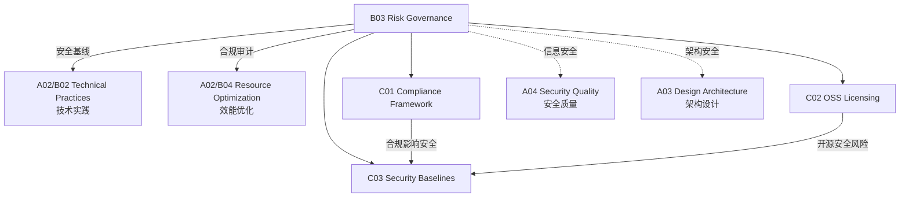

# B03 Risk Governance

**所属领域**: [A02_Engineering_Processes](../readme.md)
**创建日期**: 2026-01-30
**最后更新**: 2026-01-30

## 📋 子领域定位

风险治理是确保软件工程活动符合法规要求、安全标准和组织政策的关键领域。随着 GDPR、网络安全法等数据保护法规的实施，以及开源软件使用的普及，工程团队必须建立完善的合规框架、许可证管理机制和安全基线。

本领域涵盖合规框架（GDPR、SOC 2、HIPAA、等保）、开源许可证管理（许可证识别、合规审计、SBOM）和安全基线（DevSecOps、威胁建模、安全编码规范）三大方向，帮助组织在快速创新的同时管控法律和 reputational 风险。

## 🗂️ 专项列表

### [C01. Compliance_Framework](C01_Compliance_Framework/README.md)

合规框架确保软件系统满足法律法规和行业标准要求。本专项详解 GDPR 数据保护原则（合法性、目的限制、数据最小化）、SOC 2 信任服务标准（安全性、可用性、处理完整性、保密性、隐私）、ISO 27001 信息安全管理体系、以及中国等保 2.0 要求。涵盖合规自动化工具、审计证据收集和持续合规监控。

### [C02. OSS_Licensing](C02_OSS_Licensing/README.md)

开源许可证管理是软件供应链安全的重要组成部分。本专项覆盖主流开源许可证（MIT、Apache 2.0、GPL、LGPL、BSD）、许可证兼容性分析、软件物料清单（SBOM）生成、以及开源合规审计流程。探讨 FOSSology、ScanCode、SNYK 等许可证扫描工具的使用和集成。

### [C03. Security_Baselines](C03_Security_Baselines/README.md)

安全基线定义了软件系统的最低安全要求。本专项详解 DevSecOps 实践（安全左移、自动化安全测试）、安全编码规范（OWASP ASVS、CWE Top 25）、威胁建模方法（STRIDE、PASTA）、以及安全配置基线（CIS Benchmarks）。涵盖 SAST/DAST/SCA 工具链、漏洞管理和安全事件响应。

## 🛠️ 技术栈概览

### 合规工具

| 工具 | 功能 | 官网 |
|------|------|------|
| **Vanta** | 自动化合规平台 | https://www.vanta.com |
| **Drata** | SOC 2 自动化 | https://drata.com |
| **Lacework** | 云安全合规 | https://www.lacework.com |
| **Wiz** | CNAPP 安全平台 | https://www.wiz.io |

### 许可证扫描工具

| 工具 | 功能 | 官网 |
|------|------|------|
| **FOSSology** | 开源许可证合规 | https://www.fossology.org |
| **ScanCode** | 许可证扫描 | https://github.com/nexB/scancode-toolkit |
| **SNYK** | 安全+许可证扫描 | https://snyk.io |
| **Black Duck** | 企业级开源审计 | https://www.synopsys.com/software-integrity/security-testing/software-composition-analysis.html |
| **FOSSA** | 持续开源合规 | https://fossa.com |

### 安全扫描工具

| 工具 | 类型 | 官网 |
|------|------|------|
| **SonarQube** | SAST | https://www.sonarqube.org |
| **Checkmarx** | SAST | https://checkmarx.com |
| **Veracode** | SAST/DAST | https://www.veracode.com |
| **OWASP ZAP** | DAST | https://www.zaproxy.org |
| **Trivy** | 容器/代码扫描 | https://aquasecurity.github.io/trivy |
| **Grype** | 容器扫描 | https://github.com/anchore/grype |

## 💼 实践案例索引

### 案例 1: SOC 2 Type II 合规自动化

**实施步骤**:
1. 差距分析：对照 SOC 2 标准评估当前状态
2. 控制实施：部署技术控制（MFA、加密、审计日志）
3. 流程文档：编写政策和程序文档
4. 持续监控：使用 Drata/Vanta 自动收集证据
5. 审计准备：准备审计师访谈和证据包

**关键控制点**:
| 控制域 | 技术措施 | 工具 |
|--------|----------|------|
| 访问控制 | MFA、最小权限 | Okta、AWS IAM |
| 变更管理 | 代码评审、CI/CD | GitHub、Jenkins |
| 数据保护 | 加密、备份 | AWS KMS、Velero |
| 监控告警 | 日志集中、异常检测 | Datadog、Splunk |

### 案例 2: 开源许可证合规流程

**CI/CD 集成**:
```yaml
# .github/workflows/license-check.yml
name: License Compliance
on: [push, pull_request]
jobs:
  scan:
    runs-on: ubuntu-latest
    steps:
      - uses: actions/checkout@v4
      - name: Run FOSSA Scan
        uses: fossas/fossa-action@main
        with:
          api-key: ${{ secrets.FOSSA_API_KEY }}
      - name: Generate SBOM
        uses: anchore/sbom-action@v0
        with:
          format: spdx-json
          output-file: sbom.spdx.json
```

### 案例 3: DevSecOps 流水线

**安全门禁**:
```
┌─────────────────────────────────────────────────────────────┐
│                    DevSecOps 流水线                          │
├─────────────┬─────────────┬─────────────┬───────────────────┤
│   开发阶段   │   构建阶段   │   测试阶段   │    部署阶段        │
├─────────────┼─────────────┼─────────────┼───────────────────┤
│ 预提交钩子   │ 依赖扫描     │ SAST/DAST   │  容器扫描          │
│ 安全编码规范 │ SCA扫描      │ 模糊测试     │  运行时防护        │
│ 密钥检测     │ 镜像扫描     │ 渗透测试     │  合规检查          │
└─────────────┴─────────────┴─────────────┴───────────────────┘
```

## 🔗 知识关联图谱



## 📖 学习资源

### 推荐书籍

| 书名 | 作者 | 说明 |
|------|------|------|
| 《Security Engineering》 | Ross Anderson | 安全工程经典 |
| 《Threat Modeling》 | Adam Shostack | 威胁建模实践 |
| 《Open Source Compliance》 | 开源合规社区 | 开源合规指南 |

### 在线资源

| 资源 | 链接 | 说明 |
|------|------|------|
| OWASP | https://owasp.org | Web 安全标准 |
| NIST Cybersecurity | https://www.nist.gov/cyberframework | 网络安全框架 |
| CIS Benchmarks | https://www.cisecurity.org/cis-benchmarks | 安全配置基线 |
| OSI Licenses | https://opensource.org/licenses | 开源许可证 |
| GDPR.eu | https://gdpr.eu | GDPR 指南 |

### 开源项目

| 项目 | GitHub | 说明 |
|------|--------|------|
| OWASP Dependency-Check | https://github.com/jeremylong/DependencyCheck | 依赖漏洞检查 |
| Trivy | https://github.com/aquasecurity/trivy | 综合安全扫描 |
| Open Policy Agent | https://github.com/open-policy-agent/opa | 策略即代码 |

## 🔄 维护说明

- **内容审查**: 每季度更新法规要求和工具版本
- **更新机制**: 跟踪安全漏洞披露和合规标准更新
- **质量标准**: 确保合规要求引用最新法规版本
- **贡献方式**: 欢迎提交合规案例和安全实践经验
