# B03 Risk Governance

**所属领域**: [A02_Engineering_Processes](../readme.md)
**创建日期**: 2026-01-30
**最后更新**: 2026-01-30

## 📋 子领域定位

风险治理是确保软件工程活动符合法规要求、安全标准和组织政策的关键领域。随着 GDPR、网络安全法等数据保护法规的实施，以及开源软件使用的普及，工程团队必须建立完善的合规框架、许可证管理机制和安全基线。

本领域涵盖合规框架（GDPR、SOC 2、HIPAA、等保）、开源许可证管理（许可证识别、合规审计、SBOM）和安全基线（DevSecOps、威胁建模、安全编码规范）三大方向，帮助组织在快速创新的同时管控法律和声誉风险。

**核心关注点**：
- **合规框架**: 数据保护法规、行业标准、审计要求、合规自动化
- **开源许可证**: 许可证识别、兼容性分析、SBOM、合规审计
- **安全基线**: DevSecOps、威胁建模、安全编码、漏洞管理

## 🗂️ 专项列表

### [C01. Compliance_Framework](C01_Compliance_Framework/README.md)

合规框架确保软件系统满足法律法规和行业标准要求。本专项详解 GDPR 数据保护原则（合法性、目的限制、数据最小化）、SOC 2 信任服务标准（安全性、可用性、处理完整性、保密性、隐私）、ISO 27001 信息安全管理体系、以及中国等保 2.0 要求。涵盖合规自动化工具、审计证据收集和持续合规监控。

### [C02. OSS_Licensing](C02_OSS_Licensing/README.md)

开源许可证管理是软件供应链安全的重要组成部分。本专项覆盖主流开源许可证（MIT、Apache 2.0、GPL、LGPL、BSD）、许可证兼容性分析、软件物料清单（SBOM）生成、以及开源合规审计流程。探讨 FOSSology、ScanCode、SNYK 等许可证扫描工具的使用和集成。

### [C03. Security_Baselines](C03_Security_Baselines/README.md)

安全基线定义了软件系统的最低安全要求。本专项详解 DevSecOps 实践（安全左移、自动化安全测试）、安全编码规范（OWASP ASVS、CWE Top 25）、威胁建模方法（STRIDE、PASTA）、以及安全配置基线（CIS Benchmarks）。涵盖 SAST/DAST/SCA 工具链、漏洞管理和安全事件响应。

## 🛠️ 技术栈概览

### 合规管理工具

| 工具 | 功能 | 官网 |
|------|------|------|
| **Vanta** | 自动化合规平台 | https://www.vanta.com |
| **Drata** | SOC 2 自动化 | https://drata.com |
| **Secureframe** | 合规自动化 | https://secureframe.com |
| **Lacework** | 云安全合规 | https://www.lacework.com |
| **Wiz** | CNAPP 安全平台 | https://www.wiz.io |
| **Orca Security** | 云安全合规 | https://orca.security |

### 许可证扫描工具

| 工具 | 功能 | 官网 |
|------|------|------|
| **FOSSology** | 开源许可证合规 | https://www.fossology.org |
| **ScanCode Toolkit** | 许可证扫描 | https://github.com/nexB/scancode-toolkit |
| **SNYK** | 安全+许可证扫描 | https://snyk.io |
| **Black Duck** | 企业级开源审计 | https://www.synopsys.com/software-integrity |
| **FOSSA** | 持续开源合规 | https://fossa.com |
| **Scanoss** | SBOM 生成 | https://www.scanoss.com |

### 安全扫描工具

| 工具 | 类型 | 官网 |
|------|------|------|
| **SonarQube** | SAST | https://www.sonarqube.org |
| **Checkmarx** | SAST | https://checkmarx.com |
| **Veracode** | SAST/DAST | https://www.veracode.com |
| **Snyk Code** | SAST | https://snyk.io/product/snyk-code |
| **OWASP ZAP** | DAST | https://www.zaproxy.org |
| **Trivy** | 容器/代码扫描 | https://aquasecurity.github.io/trivy |
| **Grype** | 容器扫描 | https://github.com/anchore/grype |

## 💼 实践案例索引

### 案例 1: SOC 2 Type II 合规自动化

**实施路线图**:
```
阶段 1: 差距分析 (2-4 周)
├── 对照 SOC 2 标准评估当前状态
├── 识别控制缺口
└── 制定补救计划

阶段 2: 控制实施 (4-8 周)
├── 技术控制部署
│   ├── MFA 实施
│   ├── 加密启用
│   ├── 审计日志配置
│   └── 访问控制强化
├── 流程文档编写
│   ├── 安全政策
│   ├── 变更管理流程
│   └── 事件响应计划
└── 员工培训

阶段 3: 持续监控 (持续)
├── 证据自动收集
├── 控制有效性测试
└── 合规仪表板

阶段 4: 审计 (观察期后)
├── 审计师访谈
├── 证据包准备
└── 审计报告
```

**关键控制点**:
| 控制域 | 技术措施 | 工具 |
|--------|----------|------|
| 访问控制 | MFA、最小权限、定期访问审查 | Okta、AWS IAM |
| 变更管理 | 代码评审、CI/CD、变更审批 | GitHub、Jenkins |
| 数据保护 | 加密（传输/静态）、备份、DLP | AWS KMS、Veeam |
| 监控告警 | 日志集中、异常检测、SIEM | Datadog、Splunk |
| 漏洞管理 | 定期扫描、补丁管理、渗透测试 | Tenable、Bugcrowd |

### 案例 2: 开源许可证合规流程

**CI/CD 集成**:
```yaml
# .github/workflows/license-check.yml
name: License Compliance

on: [push, pull_request]

jobs:
  scan:
    runs-on: ubuntu-latest
    steps:
      - uses: actions/checkout@v4
      
      # 运行 FOSSA 扫描
      - name: Run FOSSA Scan
        uses: fossas/fossa-action@main
        with:
          api-key: ${{ secrets.FOSSA_API_KEY }}
      
      # 生成 SBOM
      - name: Generate SBOM
        uses: anchore/sbom-action@v0
        with:
          format: spdx-json
          output-file: sbom.spdx.json
      
      # 上传 SBOM 到依赖分析
      - name: Upload to Dependency Track
        run: |
          curl -X POST \
            -H "Content-Type: multipart/form-data" \
            -H "X-Api-Key: ${{ secrets.DTRACK_API_KEY }}" \
            -F "project=${{ secrets.DTRACK_PROJECT }}" \
            -F "bom=@sbom.spdx.json" \
            ${{ secrets.DTRACK_URL }}/api/v1/bom
```

**许可证兼容性矩阵**:
| 许可证 | 商业使用 | 修改 | 分发 | 专利授权 | 传染性 |
|--------|----------|------|------|----------|--------|
| MIT | ✅ | ✅ | ✅ | ❌ | 无 |
| Apache 2.0 | ✅ | ✅ | ✅ | ✅ | 无 |
| BSD | ✅ | ✅ | ✅ | ❌ | 无 |
| LGPL | ✅ | ✅ | ✅ | ✅ | 弱 |
| GPL-2.0 | ✅ | ✅ | ✅ | ❌ | 强 |
| AGPL | ✅ | ✅ | ✅ | ❌ | 超强 |

### 案例 3: DevSecOps 流水线

**安全门禁设计**:
```
┌─────────────────────────────────────────────────────────────┐
│                    DevSecOps 安全流水线                       │
├─────────────┬─────────────┬─────────────┬───────────────────┤
│   开发阶段   │   构建阶段   │   测试阶段   │    部署阶段        │
├─────────────┼─────────────┼─────────────┼───────────────────┤
│ 预提交钩子   │ 依赖扫描     │ SAST扫描    │  容器镜像扫描      │
│ 安全编码规范 │ SCA分析      │ DAST扫描    │  基础设施即代码扫描 │
│ 密钥检测     │ 镜像构建     │ 模糊测试    │  运行时防护        │
│ 代码评审     │ 镜像扫描     │ 渗透测试    │  合规检查          │
└─────────────┴─────────────┴─────────────┴───────────────────┘
       │             │             │              │
       ▼             ▼             ▼              ▼
┌─────────────────────────────────────────────────────────────┐
│                     安全事件响应                              │
│  - 漏洞跟踪 (Jira)                                           │
│  - SLA 管理                                                  │
│  - 修复验证                                                  │
└─────────────────────────────────────────────────────────────┘
```

**工具链集成**:
```yaml
# .github/workflows/security-pipeline.yml
name: DevSecOps Pipeline

jobs:
  # SAST 扫描
  sast:
    runs-on: ubuntu-latest
    steps:
      - uses: actions/checkout@v4
      - name: SonarQube Scan
        uses: sonarqube-quality-gate-action@master
        with:
          scanMetadataReportFile: .scannerwork/report-task.txt
      - name: Semgrep Scan
        uses: returntocorp/semgrep-action@v1

  # SCA 扫描
  sca:
    runs-on: ubuntu-latest
    steps:
      - uses: actions/checkout@v4
      - name: Snyk Test
        uses: snyk/actions/node@master
        with:
          args: --severity-threshold=high

  # 容器扫描
  container-scan:
    runs-on: ubuntu-latest
    steps:
      - uses: actions/checkout@v4
      - name: Build image
        run: docker build -t app:${{ github.sha }} .
      - name: Trivy Scan
        uses: aquasecurity/trivy-action@master
        with:
          image-ref: 'app:${{ github.sha }}'
          format: 'sarif'
          output: 'trivy-results.sarif'
```

## 🔗 知识关联图谱

```mermaid
graph TB
    B[B03 Risk Governance]
    
    %% 同层关联
    B -->|安全编码| B02[A02/B02 Technical Practices<br/>技术实践]
    B -->|审计合规| B04[A02/B04 Resource Optimization<br/>效能优化]
    B -->|流程集成| B01[A02/B01 SDLC Frameworks<br/>SDLC框架]
    
    %% 专项关联
    B --> C01[C01 Compliance Framework]
    B --> C02[C02 OSS Licensing]
    B --> C03[C03 Security Baselines]
    
    C01 -->|合影响安全| C03
    C02 -->|开源安全风险| C03
    
    %% 跨层关联
    B -.->|信息安全| A04[A04 Security Quality<br/>安全质量]
    B -.->|架构安全| A03[A03 Design Architecture<br/>架构设计]
    B -.->|云合规| A01[A01 Infrastructure<br/>基础设施]
```



## 📖 学习资源

### 推荐书籍

| 书名 | 作者 | 说明 |
|------|------|------|
| 《Security Engineering》 | Ross Anderson | 安全工程经典 |
| 《Threat Modeling》 | Adam Shostack | 威胁建模实践 |
| 《Open Source Compliance》 | 开源合规社区 | 开源合规指南 |
| 《Compliance 101》 |  | 合规基础 |

### 认证与标准

| 认证 | 机构 | 说明 |
|------|------|------|
| CISSP | (ISC)² | 信息系统安全认证 |
| CISA | ISACA | 信息系统审计师 |
| CISM | ISACA | 信息安全经理 |
| CCSP | (ISC)² | 云安全专家 |
| SOC 2 | AICPA | 服务组织控制报告 |
| ISO 27001 | ISO | 信息安全管理体系 |

### 在线资源

| 资源 | 链接 | 说明 |
|------|------|------|
| OWASP | https://owasp.org | Web 安全标准 |
| NIST Cybersecurity Framework | https://www.nist.gov/cyberframework | 网络安全框架 |
| CIS Benchmarks | https://www.cisecurity.org/cis-benchmarks | 安全配置基线 |
| OSI Licenses | https://opensource.org/licenses | 开源许可证 |
| GDPR.eu | https://gdpr.eu | GDPR 指南 |
| SPDX | https://spdx.dev | SBOM 标准 |

### 开源项目

| 项目 | GitHub | 说明 |
|------|--------|------|
| OWASP Dependency-Check | https://github.com/jeremylong/DependencyCheck | 依赖漏洞检查 |
| Trivy | https://github.com/aquasecurity/trivy | 综合安全扫描 |
| Open Policy Agent | https://github.com/open-policy-agent/opa | 策略即代码 |
| FOSSology | https://github.com/fossology/fossology | 许可证合规 |
| Dependency Track | https://github.com/DependencyTrack/dependency-track | 组件分析平台 |

## 🔄 维护说明

- **内容审查**: 每季度更新法规要求和工具版本
- **更新机制**: 跟踪安全漏洞披露和合规标准更新
- **质量标准**: 确保合规要求引用最新法规版本
- **贡献方式**: 欢迎提交合规案例和安全实践经验
