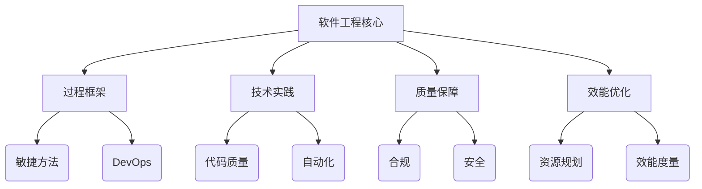
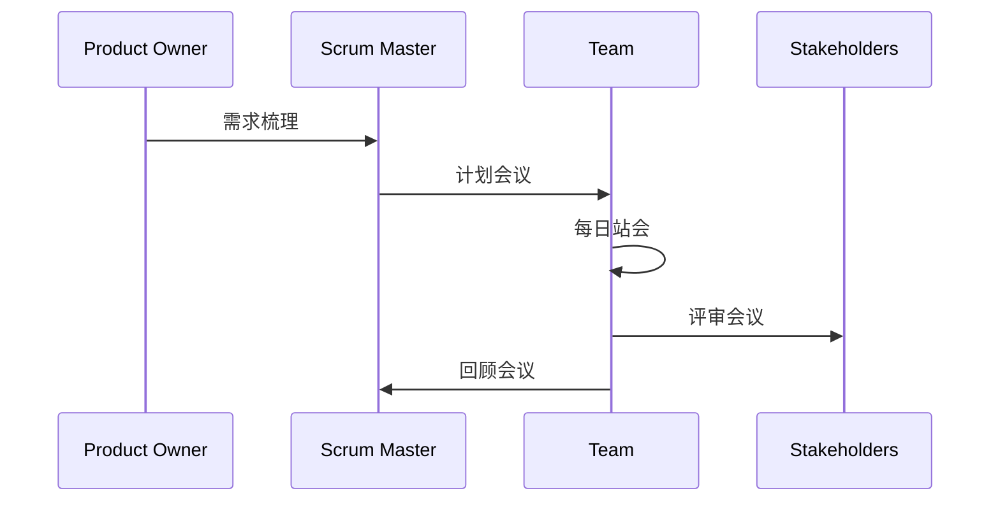
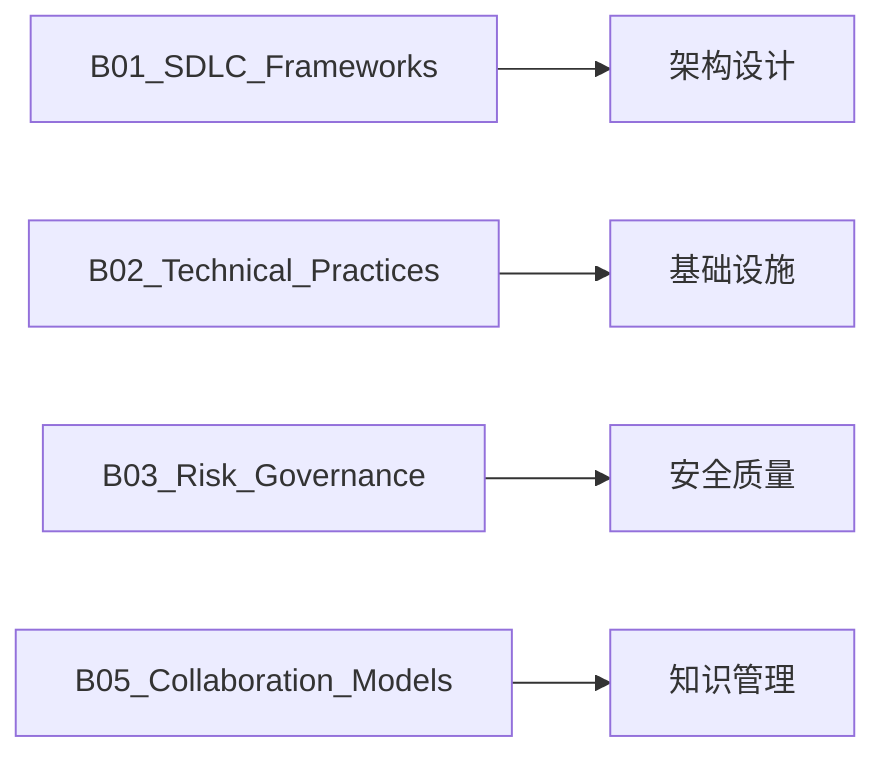

优采用更符合行业标准、更精确的软件工程术语体系。

### 软件工程流程管理目录
```bash
A02_Engineering_Processes/
├── B01_SDLC_Frameworks
│├── C01_Agile_Methodologies# Scrum, Kanban, XP
│├── C02_DevOps_Integration# CI/CD, GitOps, ChatOps
│└── C03_Quality_Gates# DoD, DoR, Phase Reviews
├── B02_Technical_Practices
│├── C01_Code_Craftsmanship# Clean Code, Refactoring
│├── C02_Automation_Strategy# Test Automation, IaC
│└── C03_Documentation_Ops# ADRs, Knowledge Base Mgmt
├── B03_Risk_Governance
│├── C01_Compliance_Framework # GDPR, SOC2, HIPAA
│├── C02_OSS_Licensing# License Compliance, Audit
│└── C03_Security_Baselines# DevSecOps, Threat Modeling
├── B04_Resource_Optimization
│├── C01_Capacity_Planning# Team Velocity, Forecasting
│├── C02_Performance_Metrics# DORA, SPACE, Flow Metrics
│└── C03_Cost_Management# Cloud Cost Optimization
└── B05_Collaboration_Models
├── C01_Remote_Workflows# Async Communication
├── C02_Knowledge_Sharing# Pairing, Mob Programming
└── C03_Team_Topologies# Stream-Aligned Teams
```

### 重构要点说明

1. **术语精确化**：
- 将 "Project_Mgmt" → "SDLC_Frameworks"（软件开发生命周期框架）
- "Software_Eng" → "Technical_Practices"（聚焦具体工程实践）
- "Compliance_Legal" → "Risk_Governance"（更全面的风险管理）

2. **关键概念强化**：


3. **行业标准对齐**：
- 引入DORA指标（DevOps Research & Assessment）
- 包含团队拓扑（Team Topologies）现代协作模型
- 强调质量门禁（Quality Gates）概念

4. **层级关系优化**：
- 将IaC从DevOps中分离到Technical_Practices
- 合并原"Team_Dynamics"与协作概念
- 新增"Cost_Management"云原生成本控制

### 推荐内容模板示例

**C01_Agile_Methodologies/scrum_implementation.md**
```markdown
## Scrum实践指南

### 核心工件
- **Product Backlog**：价值驱动需求管理
- **Sprint Backlog**：迭代目标分解
- **Increment**：可交付成果定义

### 关键仪式


### 效能度量
| 指标 | 健康范围 | 测量工具 |
|------|----------|----------|
| 速率(Velocity) | ±20%波动 | Jira |
| 缺陷逃逸率 | <5% | SonarQube |
| 交付周期 | <3天 | Value Stream Mapping |
```

### 与其他模块的关联


这个重构方案：
1. 使用更精准的软件工程术语（SDLC、IaC、DORA等）
2. 强化过程与技术的结合
3. 增加现代软件工程实践元素
4. 保持三级结构的逻辑一致性
5. 提供清晰的跨模块关联路径

是否需要我提供这个目录结构的完整生成脚本？或者针对特定子模块做进一步细化？
