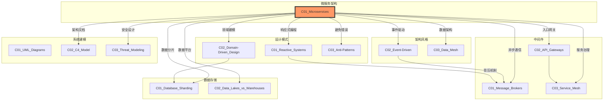
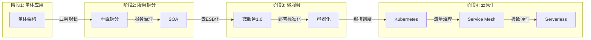
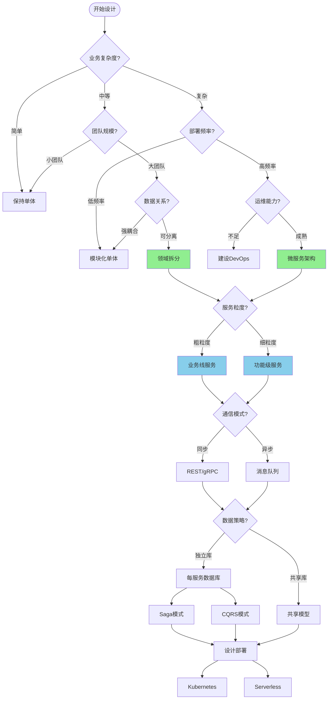

# C01 Microservices - 微服务架构

**领域**: A03_Design_Architecture/B01_Arch_Styles  
**创建日期**: 2026-01-30  
**最后更新**: 2026-01-30

---

## 1. 主题定位

### 1.1 定义与本质

微服务架构（Microservices Architecture）是一种将单一应用程序开发为一组小型服务的方法，每个服务运行在自己的进程中，通过轻量级通信机制（通常是HTTP API）进行交互。这些服务围绕业务能力构建，可通过全自动部署机制独立部署。

微服务架构的核心理念源于Martin Fowler和James Lewis在2014年发表的奠基性文章《Microservices: A Definition of This New Architectural Term》。该架构风格是对传统单体架构（Monolithic Architecture）的演进，旨在解决大型应用系统在开发、部署和扩展方面的挑战。

### 1.2 架构演进背景

```
单体架构 → 垂直拆分 → SOA → 微服务 → 云原生微服务
    |          |        |       |          |
  1990s     2000s    2005    2014       2018+
```

- **单体架构阶段（1990s-2000s）**：所有功能模块打包在一个部署单元中
- **垂直拆分阶段（2000s-2005）**：按业务领域垂直划分应用
- **SOA阶段（2005-2014）**：面向服务的架构，强调服务复用和ESB
- **微服务阶段（2014-2018）**：去中心化治理，轻量级通信
- **云原生微服务（2018+）**：容器化、Kubernetes、Service Mesh

### 1.3 适用场景与边界

| 维度 | 适用微服务 | 不适用微服务 |
|------|-----------|-------------|
| **团队规模** | 30+开发人员，多团队协作 | 小团队（<10人） |
| **业务复杂度** | 复杂业务域，多子系统 | 简单CRUD应用 |
| **部署频率** | 需要独立部署各模块 | 统一部署即可 |
| **技术栈** | 多语言多技术栈 | 单一技术栈足够 |
| **运维能力** | 具备DevOps和自动化运维 | 缺乏运维自动化能力 |
| **数据一致性** | 可接受最终一致性 | 强一致性要求 |

---

## 2. 核心概念

### 2.1 微服务的九大特征

根据Martin Fowler的定义，微服务架构具有以下核心特征：

#### 2.1.1 组件化与服务化（Componentization via Services）

微服务使用服务作为组件，而非传统库引用。服务是独立进程，通过远程调用机制通信。

```
┌─────────────────────────────────────────────────────────────┐
│                    单体应用组件化                             │
├─────────────────────────────────────────────────────────────┤
│  ┌─────────┐  ┌─────────┐  ┌─────────┐                      │
│  │  库A   │──│  库B   │──│  库C   │  (内存调用)            │
│  └─────────┘  └─────────┘  └─────────┘                      │
│        ↓           ↓           ↓                           │
│  ┌──────────────────────────────────┐                      │
│  │         单一部署单元              │                      │
│  └──────────────────────────────────┘                      │
└─────────────────────────────────────────────────────────────┘

┌─────────────────────────────────────────────────────────────┐
│                    微服务组件化                               │
├─────────────────────────────────────────────────────────────┤
│  ┌─────────┐    ┌─────────┐    ┌─────────┐                 │
│  │ 服务A  │◄──►│ 服务B  │◄──►│ 服务C  │  (网络调用)        │
│  │(独立进程)│    │(独立进程)│    │(独立进程)│                 │
│  └─────────┘    └─────────┘    └─────────┘                 │
│       ▲              ▲              ▲                      │
│       └──────────────┼──────────────┘                      │
│              轻量级通信机制                                 │
└─────────────────────────────────────────────────────────────┘
```

#### 2.1.2 围绕业务能力组织（Organized around Business Capabilities）

康威定律指出："设计系统的架构受制于产生这些设计的组织的沟通结构"。微服务强调跨职能团队，每个团队负责完整的业务功能。

```
传统分层团队:                    微服务跨职能团队:
┌─────────┐                      ┌───────────────────────────┐
│  UI团队  │                      │      订单服务团队          │
├─────────┤                      │  UI │ 服务 │ 数据 │ 测试  │
│ 服务团队 │                      ├───────────────────────────┤
├─────────┤                      │      库存服务团队          │
│ 数据团队 │                      │  UI │ 服务 │ 数据 │ 测试  │
├─────────┤                      ├───────────────────────────┤
│ 测试团队 │                      │      用户服务团队          │
└─────────┘                      │  UI │ 服务 │ 数据 │ 测试  │
                                 └───────────────────────────┘
```

#### 2.1.3 去中心化治理（Decentralized Governance）

微服务架构倾向于去中心化的治理模型，允许团队选择最适合其服务的技术栈。

#### 2.1.4 去中心化数据管理（Decentralized Data Management）

每个微服务管理自己的数据，采用Database Per Service模式。

```
单体数据库:                          微服务数据库:
┌─────────────┐                      ┌─────────────┐
│  单一数据库  │                      │ 订单数据库   │◄── 订单服务
│  ┌───────┐  │                      ├─────────────┤
│  │订单表 │  │                      │ 库存数据库   │◄── 库存服务
│  ├───────┤  │                      ├─────────────┤
│  │库存表 │  │                      │ 用户数据库   │◄── 用户服务
│  ├───────┤  │                      ├─────────────┤
│  │用户表 │  │                      │ 支付数据库   │◄── 支付服务
│  └───────┘  │                      └─────────────┘
└─────────────┘
```

#### 2.1.5 智能端点与哑管道（Smart Endpoints and Dumb Pipes）

微服务强调在服务内部实现业务逻辑，而不是依赖重量级ESB。通信管道应保持简单，如RESTful HTTP或轻量级消息队列。

#### 2.1.6 基础设施自动化（Infrastructure Automation）

CI/CD流水线是微服务成功的关键，支持频繁、可靠的部署。

#### 2.1.7 故障设计（Design for Failure）

分布式系统中故障不可避免，必须设计容错机制：熔断、降级、重试、超时。

#### 2.1.8 演进式设计（Evolutionary Design）

微服务支持逐步替换单体应用，而非大爆炸式重构。

#### 2.1.9 服务粒度（Service Granularity）

服务粒度决策是微服务设计的关键权衡点，需考虑：内聚性、耦合度、团队结构、变更频率。

### 2.2 服务通信模式

#### 2.2.1 同步通信

**RESTful HTTP**
```http
GET /api/v1/orders/12345 HTTP/1.1
Host: order-service.example.com
Accept: application/json
Authorization: Bearer <token>

HTTP/1.1 200 OK
Content-Type: application/json

{
  "orderId": "12345",
  "customerId": "C-789",
  "items": [
    {"productId": "P-001", "quantity": 2, "price": 99.99}
  ],
  "status": "CONFIRMED",
  "createdAt": "2026-01-30T10:00:00Z"
}
```

**gRPC**
gRPC基于HTTP/2和Protocol Buffers，提供高效的二进制通信。

```protobuf
// order.proto
syntax = "proto3";

package orderservice;

service OrderService {
  rpc GetOrder(GetOrderRequest) returns (Order);
  rpc CreateOrder(CreateOrderRequest) returns (Order);
  rpc StreamOrders(StreamOrdersRequest) returns (stream Order);
}

message GetOrderRequest {
  string order_id = 1;
}

message Order {
  string order_id = 1;
  string customer_id = 2;
  repeated OrderItem items = 3;
  OrderStatus status = 4;
  string created_at = 5;
}

message OrderItem {
  string product_id = 1;
  int32 quantity = 2;
  double price = 3;
}

enum OrderStatus {
  PENDING = 0;
  CONFIRMED = 1;
  SHIPPED = 2;
  DELIVERED = 3;
  CANCELLED = 4;
}
```

#### 2.2.2 异步通信

**消息队列模式**

```
发布-订阅模式:
                    ┌─────────────┐
         ┌─────────►│  消息队列   │◄─────────┐
         │          │  (Topic)   │          │
    ┌────┴───┐      └──────┬────┘      ┌───┴────┐
    │生产者A │             │            │消费者A │
    └────────┘             │            └────────┘
                      ┌────┴────┐
                      │消费者B  │
                      └─────────┘

点对点模式:
    ┌─────────┐      ┌─────────────┐      ┌─────────┐
    │ 生产者  │─────►│   消息队列   │─────►│ 消费者  │
    └─────────┘      │   (Queue)   │      └─────────┘
                     └─────────────┘
```

### 2.3 数据一致性模式

#### 2.3.1 Saga模式

Saga模式用于处理跨多个服务的长时间事务，有两种实现方式：

**编排式Saga (Choreography)**
```
订单服务 ──► 库存服务 ──► 支付服务 ──► 配送服务
   │            │            │            │
   │  OrderCreated         │            │
   │───────────►│            │            │
   │            │StockReserved          │
   │            │───────────►│            │
   │            │            │PaymentProcessed
   │            │            │───────────►│
   │            │            │            │DeliveryScheduled
```

**协调式Saga (Orchestration)**
```
                         ┌─────────────┐
    ┌───────────────────►│ Saga协调器  │◄───────────────────┐
    │                    └──────┬──────┘                    │
    │                         │                           │
    ▼                         ▼                           │
┌─────────┐              ┌─────────┐              ┌───────┴───┐
│ 订单服务 │◄────────────►│ 库存服务 │◄────────────►│  支付服务  │
└─────────┘              └─────────┘              └───────────┘
```

#### 2.3.2 CQRS模式

命令查询职责分离（Command Query Responsibility Segregation）将读操作和写操作分离到不同的模型。

```
                    ┌─────────────┐
      写命令 ──────►│  命令模型   │
                   │  (写入DB)   │
                   └──────┬──────┘
                          │ 事件传播
                   ┌──────┴──────┐
                   │   事件总线   │
                   └──────┬──────┘
                          ▼
                   ┌─────────────┐
      读查询 ──────►│  查询模型   │
                   │  (读取DB)   │
                   └─────────────┘
```

### 2.4 服务发现与负载均衡

```
┌─────────────────────────────────────────────────────────────┐
│                      服务发现架构                             │
├─────────────────────────────────────────────────────────────┤
│                                                             │
│   ┌──────────┐    注册/心跳    ┌──────────────┐             │
│   │ 服务实例A │◄──────────────►│              │             │
│   └──────────┘                │   服务注册表   │◄──────┐     │
│                               │  (Consul/    │       │     │
│   ┌──────────┐    注册/心跳    │   Eureka/    │       │     │
│   │ 服务实例B │◄──────────────►│   etcd)      │       │     │
│   └──────────┘                └──────────────┘       │     │
│                                                             │
│   ┌──────────┐                ┌──────────────┐       │     │
│   │  客户端   │───────────────►│   负载均衡器   │◄──────┘     │
│   └──────────┘    查询服务地址  │  (轮询/随机)  │             │
│                               └──────────────┘             │
│                                                             │
└─────────────────────────────────────────────────────────────┘
```

---

## 3. 技术实践

### 3.1 Spring Boot微服务实现

#### 3.1.1 订单服务实现

```java
// OrderServiceApplication.java
@SpringBootApplication
@EnableDiscoveryClient
public class OrderServiceApplication {
    public static void main(String[] args) {
        SpringApplication.run(OrderServiceApplication.class, args);
    }
}

// Order.java
@Entity
@Table(name = "orders")
public class Order {
    @Id
    @GeneratedValue(strategy = GenerationType.UUID)
    private String orderId;
    
    private String customerId;
    private BigDecimal totalAmount;
    private OrderStatus status;
    private LocalDateTime createdAt;
    
    @OneToMany(cascade = CascadeType.ALL, mappedBy = "order")
    private List<OrderItem> items = new ArrayList<>();
    
    // 领域方法
    public void confirm() {
        if (this.status != OrderStatus.PENDING) {
            throw new IllegalStateException("Only pending orders can be confirmed");
        }
        this.status = OrderStatus.CONFIRMED;
    }
    
    public void cancel() {
        if (this.status == OrderStatus.SHIPPED || this.status == OrderStatus.DELIVERED) {
            throw new IllegalStateException("Cannot cancel shipped or delivered orders");
        }
        this.status = OrderStatus.CANCELLED;
    }
    
    // Getters and Setters
}

// OrderController.java
@RestController
@RequestMapping("/api/v1/orders")
@Tag(name = "订单服务", description = "订单管理相关接口")
public class OrderController {
    
    private final OrderService orderService;
    private final InventoryClient inventoryClient;
    
    public OrderController(OrderService orderService, InventoryClient inventoryClient) {
        this.orderService = orderService;
        this.inventoryClient = inventoryClient;
    }
    
    @PostMapping
    @Operation(summary = "创建订单")
    public ResponseEntity<OrderResponse> createOrder(@RequestBody @Valid CreateOrderRequest request) {
        // 1. 检查库存
        for (OrderItemRequest item : request.getItems()) {
            InventoryResponse inventory = inventoryClient.checkStock(item.getProductId());
            if (inventory.getAvailableQuantity() < item.getQuantity()) {
                throw new InsufficientStockException(item.getProductId());
            }
        }
        
        // 2. 创建订单
        Order order = orderService.createOrder(request);
        
        // 3. 预留库存（异步事件）
        orderService.publishOrderCreatedEvent(order);
        
        return ResponseEntity.status(HttpStatus.CREATED)
                .body(OrderResponse.from(order));
    }
    
    @GetMapping("/{orderId}")
    @Operation(summary = "获取订单详情")
    public ResponseEntity<OrderResponse> getOrder(@PathVariable String orderId) {
        return orderService.findById(orderId)
                .map(order -> ResponseEntity.ok(OrderResponse.from(order)))
                .orElse(ResponseEntity.notFound().build());
    }
    
    @PutMapping("/{orderId}/confirm")
    @Operation(summary = "确认订单")
    public ResponseEntity<Void> confirmOrder(@PathVariable String orderId) {
        orderService.confirmOrder(orderId);
        return ResponseEntity.ok().build();
    }
}

// FeignClient声明
@FeignClient(name = "inventory-service", fallback = InventoryClientFallback.class)
public interface InventoryClient {
    
    @GetMapping("/api/v1/inventory/{productId}")
    InventoryResponse checkStock(@PathVariable("productId") String productId);
    
    @PostMapping("/api/v1/inventory/reserve")
    void reserveStock(@RequestBody StockReservationRequest request);
}

// 熔断降级实现
@Component
@Slf4j
public class InventoryClientFallback implements InventoryClient {
    
    @Override
    public InventoryResponse checkStock(String productId) {
        log.warn("Inventory service unavailable, returning default for product: {}", productId);
        // 默认策略：假设库存充足，允许订单创建
        return InventoryResponse.builder()
                .productId(productId)
                .availableQuantity(Integer.MAX_VALUE)
                .status("UNKNOWN")
                .build();
    }
    
    @Override
    public void reserveStock(StockReservationRequest request) {
        log.error("Failed to reserve stock for order: {}", request.getOrderId());
        // 记录待处理任务，后续补偿
        throw new ServiceUnavailableException("Inventory service temporarily unavailable");
    }
}
```

#### 3.1.2 配置管理

```yaml
# application.yml
spring:
  application:
    name: order-service
  
  cloud:
    config:
      uri: http://config-server:8888
      fail-fast: true
      retry:
        initial-interval: 1000
        max-attempts: 6
        max-interval: 2000
        multiplier: 1.1
    
    consul:
      host: localhost
      port: 8500
      discovery:
        service-name: ${spring.application.name}
        health-check-interval: 10s
        health-check-path: /actuator/health
        tags:
          - version=1.0.0
          - profile=${spring.profiles.active:default}
  
  datasource:
    url: jdbc:postgresql://localhost:5432/order_db
    username: ${DB_USERNAME:order_user}
    password: ${DB_PASSWORD:order_pass}
    hikari:
      maximum-pool-size: 20
      minimum-idle: 5
      connection-timeout: 30000
      idle-timeout: 600000
      max-lifetime: 1800000
  
  jpa:
    hibernate:
      ddl-auto: validate
    properties:
      hibernate:
        dialect: org.hibernate.dialect.PostgreSQLDialect
        format_sql: true
    show-sql: false
  
  kafka:
    bootstrap-servers: localhost:9092
    producer:
      key-serializer: org.apache.kafka.common.serialization.StringSerializer
      value-serializer: org.springframework.kafka.support.serializer.JsonSerializer
      acks: all
      retries: 3
    consumer:
      group-id: order-service-group
      auto-offset-reset: earliest
      key-deserializer: org.apache.kafka.common.serialization.StringDeserializer
      value-deserializer: org.springframework.kafka.support.serializer.JsonDeserializer
      properties:
        spring.json.trusted.packages: "com.example.orderservice.event"

# 熔断器配置
resilience4j:
  circuitbreaker:
    configs:
      default:
        slidingWindowSize: 100
        minimumNumberOfCalls: 10
        permittedNumberOfCallsInHalfOpenState: 10
        automaticTransitionFromOpenToHalfOpenEnabled: true
        waitDurationInOpenState: 10s
        failureRateThreshold: 50
        eventConsumerBufferSize: 10
        recordExceptions:
          - org.springframework.web.client.HttpServerErrorException
          - java.util.concurrent.TimeoutException
          - java.io.IOException
    instances:
      inventoryService:
        baseConfig: default
  
  retry:
    configs:
      default:
        maxRetryAttempts: 3
        waitDuration: 100
        exponentialBackoffMultiplier: 2
        retryExceptions:
          - org.springframework.web.client.HttpServerErrorException
          - java.util.concurrent.TimeoutException
    instances:
      inventoryRetry:
        baseConfig: default
  
  timelimiter:
    configs:
      default:
        timeoutDuration: 2s
        cancelRunningFuture: true
    instances:
      inventoryTimeout:
        baseConfig: default

# 监控配置
management:
  endpoints:
    web:
      exposure:
        include: health,info,metrics,prometheus,circuitbreakers,retries,timelimiters
  endpoint:
    health:
      show-details: when_authorized
      show-components: always
  metrics:
    tags:
      application: ${spring.application.name}
    export:
      prometheus:
        enabled: true

# 日志配置
logging:
  level:
    com.example.orderservice: INFO
    org.springframework.cloud: WARN
  pattern:
    console: "%d{yyyy-MM-dd HH:mm:ss.SSS} [%thread] [%X{traceId}/%X{spanId}] %-5level %logger{36} - %msg%n"
```

### 3.2 Go微服务实现

```go
// main.go
package main

import (
	"context"
	"fmt"
	"log"
	"net/http"
	"os"
	"os/signal"
	"syscall"
	"time"

	"github.com/gin-gonic/gin"
	"github.com/prometheus/client_golang/prometheus/promhttp"
	"go.opentelemetry.io/otel"
	"go.opentelemetry.io/otel/trace"
	"go.uber.org/zap"
	"gorm.io/driver/postgres"
	"gorm.io/gorm"
)

var (
	db     *gorm.DB
	logger *zap.Logger
	tracer trace.Tracer
)

type Order struct {
	OrderID     string    `gorm:"primaryKey" json:"order_id"`
	CustomerID  string    `gorm:"index" json:"customer_id"`
	TotalAmount float64   `json:"total_amount"`
	Status      string    `gorm:"index" json:"status"`
	CreatedAt   time.Time `json:"created_at"`
	UpdatedAt   time.Time `json:"updated_at"`
	Items       []OrderItem `gorm:"foreignKey:OrderID" json:"items"`
}

type OrderItem struct {
	ID        uint    `gorm:"primaryKey" json:"id"`
	OrderID   string  `gorm:"index" json:"order_id"`
	ProductID string  `json:"product_id"`
	Quantity  int     `json:"quantity"`
	Price     float64 `json:"price"`
}

const (
	StatusPending    = "PENDING"
	StatusConfirmed  = "CONFIRMED"
	StatusShipped    = "SHIPPED"
	StatusDelivered  = "DELIVERED"
	StatusCancelled  = "CANCELLED"
)

func main() {
	var err error
	logger, _ = zap.NewProduction()
	defer logger.Sync()

	// 初始化数据库
	dsn := fmt.Sprintf("host=%s user=%s password=%s dbname=%s port=%s sslmode=disable",
		getEnv("DB_HOST", "localhost"),
		getEnv("DB_USER", "order_user"),
		getEnv("DB_PASSWORD", "order_pass"),
		getEnv("DB_NAME", "order_db"),
		getEnv("DB_PORT", "5432"),
	)
	
	db, err = gorm.Open(postgres.Open(dsn), &gorm.Config{})
	if err != nil {
		logger.Fatal("Failed to connect to database", zap.Error(err))
	}
	
	// 自动迁移
	db.AutoMigrate(&Order{}, &OrderItem{})

	// 初始化追踪
	tracer = otel.Tracer("order-service")

	// 设置Gin路由
	r := gin.New()
	r.Use(gin.Recovery())
	r.Use(tracingMiddleware())
	r.use(loggingMiddleware())
	r.use(circuitBreakerMiddleware())

	// 健康检查
	r.GET("/health", func(c *gin.Context) {
		c.JSON(http.StatusOK, gin.H{"status": "UP"})
	})

	// 指标端点
	r.GET("/metrics", gin.WrapH(promhttp.Handler()))

	// API路由
	api := r.Group("/api/v1/orders")
	{
		api.POST("", createOrder)
		api.GET("/:orderId", getOrder)
		api.PUT("/:orderId/confirm", confirmOrder)
		api.PUT("/:orderId/cancel", cancelOrder)
		api.GET("/customer/:customerId", listCustomerOrders)
	}

	// 优雅关闭
	srv := &http.Server{
		Addr:    ":8080",
		Handler: r,
	}

	go func() {
		if err := srv.ListenAndServe(); err != nil && err != http.ErrServerClosed {
			logger.Fatal("Failed to start server", zap.Error(err))
		}
	}()

	quit := make(chan os.Signal, 1)
	signal.Notify(quit, syscall.SIGINT, syscall.SIGTERM)
	<-quit

	logger.Info("Shutting down server...")
	
	ctx, cancel := context.WithTimeout(context.Background(), 5*time.Second)
	defer cancel()
	
	if err := srv.Shutdown(ctx); err != nil {
		logger.Fatal("Server forced to shutdown", zap.Error(err))
	}
	
	logger.Info("Server exited")
}

func createOrder(c *gin.Context) {
	ctx, span := tracer.Start(c.Request.Context(), "createOrder")
	defer span.End()

	var req CreateOrderRequest
	if err := c.ShouldBindJSON(&req); err != nil {
		c.JSON(http.StatusBadRequest, gin.H{"error": err.Error()})
		return
	}

	// 计算总金额
	var totalAmount float64
	items := make([]OrderItem, len(req.Items))
	for i, item := range req.Items {
		totalAmount += item.Price * float64(item.Quantity)
		items[i] = OrderItem{
			ProductID: item.ProductID,
			Quantity:  item.Quantity,
			Price:     item.Price,
		}
	}

	// 检查库存 (调用库存服务)
	for _, item := range req.Items {
		available, err := checkInventory(ctx, item.ProductID)
		if err != nil {
			logger.Error("Failed to check inventory",
				zap.String("product_id", item.ProductID),
				zap.Error(err))
			c.JSON(http.StatusServiceUnavailable, gin.H{"error": "Inventory service unavailable"})
			return
		}
		if available < item.Quantity {
			c.JSON(http.StatusBadRequest, gin.H{
				"error": fmt.Sprintf("Insufficient stock for product %s", item.ProductID),
			})
			return
		}
	}

	// 创建订单
	order := Order{
		OrderID:     generateOrderID(),
		CustomerID:  req.CustomerID,
		TotalAmount: totalAmount,
		Status:      StatusPending,
		CreatedAt:   time.Now(),
		Items:       items,
	}

	if err := db.WithContext(ctx).Create(&order).Error; err != nil {
		logger.Error("Failed to create order", zap.Error(err))
		c.JSON(http.StatusInternalServerError, gin.H{"error": "Failed to create order"})
		return
	}

	// 发布订单创建事件
	go publishOrderCreatedEvent(order)

	logger.Info("Order created",
		zap.String("order_id", order.OrderID),
		zap.String("customer_id", order.CustomerID),
		zap.Float64("total", order.TotalAmount))

	c.JSON(http.StatusCreated, order)
}

func getOrder(c *gin.Context) {
	ctx, span := tracer.Start(c.Request.Context(), "getOrder")
	defer span.End()

	orderID := c.Param("orderId")
	
	var order Order
	if err := db.WithContext(ctx).Preload("Items").First(&order, "order_id = ?", orderID).Error; err != nil {
		if err == gorm.ErrRecordNotFound {
			c.JSON(http.StatusNotFound, gin.H{"error": "Order not found"})
			return
		}
		logger.Error("Failed to get order", zap.Error(err))
		c.JSON(http.StatusInternalServerError, gin.H{"error": "Internal server error"})
		return
	}

	c.JSON(http.StatusOK, order)
}

func confirmOrder(c *gin.Context) {
	orderID := c.Param("orderId")
	
	result := db.Model(&Order{}).
		Where("order_id = ? AND status = ?", orderID, StatusPending).
		Update("status", StatusConfirmed)
	
	if result.Error != nil {
		logger.Error("Failed to confirm order", zap.Error(result.Error))
		c.JSON(http.StatusInternalServerError, gin.H{"error": "Failed to confirm order"})
		return
	}
	
	if result.RowsAffected == 0 {
		c.JSON(http.StatusBadRequest, gin.H{"error": "Order not found or not in pending status"})
		return
	}

	logger.Info("Order confirmed", zap.String("order_id", orderID))
	c.JSON(http.StatusOK, gin.H{"message": "Order confirmed successfully"})
}

func cancelOrder(c *gin.Context) {
	orderID := c.Param("orderId")
	
	result := db.Model(&Order{}).
		Where("order_id = ? AND status IN ?", orderID, []string{StatusPending, StatusConfirmed}).
		Update("status", StatusCancelled)
	
	if result.Error != nil {
		logger.Error("Failed to cancel order", zap.Error(result.Error))
		c.JSON(http.StatusInternalServerError, gin.H{"error": "Failed to cancel order"})
		return
	}
	
	if result.RowsAffected == 0 {
		c.JSON(http.StatusBadRequest, gin.H{"error": "Order cannot be cancelled"})
		return
	}

	logger.Info("Order cancelled", zap.String("order_id", orderID))
	c.JSON(http.StatusOK, gin.H{"message": "Order cancelled successfully"})
}

func listCustomerOrders(c *gin.Context) {
	ctx := c.Request.Context()
	customerID := c.Param("customerId")
	
	var orders []Order
	if err := db.WithContext(ctx).
		Where("customer_id = ?", customerID).
		Order("created_at DESC").
		Find(&orders).Error; err != nil {
		logger.Error("Failed to list orders", zap.Error(err))
		c.JSON(http.StatusInternalServerError, gin.H{"error": "Internal server error"})
		return
	}

	c.JSON(http.StatusOK, orders)
}

// 熔断器实现
type CircuitBreaker struct {
	failureThreshold int
	successThreshold int
	timeout          time.Duration
	state            State
	failures         int
	successes        int
	lastFailureTime  time.Time
	mutex            sync.Mutex
}

type State int

const (
	StateClosed State = iota
	StateOpen
	StateHalfOpen
)

func (cb *CircuitBreaker) Execute(fn func() error) error {
	cb.mutex.Lock()
	defer cb.mutex.Unlock()
	
	if cb.state == StateOpen {
		if time.Since(cb.lastFailureTime) > cb.timeout {
			cb.state = StateHalfOpen
			cb.failures = 0
			cb.successes = 0
		} else {
			return fmt.Errorf("circuit breaker is OPEN")
		}
	}
	
	err := fn()
	
	if err != nil {
		cb.recordFailure()
	} else {
		cb.recordSuccess()
	}
	
	return err
}

func (cb *CircuitBreaker) recordFailure() {
	cb.failures++
	cb.lastFailureTime = time.Now()
	
	if cb.state == StateHalfOpen {
		cb.state = StateOpen
	} else if cb.failures >= cb.failureThreshold {
		cb.state = StateOpen
	}
}

func (cb *CircuitBreaker) recordSuccess() {
	cb.successes++
	
	if cb.state == StateHalfOpen && cb.successes >= cb.successThreshold {
		cb.state = StateClosed
		cb.failures = 0
		cb.successes = 0
	}
}

// 辅助函数
func getEnv(key, defaultValue string) string {
	if value := os.Getenv(key); value != "" {
		return value
	}
	return defaultValue
}

func generateOrderID() string {
	return fmt.Sprintf("ORD-%d-%s", time.Now().Unix(), generateRandomString(6))
}

func generateRandomString(length int) string {
	const charset = "ABCDEFGHIJKLMNOPQRSTUVWXYZ0123456789"
	b := make([]byte, length)
	for i := range b {
		b[i] = charset[rand.Intn(len(charset))]
	}
	return string(b)
}

type CreateOrderRequest struct {
	CustomerID string       `json:"customer_id" binding:"required"`
	Items      []ItemRequest `json:"items" binding:"required,min=1"`
}

type ItemRequest struct {
	ProductID string  `json:"product_id" binding:"required"`
	Quantity  int     `json:"quantity" binding:"required,min=1"`
	Price     float64 `json:"price" binding:"required,gt=0"`
}

func checkInventory(ctx context.Context, productID string) (int, error) {
	// 实现库存检查逻辑
	// 这里应该调用库存服务的HTTP API或gRPC接口
	return 100, nil // 模拟返回值
}

func publishOrderCreatedEvent(order Order) {
	// 实现事件发布逻辑
	// 这里应该发送到Kafka或RabbitMQ
}

func tracingMiddleware() gin.HandlerFunc {
	return func(c *gin.Context) {
		// 实现分布式追踪中间件
		c.Next()
	}
}

func loggingMiddleware() gin.HandlerFunc {
	return func(c *gin.Context) {
		start := time.Now()
		path := c.Request.URL.Path
		raw := c.Request.URL.RawQuery

		c.Next()

		latency := time.Since(start)
		clientIP := c.ClientIP()
		method := c.Request.Method
		statusCode := c.Writer.Status()

		if raw != "" {
			path = path + "?" + raw
		}

		logger.Info("Request",
			zap.String("client_ip", clientIP),
			zap.String("method", method),
			zap.String("path", path),
			zap.Int("status", statusCode),
			zap.Duration("latency", latency),
		)
	}
}

func circuitBreakerMiddleware() gin.HandlerFunc {
	cb := &CircuitBreaker{
		failureThreshold: 5,
		successThreshold: 3,
		timeout:          30 * time.Second,
		state:            StateClosed,
	}
	
	return func(c *gin.Context) {
		err := cb.Execute(func() error {
			c.Next()
			if c.Writer.Status() >= 500 {
				return fmt.Errorf("server error: %d", c.Writer.Status())
			}
			return nil
		})
		
		if err != nil {
			c.AbortWithStatusJSON(http.StatusServiceUnavailable, gin.H{
				"error": "Service temporarily unavailable",
			})
		}
	}
}
```

### 3.3 Docker与Kubernetes部署

```dockerfile
# Dockerfile
FROM golang:1.21-alpine AS builder

WORKDIR /app

# 安装依赖
RUN apk add --no-cache git

# 复制依赖文件
COPY go.mod go.sum ./
RUN go mod download

# 复制源代码
COPY . .

# 构建
RUN CGO_ENABLED=0 GOOS=linux go build -a -installsuffix cgo -o order-service .

# 运行阶段
FROM alpine:latest

RUN apk --no-cache add ca-certificates

WORKDIR /root/

# 从builder复制二进制文件
COPY --from=builder /app/order-service .

# 暴露端口
EXPOSE 8080

# 健康检查
HEALTHCHECK --interval=30s --timeout=3s --start-period=5s --retries=3 \
    CMD wget --no-verbose --tries=1 --spider http://localhost:8080/health || exit 1

# 运行
CMD ["./order-service"]
```

```yaml
# kubernetes/deployment.yaml
apiVersion: apps/v1
kind: Deployment
metadata:
  name: order-service
  namespace: microservices
  labels:
    app: order-service
    version: v1
spec:
  replicas: 3
  strategy:
    type: RollingUpdate
    rollingUpdate:
      maxSurge: 25%
      maxUnavailable: 0
  selector:
    matchLabels:
      app: order-service
  template:
    metadata:
      labels:
        app: order-service
        version: v1
      annotations:
        prometheus.io/scrape: "true"
        prometheus.io/port: "8080"
        prometheus.io/path: "/metrics"
    spec:
      serviceAccountName: order-service-sa
      securityContext:
        runAsNonRoot: true
        runAsUser: 1000
      containers:
        - name: order-service
          image: registry.example.com/order-service:v1.0.0
          imagePullPolicy: Always
          ports:
            - containerPort: 8080
              name: http
              protocol: TCP
          env:
            - name: DB_HOST
              valueFrom:
                secretKeyRef:
                  name: order-service-secrets
                  key: db-host
            - name: DB_USER
              valueFrom:
                secretKeyRef:
                  name: order-service-secrets
                  key: db-user
            - name: DB_PASSWORD
              valueFrom:
                secretKeyRef:
                  name: order-service-secrets
                  key: db-password
            - name: KAFKA_BOOTSTRAP_SERVERS
              value: "kafka:9092"
          resources:
            requests:
              memory: "256Mi"
              cpu: "250m"
            limits:
              memory: "512Mi"
              cpu: "500m"
          livenessProbe:
            httpGet:
              path: /health
              port: 8080
            initialDelaySeconds: 30
            periodSeconds: 10
            timeoutSeconds: 5
            failureThreshold: 3
          readinessProbe:
            httpGet:
              path: /health
              port: 8080
            initialDelaySeconds: 5
            periodSeconds: 5
            timeoutSeconds: 3
            failureThreshold: 3
          volumeMounts:
            - name: tmp
              mountPath: /tmp
      volumes:
        - name: tmp
          emptyDir: {}
      affinity:
        podAntiAffinity:
          preferredDuringSchedulingIgnoredDuringExecution:
            - weight: 100
              podAffinityTerm:
                labelSelector:
                  matchExpressions:
                    - key: app
                      operator: In
                      values:
                        - order-service
                topologyKey: kubernetes.io/hostname

---
apiVersion: v1
kind: Service
metadata:
  name: order-service
  namespace: microservices
  labels:
    app: order-service
spec:
  type: ClusterIP
  ports:
    - port: 80
      targetPort: 8080
      protocol: TCP
      name: http
  selector:
    app: order-service

---
apiVersion: networking.k8s.io/v1
kind: Ingress
metadata:
  name: order-service
  namespace: microservices
  annotations:
    kubernetes.io/ingress.class: nginx
    nginx.ingress.kubernetes.io/ssl-redirect: "true"
    nginx.ingress.kubernetes.io/rate-limit: "100"
spec:
  tls:
    - hosts:
        - api.example.com
      secretName: api-tls
  rules:
    - host: api.example.com
      http:
        paths:
          - path: /api/v1/orders
            pathType: Prefix
            backend:
              service:
                name: order-service
                port:
                  number: 80

---
apiVersion: autoscaling/v2
kind: HorizontalPodAutoscaler
metadata:
  name: order-service-hpa
  namespace: microservices
spec:
  scaleTargetRef:
    apiVersion: apps/v1
    kind: Deployment
    name: order-service
  minReplicas: 3
  maxReplicas: 10
  metrics:
    - type: Resource
      resource:
        name: cpu
        target:
          type: Utilization
          averageUtilization: 70
    - type: Resource
      resource:
        name: memory
        target:
          type: Utilization
          averageUtilization: 80
  behavior:
    scaleDown:
      stabilizationWindowSeconds: 300
      policies:
        - type: Percent
          value: 10
          periodSeconds: 60
    scaleUp:
      stabilizationWindowSeconds: 0
      policies:
        - type: Percent
          value: 100
          periodSeconds: 15
        - type: Pods
          value: 4
          periodSeconds: 15
      selectPolicy: Max
```

### 3.4 分布式追踪实现

```java
// OpenTelemetry配置
@Configuration
public class TracingConfig {
    
    @Bean
    public OpenTelemetry openTelemetry() {
        Resource resource = Resource.getDefault()
            .merge(Resource.create(Attributes.of(
                ResourceAttributes.SERVICE_NAME, "order-service",
                ResourceAttributes.SERVICE_VERSION, "1.0.0"
            )));
        
        // OTLP导出器
        OtlpGrpcSpanExporter spanExporter = OtlpGrpcSpanExporter.builder()
            .setEndpoint("http://jaeger-collector:4317")
            .setTimeout(30, TimeUnit.SECONDS)
            .build();
        
        SdkTracerProvider tracerProvider = SdkTracerProvider.builder()
            .addSpanProcessor(BatchSpanProcessor.builder(spanExporter).build())
            .setResource(resource)
            .build();
        
        return OpenTelemetrySdk.builder()
            .setTracerProvider(tracerProvider)
            .buildAndRegisterGlobal();
    }
}

// 自定义Span注解
@Target(ElementType.METHOD)
@Retention(RetentionPolicy.RUNTIME)
public @interface Traced {
    String value() default "";
    String[] tags() default {};
}

// AOP切面
@Aspect
@Component
public class TracingAspect {
    
    private final Tracer tracer;
    
    public TracingAspect(OpenTelemetry openTelemetry) {
        this.tracer = openTelemetry.getTracer("order-service");
    }
    
    @Around("@annotation(traced)")
    public Object traceMethod(ProceedingJoinPoint joinPoint, Traced traced) throws Throwable {
        String spanName = traced.value().isEmpty() 
            ? joinPoint.getSignature().getName() 
            : traced.value();
        
        Span span = tracer.spanBuilder(spanName).startSpan();
        
        try (Scope scope = span.makeCurrent()) {
            // 添加标签
            span.setAttribute("class", joinPoint.getTarget().getClass().getSimpleName());
            span.setAttribute("method", joinPoint.getSignature().getName());
            
            for (String tag : traced.tags()) {
                String[] parts = tag.split("=");
                if (parts.length == 2) {
                    span.setAttribute(parts[0], parts[1]);
                }
            }
            
            return joinPoint.proceed();
        } catch (Exception e) {
            span.recordException(e);
            span.setStatus(StatusCode.ERROR, e.getMessage());
            throw e;
        } finally {
            span.end();
        }
    }
}
```

---

## 4. 资源索引

### 4.1 学术论文

| 论文标题 | 作者 | 发表年份 | 链接 |
|---------|------|---------|------|
| Microservices: A Definition of This New Architectural Term | Martin Fowler, James Lewis | 2014 | https://martinfowler.com/articles/microservices.html |
| The Twelve-Factor App | Adam Wiggins | 2011 | https://12factor.net/ |
| Conway's Law | Melvin Conway | 1968 | https://en.wikipedia.org/wiki/Conway%27s_law |
| Saga Pattern for Microservices | Chris Richardson | 2018 | https://microservices.io/patterns/data/saga.html |
| Building Microservices: Designing Fine-Grained Systems | Sam Newman | 2021 | O'Reilly Media |
| Microservices Patterns: With examples in Java | Chris Richardson | 2018 | Manning Publications |
| Designing Data-Intensive Applications | Martin Kleppmann | 2017 | O'Reilly Media |
| Cloud Native Patterns: Designing change-tolerant software | Cornelia Davis | 2019 | Manning Publications |
| Production-Ready Microservices | Susan J. Fowler | 2017 | O'Reilly Media |
| The Art of Scalability | Martin L. Abbott, Michael T. Fisher | 2015 | Wiley |

### 4.2 开源工具

#### 4.2.1 服务框架

| 工具 | 语言 | 描述 | GitHub Stars |
|-----|------|------|-------------|
| Spring Boot | Java | 最流行的微服务框架 | 70k+ |
| Spring Cloud | Java | 微服务工具套件 | 5k+ |
| Go Micro | Go | Go语言微服务框架 | 22k+ |
| Go Kit | Go | 微服务工具集 | 25k+ |
| Micro | Go | 云原生微服务框架 | 12k+ |
| FastAPI | Python | 高性能Python Web框架 | 70k+ |
| NestJS | TypeScript | 企业级Node.js框架 | 65k+ |
| Quarkus | Java | Kubernetes原生Java框架 | 13k+ |
| Micronaut | Java | 现代JVM微服务框架 | 6k+ |
| Helidon | Java | Oracle开源微服务框架 | 3k+ |

#### 4.2.2 服务网格

| 工具 | 描述 | 适用场景 |
|-----|------|---------|
| Istio | 功能最丰富的服务网格 | 大型企业 |
| Linkerd | 轻量级、高性能 | 中小规模 |
| Consul Connect | HashiCorp生态 | 已有Consul环境 |
| Kuma | 通用服务网格 | 多云环境 |
| AWS App Mesh | AWS托管服务 | AWS云环境 |

#### 4.2.3 监控与可观测性

| 工具 | 类型 | 描述 |
|-----|------|------|
| Prometheus | 指标收集 | 时序数据库和告警系统 |
| Grafana | 可视化 | 监控仪表盘 |
| Jaeger | 分布式追踪 | Uber开源的追踪系统 |
| Zipkin | 分布式追踪 | Twitter开源 |
| ELK Stack | 日志分析 | Elasticsearch+Logstash+Kibana |
| Loki | 日志聚合 | Grafana Labs开源 |
| OpenTelemetry | 标准化 | 可观测性标准API/SDK |

### 4.3 云服务商方案

| 云服务商 | 服务名称 | 特点 |
|---------|---------|------|
| AWS | Amazon ECS/EKS | 托管容器编排 |
| AWS | AWS App Mesh | 托管服务网格 |
| Azure | Azure Kubernetes Service | 托管K8s |
| GCP | Google Kubernetes Engine | 业界领先的K8s服务 |
| 阿里云 | 容器服务ACK | 国内领先的K8s服务 |
| 腾讯云 | 容器服务TKE | 腾讯云的K8s方案 |

### 4.4 在线资源

- **课程**
  - Coursera: Building Modern Python Applications on AWS
  - Udemy: Microservices with Node JS and React
  - Pluralsight: Microservices Architecture
  
- **社区**
  - CNCF (Cloud Native Computing Foundation)
  - Microservices.io (Chris Richardson)
  - InfoQ Architecture & Design

---

## 5. 关联知识

### 5.1 知识图谱



### 5.2 架构演进路径



### 5.3 微服务设计决策树



---

## 6. 学习建议

### 6.1 学习路径

#### 初级阶段（1-3个月）

1. **理论基础**
   - 深入阅读Martin Fowler的《Microservices》原文
   - 理解康威定律和十二要素应用
   - 学习领域驱动设计（DDD）基础

2. **技术准备**
   - 掌握Spring Boot或Go Micro基础
   - 学习Docker容器化技术
   - 了解RESTful API设计规范

3. **实践项目**
   - 搭建简单的订单-库存-支付三服务系统
   - 实现基本的CRUD操作
   - 配置服务发现和负载均衡

#### 中级阶段（3-6个月）

1. **分布式系统概念**
   - 学习CAP定理和BASE理论
   - 理解分布式事务和Saga模式
   - 掌握最终一致性设计

2. **高级特性**
   - 实现熔断、限流、降级
   - 配置分布式追踪（Jaeger/Zipkin）
   - 搭建集中式日志系统（ELK）

3. **DevOps实践**
   - 构建CI/CD流水线
   - 学习Kubernetes基础
   - 实现自动化测试策略

#### 高级阶段（6-12个月）

1. **服务网格**
   - 部署和配置Istio或Linkerd
   - 实现金丝雀发布和A/B测试
   - 配置mTLS和安全策略

2. **云原生进阶**
   - 设计多集群架构
   - 实现GitOps工作流
   - 配置自动扩缩容（HPA/VPA）

3. **架构治理**
   - 建立服务标准和规范
   - 设计服务网格可观测性
   - 实施混沌工程实践

### 6.2 推荐书单

| 阶段 | 书名 | 作者 | 优先级 |
|------|------|------|--------|
| 初级 | 《微服务设计》 | Sam Newman | ⭐⭐⭐⭐⭐ |
| 初级 | 《Spring Boot实战》 | Craig Walls | ⭐⭐⭐⭐ |
| 中级 | 《微服务架构设计模式》 | Chris Richardson | ⭐⭐⭐⭐⭐ |
| 中级 | 《设计数据密集型应用》 | Martin Kleppmann | ⭐⭐⭐⭐⭐ |
| 高级 | 《Kubernetes权威指南》 | 龚正等 | ⭐⭐⭐⭐⭐ |
| 高级 | 《Istio服务网格技术解析与实践》 | 钟华等 | ⭐⭐⭐⭐ |
| 高级 | 《云原生模式》 | Cornelia Davis | ⭐⭐⭐⭐ |

### 6.3 常见陷阱与对策

| 陷阱 | 描述 | 对策 |
|------|------|------|
| **分布式单体** | 服务间高度耦合，同时部署 | 重新审视领域边界，减少同步调用 |
| **过度拆分** | 服务粒度过细，运维复杂 | 遵循"两个披萨团队"原则 |
| **共享数据库** | 多个服务直接访问同一数据库 | 坚持Database Per Service |
| **版本管理混乱** | API版本不兼容 | 实施语义化版本控制(SemVer) |
| **忽视可观测性** | 生产环境问题难定位 | 提前规划日志、指标、追踪 |
| **安全后补** | 服务间通信未加密 | 启用mTLS，实施零信任架构 |
| **数据一致性** | 分布式事务处理不当 | 采用Saga模式，接受最终一致性 |
| **测试策略缺失** | 集成测试困难 | 实施契约测试和容器化测试 |

### 6.4 认证与考试

| 认证 | 提供商 | 难度 | 价值 |
|------|--------|------|------|
| CKA | CNCF/Linux Foundation | 中等 | ⭐⭐⭐⭐⭐ |
| CKAD | CNCF/Linux Foundation | 中等 | ⭐⭐⭐⭐⭐ |
| AWS Certified Solutions Architect | AWS | 中等 | ⭐⭐⭐⭐ |
| Azure Solutions Architect | Microsoft | 中等 | ⭐⭐⭐⭐ |
| Google Cloud Professional Architect | Google | 中等 | ⭐⭐⭐⭐ |

---

## 7. 附录

### 7.1 术语表

| 术语 | 英文 | 定义 |
|------|------|------|
| 服务发现 | Service Discovery | 自动检测网络上可用的服务及其位置 |
| 熔断器 | Circuit Breaker | 防止故障扩散的保护机制 |
| 负载均衡 | Load Balancing | 在多个服务实例间分发请求 |
| 网关 | API Gateway | 系统的单一入口点，处理路由、认证等 |
| 边车 | Sidecar | 与主应用一起部署的辅助容器 |
| 服务网格 | Service Mesh | 处理服务间通信的基础设施层 |
| 蓝绿部署 | Blue-Green Deployment | 零停机发布策略 |
| 金丝雀发布 | Canary Release | 渐进式发布新版本 |
| 混沌工程 | Chaos Engineering | 在生产环境主动引入故障以验证弹性 |

### 7.2 版本历史

| 版本 | 日期 | 变更内容 |
|------|------|----------|
| 1.0.0 | 2026-01-30 | 初始版本，完整微服务架构知识体系 |

---

> **文档维护**: 本知识库遵循持续更新原则，建议每季度回顾一次内容准确性。
> 
> **反馈渠道**: 如发现内容有误或需补充，请通过项目Issue提交反馈。
