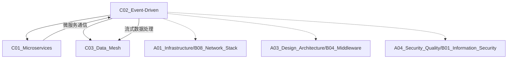

# C02 Event-Driven

**所属子领域**: [B01_Arch_Styles](../README.md)  
**创建日期**: 2026-01-30  
**最后更新**: 2026-01-30

## 📋 主题定位

事件驱动架构（Event-Driven Architecture, EDA）是一种以事件为核心通信机制的软件架构范式。通过事件的生产、检测、消费和响应，实现系统组件间的松耦合通信，特别适合异步处理、实时响应和复杂业务流程编排。

## 🎯 核心概念

### 基本定义

**事件（Event）**: 系统状态变化或业务动作发生的不可变记录，代表"某事已经发生"。事件通常包含：
- 事件类型/名称
- 发生时间戳
- 事件源（产生者）
- 负载数据（Payload）
- 元数据（追踪ID、版本等）

**事件驱动架构核心组件**:
- **事件生产者（Producer）**: 检测状态变化并发布事件
- **事件消费者（Consumer）**: 订阅感兴趣的事件并处理
- **事件通道（Channel）**: 事件的传输媒介（消息队列、Event Bus）
- **事件处理器（Processor）**: 执行业务逻辑的处理单元

### 架构模式

**1. 发布-订阅模式（Pub/Sub）**
- 生产者发布事件到主题（Topic）
- 多个消费者独立订阅感兴趣的主题
- 生产者与消费者完全解耦
- 典型实现：Kafka、RabbitMQ、Redis Pub/Sub

**2. 事件流处理（Event Streaming）**
- 连续的事件流实时处理
- 支持窗口计算、聚合分析
- 低延迟、高吞吐
- 典型实现：Kafka Streams、Flink、Spark Streaming

**3. 事件溯源（Event Sourcing）**
- 系统状态由事件序列决定
- 事件持久化存储作为真相源
- 支持状态回溯和时间旅行
- 典型应用：金融交易、订单系统

**4. CQRS（命令查询职责分离）**
- 写操作通过命令产生事件
- 读操作查询物化视图
- 与事件溯源常结合使用

**5. Saga 模式**
- 分布式事务的长事务处理
- 通过补偿事件实现回滚
- 编排式（Choreography）vs 协调式（Orchestration）

### 关键特性

| 特性 | 说明 | 优势 |
|------|------|------|
| **松耦合** | 生产者无需知道消费者存在 | 独立演进、易于扩展 |
| **异步通信** | 非阻塞消息传递 | 提高系统响应性 |
| **可扩展性** | 独立扩展生产者和消费者 | 应对流量高峰 |
| **容错性** | 消息持久化和重试机制 | 提升系统可靠性 |
| **可观测性** | 事件流天然可追踪 | 便于监控和审计 |

### 应用场景

- **微服务通信**: 服务间异步解耦
- **实时分析**: 日志流处理、用户行为分析
- ** IoT 数据处理**: 传感器数据收集和处理
- **金融交易**: 实时风控、交易处理
- **电商系统**: 订单状态流转、库存同步

## 🛠️ 技术实践

### 实现方法

**1. Apache Kafka 事件流平台**

```python
# 生产者实现
from kafka import KafkaProducer
import json

producer = KafkaProducer(
    bootstrap_servers=['kafka:9092'],
    value_serializer=lambda v: json.dumps(v).encode('utf-8'),
    key_serializer=lambda k: k.encode('utf-8') if k else None
)

# 发送订单创建事件
event = {
    "event_id": "evt_123456",
    "event_type": "OrderCreated",
    "timestamp": "2024-01-30T10:30:00Z",
    "aggregate_id": "order_789",
    "version": 1,
    "payload": {
        "order_id": "order_789",
        "customer_id": "cust_456",
        "items": [
            {"sku": "SKU001", "quantity": 2, "price": 29.99}
        ],
        "total_amount": 59.98,
        "currency": "USD"
    },
    "metadata": {
        "trace_id": "trace_abc123",
        "source": "order-service"
    }
}

producer.send(
    topic='orders',
    key=event['aggregate_id'],
    value=event
)
producer.flush()
```

```python
# 消费者实现
from kafka import KafkaConsumer
import json

consumer = KafkaConsumer(
    'orders',
    bootstrap_servers=['kafka:9092'],
    group_id='inventory-service',
    auto_offset_reset='earliest',
    enable_auto_commit=False,  # 手动提交偏移量
    value_deserializer=lambda m: json.loads(m.decode('utf-8'))
)

def process_order_created(event):
    """处理订单创建事件"""
    order_id = event['payload']['order_id']
    items = event['payload']['items']
    
    try:
        # 扣减库存
        for item in items:
            inventory_service.reserve(
                sku=item['sku'],
                quantity=item['quantity'],
                order_id=order_id
            )
        
        # 发送库存已预留事件
        emit_event("InventoryReserved", {
            "order_id": order_id,
            "items": items
        })
        
    except InsufficientInventory as e:
        # 发送库存不足事件
        emit_event("InventoryShortage", {
            "order_id": order_id,
            "error": str(e)
        })

# 消费循环
for message in consumer:
    event = message.value
    
    try:
        if event['event_type'] == 'OrderCreated':
            process_order_created(event)
        
        # 手动提交偏移量
        consumer.commit()
        
    except Exception as e:
        # 记录错误，进入死信队列处理
        logger.error(f"Failed to process event: {e}")
        send_to_dlq(message, str(e))
```

**2. 事件溯源实现**

```python
from typing import List, Dict, Any
from dataclasses import dataclass
from datetime import datetime
import json

@dataclass
class DomainEvent:
    event_id: str
    event_type: str
    aggregate_id: str
    aggregate_type: str
    version: int
    timestamp: str
    payload: Dict[str, Any]
    metadata: Dict[str, Any]

class EventStore:
    """事件存储"""
    
    def __init__(self, db_connection):
        self.db = db_connection
    
    def append(self, event: DomainEvent):
        """追加事件到存储"""
        query = """
            INSERT INTO events (event_id, event_type, aggregate_id, 
                              aggregate_type, version, timestamp, payload, metadata)
            VALUES (%s, %s, %s, %s, %s, %s, %s, %s)
        """
        self.db.execute(query, (
            event.event_id,
            event.event_type,
            event.aggregate_id,
            event.aggregate_type,
            event.version,
            event.timestamp,
            json.dumps(event.payload),
            json.dumps(event.metadata)
        ))
    
    def get_events(self, aggregate_id: str) -> List[DomainEvent]:
        """获取聚合的所有事件"""
        query = """
            SELECT * FROM events 
            WHERE aggregate_id = %s 
            ORDER BY version ASC
        """
        rows = self.db.query(query, (aggregate_id,))
        
        return [
            DomainEvent(
                event_id=row['event_id'],
                event_type=row['event_type'],
                aggregate_id=row['aggregate_id'],
                aggregate_type=row['aggregate_type'],
                version=row['version'],
                timestamp=row['timestamp'],
                payload=json.loads(row['payload']),
                metadata=json.loads(row['metadata'])
            )
            for row in rows
        ]

class AggregateRoot:
    """聚合根基类"""
    
    def __init__(self, aggregate_id: str):
        self._id = aggregate_id
        self._version = 0
        self._uncommitted_events: List[DomainEvent] = []
    
    def apply_event(self, event: DomainEvent):
        """应用事件到聚合状态"""
        handler = getattr(self, f'_on_{event.event_type.lower()}', None)
        if handler:
            handler(event.payload)
        self._version = event.version
    
    def emit_event(self, event_type: str, payload: Dict[str, Any]):
        """产生新事件"""
        self._version += 1
        event = DomainEvent(
            event_id=generate_uuid(),
            event_type=event_type,
            aggregate_id=self._id,
            aggregate_type=self.__class__.__name__,
            version=self._version,
            timestamp=datetime.utcnow().isoformat(),
            payload=payload,
            metadata={"trace_id": get_current_trace_id()}
        )
        self._uncommitted_events.append(event)
        self.apply_event(event)
    
    def get_uncommitted_events(self) -> List[DomainEvent]:
        return self._uncommitted_events
    
    def mark_committed(self):
        self._uncommitted_events.clear()

# 订单聚合示例
class Order(AggregateRoot):
    def __init__(self, order_id: str, customer_id: str):
        super().__init__(order_id)
        self.customer_id = customer_id
        self.items = []
        self.status = "Pending"
        self.total_amount = 0.0
        
        # 初始化事件
        self.emit_event("OrderCreated", {
            "order_id": order_id,
            "customer_id": customer_id,
            "created_at": datetime.utcnow().isoformat()
        })
    
    def add_item(self, sku: str, quantity: int, price: float):
        self.emit_event("ItemAdded", {
            "sku": sku,
            "quantity": quantity,
            "price": price
        })
    
    def confirm(self):
        if self.status != "Pending":
            raise InvalidStateError("Order can only be confirmed when pending")
        self.emit_event("OrderConfirmed", {
            "confirmed_at": datetime.utcnow().isoformat()
        })
    
    # 事件处理器
    def _on_ordercreated(self, payload):
        self.customer_id = payload['customer_id']
    
    def _on_itemadded(self, payload):
        self.items.append({
            "sku": payload['sku'],
            "quantity": payload['quantity'],
            "price": payload['price']
        })
        self.total_amount += payload['quantity'] * payload['price']
    
    def _on_orderconfirmed(self, payload):
        self.status = "Confirmed"

# 仓储实现
class OrderRepository:
    def __init__(self, event_store: EventStore):
        self.event_store = event_store
    
    def save(self, order: Order):
        """保存聚合（追加事件）"""
        for event in order.get_uncommitted_events():
            self.event_store.append(event)
        order.mark_committed()
    
    def load(self, order_id: str) -> Order:
        """加载聚合（重放事件）"""
        events = self.event_store.get_events(order_id)
        if not events:
            raise OrderNotFoundError(order_id)
        
        # 重建聚合状态
        order = Order.__new__(Order)
        AggregateRoot.__init__(order, order_id)
        
        for event in events:
            order.apply_event(event)
        
        return order
```

**3. Saga 分布式事务**

```python
from typing import Callable, List
from dataclasses import dataclass
import asyncio

@dataclass
class SagaStep:
    name: str
    action: Callable
    compensation: Callable

class SagaOrchestrator:
    """Saga 协调器（编排式）"""
    
    def __init__(self):
        self.steps: List[SagaStep] = []
        self.executed_steps: List[SagaStep] = []
    
    def add_step(self, step: SagaStep):
        self.steps.append(step)
    
    async def execute(self, context: dict):
        """执行 Saga"""
        for step in self.steps:
            try:
                await step.action(context)
                self.executed_steps.append(step)
            except Exception as e:
                # 执行补偿
                await self._compensate()
                raise SagaFailedError(f"Step {step.name} failed: {e}")
    
    async def _compensate(self):
        """执行补偿操作（倒序）"""
        for step in reversed(self.executed_steps):
            try:
                await step.compensation()
            except Exception as e:
                # 补偿失败需要人工介入
                logger.error(f"Compensation failed for {step.name}: {e}")
                alert_ops_team(step, e)

# 订单处理 Saga 示例
async def create_order_saga(order_data: dict):
    saga = SagaOrchestrator()
    
    # Step 1: 创建订单
    saga.add_step(SagaStep(
        name="create_order",
        action=lambda ctx: order_service.create(ctx['order_data']),
        compensation=lambda: order_service.cancel(order_data['order_id'])
    ))
    
    # Step 2: 扣减库存
    saga.add_step(SagaStep(
        name="reserve_inventory",
        action=lambda ctx: inventory_service.reserve(
            ctx['order_data']['items']
        ),
        compensation=lambda: inventory_service.release(
            order_data['items']
        )
    ))
    
    # Step 3: 处理支付
    saga.add_step(SagaStep(
        name="process_payment",
        action=lambda ctx: payment_service.charge(
            ctx['order_data']['payment']
        ),
        compensation=lambda: payment_service.refund(
            order_data['payment']['transaction_id']
        )
    ))
    
    # Step 4: 通知物流
    saga.add_step(SagaStep(
        name="notify_shipping",
        action=lambda ctx: shipping_service.schedule(
            ctx['order_data']['shipping_address']
        ),
        compensation=lambda: shipping_service.cancel_shipment(
            order_data['order_id']
        )
    ))
    
    await saga.execute({'order_data': order_data})
```

**4. CQRS 实现**

```python
# 命令端（写模型）
class OrderCommandHandler:
    def __init__(self, repository: OrderRepository, event_bus: EventBus):
        self.repository = repository
        self.event_bus = event_bus
    
    def handle_create_order(self, cmd: CreateOrderCommand):
        order = Order(cmd.order_id, cmd.customer_id)
        for item in cmd.items:
            order.add_item(item.sku, item.quantity, item.price)
        
        self.repository.save(order)
        
        # 发布事件
        for event in order.get_uncommitted_events():
            self.event_bus.publish(event)

# 查询端（读模型）
class OrderQueryHandler:
    def __init__(self, read_db):
        self.read_db = read_db
    
    def get_order_summary(self, order_id: str) -> OrderSummary:
        """从物化视图查询"""
        return self.read_db.query_one("""
            SELECT order_id, customer_name, total_amount, status
            FROM order_summary_view
            WHERE order_id = %s
        """, (order_id,))
    
    def search_orders(self, criteria: SearchCriteria) -> List[OrderSummary]:
        """复杂查询"""
        query = """
            SELECT * FROM order_summary_view
            WHERE created_at BETWEEN %s AND %s
        """
        return self.read_db.query(query, (criteria.start_date, criteria.end_date))

# 事件投影器（同步读写模型）
class OrderProjector:
    def __init__(self, read_db):
        self.read_db = read_db
    
    def project(self, event: DomainEvent):
        """将领域事件投影到读模型"""
        if event.event_type == "OrderCreated":
            self.read_db.execute("""
                INSERT INTO order_summary_view 
                (order_id, customer_id, status, created_at)
                VALUES (%s, %s, %s, %s)
            """, (
                event.aggregate_id,
                event.payload['customer_id'],
                "Pending",
                event.payload['created_at']
            ))
        
        elif event.event_type == "ItemAdded":
            self.read_db.execute("""
                UPDATE order_summary_view
                SET total_amount = total_amount + %s
                WHERE order_id = %s
            """, (
                event.payload['quantity'] * event.payload['price'],
                event.aggregate_id
            ))
        
        elif event.event_type == "OrderConfirmed":
            self.read_db.execute("""
                UPDATE order_summary_view
                SET status = 'Confirmed', confirmed_at = %s
                WHERE order_id = %s
            """, (
                event.payload['confirmed_at'],
                event.aggregate_id
            ))
```

### 最佳实践

**1. 事件设计规范**

```yaml
# 事件命名规范
事件名称: [名词][动词过去式]
示例:
  - OrderCreated
  - PaymentReceived  
  - InventoryReserved

# 事件结构
{
  "event_id": "唯一标识符",
  "event_type": "事件类型",
  "timestamp": "ISO8601时间戳",
  "aggregate_id": "聚合根ID",
  "aggregate_type": "聚合类型",
  "version": "版本号（用于乐观锁）",
  "payload": {
    # 事件相关业务数据
  },
  "metadata": {
    "trace_id": "分布式追踪ID",
    "user_id": "操作者ID",
    "source": "事件来源服务"
  }
}
```

**2. 消息可靠性保障**

| 机制 | 实现方式 | 适用场景 |
|------|----------|----------|
| **至少一次交付** | 生产者重试 + 消费者幂等 | 通用场景 |
| **恰好一次交付** | Kafka 幂等生产者 + 事务 | 金融交易 |
| **顺序保证** | 分区键设计 | 订单状态流转 |
| **死信队列** | 失败消息进入 DLQ | 错误处理 |

**3. 性能优化**

```python
# 批量处理
class BatchConsumer:
    def __init__(self, batch_size=100, flush_interval=5):
        self.batch_size = batch_size
        self.flush_interval = flush_interval
        self.buffer = []
        self.last_flush = time.time()
    
    def consume(self, message):
        self.buffer.append(message)
        
        if (len(self.buffer) >= self.batch_size or 
            time.time() - self.last_flush > self.flush_interval):
            self._flush()
    
    def _flush(self):
        if not self.buffer:
            return
        
        # 批量写入数据库
        db.bulk_insert(self.buffer)
        
        # 批量提交 Kafka 偏移量
        consumer.commit()
        
        self.buffer.clear()
        self.last_flush = time.time()

# 并发消费
from concurrent.futures import ThreadPoolExecutor

class ConcurrentConsumer:
    def __init__(self, max_workers=10):
        self.executor = ThreadPoolExecutor(max_workers=max_workers)
    
    def consume(self, message):
        self.executor.submit(self._process, message)
```

### 常见陷阱

**1. 事件顺序问题**
- ❌ 假设事件按产生顺序到达
- ✅ 使用版本号实现乐观锁
- ✅ 设计幂等消费者

**2. 循环依赖**
- ❌ 服务 A → 事件 → 服务 B → 事件 → 服务 A
- ✅ 明确事件流向，避免双向依赖
- ✅ 使用 Saga 协调复杂流程

**3. 数据一致性**
- ❌ 读模型滞后导致数据不一致
- ✅ 业务设计接受最终一致性
- ✅ 关键操作查询写模型

**4. 事件风暴**
- ❌ 产生过多细小事件
- ✅ 平衡粒度，避免性能问题
- ✅ 使用快照减少事件重放时间

## 📚 资源索引

### 学术论文

1. **Event-Driven Architecture: How SOA Enables the Real-Time Enterprise**
   - 作者：Hugh Taylor et al.
   - 说明：EDA 在企业中的应用实践

2. **Event Sourcing and CQRS**
   - 作者：Martin Fowler
   - 链接：https://martinfowler.com/eaaDev/EventSourcing.html
   - 说明：事件溯源模式的权威解释

3. **Saga Pattern for Microservices**
   - 作者：Chris Richardson
   - 链接：https://microservices.io/patterns/data/saga.html
   - 说明：分布式事务的 Saga 模式

### 技术文档

1. **Apache Kafka 官方文档**
   - https://kafka.apache.org/documentation/
   - 事件流平台权威指南

2. **Confluent 设计模式**
   - https://www.confluent.io/design-patterns/
   - Kafka 生态系统设计模式

3. **AWS Event-Driven Architecture**
   - https://aws.amazon.com/event-driven-architecture/
   - 云原生 EDA 最佳实践

### 开源项目

1. **Axon Framework**
   - https://axoniq.io/product-overview/axon-framework
   - Java 领域驱动和事件溯源框架

2. **EventStoreDB**
   - https://www.eventstore.com/
   - 专为事件溯源设计的数据库

3. **NATS**
   - https://nats.io/
   - 云原生消息系统

4. **Pulsar**
   - https://pulsar.apache.org/
   - 下一代分布式消息流平台

### 书籍推荐

1. **《Enterprise Integration Patterns》**
   - 作者：Gregor Hohpe, Bobby Woolf
   - 说明：企业集成模式经典

2. **《Designing Event-Driven Systems》**
   - 作者：Ben Stopford
   - 说明：Confluent 首席工程师的 Kafka 实践

3. **《Exploring CQRS and Event Sourcing》**
   - 作者：Dominic Betts 等
   - 说明：微软 patterns & practices 系列

## 🔗 关联知识



## 💡 学习建议

### 前置知识
- 分布式系统基础
- 消息队列原理
- 数据库事务和一致性
- 微服务架构

### 学习路径

**第1周：基础概念**
- 理解事件、命令、状态的区别
- 学习 Pub/Sub 和消息队列
- 实践 Kafka/RabbitMQ 基础

**第2周：事件驱动模式**
- 实现事件溯源原型
- 练习 CQRS 模式
- 学习 Saga 分布式事务

**第3周：流处理**
- Kafka Streams/Flink 基础
- 窗口计算和聚合
- 实时分析实践

**第4周：生产实践**
- 容错设计
- 监控和可观测性
- 性能调优

### 实践项目

**项目1：订单处理系统**
- 事件溯源实现
- Saga 分布式事务
- 实时订单追踪

**项目2：实时数据分析**
- 用户行为事件流
- 实时指标计算
- 异常检测告警

**项目3：物联网数据处理**
- 传感器数据收集
- 实时数据清洗
- 设备状态管理

## 🔄 维护说明

- **更新频率**: 每季度审查新兴事件流技术
- **质量标准**: 代码示例可运行，架构图清晰
- **贡献方式**: 提交新的 EDA 模式、优化技巧、案例研究
