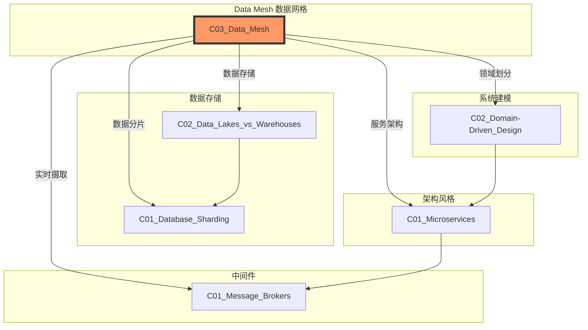
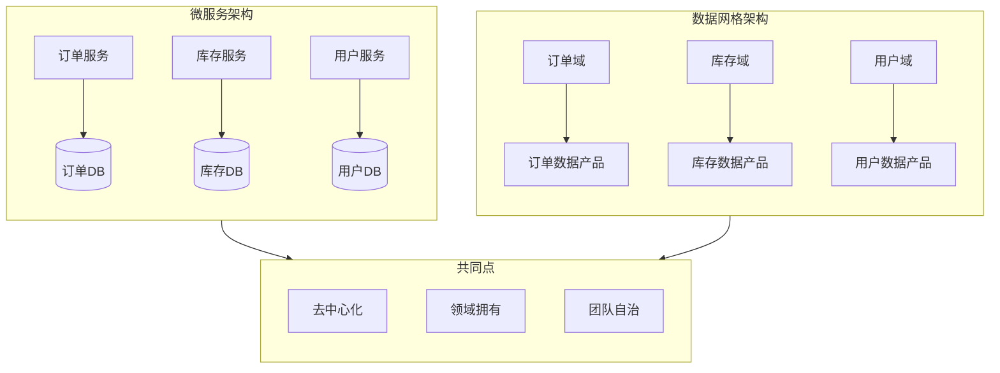
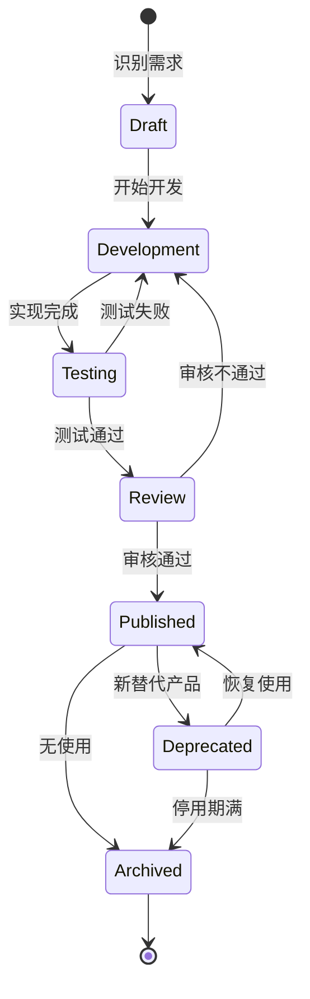

# C03 Data Mesh - 数据网格

**领域**: A03_Design_Architecture/B01_Arch_Styles  
**创建日期**: 2026-01-30  
**最后更新**: 2026-01-30

---

## 1. 主题定位

### 1.1 定义与本质

数据网格（Data Mesh）是一种去中心化的 sociotechnical 数据架构方法，由ThoughtWorks的Zhamak Dehghani于2019年提出。它代表了从集中式数据平台向分布式领域驱动数据架构的根本性转变。

数据网格的核心理念是：将数据视为产品，由领域团队拥有，通过自助式数据平台实现跨域数据共享，同时保持联邦化的治理。

### 1.2 架构演进背景

```
数据架构演进时间线:

第一代 (2000s): 数据仓库 (Data Warehouse)
    ┌─────────────────────────────────────┐
    │  ETL → 中央数据仓库 → BI报告        │
    └─────────────────────────────────────┘
    特点: 结构化数据、批处理、IT驱动

第二代 (2010s): 数据湖 (Data Lake)
    ┌─────────────────────────────────────┐
    │  原始数据 → 数据湖 → 多种处理引擎   │
    └─────────────────────────────────────┘
    特点: 原始格式存储、大数据技术、数据科学家主导

第三代 (2015s): 湖仓一体 (Lakehouse)
    ┌─────────────────────────────────────┐
    │  统一存储层 + 事务支持 + ML+SQL     │
    └─────────────────────────────────────┘
    特点: 结构化+非结构化、ACID事务、统一分析

第四代 (2019+): 数据网格 (Data Mesh)
    ┌─────────────────────────────────────┐
    │  领域数据产品 + 自助平台 + 联邦治理  │
    └─────────────────────────────────────┘
    特点: 去中心化、领域驱动、数据即产品
```

### 1.3 核心问题与挑战

传统集中式数据架构面临的主要挑战：

| 挑战 | 描述 | 影响 |
|------|------|------|
| **规模化瓶颈** | 中央数据团队成为瓶颈 | 数据需求交付周期长达数月 |
| **领域知识缺失** | 数据工程师缺乏业务上下文 | 数据模型与实际业务脱节 |
| **单点故障** | 中央平台故障影响全公司 | 数据服务可用性风险 |
| **创新抑制** | 统一技术栈限制灵活性 | 无法快速采用新技术 |
| **组织摩擦** | 数据生产者与消费者割裂 | 数据质量责任不清 |

---

## 2. 核心概念

### 2.1 数据网格四大原则

#### 2.1.1 领域所有权 (Domain Ownership)

将数据责任从中央数据团队转移到业务领域团队。每个领域团队拥有其数据的端到端生命周期。

```
传统模式:                          数据网格模式:
                                   
  ┌──────────────┐                 ┌──────────────┐
  │  中央数据团队  │                 │   领域团队A   │◄── 订单数据产品
  │   (瓶颈)     │                 ├──────────────┤
  └──────┬───────┘                 │   领域团队B   │◄── 库存数据产品
         │                         ├──────────────┤
    ┌────┴────┐                    │   领域团队C   │◄── 用户数据产品
    ▼         ▼                    └──────────────┘
 领域A     领域B                        │
                                     自助平台
```

#### 2.1.2 数据即产品 (Data as a Product)

将数据资产视为可发现、可寻址、可信赖、自描述、可互操作和安全的产品。

**数据产品的七大特性：**

| 特性 | 描述 | 实践示例 |
|------|------|----------|
| 可发现性 | 易于找到和理解 | 数据目录、元数据管理 |
| 可寻址性 | 全局唯一标识 | 标准化URN命名 |
| 可信赖性 | 服务等级承诺 | SLA定义、数据质量监控 |
| 自描述性 | 清晰的语义和文档 | 数据字典、业务词汇表 |
| 可互操作性 | 遵循通用标准 | 开放数据格式、标准Schema |
| 安全性 | 访问控制和隐私 | 行级/列级权限、数据脱敏 |
| 价值性 | 满足消费者需求 | 用户反馈、使用统计 |

#### 2.1.3 自助式数据平台 (Self-Serve Data Platform)

提供抽象的基础设施层，使领域团队能够以自助方式创建、发布和消费数据产品，无需深厚的数据工程专业知识。

```
┌─────────────────────────────────────────────────────────────────┐
│                     自助式数据平台架构                           │
├─────────────────────────────────────────────────────────────────┤
│                                                                 │
│  ┌─────────────────────────────────────────────────────────┐   │
│  │                    平台接口层 (Portal)                   │   │
│  │   数据目录 │ 数据质量 │ 血缘分析 │ 访问控制 │ 监控告警   │   │
│  └─────────────────────────────────────────────────────────┘   │
│                              │                                  │
│  ┌───────────────────────────┼─────────────────────────────┐   │
│  │                           ▼                             │   │
│  │  ┌────────────┐  ┌────────────┐  ┌────────────────┐    │   │
│  │  │ 存储抽象   │  │ 计算抽象   │  │ 管道抽象       │    │   │
│  │  │ - 对象存储 │  │ - SQL引擎  │  │ - 流处理       │    │   │
│  │  │ - 数据仓库 │  │ - ML平台   │  │ - 批处理       │    │   │
│  │  │ - 数据湖   │  │ - 即席查询 │  │ - 数据同步     │    │   │
│  │  └────────────┘  └────────────┘  └────────────────┘    │   │
│  │                                                         │   │
│  │  ┌─────────────────────────────────────────────────┐   │   │
│  │  │           数据基础设施层 (底层技术)              │   │   │
│  │  │  S3/ADLS  │  Snowflake  │  Spark  │  Kafka     │   │   │
│  │  └─────────────────────────────────────────────────┘   │   │
│  │                                                         │   │
│  └─────────────────────────────────────────────────────────┘   │
│                                                                 │
└─────────────────────────────────────────────────────────────────┘
```

#### 2.1.4 联邦计算治理 (Federated Computational Governance)

通过自动化策略实现全局标准化，同时允许领域级别的自主性。

```
治理模型演进:

集中式治理:                     联邦式治理:
                                 
  ┌────────────┐                 ┌────────────┐
  │ 中央治理委员会│                 │ 治理标准   │
  │  (人工审批) │                 │ (自动化策略)│
  └──────┬─────┘                 └──────┬─────┘
         │                             │
    ┌────┴────┐                    ┌───┴───┐
    ▼         ▼                    ▼       ▼
 领域A     领域B                 领域A   领域B
  (受限)    (受限)                (自治)  (自治)
                                  但遵循标准
```

### 2.2 数据网格拓扑结构

```
┌─────────────────────────────────────────────────────────────────┐
│                      数据网格拓扑                                │
├─────────────────────────────────────────────────────────────────┤
│                                                                 │
│  ┌─────────────────────────────────────────────────────────┐   │
│  │                    数据消费层                            │   │
│  │  BI报表 │ ML模型 │ 数据应用 │ 分析仪表板 │ API服务      │   │
│  └─────────────────────────────────────────────────────────┘   │
│                              │                                  │
│                              ▼                                  │
│  ┌─────────────────────────────────────────────────────────┐   │
│  │                    数据产品层                            │   │
│  │                                                         │   │
│  │  ┌──────────┐  ┌──────────┐  ┌──────────┐  ┌────────┐  │   │
│  │  │订单数据  │  │库存数据  │  │用户数据  │  │支付数据│  │   │
│  │  │  产品   │  │  产品   │  │  产品   │  │  产品  │  │   │
│  │  │         │  │         │  │         │  │        │  │   │
│  │  │• 订单表 │  │• 库存表 │  │• 用户表 │  │• 交易表│  │   │
│  │  │• 明细表 │  │• 流水表 │  │• 行为表 │  │• 对账表│  │   │
│  │  │• 汇总表 │  │• 预警表 │  │• 标签表 │  │• 风控表│  │   │
│  │  │         │  │         │  │         │  │        │  │   │
│  │  │ 输出接口 │  │ 输出接口 │  │ 输出接口 │  │输出接口│  │   │
│  │  │REST/API │  │REST/API │  │GraphQL  │  │gRPC    │  │   │
│  │  └──────────┘  └──────────┘  └──────────┘  └────────┘  │   │
│  │                                                         │   │
│  └─────────────────────────────────────────────────────────┘   │
│                              │                                  │
│                              ▼                                  │
│  ┌─────────────────────────────────────────────────────────┐   │
│  │                  自助数据平台层                          │   │
│  │  存储引擎 │ 计算引擎 │ 编排调度 │ 数据质量 │ 安全治理    │   │
│  └─────────────────────────────────────────────────────────┘   │
│                              │                                  │
│                              ▼                                  │
│  ┌─────────────────────────────────────────────────────────┐   │
│  │                   源系统层                               │   │
│  │  业务系统 │ ERP │ CRM │ IoT │ 外部API │ 日志流           │   │
│  └─────────────────────────────────────────────────────────┘   │
│                                                                 │
└─────────────────────────────────────────────────────────────────┘
```

### 2.3 数据产品接口设计

#### 2.3.1 多模态输出接口

```
数据产品接口类型:

┌─────────────┐     ┌─────────────┐     ┌─────────────┐
│  文件接口   │     │  表接口     │     │  流接口     │
│  (Batch)    │     │  (OLAP)     │     │  (Stream)   │
├─────────────┤     ├─────────────┤     ├─────────────┤
│ • Parquet   │     │ • SQL视图   │     │ • Kafka     │
│ • Delta     │     │ • Iceberg   │     │ • Pulsar    │
│ • CSV       │     │ • Hive表    │     │ • Kinesis   │
│ • JSON      │     │ • 物化视图  │     │ • Pub/Sub   │
└─────────────┘     └─────────────┘     └─────────────┘

┌─────────────┐     ┌─────────────┐     ┌─────────────┐
│  API接口    │     │  事件接口   │     │  缓存接口   │
│  (Online)   │     │  (Event)    │     │  (Cache)    │
├─────────────┤     ├─────────────┤     ├─────────────┤
│ • REST      │     │ • 领域事件  │     │ • Redis     │
│ • GraphQL   │     │ • CDC流     │     │ • Memcached │
│ • gRPC      │     │ • 通知事件  │     │ • Hazelcast │
│ • OData     │     │ • 审计事件  │     │ • Aerospike │
└─────────────┘     └─────────────┘     └─────────────┘
```

#### 2.3.2 数据契约 (Data Contract)

```yaml
# data-contract-example.yaml
data_product:
  name: orders
  domain: commerce
  owner: order-team@example.com
  version: 2.1.0
  
schema:
  type: table
  format: iceberg
  location: s3://data-products/commerce/orders/v2/
  
  fields:
    - name: order_id
      type: string
      nullable: false
      description: "Unique order identifier"
      pii: false
      
    - name: customer_id
      type: string
      nullable: false
      description: "Customer reference"
      pii: true
      encryption: aes256
      
    - name: order_total
      type: decimal(18,2)
      nullable: false
      description: "Total order amount"
      
    - name: order_status
      type: string
      nullable: false
      enum: [PENDING, CONFIRMED, SHIPPED, DELIVERED, CANCELLED]
      
    - name: created_at
      type: timestamp
      nullable: false
      description: "Order creation timestamp"
      
  partitions:
    - created_at: year-month
    
quality:
  freshness:
    threshold: 1h
    check_interval: 15m
    
  completeness:
    - column: order_id
      min_not_null: 100%
    - column: customer_id
      min_not_null: 100%
      
  accuracy:
    - rule: order_total > 0
      severity: error
    - rule: created_at <= current_timestamp()
      severity: warning
      
access:
  roles:
    - name: data_analyst
      permissions: [SELECT]
      row_filter: "created_at >= date_sub(current_date(), 365)"
      
    - name: data_scientist
      permissions: [SELECT]
      column_mask:
        customer_id: "hash(customer_id)"
        
    - name: service_account
      permissions: [SELECT, INSERT]
      
sla:
  availability: 99.9%
  latency_p99: 500ms
  
lineage:
  upstream:
    - source: mysql://orders-db/orders
      type: cdc
  downstream:
    - consumer: analytics-team
      usage: daily_report
    - consumer: ml-platform
      usage: churn_prediction
      
documentation:
  description: "Complete order data including line items and status"
  business_terms:
    - term: order_total
      definition: "Sum of all line item prices minus discounts"
  
  examples:
    query: |
      SELECT order_id, order_total 
      FROM commerce.orders 
      WHERE created_at >= '2026-01-01'
```

---

## 3. 技术实践

### 3.1 数据产品实现 - Python

```python
# data_product_framework.py
"""
数据产品框架 - 基于Databricks和Delta Lake的实现
"""

from dataclasses import dataclass, field
from typing import Optional, List, Dict, Callable, Any
from datetime import datetime, timedelta
from enum import Enum
import json
import hashlib
from abc import ABC, abstractmethod

import boto3
from delta import DeltaTable, configure_spark_with_delta_pip
from pyspark.sql import SparkSession, DataFrame
from pyspark.sql.functions import col, current_timestamp, lit, when
from pyspark.sql.types import StructType
import great_expectations as ge
from great_expectations.core import ExpectationSuite


class DataProductStatus(Enum):
    DRAFT = "draft"
    ACTIVE = "active"
    DEPRECATED = "deprecated"
    ARCHIVED = "archived"


class InterfaceType(Enum):
    TABLE = "table"
    STREAM = "stream"
    API = "api"
    FILE = "file"


@dataclass
class DataContract:
    """数据契约定义"""
    name: str
    domain: str
    owner: str
    version: str
    schema: Dict[str, Any]
    quality_rules: List[Dict] = field(default_factory=list)
    access_policies: List[Dict] = field(default_factory=list)
    sla: Dict[str, Any] = field(default_factory=dict)
    
    def to_dict(self) -> Dict:
        return {
            "name": self.name,
            "domain": self.domain,
            "owner": self.owner,
            "version": self.version,
            "schema": self.schema,
            "quality_rules": self.quality_rules,
            "access_policies": self.access_policies,
            "sla": self.sla
        }


class DataProduct(ABC):
    """数据产品抽象基类"""
    
    def __init__(
        self,
        contract: DataContract,
        spark: SparkSession
    ):
        self.contract = contract
        self.spark = spark
        self.status = DataProductStatus.DRAFT
        self.created_at = datetime.utcnow()
        self.metrics = {}
        
    @abstractmethod
    def transform(self, source_df: DataFrame) -> DataFrame:
        """数据转换逻辑，子类必须实现"""
        pass
    
    def validate_schema(self, df: DataFrame) -> bool:
        """验证数据Schema是否符合契约"""
        expected_schema = self.contract.schema.get("fields", [])
        actual_columns = set(df.columns)
        expected_columns = {field["name"] for field in expected_schema}
        
        missing = expected_columns - actual_columns
        extra = actual_columns - expected_columns
        
        if missing or extra:
            print(f"Schema mismatch - Missing: {missing}, Extra: {extra}")
            return False
        return True
    
    def validate_quality(self, df: DataFrame) -> Dict[str, Any]:
        """执行数据质量检查"""
        results = {
            "passed": 0,
            "failed": 0,
            "checks": []
        }
        
        for rule in self.contract.quality_rules:
            check_result = self._execute_quality_check(df, rule)
            results["checks"].append(check_result)
            
            if check_result["passed"]:
                results["passed"] += 1
            else:
                results["failed"] += 1
        
        return results
    
    def _execute_quality_check(self, df: DataFrame, rule: Dict) -> Dict:
        """执行单个质量检查"""
        rule_type = rule.get("type")
        column = rule.get("column")
        
        if rule_type == "not_null":
            null_count = df.filter(col(column).isNull()).count()
            passed = null_count == 0
            return {
                "rule": f"{column} not null",
                "passed": passed,
                "details": f"Found {null_count} null values"
            }
        
        elif rule_type == "range":
            min_val = rule.get("min")
            max_val = rule.get("max")
            violations = df.filter(
                (col(column) < min_val) | (col(column) > max_val)
            ).count()
            passed = violations == 0
            return {
                "rule": f"{column} in range [{min_val}, {max_val}]",
                "passed": passed,
                "details": f"Found {violations} out-of-range values"
            }
        
        elif rule_type == "custom":
            condition = rule.get("condition")
            violations = df.filter(~eval(condition)).count()
            passed = violations == 0
            return {
                "rule": condition,
                "passed": passed,
                "details": f"Found {violations} violations"
            }
        
        return {"rule": str(rule), "passed": True, "details": "Unknown rule type"}
    
    def publish(self, target_path: str, mode: str = "overwrite") -> bool:
        """发布数据产品"""
        try:
            # 1. 读取源数据
            source_df = self._read_source()
            
            # 2. 执行转换
            transformed_df = self.transform(source_df)
            
            # 3. Schema验证
            if not self.validate_schema(transformed_df):
                raise ValueError("Schema validation failed")
            
            # 4. 质量检查
            quality_results = self.validate_quality(transformed_df)
            if quality_results["failed"] > 0:
                failed_rules = [c for c in quality_results["checks"] if not c["passed"]]
                raise ValueError(f"Quality checks failed: {failed_rules}")
            
            # 5. 写入Delta Lake
            self._write_delta(transformed_df, target_path, mode)
            
            # 6. 注册元数据
            self._register_metadata(target_path)
            
            # 7. 更新状态
            self.status = DataProductStatus.ACTIVE
            
            print(f"✅ Data product {self.contract.name} published successfully")
            return True
            
        except Exception as e:
            print(f"❌ Failed to publish data product: {str(e)}")
            return False
    
    def _read_source(self) -> DataFrame:
        """读取源数据 - 子类可覆盖"""
        source_config = self.contract.schema.get("source")
        if not source_config:
            raise ValueError("Source configuration not found")
        
        source_type = source_config.get("type")
        
        if source_type == "delta":
            return self.spark.read.format("delta").load(source_config["path"])
        elif source_type == "jdbc":
            return self.spark.read \
                .format("jdbc") \
                .option("url", source_config["url"]) \
                .option("dbtable", source_config["table"]) \
                .option("user", source_config["user"]) \
                .option("password", source_config["password"]) \
                .load()
        else:
            raise ValueError(f"Unsupported source type: {source_type}")
    
    def _write_delta(self, df: DataFrame, path: str, mode: str):
        """写入Delta表"""
        df.write \
            .format("delta") \
            .mode(mode) \
            .option("mergeSchema", "true") \
            .save(path)
    
    def _register_metadata(self, path: str):
        """注册元数据到数据目录"""
        metadata = {
            "data_product": self.contract.to_dict(),
            "location": path,
            "status": self.status.value,
            "created_at": self.created_at.isoformat(),
            "updated_at": datetime.utcnow().isoformat()
        }
        
        # 这里应该写入数据目录服务（如DataHub、Alation等）
        print(f"Registering metadata: {json.dumps(metadata, indent=2)}")
    
    def get_lineage(self) -> Dict[str, List[str]]:
        """获取数据血缘"""
        return {
            "upstream": self.contract.schema.get("upstream", []),
            "downstream": self.contract.schema.get("downstream", [])
        }


class OrdersDataProduct(DataProduct):
    """订单数据产品具体实现"""
    
    def __init__(self, spark: SparkSession):
        contract = DataContract(
            name="orders",
            domain="commerce",
            owner="order-team@example.com",
            version="2.0.0",
            schema={
                "fields": [
                    {"name": "order_id", "type": "string", "nullable": False},
                    {"name": "customer_id", "type": "string", "nullable": False},
                    {"name": "order_total", "type": "decimal(18,2)", "nullable": False},
                    {"name": "order_status", "type": "string", "nullable": False},
                    {"name": "created_at", "type": "timestamp", "nullable": False},
                    {"name": "updated_at", "type": "timestamp", "nullable": False}
                ],
                "partitions": ["created_at"],
                "source": {
                    "type": "delta",
                    "path": "/raw/orders"
                }
            },
            quality_rules=[
                {"type": "not_null", "column": "order_id"},
                {"type": "not_null", "column": "customer_id"},
                {"type": "custom", "condition": "col('order_total') > 0"},
                {
                    "type": "custom", 
                    "condition": "col('order_status').isin(['PENDING', 'CONFIRMED', 'SHIPPED', 'DELIVERED', 'CANCELLED'])"
                }
            ],
            access_policies=[
                {"role": "analyst", "permissions": ["SELECT"]},
                {"role": "data_engineer", "permissions": ["SELECT", "INSERT"]}
            ],
            sla={
                "freshness": "1h",
                "availability": "99.9%"
            }
        )
        super().__init__(contract, spark)
    
    def transform(self, source_df: DataFrame) -> DataFrame:
        """订单数据转换逻辑"""
        return source_df \
            .select(
                col("order_id"),
                col("customer_id"),
                col("total_amount").alias("order_total"),
                col("status").alias("order_status"),
                col("created_at"),
                current_timestamp().alias("updated_at")
            ) \
            .filter(col("created_at") >= lit("2024-01-01")) \
            .dropDuplicates(["order_id"])


class DataMeshPlatform:
    """自助式数据平台"""
    
    def __init__(self, spark: SparkSession):
        self.spark = spark
        self.data_products: Dict[str, DataProduct] = {}
        self.catalog = {}
    
    def register_data_product(self, product: DataProduct) -> bool:
        """注册数据产品到平台"""
        key = f"{product.contract.domain}.{product.contract.name}"
        self.data_products[key] = product
        print(f"Registered data product: {key}")
        return True
    
    def discover(self, domain: Optional[str] = None) -> List[Dict]:
        """发现数据产品"""
        results = []
        for key, product in self.data_products.items():
            if domain is None or product.contract.domain == domain:
                results.append({
                    "name": product.contract.name,
                    "domain": product.contract.domain,
                    "owner": product.contract.owner,
                    "version": product.contract.version,
                    "status": product.status.value
                })
        return results
    
    def get_data_product(self, domain: str, name: str) -> Optional[DataProduct]:
        """获取指定数据产品"""
        key = f"{domain}.{name}"
        return self.data_products.get(key)
    
    def create_access_token(
        self, 
        data_product_key: str, 
        role: str, 
        expiry: timedelta = timedelta(days=7)
    ) -> str:
        """创建数据访问令牌"""
        token_data = {
            "data_product": data_product_key,
            "role": role,
            "expiry": (datetime.utcnow() + expiry).isoformat()
        }
        # 简化实现，实际应使用JWT或其他安全机制
        return hashlib.sha256(json.dumps(token_data).encode()).hexdigest()
    
    def query_data_product(
        self, 
        domain: str, 
        name: str, 
        sql: str,
        access_token: str
    ) -> Optional[DataFrame]:
        """查询数据产品"""
        # 1. 验证访问令牌
        # 2. 检查权限
        # 3. 执行查询
        
        product = self.get_data_product(domain, name)
        if not product:
            raise ValueError(f"Data product not found: {domain}.{name}")
        
        # 注册临时视图
        path = f"/data-products/{domain}/{name}"
        df = self.spark.read.format("delta").load(path)
        df.createOrReplaceTempView(name)
        
        return self.spark.sql(sql)


# 使用示例
def main():
    # 初始化Spark会话
    builder = SparkSession.builder \
        .appName("DataMeshPlatform") \
        .config("spark.sql.extensions", "io.delta.sql.DeltaSparkSessionExtension") \
        .config("spark.sql.catalog.spark_catalog", "org.apache.spark.sql.delta.catalog.DeltaCatalog")
    
    spark = configure_spark_with_delta_pip(builder).getOrCreate()
    
    # 创建平台实例
    platform = DataMeshPlatform(spark)
    
    # 创建并注册订单数据产品
    orders_product = OrdersDataProduct(spark)
    platform.register_data_product(orders_product)
    
    # 发布数据产品
    orders_product.publish("/data-products/commerce/orders", mode="overwrite")
    
    # 发现数据产品
    print("\n=== Available Data Products ===")
    for product_info in platform.discover():
        print(f"  - {product_info['domain']}.{product_info['name']} "
              f"(v{product_info['version']}, {product_info['status']})")
    
    # 查询数据产品
    print("\n=== Query Result ===")
    result_df = platform.query_data_product(
        "commerce", 
        "orders",
        "SELECT order_status, COUNT(*) as count FROM orders GROUP BY order_status",
        "dummy_token"
    )
    
    if result_df:
        result_df.show()
    
    spark.stop()


if __name__ == "__main__":
    main()
```

### 3.2 数据合约验证 - Python/Great Expectations

```python
# data_contract_validation.py
"""
数据契约验证框架
使用Great Expectations实现数据质量检查
"""

import json
from typing import Dict, List, Any, Optional
from dataclasses import dataclass
from datetime import datetime
import great_expectations as gx
from great_expectations.core import ExpectationSuite, ExpectationConfiguration
from great_expectations.dataset import Dataset
import pandas as pd


@dataclass
class ValidationResult:
    """验证结果"""
    success: bool
    check_name: str
    observed_value: Any
    expected_value: Any
    details: Dict[str, Any]
    timestamp: datetime


class DataContractValidator:
    """数据契约验证器"""
    
    def __init__(self, contract_path: str):
        self.contract = self._load_contract(contract_path)
        self.context = gx.get_context()
        self.results: List[ValidationResult] = []
    
    def _load_contract(self, path: str) -> Dict:
        """加载数据契约"""
        with open(path, 'r') as f:
            return json.load(f)
    
    def validate_schema(self, df: pd.DataFrame) -> List[ValidationResult]:
        """验证数据Schema"""
        results = []
        schema = self.contract.get("schema", {})
        fields = schema.get("fields", [])
        
        # 检查必需列
        required_columns = {f["name"] for f in fields if not f.get("nullable", True)}
        actual_columns = set(df.columns)
        
        for col_name in required_columns:
            result = ValidationResult(
                success=col_name in actual_columns,
                check_name=f"schema_required_column_{col_name}",
                observed_value="present" if col_name in actual_columns else "missing",
                expected_value="present",
                details={"column": col_name},
                timestamp=datetime.now()
            )
            results.append(result)
        
        # 检查数据类型
        type_mapping = {
            "string": "object",
            "integer": "int64",
            "long": "int64",
            "float": "float64",
            "double": "float64",
            "boolean": "bool",
            "timestamp": "datetime64[ns]",
            "date": "datetime64[ns]"
        }
        
        for field in fields:
            col_name = field["name"]
            expected_type = type_mapping.get(field["type"], "object")
            
            if col_name in df.columns:
                actual_type = str(df[col_name].dtype)
                # 简化类型检查
                type_match = expected_type in actual_type or actual_type in expected_type
                
                result = ValidationResult(
                    success=type_match,
                    check_name=f"schema_type_{col_name}",
                    observed_value=actual_type,
                    expected_value=expected_type,
                    details={"column": col_name},
                    timestamp=datetime.now()
                )
                results.append(result)
        
        self.results.extend(results)
        return results
    
    def validate_quality(self, df: pd.DataFrame) -> List[ValidationResult]:
        """验证数据质量规则"""
        results = []
        quality_rules = self.contract.get("quality", {}).get("rules", [])
        
        for rule in quality_rules:
            rule_type = rule.get("type")
            
            if rule_type == "not_null":
                results.extend(self._check_not_null(df, rule))
            elif rule_type == "unique":
                results.extend(self._check_unique(df, rule))
            elif rule_type == "range":
                results.extend(self._check_range(df, rule))
            elif rule_type == "regex":
                results.extend(self._check_regex(df, rule))
            elif rule_type == "enum":
                results.extend(self._check_enum(df, rule))
            elif rule_type == "custom_sql":
                results.extend(self._check_custom_sql(df, rule))
        
        self.results.extend(results)
        return results
    
    def _check_not_null(self, df: pd.DataFrame, rule: Dict) -> List[ValidationResult]:
        """检查非空约束"""
        column = rule.get("column")
        threshold = rule.get("threshold", 1.0)  # 默认100%非空
        
        null_count = df[column].isnull().sum()
        total_count = len(df)
        null_ratio = null_count / total_count if total_count > 0 else 0
        
        result = ValidationResult(
            success=null_ratio <= (1 - threshold),
            check_name=f"quality_not_null_{column}",
            observed_value=f"{null_ratio:.2%} null",
            expected_value=f"<= {1-threshold:.2%} null",
            details={
                "column": column,
                "null_count": int(null_count),
                "total_count": total_count
            },
            timestamp=datetime.now()
        )
        return [result]
    
    def _check_unique(self, df: pd.DataFrame, rule: Dict) -> List[ValidationResult]:
        """检查唯一性约束"""
        column = rule.get("column")
        
        unique_count = df[column].nunique()
        total_count = len(df)
        
        result = ValidationResult(
            success=unique_count == total_count,
            check_name=f"quality_unique_{column}",
            observed_value=f"{unique_count}/{total_count} unique",
            expected_value=f"{total_count}/{total_count} unique",
            details={
                "column": column,
                "duplicate_count": total_count - unique_count
            },
            timestamp=datetime.now()
        )
        return [result]
    
    def _check_range(self, df: pd.DataFrame, rule: Dict) -> List[ValidationResult]:
        """检查数值范围"""
        column = rule.get("column")
        min_val = rule.get("min")
        max_val = rule.get("max")
        
        violations = 0
        if min_val is not None:
            violations += (df[column] < min_val).sum()
        if max_val is not None:
            violations += (df[column] > max_val).sum()
        
        result = ValidationResult(
            success=violations == 0,
            check_name=f"quality_range_{column}",
            observed_value=f"{violations} violations",
            expected_value="0 violations",
            details={
                "column": column,
                "min": min_val,
                "max": max_val,
                "violation_count": int(violations)
            },
            timestamp=datetime.now()
        )
        return [result]
    
    def _check_regex(self, df: pd.DataFrame, rule: Dict) -> List[ValidationResult]:
        """检查正则表达式匹配"""
        import re
        column = rule.get("column")
        pattern = rule.get("pattern")
        
        regex = re.compile(pattern)
        non_matching = df[column].apply(
            lambda x: not bool(regex.match(str(x))) if pd.notna(x) else False
        ).sum()
        
        result = ValidationResult(
            success=non_matching == 0,
            check_name=f"quality_regex_{column}",
            observed_value=f"{non_matching} non-matching",
            expected_value="0 non-matching",
            details={
                "column": column,
                "pattern": pattern
            },
            timestamp=datetime.now()
        )
        return [result]
    
    def _check_enum(self, df: pd.DataFrame, rule: Dict) -> List[ValidationResult]:
        """检查枚举值"""
        column = rule.get("column")
        allowed_values = set(rule.get("values", []))
        
        actual_values = set(df[column].dropna().unique())
        invalid_values = actual_values - allowed_values
        
        result = ValidationResult(
            success=len(invalid_values) == 0,
            check_name=f"quality_enum_{column}",
            observed_value=f"Invalid: {invalid_values}",
            expected_value=f"In: {allowed_values}",
            details={
                "column": column,
                "allowed": list(allowed_values),
                "invalid": list(invalid_values)
            },
            timestamp=datetime.now()
        )
        return [result]
    
    def _check_custom_sql(self, df: pd.DataFrame, rule: Dict) -> List[ValidationResult]:
        """执行自定义SQL检查"""
        # 这里简化实现，实际应使用query()方法
        sql = rule.get("sql")
        description = rule.get("description", "custom check")
        
        try:
            # 将DataFrame注册为临时表
            result_df = df.query(sql.replace("SELECT * FROM table WHERE ", ""))
            violation_count = len(result_df)
            
            result = ValidationResult(
                success=violation_count == 0,
                check_name=f"quality_custom_{description}",
                observed_value=f"{violation_count} violations",
                expected_value="0 violations",
                details={"sql": sql, "violations": violation_count},
                timestamp=datetime.now()
            )
        except Exception as e:
            result = ValidationResult(
                success=False,
                check_name=f"quality_custom_{description}",
                observed_value=str(e),
                expected_value="valid SQL",
                details={"sql": sql, "error": str(e)},
                timestamp=datetime.now()
            )
        
        return [result]
    
    def validate_freshness(self, last_update_time: datetime) -> List[ValidationResult]:
        """验证数据新鲜度"""
        freshness_config = self.contract.get("quality", {}).get("freshness", {})
        threshold_minutes = freshness_config.get("threshold_minutes", 60)
        
        time_diff = (datetime.now() - last_update_time).total_seconds() / 60
        
        result = ValidationResult(
            success=time_diff <= threshold_minutes,
            check_name="quality_freshness",
            observed_value=f"{time_diff:.1f} minutes old",
            expected_value=f"<= {threshold_minutes} minutes",
            details={
                "last_update": last_update_time.isoformat(),
                "threshold_minutes": threshold_minutes
            },
            timestamp=datetime.now()
        )
        
        self.results.append(result)
        return [result]
    
    def generate_report(self) -> Dict[str, Any]:
        """生成验证报告"""
        passed = [r for r in self.results if r.success]
        failed = [r for r in self.results if not r.success]
        
        return {
            "data_product": self.contract.get("name"),
            "version": self.contract.get("version"),
            "timestamp": datetime.now().isoformat(),
            "summary": {
                "total_checks": len(self.results),
                "passed": len(passed),
                "failed": len(failed),
                "success_rate": len(passed) / len(self.results) if self.results else 0
            },
            "passed_checks": [
                {
                    "name": r.check_name,
                    "observed": r.observed_value
                } for r in passed
            ],
            "failed_checks": [
                {
                    "name": r.check_name,
                    "observed": r.observed_value,
                    "expected": r.expected_value,
                    "details": r.details
                } for r in failed
            ]
        }
    
    def save_report(self, output_path: str):
        """保存验证报告"""
        report = self.generate_report()
        with open(output_path, 'w') as f:
            json.dump(report, f, indent=2, default=str)
        print(f"Validation report saved to: {output_path}")


# 使用示例
def example_usage():
    """数据契约验证示例"""
    
    # 创建示例数据
    sample_data = pd.DataFrame({
        'order_id': ['ORD-001', 'ORD-002', 'ORD-003', 'ORD-004'],
        'customer_id': ['C-001', 'C-002', 'C-003', 'C-004'],
        'order_total': [99.99, 150.00, -10.00, 200.50],  # 有一个负值
        'order_status': ['PENDING', 'CONFIRMED', 'SHIPPED', 'INVALID'],  # 有一个无效状态
        'created_at': pd.to_datetime(['2026-01-30'] * 4)
    })
    
    # 创建契约定义
    contract = {
        "name": "orders",
        "version": "1.0.0",
        "schema": {
            "fields": [
                {"name": "order_id", "type": "string", "nullable": False},
                {"name": "customer_id", "type": "string", "nullable": False},
                {"name": "order_total", "type": "double", "nullable": False},
                {"name": "order_status", "type": "string", "nullable": False},
                {"name": "created_at", "type": "timestamp", "nullable": False}
            ]
        },
        "quality": {
            "rules": [
                {"type": "not_null", "column": "order_id"},
                {"type": "not_null", "column": "customer_id"},
                {"type": "unique", "column": "order_id"},
                {
                    "type": "range", 
                    "column": "order_total", 
                    "min": 0
                },
                {
                    "type": "enum",
                    "column": "order_status",
                    "values": ["PENDING", "CONFIRMED", "SHIPPED", "DELIVERED", "CANCELLED"]
                }
            ],
            "freshness": {
                "threshold_minutes": 60
            }
        }
    }
    
    # 保存契约文件
    with open('/tmp/orders_contract.json', 'w') as f:
        json.dump(contract, f, indent=2)
    
    # 执行验证
    validator = DataContractValidator('/tmp/orders_contract.json')
    
    print("=== Schema Validation ===")
    schema_results = validator.validate_schema(sample_data)
    for r in schema_results:
        status = "✅" if r.success else "❌"
        print(f"{status} {r.check_name}: {r.observed_value}")
    
    print("\n=== Quality Validation ===")
    quality_results = validator.validate_quality(sample_data)
    for r in quality_results:
        status = "✅" if r.success else "❌"
        print(f"{status} {r.check_name}: {r.observed_value} (expected: {r.expected_value})")
    
    print("\n=== Freshness Validation ===")
    freshness_results = validator.validate_freshness(datetime.now())
    for r in freshness_results:
        status = "✅" if r.success else "❌"
        print(f"{status} {r.check_name}: {r.observed_value}")
    
    # 生成报告
    print("\n=== Validation Report ===")
    report = validator.generate_report()
    print(f"Total: {report['summary']['total_checks']}")
    print(f"Passed: {report['summary']['passed']}")
    print(f"Failed: {report['summary']['failed']}")
    print(f"Success Rate: {report['summary']['success_rate']:.1%}")
    
    if report['failed_checks']:
        print("\nFailed Checks:")
        for check in report['failed_checks']:
            print(f"  - {check['name']}: {check['observed']} (expected: {check['expected']})")


if __name__ == "__main__":
    example_usage()
```

### 3.3 联邦治理策略实现

```python
# federated_governance.py
"""
联邦计算治理实现
"""

from typing import Dict, List, Any, Callable, Optional
from dataclasses import dataclass
from enum import Enum
import json
import hashlib
from datetime import datetime


class PolicyType(Enum):
    SCHEMA_VALIDATION = "schema_validation"
    DATA_CLASSIFICATION = "data_classification"
    ACCESS_CONTROL = "access_control"
    QUALITY_ENFORCEMENT = "quality_enforcement"
    LINEAGE_TRACKING = "lineage_tracking"
    RETENTION_POLICY = "retention_policy"


@dataclass
class GovernancePolicy:
    """治理策略定义"""
    id: str
    name: str
    type: PolicyType
    scope: str  # global, domain, product
    domain: Optional[str]
    condition: Dict[str, Any]
    action: str
    severity: str  # block, warn, log
    enabled: bool = True
    created_at: datetime = datetime.now()
    
    def evaluate(self, context: Dict[str, Any]) -> Dict[str, Any]:
        """评估策略"""
        # 检查条件
        condition_met = self._check_condition(context)
        
        return {
            "policy_id": self.id,
            "policy_name": self.name,
            "evaluated": True,
            "condition_met": condition_met,
            "action": self.action if condition_met else None,
            "severity": self.severity,
            "timestamp": datetime.now().isoformat()
        }
    
    def _check_condition(self, context: Dict[str, Any]) -> bool:
        """检查条件"""
        field = self.condition.get("field")
        operator = self.condition.get("operator")
        value = self.condition.get("value")
        
        actual_value = context.get(field)
        
        if operator == "equals":
            return actual_value == value
        elif operator == "not_equals":
            return actual_value != value
        elif operator == "contains":
            return value in str(actual_value)
        elif operator == "in":
            return actual_value in value
        elif operator == "gt":
            return actual_value > value
        elif operator == "lt":
            return actual_value < value
        
        return False


class GovernanceEngine:
    """治理引擎"""
    
    def __init__(self):
        self.policies: Dict[str, GovernancePolicy] = {}
        self.audit_log: List[Dict] = []
        self.policy_history: List[Dict] = []
    
    def register_policy(self, policy: GovernancePolicy) -> bool:
        """注册策略"""
        self.policies[policy.id] = policy
        self._log_action("POLICY_REGISTERED", policy)
        return True
    
    def evaluate_operation(
        self, 
        operation: str, 
        context: Dict[str, Any]
    ) -> Dict[str, Any]:
        """评估操作是否符合治理策略"""
        results = []
        blocking_violations = []
        warnings = []
        
        # 过滤相关策略
        applicable_policies = self._get_applicable_policies(context)
        
        for policy in applicable_policies:
            if not policy.enabled:
                continue
            
            result = policy.evaluate(context)
            results.append(result)
            
            if result["condition_met"]:
                if policy.severity == "block":
                    blocking_violations.append(result)
                elif policy.severity == "warn":
                    warnings.append(result)
        
        # 记录审计日志
        audit_entry = {
            "timestamp": datetime.now().isoformat(),
            "operation": operation,
            "context": context,
            "results": results,
            "allowed": len(blocking_violations) == 0
        }
        self.audit_log.append(audit_entry)
        
        return {
            "allowed": len(blocking_violations) == 0,
            "operation": operation,
            "blocking_violations": blocking_violations,
            "warnings": warnings,
            "all_results": results
        }
    
    def _get_applicable_policies(self, context: Dict[str, Any]) -> List[GovernancePolicy]:
        """获取适用于当前上下文的策略"""
        applicable = []
        
        for policy in self.policies.values():
            # 检查作用域
            if policy.scope == "global":
                applicable.append(policy)
            elif policy.scope == "domain" and context.get("domain") == policy.domain:
                applicable.append(policy)
            elif policy.scope == "product":
                product_key = context.get("data_product")
                if product_key and product_key.startswith(f"{policy.domain}."):
                    applicable.append(policy)
        
        return applicable
    
    def _log_action(self, action: str, entity: Any):
        """记录操作日志"""
        self.policy_history.append({
            "action": action,
            "entity": str(entity),
            "timestamp": datetime.now().isoformat()
        })
    
    def get_audit_report(self, start_time: Optional[datetime] = None) -> Dict[str, Any]:
        """生成审计报告"""
        logs = self.audit_log
        if start_time:
            logs = [
                log for log in logs 
                if datetime.fromisoformat(log["timestamp"]) >= start_time
            ]
        
        allowed_count = sum(1 for log in logs if log["allowed"])
        denied_count = len(logs) - allowed_count
        
        return {
            "period_start": start_time.isoformat() if start_time else "all_time",
            "period_end": datetime.now().isoformat(),
            "total_operations": len(logs),
            "allowed": allowed_count,
            "denied": denied_count,
            "compliance_rate": allowed_count / len(logs) if logs else 0,
            "recent_violations": [
                log for log in logs[-100:] if not log["allowed"]
            ]
        }


# 预定义治理策略
GLOBAL_POLICIES = [
    GovernancePolicy(
        id="pii-classification",
        name="PII Data Classification",
        type=PolicyType.DATA_CLASSIFICATION,
        scope="global",
        domain=None,
        condition={
            "field": "field_name",
            "operator": "in",
            "value": ["ssn", "email", "phone", "address", "customer_name"]
        },
        action="classify_as_pii",
        severity="warn"
    ),
    GovernancePolicy(
        id="required-metadata",
        name="Required Metadata Fields",
        type=PolicyType.SCHEMA_VALIDATION,
        scope="global",
        domain=None,
        condition={
            "field": "has_owner",
            "operator": "equals",
            "value": False
        },
        action="require_owner_field",
        severity="block"
    ),
    GovernancePolicy(
        id="retention-7years",
        name="7 Year Retention for Financial Data",
        type=PolicyType.RETENTION_POLICY,
        scope="domain",
        domain="finance",
        condition={
            "field": "data_age_years",
            "operator": "gt",
            "value": 7
        },
        action="archive_and_delete",
        severity="warn"
    )
]


def main():
    """治理引擎使用示例"""
    engine = GovernanceEngine()
    
    # 注册策略
    for policy in GLOBAL_POLICIES:
        engine.register_policy(policy)
    
    print(f"Registered {len(engine.policies)} policies")
    
    # 测试场景1: 创建缺少owner的数据产品
    print("\n=== Test 1: Missing Owner ===")
    result = engine.evaluate_operation("CREATE_DATA_PRODUCT", {
        "data_product": "commerce.orders",
        "domain": "commerce",
        "has_owner": False
    })
    print(f"Allowed: {result['allowed']}")
    print(f"Violations: {result['blocking_violations']}")
    
    # 测试场景2: 创建包含PII字段的数据产品
    print("\n=== Test 2: PII Classification ===")
    result = engine.evaluate_operation("CREATE_DATA_PRODUCT", {
        "data_product": "crm.customers",
        "domain": "crm",
        "has_owner": True,
        "field_name": "email"
    })
    print(f"Allowed: {result['allowed']}")
    print(f"Warnings: {result['warnings']}")
    
    # 生成审计报告
    print("\n=== Audit Report ===")
    report = engine.get_audit_report()
    print(f"Total operations: {report['total_operations']}")
    print(f"Compliance rate: {report['compliance_rate']:.1%}")


if __name__ == "__main__":
    main()
```

---

## 4. 资源索引

### 4.1 学术论文与著作

| 资源 | 作者 | 年份 | 类型 | 链接 |
|------|------|------|------|------|
| How to Move Beyond a Monolithic Data Lake to a Distributed Data Mesh | Zhamak Dehghani | 2019 | 文章 | https://martinfowler.com/articles/data-monolith-to-mesh.html |
| Data Mesh Principles and Logical Architecture | Zhamak Dehghani | 2020 | 文章 | https://martinfowler.com/articles/data-mesh-principles.html |
| Data Mesh: Delivering Data-Driven Value at Scale | Zhamak Dehghani | 2022 | 书籍 | O'Reilly Media |
| Designing Data-Intensive Applications | Martin Kleppmann | 2017 | 书籍 | O'Reilly Media |
| The Data Warehouse Toolkit | Ralph Kimball | 2013 | 书籍 | Wiley |
| Building the Data Lakehouse | Bill Inmon | 2020 | 书籍 | Technics Publications |
| Data Management at Scale | Piethein Strengholt | 2023 | 书籍 | O'Reilly Media |

### 4.2 开源工具与平台

#### 数据基础设施

| 工具 | 类型 | 描述 | GitHub Stars |
|------|------|------|-------------|
| Apache Spark | 计算引擎 | 大数据处理标准 | 38k+ |
| Delta Lake | 存储格式 | 湖仓一体存储层 | 6k+ |
| Apache Iceberg | 表格式 | 高性能分析表格式 | 5k+ |
| Apache Hudi | 数据湖 | 流式数据湖框架 | 4k+ |
| Trino | 查询引擎 | 分布式SQL查询 | 9k+ |
| DuckDB | 分析引擎 | 嵌入式分析数据库 | 18k+ |
| dbt | 数据转换 | 数据转换工作流 | 9k+ |

#### 数据目录与治理

| 工具 | 描述 | 适用场景 |
|------|------|---------|
| DataHub | LinkedIn开源的数据目录 | 企业级元数据管理 |
| Apache Atlas | Apache数据治理框架 | 合规性要求高的场景 |
| Amundsen | Lyft开源的数据发现平台 | 数据发现与文档 |
| OpenLineage | 开源数据血缘标准 | 血缘追踪 |
| Great Expectations | 数据质量框架 | 数据验证与测试 |
| Soda Core | 数据质量监控 | 实时监控 |

#### 数据编排

| 工具 | 描述 | 特点 |
|------|------|------|
| Apache Airflow | 工作流编排 | 最流行，Python定义 |
| Prefect | 现代编排 | 类型安全，易测试 |
| Dagster | 数据编排 | 数据感知，资产化 |
| Mage | 数据管道 | 交互式开发 |
| Keboola | SaaS数据平台 | 低代码 |

### 4.3 商业解决方案

| 厂商 | 产品 | 特点 |
|------|------|------|
| Databricks | Lakehouse Platform | 湖仓一体领导者 |
| Snowflake | Data Cloud | 云原生数据仓库 |
| Starburst | Galaxy | Trino商业化 |
| Monte Carlo | Data Observability | 数据可观测性 |
| Collibra | Data Intelligence | 企业数据治理 |
| Alation | Data Catalog | 数据目录先锋 |

---

## 5. 关联知识

### 5.1 数据架构演进图



### 5.2 数据网格与微服务架构对比



### 5.3 数据产品生命周期



---

## 6. 学习建议

### 6.1 学习路径

#### 基础阶段（1-2个月）

1. **理论基础**
   - 阅读Zhamak Dehghani的两篇奠基性文章
   - 理解数据仓库和数据湖的基本概念
   - 学习领域驱动设计（DDD）

2. **技术准备**
   - 掌握SQL和数据建模基础
   - 学习Spark或DuckDB基础
   - 了解Delta Lake/Iceberg概念

3. **实践入门**
   - 使用dbt构建一个简单的数据管道
   - 搭建一个本地数据湖（MinIO + Spark）
   - 实现一个简单的数据质量检查

#### 进阶阶段（2-4个月）

1. **数据网格核心**
   - 设计一个数据产品契约
   - 实现数据目录原型
   - 构建数据血缘追踪

2. **数据治理**
   - 学习数据分类和标记
   - 实现行级/列级安全策略
   - 建立数据SLA监控

3. **平台工程**
   - 设计自助数据平台架构
   - 实现数据产品发布流程
   - 构建治理策略引擎

#### 高级阶段（4-6个月）

1. **企业级实施**
   - 多域数据网格架构设计
   - 联邦治理模型实现
   - 数据网格成熟度评估

2. **前沿探索**
   - 数据网格与AI/ML集成
   - 实时数据产品架构
   - 数据网格即代码（Mesh-as-Code）

### 6.2 推荐书单

| 阶段 | 书名 | 作者 | 优先级 |
|------|------|------|--------|
| 基础 | 《数据网格》 | Zhamak Dehghani | ⭐⭐⭐⭐⭐ |
| 基础 | 《设计数据密集型应用》 | Martin Kleppmann | ⭐⭐⭐⭐⭐ |
| 进阶 | 《数据仓库工具箱》 | Ralph Kimball | ⭐⭐⭐⭐ |
| 进阶 | 《领域驱动设计》 | Eric Evans | ⭐⭐⭐⭐⭐ |
| 高级 | 《数据管理知识体系指南》 | DAMA | ⭐⭐⭐⭐ |
| 高级 | 《云原生数据工程》 | 相关著作 | ⭐⭐⭐⭐ |

### 6.3 实践项目建议

| 项目 | 难度 | 技术栈 | 学习目标 |
|------|------|--------|----------|
| 电商数据产品 | 初级 | Python, DuckDB, dbt | 数据产品基础 |
| 实时数据管道 | 中级 | Kafka, Spark Streaming | 流数据处理 |
| 数据目录系统 | 中级 | Python, PostgreSQL, React | 元数据管理 |
| 数据质量平台 | 高级 | Great Expectations, Airflow | 数据治理 |
| 多域数据网格 | 高级 | Kubernetes, Spark, DataHub | 完整架构 |

### 6.4 社区与资源

- **官方资源**
  - Data Mesh Learning Community
  - Data Mesh Principles (martinfowler.com)
  
- **会议与活动**
  - Data Council
  - Data + AI Summit
  - QCon Data Engineering

- **在线课程**
  - Coursera: Data Engineering with GCP
  - DataCamp: Data Engineering Track

---

## 7. 附录

### 7.1 术语表

| 中文 | 英文 | 定义 |
|------|------|------|
| 数据产品 | Data Product | 可发现、可寻址、可信赖的数据资产 |
| 数据契约 | Data Contract | 数据生产者与消费者之间的正式协议 |
| 数据网格 | Data Mesh | 去中心化的领域驱动数据架构 |
| 联邦治理 | Federated Governance | 全局标准与本地自主相结合的治理模式 |
| 数据域 | Data Domain | 围绕业务能力组织的数据边界 |
| 自助平台 | Self-Serve Platform | 降低数据工程门槛的基础设施 |
| 数据血缘 | Data Lineage | 数据从源头到目的地的流动路径 |

### 7.2 版本历史

| 版本 | 日期 | 变更内容 |
|------|------|----------|
| 1.0.0 | 2026-01-30 | 初始版本，完整数据网格知识体系 |

---

> **文档维护**: 本知识库遵循持续更新原则，建议每季度回顾一次内容准确性。
> 
> **反馈渠道**: 如发现内容有误或需补充，请通过项目Issue提交反馈。
