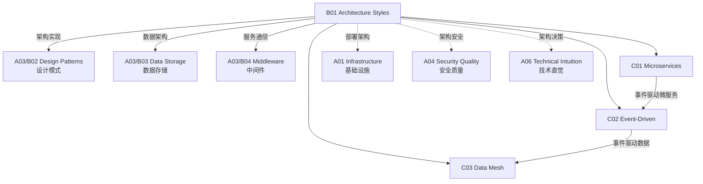

# B01 Architecture Styles

**所属领域**: [A03_Design_Architecture](../readme.md)
**创建日期**: 2026-01-30
**最后更新**: 2026-01-30

## 📋 子领域定位

架构风格定义了系统的整体结构和组织方式，决定了系统的可扩展性、可维护性和演进能力。从传统的单体架构到现代的微服务、事件驱动和数据网格，架构风格的选择直接影响团队的生产效率和系统的技术债务积累。

本领域涵盖三大核心架构范式：微服务架构（服务拆分、服务发现、API 网关）、事件驱动架构（事件溯源、CQRS、消息队列）和数据网格（领域数据产品、自助数据平台）。现代架构师需要理解不同架构风格的 trade-offs，能够根据业务规模、团队结构和技术约束做出恰当的架构决策。

**核心关注点**：
- **微服务**: 服务边界设计、服务通信模式、数据一致性、分布式事务
- **事件驱动**: 事件溯源、CQRS 模式、事件总线、Saga 模式
- **数据网格**: 领域数据产品、数据即服务、自助数据基础设施

## 🗂️ 专项列表

### [C01. Microservices](C01_Microservices/README.md)

微服务架构将应用拆分为一组小型、自治的服务。本专项详解微服务拆分策略（按业务能力、按领域驱动设计）、服务间通信模式（同步 REST/gRPC、异步消息）、API 网关设计、服务发现与注册、以及分布式数据管理。涵盖微服务反模式、服务网格（Istio/Linkerd）和微服务安全最佳实践。

### [C02. Event-Driven](C02_Event-Driven/README.md)

事件驱动架构通过事件的生产、检测和消费来实现系统解耦。本专项深入事件溯源（Event Sourcing）模式、CQRS（命令查询职责分离）、事件总线架构（Kafka/RabbitMQ）、Saga 分布式事务模式、以及事件模式设计。探讨事件模式演化、事件版本控制和事件溯源系统的数据迁移策略。

### [C03. Data_Mesh](C03_Data_Mesh/README.md)

数据网格是一种去中心化的数据架构范式。本专项详解领域数据产品（Domain Data Products）、自助数据基础设施（Self-serve Data Infrastructure）、联邦计算治理（Federated Computational Governance）三大核心原则。涵盖数据产品所有权模型、数据网格平台设计和数据网格成熟度评估。

## 🛠️ 技术栈概览

### 微服务框架

| 框架 | 语言 | 特点 | 官网 |
|------|------|------|------|
| **Spring Boot** | Java | 生态丰富，企业首选 | https://spring.io/projects/spring-boot |
| **Go Micro** | Go | 云原生，轻量级 | https://go-micro.dev |
| **Micronaut** | Java/Kotlin | 低内存占用，AOT 编译 | https://micronaut.io |
| **Quarkus** | Java/Kotlin | Kubernetes 原生，热加载 | https://quarkus.io |
| **NestJS** | TypeScript | 企业级 Node.js | https://nestjs.com |

### 服务网格

| 工具 | 特点 | 官网 |
|------|------|------|
| **Istio** | 功能最全面，企业级 | https://istio.io |
| **Linkerd** | 轻量级，易用 | https://linkerd.io |
| **Consul Connect** | HashiCorp 生态 | https://www.consul.io/docs/connect |
| **Kuma** | 多云支持 | https://kuma.io |
| **Open Service Mesh** | 轻量级，SMI 兼容 | https://openservicemesh.io |

### 消息队列

| 工具 | 特点 | 官网 |
|------|------|------|
| **Apache Kafka** | 高吞吐，持久化 | https://kafka.apache.org |
| **RabbitMQ** | 灵活路由，易用 | https://www.rabbitmq.com |
| **Apache Pulsar** | 存储计算分离 | https://pulsar.apache.org |
| **NATS** | 轻量级，高性能 | https://nats.io |
| **Redis Streams** | 简单场景，内存优先 | https://redis.io |

### API 网关

| 工具 | 特点 | 官网 |
|------|------|------|
| **Kong** | 插件丰富，Lua 扩展 | https://konghq.com |
| **Envoy** | 云原生，高性能 | https://www.envoyproxy.io |
| **Apache APISIX** | 云原生，动态路由 | https://apisix.apache.org |
| **Traefik** | 云原生，自动发现 | https://traefik.io |
| **AWS API Gateway** | 托管服务 | https://aws.amazon.com/api-gateway |

## 💼 实践案例索引

### 案例 1: 电商微服务拆分

**单体到微服务演进**:
```
阶段 1: 单体应用
┌─────────────────────────────────────────┐
│            电商单体应用                  │
│  ┌─────────┬─────────┬─────────┐       │
│  │ 用户模块 │ 商品模块 │ 订单模块 │       │
│  │ 支付模块 │ 库存模块 │ 物流模块 │       │
│  └─────────┴─────────┴─────────┘       │
└─────────────────────────────────────────┘

阶段 2: 服务拆分
┌─────────┐ ┌─────────┐ ┌─────────┐
│ 用户服务 │ │ 商品服务 │ │ 订单服务 │
│  User   │ │ Product │ │  Order  │
└────┬────┘ └────┬────┘ └────┬────┘
     │           │           │
     └───────────┼───────────┘
                 │
     ┌───────────┼───────────┐
     ▼           ▼           ▼
┌─────────┐ ┌─────────┐ ┌─────────┐
│ 支付服务 │ │ 库存服务 │ │ 物流服务 │
│ Payment │ │ Inventory│ │ Shipping│
└─────────┘ └─────────┘ └─────────┘
```

**关键决策**:
| 决策点 | 选择 | 理由 |
|--------|------|------|
| 服务边界 | 按业务领域 (DDD) | 与组织架构对齐 |
| 通信方式 | 同步 (gRPC) + 异步 (Kafka) | 读用同步，写用异步 |
| 数据一致 | Saga 模式 | 最终一致性 |
| 服务发现 | Consul | 健康检查完善 |

### 案例 2: 事件溯源与 CQRS 实现

**架构设计**:
```
┌─────────────────────────────────────────────────────────────┐
│                       命令端 (Command Side)                  │
│  ┌─────────────┐    ┌─────────────┐    ┌─────────────┐     │
│  │  API 层      │ → │  命令处理器   │ → │  事件存储    │     │
│  │  Command API│    │  Command Handler│   │  Event Store │     │
│  └─────────────┘    └─────────────┘    └──────┬──────┘     │
└────────────────────────────────────────────────┼────────────┘
                                                  │
                                                  ▼ Event Stream
┌────────────────────────────────────────────────┼────────────┐
│                       查询端 (Query Side)       │            │
│  ┌─────────────┐    ┌─────────────┐            │            │
│  │  查询 API    │ ← │   物化视图    │ ←─────────┘            │
│  │  Query API  │    │  Read Model   │                       │
│  └─────────────┘    └─────────────┘                       │
└─────────────────────────────────────────────────────────────┘
```

**事件存储示例**:
```json
{
  "eventId": "evt-12345",
  "aggregateId": "order-789",
  "eventType": "OrderPlaced",
  "version": 1,
  "timestamp": "2024-01-15T10:30:00Z",
  "payload": {
    "customerId": "cust-456",
    "items": [
      {"productId": "prod-001", "quantity": 2, "price": 99.99}
    ],
    "totalAmount": 199.98
  }
}
```

### 案例 3: 数据网格实施路径

**组织转型**:
```
阶段 1: 数据湖现状
┌─────────────────────────────────────────┐
│           中心化数据团队                 │
│  ┌─────────────────────────────────┐   │
│  │         数据湖/仓库              │   │
│  │   (集中式 ETL 管道)              │   │
│  └─────────────────────────────────┘   │
└─────────────────────────────────────────┘

阶段 2: 领域数据产品
┌─────────┐ ┌─────────┐ ┌─────────┐
│ 营销领域 │ │ 销售领域 │ │ 供应链  │
│ 数据产品 │ │ 数据产品 │ │ 数据产品│
└────┬────┘ └────┬────┘ └────┬────┘
     │           │           │
     └───────────┼───────────┘
                 ▼
      ┌───────────────────┐
      │   自助数据平台      │
      │ (发现/访问/治理)   │
      └───────────────────┘
```

**数据产品所有权矩阵**:
| 领域 | 数据产品 | 产品负责人 | SLO |
|------|----------|------------|-----|
| 营销 | 客户画像 | 营销数据产品经理 | 99.9% 可用 |
| 销售 | 交易流水 | 销售数据产品经理 | 延迟 < 100ms |
| 供应链 | 库存状态 | 供应链数据产品经理 | RPO < 5min |

## 🔗 知识关联图谱



## 📖 学习资源

### 推荐书籍

| 书名 | 作者 | 说明 |
|------|------|------|
| 《Building Microservices》 | Sam Newman | 微服务设计与实践 |
| 《Microservices Patterns》 | Chris Richardson | 微服务模式详解 |
| 《Designing Event-Driven Systems》 | Ben Stopford | Kafka 事件驱动设计 |
| 《Data Mesh》 | Zhamak Dehghani | 数据网格权威指南 |
| 《Enterprise Integration Patterns》 | Hohpe & Woolf | 企业集成模式 |

### 在线资源

| 资源 | 链接 | 说明 |
|------|------|------|
| Microservices.io | https://microservices.io | 微服务模式库 |
| Martin Fowler 博客 | https://martinfowler.com | 架构思想领袖 |
| Data Mesh Learning | https://datamesh-learning.com | 数据网格社区 |
| CNCF 架构白皮书 | https://www.cncf.io | 云原生架构 |

### 开源项目

| 项目 | GitHub | 说明 |
|------|--------|------|
| Istio | https://github.com/istio/istio | 服务网格 |
| Apache Kafka | https://github.com/apache/kafka | 事件流平台 |
| Kong | https://github.com/Kong/kong | API 网关 |
| Dapr | https://github.com/dapr/dapr | 分布式应用运行时 |

## 🔄 维护说明

- **内容审查**: 每季度更新架构模式和工具版本
- **更新机制**: 跟踪 ThoughtWorks 技术雷达和 InfoQ 架构趋势
- **质量标准**: 确保架构建议基于生产环境验证
- **贡献方式**: 欢迎提交架构决策案例和模式应用经验
