# B01_Arch_Styles

**所属领域**: [A03_Design_Architecture](../readme.md)
**创建日期**: 2026-01-30
**最后更新**: 2026-01-30

## 📋 子领域定位

现代软件架构风格与模式选择领域，研究不同架构风格的特点、适用场景及演进路径。涵盖微服务、事件驱动、数据网格等主流架构模式，帮助架构师根据业务需求做出合理的架构决策。

**核心价值**：
- 理解不同架构风格的优劣与权衡
- 掌握架构模式的选型方法论
- 建立架构演进的系统性思维
- 避免架构设计中的常见陷阱

## 🗂️ 专项列表

### [C01. Microservices](C01_Microservices/README.md)

微服务架构将单体应用拆分为独立部署的小型服务，每个服务专注于单一业务能力。涵盖服务拆分、服务通信、分布式事务、服务治理等核心主题，以及Spring Cloud、Istio等主流技术栈的实践。

### [C02. Event-Driven](C02_Event-Driven/README.md)

事件驱动架构通过异步事件实现系统解耦，提升系统弹性与可扩展性。包括事件溯源（Event Sourcing）、CQRS模式、事件总线、Saga模式等核心概念，以及Kafka、Pulsar等消息中间件的应用。

### [C03. Data_Mesh](C03_Data_Mesh/README.md)

数据网格是面向领域的分布式数据架构，将数据视为产品进行管理。强调数据所有权下沉、自助式数据平台、联邦治理等原则，解决传统数据湖/数据仓库的扩展性问题。

## 🛠️ 技术栈概览

### 核心技术
- **微服务模式**: 服务拆分、API网关、服务发现、负载均衡、熔断降级
- **事件驱动模式**: 事件溯源、CQRS、Saga、事件总线、消息队列
- **数据网格模式**: 数据产品、数据契约、联邦治理、自助式平台
- **分布式系统**: CAP定理、BASE理论、分布式事务、一致性协议
- **领域驱动设计**: 限界上下文、聚合根、领域事件、战略设计
- **架构演进**: 绞杀者模式、防腐层、双写策略、灰度发布

### 工具链
- **服务网格**: Istio、Linkerd、Consul Connect、Kuma
- **API网关**: Kong、APISIX、Traefik、Envoy Gateway
- **服务注册**: Consul、Eureka、Nacos、etcd
- **配置中心**: Apollo、Nacos、Spring Cloud Config
- **链路追踪**: Jaeger、Zipkin、SkyWalking、Tempo
- **消息队列**: Kafka、RabbitMQ、Pulsar、NATS

### 框架与库
- **微服务框架**: Spring Cloud、Dapr、Go-Micro、Dubbo
- **事件处理**: Axon Framework、EventStore、Akka、Eventuate
- **数据平台**: Apache Iceberg、Delta Lake、Hudi、Trino
- **工作流引擎**: Temporal、Camunda、Zeebe、Conductor
- **GraphQL**: Apollo Server、Hasura、Prisma、Relay
- **gRPC**: grpc-go、grpc-java、Protobuf、Buf

## 💼 实践案例索引

1. **电商平台微服务架构**
   - 服务拆分：订单、商品、用户、支付等领域服务
   - 分布式事务：Saga模式处理跨服务订单流程
   - 服务治理：熔断、限流、降级策略

2. **金融交易系统事件驱动架构**
   - 事件溯源：完整记录交易历史
   - CQRS：读写分离优化查询性能
   - 实时风控：基于事件流的风险检测

3. **企业数据网格实践**
   - 数据产品化：各业务域管理自己的数据产品
   - 自助式平台：统一的数据访问与治理工具
   - 联邦治理：跨域数据标准与质量管理

4. **物联网平台架构**
   - 设备接入：MQTT协议与边缘计算
   - 事件处理：海量设备事件实时处理
   - 时序数据：InfluxDB存储与分析

5. **SaaS多租户架构**
   - 租户隔离：数据库、缓存、消息队列隔离策略
   - 弹性伸缩：基于租户负载的自动扩缩容
   - 定制化：插件化架构支持租户个性化需求

## 🔗 关联知识

## 📖 学习资源

### 推荐书籍
1. **《微服务架构设计模式》** - Chris Richardson
   - 微服务架构权威指南，涵盖服务拆分、通信、数据管理

2. **《领域驱动设计》** - Eric Evans
   - DDD经典著作，微服务拆分的理论基础

3. **《企业集成模式》** - Gregor Hohpe
   - 消息传递与事件驱动架构的设计模式

4. **《数据密集型应用系统设计》** - Martin Kleppmann
   - 分布式系统数据处理的深度解析

5. **《Building Microservices》** - Sam Newman
   - 微服务实践指南，第2版更新云原生内容

6. **《Software Architecture: The Hard Parts》** - Neal Ford等
   - 架构决策与权衡的系统性方法

7. **《Data Mesh》** - Zhamak Dehghani
   - 数据网格创始人的权威著作

### 在线课程
1. **Microservices with Spring Cloud** - Udemy
   - Spring Cloud微服务全栈实战

2. **Event-Driven Architecture** - Confluent
   - Kafka事件驱动架构官方课程

3. **Domain-Driven Design Fundamentals** - Pluralsight
   - DDD基础与实践

4. **Building Scalable Java Microservices** - Google Cloud
   - 云原生微服务架构

5. **Software Architecture for the Enterprise** - Coursera
   - 企业架构设计方法论

### 技术博客
1. **Martin Fowler's Blog** - https://martinfowler.com
   - 微服务、事件驱动等架构模式深度文章

2. **Netflix Tech Blog** - https://netflixtechblog.com
   - 大规模微服务架构实践

3. **Uber Engineering** - https://eng.uber.com
   - 事件驱动架构与数据平台

4. **AWS Architecture Blog** - https://aws.amazon.com/blogs/architecture
   - 云原生架构最佳实践

5. **Microsoft Azure Architecture** - https://learn.microsoft.com/azure/architecture
   - 架构模式与参考架构

6. **Confluent Blog** - https://www.confluent.io/blog
   - 事件流处理与Kafka实践

7. **ThoughtWorks Insights** - https://www.thoughtworks.com/insights
   - 架构演进与技术雷达

## 🔄 维护说明

- **内容审查**: 每月检查链接有效性
- **更新机制**: 发现新技术或最佳实践时及时更新
- **质量标准**: 确保所有专项主题内容完整且准确
