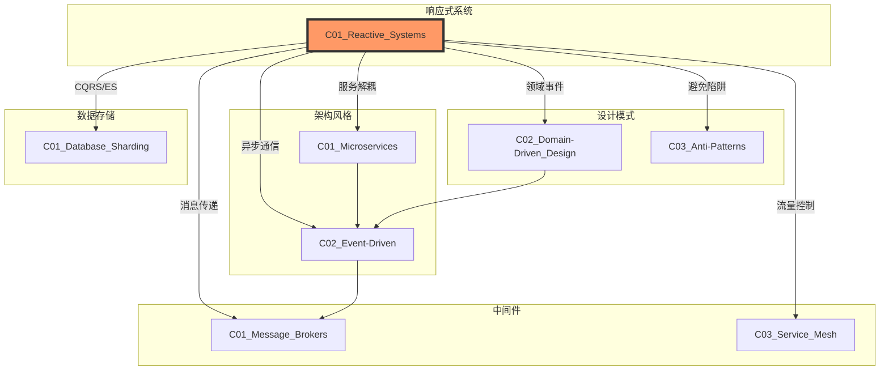
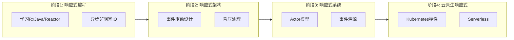

# C01 Reactive Systems - 响应式系统

**领域**: A03_Design_Architecture/B02_Design_Patterns  
**创建日期**: 2026-01-30  
**最后更新**: 2026-01-30

---

## 1. 主题定位

### 1.1 定义与本质

响应式系统（Reactive Systems）是一种架构设计方法，专注于构建对负载变化、故障和部分系统失效具有弹性的系统。该概念由Reactive Manifesto（2014年）正式定义，由Jonas Bonér、Dave Farley、Roland Kuhn和Martin Thompson共同发起。

响应式系统的核心目标是构建**响应迅速（Responsive）**、**弹性（Resilient）**、**弹性扩展（Elastic）**和**消息驱动（Message Driven）**的系统。

### 1.2 响应式宣言四大特质

```
┌─────────────────────────────────────────────────────────────────┐
│                     Reactive Manifesto                         │
├─────────────────────────────────────────────────────────────────┤
│                                                                 │
│                          ┌───────────┐                         │
│                          │ 响应式系统 │                         │
│                          └─────┬─────┘                         │
│                                │                                │
│         ┌──────────────────────┼──────────────────────┐        │
│         │                      │                      │        │
│         ▼                      ▼                      ▼        │
│   ┌───────────┐          ┌───────────┐          ┌───────────┐ │
│   │  响应迅速  │          │   弹性    │          │ 弹性扩展  │ │
│   │Responsive │          │ Resilient │          │  Elastic  │ │
│   └─────┬─────┘          └─────┬─────┘          └─────┬─────┘ │
│         │                      │                      │        │
│         │     ┌────────────────┴────────────────┐     │        │
│         │     │                                 │     │        │
│         └────►│         消息驱动                 │◄────┘        │
│               │      (Message Driven)            │              │
│               └─────────────────────────────────┘              │
│                                                                 │
│  响应迅速: 系统能及时响应                                        │
│  弹性: 系统在故障时保持响应                                      │
│  弹性扩展: 系统能根据负载自动调整                                │
│  消息驱动: 依赖异步消息传递实现松耦合                            │
│                                                                 │
└─────────────────────────────────────────────────────────────────┘
```

### 1.3 响应式编程 vs 响应式系统

| 维度 | 响应式编程 (Reactive Programming) | 响应式系统 (Reactive Systems) |
|------|----------------------------------|------------------------------|
| **关注点** | 异步数据流和变更传播 | 系统架构和运行时特性 |
| **实现层面** | 库/框架级别（如RxJava、Project Reactor） | 架构模式/系统设计级别 |
| **核心抽象** | Observable/Flow、背压处理 | 消息传递、监督、隔离 |
| **故障处理** | 异常处理、错误传播 | 故障隔离、自我修复 |
| **扩展性** | 通常单机 | 分布式、水平扩展 |

**关系**: 响应式编程是实现响应式系统的技术手段之一，但不是唯一方式。

---

## 2. 核心概念

### 2.1 响应式流规范 (Reactive Streams)

Reactive Streams是一个为异步流处理提供非阻塞背压的标准规范，于2015年发布1.0版本。

```
┌─────────────────────────────────────────────────────────────────┐
│                    Reactive Streams 规范                        │
├─────────────────────────────────────────────────────────────────┤
│                                                                 │
│   Publisher ──────► Subscriber                                  │
│   (发布者)          (订阅者)                                    │
│       │                ▲                                        │
│       │    subscribe   │                                        │
│       └────────────────┘                                        │
│                                                                 │
│   交互流程:                                                      │
│   1. Subscriber调用Publisher.subscribe()                        │
│   2. Publisher回调Subscriber.onSubscribe(Subscription)          │
│   3. Subscriber调用Subscription.request(n)请求n个元素           │
│   4. Publisher回调onNext(element)发送数据                       │
│   5. 重复3-4直到完成或错误                                      │
│   6. Publisher回调onComplete()或onError(Throwable)              │
│                                                                 │
│   ┌─────────────────────────────────────────────────────────┐  │
│   │                    背压机制                              │  │
│   │                                                         │  │
│   │   Publisher ◄───── request(n) ────── Subscriber        │  │
│   │      │                                  │               │  │
│   │      │  控制流速                        │ 处理能力有限   │  │
│   │      ▼                                  ▼               │  │
│   │   [1, 2, ..., n] ◄───────────── 消费速率                │  │
│   │                                                         │  │
│   └─────────────────────────────────────────────────────────┘  │
│                                                                 │
└─────────────────────────────────────────────────────────────────┘
```

**四大接口定义:**

```java
// Publisher: 数据生产者
public interface Publisher<T> {
    void subscribe(Subscriber<? super T> s);
}

// Subscriber: 数据消费者
public interface Subscriber<T> {
    void onSubscribe(Subscription s);  // 建立订阅关系
    void onNext(T t);                  // 接收数据
    void onError(Throwable t);         // 处理错误
    void onComplete();                 // 完成通知
}

// Subscription: 订阅关系，控制背压
public interface Subscription {
    void request(long n);  // 请求n个元素
    void cancel();         // 取消订阅
}

// Processor: 既是Publisher又是Subscriber
public interface Processor<T, R> extends Subscriber<T>, Publisher<R> {
}
```

### 2.2 响应式系统架构模式

#### 2.2.1 Actor模型

Actor模型由Carl Hewitt于1973年提出，是响应式系统的核心实现模式之一。

```
┌─────────────────────────────────────────────────────────────────┐
│                       Actor 模型                               │
├─────────────────────────────────────────────────────────────────┤
│                                                                 │
│  ┌───────────────┐                                              │
│  │    Actor A    │                                              │
│  │  ┌─────────┐  │                                              │
│  │  │ Mailbox │  │◄── 消息队列 (异步、有序)                     │
│  │  └────┬────┘  │                                              │
│  │       ▼       │                                              │
│  │  ┌─────────┐  │                                              │
│  │  │ Behavior│  │  处理逻辑                                     │
│  │  │ (State) │  │  - 创建子Actor                                │
│  │  └────┬────┘  │  - 发送消息                                   │
│  │       │       │  - 修改状态                                   │
│  │       ▼       │                                              │
│  │  ┌─────────┐  │                                              │
│  │  │  State  │  │  私有状态，仅通过消息修改                      │
│  │  └─────────┘  │                                              │
│  └───────┬───────┘                                              │
│          │                                                       │
│          │ 异步消息传递                                           │
│          ▼                                                       │
│  ┌───────────────┐     ┌───────────────┐     ┌───────────────┐  │
│  │    Actor B    │◄───►│    Actor C    │◄───►│    Actor D    │  │
│  │   (监督者)     │     │   (工作者)     │     │   (工作者)     │  │
│  └───────────────┘     └───────────────┘     └───────────────┘  │
│          │                                                       │
│          │ 监督策略                                               │
│          ▼                                                       │
│  ┌─────────────────────────────────────────────────────────────┐│
│  │                      监督层次结构                            ││
│  │  OneForOne: 一个子Actor失败，只重启该Actor                  ││
│  │  AllForOne: 一个子Actor失败，重启所有子Actor                ││
│  │  Restart:   重启失败Actor，保持Mailbox                        ││
│  │  Resume:    继续处理，忽略错误                                ││
│  │  Stop:      停止失败Actor                                     ││
│  │  Escalate:  升级给父监督者                                    ││
│  └─────────────────────────────────────────────────────────────┘│
│                                                                 │
└─────────────────────────────────────────────────────────────────┘
```

#### 2.2.2 事件溯源 (Event Sourcing)

```
┌─────────────────────────────────────────────────────────────────┐
│                      事件溯源模式                                │
├─────────────────────────────────────────────────────────────────┤
│                                                                 │
│  传统CRUD:                       事件溯源:                       │
│                                                                 │
│  ┌─────────┐                     ┌─────────┐                    │
│  │ Command │                     │ Command │                    │
│  └────┬────┘                     └────┬────┘                    │
│       ▼                               ▼                         │
│  ┌─────────┐                     ┌─────────┐                    │
│  │ UPDATE  │                     │  Event  │                    │
│  │  state  │                     └────┬────┘                    │
│  └────┬────┘                          ▼                         │
│       ▼                          ┌─────────┐                    │
│  ┌─────────┐                     │  Store  │                    │
│  │  State  │                     │  Event  │                    │
│  │ (Current)│                    └────┬────┘                    │
│  └─────────┘                          │                         │
│                                  ┌────┴────┐                    │
│                                  ▼         ▼                    │
│                            ┌─────────┐ ┌─────────┐              │
│                            │  State  │ │  Project │              │
│                            │ (From   │ │   View   │              │
│                            │ Events) │ │ (CQRS)   │              │
│                            └─────────┘ └─────────┘              │
│                                                                 │
│  优势:                                                          │
│  1. 完整的审计追踪                                              │
│  2. 时间旅行查询                                                │
│  3. 天然支持事件驱动架构                                        │
│  4. 易于实现CQRS                                                │
│  5. 更好的可扩展性                                              │
│                                                                 │
└─────────────────────────────────────────────────────────────────┘
```

#### 2.2.3 CQRS模式

```
┌─────────────────────────────────────────────────────────────────┐
│                   CQRS (命令查询职责分离)                        │
├─────────────────────────────────────────────────────────────────┤
│                                                                 │
│  ┌─────────────┐                                                │
│  │   Client    │                                                │
│  └──────┬──────┘                                                │
│         │                                                       │
│         ├─── Command ──►┌─────────────┐                         │
│         │               │  Command    │                         │
│         │               │  Handler    │                         │
│         │               └──────┬──────┘                         │
│         │                      │                                │
│         │                      ▼                                │
│         │               ┌─────────────┐                         │
│         │               │ Write Model │                         │
│         │               │  (事件源)    │                         │
│         │               │             │                         │
│         │               │ ┌─────────┐ │                         │
│         │               │ │ 状态   │ │                         │
│         │               │ │ +行为  │ │                         │
│         │               │ └─────────┘ │                         │
│         │               └──────┬──────┘                         │
│         │                      │                                │
│         │                      ▼                                │
│         │               ┌─────────────┐                         │
│         │               │  Event Bus  │                         │
│         │               └──────┬──────┘                         │
│         │                      │                                │
│         │                      ▼                                │
│         │               ┌─────────────┐                         │
│         │               │  Projector  │                         │
│         │               └──────┬──────┘                         │
│         │                      │                                │
│         │                      ▼                                │
│         │               ┌─────────────┐                         │
│         │               │  Read Model │                         │
│         │               │  (物化视图)  │                         │
│         │               │             │                         │
│         │               │ • 查询优化  │                         │
│         │               │ • 多种格式  │                         │
│         │               │ • 最终一致  │                         │
│         │               └─────────────┘                         │
│         │                                                       │
│         └─── Query ────►┌─────────────┐                         │
│                         │  Query      │                         │
│                         │  Handler    │                         │
│                         └─────────────┘                         │
│                                                                 │
└─────────────────────────────────────────────────────────────────┘
```

### 2.3 背压策略

```
┌─────────────────────────────────────────────────────────────────┐
│                      背压策略对比                                │
├─────────────────────────────────────────────────────────────────┤
│                                                                 │
│  1. 错误策略 (ERROR)                                            │
│     生产者 ──────► 消费者 (缓冲区满)                            │
│        │              │                                         │
│        │◄──── 错误 ──┘  抛出异常，终止流                        │
│                                                                 │
│  2. 丢弃策略 (DROP)                                             │
│     生产者 ──────► [缓冲] ──────► 消费者                         │
│        │              │              │                          │
│        └──────── 丢弃新元素 ◄────── 满                          │
│                                                                 │
│  3. 最新策略 (LATEST)                                           │
│     生产者 ──────► [缓冲] ──────► 消费者                         │
│        │              │              │                          │
│        └───── 替换为新元素 ◄────── 满                           │
│                                                                 │
│  4. 缓冲策略 (BUFFER)                                           │
│     生产者 ──────► [扩展缓冲] ──────► 消费者                     │
│        │              │                │                        │
│        └──────── 动态扩容 ◄────────── 需要                       │
│                                                                 │
│  5. 节流策略 (THROTTLE)                                         │
│     生产者 ──► [流量控制] ──► 消费者                             │
│        ▲         │              │                               │
│        └─────────┘              │                               │
│          根据消费速度调节生产                                   │
│                                                                 │
└─────────────────────────────────────────────────────────────────┘
```

---

## 3. 技术实践

### 3.1 Project Reactor实现 (Java)

```java
// ReactiveService.java
package com.example.reactive;

import reactor.core.publisher.*;
import reactor.core.scheduler.Schedulers;
import reactor.util.function.Tuple2;
import reactor.util.retry.Retry;

import java.time.Duration;
import java.util.List;
import java.util.concurrent.CompletableFuture;
import java.util.concurrent.TimeoutException;
import java.util.function.Function;

/**
 * Project Reactor响应式编程完整示例
 */
public class ReactiveService {
    
    // ========== 基础操作 ==========
    
    /**
     * 创建Mono（0或1个元素）
     */
    public Mono<String> createMonoExamples() {
        // 从值创建
        Mono<String> mono1 = Mono.just("Hello");
        
        // 从Supplier创建（懒加载）
        Mono<String> mono2 = Mono.fromCallable(() -> fetchFromDatabase());
        
        // 从Future创建
        Mono<String> mono3 = Mono.fromFuture(CompletableFuture.supplyAsync(() -> "Future"));
        
        // 空Mono
        Mono<String> mono4 = Mono.empty();
        
        // 错误Mono
        Mono<String> mono5 = Mono.error(new RuntimeException("Error"));
        
        return mono1;
    }
    
    /**
     * 创建Flux（0到N个元素）
     */
    public Flux<String> createFluxExamples() {
        // 从值创建
        Flux<String> flux1 = Flux.just("A", "B", "C");
        
        // 从Iterable创建
        Flux<String> flux2 = Flux.fromIterable(List.of("A", "B", "C"));
        
        // 范围
        Flux<Integer> flux3 = Flux.range(1, 10);
        
        // 间隔（定时）
        Flux<Long> flux4 = Flux.interval(Duration.ofSeconds(1));
        
        // 生成
        Flux<String> flux5 = Flux.generate(
            () -> 0,
            (state, sink) -> {
                sink.next("Item " + state);
                if (state == 10) sink.complete();
                return state + 1;
            }
        );
        
        // 创建
        Flux<String> flux6 = Flux.create(sink -> {
            sink.next("Custom 1");
            sink.next("Custom 2");
            sink.complete();
        });
        
        return flux1;
    }
    
    // ========== 转换操作 ==========
    
    /**
     * 数据转换操作
     */
    public Flux<String> transformationExamples(Flux<String> source) {
        // map: 一对一转换
        Flux<Integer> lengths = source.map(String::length);
        
        // flatMap: 一对多转换（异步）
        Flux<String> words = source
            .flatMap(sentence -> Flux.fromArray(sentence.split(" ")));
        
        // filter: 过滤
        Flux<String> longWords = source.filter(s -> s.length() > 5);
        
        // distinct: 去重
        Flux<String> unique = source.distinct();
        
        // sort: 排序
        Flux<String> sorted = source.sort();
        
        // buffer: 缓冲
        Flux<List<String>> buffered = source.buffer(10);
        
        // window: 窗口
        Flux<Flux<String>> windows = source.window(10);
        
        // groupBy: 分组
        Flux<GroupedFlux<String, String>> grouped = source.groupBy(s -> s.substring(0, 1));
        
        return source;
    }
    
    // ========== 组合操作 ==========
    
    /**
     * 流组合操作
     */
    public void combinationExamples() {
        Flux<String> flux1 = Flux.interval(Duration.ofMillis(100))
            .map(i -> "A" + i)
            .take(5);
        
        Flux<String> flux2 = Flux.interval(Duration.ofMillis(150))
            .map(i -> "B" + i)
            .take(5);
        
        // concat: 顺序连接
        Flux<String> concat = Flux.concat(flux1, flux2);
        
        // merge: 交错合并
        Flux<String> merge = Flux.merge(flux1, flux2);
        
        // zip: 配对
        Flux<Tuple2<String, String>> zipped = Flux.zip(flux1, flux2);
        
        // combineLatest: 最新值组合
        Flux<String> combined = Flux.combineLatest(
            List.of(flux1, flux2),
            objects -> objects[0] + "-" + objects[1]
        );
        
        // zipWith: 与另一个流配对
        Flux<String> zippedWith = flux1.zipWith(flux2, (a, b) -> a + ":" + b);
    }
    
    // ========== 错误处理 ==========
    
    /**
     * 错误处理策略
     */
    public Mono<String> errorHandlingExamples(Mono<String> source) {
        // onErrorReturn: 返回默认值
        Mono<String> withDefault = source
            .onErrorReturn("Default Value");
        
        // onErrorResume: 切换到备用流
        Mono<String> withFallback = source
            .onErrorResume(e -> Mono.just("Fallback: " + e.getMessage()));
        
        // onErrorMap: 转换错误类型
        Mono<String> withMappedError = source
            .onErrorMap(e -> new BusinessException("Operation failed", e));
        
        // doOnError: 副作用处理（日志等）
        Mono<String> withLogging = source
            .doOnError(e -> log.error("Error occurred", e));
        
        // retry: 重试
        Mono<String> withRetry = source
            .retry(3);
        
        // retryWhen: 条件重试
        Mono<String> withConditionalRetry = source
            .retryWhen(Retry.backoff(3, Duration.ofSeconds(1))
                .filter(e -> e instanceof TimeoutException));
        
        // timeout: 超时
        Mono<String> withTimeout = source
            .timeout(Duration.ofSeconds(5));
        
        return withFallback;
    }
    
    // ========== 背压处理 ==========
    
    /**
     * 背压策略
     */
    public Flux<String> backpressureExamples() {
        Flux<String> fastProducer = Flux.interval(Duration.ofMillis(10))
            .map(i -> "Item " + i)
            .take(1000);
        
        // 1. 错误策略
        Flux<String> errorStrategy = fastProducer
            .onBackpressureError();
        
        // 2. 丢弃策略
        Flux<String> dropStrategy = fastProducer
            .onBackpressureDrop(dropped -> log.warn("Dropped: {}", dropped));
        
        // 3. 最新策略
        Flux<String> latestStrategy = fastProducer
            .onBackpressureLatest();
        
        // 4. 缓冲策略
        Flux<String> bufferStrategy = fastProducer
            .onBackpressureBuffer(100);
        
        // 5. 使用限流
        Flux<String> throttled = fastProducer
            .limitRate(100);  // 每次请求100个
        
        return bufferStrategy;
    }
    
    // ========== 调度与线程 ==========
    
    /**
     * 调度器使用
     */
    public void schedulingExamples() {
        Mono<String> mono = Mono.fromCallable(() -> {
            System.out.println("Executing on: " + Thread.currentThread().getName());
            return "Result";
        });
        
        // immediate: 当前线程
        mono.subscribeOn(Schedulers.immediate());
        
        // single: 单线程
        mono.subscribeOn(Schedulers.single());
        
        // parallel: 并行线程池（CPU核心数）
        mono.subscribeOn(Schedulers.parallel());
        
        // boundedElastic: 弹性线程池（IO操作）
        mono.subscribeOn(Schedulers.boundedElastic());
        
        // fromExecutor: 自定义线程池
        // mono.subscribeOn(Schedulers.fromExecutor(myExecutor));
        
        // publishOn: 切换下游执行线程
        Flux.range(1, 10)
            .map(i -> i * 2)                          // 在默认线程
            .publishOn(Schedulers.boundedElastic())   // 切换线程
            .flatMap(this::saveToDatabase)            // 在boundedElastic
            .subscribe();
    }
    
    // ========== 实际应用示例 ==========
    
    /**
     * 订单处理管道
     */
    public Flux<OrderResult> processOrders(Flux<OrderRequest> orders) {
        return orders
            // 1. 限流防止过载
            .limitRate(100)
            
            // 2. 并行验证
            .flatMap(this::validateOrder, 10)
            
            // 3. 检查库存（异步调用）
            .flatMap(this::checkInventory, 10)
            
            // 4. 处理支付（需要保证顺序）
            .concatMap(this::processPayment)
            
            // 5. 发送通知（并行，不阻塞）
            .flatMap(order -> 
                sendNotification(order)
                    .thenReturn(order)
                    .onErrorResume(e -> {
                        log.warn("Notification failed for order {}", order.getId());
                        return Mono.just(order);
                    })
            )
            
            // 6. 超时控制
            .timeout(Duration.ofSeconds(30))
            
            // 7. 重试策略
            .retryWhen(Retry.backoff(3, Duration.ofMillis(100))
                .filter(e -> !(e instanceof BusinessException)))
            
            // 8. 错误处理
            .onErrorResume(e -> {
                log.error("Order processing failed", e);
                return Mono.just(OrderResult.failed(e.getMessage()));
            });
    }
    
    /**
     * 批量数据导入
     */
    public Mono<Void> importData(Flux<DataRecord> records) {
        return records
            // 按批次处理
            .buffer(1000)
            
            // 并行处理批次
            .flatMap(batch -> 
                saveBatch(batch)
                    .subscribeOn(Schedulers.boundedElastic()),
                10  // 并发度
            )
            
            // 收集结果
            .collectList()
            
            // 汇总统计
            .map(results -> {
                long success = results.stream().filter(r -> r).count();
                log.info("Import completed: {}/{} batches successful", success, results.size());
                return success;
            })
            
            // 转换为Void
            .then();
    }
    
    // ========== 辅助方法 ==========
    
    private String fetchFromDatabase() {
        return "Database Result";
    }
    
    private void log(String message) {
        System.out.println("[LOG] " + message);
    }
    
    private Mono<Order> validateOrder(OrderRequest request) {
        return Mono.fromCallable(() -> {
            if (request.getAmount() <= 0) {
                throw new BusinessException("Invalid amount");
            }
            return new Order(request);
        }).subscribeOn(Schedulers.boundedElastic());
    }
    
    private Mono<Order> checkInventory(Order order) {
        return webClient.get()
            .uri("/inventory/{productId}", order.getProductId())
            .retrieve()
            .bodyToMono(InventoryResponse.class)
            .map(response -> {
                if (response.getAvailable() < order.getQuantity()) {
                    throw new BusinessException("Insufficient inventory");
                }
                return order;
            });
    }
    
    private Mono<Order> processPayment(Order order) {
        return paymentGateway.charge(order.getAmount())
            .map(txId -> {
                order.setTransactionId(txId);
                return order;
            });
    }
    
    private Mono<Void> sendNotification(Order order) {
        return notificationService.sendOrderConfirmation(order);
    }
    
    private Mono<Boolean> saveBatch(List<DataRecord> batch) {
        return Mono.fromCallable(() -> {
            // 批量保存逻辑
            repository.saveAll(batch);
            return true;
        }).subscribeOn(Schedulers.boundedElastic());
    }
}

// ========== 响应式WebFlux控制器 ==========

@RestController
@RequestMapping("/api/reactive")
public class ReactiveController {
    
    private final ReactiveService service;
    private final ReactiveRepository repository;
    
    public ReactiveController(ReactiveService service, ReactiveRepository repository) {
        this.service = service;
        this.repository = repository;
    }
    
    // SSE (Server-Sent Events) 流式响应
    @GetMapping(value = "/events", produces = MediaType.TEXT_EVENT_STREAM_VALUE)
    public Flux<ServerSentEvent<String>> streamEvents() {
        return Flux.interval(Duration.ofSeconds(1))
            .map(seq -> ServerSentEvent.<String>builder()
                .id(String.valueOf(seq))
                .event("heartbeat")
                .data("Event " + seq)
                .build());
    }
    
    // 响应式CRUD
    @GetMapping("/users")
    public Flux<User> getAllUsers() {
        return repository.findAll()
            .delayElements(Duration.ofMillis(100));  // 模拟背压
    }
    
    @GetMapping("/users/{id}")
    public Mono<ResponseEntity<User>> getUser(@PathVariable String id) {
        return repository.findById(id)
            .map(ResponseEntity::ok)
            .defaultIfEmpty(ResponseEntity.notFound().build());
    }
    
    // 响应式文件上传
    @PostMapping("/upload")
    public Mono<ResponseEntity<String>> upload(
            @RequestPart("file") Flux<FilePart> fileParts) {
        
        return fileParts
            .flatMap(filePart -> 
                filePart.content()
                    .map(dataBuffer -> dataBuffer.asInputStream())
                    .flatMap(inputStream -> saveFile(filePart.filename(), inputStream))
            )
            .collectList()
            .map(saved -> ResponseEntity.ok("Saved " + saved.size() + " files"));
    }
    
    // 背压感知的数据流
    @PostMapping("/process")
    public Flux<ProcessingResult> processStream(
            @RequestBody Flux<DataItem> items) {
        
        return items
            .onBackpressureBuffer(1000, BufferOverflowStrategy.DROP_OLDEST)
            .flatMap(this::processItem, 50)  // 并发处理50个
            .onErrorContinue((error, obj) -> {
                log.error("Error processing item: {}", obj, error);
            });
    }
}
```

### 3.2 Akka Actor实现 (Scala/Java)

```scala
// OrderProcessorActor.scala
package com.example.akka

import akka.actor.typed.{ActorRef, ActorSystem, Behavior, SupervisorStrategy}
import akka.actor.typed.scaladsl.{Behaviors, Routers}
import akka.pattern.StatusReply
import scala.concurrent.duration._
import scala.util.{Failure, Success}

/**
 * Akka Typed Actor响应式系统示例
 * 订单处理系统
 */
object OrderProcessor {
  
  // ========== 协议定义 ==========
  
  sealed trait Command
  case class PlaceOrder(order: Order, replyTo: ActorRef[OrderResponse]) extends Command
  case class GetOrderStatus(orderId: String, replyTo: ActorRef[OrderStatus]) extends Command
  case class CancelOrder(orderId: String, replyTo: ActorRef[StatusReply[Unit]]) extends Command
  
  sealed trait Event
  case class OrderPlaced(order: Order) extends Event
  case class OrderCancelled(orderId: String) extends Event
  
  sealed trait OrderResponse
  case class OrderAccepted(orderId: String) extends OrderResponse
  case class OrderRejected(reason: String) extends OrderResponse
  
  case class OrderStatus(orderId: String, status: String)
  
  // ========== 核心Actor ==========
  
  def apply(): Behavior[Command] = Behaviors.setup { context =>
    // 创建子Actor
    val inventoryChecker = context.spawn(
      InventoryChecker(), 
      "inventory-checker"
    )
    
    val paymentProcessor = context.spawn(
      PaymentProcessor(),
      "payment-processor"
    )
    
    // 创建工作路由器
    val orderWorkers = context.spawn(
      Routers.pool(poolSize = 10) {
        OrderWorker(inventoryChecker, paymentProcessor)
      },
      "order-workers"
    )
    
    // 监督策略
    val supervisedWorkers = Behaviors
      .supervise(orderWorkers)
      .onFailure[Exception](SupervisorStrategy.restart.withLimit(10, 1.minute))
    
    context.spawn(supervisedWorkers, "supervised-workers")
    
    // 状态管理
    var orders: Map[String, OrderState] = Map.empty
    
    Behaviors.receiveMessage {
      case PlaceOrder(order, replyTo) =>
        if (orders.contains(order.id)) {
          replyTo ! OrderRejected("Order already exists")
          Behaviors.same
        } else {
          orders += (order.id -> OrderState(order, "PENDING"))
          orderWorkers ! ProcessOrder(order, replyTo)
          Behaviors.same
        }
        
      case GetOrderStatus(orderId, replyTo) =>
        orders.get(orderId) match {
          case Some(state) =>
            replyTo ! OrderStatus(orderId, state.status)
          case None =>
            replyTo ! OrderStatus(orderId, "NOT_FOUND")
        }
        Behaviors.same
        
      case CancelOrder(orderId, replyTo) =>
        orders.get(orderId) match {
          case Some(state) if state.status == "PENDING" =>
            orders += (orderId -> state.copy(status = "CANCELLED"))
            replyTo ! StatusReply.Ack
          case Some(state) =>
            replyTo ! StatusReply.Error(s"Cannot cancel order in status: ${state.status}")
          case None =>
            replyTo ! StatusReply.Error("Order not found")
        }
        Behaviors.same
    }
  }
  
  // ========== 工作Actor ==========
  
  private case class ProcessOrder(order: Order, replyTo: ActorRef[OrderResponse])
  
  private object OrderWorker {
    def apply(
      inventoryChecker: ActorRef[InventoryChecker.Command],
      paymentProcessor: ActorRef[PaymentProcessor.Command]
    ): Behavior[ProcessOrder] = Behaviors.setup { context =>
      
      implicit val timeout: Timeout = 5.seconds
      implicit val ec = context.executionContext
      
      Behaviors.receiveMessage { case ProcessOrder(order, replyTo) =>
        // 异步处理流程
        val result = for {
          // 1. 检查库存
          inventory <- context.askWithStatus(inventoryChecker, 
            ref => InventoryChecker.CheckStock(order.productId, order.quantity, ref))
          
          // 2. 预留库存
          _ <- if (inventory.available >= order.quantity) {
            context.askWithStatus(inventoryChecker,
              ref => InventoryChecker.ReserveStock(order.productId, order.quantity, ref))
          } else {
            Future.failed(new IllegalStateException("Insufficient stock"))
          }
          
          // 3. 处理支付
          payment <- context.askWithStatus(paymentProcessor,
            ref => PaymentProcessor.ProcessPayment(order.amount, ref))
          
        } yield OrderAccepted(order.id)
        
        result.onComplete {
          case Success(response) => replyTo ! response
          case Failure(ex) => replyTo ! OrderRejected(ex.getMessage)
        }
        
        Behaviors.same
      }
    }
  }
  
  // ========== 库存检查Actor ==========
  
  object InventoryChecker {
    sealed trait Command
    case class CheckStock(
      productId: String, 
      quantity: Int, 
      replyTo: ActorRef[StatusReply[Inventory]]
    ) extends Command
    case class ReserveStock(
      productId: String, 
      quantity: Int, 
      replyTo: ActorRef[StatusReply[Unit]]
    ) extends Command
    
    case class Inventory(productId: String, available: Int)
    
    def apply(): Behavior[Command] = Behaviors.setup { context =>
      // 模拟库存数据
      var inventory: Map[String, Int] = Map(
        "PROD-001" -> 100,
        "PROD-002" -> 50,
        "PROD-003" -> 0
      )
      
      Behaviors.receiveMessage {
        case CheckStock(productId, quantity, replyTo) =>
          inventory.get(productId) match {
            case Some(available) =>
              replyTo ! StatusReply.Success(Inventory(productId, available))
            case None =>
              replyTo ! StatusReply.Error(s"Product not found: $productId")
          }
          Behaviors.same
          
        case ReserveStock(productId, quantity, replyTo) =>
          inventory.get(productId) match {
            case Some(available) if available >= quantity =>
              inventory += (productId -> (available - quantity))
              replyTo ! StatusReply.Ack
            case Some(_) =>
              replyTo ! StatusReply.Error("Insufficient stock")
            case None =>
              replyTo ! StatusReply.Error("Product not found")
          }
          Behaviors.same
      }
    }
  }
  
  // ========== 支付处理Actor ==========
  
  object PaymentProcessor {
    sealed trait Command
    case class ProcessPayment(
      amount: BigDecimal, 
      replyTo: ActorRef[StatusReply[PaymentResult]]
    ) extends Command
    
    case class PaymentResult(transactionId: String)
    
    def apply(): Behavior[Command] = Behaviors.setup { context =>
      var transactionCounter = 0L
      
      Behaviors.receiveMessage {
        case ProcessPayment(amount, replyTo) =>
          // 模拟支付处理
          if (amount > 0) {
            transactionCounter += 1
            val txId = f"TXN-$transactionCounter%08d"
            replyTo ! StatusReply.Success(PaymentResult(txId))
          } else {
            replyTo ! StatusReply.Error("Invalid amount")
          }
          Behaviors.same
      }
    }
  }
  
  // ========== 集群分片 ==========
  
  import akka.cluster.sharding.typed.scaladsl.{ClusterSharding, Entity, EntityTypeKey}
  
  object ShardedOrderProcessor {
    val TypeKey: EntityTypeKey[Command] = EntityTypeKey[Command]("Order")
    
    def init(system: ActorSystem[_]): Unit = {
      ClusterSharding(system).init(Entity(TypeKey) { entityContext =>
        OrderProcessor()
          .withTagger(_ => Set("order"))
      })
    }
  }
  
  // ========== 事件溯源 ==========
  
  import akka.persistence.typed.PersistenceId
  import akka.persistence.typed.scaladsl.{Effect, EventSourcedBehavior}
  
  object PersistentOrderProcessor {
    def apply(persistenceId: PersistenceId): Behavior[Command] = {
      EventSourcedBehavior[Command, Event, OrderState](
        persistenceId = persistenceId,
        emptyState = OrderState.empty,
        commandHandler = (state, command) => command match {
          case PlaceOrder(order, replyTo) =>
            if (state.order.exists(_.id == order.id)) {
              replyTo ! OrderRejected("Order already exists")
              Effect.none
            } else {
              Effect.persist(OrderPlaced(order))
                .thenReply(replyTo)(_ => OrderAccepted(order.id))
            }
            
          case CancelOrder(orderId, replyTo) =>
            Effect.persist(OrderCancelled(orderId))
              .thenReply(replyTo)(_ => StatusReply.Ack)
              
          case GetOrderStatus(orderId, replyTo) =>
            replyTo ! OrderStatus(orderId, state.status)
            Effect.none
        },
        eventHandler = (state, event) => event match {
          case OrderPlaced(order) =>
            state.copy(order = Some(order), status = "PLACED")
          case OrderCancelled(_) =>
            state.copy(status = "CANCELLED")
        }
      )
    }
  }
  
  // ========== 数据类定义 ==========
  
  case class Order(
    id: String,
    customerId: String,
    productId: String,
    quantity: Int,
    amount: BigDecimal
  )
  
  case class OrderState(
    order: Option[Order],
    status: String
  )
  
  object OrderState {
    val empty: OrderState = OrderState(None, "")
  }
}
```

### 3.3 响应式流JavaScript实现 (RxJS)

```javascript
// reactive-service.js
/**
 * RxJS响应式编程完整示例
 */

const { 
  of, from, interval, timer, fromEvent, merge, combineLatest, 
  Subject, BehaviorSubject, ReplaySubject, AsyncSubject 
} = require('rxjs');
const { 
  map, filter, reduce, scan, mergeMap, switchMap, concatMap, 
  debounceTime, throttleTime, distinctUntilChanged, take, 
  catchError, retry, retryWhen, delay, tap, share, shareReplay,
  bufferTime, groupBy, partition
} = require('rxjs/operators');

// ========== 创建Observable ==========

class ObservableFactory {
  // 从Promise创建
  static fromPromise(promise) {
    return from(promise);
  }
  
  // 从事件创建
  static fromEvent(element, eventName) {
    return fromEvent(element, eventName);
  }
  
  // AJAX请求
  static ajax(url) {
    return from(fetch(url).then(r => r.json()));
  }
  
  // WebSocket
  static fromWebSocket(url) {
    const ws = new WebSocket(url);
    return new Observable(subscriber => {
      ws.onmessage = (event) => subscriber.next(event.data);
      ws.onerror = (error) => subscriber.error(error);
      ws.onclose = () => subscriber.complete();
      
      return () => ws.close();
    });
  }
}

// ========== 响应式数据处理 ==========

class DataProcessingService {
  /**
   * 实时搜索（防抖）
   */
  createSearchStream(inputObservable) {
    return inputObservable.pipe(
      debounceTime(300),
      distinctUntilChanged(),
      filter(query => query.length >= 2),
      switchMap(query => this.searchAPI(query).pipe(
        catchError(error => of({ error: error.message, results: [] }))
      ))
    );
  }
  
  /**
   * 自动保存（节流）
   */
  createAutoSaveStream(changeObservable) {
    return changeObservable.pipe(
      debounceTime(1000),
      distinctUntilChanged((prev, curr) => JSON.stringify(prev) === JSON.stringify(curr)),
      concatMap(data => this.saveToServer(data).pipe(
        retry(3),
        catchError(error => {
          console.error('Auto-save failed:', error);
          return of(null);
        })
      ))
    );
  }
  
  /**
   * 分页加载
   */
  createInfiniteScroll(scrollObservable, loadMoreTrigger) {
    return loadMoreTrigger.pipe(
      scan((acc) => acc + 1, 0),
      concatMap(page => this.loadPage(page).pipe(
        catchError(() => of([]))
      ))
    );
  }
  
  /**
   * 实时数据聚合
   */
  createAggregationStream(dataStream, windowMs = 5000) {
    return dataStream.pipe(
      bufferTime(windowMs),
      filter(batch => batch.length > 0),
      map(batch => ({
        count: batch.length,
        sum: batch.reduce((a, b) => a + b.value, 0),
        avg: batch.reduce((a, b) => a + b.value, 0) / batch.length,
        min: Math.min(...batch.map(b => b.value)),
        max: Math.max(...batch.map(b => b.value))
      }))
    );
  }
  
  /**
   * 错误恢复流
   */
  createResilientStream(source$, fallback$) {
    return source$.pipe(
      retryWhen(errors => errors.pipe(
        scan((acc, error) => {
          if (acc.count >= 3) throw error;
          return { count: acc.count + 1, error };
        }, { count: 0 }),
        delay(1000)
      )),
      catchError(error => {
        console.warn('Primary stream failed, using fallback:', error);
        return fallback$;
      })
    );
  }
  
  // 模拟API调用
  searchAPI(query) {
    return of({
      query,
      results: [`Result 1 for ${query}`, `Result 2 for ${query}`]
    }).pipe(delay(200));
  }
  
  saveToServer(data) {
    return of({ success: true, id: Math.random().toString(36) })
      .pipe(delay(500));
  }
  
  loadPage(page) {
    return of(Array(10).fill(null).map((_, i) => ({
      id: page * 10 + i,
      data: `Item ${page * 10 + i}`
    }))).pipe(delay(300));
  }
}

// ========== 状态管理 ==========

class ReactiveStateStore {
  constructor(initialState = {}) {
    this.state$ = new BehaviorSubject(initialState);
    this.actions$ = new Subject();
    
    // 创建派生状态
    this.selectors = {};
  }
  
  // 获取当前状态
  getState() {
    return this.state$.getValue();
  }
  
  // 派发Action
  dispatch(action) {
    this.actions$.next(action);
    this.handleAction(action);
  }
  
  // 处理Action
  handleAction(action) {
    const currentState = this.getState();
    let newState = currentState;
    
    switch (action.type) {
      case 'SET_VALUE':
        newState = { ...currentState, [action.key]: action.value };
        break;
        
      case 'UPDATE_NESTED':
        newState = {
          ...currentState,
          [action.key]: {
            ...currentState[action.key],
            ...action.value
          }
        };
        break;
        
      case 'REMOVE_KEY':
        const { [action.key]: _, ...rest } = currentState;
        newState = rest;
        break;
        
      case 'RESET':
        newState = action.payload || {};
        break;
    }
    
    if (newState !== currentState) {
      this.state$.next(newState);
    }
  }
  
  // 选择器
  select(selectorFn) {
    return this.state$.pipe(
      map(selectorFn),
      distinctUntilChanged()
    );
  }
  
  // 副作用
  createEffect(effectFn) {
    return this.actions$.pipe(
      mergeMap(action => effectFn(action, this))
    );
  }
}

// ========== 响应式WebSocket服务 ==========

class ReactiveWebSocketService {
  constructor(url) {
    this.url = url;
    this.connection$ = new BehaviorSubject(null);
    this.messages$ = new Subject();
    this.reconnectAttempts = 0;
    this.maxReconnectAttempts = 5;
  }
  
  connect() {
    const ws = new WebSocket(this.url);
    
    ws.onopen = () => {
      console.log('WebSocket connected');
      this.connection$.next(ws);
      this.reconnectAttempts = 0;
    };
    
    ws.onmessage = (event) => {
      try {
        const data = JSON.parse(event.data);
        this.messages$.next(data);
      } catch (e) {
        this.messages$.next(event.data);
      }
    };
    
    ws.onerror = (error) => {
      console.error('WebSocket error:', error);
    };
    
    ws.onclose = () => {
      console.log('WebSocket closed');
      this.connection$.next(null);
      this.attemptReconnect();
    };
    
    return () => ws.close();
  }
  
  attemptReconnect() {
    if (this.reconnectAttempts < this.maxReconnectAttempts) {
      this.reconnectAttempts++;
      const delay = Math.min(1000 * Math.pow(2, this.reconnectAttempts), 30000);
      console.log(`Reconnecting in ${delay}ms (attempt ${this.reconnectAttempts})`);
      setTimeout(() => this.connect(), delay);
    }
  }
  
  send(message) {
    const ws = this.connection$.getValue();
    if (ws && ws.readyState === WebSocket.OPEN) {
      ws.send(JSON.stringify(message));
    } else {
      console.warn('WebSocket not connected');
    }
  }
  
  // 订阅特定类型的消息
  subscribeToType(messageType) {
    return this.messages$.pipe(
      filter(msg => msg.type === messageType)
    );
  }
  
  // 请求-响应模式
  request(requestData) {
    const requestId = Math.random().toString(36).substr(2, 9);
    
    return this.messages$.pipe(
      filter(msg => msg.requestId === requestId),
      take(1),
      map(msg => msg.payload)
    ).toPromise().then(response => {
      this.send({ ...requestData, requestId });
      return response;
    });
  }
}

// ========== 背压控制 ==========

class BackpressureController {
  /**
   * 控制消费速率
   */
  static throttle(source$, maxConcurrent) {
    return source$.pipe(
      mergeMap(item => of(item), maxConcurrent)
    );
  }
  
  /**
   * 批处理
   */
  static batch(source$, batchSize, maxWaitMs) {
    return source$.pipe(
      bufferTime(maxWaitMs, null, batchSize),
      filter(batch => batch.length > 0)
    );
  }
  
  /**
   * 采样（只取最新）
   */
  static sampleLatest(source$, intervalMs) {
    return source$.pipe(
      sample(interval(intervalMs))
    );
  }
  
  /**
   * 队列管理
   */
  static manageQueue(source$, processFn, concurrency = 5) {
    return source$.pipe(
      mergeMap(item => 
        from(processFn(item)).pipe(
          catchError(err => of({ error: err, item }))
        ),
        concurrency
      )
    );
  }
}

// ========== 使用示例 ==========

async function examples() {
  const service = new DataProcessingService();
  
  // 示例1: 实时搜索
  console.log('=== Example 1: Real-time Search ===');
  const searchInput$ = new Subject();
  const searchResults$ = service.createSearchStream(searchInput$);
  
  searchResults$.subscribe(results => {
    console.log('Search results:', results);
  });
  
  // 模拟输入
  searchInput$.next('a');
  searchInput$.next('ap');
  searchInput$.next('app');
  searchInput$.next('appl');
  searchInput$.next('apple');
  
  await new Promise(r => setTimeout(r, 1000));
  
  // 示例2: 状态管理
  console.log('\n=== Example 2: State Management ===');
  const store = new ReactiveStateStore({ count: 0, user: null });
  
  store.select(state => state.count).subscribe(count => {
    console.log('Count changed:', count);
  });
  
  store.dispatch({ type: 'SET_VALUE', key: 'count', value: 1 });
  store.dispatch({ type: 'SET_VALUE', key: 'count', value: 2 });
  store.dispatch({ type: 'SET_VALUE', key: 'user', value: { name: 'John' } });
  
  // 示例3: 数据聚合
  console.log('\n=== Example 3: Data Aggregation ===');
  const dataSource$ = interval(100).pipe(
    map(i => ({ timestamp: Date.now(), value: Math.random() * 100 })),
    take(50)
  );
  
  const aggregated$ = service.createAggregationStream(dataSource$, 500);
  
  aggregated$.subscribe(stats => {
    console.log('Aggregated stats:', stats);
  });
  
  await new Promise(r => setTimeout(r, 6000));
}

module.exports = {
  DataProcessingService,
  ReactiveStateStore,
  ReactiveWebSocketService,
  BackpressureController,
  ObservableFactory,
  examples
};
```

### 3.4 响应式数据库访问 (R2DBC)

```java
// ReactiveRepository.java
package com.example.reactive.db;

import io.r2dbc.spi.Connection;
import io.r2dbc.spi.ConnectionFactory;
import io.r2dbc.spi.Result;
import io.r2dbc.spi.Row;
import io.r2dbc.spi.RowMetadata;
import org.springframework.data.r2dbc.core.R2dbcEntityTemplate;
import org.springframework.data.relational.core.query.Criteria;
import org.springframework.data.relational.core.query.Query;
import org.springframework.r2dbc.core.DatabaseClient;
import org.springframework.stereotype.Repository;
import reactor.core.publisher.Flux;
import reactor.core.publisher.Mono;
import reactor.core.publisher.Sinks;

import java.time.Duration;
import java.util.function.BiFunction;

/**
 * 响应式数据库访问示例 (R2DBC)
 */
@Repository
public class ReactiveOrderRepository {
    
    private final ConnectionFactory connectionFactory;
    private final DatabaseClient databaseClient;
    private final R2dbcEntityTemplate template;
    
    // 实时变更通知
    private final Sinks.Many<OrderChangeEvent> changeSink = Sinks.many().multicast().onBackpressureBuffer();
    
    public ReactiveOrderRepository(
            ConnectionFactory connectionFactory,
            DatabaseClient databaseClient,
            R2dbcEntityTemplate template) {
        this.connectionFactory = connectionFactory;
        this.databaseClient = databaseClient;
        this.template = template;
    }
    
    // ========== 基础CRUD ==========
    
    /**
     * 使用底层Connection API
     */
    public Flux<Order> findAllWithConnection() {
        return Mono.from(connectionFactory.create())
            .flatMapMany(connection -> 
                connection.createStatement("SELECT * FROM orders")
                    .execute()
                    .flatMap(result -> result.map(this::mapRow))
                    .doFinally(signal -> connection.close())
            );
    }
    
    /**
     * 使用DatabaseClient
     */
    public Flux<Order> findAllWithClient() {
        return databaseClient.sql("SELECT * FROM orders")
            .map(this::mapRow)
            .all();
    }
    
    /**
     * 条件查询
     */
    public Flux<Order> findByStatus(String status) {
        return databaseClient.sql("""
                SELECT o.*, oi.product_id, oi.quantity, oi.price
                FROM orders o
                LEFT JOIN order_items oi ON o.id = oi.order_id
                WHERE o.status = :status
                """)
            .bind("status", status)
            .map(this::mapOrderWithItems)
            .all();
    }
    
    /**
     * 使用EntityTemplate
     */
    public Flux<Order> findByCustomerId(String customerId) {
        return template.select(Order.class)
            .matching(Query.query(Criteria.where("customer_id").is(customerId)))
            .all();
    }
    
    /**
     * 分页查询
     */
    public Flux<Order> findPaged(int page, int size) {
        return databaseClient.sql("""
                SELECT * FROM orders
                ORDER BY created_at DESC
                LIMIT :limit OFFSET :offset
                """)
            .bind("limit", size)
            .bind("offset", page * size)
            .map(this::mapRow)
            .all();
    }
    
    /**
     * 保存（带通知）
     */
    public Mono<Order> save(Order order) {
        return template.insert(order)
            .doOnSuccess(saved -> {
                changeSink.tryEmitNext(new OrderChangeEvent("INSERT", saved));
            });
    }
    
    /**
     * 批量保存（背压感知）
     */
    public Flux<Order> saveAll(Flux<Order> orders) {
        return orders
            .buffer(100)  // 每100个一批
            .concatMap(batch -> 
                databaseClient.inConnectionMany(connection -> {
                    var statement = connection.createStatement("""
                        INSERT INTO orders (id, customer_id, total, status, created_at)
                        VALUES ($1, $2, $3, $4, $5)
                        """);
                    
                    for (int i = 0; i < batch.size(); i++) {
                        Order order = batch.get(i);
                        statement.bind(0, order.getId())
                            .bind(1, order.getCustomerId())
                            .bind(2, order.getTotal())
                            .bind(3, order.getStatus())
                            .bind(4, order.getCreatedAt());
                        
                        if (i < batch.size() - 1) {
                            statement.add();
                        }
                    }
                    
                    return statement.execute()
                        .flatMap(Result::getRowsUpdated)
                        .thenMany(Flux.fromIterable(batch));
                })
            );
    }
    
    /**
     * 事务处理
     */
    public Mono<Void> transferOrderItems(String fromOrderId, String toOrderId) {
        return Mono.usingWhen(
            connectionFactory.create(),
            connection -> Mono.from(connection.beginTransaction())
                .then(moveItems(connection, fromOrderId, toOrderId))
                .then(updateTotals(connection, fromOrderId))
                .then(updateTotals(connection, toOrderId))
                .then(Mono.from(connection.commitTransaction())),
            Connection::close,
            (connection, error) -> Mono.from(connection.rollbackTransaction())
                .then(Mono.error(error)),
            Connection::close
        );
    }
    
    private Mono<Void> moveItems(Connection connection, String fromId, String toId) {
        return Mono.from(connection.createStatement("""
                UPDATE order_items SET order_id = $1 WHERE order_id = $2
                """)
            .bind(0, toId)
            .bind(1, fromId)
            .execute())
            .flatMap(result -> result.getRowsUpdated())
            .then();
    }
    
    private Mono<Void> updateTotals(Connection connection, String orderId) {
        return Mono.from(connection.createStatement("""
                UPDATE orders 
                SET total = (SELECT SUM(quantity * price) FROM order_items WHERE order_id = $1)
                WHERE id = $1
                """)
            .bind(0, orderId)
            .execute())
            .flatMap(result -> result.getRowsUpdated())
            .then();
    }
    
    /**
     * 实时变更流（CDC模拟）
     */
    public Flux<OrderChangeEvent> watchChanges() {
        return changeSink.asFlux();
    }
    
    /**
     * 聚合查询
     */
    public Mono<OrderStatistics> getStatistics() {
        return databaseClient.sql("""
                SELECT 
                    COUNT(*) as total_orders,
                    SUM(CASE WHEN status = 'COMPLETED' THEN 1 ELSE 0 END) as completed_orders,
                    AVG(total) as avg_total,
                    SUM(total) as total_revenue
                FROM orders
                """)
            .map((row, metadata) -> new OrderStatistics(
                row.get("total_orders", Long.class),
                row.get("completed_orders", Long.class),
                row.get("avg_total", Double.class),
                row.get("total_revenue", Double.class)
            ))
            .one();
    }
    
    // ========== 辅助方法 ==========
    
    private Order mapRow(Row row, RowMetadata metadata) {
        return Order.builder()
            .id(row.get("id", String.class))
            .customerId(row.get("customer_id", String.class))
            .total(row.get("total", Double.class))
            .status(row.get("status", String.class))
            .createdAt(row.get("created_at", java.time.LocalDateTime.class))
            .build();
    }
    
    private Order mapOrderWithItems(Row row, RowMetadata metadata) {
        // 处理JOIN查询结果
        Order order = mapRow(row, metadata);
        // ... 处理items
        return order;
    }
}
```

---

## 4. 资源索引

### 4.1 学术论文与标准

| 资源 | 作者 | 年份 | 类型 | 链接 |
|------|------|------|------|------|
| The Reactive Manifesto | Jonas Bonér et al. | 2014 | 宣言 | https://www.reactivemanifesto.org/ |
| Reactive Streams Specification | Reactive Streams JVM | 2015 | 规范 | https://www.reactive-streams.org/ |
| Reactive Design Patterns | Roland Kuhn | 2017 | 书籍 | Manning Publications |
| Akka in Action | Raymond Roestenburg | 2016 | 书籍 | Manning Publications |
| RxJava Reactive Programming | Thomas Nield | 2017 | 书籍 | Packt |

### 4.2 开源框架与工具

| 框架 | 语言 | 描述 | GitHub Stars |
|------|------|------|-------------|
| Project Reactor | Java | Spring生态的响应式基础 | 5k+ |
| RxJava | Java | JVM响应式扩展 | 47k+ |
| Akka | Scala/Java | Actor模型实现 | 13k+ |
| Vert.x | Java | 事件驱动应用平台 | 14k+ |
| Quarkus | Java | 云原生Java框架 | 13k+ |
| Spring WebFlux | Java | 响应式Web框架 | 随Spring |
| RxJS | JavaScript | JavaScript响应式扩展 | 30k+ |
| Redux-Observable | JavaScript | Redux中间件 | 8k+ |
| asyncio | Python | Python异步IO | 标准库 |
| Trio | Python | 结构化并发 | 4k+ |

### 4.3 性能基准测试

| 框架 | 吞吐量 (req/sec) | 延迟 (p99) | 内存占用 |
|------|-----------------|------------|----------|
| WebFlux + Netty | ~100k | <10ms | 中等 |
| Akka HTTP | ~80k | <15ms | 中等 |
| Vert.x | ~120k | <8ms | 低 |
| Spring MVC (Tomcat) | ~30k | <30ms | 高 |

---

## 5. 关联知识

### 5.1 响应式系统知识图谱



### 5.2 响应式系统实施路线图



---

## 6. 学习建议

### 6.1 学习路径

#### 初级阶段（1-2个月）

1. **理论基础**
   - 阅读Reactive Manifesto
   - 理解异步编程vs同步编程
   - 学习回调、Promise、Future模式

2. **技术实践**
   - 学习RxJava或Project Reactor基础
   - 实现简单的响应式数据流
   - 练习背压处理

#### 中级阶段（2-4个月）

1. **响应式Web**
   - Spring WebFlux或Akka HTTP
   - 响应式数据库访问（R2DBC）
   - 响应式安全（Spring Security Reactive）

2. **分布式响应式**
   - Akka Actor基础
   - 集群分片
   - 持久化Actor

#### 高级阶段（4-6个月）

1. **事件溯源**
   - CQRS模式实现
   - 事件存储设计
   - 投影和物化视图

2. **生产就绪**
   - 监控和可观测性
   - 性能调优
   - 混沌工程

### 6.2 推荐书单

| 阶段 | 书名 | 作者 | 优先级 |
|------|------|------|--------|
| 初级 | 《RxJava反应式编程》 | 相关作者 | ⭐⭐⭐⭐ |
| 中级 | 《Reactive Spring》 | Josh Long | ⭐⭐⭐⭐⭐ |
| 中级 | 《Akka应用模式》 | 相关作者 | ⭐⭐⭐⭐ |
| 高级 | 《Reactive Design Patterns》 | Roland Kuhn | ⭐⭐⭐⭐⭐ |

### 6.3 认证

- Lightbend认证 (Akka)
- Pivotal/Spring认证 (WebFlux)

---

## 7. 附录

### 7.1 术语表

| 中文 | 英文 | 定义 |
|------|------|------|
| 响应式 | Reactive | 对事件、负载、故障作出响应的系统特性 |
| 背压 | Backpressure | 消费者控制生产者发送速率的机制 |
| Actor | Actor | 并发计算的基本单元，封装状态和行为 |
| 事件溯源 | Event Sourcing | 以事件序列存储状态变化的模式 |
| CQRS | CQRS | 命令查询职责分离 |
| 流 | Stream | 异步、可能无限的数据序列 |

### 7.2 版本历史

| 版本 | 日期 | 变更内容 |
|------|------|----------|
| 1.0.0 | 2026-01-30 | 初始版本，完整响应式系统知识体系 |

---

> **文档维护**: 本知识库遵循持续更新原则，建议每季度回顾一次内容准确性。
> 
> **反馈渠道**: 如发现内容有误或需补充，请通过项目Issue提交反馈。
