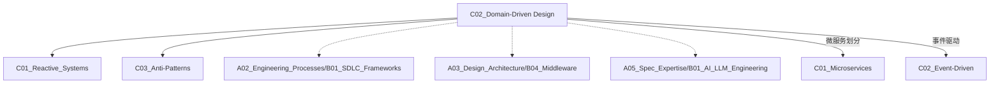

# C02 Domain-Driven Design

**所属子领域**: [B02_Design_Patterns](../README.md)  
**创建日期**: 2026-01-30  
**最后更新**: 2026-01-30

## 📋 主题定位

领域驱动设计（Domain-Driven Design, DDD）是一种以业务领域为核心的软件设计方法，通过深入理解业务领域、建立统一语言、识别限界上下文和领域模型，构建与业务紧密对齐的软件系统。DDD 特别适合处理复杂业务逻辑的大型系统。

## 🎯 核心概念

### 基本定义

**领域（Domain）**: 业务问题空间，即软件系统所要解决的核心业务领域。

**限界上下文（Bounded Context）**: 明确边界内的领域模型，每个上下文有自己的统一语言和模型，不同上下文间通过上下文映射进行集成。

**统一语言（Ubiquitous Language）**: 开发团队与领域专家共同使用的标准化业务术语，确保代码与业务描述的一致性。

**领域模型（Domain Model）**: 对业务领域的概念化表示，包含实体、值对象、聚合、领域服务等概念。

### 核心构建块

**1. 实体（Entity）**
- 具有唯一标识的对象
- 标识贯穿整个生命周期，属性可变
- 示例：订单（Order）、用户（User）、商品（Product）

**2. 值对象（Value Object）**
- 通过属性定义，无唯一标识
- 不可变，可共享
- 示例：地址（Address）、金额（Money）、时间段（DateRange）

**3. 聚合（Aggregate）**
- 一组相关对象的集合，作为数据修改的单元
- 包含聚合根（Aggregate Root）和边界内的实体/值对象
- 通过聚合根访问内部对象
- 示例：订单聚合（包含订单、订单项、收货地址）

**4. 领域服务（Domain Service）**
- 封装不适合放在实体或值对象中的领域逻辑
- 无状态，操作多个领域对象
- 示例：转账服务、订单价格计算服务

**5. 仓储（Repository）**
- 聚合的持久化抽象
- 提供增删改查接口，屏蔽数据访问细节
- 示例：OrderRepository、UserRepository

**6. 工厂（Factory）**
- 封装复杂对象的创建逻辑
- 替代构造函数处理复杂初始化
- 示例：OrderFactory、ComplexProductFactory

### 架构分层

```
┌─────────────────────────────────────┐
│         用户接口层 (UI Layer)         │  ← API、Web、CLI
│   Controllers, DTOs, Validators     │
├─────────────────────────────────────┤
│          应用层 (Application)         │  ← 用例编排
│   Services, Commands, Queries       │
│   Events, Sagas                     │
├─────────────────────────────────────┤
│          领域层 (Domain)              │  ← 核心业务逻辑
│   Entities, Value Objects           │
│   Aggregates, Domain Services       │
│   Domain Events, Repositories(IF)   │
├─────────────────────────────────────┤
│         基础设施层 (Infrastructure)    │  ← 技术实现
│   Repositories(Impl), ORM           │
│   Message Queue, External APIs      │
│   Persistence, Cache                │
└─────────────────────────────────────┘
```

### 限界上下文映射模式

| 模式 | 说明 | 适用场景 |
|------|------|----------|
| **合作关系** | 两个团队协作演进 | 紧密相关的上下文 |
| **共享内核** | 共享部分模型 | 高度耦合的核心概念 |
| **客户-供应商** | 上游优先满足下游需求 | 有明确依赖关系 |
| **遵奉者** | 下游完全遵循上游模型 | 下游无话语权 |
| **防腐层** | 下游隔离上游模型 | 保护领域模型纯净 |
| **开放主机服务** | 上游提供标准接口 | 服务化集成 |
| **发布语言** | 定义明确的数据交换格式 | 文档化接口契约 |

## 🛠️ 技术实践

### 实现方法

**1. 领域模型实现**

```python
from dataclasses import dataclass, field
from datetime import datetime
from typing import List, Optional
from uuid import UUID, uuid4
from decimal import Decimal

# ========== 值对象 ==========
@dataclass(frozen=True)
class Money:
    """金额值对象"""
    amount: Decimal
    currency: str = "CNY"
    
    def __post_init__(self):
        if self.amount < 0:
            raise ValueError("Amount cannot be negative")
    
    def add(self, other: 'Money') -> 'Money':
        if self.currency != other.currency:
            raise ValueError("Cannot add different currencies")
        return Money(self.amount + other.amount, self.currency)
    
    def multiply(self, factor: int) -> 'Money':
        return Money(self.amount * factor, self.currency)

@dataclass(frozen=True)
class Address:
    """地址值对象"""
    province: str
    city: str
    district: str
    street: str
    detail: str
    zip_code: Optional[str] = None
    
    def __str__(self) -> str:
        return f"{self.province}{self.city}{self.district}{self.street}{self.detail}"

# ========== 实体 ==========
class OrderItem:
    """订单项实体"""
    
    def __init__(self, sku: str, name: str, quantity: int, unit_price: Money):
        self._id = uuid4()
        self._sku = sku
        self._name = name
        self._quantity = quantity
        self._unit_price = unit_price
    
    @property
    def id(self) -> UUID:
        return self._id
    
    @property
    def subtotal(self) -> Money:
        return self._unit_price.multiply(self._quantity)
    
    def change_quantity(self, new_quantity: int):
        if new_quantity < 1:
            raise ValueError("Quantity must be at least 1")
        self._quantity = new_quantity

# ========== 聚合根 ==========
class Order:
    """订单聚合根"""
    
    def __init__(self, order_id: UUID, customer_id: UUID, shipping_address: Address):
        self._id = order_id
        self._customer_id = customer_id
        self._shipping_address = shipping_address
        self._items: List[OrderItem] = []
        self._status = OrderStatus.PENDING
        self._created_at = datetime.now()
        self._events: List[DomainEvent] = []
    
    @property
    def id(self) -> UUID:
        return self._id
    
    @property
    def total_amount(self) -> Money:
        """计算订单总额"""
        total = Money(Decimal('0'))
        for item in self._items:
            total = total.add(item.subtotal)
        return total
    
    @property
    def status(self) -> 'OrderStatus':
        return self._status
    
    def add_item(self, item: OrderItem):
        """添加订单项（业务规则验证）"""
        if self._status != OrderStatus.PENDING:
            raise InvalidOrderStateError("Cannot modify confirmed order")
        
        # 检查重复SKU
        existing = next((i for i in self._items if i._sku == item._sku), None)
        if existing:
            existing.change_quantity(existing._quantity + item._quantity)
        else:
            self._items.append(item)
    
    def confirm(self):
        """确认订单"""
        if not self._items:
            raise EmptyOrderError("Cannot confirm empty order")
        if self._status != OrderStatus.PENDING:
            raise InvalidOrderStateError("Order already confirmed")
        
        self._status = OrderStatus.CONFIRMED
        self._record_event(OrderConfirmedEvent(
            order_id=self._id,
            total_amount=self.total_amount,
            confirmed_at=datetime.now()
        ))
    
    def ship(self, tracking_number: str):
        """发货"""
        if self._status != OrderStatus.CONFIRMED:
            raise InvalidOrderStateError("Order must be confirmed before shipping")
        
        self._status = OrderStatus.SHIPPED
        self._tracking_number = tracking_number
        self._record_event(OrderShippedEvent(
            order_id=self._id,
            tracking_number=tracking_number,
            shipped_at=datetime.now()
        ))
    
    def _record_event(self, event: 'DomainEvent'):
        self._events.append(event)
    
    def clear_events(self):
        self._events.clear()
    
    def get_uncommitted_events(self) -> List['DomainEvent']:
        return self._events.copy()

# ========== 领域服务 ==========
class PricingService:
    """定价领域服务"""
    
    def __init__(self, promotion_repository, membership_service):
        self._promotion_repo = promotion_repository
        self._membership = membership_service
    
    def calculate_final_price(self, product: 'Product', customer: 'Customer') -> Money:
        """计算最终价格（考虑促销和会员折扣）"""
        base_price = product.base_price
        
        # 应用促销活动
        active_promotions = self._promotion_repo.find_active_for(product.id)
        discounted_price = self._apply_promotions(base_price, active_promotions)
        
        # 应用会员折扣
        if self._membership.is_vip(customer.id):
            discounted_price = self._apply_vip_discount(discounted_price)
        
        return discounted_price
    
    def _apply_promotions(self, price: Money, promotions: List['Promotion']) -> Money:
        # 促销逻辑...
        return price
    
    def _apply_vip_discount(self, price: Money) -> Money:
        # VIP 折扣逻辑...
        return Money(price.amount * Decimal('0.9'), price.currency)
```

**2. 仓储模式实现**

```python
from abc import ABC, abstractmethod
from typing import Optional, List

# ========== 仓储接口（领域层） ==========
class OrderRepository(ABC):
    """订单仓储接口"""
    
    @abstractmethod
    def find_by_id(self, order_id: UUID) -> Optional[Order]:
        """根据ID查找订单"""
        pass
    
    @abstractmethod
    def find_by_customer(self, customer_id: UUID, limit: int = 10) -> List[Order]:
        """查找客户的订单"""
        pass
    
    @abstractmethod
    def save(self, order: Order) -> None:
        """保存订单"""
        pass
    
    @abstractmethod
    def delete(self, order_id: UUID) -> None:
        """删除订单"""
        pass

# ========== 仓储实现（基础设施层） ==========
class SqlOrderRepository(OrderRepository):
    """SQL实现"""
    
    def __init__(self, db_session, event_publisher):
        self._session = db_session
        self._event_publisher = event_publisher
    
    def find_by_id(self, order_id: UUID) -> Optional[Order]:
        # 从数据库重建聚合
        order_data = self._session.query(OrderTable).get(order_id)
        if not order_data:
            return None
        
        return self._reconstitute_order(order_data)
    
    def save(self, order: Order) -> None:
        # 持久化订单
        order_data = self._to_table(order)
        self._session.merge(order_data)
        
        # 发布领域事件
        for event in order.get_uncommitted_events():
            self._event_publisher.publish(event)
        
        order.clear_events()
        self._session.commit()
    
    def _reconstitute_order(self, data) -> Order:
        """从数据库数据重建聚合"""
        order = Order.__new__(Order)
        # 恢复状态...
        return order
    
    def _to_table(self, order: Order) -> 'OrderTable':
        """转换为数据库表对象"""
        # 转换逻辑...
        pass

# ========== 内存实现（测试用） ==========
class InMemoryOrderRepository(OrderRepository):
    """内存仓储（单元测试用）"""
    
    def __init__(self):
        self._orders: Dict[UUID, Order] = {}
    
    def find_by_id(self, order_id: UUID) -> Optional[Order]:
        return self._orders.get(order_id)
    
    def save(self, order: Order) -> None:
        self._orders[order.id] = order
```

**3. 应用服务实现**

```python
from dataclasses import dataclass
from typing import List

# ========== 命令对象 ==========
@dataclass
class CreateOrderCommand:
    customer_id: UUID
    shipping_address: Address
    items: List[OrderItemDto]

@dataclass
class OrderItemDto:
    sku: str
    name: str
    quantity: int
    unit_price: Money

# ========== 应用服务 ==========
class OrderApplicationService:
    """订单应用服务"""
    
    def __init__(
        self,
        order_repository: OrderRepository,
        customer_repository: 'CustomerRepository',
        inventory_service: 'InventoryService',
        event_bus: 'EventBus'
    ):
        self._order_repo = order_repository
        self._customer_repo = customer_repository
        self._inventory = inventory_service
        self._event_bus = event_bus
    
    def create_order(self, command: CreateOrderCommand) -> UUID:
        """创建订单用例"""
        # 验证客户存在
        customer = self._customer_repo.find_by_id(command.customer_id)
        if not customer:
            raise CustomerNotFoundError(command.customer_id)
        
        # 检查库存
        for item in command.items:
            if not self._inventory.check_availability(item.sku, item.quantity):
                raise InsufficientInventoryError(item.sku)
        
        # 创建订单聚合
        order_id = uuid4()
        order = Order(
            order_id=order_id,
            customer_id=command.customer_id,
            shipping_address=command.shipping_address
        )
        
        for item_dto in command.items:
            order.add_item(OrderItem(
                sku=item_dto.sku,
                name=item_dto.name,
                quantity=item_dto.quantity,
                unit_price=item_dto.unit_price
            ))
        
        # 保存并发布事件
        self._order_repo.save(order)
        
        return order_id
    
    def confirm_order(self, order_id: UUID):
        """确认订单用例"""
        order = self._order_repo.find_by_id(order_id)
        if not order:
            raise OrderNotFoundError(order_id)
        
        order.confirm()
        self._order_repo.save(order)
    
    def get_order_details(self, order_id: UUID) -> 'OrderDetailsDto':
        """查询订单详情"""
        order = self._order_repo.find_by_id(order_id)
        if not order:
            raise OrderNotFoundError(order_id)
        
        return OrderDetailsDto(
            order_id=order.id,
            status=order.status,
            total_amount=order.total_amount,
            items=[
                OrderItemDetailsDto(
                    sku=item._sku,
                    name=item._name,
                    quantity=item._quantity,
                    subtotal=item.subtotal
                )
                for item in order._items
            ]
        )
```

**4. 防腐层实现**

```python
# ========== 外部服务接口（上游模型） ==========
class ExternalPaymentApi:
    """第三方支付API"""
    
    def process_payment(self, payment_data: dict) -> dict:
        # 外部API调用...
        return {
            "trans_id": "12345",
            "status": "success",
            "amount": 100.00,
            "currency": "USD",
            "timestamp": "2024-01-30T10:00:00Z"
        }

# ========== 防腐层（ACL） ==========
class PaymentServiceAdapter:
    """支付服务适配器 - 防腐层"""
    
    def __init__(self, external_api: ExternalPaymentApi):
        self._external_api = external_api
    
    def charge(self, amount: Money, payment_method: 'PaymentMethod') -> 'PaymentResult':
        """适配外部支付服务"""
        # 转换领域对象到外部格式
        external_request = {
            "amount": float(amount.amount),
            "currency": amount.currency,
            "payment_token": payment_method.token,
            "merchant_id": "our_merchant_id"
        }
        
        # 调用外部服务
        external_response = self._external_api.process_payment(external_request)
        
        # 转换外部响应回领域对象
        return PaymentResult(
            transaction_id=external_response["trans_id"],
            success=external_response["status"] == "success",
            amount=Money(
                Decimal(str(external_response["amount"])),
                external_response["currency"]
            ),
            processed_at=datetime.fromisoformat(external_response["timestamp"])
        )

# ========== 领域层使用的纯净接口 ==========
class PaymentService(ABC):
    """支付服务领域接口"""
    
    @abstractmethod
    def charge(self, amount: Money, payment_method: 'PaymentMethod') -> 'PaymentResult':
        pass
```

**5. 领域事件实现**

```python
from dataclasses import dataclass
from datetime import datetime
from typing import Dict, Any

@dataclass(frozen=True)
class DomainEvent:
    """领域事件基类"""
    event_id: UUID
    aggregate_id: UUID
    aggregate_type: str
    occurred_on: datetime
    event_type: str
    payload: Dict[str, Any]

@dataclass(frozen=True)
class OrderConfirmedEvent(DomainEvent):
    """订单确认事件"""
    
    @staticmethod
    def create(order_id: UUID, total_amount: Money) -> 'OrderConfirmedEvent':
        return OrderConfirmedEvent(
            event_id=uuid4(),
            aggregate_id=order_id,
            aggregate_type="Order",
            occurred_on=datetime.now(),
            event_type="OrderConfirmed",
            payload={
                "total_amount": str(total_amount.amount),
                "currency": total_amount.currency
            }
        )

# 事件处理器
class OrderConfirmedEventHandler:
    """订单确认事件处理器"""
    
    def __init__(self, email_service, inventory_service):
        self._email = email_service
        self._inventory = inventory_service
    
    def handle(self, event: OrderConfirmedEvent):
        # 发送确认邮件
        self._email.send_order_confirmation(
            order_id=event.aggregate_id,
            total_amount=event.payload["total_amount"]
        )
        
        # 预留库存
        self._inventory.reserve_for_order(event.aggregate_id)
```

### 最佳实践

**1. 聚合设计原则**

```yaml
聚合边界确定原则:
  1. 不变量一致性:
     - 聚合边界内必须保持一致的业务规则
     - 例如: 订单总额 = 所有订单项小计之和
  
  2. 事务边界:
     - 一个事务只修改一个聚合
     - 避免跨聚合事务
  
  3. 删除规则:
     - 聚合作为整体删除
     - 孤儿对象不应存在
  
  4. 大小控制:
     - 聚合应尽量小
     - 大聚合影响性能
```

**2. 限界上下文识别**

```python
# 示例：电商系统的限界上下文
BOUNDED_CONTEXTS = {
    "Catalog": {
        "responsibility": "商品目录管理",
        "entities": ["Product", "Category", "Brand"],
        "language": {
            "Product": "包含SKU、描述、图片的商品",
            "Category": "商品分类树"
        }
    },
    "Inventory": {
        "responsibility": "库存管理",
        "entities": ["Stock", "Warehouse", "StockMovement"],
        "language": {
            "Stock": "特定仓库中某SKU的数量",
            "Reserved": "为订单预留的库存"
        }
    },
    "Pricing": {
        "responsibility": "价格计算",
        "entities": ["Price", "Promotion", "Discount"],
        "language": {
            "BasePrice": "商品基础价格",
            "FinalPrice": "应用所有折扣后的价格"
        }
    },
    "Order": {
        "responsibility": "订单处理",
        "entities": ["Order", "OrderItem", "Payment"],
        "language": {
            "Order": "客户提交的购买请求",
            "Subtotal": "订单项小计"
        }
    },
    "Shipping": {
        "responsibility": "物流配送",
        "entities": ["Shipment", "Delivery", "Carrier"],
        "language": {
            "Shipment": "需要配送的包裹",
            "TrackingNumber": "物流追踪号"
        }
    }
}
```

**3. 上下文映射示例**

```
┌─────────────────────────────────────────────────────────────────┐
│                        限界上下文映射                            │
├─────────────────────────────────────────────────────────────────┤
│                                                                 │
│   ┌──────────┐    合作关系     ┌──────────┐                    │
│   │  Catalog  │◄──────────────►│ Inventory │                    │
│   └──────────┘                 └──────────┘                    │
│        │                            │                          │
│        │ 防腐层                      │ 客户-供应商               │
│        ▼                            ▼                          │
│   ┌──────────┐                 ┌──────────┐    遵奉者    ┌─────┐│
│   │  Pricing  │                 │   Order   │◄──────────│Payment│
│   └──────────┘                 └──────────┘            └─────┘│
│                                     │                          │
│                                     │ 开放主机服务              │
│                                     ▼                          │
│                                ┌──────────┐                   │
│                                │ Shipping │                   │
│                                └──────────┘                   │
│                                                                 │
└─────────────────────────────────────────────────────────────────┘
```

### 常见陷阱

**1. 贫血领域模型**
- ❌ 领域对象只有 getter/setter，业务逻辑在 Service 中
- ✅ 将业务逻辑封装在实体和值对象中
- ✅ 领域服务只处理跨对象逻辑

**2. 过大的聚合**
- ❌ 一个聚合包含数十个对象
- ✅ 按业务不变量划分小聚合
- ✅ 使用领域事件协调跨聚合操作

**3. 跨聚合引用**
- ❌ 直接持有其他聚合的实体引用
- ✅ 只存储其他聚合根的 ID
- ✅ 通过仓储加载所需聚合

**4. 忽视统一语言**
- ❌ 代码术语与业务术语不一致
- ✅ 与领域专家共同定义术语
- ✅ 术语变更同步更新代码

## 📚 资源索引

### 学术论文

1. **Domain-Driven Design: Tackling Complexity in the Heart of Software** (2003)
   - 作者：Eric Evans
   - 说明：DDD 奠基之作，必读经典

2. **Implementing Domain-Driven Design** (2013)
   - 作者：Vaughn Vernon
   - 说明：DDD 实战指南，详细代码示例

3. **Domain-Driven Design Distilled** (2016)
   - 作者：Vaughn Vernon
   - 说明：DDD 精华浓缩版

### 技术文档

1. **DDD 社区资源**
   - https://domainlanguage.com/
   - Eric Evans 的官方网站

2. **Microsoft DDD 架构指南**
   - https://docs.microsoft.com/en-us/dotnet/architecture/microservices/microservice-ddd-cqrs-patterns/
   - 微服务中的 DDD 实践

3. **DDD 欧洲会议资料**
   - https://dddeurope.com/
   - 行业最新实践分享

### 开源项目

1. **DDD Sample Application**
   - https://github.com/citerus/dddsample-core
   - 经典货物追踪示例

2. **eShopOnContainers**
   - https://github.com/dotnet-architecture/eShopOnContainers
   - 微软 DDD + 微服务示例

3. **Modular Monolith**
   - https://github.com/kgrzybek/modular-monolith-with-ddd
   - 模块化单体 DDD 实现

### 相关模式

1. **CQRS** - 与 DDD 常结合使用
2. **Event Sourcing** - 领域事件持久化
3. **Saga** - 跨聚合事务
4. **Specification** - 业务规则封装

## 🔗 关联知识



## 💡 学习建议

### 前置知识
- 面向对象设计原则
- 设计模式
- 依赖注入和控制反转
- 单元测试和 TDD

### 学习路径

**第1周：战略设计**
- 理解限界上下文
- 学习上下文映射
- 实践领域划分

**第2周：战术设计**
- 实体、值对象、聚合
- 仓储和领域服务
- 领域事件

**第3周：架构实现**
- 分层架构
- 依赖注入
- 事务边界

**第4周：复杂场景**
- CQRS 实现
- 事件溯源
- 微服务拆分

### 实践项目

**项目1：任务管理系统**
- 领域建模
- 聚合设计
- 领域服务

**项目2：电商订单系统**
- 复杂聚合
- 领域事件
- Saga 事务

**项目3：银行转账系统**
- 领域规则
- 防腐层
- 并发控制

## 🔄 维护说明

- **更新频率**: 每半年更新 DDD 实践案例
- **质量标准**: 代码示例符合 DDD 原则，术语准确
- **贡献方式**: 提交新的建模技巧、反模式分析、实战案例
