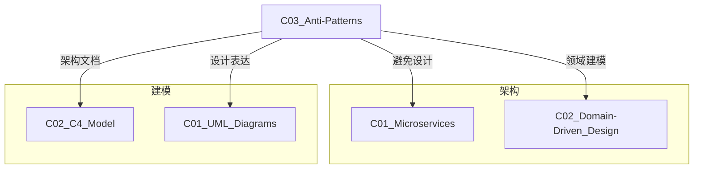

# C03 Anti-Patterns - 反模式

**领域**: A03_Design_Architecture/B02_Design_Patterns  
**创建日期**: 2026-01-30  
**最后更新**: 2026-01-30

---

## 1. 主题定位

### 1.1 定义与本质

反模式（Anti-Patterns）是指在软件设计和架构中常见但无效或适得其反的解决方案。与模式（Patterns）提供经过验证的最佳实践不同，反模式揭示了应该避免的陷阱和错误做法。

反模式的概念由Andrew Koenig于1995年首次提出，并在《AntiPatterns: Refactoring Software, Architectures, and Projects in Crisis》（1998年）一书中系统化。理解反模式对于构建健壮、可维护的系统至关重要。

### 1.2 反模式的分类

```
┌─────────────────────────────────────────────────────────────────┐
│                      反模式分类体系                              │
├─────────────────────────────────────────────────────────────────┤
│                                                                 │
│  ┌─────────────────────────────────────────────────────────┐   │
│  │                    架构级反模式                          │   │
│  │                                                         │   │
│  │  • 大泥球 (Big Ball of Mud)                             │   │
│  │  • 烟囱系统 (Stovepipe Enterprise)                      │   │
│  │  • 供应商锁入 (Vendor Lock-In)                          │   │
│  │  • 金锤 (Golden Hammer)                                 │   │
│  │  • 自动生成_crud (Autogenerated Stovepipe)              │   │
│  │                                                         │   │
│  └─────────────────────────────────────────────────────────┘   │
│                                                                 │
│  ┌─────────────────────────────────────────────────────────┐   │
│  │                    设计级反模式                          │   │
│  │                                                         │   │
│  │  • 上帝对象 (God Object)                                │   │
│  │  • 贫血领域模型 (Anemic Domain Model)                   │   │
│  │  • 循环依赖 (Circular Dependency)                       │   │
│  │  • 幽灵类 (Poltergeist)                                 │   │
│  │  • 面条代码 (Spaghetti Code)                            │   │
│  │                                                         │   │
│  └─────────────────────────────────────────────────────────┘   │
│                                                                 │
│  ┌─────────────────────────────────────────────────────────┐   │
│  │                    微服务反模式                          │   │
│  │                                                         │   │
│  │  • 分布式单体 (Distributed Monolith)                    │   │
│  │  • 微服务过度拆分 (Nanoservices)                        │   │
│  │  • 共享数据库 (Shared Database)                         │   │
│  │  • 版本地狱 (Version Hell)                              │   │
│  │  • 级联故障 (Cascading Failure)                         │   │
│  │                                                         │   │
│  └─────────────────────────────────────────────────────────┘   │
│                                                                 │
│  ┌─────────────────────────────────────────────────────────┐   │
│  │                    云原生反模式                          │   │
│  │                                                         │   │
│  │  • 容器肥胖症 (Fat Container)                           │   │
│  │  • 配置漂移 (Configuration Drift)                       │   │
│  │  • 无状态过度设计 (Over-Engineered Statelessness)       │   │
│  │  • 错误重试风暴 (Retry Storm)                           │   │
│  │  • 资源泄漏 (Resource Leak)                             │   │
│  │                                                         │   │
│  └─────────────────────────────────────────────────────────┘   │
│                                                                 │
└─────────────────────────────────────────────────────────────────┘
```

---

## 2. 核心概念

### 2.1 反模式的特征

每个反模式通常具有以下特征：

| 特征 | 描述 |
|------|------|
| **重复出现** | 在不同项目、不同团队中反复出现 |
| **看似正确** | 初看起来是合理的解决方案 |
| **负面后果** | 最终会导致技术债务和系统问题 |
| **有更好方案** | 存在经过验证的更好替代方案 |

### 2.2 反模式的生命周期

```
反模式演化阶段:

┌──────────┐    ┌──────────┐    ┌──────────┐    ┌──────────┐
│  蜜月期   │───►│  积累期   │───►│  危机期   │───►│  重构期   │
└──────────┘    └──────────┘    └──────────┘    └──────────┘
    │               │               │               │
    ▼               ▼               ▼               ▼
方案看似有效     技术债务累积     系统难以维护     重大重构
短期收益明显     开发速度下降     故障频繁发生     或重写
                团队士气低落     业务受阻         应用模式
```

---

## 3. 技术实践 - 反模式识别与重构

### 3.1 分布式单体 (Distributed Monolith)

#### 问题描述
服务虽然物理上分离，但逻辑上高度耦合，无法独立部署和扩展。

```
分布式单体特征:

┌─────────────────────────────────────────────────────────────────┐
│                    分布式单体架构                               │
├─────────────────────────────────────────────────────────────────┤
│                                                                 │
│  ┌─────────┐     ┌─────────┐     ┌─────────┐                   │
│  │ 服务A   │◄───►│ 服务B   │◄───►│ 服务C   │                   │
│  │         │     │         │     │         │                   │
│  │ 代码耦合 │     │ 循环依赖 │     │ 同步调用 │                   │
│  └────┬────┘     └────┬────┘     └────┬────┘                   │
│       │               │               │                         │
│       └───────────────┼───────────────┘                         │
│                       │                                         │
│                  ┌────┴────┐                                    │
│                  │ 共享DB  │                                    │
│                  └─────────┘                                    │
│                                                                 │
│  ❌ 症状:                                                        │
│  • 修改一个服务需要同时部署多个服务                             │
│  • 数据库Schema变更影响所有服务                                 │
│  • 无法进行A/B测试或金丝雀发布                                  │
│  • 服务间存在循环依赖                                           │
│  • 过度使用同步调用                                             │
│                                                                 │
└─────────────────────────────────────────────────────────────────┘
```

#### 检测代码

```python
# distributed_monolith_detector.py
"""
分布式单体检测工具
分析微服务间的耦合度
"""

import json
import re
from typing import Dict, List, Set, Tuple
from dataclasses import dataclass
from collections import defaultdict
import networkx as nx


@dataclass
class ServiceDependency:
    source: str
    target: str
    type: str  # sync, async, shared_db
    endpoints: List[str]
    frequency: int = 0


class DistributedMonolithDetector:
    """分布式单体检测器"""
    
    def __init__(self, services_path: str):
        self.services_path = services_path
        self.dependencies: List[ServiceDependency] = []
        self.service_graph = nx.DiGraph()
        self.shared_databases: Dict[str, Set[str]] = defaultdict(set)
    
    def analyze_codebase(self) -> Dict:
        """分析代码库，检测分布式单体特征"""
        results = {
            "coupling_score": 0.0,
            "cyclical_dependencies": [],
            "shared_database_usage": {},
            "sync_call_ratio": 0.0,
            "deployment_coupling": [],
            "recommendations": []
        }
        
        # 1. 分析服务间依赖
        self._analyze_service_dependencies()
        
        # 2. 检测循环依赖
        cycles = self._detect_cycles()
        results["cyclical_dependencies"] = cycles
        
        # 3. 分析数据库共享
        db_sharing = self._analyze_database_sharing()
        results["shared_database_usage"] = db_sharing
        
        # 4. 计算耦合度分数
        coupling_score = self._calculate_coupling_score()
        results["coupling_score"] = coupling_score
        
        # 5. 分析同步调用比例
        sync_ratio = self._analyze_sync_calls()
        results["sync_call_ratio"] = sync_ratio
        
        # 6. 生成建议
        results["recommendations"] = self._generate_recommendations(
            cycles, db_sharing, coupling_score, sync_ratio
        )
        
        return results
    
    def _analyze_service_dependencies(self):
        """分析服务间依赖关系"""
        # 扫描服务代码，提取HTTP客户端调用
        for service_dir in self._get_service_dirs():
            service_name = service_dir.name
            
            # 扫描REST客户端调用
            rest_calls = self._scan_rest_clients(service_dir)
            for target, endpoints in rest_calls.items():
                self.dependencies.append(ServiceDependency(
                    source=service_name,
                    target=target,
                    type="sync",
                    endpoints=endpoints
                ))
                self.service_graph.add_edge(service_name, target)
            
            # 扫描消息队列使用
            msg_usage = self._scan_message_queues(service_dir)
            for target, topics in msg_usage.items():
                self.dependencies.append(ServiceDependency(
                    source=service_name,
                    target=target,
                    type="async",
                    endpoints=topics
                ))
            
            # 扫描数据库配置
            databases = self._scan_database_configs(service_dir)
            for db in databases:
                self.shared_databases[db].add(service_name)
    
    def _detect_cycles(self) -> List[List[str]]:
        """检测循环依赖"""
        try:
            cycles = list(nx.simple_cycles(self.service_graph))
            return cycles
        except:
            return []
    
    def _analyze_database_sharing(self) -> Dict:
        """分析数据库共享情况"""
        shared = {}
        for db, services in self.shared_databases.items():
            if len(services) > 1:
                shared[db] = {
                    "services": list(services),
                    "count": len(services),
                    "risk_level": "HIGH" if len(services) > 3 else "MEDIUM"
                }
        return shared
    
    def _calculate_coupling_score(self) -> float:
        """计算服务耦合度分数 (0-100)"""
        if not self.dependencies:
            return 0.0
        
        total_deps = len(self.dependencies)
        sync_deps = sum(1 for d in self.dependencies if d.type == "sync")
        
        # 同步依赖越多，耦合度越高
        sync_ratio = sync_deps / total_deps if total_deps > 0 else 0
        
        # 考虑循环依赖的影响
        cycle_penalty = len(self._detect_cycles()) * 10
        
        # 考虑数据库共享
        db_sharing_penalty = sum(
            len(services) * 5 
            for services in self.shared_databases.values()
        )
        
        score = (sync_ratio * 50) + cycle_penalty + min(db_sharing_penalty, 30)
        return min(score, 100)
    
    def _analyze_sync_calls(self) -> float:
        """分析同步调用比例"""
        if not self.dependencies:
            return 0.0
        
        sync_count = sum(1 for d in self.dependencies if d.type == "sync")
        return sync_count / len(self.dependencies)
    
    def _generate_recommendations(
        self, 
        cycles: List[List[str]],
        db_sharing: Dict,
        coupling_score: float,
        sync_ratio: float
    ) -> List[str]:
        """生成重构建议"""
        recommendations = []
        
        if coupling_score > 70:
            recommendations.append(
                "🔴 严重: 系统呈现高度耦合特征，建议优先进行服务解耦"
            )
        elif coupling_score > 40:
            recommendations.append(
                "🟡 警告: 服务间存在中度耦合，建议逐步优化"
            )
        
        if cycles:
            recommendations.append(
                f"🔴 检测到 {len(cycles)} 个循环依赖，需通过事件驱动或接口分离打破循环"
            )
        
        if db_sharing:
            recommendations.append(
                f"🟡 发现 {len(db_sharing)} 个共享数据库，建议实施Database Per Service模式"
            )
        
        if sync_ratio > 0.7:
            recommendations.append(
                f"🔴 同步调用占比 {sync_ratio:.1%}，建议引入异步通信降低耦合"
            )
        
        recommendations.extend([
            "建议引入API Gateway统一入口，减少服务间直接调用",
            "考虑使用Saga模式处理分布式事务，避免分布式锁",
            "建立服务契约测试，确保接口变更兼容性"
        ])
        
        return recommendations
    
    def _scan_rest_clients(self, service_dir) -> Dict[str, List[str]]:
        """扫描REST客户端调用"""
        # 简化实现，实际应解析代码AST
        return {}
    
    def _scan_message_queues(self, service_dir) -> Dict[str, List[str]]:
        """扫描消息队列使用"""
        return {}
    
    def _scan_database_configs(self, service_dir) -> List[str]:
        """扫描数据库配置"""
        return []
    
    def _get_service_dirs(self) -> List:
        """获取所有服务目录"""
        from pathlib import Path
        return [d for d in Path(self.services_path).iterdir() if d.is_dir()]
    
    def generate_report(self, output_path: str):
        """生成检测报告"""
        results = self.analyze_codebase()
        
        report = f"""
# 分布式单体检测报告

## 概览

| 指标 | 值 | 评估 |
|------|-----|------|
| 耦合度分数 | {results['coupling_score']:.1f}/100 | {'🔴 严重' if results['coupling_score'] > 70 else '🟡 警告' if results['coupling_score'] > 40 else '🟢 良好'} |
| 同步调用比例 | {results['sync_call_ratio']:.1%} | {'🔴 过高' if results['sync_call_ratio'] > 0.7 else '🟡 中等' if results['sync_call_ratio'] > 0.4 else '🟢 良好'} |
| 循环依赖数量 | {len(results['cyclical_dependencies'])} | {'🔴 需处理' if results['cyclical_dependencies'] else '🟢 无'} |
| 共享数据库数量 | {len(results['shared_database_usage'])} | {'🔴 需处理' if results['shared_database_usage'] else '🟢 无'} |

## 详细分析

### 循环依赖
```
{chr(10).join(f"- {' -> '.join(cycle) + ' -> ' + cycle[0]}" for cycle in results['cyclical_dependencies']) or '未检测到循环依赖'}
```

### 共享数据库
```
{json.dumps(results['shared_database_usage'], indent=2)}
```

## 重构建议

{chr(10).join(f"{i+1}. {rec}" for i, rec in enumerate(results['recommendations']))}

---
生成时间: {__import__('datetime').datetime.now().isoformat()}
"""
        
        with open(output_path, 'w') as f:
            f.write(report)
        
        print(f"Report generated: {output_path}")


# 使用示例
def example_usage():
    detector = DistributedMonolithDetector("/path/to/services")
    
    # 模拟添加依赖数据
    detector.dependencies = [
        ServiceDependency("order-service", "inventory-service", "sync", ["/check"]),
        ServiceDependency("order-service", "payment-service", "sync", ["/charge"]),
        ServiceDependency("payment-service", "notification-service", "async", ["payment.completed"]),
        ServiceDependency("inventory-service", "order-service", "sync", ["/reserve"]),  # 循环依赖
    ]
    detector.service_graph.add_edge("order-service", "inventory-service")
    detector.service_graph.add_edge("order-service", "payment-service")
    detector.service_graph.add_edge("payment-service", "notification-service")
    detector.service_graph.add_edge("inventory-service", "order-service")  # 循环
    
    detector.shared_databases["main_db"].update([
        "order-service", "inventory-service", "payment-service"
    ])
    
    detector.generate_report("/tmp/distributed_monolith_report.md")


if __name__ == "__main__":
    example_usage()
```

#### 重构方案

```java
// RefactoringExample.java
/**
 * 分布式单体重构示例
 * 
 * 重构前: 同步调用、共享数据库
 * 重构后: 事件驱动、CQRS、每服务数据库
 */

// ========== 重构前（问题代码） ==========

@Service
public class OrderServiceBefore {
    
    @Autowired
    private InventoryClient inventoryClient;  // 同步调用
    
    @Autowired
    private PaymentClient paymentClient;      // 同步调用
    
    @Autowired
    private OrderRepository orderRepository;  // 共享数据库
    
    @Transactional
    public Order createOrder(OrderRequest request) {
        // 问题1: 同步调用导致级联延迟
        InventoryResponse inventory = inventoryClient.checkStock(request.getProductId());
        if (!inventory.isAvailable()) {
            throw new OutOfStockException();
        }
        
        // 问题2: 同步调用增加了失败点
        PaymentResponse payment = paymentClient.charge(request.getAmount());
        if (!payment.isSuccess()) {
            throw new PaymentFailedException();
        }
        
        // 问题3: 本地事务跨越多个服务
        Order order = new Order(request);
        order.setPaymentId(payment.getId());
        orderRepository.save(order);
        
        // 问题4: 同步调用通知服务
        notificationClient.sendOrderConfirmation(order);
        
        return order;
    }
}

// ========== 重构后（解决方案） ==========

@Service
public class OrderServiceAfter {
    
    private final OrderRepository orderRepository;
    private final OrderEventPublisher eventPublisher;
    private final SagaOrchestrator sagaOrchestrator;
    
    public OrderServiceAfter(
            OrderRepository orderRepository,
            OrderEventPublisher eventPublisher,
            SagaOrchestrator sagaOrchestrator) {
        this.orderRepository = orderRepository;
        this.eventPublisher = eventPublisher;
        this.sagaOrchestrator = sagaOrchestrator;
    }
    
    /**
     * 重构1: 使用Saga模式处理分布式事务
     */
    public Mono<Order> createOrder(OrderRequest request) {
        // 1. 创建待处理订单
        Order order = Order.createPending(request);
        
        return orderRepository.save(order)
            .flatMap(savedOrder -> 
                // 2. 启动Saga编排
                sagaOrchestrator.executeOrderSaga(savedOrder)
                    .flatMap(sagaResult -> {
                        if (sagaResult.isSuccess()) {
                            savedOrder.confirm();
                            return orderRepository.save(savedOrder);
                        } else {
                            savedOrder.fail(sagaResult.getError());
                            return orderRepository.save(savedOrder)
                                .then(Mono.error(new OrderFailedException(sagaResult.getError())));
                        }
                    })
            );
    }
    
    /**
     * 重构2: 事件驱动库存检查
     */
    public Mono<Void> handleInventoryChecked(InventoryCheckedEvent event) {
        return orderRepository.findById(event.getOrderId())
            .flatMap(order -> {
                if (event.isAvailable()) {
                    order.markInventoryReserved();
                    // 发布支付命令
                    return orderRepository.save(order)
                        .doOnSuccess(o -> eventPublisher.publish(
                            new ProcessPaymentCommand(o.getId(), o.getAmount())
                        ));
                } else {
                    order.fail("Out of stock");
                    return orderRepository.save(order);
                }
            })
            .then();
    }
    
    /**
     * 重构3: 异步处理支付结果
     */
    public Mono<Void> handlePaymentCompleted(PaymentCompletedEvent event) {
        return orderRepository.findById(event.getOrderId())
            .flatMap(order -> {
                order.markPaid(event.getTransactionId());
                return orderRepository.save(order);
            })
            .doOnSuccess(order -> {
                // 异步发送通知
                eventPublisher.publish(new OrderConfirmedEvent(order));
            })
            .then();
    }
    
    /**
     * 重构4: CQRS - 查询优化
     */
    public Mono<OrderView> getOrderView(String orderId) {
        // 从物化视图读取，而非直接查询聚合根
        return orderViewRepository.findById(orderId);
    }
}

// ========== Saga编排器 ==========

@Component
public class SagaOrchestrator {
    
    private final StateMachineFactory stateMachineFactory;
    private final CommandGateway commandGateway;
    
    public Mono<SagaResult> executeOrderSaga(Order order) {
        SagaDefinition saga = SagaDefinition.builder()
            .step("checkInventory", 
                ctx -> commandGateway.send(new CheckInventoryCommand(order.getProductId(), order.getQuantity())))
            .compensate("checkInventory",
                ctx -> commandGateway.send(new ReleaseInventoryCommand(order.getProductId(), order.getQuantity())))
            
            .step("processPayment",
                ctx -> commandGateway.send(new ProcessPaymentCommand(order.getId(), order.getAmount())))
            .compensate("processPayment",
                ctx -> commandGateway.send(new RefundPaymentCommand(ctx.getPaymentId())))
            
            .step("createShipment",
                ctx -> commandGateway.send(new CreateShipmentCommand(order.getId(), order.getAddress())))
            .compensate("createShipment",
                ctx -> commandGateway.send(new CancelShipmentCommand(ctx.getShipmentId())))
            
            .build();
        
        return saga.execute(order.getId());
    }
}
```

### 3.2 贫血领域模型 (Anemic Domain Model)

#### 问题描述
领域模型只包含数据（getter/setter），业务逻辑全部在服务层，违反了面向对象设计原则。

```
贫血模型 vs 充血模型:

┌─────────────────────────────────────────────────────────────────┐
│                      贫血领域模型                               │
├─────────────────────────────────────────────────────────────────┤
│                                                                 │
│  ┌───────────────┐      ┌───────────────────────────────────┐  │
│  │   OrderDTO    │      │        OrderService               │  │
│  │               │      │                                   │  │
│  │ - orderId     │      │  + createOrder()                  │  │
│  │ - customerId  │      │  + cancelOrder()                  │  │
│  │ - total       │      │  + calculateDiscount()            │  │
│  │ - status      │      │  + validateOrder()                │  │
│  │               │      │  + processPayment()               │  │
│  │ + getOrderId()│      │                                   │  │
│  │ + setOrderId()│      │  // 所有业务逻辑都在这里           │  │
│  └───────────────┘      └───────────────────────────────────┘  │
│                                                                 │
│  ❌ 问题:                                                        │
│  • 违反封装原则                                                  │
│  • 业务逻辑分散                                                  │
│  • 难以单元测试                                                  │
│  • 无法表达领域概念                                              │
│                                                                 │
└─────────────────────────────────────────────────────────────────┘

┌─────────────────────────────────────────────────────────────────┐
│                      充血领域模型                               │
├─────────────────────────────────────────────────────────────────┤
│                                                                 │
│  ┌───────────────────────────────────────────────────────────┐ │
│  │                      Order                                │ │
│  │                          (聚合根)                          │ │
│  │  - orderId: OrderId                                       │ │
│  │  - customerId: CustomerId                                 │ │
│  │  - items: List<OrderItem>                                 │ │
│  │  - total: Money                                           │ │
│  │  - status: OrderStatus                                    │ │
│  │                                                           │ │
│  │  + addItem(product, quantity, price)                      │ │
│  │  + removeItem(itemId)                                     │ │
│  │  + confirm()                                              │ │
│  │  + cancel()                                               │ │
│  │  + calculateTotal(): Money                                │ │
│  │  + applyDiscount(discountCode): Money                     │ │
│  │  + validate(): ValidationResult                           │ │
│  │  + toSnapshot(): OrderSnapshot                            │ │
│  │                                                           │ │
│  │  // 业务规则封装在领域对象中                                 │ │
│  └───────────────────────────────────────────────────────────┘ │
│                                                                 │
│  ✅ 优势:                                                        │
│  • 高内聚、低耦合                                                │
│  • 易于单元测试                                                  │
│  • 代码自文档化                                                  │
│  • 符合OO设计原则                                                │
│                                                                 │
└─────────────────────────────────────────────────────────────────┘
```

#### 重构代码

```java
// RichDomainModel.java
package com.example.domain;

import java.math.BigDecimal;
import java.time.LocalDateTime;
import java.util.*;

/**
 * 充血领域模型示例 - 订单聚合根
 */
public class Order {
    
    private final OrderId orderId;
    private final CustomerId customerId;
    private final List<OrderItem> items;
    private OrderStatus status;
    private Money total;
    private LocalDateTime createdAt;
    private LocalDateTime confirmedAt;
    private PaymentId paymentId;
    
    // 业务规则常量
    private static final int MAX_ITEMS = 100;
    private static final BigDecimal MIN_ORDER_AMOUNT = new BigDecimal("0.01");
    private static final int CANCELLATION_WINDOW_HOURS = 24;
    
    // ========== 构造函数（工厂方法） ==========
    
    private Order(OrderId orderId, CustomerId customerId) {
        this.orderId = orderId;
        this.customerId = customerId;
        this.items = new ArrayList<>();
        this.status = OrderStatus.PENDING;
        this.total = Money.zero();
        this.createdAt = LocalDateTime.now();
    }
    
    /**
     * 工厂方法：创建新订单
     */
    public static Order create(CustomerId customerId) {
        return new Order(OrderId.generate(), customerId);
    }
    
    /**
     * 工厂方法：从持久化状态重建
     */
    public static Order reconstruct(OrderSnapshot snapshot) {
        Order order = new Order(snapshot.getOrderId(), snapshot.getCustomerId());
        order.status = snapshot.getStatus();
        order.total = snapshot.getTotal();
        order.createdAt = snapshot.getCreatedAt();
        order.confirmedAt = snapshot.getConfirmedAt();
        order.paymentId = snapshot.getPaymentId();
        
        for (OrderItemSnapshot itemSnapshot : snapshot.getItems()) {
            order.items.add(OrderItem.reconstruct(itemSnapshot));
        }
        
        return order;
    }
    
    // ========== 领域方法（业务逻辑） ==========
    
    /**
     * 添加订单项 - 包含业务规则验证
     */
    public void addItem(ProductId productId, int quantity, Money unitPrice) {
        // 业务规则1: 只能在待处理状态添加商品
        if (status != OrderStatus.PENDING) {
            throw new OrderModificationException(
                "Cannot add items to order in status: " + status);
        }
        
        // 业务规则2: 最大商品数量限制
        if (items.size() >= MAX_ITEMS) {
            throw new OrderLimitExceededException(
                "Maximum " + MAX_ITEMS + " items allowed per order");
        }
        
        // 业务规则3: 数量必须为正数
        if (quantity <= 0) {
            throw new InvalidQuantityException("Quantity must be positive");
        }
        
        // 检查是否已存在相同商品
        Optional<OrderItem> existingItem = findItemByProduct(productId);
        
        if (existingItem.isPresent()) {
            // 更新现有商品数量
            existingItem.get().increaseQuantity(quantity);
        } else {
            // 添加新商品
            items.add(new OrderItem(productId, quantity, unitPrice));
        }
        
        // 重新计算总价
        recalculateTotal();
        
        // 记录领域事件
        registerEvent(new ItemAddedToOrder(orderId, productId, quantity));
    }
    
    /**
     * 移除订单项
     */
    public void removeItem(OrderItemId itemId) {
        if (status != OrderStatus.PENDING) {
            throw new OrderModificationException(
                "Cannot remove items from order in status: " + status);
        }
        
        OrderItem item = findItem(itemId)
            .orElseThrow(() -> new OrderItemNotFoundException(itemId));
        
        items.remove(item);
        recalculateTotal();
        
        registerEvent(new ItemRemovedFromOrder(orderId, itemId));
    }
    
    /**
     * 确认订单
     */
    public void confirm() {
        // 业务规则1: 只能确认待处理订单
        if (status != OrderStatus.PENDING) {
            throw new InvalidOrderStateException(
                "Cannot confirm order in status: " + status);
        }
        
        // 业务规则2: 必须包含商品
        if (items.isEmpty()) {
            throw new EmptyOrderException("Cannot confirm empty order");
        }
        
        // 业务规则3: 订单金额必须大于最小值
        if (total.isLessThan(Money.of(MIN_ORDER_AMOUNT))) {
            throw new MinimumOrderAmountException(
                "Order total must be at least " + MIN_ORDER_AMOUNT);
        }
        
        // 执行业务逻辑
        this.status = OrderStatus.CONFIRMED;
        this.confirmedAt = LocalDateTime.now();
        
        registerEvent(new OrderConfirmed(orderId, confirmedAt, total));
    }
    
    /**
     * 取消订单
     */
    public void cancel(String reason) {
        // 业务规则1: 已完成或已发货的订单不能取消
        if (status == OrderStatus.SHIPPED || status == OrderStatus.DELIVERED) {
            throw new OrderCancellationException(
                "Cannot cancel order that has been shipped or delivered");
        }
        
        // 业务规则2: 确认后的订单只能在时间窗口内取消
        if (status == OrderStatus.CONFIRMED && confirmedAt != null) {
            LocalDateTime cutoff = confirmedAt.plusHours(CANCELLATION_WINDOW_HOURS);
            if (LocalDateTime.now().isAfter(cutoff)) {
                throw new OrderCancellationException(
                    "Cancellation window of " + CANCELLATION_WINDOW_HOURS + 
                    " hours has expired");
            }
        }
        
        this.status = OrderStatus.CANCELLED;
        
        registerEvent(new OrderCancelled(orderId, reason, LocalDateTime.now()));
    }
    
    /**
     * 应用折扣
     */
    public Money applyDiscount(DiscountCode discountCode) {
        // 验证折扣码有效性
        Discount discount = validateDiscountCode(discountCode);
        
        // 计算折扣金额
        Money discountAmount = discount.calculateDiscount(total);
        Money discountedTotal = total.subtract(discountAmount);
        
        // 确保折扣后金额不为负
        if (discountedTotal.isNegative()) {
            discountAmount = total;
            discountedTotal = Money.zero();
        }
        
        // 更新总价
        this.total = discountedTotal;
        
        registerEvent(new DiscountApplied(orderId, discountCode, discountAmount));
        
        return discountAmount;
    }
    
    /**
     * 记录支付
     */
    public void recordPayment(PaymentId paymentId, Money amount) {
        if (status != OrderStatus.CONFIRMED) {
            throw new InvalidOrderStateException(
                "Cannot record payment for order in status: " + status);
        }
        
        if (!amount.equals(total)) {
            throw new PaymentAmountMismatchException(
                "Payment amount " + amount + " does not match order total " + total);
        }
        
        this.paymentId = paymentId;
        this.status = OrderStatus.PAID;
        
        registerEvent(new OrderPaid(orderId, paymentId, amount));
    }
    
    // ========== 领域查询方法 ==========
    
    /**
     * 验证订单完整性
     */
    public ValidationResult validate() {
        List<String> errors = new ArrayList<>();
        
        if (items.isEmpty()) {
            errors.add("Order must contain at least one item");
        }
        
        if (total.isLessThan(Money.of(MIN_ORDER_AMOUNT))) {
            errors.add("Order total must be at least " + MIN_ORDER_AMOUNT);
        }
        
        for (OrderItem item : items) {
            if (!item.isValid()) {
                errors.add("Invalid item: " + item.getProductId());
            }
        }
        
        return errors.isEmpty() 
            ? ValidationResult.success() 
            : ValidationResult.failure(errors);
    }
    
    /**
     * 是否可以取消
     */
    public boolean canBeCancelled() {
        if (status == OrderStatus.SHIPPED || status == OrderStatus.DELIVERED) {
            return false;
        }
        
        if (status == OrderStatus.CONFIRMED && confirmedAt != null) {
            LocalDateTime cutoff = confirmedAt.plusHours(CANCELLATION_WINDOW_HOURS);
            return LocalDateTime.now().isBefore(cutoff);
        }
        
        return true;
    }
    
    /**
     * 获取商品总数
     */
    public int getTotalItemCount() {
        return items.stream()
            .mapToInt(OrderItem::getQuantity)
            .sum();
    }
    
    // ========== 内部辅助方法 ==========
    
    private void recalculateTotal() {
        this.total = items.stream()
            .map(OrderItem::getSubtotal)
            .reduce(Money.zero(), Money::add);
    }
    
    private Optional<OrderItem> findItem(OrderItemId itemId) {
        return items.stream()
            .filter(item -> item.getItemId().equals(itemId))
            .findFirst();
    }
    
    private Optional<OrderItem> findItemByProduct(ProductId productId) {
        return items.stream()
            .filter(item -> item.getProductId().equals(productId))
            .findFirst();
    }
    
    private Discount validateDiscountCode(DiscountCode code) {
        // 实际实现应查询折扣服务
        return Discount.valueOf(code);
    }
    
    private void registerEvent(DomainEvent event) {
        // 将事件添加到领域事件集合
        // 由聚合根管理器在事务提交时发布
    }
    
    // ========== 转换为快照（持久化） ==========
    
    public OrderSnapshot toSnapshot() {
        return OrderSnapshot.builder()
            .orderId(orderId)
            .customerId(customerId)
            .items(items.stream().map(OrderItem::toSnapshot).toList())
            .status(status)
            .total(total)
            .createdAt(createdAt)
            .confirmedAt(confirmedAt)
            .paymentId(paymentId)
            .build();
    }
    
    // ========== Getter（只读访问） ==========
    
    public OrderId getOrderId() { return orderId; }
    public CustomerId getCustomerId() { return customerId; }
    public List<OrderItem> getItems() { return Collections.unmodifiableList(items); }
    public OrderStatus getStatus() { return status; }
    public Money getTotal() { return total; }
    public LocalDateTime getCreatedAt() { return createdAt; }
}

// ========== 值对象示例 ==========

public record Money(BigDecimal amount, Currency currency) {
    
    public static Money of(BigDecimal amount) {
        return new Money(amount, Currency.getInstance("USD"));
    }
    
    public static Money zero() {
        return new Money(BigDecimal.ZERO, Currency.getInstance("USD"));
    }
    
    public Money add(Money other) {
        if (!this.currency.equals(other.currency)) {
            throw new CurrencyMismatchException();
        }
        return new Money(this.amount.add(other.amount), this.currency);
    }
    
    public Money subtract(Money other) {
        if (!this.currency.equals(other.currency)) {
            throw new CurrencyMismatchException();
        }
        return new Money(this.amount.subtract(other.amount), this.currency);
    }
    
    public boolean isLessThan(Money other) {
        return this.amount.compareTo(other.amount) < 0;
    }
    
    public boolean isNegative() {
        return amount.compareTo(BigDecimal.ZERO) < 0;
    }
}

public record OrderId(String value) {
    public static OrderId generate() {
        return new OrderId(UUID.randomUUID().toString());
    }
}
```

### 3.3 金锤反模式 (Golden Hammer)

#### 问题描述
团队过度依赖熟悉的工具或技术，试图用它解决所有问题，即使它并不适合。

```
金锤反模式示例:

❌ "如果只有一把锤子，所有东西看起来都像钉子"

场景1: 所有问题都用微服务解决
   ┌─────────────────────────────────────┐
   │  简单CRUD应用                       │
   │  用户: 10人                         │
   │  决策: "必须用微服务架构！"          │
   │  结果: 运维复杂度远超业务复杂度      │
   └─────────────────────────────────────┘

场景2: 所有数据都存MongoDB
   ┌─────────────────────────────────────┐
   │  复杂报表查询需求                    │
   │  需要多表JOIN和聚合                  │
   │  决策: "我们已经熟悉MongoDB"         │
   │  结果: 在应用层实现复杂的JOIN逻辑    │
   └─────────────────────────────────────┘

场景3: 所有项目都用Java
   ┌─────────────────────────────────────┐
   │  机器学习模型服务                    │
   │  Python生态更成熟                   │
   │  决策: "团队只会Java"                │
   │  结果: 用Java调用Python脚本，效率低  │
   └─────────────────────────────────────┘

✅ 正确的技术选型思维:

   ┌─────────────────────────────────────┐
   │  问题分析 ──► 评估选项 ──► 做出决策 │
   │      │            │           │     │
   │      ▼            ▼           ▼     │
   │   需求特性    技术特性      ROI评估  │
   │   约束条件    团队能力      风险分析 │
   └─────────────────────────────────────┘
```

#### 技术选型决策框架

```python
# technology_selection_framework.py
"""
技术选型决策框架
帮助团队避免金锤反模式
"""

from dataclasses import dataclass, field
from typing import List, Dict, Optional, Callable
from enum import Enum
import json


class RequirementCategory(Enum):
    FUNCTIONAL = "functional"
    NON_FUNCTIONAL = "non_functional"
    CONSTRAINT = "constraint"


class Priority(Enum):
    MUST_HAVE = 5
    SHOULD_HAVE = 4
    NICE_TO_HAVE = 3
    LOW = 2
    WONT_HAVE = 1


@dataclass
class Requirement:
    """需求定义"""
    id: str
    description: str
    category: RequirementCategory
    priority: Priority
    acceptance_criteria: List[str] = field(default_factory=list)
    
    def to_dict(self) -> Dict:
        return {
            "id": self.id,
            "description": self.description,
            "category": self.category.value,
            "priority": self.priority.name,
            "acceptance_criteria": self.acceptance_criteria
        }


@dataclass
class TechnologyOption:
    """技术选项评估"""
    name: str
    description: str
    category: str  # language, database, framework, etc.
    
    # 能力评分 (1-5)
    capabilities: Dict[str, int] = field(default_factory=dict)
    
    # 成本因素
    license_cost: str = "free"  # free, low, medium, high
    learning_curve: str = "medium"  # low, medium, high
    operational_complexity: str = "medium"
    
    # 生态因素
    community_size: str = "medium"  # small, medium, large
    maturity: str = "stable"  # experimental, stable, mature
    
    # 团队因素
    team_experience: int = 3  # 1-5
    hiring_availability: str = "good"  # poor, fair, good, excellent
    
    # 风险因素
    vendor_lockin_risk: str = "low"  # low, medium, high
    long_term_support: bool = True
    
    def score_against_requirements(self, requirements: List[Requirement]) -> float:
        """根据需求计算技术得分"""
        total_score = 0
        total_weight = 0
        
        for req in requirements:
            weight = req.priority.value
            
            # 根据需求类别评估
            if req.category == RequirementCategory.FUNCTIONAL:
                score = self._score_functional_fit(req)
            elif req.category == RequirementCategory.NON_FUNCTIONAL:
                score = self._score_non_functional_fit(req)
            else:  # CONSTRAINT
                score = self._score_constraint_compliance(req)
            
            total_score += score * weight
            total_weight += weight
        
        return total_score / total_weight if total_weight > 0 else 0
    
    def _score_functional_fit(self, req: Requirement) -> float:
        """评估功能匹配度"""
        # 简化实现
        return self.capabilities.get(req.id, 3) / 5.0
    
    def _score_non_functional_fit(self, req: Requirement) -> float:
        """评估非功能需求满足度"""
        perf_scores = {
            "performance": self.capabilities.get("performance", 3),
            "scalability": self.capabilities.get("scalability", 3),
            "reliability": self.capabilities.get("reliability", 3)
        }
        return sum(perf_scores.values()) / (len(perf_scores) * 5)
    
    def _score_constraint_compliance(self, req: Requirement) -> float:
        """评估约束条件满足度"""
        # 约束条件通常是二元的
        return 1.0 if req.id in self.capabilities else 0.0


class TechnologySelectionFramework:
    """技术选型框架"""
    
    def __init__(self, project_name: str):
        self.project_name = project_name
        self.requirements: List[Requirement] = []
        self.options: List[TechnologyOption] = []
        self.decision_criteria: List[str] = []
    
    def add_requirement(self, requirement: Requirement):
        """添加需求"""
        self.requirements.append(requirement)
    
    def add_option(self, option: TechnologyOption):
        """添加技术选项"""
        self.options.append(option)
    
    def evaluate(self) -> Dict:
        """执行评估"""
        if not self.requirements:
            raise ValueError("No requirements defined")
        if len(self.options) < 2:
            raise ValueError("Need at least 2 options to compare")
        
        results = []
        
        for option in self.options:
            score = option.score_against_requirements(self.requirements)
            
            # 计算风险调整后的得分
            risk_penalty = self._calculate_risk_penalty(option)
            adjusted_score = score * (1 - risk_penalty)
            
            results.append({
                "option": option.name,
                "raw_score": round(score, 3),
                "risk_penalty": round(risk_penalty, 3),
                "adjusted_score": round(adjusted_score, 3),
                "details": {
                    "capabilities": option.capabilities,
                    "team_experience": option.team_experience,
                    "operational_complexity": option.operational_complexity,
                    "license_cost": option.license_cost
                }
            })
        
        # 排序
        results.sort(key=lambda x: x["adjusted_score"], reverse=True)
        
        return {
            "project": self.project_name,
            "evaluation_date": "2026-01-30",
            "requirements_count": len(self.requirements),
            "ranking": results,
            "recommendation": self._generate_recommendation(results),
            "risk_analysis": self._generate_risk_analysis(results[0])
        }
    
    def _calculate_risk_penalty(self, option: TechnologyOption) -> float:
        """计算风险惩罚因子"""
        penalties = []
        
        # 供应商锁定风险
        lockin_map = {"low": 0.0, "medium": 0.1, "high": 0.2}
        penalties.append(lockin_map.get(option.vendor_lockin_risk, 0.1))
        
        # 学习曲线成本
        learning_map = {"low": 0.0, "medium": 0.05, "high": 0.15}
        penalties.append(learning_map.get(option.learning_curve, 0.05))
        
        # 运营复杂度
        ops_map = {"low": 0.0, "medium": 0.05, "high": 0.1}
        penalties.append(ops_map.get(option.operational_complexity, 0.05))
        
        # 团队经验不足
        if option.team_experience < 3:
            penalties.append((3 - option.team_experience) * 0.05)
        
        # 长期支持风险
        if not option.long_term_support:
            penalties.append(0.15)
        
        return min(sum(penalties), 0.5)  # 最大惩罚50%
    
    def _generate_recommendation(self, results: List[Dict]) -> str:
        """生成推荐建议"""
        winner = results[0]
        runner_up = results[1] if len(results) > 1 else None
        
        score_diff = winner["adjusted_score"] - (runner_up["adjusted_score"] if runner_up else 0)
        
        if score_diff > 0.2:
            return f"强烈建议选择 {winner['option']}，其得分显著高于其他选项。"
        elif score_diff > 0.1:
            return f"建议选择 {winner['option']}，但 {runner_up['option'] if runner_up else '其他选项'} 也是可行选择。"
        else:
            return f"{winner['option']} 和 {runner_up['option'] if runner_up else '其他选项'} 得分接近，建议进行POC验证。"
    
    def _generate_risk_analysis(self, winner: Dict) -> Dict:
        """生成风险分析"""
        return {
            "primary_risks": [
                "团队需要培训时间",
                "运营复杂度可能高于预期",
                "第三方依赖的长期支持"
            ],
            "mitigation_strategies": [
                "安排团队技术培训",
                "建立完善的监控和告警",
                "制定技术债务管理计划"
            ]
        }
    
    def generate_report(self, output_path: str):
        """生成评估报告"""
        evaluation = self.evaluate()
        
        report = f"""# 技术选型评估报告

## 项目信息

- **项目名称**: {evaluation['project']}
- **评估日期**: {evaluation['evaluation_date']}
- **需求数量**: {evaluation['requirements_count']}

## 需求清单

"""
        for req in self.requirements:
            report += f"- **{req.id}**: {req.description} ({req.priority.name})\n"
        
        report += f"""

## 评估结果

| 排名 | 技术选项 | 原始得分 | 风险惩罚 | 调整后得分 |
|------|----------|----------|----------|------------|
"""
        for i, result in enumerate(evaluation['ranking'], 1):
            report += f"| {i} | {result['option']} | {result['raw_score']} | {result['risk_penalty']} | {result['adjusted_score']} |\n"
        
        report += f"""

## 推荐结论

{evaluation['recommendation']}

## 风险分析

### 主要风险

"""
        for risk in evaluation['risk_analysis']['primary_risks']:
            report += f"- {risk}\n"
        
        report += "\n### 缓解策略\n\n"
        for strategy in evaluation['risk_analysis']['mitigation_strategies']:
            report += f"- {strategy}\n"
        
        report += "\n---\n*本报告由技术选型框架自动生成*\n"
        
        with open(output_path, 'w') as f:
            f.write(report)
        
        print(f"Report generated: {output_path}")


# 使用示例：数据库选型
def database_selection_example():
    """数据库选型示例"""
    framework = TechnologySelectionFramework("用户画像系统数据库选型")
    
    # 添加需求
    requirements = [
        Requirement(
            id="high_write_throughput",
            description="支持每秒10万+写入",
            category=RequirementCategory.NON_FUNCTIONAL,
            priority=Priority.MUST_HAVE
        ),
        Requirement(
            id="complex_analytics",
            description="支持复杂聚合查询和JOIN",
            category=RequirementCategory.FUNCTIONAL,
            priority=Priority.MUST_HAVE
        ),
        Requirement(
            id="horizontal_scaling",
            description="支持水平扩展",
            category=RequirementCategory.NON_FUNCTIONAL,
            priority=Priority.SHOULD_HAVE
        ),
        Requirement(
            id="json_support",
            description="原生JSON支持",
            category=RequirementCategory.FUNCTIONAL,
            priority=Priority.NICE_TO_HAVE
        ),
        Requirement(
            id="open_source",
            description="开源许可",
            category=RequirementCategory.CONSTRAINT,
            priority=Priority.MUST_HAVE
        )
    ]
    
    for req in requirements:
        framework.add_requirement(req)
    
    # 添加选项
    options = [
        TechnologyOption(
            name="PostgreSQL",
            description="关系型数据库",
            category="database",
            capabilities={
                "high_write_throughput": 3,
                "complex_analytics": 5,
                "horizontal_scaling": 3,
                "json_support": 4,
                "open_source": 5
            },
            team_experience=4,
            operational_complexity="low"
        ),
        TechnologyOption(
            name="MongoDB",
            description="文档数据库",
            category="database",
            capabilities={
                "high_write_throughput": 4,
                "complex_analytics": 2,
                "horizontal_scaling": 4,
                "json_support": 5,
                "open_source": 5
            },
            team_experience=3,
            operational_complexity="medium"
        ),
        TechnologyOption(
            name="ClickHouse",
            description="列式OLAP数据库",
            category="database",
            capabilities={
                "high_write_throughput": 4,
                "complex_analytics": 5,
                "horizontal_scaling": 4,
                "json_support": 3,
                "open_source": 5
            },
            team_experience=2,
            operational_complexity="medium"
        )
    ]
    
    for opt in options:
        framework.add_option(opt)
    
    # 生成报告
    framework.generate_report("/tmp/db_selection_report.md")


if __name__ == "__main__":
    database_selection_example()
```

---

## 4. 资源索引

### 4.1 经典著作

| 书名 | 作者 | 年份 | 重要性 |
|------|------|------|--------|
| AntiPatterns: Refactoring Software, Architectures, and Projects in Crisis | William Brown et al. | 1998 | ⭐⭐⭐⭐⭐ |
| Refactoring: Improving the Design of Existing Code | Martin Fowler | 1999 | ⭐⭐⭐⭐⭐ |
| Clean Code | Robert C. Martin | 2008 | ⭐⭐⭐⭐⭐ |
| Patterns of Enterprise Application Architecture | Martin Fowler | 2002 | ⭐⭐⭐⭐⭐ |
| Domain-Driven Design | Eric Evans | 2003 | ⭐⭐⭐⭐⭐ |

### 4.2 在线资源

- **Refactoring Guru**: https://refactoring.guru/
- **Martin Fowler's Blog**: https://martinfowler.com/
- **SourceMaking AntiPatterns**: https://sourcemaking.com/antipatterns

---

## 5. 关联知识



---

## 6. 学习建议

### 6.1 反模式识别训练

1. **代码审查实践**: 每周审查团队代码，识别反模式
2. **重构工作坊**: 定期进行重构练习
3. **架构回顾**: 每季度进行系统架构评审

### 6.2 推荐书单

| 阶段 | 书名 | 作者 |
|------|------|------|
| 初级 | 《重构》 | Martin Fowler |
| 中级 | 《AntiPatterns》 | Brown et al. |
| 高级 | 《Implementing Domain-Driven Design》 | Vaughn Vernon |

---

## 7. 附录

### 7.1 反模式检查清单

```
□ 是否存在循环依赖？
□ 是否有上帝类（超过500行）？
□ 是否有贫血领域模型？
□ 是否存在重复代码？
□ 是否存在魔法数字？
□ 是否有长参数列表？
□ 是否存在死代码？
```

### 7.2 版本历史

| 版本 | 日期 | 变更内容 |
|------|------|----------|
| 1.0.0 | 2026-01-30 | 初始版本 |

---

> **文档维护**: 本知识库遵循持续更新原则。
> 
> **反馈渠道**: 如发现内容有误或需补充，请通过项目Issue提交反馈。
