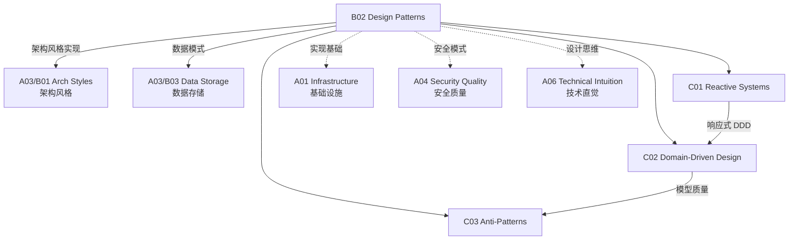

# B02 Design Patterns

**所属领域**: [A03_Design_Architecture](../readme.md)
**创建日期**: 2026-01-30
**最后更新**: 2026-01-30

## 📋 子领域定位

设计模式是解决软件设计常见问题的可复用方案，是工程师共享的通用语言。从 GoF 的经典设计模式到现代的云原生模式，设计模式帮助团队构建可维护、可扩展的系统。

本领域涵盖三大核心方向：响应式系统（Reactive Systems）、领域驱动设计（DDD）和反模式分析。现代分布式系统需要响应式架构来应对高并发和故障恢复，需要 DDD 来管理复杂业务领域，也需要识别和避免常见的架构反模式。

**核心关注点**：
- **响应式系统**: 响应性、弹性、弹性、消息驱动
- **领域驱动设计**: 限界上下文、聚合、领域事件、CQRS
- **反模式**: 大泥球、上帝对象、 spaghetti 代码识别与重构

## 🗂️ 专项列表

### [C01. Reactive_Systems](C01_Reactive_Systems/README.md)

响应式系统提供及时响应、弹性恢复和弹性扩展的能力。本专项详解响应式宣言四大特性（Responsive、Resilient、Elastic、Message Driven）、背压机制、响应式流规范（Reactive Streams）、以及响应式编程框架（Project Reactor、RxJava、Akka）。涵盖断路器模式、舱壁模式、重试和超时策略。

### [C02. Domain-Driven_Design](C02_Domain_Driven_Design/README.md)

领域驱动设计通过深入理解业务领域来指导软件设计。本专项深入战略设计（限界上下文、上下文映射、子域划分）和战术设计（实体、值对象、聚合、领域服务、领域事件）。涵盖 DDD 在微服务架构中的应用、事件风暴工作坊和领域模型演进。

### [C03. Anti-Patterns](C03_Anti-Patterns/README.md)

反模式是常见但低效的设计实践，识别它们是改进系统质量的第一步。本专项覆盖架构反模式（大泥球、 vendor 锁定、金锤）、设计反模式（上帝类、 spaghetti 继承、贫血领域模型）和组织反模式（烟囱系统、委员会设计）。涵盖反模式检测工具、重构策略和技术债务量化。

## 🛠️ 技术栈概览

### 响应式框架

| 框架 | 语言 | 特点 | 官网 |
|------|------|------|------|
| **Project Reactor** | Java | Spring 生态集成 | https://projectreactor.io |
| **Akka** | Java/Scala | Actor 模型 | https://akka.io |
| **RxJava** | Java | 响应式扩展 | https://github.com/ReactiveX/RxJava |
| **Vert.x** | 多语言 | 事件驱动工具包 | https://vertx.io |
| **Node.js Streams** | JavaScript | 内置响应式 | https://nodejs.org |

### DDD 工具

| 工具 | 用途 | 官网 |
|------|------|------|
| **EventStorming** | 领域发现工作坊 | https://www.eventstorming.com |
| **Context Mapper** | DDD 建模工具 | https://contextmapper.org |
| **ArchUnit** | 架构测试 | https://www.archunit.org |
| **jMolecules** | DDD 注解库 | https://github.com/xmolecules/jmolecules |

### 反模式检测

| 工具 | 功能 | 官网 |
|------|------|------|
| **SonarQube** | 代码异味检测 | https://www.sonarqube.org |
| **ArchUnit** | 架构规则测试 | https://www.archunit.org |
| **Structure101** | 架构可视化 | https://structure101.com |
| **NDepend** | .NET 架构分析 | https://www.ndepend.com |

## 💼 实践案例索引

### 案例 1: 响应式电商系统

**架构设计**:
```
┌─────────────────────────────────────────────────────────────┐
│                     响应式电商系统                           │
├─────────────────────────────────────────────────────────────┤
│  前端层                                                      │
│  ┌─────────────────────────────────────────────────────┐   │
│  │  React/Vue + RxJS (响应式状态管理)                    │   │
│  │  - 实时库存更新                                       │   │
│  │  - 响应式表单验证                                     │   │
│  └─────────────────────────────────────────────────────┘   │
├─────────────────────────────────────────────────────────────┤
│  API 网关层                                                  │
│  ┌─────────────────────────────────────────────────────┐   │
│  │  Spring Cloud Gateway (响应式)                       │   │
│  │  - 限流与熔断                                         │   │
│  │  - 背压控制                                           │   │
│  └─────────────────────────────────────────────────────┘   │
├─────────────────────────────────────────────────────────────┤
│  服务层 (Project Reactor)                                    │
│  ┌─────────────┐ ┌─────────────┐ ┌─────────────┐           │
│  │  商品服务    │ │  订单服务    │ │  库存服务    │           │
│  │ Mono/Flux   │ │ Mono/Flux   │ │ Mono/Flux   │           │
│  └─────────────┘ └─────────────┘ └─────────────┘           │
└─────────────────────────────────────────────────────────────┘
```

**背压处理**:
```java
// 生产者控制速率
Flux.range(1, 1000)
    .onBackpressureBuffer(100)  // 缓冲 100 个元素
    .delayElements(Duration.ofMillis(10))
    .subscribe();

// 消费者请求控制
Flux.range(1, 1000)
    .subscribe(new BaseSubscriber<Integer>() {
        @Override
        protected void hookOnSubscribe(Subscription subscription) {
            request(10);  // 初始请求 10 个
        }
        
        @Override
        protected void hookOnNext(Integer value) {
            process(value);
            if (readyForMore()) {
                request(10);  // 处理完再请求
            }
        }
    });
```

### 案例 2: DDD 领域建模

**限界上下文映射**:
```
┌─────────────────────────────────────────────────────────────┐
│                    电商领域上下文映射                         │
├─────────────────────────────────────────────────────────────┤
                                                              
┌──────────────┐      客户/供应商       ┌──────────────┐
│   订单上下文   │◄─────────────────────►│   客户上下文   │
│  Order BC    │      Customer/Supplier │  Customer BC │
└──────┬───────┘                        └──────────────┘
       │
       │ 订单项包含商品ID
       ▼
┌──────────────┐      发布/订阅          ┌──────────────┐
│   商品上下文   │◄─────────────────────►│   库存上下文   │
│  Product BC  │   ProductUpdated Event │ Inventory BC │
└──────────────┘                        └──────────────┘
```

**聚合设计**:
```java
// 订单聚合根
@Entity
public class Order extends AggregateRoot<OrderId> {
    
    private OrderId id;
    private CustomerId customerId;
    private OrderStatus status;
    private List<OrderItem> items;  // 内部实体
    private Money totalAmount;      // 值对象
    
    // 业务方法
    public void addItem(Product product, int quantity) {
        if (status != OrderStatus.DRAFT) {
            throw new IllegalStateException("Cannot modify submitted order");
        }
        items.add(new OrderItem(product.getId(), quantity, product.getPrice()));
        recalculateTotal();
        registerEvent(new OrderItemAddedEvent(id, product.getId(), quantity));
    }
    
    public void submit() {
        if (items.isEmpty()) {
            throw new IllegalStateException("Cannot submit empty order");
        }
        this.status = OrderStatus.SUBMITTED;
        registerEvent(new OrderSubmittedEvent(id, customerId, totalAmount));
    }
}
```

### 案例 3: 反模式识别与重构

**大泥球检测**:
```bash
# 使用 SonarQube 检测代码异味
sonar-scanner \
  -Dsonar.projectKey=big-ball-of-mud \
  -Dsonar.sources=src \
  -Dsonar.java.binaries=target/classes
```

**关键指标**:
| 指标 | 健康范围 | 警告阈值 | 危险阈值 |
|------|----------|----------|----------|
| 圈复杂度 | < 10 | 10-20 | > 20 |
| 类行数 | < 300 | 300-500 | > 500 |
| 方法行数 | < 30 | 30-50 | > 50 |
| 传入依赖 | < 20 | 20-50 | > 50 |
| 传出依赖 | < 20 | 20-50 | > 50 |

**重构前后对比**:
```
重构前: 上帝类
┌─────────────────────────────────┐
│         OrderManager            │
│  - createOrder()                │
│  - cancelOrder()                │
│  - processPayment()             │
│  - updateInventory()            │
│  - sendNotification()           │
│  - generateInvoice()            │
│  - calculateShipping()          │
│  ... (50+ 方法)                 │
└─────────────────────────────────┘

重构后: 职责分离
┌─────────────┐ ┌─────────────┐ ┌─────────────┐
│ OrderService│ │PaymentService│ │InventorySvc │
├─────────────┤ ├─────────────┤ ├─────────────┤
│createOrder()│ │processPayment│ │updateStock()│
│cancelOrder()│ │refund()      │ │checkStock() │
└─────────────┘ └─────────────┘ └─────────────┘
```

## 🔗 知识关联图谱



## 📖 学习资源

### 推荐书籍

| 书名 | 作者 | 说明 |
|------|------|------|
| 《Design Patterns》 | GoF | 设计模式圣经 |
| 《Domain-Driven Design》 | Eric Evans | DDD 奠基之作 |
| 《Implementing DDD》 | Vaughn Vernon | DDD 实践指南 |
| 《Reactive Design Patterns》 | Roland Kuhn | 响应式模式 |
| 《Refactoring》 | Martin Fowler | 重构改善代码 |

### 在线资源

| 资源 | 链接 | 说明 |
|------|------|------|
| Refactoring Guru | https://refactoring.guru/design-patterns | 设计模式详解 |
| DDD Community | https://dddcommunity.org | DDD 社区 |
| Reactive Manifesto | https://www.reactivemanifesto.org | 响应式宣言 |
| Martin Fowler 博客 | https://martinfowler.com | 模式与架构 |

### 开源项目

| 项目 | GitHub | 说明 |
|------|--------|------|
| Project Reactor | https://github.com/reactor/reactor-core | 响应式框架 |
| Akka | https://github.com/akka/akka | Actor 框架 |
| jMolecules | https://github.com/xmolecules/jmolecules | DDD 注解 |
| ArchUnit | https://github.com/TNG/ArchUnit | 架构测试 |

## 🔄 维护说明

- **内容审查**: 每半年更新模式目录和最佳实践
- **更新机制**: 跟踪模式社区和框架演进
- **质量标准**: 所有模式示例需经过代码验证
- **贡献方式**: 欢迎提交模式应用案例和反模式识别经验
