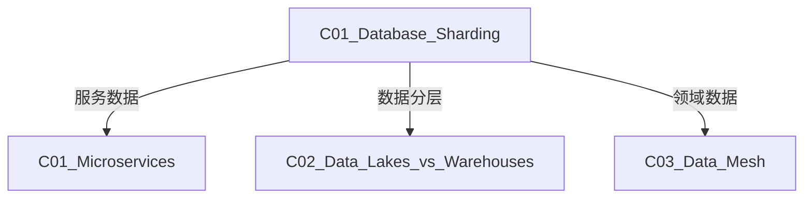

# C01 Database Sharding - 数据库分片

**领域**: A03_Design_Architecture/B03_Data_Storage  
**创建日期**: 2026-01-30  
**最后更新**: 2026-01-30

---

## 1. 主题定位

### 1.1 定义与本质

数据库分片（Database Sharding）是一种水平扩展技术，将大型数据库拆分为更小、更易管理的部分（称为分片），分布在多台服务器上。每个分片包含数据的子集，所有分片共同构成完整的数据集。

分片技术源于对大规模互联网应用的需求，最早由Google的Bigtable论文（2006）和Amazon的Dynamo论文（2007）系统化阐述。

### 1.2 为什么需要分片

```
单库瓶颈示意图:

用户数增长:    1K ──► 10K ──► 100K ──► 1M ──► 10M
                │      │        │        │       │
                ▼      ▼        ▼        ▼       ▼
存储:         10GB   100GB     1TB      10TB    100TB
QPS:          100    1K       10K      100K    1M
连接数:        50     100      200      500     超过限制

单库极限:
┌─────────────────────────────────────────────────────┐
│  MySQL单库极限                                      │
│  • 存储: ~1TB (InnoDB)                              │
│  • QPS: ~10K (简单查询)                             │
│  • 连接数: ~10K                                     │
│  • 表大小: 数千万行后性能下降                         │
└─────────────────────────────────────────────────────┘

分片解决方案:
┌─────────────────────────────────────────────────────┐
│  10个分片                                           │
│  • 每片100GB，总1TB                                 │
│  • 每片承载100K QPS，总1M QPS                      │
│  • 每片1000连接，理论上可水平扩展                   │
└─────────────────────────────────────────────────────┘
```

### 1.3 分片 vs 其他扩展方案

| 方案 | 扩展方向 | 复杂度 | 适用场景 | 限制 |
|------|---------|--------|----------|------|
| **垂直扩展** | 单机硬件 | 低 | 数据量<1TB | 成本高，有上限 |
| **读写分离** | 读能力 | 中 | 读多写少 | 数据一致性问题 |
| **分库分表** | 单机多实例 | 中 | 多业务隔离 | 单表仍受限 |
| **分片(Sharding)** | 水平扩展 | 高 | 超大规模 | 跨分片查询复杂 |
| **NewSQL** | 水平扩展 | 中 | 需要ACID | 生态相对年轻 |

---

## 2. 核心概念

### 2.1 分片策略

#### 2.1.1 哈希分片 (Hash Sharding)

```
哈希分片原理:

┌─────────────────────────────────────────────────────────────────┐
│                      哈希分片算法                                │
├─────────────────────────────────────────────────────────────────┤
│                                                                 │
│  shard_id = hash(shard_key) % num_shards                       │
│                                                                 │
│  示例: user_id = 12345                                          │
│  hash(12345) = 987654321                                        │
│  987654321 % 4 = 1                                              │
│  → 存储到Shard 1                                                │
│                                                                 │
│  ┌─────────┐                                                    │
│  │  User   │                                                    │
│  │   ID    │                                                    │
│  └────┬────┘                                                    │
│       │                                                         │
│       ▼                                                         │
│  ┌─────────────────────────────────────────────┐               │
│  │            哈希函数 (如MurmurHash)           │               │
│  └─────────────────────────────────────────────┘               │
│       │                                                         │
│       ▼                                                         │
│  ┌───────────────────────────────────────────────────────────┐ │
│  │  Shard 0    │  Shard 1    │  Shard 2    │  Shard 3       │ │
│  │  hash%4=0   │  hash%4=1   │  hash%4=2   │  hash%4=3      │ │
│  └───────────────────────────────────────────────────────────┘ │
│                                                                 │
│  ✅ 优点: 数据分布均匀                                            │
│  ❌ 缺点: 扩容需要迁移数据                                        │
│                                                                 │
└─────────────────────────────────────────────────────────────────┘
```

#### 2.1.2 范围分片 (Range Sharding)

```
范围分片原理:

┌─────────────────────────────────────────────────────────────────┐
│                      范围分片算法                                │
├─────────────────────────────────────────────────────────────────┤
│                                                                 │
│  按时间范围:                                                     │
│  ┌──────────┬──────────┬──────────┬──────────┐                 │
│  │Shard 0   │Shard 1   │Shard 2   │Shard 3   │                 │
│  │2024-01   │2024-02   │2024-03   │2024-04   │                 │
│  └──────────┴──────────┴──────────┴──────────┘                 │
│                                                                 │
│  按ID范围:                                                       │
│  ┌──────────┬──────────┬──────────┬──────────┐                 │
│  │Shard 0   │Shard 1   │Shard 2   │Shard 3   │                 │
│  │1-1M      │1M-2M     │2M-3M     │3M-4M     │                 │
│  └──────────┴──────────┴──────────┴──────────┘                 │
│                                                                 │
│  ✅ 优点: 支持范围查询，扩容简单                                   │
│  ❌ 缺点: 可能存在热点（如最新数据）                              │
│                                                                 │
│  热点解决方案:                                                   │
│  ┌──────────┬──────────┬──────────┬──────────┐                 │
│  │Shard 0   │Shard 1   │Shard 2   │Shard 3   │                 │
│  │历史数据  │历史数据  │历史数据  │当前数据  │                 │
│  │(只读)    │(只读)    │(只读)    │(读写)    │                 │
│  └──────────┴──────────┴──────────┴──────────┘                 │
│                                                                 │
└─────────────────────────────────────────────────────────────────┘
```

#### 2.1.3 列表分片 (List Sharding)

```
列表分片原理:

按地理位置分片:
┌─────────────────────────────────────────────────────────────────┐
│                                                                 │
│  ┌───────────────────────────────────────────────────────────┐ │
│  │  Shard CN   │  Shard US   │  Shard EU   │  Shard APAC   │ │
│  │  (中国区)   │  (美国区)   │  (欧洲区)   │  (亚太区)     │ │
│  │             │             │             │               │ │
│  │ • 北京      │ • 纽约      │ • 伦敦      │ • 东京       │ │
│  │ • 上海      │ • 洛杉矶    │ • 巴黎      │ • 新加坡     │ │
│  │ • 广州      │ • 芝加哥    │ • 柏林      │ • 悉尼       │ │
│  └───────────────────────────────────────────────────────────┘ │
│                                                                 │
│  适用场景: 数据主权、合规要求、就近访问                            │
│                                                                 │
└─────────────────────────────────────────────────────────────────┘
```

### 2.2 分片架构

```
┌─────────────────────────────────────────────────────────────────┐
│                    分片系统架构                                  │
├─────────────────────────────────────────────────────────────────┤
│                                                                 │
│  ┌─────────────────────────────────────────────────────────┐   │
│  │                    应用层 (Application)                  │   │
│  │                    业务代码/ORM                         │   │
│  └─────────────────────────────────────────────────────────┘   │
│                              │                                  │
│                              ▼                                  │
│  ┌─────────────────────────────────────────────────────────┐   │
│  │                  分片中间件层                            │   │
│  │  ┌─────────────┐  ┌─────────────┐  ┌─────────────┐     │   │
│  │  │  SQL解析器   │  │ 路由引擎    │  │  结果合并   │     │   │
│  │  │  Parser     │──►│  Router    │──►│  Merger    │     │   │
│  │  └─────────────┘  └─────────────┘  └─────────────┘     │   │
│  │                                                         │   │
│  │  ┌─────────────┐  ┌─────────────┐  ┌─────────────┐     │   │
│  │  │ 分布式事务  │  │  主从切换   │  │  读写分离   │     │   │
│  │  │  Manager    │  │  Failover  │  │  RW Split   │     │   │
│  │  └─────────────┘  └─────────────┘  └─────────────┘     │   │
│  └─────────────────────────────────────────────────────────┘   │
│                              │                                  │
│           ┌──────────────────┼──────────────────┐              │
│           ▼                  ▼                  ▼              │
│  ┌─────────────┐    ┌─────────────┐    ┌─────────────┐        │
│  │  Shard 0    │    │  Shard 1    │    │  Shard 2    │        │
│  │  ┌───────┐  │    │  ┌───────┐  │    │  ┌───────┐  │        │
│  │  │Primary│  │    │  │Primary│  │    │  │Primary│  │        │
│  │  └───┬───┘  │    │  └───┬───┘  │    │  └───┬───┘  │        │
│  │      │      │    │      │      │    │      │      │        │
│  │  ┌───┴───┐  │    │  ┌───┴───┐  │    │  ┌───┴───┐  │        │
│  │  │Replica│  │    │  │Replica│  │    │  │Replica│  │        │
│  │  └───────┘  │    │  └───────┘  │    │  └───────┘  │        │
│  └─────────────┘    └─────────────┘    └─────────────┘        │
│                                                                 │
│  路由示例:                                                       │
│  SELECT * FROM user WHERE user_id = 12345                       │
│                    │                                            │
│                    ▼                                            │
│          hash(12345) % 3 = 1                                    │
│                    │                                            │
│                    ▼                                            │
│           路由到 Shard 1                                        │
│                                                                 │
└─────────────────────────────────────────────────────────────────┘
```

---

## 3. 技术实践

### 3.1 ShardingSphere分片实现 (Java)

```java
// ShardingConfiguration.java
package com.example.sharding;

import org.apache.shardingsphere.driver.api.ShardingSphereDataSourceFactory;
import org.apache.shardingsphere.infra.config.algorithm.ShardingSphereAlgorithmConfiguration;
import org.apache.shardingsphere.sharding.api.config.ShardingRuleConfiguration;
import org.apache.shardingsphere.sharding.api.config.rule.ShardingTableRuleConfiguration;
import org.apache.shardingsphere.sharding.api.config.strategy.keygen.KeyGenerateStrategyConfiguration;
import org.apache.shardingsphere.sharding.api.config.strategy.sharding.StandardShardingStrategyConfiguration;
import org.springframework.context.annotation.Bean;
import org.springframework.context.annotation.Configuration;

import javax.sql.DataSource;
import java.sql.SQLException;
import java.util.*;

/**
 * ShardingSphere分片配置
 */
@Configuration
public class ShardingConfiguration {
    
    /**
     * 创建分片数据源
     */
    @Bean
    public DataSource shardingDataSource() throws SQLException {
        // 1. 配置真实数据源
        Map<String, DataSource> dataSourceMap = createDataSourceMap();
        
        // 2. 配置分片规则
        ShardingRuleConfiguration shardingRuleConfig = new ShardingRuleConfiguration();
        
        // 3. 配置用户表分片规则
        shardingRuleConfig.getTables().add(createUserTableRule());
        
        // 4. 配置订单表分片规则
        shardingRuleConfig.getTables().add(createOrderTableRule());
        
        // 5. 配置绑定表（避免笛卡尔积）
        shardingRuleConfig.getBindingTableGroups().add("user, order");
        
        // 6. 配置广播表（每个分片都有全量数据）
        shardingRuleConfig.getBroadcastTables().add("config");
        
        // 7. 配置默认分库策略
        shardingRuleConfig.setDefaultDatabaseShardingStrategy(
            new StandardShardingStrategyConfiguration("user_id", "database-inline")
        );
        
        // 8. 配置默认分表策略
        shardingRuleConfig.setDefaultTableShardingStrategy(
            new StandardShardingStrategyConfiguration("user_id", "table-inline")
        );
        
        // 9. 配置分布式主键生成
        Properties snowflakeProps = new Properties();
        snowflakeProps.setProperty("worker-id", "1");
        shardingRuleConfig.getKeyGenerators().put("snowflake", 
            new ShardingSphereAlgorithmConfiguration("SNOWFLAKE", snowflakeProps));
        
        // 10. 配置算法
        Properties dbAlgorithmProps = new Properties();
        dbAlgorithmProps.setProperty("algorithm-expression", "ds_${user_id % 2}");
        shardingRuleConfig.getShardingAlgorithms().put("database-inline",
            new ShardingSphereAlgorithmConfiguration("INLINE", dbAlgorithmProps));
        
        Properties tableAlgorithmProps = new Properties();
        tableAlgorithmProps.setProperty("algorithm-expression", "user_${user_id % 4}");
        shardingRuleConfig.getShardingAlgorithms().put("table-inline",
            new ShardingSphereAlgorithmConfiguration("INLINE", tableAlgorithmProps));
        
        // 11. 创建数据源
        Properties props = new Properties();
        props.setProperty("sql-show", "true");
        
        return ShardingSphereDataSourceFactory.createDataSource(
            dataSourceMap, 
            Collections.singletonList(shardingRuleConfig), 
            props
        );
    }
    
    /**
     * 用户表分片规则
     */
    private ShardingTableRuleConfiguration createUserTableRule() {
        // actual-data-nodes: ds_${0..1}.user_${0..3}
        // 表示: ds_0.user_0, ds_0.user_1, ds_0.user_2, ds_0.user_3
        //       ds_1.user_0, ds_1.user_1, ds_1.user_2, ds_1.user_3
        ShardingTableRuleConfiguration ruleConfig = new ShardingTableRuleConfiguration(
            "user", 
            "ds_${0..1}.user_${0..3}"
        );
        
        // 配置主键生成策略
        ruleConfig.setKeyGenerateStrategy(
            new KeyGenerateStrategyConfiguration("user_id", "snowflake")
        );
        
        return ruleConfig;
    }
    
    /**
     * 订单表分片规则
     */
    private ShardingTableRuleConfiguration createOrderTableRule() {
        ShardingTableRuleConfiguration ruleConfig = new ShardingTableRuleConfiguration(
            "order",
            "ds_${0..1}.order_${0..3}"
        );
        
        // 订单表使用订单ID分片，但绑定到用户表
        ruleConfig.setKeyGenerateStrategy(
            new KeyGenerateStrategyConfiguration("order_id", "snowflake")
        );
        
        return ruleConfig;
    }
    
    /**
     * 创建数据源映射
     */
    private Map<String, DataSource> createDataSourceMap() {
        Map<String, DataSource> dataSourceMap = new HashMap<>();
        
        // 主库0
        dataSourceMap.put("ds_0_master", createDataSource(
            "jdbc:mysql://master0:3306/db0",
            "user", "password"
        ));
        
        // 从库0
        dataSourceMap.put("ds_0_slave", createDataSource(
            "jdbc:mysql://slave0:3306/db0",
            "user", "password"
        ));
        
        // 主库1
        dataSourceMap.put("ds_1_master", createDataSource(
            "jdbc:mysql://master1:3306/db1",
            "user", "password"
        ));
        
        // 从库1
        dataSourceMap.put("ds_1_slave", createDataSource(
            "jdbc:mysql://slave1:3306/db1",
            "user", "password"
        ));
        
        return dataSourceMap;
    }
    
    private DataSource createDataSource(String url, String username, String password) {
        HikariConfig config = new HikariConfig();
        config.setJdbcUrl(url);
        config.setUsername(username);
        config.setPassword(password);
        config.setMaximumPoolSize(20);
        config.setMinimumIdle(5);
        return new HikariDataSource(config);
    }
}

// ========== 自定义分片算法 ==========

/**
 * 自定义复合分片算法
 * 根据时间和用户ID组合分片
 */
public class CompositeShardingAlgorithm implements 
    StandardShardingAlgorithm<Comparable<?>>,
    ComplexKeysShardingAlgorithm<Comparable<?>> {
    
    @Override
    public String doSharding(
        Collection<String> availableTargetNames,
        PreciseShardingValue<Comparable<?>> shardingValue
    ) {
        Long userId = (Long) shardingValue.getValue();
        
        // 使用一致性哈希
        int shardIndex = consistentHash(userId, availableTargetNames.size());
        
        return new ArrayList<>(availableTargetNames).get(shardIndex);
    }
    
    @Override
    public Collection<String> doSharding(
        Collection<String> availableTargetNames,
        RangeShardingValue<Comparable<?>> shardingValue
    ) {
        // 范围查询需要扫描所有分片
        return availableTargetNames;
    }
    
    @Override
    public Collection<String> doSharding(
        Collection<String> availableTargetNames,
        ComplexKeysShardingValue<Comparable<?>> shardingValue
    ) {
        // 复合键分片逻辑
        Map<String, Collection<Comparable<?>>> columnNameAndShardingValuesMap = 
            shardingValue.getColumnNameAndShardingValuesMap();
        
        Long userId = (Long) columnNameAndShardingValuesMap.get("user_id").iterator().next();
        String createTime = (String) columnNameAndShardingValuesMap.get("create_time").iterator().next();
        
        // 先按时间范围筛选
        List<String> timeMatchedShards = filterByTime(availableTargetNames, createTime);
        
        // 再按用户ID哈希
        int shardIndex = consistentHash(userId, timeMatchedShards.size());
        
        return Collections.singletonList(timeMatchedShards.get(shardIndex));
    }
    
    /**
     * 一致性哈希算法
     */
    private int consistentHash(Long key, int bucketCount) {
        // 使用MurmurHash
        int hash = Hashing.murmur3_32().hashLong(key).asInt();
        return Math.abs(hash) % bucketCount;
    }
    
    private List<String> filterByTime(Collection<String> shards, String createTime) {
        // 根据时间范围筛选分片
        // 例如: 2024-01的数据在shard_0, 2024-02在shard_1
        return new ArrayList<>(shards);
    }
    
    @Override
    public String getType() {
        return "COMPOSITE";
    }
    
    @Override
    public void init(Properties props) {
        // 初始化配置
    }
}
```

### 3.2 分片数据访问层

```java
// ShardedUserRepository.java
package com.example.sharding.repository;

import org.apache.shardingsphere.api.hint.HintManager;
import org.springframework.jdbc.core.JdbcTemplate;
import org.springframework.jdbc.core.RowMapper;
import org.springframework.stereotype.Repository;

import javax.sql.DataSource;
import java.sql.ResultSet;
import java.sql.SQLException;
import java.util.List;

/**
 * 分片用户仓库
 */
@Repository
public class ShardedUserRepository {
    
    private final JdbcTemplate jdbcTemplate;
    
    public ShardedUserRepository(DataSource dataSource) {
        this.jdbcTemplate = new JdbcTemplate(dataSource);
    }
    
    /**
     * 根据ID查询用户（自动路由）
     */
    public User findById(Long userId) {
        String sql = "SELECT * FROM user WHERE user_id = ?";
        return jdbcTemplate.queryForObject(sql, new UserRowMapper(), userId);
    }
    
    /**
     * 强制路由到指定分片
     */
    public User findByIdWithHint(Long userId, String targetShard) {
        try (HintManager hintManager = HintManager.getInstance()) {
            // 强制指定数据库分片
            hintManager.setDatabaseShardingValue(targetShard);
            
            // 强制指定表分片
            hintManager.addTableShardingValue("user", targetShard);
            
            String sql = "SELECT * FROM user WHERE user_id = ?";
            return jdbcTemplate.queryForObject(sql, new UserRowMapper(), userId);
        }
    }
    
    /**
     * 插入用户（自动生成ID并路由）
     */
    public void insert(User user) {
        String sql = "INSERT INTO user (user_id, username, email, created_at) VALUES (?, ?, ?, ?)";
        jdbcTemplate.update(sql,
            user.getUserId(),
            user.getUsername(),
            user.getEmail(),
            user.getCreatedAt()
        );
    }
    
    /**
     * 跨分片查询 - 全表扫描
     */
    public List<User> findAll() {
        String sql = "SELECT * FROM user";
        return jdbcTemplate.query(sql, new UserRowMapper());
    }
    
    /**
     * 分页查询 - 内存归并
     */
    public List<User> findByPage(int pageNum, int pageSize) {
        int offset = (pageNum - 1) * pageSize;
        String sql = "SELECT * FROM user ORDER BY user_id LIMIT ? OFFSET ?";
        return jdbcTemplate.query(sql, new UserRowMapper(), pageSize, offset);
    }
    
    /**
     * 聚合查询 - 归并结果
     */
    public long count() {
        String sql = "SELECT COUNT(*) FROM user";
        Long count = jdbcTemplate.queryForObject(sql, Long.class);
        return count != null ? count : 0;
    }
    
    /**
     * 分组聚合查询
     */
    public List<UserStats> countByStatus() {
        String sql = "SELECT status, COUNT(*) as count FROM user GROUP BY status";
        return jdbcTemplate.query(sql, (rs, rowNum) -> new UserStats(
            rs.getString("status"),
            rs.getLong("count")
        ));
    }
    
    private static class UserRowMapper implements RowMapper<User> {
        @Override
        public User mapRow(ResultSet rs, int rowNum) throws SQLException {
            return User.builder()
                .userId(rs.getLong("user_id"))
                .username(rs.getString("username"))
                .email(rs.getString("email"))
                .createdAt(rs.getTimestamp("created_at").toLocalDateTime())
                .build();
        }
    }
}
```

### 3.3 分片扩容工具

```python
# sharding_migration.py
"""
分片数据迁移工具
支持平滑扩容（一致性哈希）
"""

import hashlib
import json
from typing import List, Dict, Set, Tuple
from dataclasses import dataclass
import mysql.connector
from concurrent.futures import ThreadPoolExecutor
import logging

logging.basicConfig(level=logging.INFO)
logger = logging.getLogger(__name__)


@dataclass
class ShardConfig:
    shard_id: int
    host: str
    port: int
    database: str
    username: str
    password: str
    weight: int = 1
    
    def get_connection(self):
        return mysql.connector.connect(
            host=self.host,
            port=self.port,
            database=self.database,
            user=self.username,
            password=self.password
        )


class ConsistentHashRing:
    """一致性哈希环"""
    
    def __init__(self, replicas: int = 150):
        self.replicas = replicas
        self.ring: Dict[int, int] = {}  # hash -> shard_id
        self.sorted_keys: List[int] = []
        self.shards: Dict[int, ShardConfig] = {}
    
    def add_shard(self, shard: ShardConfig):
        """添加分片到哈希环"""
        self.shards[shard.shard_id] = shard
        
        for i in range(shard.weight * self.replicas):
            key = self._hash(f"{shard.shard_id}:{i}")
            self.ring[key] = shard.shard_id
        
        self.sorted_keys = sorted(self.ring.keys())
        logger.info(f"Added shard {shard.shard_id} to ring")
    
    def remove_shard(self, shard_id: int):
        """从哈希环移除分片"""
        if shard_id not in self.shards:
            return
        
        shard = self.shards[shard_id]
        for i in range(shard.weight * self.replicas):
            key = self._hash(f"{shard_id}:{i}")
            del self.ring[key]
        
        del self.shards[shard_id]
        self.sorted_keys = sorted(self.ring.keys())
        logger.info(f"Removed shard {shard_id} from ring")
    
    def get_shard(self, key: str) -> int:
        """获取key对应的分片"""
        if not self.ring:
            return -1
        
        hash_key = self._hash(key)
        
        # 二分查找
        idx = self._bisect_right(self.sorted_keys, hash_key)
        if idx == len(self.sorted_keys):
            idx = 0
        
        return self.ring[self.sorted_keys[idx]]
    
    def get_migrated_keys(self, old_ring: 'ConsistentHashRing') -> List[Tuple[str, int, int]]:
        """获取需要迁移的key列表"""
        migrated = []
        
        # 模拟所有可能的key（实际应从数据库读取）
        # 这里简化为检查虚拟节点
        for virtual_key, old_shard in old_ring.ring.items():
            new_shard = self.get_shard(str(virtual_key))
            if old_shard != new_shard:
                migrated.append((str(virtual_key), old_shard, new_shard))
        
        return migrated
    
    def _hash(self, key: str) -> int:
        """计算哈希值"""
        return int(hashlib.md5(key.encode()).hexdigest(), 16)
    
    def _bisect_right(self, arr: List[int], x: int) -> int:
        """二分查找"""
        left, right = 0, len(arr)
        while left < right:
            mid = (left + right) // 2
            if arr[mid] <= x:
                left = mid + 1
            else:
                right = mid
        return left


class ShardingMigrationTool:
    """分片迁移工具"""
    
    def __init__(self, old_shards: List[ShardConfig], new_shards: List[ShardConfig]):
        self.old_ring = ConsistentHashRing()
        self.new_ring = ConsistentHashRing()
        
        for shard in old_shards:
            self.old_ring.add_shard(shard)
        
        for shard in new_shards:
            self.new_ring.add_shard(shard)
    
    def calculate_migration_plan(self) -> Dict:
        """计算迁移计划"""
        plan = {
            "source_shards": {},
            "total_records": 0,
            "migration_tasks": []
        }
        
        # 分析每个源分片需要迁移的数据
        for shard_id, shard in self.old_ring.shards.items():
            migrated_keys = self._get_keys_to_migrate(shard_id)
            
            plan["source_shards"][shard_id] = {
                "shard_info": {
                    "host": shard.host,
                    "database": shard.database
                },
                "keys_to_migrate": len(migrated_keys),
                "target_shards": list(set(target for _, target in migrated_keys))
            }
            plan["total_records"] += len(migrated_keys)
            
            # 按目标分片分组
            by_target: Dict[int, List[str]] = {}
            for key, target in migrated_keys:
                by_target.setdefault(target, []).append(key)
            
            for target_shard, keys in by_target.items():
                plan["migration_tasks"].append({
                    "source": shard_id,
                    "target": target_shard,
                    "key_count": len(keys),
                    "sample_keys": keys[:10]
                })
        
        return plan
    
    def _get_keys_to_migrate(self, source_shard_id: int) -> List[Tuple[str, int]]:
        """获取需要从源分片迁移的key"""
        migrated = []
        
        # 这里简化实现，实际应从数据库读取所有key
        # 并计算新旧哈希环的差异
        
        return migrated
    
    def execute_migration(
        self, 
        batch_size: int = 1000,
        parallel_workers: int = 4,
        dry_run: bool = True
    ):
        """执行迁移"""
        plan = self.calculate_migration_plan()
        
        logger.info(f"Migration Plan: {json.dumps(plan, indent=2)}")
        
        if dry_run:
            logger.info("DRY RUN - No actual migration performed")
            return
        
        # 执行迁移任务
        with ThreadPoolExecutor(max_workers=parallel_workers) as executor:
            futures = []
            
            for task in plan["migration_tasks"]:
                future = executor.submit(
                    self._migrate_shard_data,
                    task["source"],
                    task["target"],
                    batch_size
                )
                futures.append(future)
            
            # 等待所有任务完成
            for future in futures:
                future.result()
        
        logger.info("Migration completed")
    
    def _migrate_shard_data(self, source_id: int, target_id: int, batch_size: int):
        """迁移单个分片的数据"""
        source_shard = self.old_ring.shards[source_id]
        target_shard = self.new_ring.shards[target_id]
        
        logger.info(f"Migrating from shard {source_id} to {target_id}")
        
        # 连接源数据库
        source_conn = source_shard.get_connection()
        target_conn = target_shard.get_connection()
        
        try:
            # 读取需要迁移的数据
            cursor = source_conn.cursor(dictionary=True)
            cursor.execute("""
                SELECT * FROM user 
                WHERE MOD(user_id, %s) = %s
            """, (len(self.new_ring.shards), target_id))
            
            batch = []
            migrated = 0
            
            for row in cursor:
                # 验证新哈希环
                new_shard = self.new_ring.get_shard(str(row['user_id']))
                if new_shard != target_id:
                    continue
                
                batch.append(row)
                
                if len(batch) >= batch_size:
                    self._insert_batch(target_conn, batch)
                    migrated += len(batch)
                    batch = []
                    logger.info(f"Migrated {migrated} records...")
            
            # 处理剩余数据
            if batch:
                self._insert_batch(target_conn, batch)
                migrated += len(batch)
            
            logger.info(f"Completed migration: {migrated} records")
            
        finally:
            source_conn.close()
            target_conn.close()
    
    def _insert_batch(self, conn, batch: List[Dict]):
        """批量插入数据"""
        cursor = conn.cursor()
        
        sql = """
            INSERT INTO user (user_id, username, email, created_at)
            VALUES (%s, %s, %s, %s)
            ON DUPLICATE KEY UPDATE
            username = VALUES(username),
            email = VALUES(email)
        """
        
        data = [
            (row['user_id'], row['username'], row['email'], row['created_at'])
            for row in batch
        ]
        
        cursor.executemany(sql, data)
        conn.commit()
        cursor.close()


# 使用示例
def example_migration():
    """扩容示例: 从2分片扩容到4分片"""
    
    # 现有分片
    old_shards = [
        ShardConfig(0, "db0.example.com", 3306, "db0", "user", "pass"),
        ShardConfig(1, "db1.example.com", 3306, "db1", "user", "pass"),
    ]
    
    # 新增分片
    new_shards = [
        ShardConfig(0, "db0.example.com", 3306, "db0", "user", "pass"),
        ShardConfig(1, "db1.example.com", 3306, "db1", "user", "pass"),
        ShardConfig(2, "db2.example.com", 3306, "db2", "user", "pass"),
        ShardConfig(3, "db3.example.com", 3306, "db3", "user", "pass"),
    ]
    
    tool = ShardingMigrationTool(old_shards, new_shards)
    
    # 生成迁移计划
    plan = tool.calculate_migration_plan()
    print(json.dumps(plan, indent=2))
    
    # 执行迁移 (dry_run=False时真正执行)
    # tool.execute_migration(dry_run=True)


if __name__ == "__main__":
    example_migration()
```

---

## 4. 资源索引

### 4.1 学术论文

| 论文 | 作者 | 年份 | 贡献 |
|------|------|------|------|
| Bigtable: A Distributed Storage System | Google | 2006 | 早期分片实践 |
| Dynamo: Amazon's Highly Available Key-value Store | Amazon | 2007 | 一致性哈希 |
| Spanner: Google's Globally-Distributed Database | Google | 2012 | 全球分片 |
| CockroachDB: The Resilient Geo-Distributed SQL Database | Cockroach Labs | 2020 | NewSQL分片 |

### 4.2 开源工具

| 工具 | 语言 | 描述 |
|------|------|------|
| Apache ShardingSphere | Java | 综合分片解决方案 |
| Vitess | Go | YouTube开源的MySQL分片 |
| Citus | C | PostgreSQL分片扩展 |
| TiDB | Go | 分布式NewSQL数据库 |
| CockroachDB | Go | 全球分布式SQL数据库 |

---

## 5. 关联知识



---

## 6. 学习建议

### 6.1 学习路径

1. **基础**: 掌握单库优化和索引
2. **进阶**: 学习读写分离和复制
3. **高级**: 实现分片架构
4. **专家**: 设计自动扩缩容

### 6.2 推荐书单

| 书名 | 作者 | 优先级 |
|------|------|--------|
| 《高性能MySQL》 | Baron Schwartz | ⭐⭐⭐⭐⭐ |
| 《数据密集型应用设计》 | Martin Kleppmann | ⭐⭐⭐⭐⭐ |

---

## 7. 附录

### 7.1 版本历史

| 版本 | 日期 | 变更内容 |
|------|------|----------|
| 1.0.0 | 2026-01-30 | 初始版本 |

---

> **文档维护**: 本知识库遵循持续更新原则。
