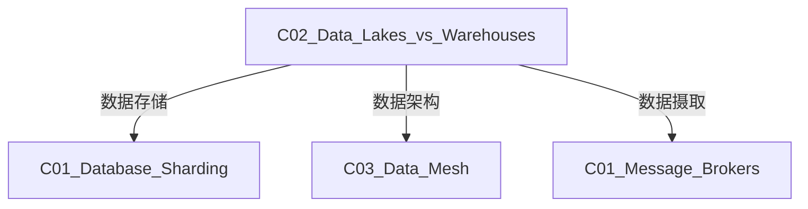

# C02 Data Lakes vs Warehouses - 数据湖与数仓

**领域**: A03_Design_Architecture/B03_Data_Storage  
**创建日期**: 2026-01-30  
**最后更新**: 2026-01-30

---

## 1. 主题定位

### 1.1 定义与本质

**数据仓库（Data Warehouse）**和**数据湖（Data Lake）**是两种主要的企业数据存储架构，服务于不同的分析需求。

**数据仓库**是一个面向主题的、集成的、相对稳定的、反映历史变化的数据集合，用于支持管理决策过程。概念由Bill Inmon于1990年代提出。

**数据湖**是一个以原始格式存储大量数据的存储库，可以存储结构化、半结构化和非结构化数据。概念由James Dixon于2010年提出。

### 1.2 核心区别

```
┌─────────────────────────────────────────────────────────────────┐
│              数据仓库 vs 数据湖 对比                             │
├─────────────────────────────────────────────────────────────────┤
│                                                                 │
│  维度          数据仓库                    数据湖                │
│  ─────────────────────────────────────────────────────────────  │
│                                                                 │
│  数据结构      结构化、模式预定义          原始格式、模式后置    │
│                Schema-on-Write             Schema-on-Read       │
│                                                                 │
│  数据类型      结构化数据                  结构化+半结构化+非结构│
│                                                                 │
│  用户          业务分析师                  数据科学家、工程师    │
│                                                                 │
│  查询类型      SQL、BI报表                 机器学习、数据探索    │
│                                                                 │
│  存储成本      较高                        较低                  │
│                                                                 │
│  数据质量      清洗后的高质量数据          原始数据，质量不一    │
│                                                                 │
│  敏捷性        变更困难                    灵活易变              │
│                                                                 │
│  扩展性        垂直扩展为主                水平扩展              │
│                                                                 │
└─────────────────────────────────────────────────────────────────┘
```

### 1.3 架构演进

```
数据架构演进:

1990s: 数据仓库 (Inmon/Kimball)
    ┌─────────────────────────────────────┐
    │  ETL → 关系型数仓 → BI工具          │
    │  Oracle/Teradata                    │
    └─────────────────────────────────────┘

2000s: Hadoop数据湖
    ┌─────────────────────────────────────┐
    │  原始数据 → HDFS → MapReduce/Spark  │
    │  结构化和非结构化混合                │
    └─────────────────────────────────────┘

2015s: 云数据湖
    ┌─────────────────────────────────────┐
    │  S3/Azure Data Lake → Spark/Presto  │
    │  存算分离                           │
    └─────────────────────────────────────┘

2020s: 湖仓一体 (Lakehouse)
    ┌─────────────────────────────────────┐
    │  Delta Lake/Iceberg/Hudi            │
    │  事务支持 + 开放格式 + 统一元数据     │
    └─────────────────────────────────────┘
```

---

## 2. 核心概念

### 2.1 数据仓库架构

```
┌─────────────────────────────────────────────────────────────────┐
│                    数据仓库架构 (Kimball)                        │
├─────────────────────────────────────────────────────────────────┤
│                                                                 │
│  ┌──────────────┐                                              │
│  │   数据源层    │                                              │
│  │  OLTP/ERP/CRM│                                              │
│  └──────┬───────┘                                              │
│         │                                                       │
│         ▼                                                       │
│  ┌───────────────────────────────────────────────────────────┐ │
│  │                      ETL层                                 │ │
│  │  ┌──────────┐  ┌──────────┐  ┌──────────────────────────┐ │ │
│  │  │ 抽取(Extract)│转换(Transform)│加载(Load)            │ │ │
│  │  │ • CDC      │  • 清洗     │  • 维度建模              │ │ │
│  │  │ • 批量     │  • 聚合     │  • 索引构建              │ │ │
│  │  │ • API      │  • 验证     │  • 分区策略              │ │ │
│  │  └──────────┘  └──────────┘  └──────────────────────────┘ │ │
│  └───────────────────────────────────────────────────────────┘ │
│         │                                                       │
│         ▼                                                       │
│  ┌───────────────────────────────────────────────────────────┐ │
│  │                  数据仓库层                                │ │
│  │                                                           │ │
│  │  ┌─────────┐        ┌─────────────┐                      │ │
│  │  │ 维度表  │◄──────►│  事实表     │                      │ │
│  │  │         │        │             │                      │ │
│  │  │• 时间   │        │• 销售事实  │                      │ │
│  │  │• 产品   │        │• 库存事实  │                      │ │
│  │  │• 客户   │        │• 订单事实  │                      │ │
│  │  │• 地区   │        │             │                      │ │
│  │  └─────────┘        └─────────────┘                      │ │
│  │                                                           │ │
│  │  星型模式 / 雪花模式                                       │ │
│  └───────────────────────────────────────────────────────────┘ │
│         │                                                       │
│         ▼                                                       │
│  ┌───────────────────────────────────────────────────────────┐ │
│  │                  数据集市层                                │ │
│  │  ┌─────────┐  ┌─────────┐  ┌─────────┐                   │ │
│  │  │ 销售DM  │  │ 库存DM  │  │ 财务DM  │                   │ │
│  │  └─────────┘  └─────────┘  └─────────┘                   │ │
│  └───────────────────────────────────────────────────────────┘ │
│         │                                                       │
│         ▼                                                       │
│  ┌───────────────────────────────────────────────────────────┐ │
│  │                  分析应用层                                │ │
│  │  ┌─────────┐  ┌─────────┐  ┌─────────┐  ┌─────────┐      │ │
│  │  │ BI报表  │  │ 仪表盘  │  │ 即席查询│  │ OLAP    │      │ │
│  │  └─────────┘  └─────────┘  └─────────┘  └─────────┘      │ │
│  └───────────────────────────────────────────────────────────┘ │
│                                                                 │
└─────────────────────────────────────────────────────────────────┘
```

### 2.2 数据湖架构

```
┌─────────────────────────────────────────────────────────────────┐
│                    数据湖分层架构 ( medallion )                  │
├─────────────────────────────────────────────────────────────────┤
│                                                                 │
│  ┌───────────────────────────────────────────────────────────┐ │
│  │                    Bronze (原始层)                         │ │
│  │                                                           │ │
│  │  特征:                                                     │ │
│  │  • 原始格式存储                                            │ │
│  │  • 不可变数据                                              │ │
│  │  • 全量历史数据                                            │ │
│  │  • 轻量Schema验证                                          │ │
│  │                                                           │ │
│  │  格式: JSON, CSV, Parquet, Avro, 日志, 图片, 视频        │ │
│  │                                                           │ │
│  └───────────────────────────────────────────────────────────┘ │
│         │                                                       │
│         ▼ ETL/ELT 清洗和转换                                     │
│  ┌───────────────────────────────────────────────────────────┐ │
│  │                    Silver (清洗层)                         │ │
│  │                                                           │ │
│  │  特征:                                                     │ │
│  │  • 清洗和验证后的数据                                       │ │
│  │  • 去重和规范化                                            │ │
│  │  • 轻量聚合                                                │ │
│  │  • Schema强制执行                                          │ │
│  │                                                           │ │
│  │  操作: 类型转换, 空值处理, 去重, 关联维度表                │ │
│  │                                                           │ │
│  └───────────────────────────────────────────────────────────┘ │
│         │                                                       │
│         ▼ 业务级转换和聚合                                        │
│  ┌───────────────────────────────────────────────────────────┐ │
│  │                    Gold (业务层)                           │ │
│  │                                                           │ │
│  │  特征:                                                     │ │
│  │  • 业务级聚合                                              │ │
│  │  • 优化查询性能                                            │ │
│  │  • 数据集市                                                │ │
│  │  • 权限控制                                                │ │
│  │                                                           │ │
│  │  示例: 日销售汇总, 客户360视图, 产品推荐特征               │ │
│  │                                                           │ │
│  └───────────────────────────────────────────────────────────┘ │
│                                                                 │
└─────────────────────────────────────────────────────────────────┘
```

### 2.3 湖仓一体 (Lakehouse)

```
┌─────────────────────────────────────────────────────────────────┐
│                    湖仓一体架构                                  │
├─────────────────────────────────────────────────────────────────┤
│                                                                 │
│  统一存储层:                                                     │
│  ┌───────────────────────────────────────────────────────────┐ │
│  │              对象存储 (S3/ADLS/GCS)                        │ │
│  │                                                           │ │
│  │  开放表格式: Parquet + 元数据层                           │ │
│  │  ┌─────────┐  ┌─────────┐  ┌─────────┐                   │ │
│  │  │DeltaLake│  │Iceberg  │  │  Hudi   │                   │ │
│  │  │         │  │         │  │         │                   │ │
│  │  │• ACID   │  │• ACID   │  │• ACID   │                   │ │
│  │  │• 时间旅行│  │• 分区演进│  │• 增量处理│                   │ │
│  │  │• Schema │  │• 隐藏分区│  │• 行级更新│                   │ │
│  │  │  约束   │  │         │  │         │                   │ │
│  │  └─────────┘  └─────────┘  └─────────┘                   │ │
│  └───────────────────────────────────────────────────────────┘ │
│         │                                                       │
│  ┌──────┴──────────────────────────────────────────────────┐   │
│  ▼                                                         ▼   │
│  ┌─────────────────┐                            ┌──────────────┐│
│  │  数据仓库工作负载 │                            │ 数据湖工作负载││
│  │                 │                            │              ││
│  │ • BI报表        │                            │ • 机器学习   ││
│  │ • SQL分析       │                            │ • 数据科学   ││
│  │ • 即席查询      │                            │ • 流处理     ││
│  │ • 数据治理      │                            │ • 数据探索   ││
│  └─────────────────┘                            └──────────────┘│
│                                                                 │
│  统一元数据层:                                                   │
│  ┌───────────────────────────────────────────────────────────┐ │
│  │  Unity Catalog / Apache Hive / AWS Glue                   │ │
│  │  • 统一表/列级权限                                         │ │
│  │  • 数据血缘追踪                                            │ │
│  │  • Schema管理                                             │ │
│  └───────────────────────────────────────────────────────────┘ │
│                                                                 │
└─────────────────────────────────────────────────────────────────┘
```

---

## 3. 技术实践

### 3.1 Delta Lake实现 (Python/PySpark)

```python
# delta_lake_operations.py
"""
Delta Lake数据湖操作示例
基于Apache Spark和Delta Lake
"""

from pyspark.sql import SparkSession
from pyspark.sql.functions import *
from delta import configure_spark_with_delta_pip
from delta.tables import DeltaTable
import pandas as pd


def create_spark_session(app_name: str = "DeltaLakeDemo") -> SparkSession:
    """创建配置Delta Lake的Spark会话"""
    builder = SparkSession.builder \
        .appName(app_name) \
        .config("spark.sql.extensions", "io.delta.sql.DeltaSparkSessionExtension") \
        .config("spark.sql.catalog.spark_catalog", "org.apache.spark.sql.delta.catalog.DeltaCatalog") \
        .config("spark.delta.logRetentionDuration", "interval 30 days") \
        .config("spark.delta.deletedFileRetentionDuration", "interval 7 days")
    
    return configure_spark_with_delta_pip(builder).getOrCreate()


class DeltaLakeManager:
    """Delta Lake数据湖管理器"""
    
    def __init__(self, spark: SparkSession, base_path: str = "/data/lake"):
        self.spark = spark
        self.base_path = base_path
    
    # ========== Bronze层操作 ==========
    
    def ingest_to_bronze(
        self,
        source_path: str,
        table_name: str,
        source_format: str = "json",
        mode: str = "append"
    ):
        """
        将原始数据摄入Bronze层
        
        特征:
        - 保留原始格式
        - 添加摄入元数据
        - 不修改数据结构
        """
        bronze_path = f"{self.base_path}/bronze/{table_name}"
        
        # 读取源数据
        if source_format == "json":
            df = self.spark.read.json(source_path)
        elif source_format == "csv":
            df = self.spark.read.option("header", True).csv(source_path)
        elif source_format == "parquet":
            df = self.spark.read.parquet(source_path)
        else:
            raise ValueError(f"Unsupported format: {source_format}")
        
        # 添加摄入元数据
        df_with_metadata = df \
            .withColumn("_ingestion_timestamp", current_timestamp()) \
            .withColumn("_source_path", lit(source_path)) \
            .withColumn("_batch_id", expr("uuid()"))
        
        # 写入Delta Lake
        df_with_metadata.write \
            .format("delta") \
            .mode(mode) \
            .option("mergeSchema", "true") \
            .save(bronze_path)
        
        print(f"✅ Ingested to Bronze: {bronze_path}")
        return bronze_path
    
    # ========== Silver层操作 ==========
    
    def bronze_to_silver(
        self,
        bronze_table: str,
        silver_table: str,
        transformations: dict = None
    ):
        """
        Bronze到Silver的ETL转换
        
        典型转换:
        - 数据清洗 (去重、空值处理)
        - Schema标准化
        - 数据类型转换
        - 轻量验证
        """
        bronze_path = f"{self.base_path}/bronze/{bronze_table}"
        silver_path = f"{self.base_path}/silver/{silver_table}"
        
        # 读取Bronze数据
        bronze_df = self.spark.read.format("delta").load(bronze_path)
        
        # 应用转换
        silver_df = bronze_df \
            .dropDuplicates() \
            .filter(col("user_id").isNotNull()) \
            .withColumn("processed_at", current_timestamp())
        
        # 应用自定义转换
        if transformations:
            for col_name, transform_fn in transformations.items():
                silver_df = silver_df.withColumn(col_name, transform_fn(col(col_name)))
        
        # 写入Silver
        silver_df.write \
            .format("delta") \
            .mode("overwrite") \
            .option("overwriteSchema", "true") \
            .save(silver_path)
        
        print(f"✅ Transformed to Silver: {silver_path}")
        return silver_path
    
    # ========== Gold层操作 ==========
    
    def silver_to_gold(
        self,
        silver_tables: list,
        gold_table: str,
        aggregation_logic: str = None
    ):
        """
        Silver到Gold的业务级聚合
        
        典型操作:
        - 多表JOIN
        - 业务级聚合
        - 特征工程
        """
        gold_path = f"{self.base_path}/gold/{gold_table}"
        
        # 读取并关联多个Silver表
        joined_df = None
        for i, table_info in enumerate(silver_tables):
            silver_path = f"{self.base_path}/silver/{table_info['table']}"
            df = self.spark.read.format("delta").load(silver_path)
            
            if joined_df is None:
                joined_df = df
            else:
                joined_df = joined_df.join(
                    df,
                    table_info.get("join_key"),
                    table_info.get("join_type", "inner")
                )
        
        # 应用业务聚合
        if aggregation_logic == "daily_sales":
            gold_df = joined_df \
                .groupBy(
                    date_trunc("day", col("order_date")).alias("date"),
                    col("product_category")
                ) \
                .agg(
                    sum("amount").alias("total_sales"),
                    count("*").alias("order_count"),
                    avg("amount").alias("avg_order_value")
                )
        elif aggregation_logic == "customer_360":
            gold_df = joined_df \
                .groupBy("customer_id") \
                .agg(
                    count("*").alias("total_orders"),
                    sum("amount").alias("lifetime_value"),
                    max("order_date").alias("last_order_date"),
                    collect_list("product_id").alias("purchased_products")
                )
        else:
            gold_df = joined_df
        
        # 写入Gold
        gold_df.write \
            .format("delta") \
            .mode("overwrite") \
            .save(gold_path)
        
        print(f"✅ Created Gold table: {gold_path}")
        return gold_path
    
    # ========== Delta Lake特性 ==========
    
    def upsert_data(
        self,
        table_path: str,
        updates_df,
        merge_key: str
    ):
        """
        Merge操作 (UPSERT)
        
        支持:
        - 插入新记录
        - 更新现有记录
        - 删除记录
        """
        delta_table = DeltaTable.forPath(self.spark, table_path)
        
        delta_table.alias("target").merge(
            updates_df.alias("source"),
            f"target.{merge_key} = source.{merge_key}"
        ).whenMatchedUpdateAll() \
         .whenNotMatchedInsertAll() \
         .execute()
        
        print(f"✅ Upsert completed for: {table_path}")
    
    def time_travel_query(
        self,
        table_path: str,
        version: int = None,
        timestamp: str = None
    ):
        """
        时间旅行查询
        
        支持按版本号或时间点查询历史数据
        """
        df = self.spark.read.format("delta")
        
        if version is not None:
            df = df.option("versionAsOf", version)
        elif timestamp is not None:
            df = df.option("timestampAsOf", timestamp)
        
        return df.load(table_path)
    
    def optimize_table(self, table_path: str, zorder_columns: list = None):
        """
        优化表性能
        
        - 压缩小文件
        - Z-ORDER优化 (数据局部性)
        """
        delta_table = DeltaTable.forPath(self.spark, table_path)
        
        # 压缩小文件
        delta_table.optimize().executeCompaction()
        
        # Z-ORDER优化
        if zorder_columns:
            delta_table.optimize().executeZOrderBy(zorder_columns)
        
        print(f"✅ Optimized: {table_path}")
    
    def vacuum_table(self, table_path: str, retain_hours: int = 168):
        """
        清理过期文件
        
        默认保留7天 (168小时)
        """
        delta_table = DeltaTable.forPath(self.spark, table_path)
        delta_table.vacuum(retain_hours)
        
        print(f"✅ Vacuumed: {table_path}, retained {retain_hours}h")
    
    def get_table_history(self, table_path: str):
        """获取表历史版本"""
        delta_table = DeltaTable.forPath(self.spark, table_path)
        return delta_table.history()
    
    # ========== 流式处理 ==========
    
    def create_streaming_pipeline(
        self,
        source_path: str,
        target_path: str,
        checkpoint_location: str,
        trigger_interval: str = "10 seconds"
    ):
        """
        创建流式处理管道
        """
        stream_df = self.spark.readStream \
            .format("delta") \
            .load(source_path)
        
        query = stream_df.writeStream \
            .format("delta") \
            .outputMode("append") \
            .option("checkpointLocation", checkpoint_location) \
            .trigger(processingTime=trigger_interval) \
            .start(target_path)
        
        print(f"✅ Streaming pipeline started: {source_path} -> {target_path}")
        return query


# ========== 使用示例 ==========

def demo_delta_lake():
    """Delta Lake完整演示"""
    spark = create_spark_session()
    manager = DeltaLakeManager(spark)
    
    # 1. 创建示例数据
    sample_data = spark.createDataFrame([
        ("user1", "product_a", 100.0, "2024-01-15"),
        ("user2", "product_b", 200.0, "2024-01-15"),
        ("user1", "product_c", 150.0, "2024-01-16"),
    ], ["user_id", "product_id", "amount", "order_date"])
    
    sample_data.write.mode("overwrite").json("/tmp/raw_orders")
    
    # 2. 摄入到Bronze
    manager.ingest_to_bronze("/tmp/raw_orders", "orders", "json")
    
    # 3. 转换到Silver
    manager.bronze_to_silver("orders", "orders_clean")
    
    # 4. 聚合到Gold
    manager.silver_to_gold(
        [{"table": "orders_clean"}],
        "daily_sales",
        "daily_sales"
    )
    
    # 5. 时间旅行查询
    history = manager.get_table_history(f"{manager.base_path}/bronze/orders")
    history.show()
    
    spark.stop()


if __name__ == "__main__":
    demo_delta_lake()
```

---

## 4. 资源索引

### 4.1 论文与著作

| 资源 | 作者 | 年份 |
|------|------|------|
| Building the Data Lakehouse | Bill Inmon | 2020 |
| Designing Data-Intensive Applications | Martin Kleppmann | 2017 |
| Delta Lake: High-Performance ACID Table Storage | Databricks | 2020 |

### 4.2 工具

| 工具 | 类型 | 特点 |
|------|------|------|
| Delta Lake | 表格式 | Databricks开源，事务支持 |
| Apache Iceberg | 表格式 | Netflix开源，分区演进 |
| Apache Hudi | 表格式 | Uber开源，增量处理 |
| Databricks | 平台 | 湖仓一体领导者 |
| Snowflake | 数仓 | 云原生弹性 |
| BigQuery | 数仓 | Google托管 |

---

## 5. 关联知识



---

## 6. 学习建议

1. 先理解数据仓库经典理论 (Kimball/Inmon)
2. 学习大数据技术栈 (Hadoop/Spark)
3. 掌握现代湖仓技术 (Delta Lake/Iceberg)
4. 实践云原生数据平台

---

## 7. 附录

| 版本 | 日期 | 变更内容 |
|------|------|----------|
| 1.0.0 | 2026-01-30 | 初始版本 |

---

> **文档维护**: 本知识库遵循持续更新原则。
