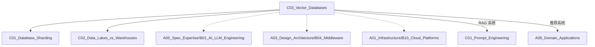

# C03 Vector Databases

**所属子领域**: [B03_Data_Storage](../README.md)  
**创建日期**: 2026-01-30  
**最后更新**: 2026-01-30

## 📋 主题定位

向量数据库（Vector Database）是专为存储和检索高维向量数据而设计的数据库系统。通过近似最近邻（ANN）搜索算法，实现高效的语义相似性检索，是 RAG（检索增强生成）、推荐系统、图像检索等 AI 应用的核心基础设施。

## 🎯 核心概念

### 基本定义

**向量嵌入（Vector Embedding）**: 将非结构化数据（文本、图像、音频）转换为高维数值向量的过程。语义相似的数据在向量空间中距离相近。

**向量检索**: 在向量空间中查找与查询向量最相似的向量的过程，通常使用余弦相似度、欧氏距离或点积作为相似度度量。

**近似最近邻（ANN）**: 牺牲少量精度换取显著性能提升的检索算法，包括 HNSW、IVF、PQ 等索引结构。

### 核心特性

| 特性 | 说明 | 优势 |
|------|------|------|
| **语义检索** | 基于意义而非关键词匹配 | 理解同义词、多义词 |
| **多模态支持** | 统一表示文本、图像、音频 | 跨模态检索 |
| **高维处理** | 支持 768-4096 维向量 | 适配现代嵌入模型 |
| **实时更新** | 动态增删向量数据 | 支持流式场景 |
| **混合查询** | 向量相似度 + 元数据过滤 | 精确控制结果 |

### 相似度度量

| 度量方式 | 公式 | 适用场景 |
|----------|------|----------|
| **余弦相似度** | $\cos(\theta) = \frac{A \cdot B}{\|A\| \|B\|}$ | 关注方向而非幅度（文本语义） |
| **欧氏距离** | $d = \sqrt{\sum(A_i - B_i)^2}$ | 关注绝对位置（图像特征） |
| **点积** | $A \cdot B = \sum A_i B_i$ | 考虑向量幅度（推荐系统） |
| **汉明距离** | 不同位的数量 | 二进制向量（图像哈希） |

### 索引算法

**1. HNSW (Hierarchical Navigable Small World)**
- 图结构索引，构建多层导航图
- 高召回率、快速查询
- 内存消耗较大
- 代表：FAISS-HNSW、Milvus、Pinecone

**2. IVF (Inverted File Index)**
- 向量空间聚类，倒排索引
- 平衡性能和资源
- 代表：FAISS-IVF

**3. PQ (Product Quantization)**
- 向量压缩技术
- 大幅降低内存占用
- 代表：FAISS-PQ、ScaNN

**4. 暴力搜索（Flat）**
- 精确计算，无索引
- 数据量小时使用
- 100% 召回率

### 应用场景

- **RAG 系统**: 知识库语义检索
- **推荐系统**: 相似商品/内容推荐
- **图像检索**: 以图搜图
- **异常检测**: 向量空间离群点检测
- **语义搜索**: 文档/代码搜索

## 🛠️ 技术实践

### 实现方法

**1. 使用 Chroma（轻量级本地向量库）**

```python
import chromadb
from chromadb.utils import embedding_functions

# 初始化客户端
client = chromadb.PersistentClient(path="./chroma_db")

# 使用 OpenAI 嵌入模型
openai_ef = embedding_functions.OpenAIEmbeddingFunction(
    api_key="your-api-key",
    model_name="text-embedding-3-small"
)

# 创建集合（相当于表）
collection = client.create_collection(
    name="documents",
    embedding_function=openai_ef,
    metadata={"hnsw:space": "cosine"}  # 使用余弦相似度
)

# 添加文档
documents = [
    "向量数据库是专门存储和检索向量数据的数据库系统",
    "RAG 是检索增强生成，结合向量检索和语言模型",
    "嵌入模型将文本转换为高维向量表示",
]

ids = ["doc1", "doc2", "doc3"]
metadatas = [
    {"source": "tech_doc", "category": "database"},
    {"source": "tech_doc", "category": "ai"},
    {"source": "tech_doc", "category": "ml"},
]

collection.add(
    documents=documents,
    ids=ids,
    metadatas=metadatas
)

# 语义检索
results = collection.query(
    query_texts=["什么是向量数据库"],
    n_results=3,
    where={"category": "database"}  # 元数据过滤
)

print(results['documents'])
print(results['distances'])  # 相似度距离
print(results['metadatas'])
```

**2. 使用 FAISS（Facebook AI 相似性搜索）**

```python
import faiss
import numpy as np
from sentence_transformers import SentenceTransformer

# 加载嵌入模型
model = SentenceTransformer('BAAI/bge-large-zh-v1.5')

# 准备数据
documents = [
    "向量数据库支持高效的语义检索",
    "机器学习是人工智能的核心技术",
    "Python 是数据科学的主流语言",
    "神经网络用于深度学习和模式识别",
]

# 生成向量嵌入
dimension = 1024  # bge-large 的维度
embeddings = model.encode(documents)
embeddings = np.array(embeddings).astype('float32')

# 创建索引
# 方式1：暴力搜索（小数据集）
index_flat = faiss.IndexFlatIP(dimension)  # 内积（余弦相似度需归一化）
index_flat.add(embeddings)

# 方式2：HNSW 索引（大数据集）
index_hnsw = faiss.IndexHNSWFlat(dimension, 32)  # 32 邻居
index_hnsw.hnsw.efConstruction = 200  # 构建时搜索深度
index_hnsw.add(embeddings)

# 方式3：IVF 索引（平衡方案）
nlist = 100  # 聚类中心数
quantizer = faiss.IndexFlatIP(dimension)
index_ivf = faiss.IndexIVFFlat(quantizer, dimension, nlist)
index_ivf.train(embeddings)  # 训练聚类
index_ivf.add(embeddings)
index_ivf.nprobe = 10  # 查询时搜索的聚类数

# 查询
query = "语义搜索技术"
query_vector = model.encode([query])
query_vector = np.array(query_vector).astype('float32')

# 归一化（用于余弦相似度）
faiss.normalize_L2(query_vector)
faiss.normalize_L2(embeddings)

# 搜索
k = 3  # 返回 top-3
distances, indices = index_hnsw.search(query_vector, k)

print("查询:", query)
for i, (idx, dist) in enumerate(zip(indices[0], distances[0])):
    print(f"{i+1}. [{dist:.4f}] {documents[idx]}")

# 保存和加载索引
faiss.write_index(index_hnsw, "my_index.faiss")
loaded_index = faiss.read_index("my_index.faiss")
```

**3. 使用 Pinecone（托管云服务）**

```python
from pinecone import Pinecone, ServerlessSpec

# 初始化
pc = Pinecone(api_key="your-api-key")

# 创建索引
index_name = "document-search"

if index_name not in pc.list_indexes().names():
    pc.create_index(
        name=index_name,
        dimension=1536,  # OpenAI text-embedding-3-small
        metric="cosine",
        spec=ServerlessSpec(
            cloud="aws",
            region="us-east-1"
        )
    )

# 连接索引
index = pc.Index(index_name)

# 插入向量
vectors = [
    {
        "id": "vec1",
        "values": [0.1, 0.2, 0.3, ...],  # 1536 维向量
        "metadata": {
            "source": "article1",
            "category": "tech",
            "created_at": "2024-01-30"
        }
    },
    # ... 更多向量
]

index.upsert(vectors=vectors, namespace="ns1")

# 查询
query_vector = [0.1, 0.2, 0.3, ...]
results = index.query(
    vector=query_vector,
    top_k=5,
    namespace="ns1",
    filter={
        "category": {"$eq": "tech"},
        "created_at": {"$gte": "2024-01-01"}
    },
    include_metadata=True
)

for match in results['matches']:
    print(f"ID: {match['id']}, Score: {match['score']:.4f}")
```

**4. 使用 Milvus/Zilliz（分布式向量数据库）**

```python
from pymilvus import connections, FieldSchema, CollectionSchema, DataType, Collection

# 连接
connections.connect("default", host="localhost", port="19530")

# 定义字段
fields = [
    FieldSchema(name="id", dtype=DataType.INT64, is_primary=True, auto_id=True),
    FieldSchema(name="embedding", dtype=DataType.FLOAT_VECTOR, dim=768),
    FieldSchema(name="text", dtype=DataType.VARCHAR, max_length=65535),
    FieldSchema(name="category", dtype=DataType.VARCHAR, max_length=128),
]

# 创建集合
schema = CollectionSchema(fields, "Document collection")
collection = Collection("documents", schema)

# 创建索引
index_params = {
    "index_type": "HNSW",  # 或 "IVF_FLAT", "DISKANN"
    "metric_type": "COSINE",
    "params": {
        "M": 16,  # HNSW 参数
        "efConstruction": 200
    }
}
collection.create_index(field_name="embedding", index_params=index_params)

# 插入数据
import random
entities = [
    [i for i in range(100)],  # id
    [[random.random() for _ in range(768)] for _ in range(100)],  # embedding
    [f"Document {i}" for i in range(100)],  # text
    ["tech" if i % 2 == 0 else "business" for i in range(100)],  # category
]
collection.insert(entities)

# 加载集合到内存
collection.load()

# 搜索
search_params = {
    "metric_type": "COSINE",
    "params": {"ef": 64}  # HNSW 搜索参数
}

results = collection.search(
    data=[[random.random() for _ in range(768)]],
    anns_field="embedding",
    param=search_params,
    limit=5,
    expr='category == "tech"',  # 标量过滤
    output_fields=["text", "category"]
)

for result in results:
    for item in result:
        print(f"ID: {item.id}, Distance: {item.distance}, Text: {item.entity.text}")
```

**5. RAG 系统完整实现**

```python
from langchain_community.vectorstores import Chroma
from langchain_openai import OpenAIEmbeddings, ChatOpenAI
from langchain.chains import RetrievalQA
from langchain.prompts import PromptTemplate
from langchain.text_splitter import RecursiveCharacterTextSplitter

class RAGSystem:
    """检索增强生成系统"""
    
    def __init__(self, openai_api_key: str, persist_dir: str = "./chroma_db"):
        self.embeddings = OpenAIEmbeddings(openai_api_key=openai_api_key)
        self.persist_dir = persist_dir
        self.vectorstore = None
        self.qa_chain = None
        
    def ingest_documents(self, documents: List[str], metadata: List[dict] = None):
        """文档摄入"""
        # 文本切分
        text_splitter = RecursiveCharacterTextSplitter(
            chunk_size=1000,
            chunk_overlap=200,
            separators=["\n\n", "\n", "。", "；", " "]
        )
        
        chunks = []
        for i, doc in enumerate(documents):
            splits = text_splitter.split_text(doc)
            for j, split in enumerate(splits):
                meta = metadata[i].copy() if metadata else {}
                meta.update({"chunk_index": j, "source_doc": i})
                chunks.append({"text": split, "metadata": meta})
        
        # 存入向量库
        texts = [c["text"] for c in chunks]
        metadatas = [c["metadata"] for c in chunks]
        
        self.vectorstore = Chroma.from_texts(
            texts=texts,
            embedding=self.embeddings,
            metadatas=metadatas,
            persist_directory=self.persist_dir
        )
        
    def setup_qa_chain(self):
        """设置问答链"""
        if not self.vectorstore:
            self.vectorstore = Chroma(
                persist_directory=self.persist_dir,
                embedding_function=self.embeddings
            )
        
        # 自定义提示词
        RAG_PROMPT = """基于以下检索到的上下文信息回答问题。如果上下文中没有足够信息，请明确说明。

上下文：
{context}

问题：{question}

回答要求：
1. 基于提供的上下文回答
2. 回答要准确、简洁
3. 如有引用，请注明来源

回答："""
        
        prompt = PromptTemplate(
            template=RAG_PROMPT,
            input_variables=["context", "question"]
        )
        
        # 检索器配置
        retriever = self.vectorstore.as_retriever(
            search_type="mmr",  # 最大边际相关性
            search_kwargs={
                "k": 5,  # 检索数量
                "fetch_k": 20,  # MMR 候选池
                "lambda_mult": 0.5  # 多样性平衡
            }
        )
        
        # 构建 QA 链
        self.qa_chain = RetrievalQA.from_chain_type(
            llm=ChatOpenAI(
                model="gpt-3.5-turbo",
                temperature=0,
                openai_api_key=self.embeddings.openai_api_key
            ),
            chain_type="stuff",
            retriever=retriever,
            chain_type_kwargs={"prompt": prompt},
            return_source_documents=True
        )
    
    def query(self, question: str) -> dict:
        """查询"""
        if not self.qa_chain:
            self.setup_qa_chain()
        
        result = self.qa_chain({"query": question})
        
        return {
            "answer": result["result"],
            "sources": [
                {
                    "content": doc.page_content[:200] + "...",
                    "metadata": doc.metadata
                }
                for doc in result["source_documents"]
            ]
        }

# 使用示例
rag = RAGSystem(openai_api_key="your-key")

# 摄入文档
docs = [
    open("doc1.txt").read(),
    open("doc2.txt").read(),
]
rag.ingest_documents(docs)

# 查询
response = rag.query("向量数据库的主要应用场景是什么？")
print(response["answer"])
```

### 最佳实践

**1. 嵌入模型选择**

| 模型 | 维度 | 语言 | 适用场景 |
|------|------|------|----------|
| text-embedding-3-small | 1536 | 多语言 | 通用场景，成本敏感 |
| text-embedding-3-large | 3072 | 多语言 | 高精度需求 |
| BAAI/bge-large-zh | 1024 | 中文 | 中文语义检索 |
| BAAI/bge-m3 | 1024 | 多语言 | 多语言混合场景 |
| E5-Mistral-7B | 4096 | 多语言 | 复杂语义理解 |

**2. 分块策略**

```python
# 基于文本结构的智能分块
def semantic_chunking(text: str, max_chunk_size: int = 1000) -> List[str]:
    """基于语义的分块策略"""
    
    # 1. 按段落分割
    paragraphs = text.split('\n\n')
    
    chunks = []
    current_chunk = ""
    
    for para in paragraphs:
        # 段落过长则按句子分割
        if len(para) > max_chunk_size:
            sentences = para.split('。')
            for sent in sentences:
                if len(current_chunk) + len(sent) < max_chunk_size:
                    current_chunk += sent + "。"
                else:
                    if current_chunk:
                        chunks.append(current_chunk)
                    current_chunk = sent + "。"
        else:
            if len(current_chunk) + len(para) < max_chunk_size:
                current_chunk += para + "\n\n"
            else:
                chunks.append(current_chunk)
                current_chunk = para + "\n\n"
    
    if current_chunk:
        chunks.append(current_chunk)
    
    return chunks
```

**3. 混合搜索策略**

```python
class HybridSearcher:
    """混合搜索：向量相似度 + 关键词匹配"""
    
    def __init__(self, vectorstore, keyword_index):
        self.vectorstore = vectorstore
        self.keyword_index = keyword_index
    
    def search(self, query: str, top_k: int = 10) -> List[dict]:
        # 向量搜索
        vector_results = self.vectorstore.similarity_search_with_score(
            query, k=top_k * 2
        )
        
        # 关键词搜索
        keyword_results = self.keyword_index.search(query, k=top_k * 2)
        
        # RRF (Reciprocal Rank Fusion) 融合
        scores = {}
        
        # 向量结果打分
        for rank, (doc, score) in enumerate(vector_results):
            doc_id = doc.metadata.get('id')
            scores[doc_id] = scores.get(doc_id, 0) + 1.0 / (rank + 60)
        
        # 关键词结果打分
        for rank, doc in enumerate(keyword_results):
            doc_id = doc.metadata.get('id')
            scores[doc_id] = scores.get(doc_id, 0) + 1.0 / (rank + 60)
        
        # 排序并返回
        sorted_docs = sorted(scores.items(), key=lambda x: x[1], reverse=True)
        return sorted_docs[:top_k]
```

**4. 性能优化**

```yaml
索引选择指南:
  小数据集 (< 100K):
    - Flat: 精确搜索，100% 召回
    
  中等数据集 (100K - 10M):
    - IVF: 平衡资源和性能
    - HNSW: 高召回，快速查询
    
  大数据集 (> 10M):
    - HNSW + PQ: 压缩 + 快速
    - IVF + PQ: 更低内存
    
  超大数据集 (> 100M):
    - DISKANN: 磁盘索引
    - 分片 + 分布式

内存优化:
  - 量化: FP32 -> FP16 -> INT8
  - 维度降维: PCA、UMAP
  - 分层索引: 粗筛 + 精排
```

### 常见陷阱

**1. 维度诅咒**
- ❌ 盲目增加向量维度
- ✅ 选择适合任务的嵌入模型
- ✅ 高维数据考虑降维

**2. 语义漂移**
- ❌ 长期不更新嵌入模型
- ✅ 定期评估检索质量
- ✅ 版本化管理嵌入模型

**3. 上下文丢失**
- ❌ 分块过小导致语义割裂
- ✅ 合理的重叠窗口
- ✅ 上下文感知分块

**4. 索引选择不当**
- ❌ 大数据集使用 Flat 索引
- ❌ 忽视索引参数调优
- ✅ 根据数据规模和查询模式选择索引

## 📚 资源索引

### 学术论文

1. **Efficient and robust approximate nearest neighbor search using Hierarchical Navigable Small World graphs** (2016)
   - 作者：Yu. A. Malkov, D. A. Yashunin
   - 链接：https://arxiv.org/abs/1603.09320
   - 说明：HNSW 算法原始论文

2. **Product Quantization for Nearest Neighbor Search** (2011)
   - 作者：Hervé Jégou et al.
   - 链接：https://hal.inria.fr/inria-00514462v2/document
   - 说明：PQ 量化技术

3. **FAISS: A library for efficient similarity search** (2017)
   - 作者：Facebook AI
   - 链接：https://engineering.fb.com/2017/03/29/data-infrastructure/faiss-a-library-for-efficient-similarity-search/
   - 说明：FAISS 库介绍

### 技术文档

1. **Pinecone 文档**
   - https://docs.pinecone.io/
   - 托管向量数据库指南

2. **Milvus 文档**
   - https://milvus.io/docs
   - 开源向量数据库

3. **Chroma 文档**
   - https://docs.trychroma.com/
   - AI 原生嵌入数据库

4. **FAISS Wiki**
   - https://github.com/facebookresearch/faiss/wiki
   - Facebook 相似性搜索库

### 开源项目

1. **LangChain**
   - https://github.com/langchain-ai/langchain
   - 向量存储集成

2. **LlamaIndex**
   - https://github.com/run-llama/llama_index
   - 数据索引和检索

3. **Sentence Transformers**
   - https://github.com/UKPLab/sentence-transformers
   - 文本嵌入模型

4. **Vespa**
   - https://github.com/vespa-engine/vespa
   - 大规模向量搜索引擎

### 评估工具

1. **ANN Benchmarks**
   - https://github.com/erikbern/ann-benchmarks
   - 向量检索算法基准测试

2. **BEIR**
   - https://github.com/beir-cellar/beir
   - 信息检索评估框架

## 🔗 关联知识



## 💡 学习建议

### 前置知识
- 线性代数基础（向量、矩阵）
- 机器学习嵌入概念
- 数据库索引原理
- Python 数据处理

### 学习路径

**第1周：基础概念**
- 理解向量嵌入
- 学习相似度度量
- 体验不同向量库

**第2周：索引算法**
- HNSW、IVF 原理
- 索引参数调优
- 性能基准测试

**第3周：RAG 实践**
- 文档处理管道
- 向量检索 + LLM
- 评估和优化

**第4周：生产部署**
- 分布式向量库
- 监控和运维
- 成本控制

### 实践项目

**项目1：企业知识库问答**
- 文档向量化
- 语义检索
- 问答机器人

**项目2：图片搜索引擎**
- 图像特征提取
- 以图搜图
- 相似图片推荐

**项目3：代码语义搜索**
- 代码嵌入
- 自然语言搜代码
- 相似代码检测

## 🔄 维护说明

- **更新频率**: 每季度更新向量库新版本特性
- **质量标准**: 代码示例可运行，模型链接有效
- **贡献方式**: 提交新的检索技巧、优化方法、实践案例
