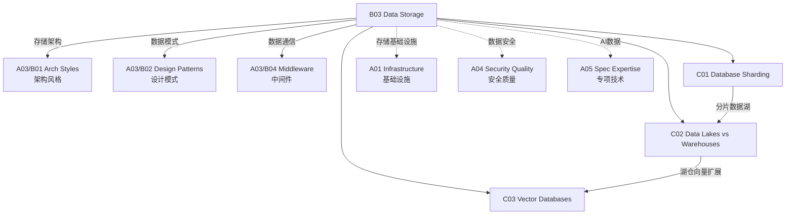

# B03 Data Storage

**所属领域**: [A03_Design_Architecture](../readme.md)
**创建日期**: 2026-01-30
**最后更新**: 2026-01-30

## 📋 子领域定位

数据存储是系统架构的核心组成部分，直接影响应用的性能、可扩展性和可靠性。随着数据量的爆炸性增长和数据类型的多样化，现代数据架构需要处理从关系型事务到实时分析、从结构化数据到向量嵌入的各种场景。

本领域涵盖数据库分片策略（水平/垂直分片、分片算法）、数据湖与数据仓库对比（Lakehouse 架构、ETL/ELT）、以及向量数据库（Embedding 存储、相似性搜索）三大方向。数据架构师需要根据业务需求在一致性、可用性和分区容错性之间做出权衡。

**核心关注点**：
- **数据库分片**: 分片策略、路由算法、分布式事务、全局 ID
- **数据湖仓**: 数据湖、数据仓库、Lakehouse、ETL/ELT 管道
- **向量数据库**: Embedding 存储、近似最近邻搜索、多模态检索

## 🗂️ 专项列表

### [C01. Database_Sharding](C01_Database_Sharding/README.md)

数据库分片是解决单机数据库性能瓶颈的关键技术。本专项详解水平分片与垂直分片策略、常见分片算法（哈希、范围、列表）、分片路由实现、以及分布式事务解决方案（2PC、Saga、TCC）。涵盖全局唯一 ID 生成（Snowflake、UUID）、分片数据迁移和跨分片查询优化。

### [C02. Data_Lakes_vs_Warehouses](C02_Data_Lakes_vs_Warehouses/README.md)

数据湖与数据仓库代表了两种不同的数据管理哲学。本专项深入数据湖架构（原始数据存储、Schema-on-read）、数据仓库特点（结构化存储、Schema-on-write）、以及融合两者的 Lakehouse 架构。涵盖 ETL vs ELT 范式、数据管道工具（Apache Airflow、dbt）和现代化数据栈（Modern Data Stack）。

### [C03. Vector_Databases](C03_Vector_Databases/README.md)

向量数据库专为高维向量数据的存储和检索而设计。本专项详解 Embedding 生成与存储、近似最近邻搜索算法（HNSW、IVF）、向量索引技术、以及混合搜索（向量+关键词）。涵盖主流向量数据库（Pinecone、Milvus、Weaviate、pgvector）和 RAG 应用架构。

## 🛠️ 技术栈概览

### 关系型数据库

| 数据库 | 特点 | 适用场景 | 官网 |
|--------|------|----------|------|
| **PostgreSQL** | 功能丰富，扩展性强 | OLTP，复杂查询 | https://www.postgresql.org |
| **MySQL** | 简单易用，生态广泛 | Web 应用 | https://www.mysql.com |
| **CockroachDB** | 分布式 SQL | 全球分布式应用 | https://www.cockroachlabs.com |
| **TiDB** | 云原生分布式 | 高可用 OLTP | https://www.pingcap.com |
| **YugabyteDB** | 云原生分布式 | 全球分布式 OLTP | https://www.yugabyte.com |

### NoSQL 数据库

| 数据库 | 类型 | 特点 | 官网 |
|--------|------|------|------|
| **MongoDB** | 文档型 | 灵活 Schema | https://www.mongodb.com |
| **Redis** | 键值型 | 内存存储，高性能 | https://redis.io |
| **Cassandra** | 宽列型 | 高可用，线性扩展 | https://cassandra.apache.org |
| **Neo4j** | 图数据库 | 关系分析 | https://neo4j.com |
| **Elasticsearch** | 搜索引擎 | 全文检索 | https://www.elastic.co |

### 数据仓库/湖

| 平台 | 类型 | 特点 | 官网 |
|------|------|------|------|
| **Snowflake** | 云数据仓库 | 存算分离 | https://www.snowflake.com |
| **Databricks** | Lakehouse | 统一分析平台 | https://databricks.com |
| **BigQuery** | 云数据仓库 | 无服务器 | https://cloud.google.com/bigquery |
| **Redshift** | 云数据仓库 | AWS 集成 | https://aws.amazon.com/redshift |
| **Apache Iceberg** | 表格式 | 开放标准 | https://iceberg.apache.org |

### 向量数据库

| 数据库 | 特点 | 官网 |
|--------|------|------|
| **Pinecone** | 托管服务，易用 | https://www.pinecone.io |
| **Milvus** | 开源，云原生 | https://milvus.io |
| **Weaviate** | GraphQL 接口 | https://weaviate.io |
| **pgvector** | PostgreSQL 扩展 | https://github.com/pgvector/pgvector |
| **Chroma** | 嵌入式，轻量 | https://www.trychroma.com |
| **Qdrant** | Rust 实现，高性能 | https://qdrant.tech |

## 💼 实践案例索引

### 案例 1: 电商平台数据库分片设计

**分片策略**:
```
┌─────────────────────────────────────────────────────────────┐
│                    订单表分片设计                             │
├─────────────────────────────────────────────────────────────┤
│                                                             │
│  分片键: user_id (哈希分片)                                   │
│                                                             │
│  ┌─────────────┐  ┌─────────────┐  ┌─────────────┐         │
│  │  Shard 0    │  │  Shard 1    │  │  Shard 2    │         │
│  │  (0-999)    │  │ (1000-1999) │  │ (2000-2999) │         │
│  │             │  │             │  │             │         │
│  │ User IDs    │  │ User IDs    │  │ User IDs    │         │
│  │ % 3 == 0    │  │ % 3 == 1    │  │ % 3 == 2    │         │
│  └─────────────┘  └─────────────┘  └─────────────┘         │
│                                                             │
│  路由算法: shard = hash(user_id) % shard_count              │
└─────────────────────────────────────────────────────────────┘
```

**分布式事务 - Saga 模式**:
```java
// 创建订单 Saga
public class CreateOrderSaga {
    
    @StartSaga
    public SagaDefinition<CreateOrderSagaState> buildSaga() {
        return step()
            .invokeParticipant(this::reserveInventory)
            .onReply(InventoryReserved.class, this::handleInventoryReserved)
            .onReply(InventoryInsufficient.class, this::handleInventoryInsufficient)
            .step()
            .invokeParticipant(this::processPayment)
            .onReply(PaymentProcessed.class, this::handlePaymentProcessed)
            .onReply(PaymentFailed.class, this::handlePaymentFailed)
            .step()
            .invokeParticipant(this::createOrder)
            .build();
    }
    
    // 补偿操作
    private CommandWithDestination reserveInventory(CreateOrderSagaState state) {
        return send(new ReserveInventoryCommand(state.getProductId(), state.getQuantity()))
            .to("inventory-service");
    }
    
    private CommandWithDestination releaseInventory(CreateOrderSagaState state) {
        return send(new ReleaseInventoryCommand(state.getProductId(), state.getQuantity()))
            .to("inventory-service");
    }
}
```

**全局 ID 生成**:
```java
// Twitter Snowflake 算法
public class SnowflakeIdGenerator {
    private final long workerId;
    private final long datacenterId;
    private long sequence = 0L;
    private long lastTimestamp = -1L;
    
    public synchronized long nextId() {
        long timestamp = timeGen();
        
        if (timestamp < lastTimestamp) {
            throw new RuntimeException("Clock moved backwards");
        }
        
        if (lastTimestamp == timestamp) {
            sequence = (sequence + 1) & sequenceMask;
            if (sequence == 0) {
                timestamp = tilNextMillis(lastTimestamp);
            }
        } else {
            sequence = 0L;
        }
        
        lastTimestamp = timestamp;
        
        return ((timestamp - twepoch) << timestampLeftShift)
            | (datacenterId << datacenterIdShift)
            | (workerId << workerIdShift)
            | sequence;
    }
}
```

### 案例 2: 现代化数据湖架构

**Lakehouse 架构**:
```
┌─────────────────────────────────────────────────────────────┐
│                    Lakehouse 架构                            │
├─────────────────────────────────────────────────────────────┤
│                                                             │
│  数据摄取层                                                  │
│  ┌─────────────┐  ┌─────────────┐  ┌─────────────┐         │
│  │  Kafka/Kinesis│  │  Fivetran   │  │  Airbyte    │         │
│  │  (流数据)    │  │  (SaaS同步) │  │  (开源集成) │         │
│  └──────┬──────┘  └──────┬──────┘  └──────┬──────┘         │
│         │                  │                  │              │
│         └──────────────────┼──────────────────┘              │
│                            ▼                                │
│  存储层 (对象存储)                                           │
│  ┌─────────────────────────────────────────────────────┐   │
│  │              Delta Lake / Apache Iceberg             │   │
│  │         (开放表格式，ACID事务，版本控制)               │   │
│  └─────────────────────────────────────────────────────┘   │
│                            │                                │
│         ┌──────────────────┼──────────────────┐             │
│         ▼                  ▼                  ▼             │
│  计算层                                                    │
│  ┌─────────────┐  ┌─────────────┐  ┌─────────────┐         │
│  │  Spark      │  │  Dremio     │  │  Trino      │         │
│  │  (批处理)   │  │  (SQL查询)  │  │  (即席查询) │         │
│  └─────────────┘  └─────────────┘  └─────────────┘         │
│                            │                                │
│                            ▼                                │
│  消费层                                                    │
│  ┌─────────────┐  ┌─────────────┐  ┌─────────────┐         │
│  │  BI 工具    │  │  ML 平台    │  │  数据应用   │         │
│  │ (Tableau)  │  │ (MLflow)   │  │ (内部应用)  │         │
│  └─────────────┘  └─────────────┘  └─────────────┘         │
└─────────────────────────────────────────────────────────────┘
```

**ETL vs ELT**:
| 特性 | ETL | ELT |
|------|-----|-----|
| 转换位置 | 加载前 | 加载后 |
| 存储成本 | 较低（已清洗） | 较高（原始数据） |
| 灵活性 | 较低 | 较高 |
| 适用场景 | 结构化数据，固定需求 | 大数据，探索性分析 |
| 工具示例 | Informatica, Talend | dbt, Spark SQL |

### 案例 3: RAG 向量检索架构

**向量检索流程**:
```python
# 文本向量化与存储
from sentence_transformers import SentenceTransformer
import pinecone

# 初始化模型和向量数据库
model = SentenceTransformer('all-MiniLM-L6-v2')
pinecone.init(api_key="your-api-key", environment="us-west1-gcp")
index = pinecone.Index("knowledge-base")

# 文档向量化
documents = [
    "Machine learning is a subset of AI",
    "Deep learning uses neural networks",
    "Python is popular for data science"
]

embeddings = model.encode(documents)

# 存储到向量数据库
vectors = [(f"doc_{i}", embedding.tolist(), {"text": doc}) 
           for i, (embedding, doc) in enumerate(zip(embeddings, documents))]
index.upsert(vectors)

# 相似性搜索
query = "What is artificial intelligence?"
query_embedding = model.encode([query])

results = index.query(
    vector=query_embedding[0].tolist(),
    top_k=3,
    include_metadata=True
)

for match in results['matches']:
    print(f"Score: {match['score']:.4f}, Text: {match['metadata']['text']}")
```

**混合搜索策略**:
```
┌─────────────────────────────────────────────────────────────┐
│                    混合搜索架构                               │
├─────────────────────────────────────────────────────────────┤
│                                                             │
│  查询: "机器学习算法在推荐系统中的应用"                         │
│                                                             │
│         ┌─────────────────────────┐                         │
│         │      查询分析            │                         │
│         │  - 提取关键词            │                         │
│         │  - 生成 Embedding        │                         │
│         └───────────┬─────────────┘                         │
│                     │                                       │
│         ┌───────────┴───────────┐                          │
│         ▼                       ▼                          │
│  ┌─────────────┐        ┌─────────────┐                    │
│  │  关键词搜索  │        │  向量搜索    │                    │
│  │  (BM25)     │        │  (Cosine)   │                    │
│  │  Score: 0.8 │        │  Score: 0.85│                    │
│  └──────┬──────┘        └──────┬──────┘                    │
│         │                       │                          │
│         └───────────┬───────────┘                          │
│                     ▼                                       │
│         ┌─────────────────────┐                            │
│         │     RRF 融合         │                            │
│         │  (Reciprocal Rank)  │                            │
│         └──────────┬──────────┘                            │
│                    ▼                                        │
│         ┌─────────────────────┐                            │
│         │     重排序 (Rerank)  │                            │
│         │  (Cross-encoder)    │                            │
│         └──────────┬──────────┘                            │
│                    ▼                                        │
│         最终搜索结果                                         │
└─────────────────────────────────────────────────────────────┘
```

## 🔗 知识关联图谱



## 📖 学习资源

### 推荐书籍

| 书名 | 作者 | 说明 |
|------|------|------|
| 《Designing Data-Intensive Applications》 | Martin Kleppmann | 数据系统经典 |
| 《Database Internals》 | Alex Petrov | 数据库原理 |
| 《The Data Warehouse Toolkit》 | Ralph Kimball | 数据仓库权威 |
| 《Building Machine Learning Pipelines》 | Hannes Hapke | ML 数据管道 |

### 在线资源

| 资源 | 链接 | 说明 |
|------|------|------|
| DB-Engines | https://db-engines.com | 数据库排名 |
| Martin Kleppmann 博客 | https://martin.kleppmann.com | 数据系统深度文章 |
| Databricks 博客 | https://www.databricks.com/blog | Lakehouse 技术 |
| Pinecone 学习 | https://www.pinecone.io/learn | 向量搜索 |

### 开源项目

| 项目 | GitHub | 说明 |
|------|--------|------|
| Apache Kafka | https://github.com/apache/kafka | 流处理平台 |
| Apache Spark | https://github.com/apache/spark | 大数据计算 |
| Delta Lake | https://github.com/delta-io/delta | 开放表格式 |
| Apache Iceberg | https://github.com/apache/iceberg | 开放表格式 |
| Milvus | https://github.com/milvus-io/milvus | 向量数据库 |

## 🔄 维护说明

- **内容审查**: 每季度更新数据库版本和性能基准
- **更新机制**: 跟踪数据库技术趋势和新兴数据库
- **质量标准**: 确保架构建议基于生产环境验证
- **贡献方式**: 欢迎提交数据库架构案例和性能优化经验
