```mermaid
graph LR
    B[B03_Data_Storage]

    %% 基础设施
    B --> A01[A01_Infrastructure/B09_Virtualization]
    B --> A02[A01_Infrastructure/B10_Cloud_Platforms]

    %% æ¶æ„设计
    B --> A03[A03_Design_Architecture/B01_Arch_Styles]
    B --> A04[A03_Design_Architecture/B04_Middleware]

    %% è´¨é‡ä¿éšœ
    B --> A05[A04_Security_Quality/B02_Reliability_Evaluation]
    B --> A06[A04_Security_Quality/B01_Information_Security]

    %% 专项技术
    B --> A07[A05_Spec_Expertise/B01_AI_LLM_Engineering]
    B --> A08[A05_Spec_Expertise/B05_Big_Data]
```

# B03_Data_Storage

**所属领域**: [A03_Design_Architecture](../readme.md)
**创建日期**: 2026-01-30
**最后更新**: 2026-01-30

## 📋 子领域定位

数据存储架构与选型领域，研究关系型数据库、NoSQL、数据湖/仓库、向量数据库等不同存储技术的特点与适用场景。从数据建模到分布式存储，构建高性能、高可用、可扩展的数据存储方案。

**核心价值**：
- 理解不同存储技术的优劣与权衡
- 掌握数据存储架构设计方法
- 优化数据访问性能与成本
- 保障数据一致性与可靠性

## 🗂️ 专项列表

### [C01. Database_Sharding](C01_Database_Sharding/README.md)

数据库分片是应对海量数据的核心技术，通过水平拆分将数据分散到多个节点。涵盖分片策略（范围、哈希、一致性哈希）、分片键选择、跨片查询、分布式事务等核心问题，以及ShardingSphere、Vitess等中间件实践。

### [C02. Data_Lakes_vs_Warehouses](C02_Data_Lakes_vs_Warehouses/README.md)

数据湖与数据仓库是企业数据平台的两大架构模式。数据湖存储原始数据支持灵活分析，数据仓库提供结构化数据支持BI报表。涵盖Lambda/Kappa架构、湖仓一体、数据治理等核心技术，以及Snowflake、Databricks等平台实践。

### [C03. Vector_Databases](C03_Vector_Databases/README.md)

向量数据库是AI时代的新型存储，支持高维向量的高效检索。涵盖向量索引（HNSW、IVF）、相似度搜索、混合检索等核心技术，以及Milvus、Qdrant、Weaviate等数据库实践，广泛应用于RAG、推荐系统、图像检索等场景。

## 🛠️ 技术栈概览

### 核心技术
- **关系型数据库**: ACID事务、索引优化、查询优化、主从复制、读写分离
- **NoSQL数据库**: 键值存储、文档存储、列族存储、图数据库
- **分布式存储**: 一致性协议（Raft/Paxos）、分片、副本、数据迁移
- **数据湖技术**: 对象存储、元数据管理、数据格式（Parquet/ORC）、数据治理
- **向量检索**: 向量索引、ANN算法、相似度度量、混合检索
- **缓存架构**: 多级缓存、缓存一致性、缓存穿透/击穿/雪崩

### 工具链
- **关系型数据库**: PostgreSQL、MySQL、Oracle、SQL Server、TiDB
- **NoSQL数据库**: MongoDB、Redis、Cassandra、DynamoDB、Neo4j
- **数据湖平台**: Hadoop、Spark、Presto、Trino、Hive
- **数据仓库**: Snowflake、BigQuery、Redshift、ClickHouse、Greenplum
- **向量数据库**: Milvus、Qdrant、Weaviate、Pinecone、Chroma
- **分片中间件**: ShardingSphere、Vitess、ProxySQL、MaxScale

### 框架与库
- **ORM框架**: Hibernate、MyBatis、SQLAlchemy、Prisma、GORM
- **数据处理**: Apache Spark、Flink、Beam、Kafka Streams
- **数据格式**: Apache Parquet、ORC、Avro、Arrow
- **湖仓一体**: Apache Iceberg、Delta Lake、Apache Hudi
- **向量检索**: FAISS、Annoy、NMSLIB、ScaNN、hnswlib
- **连接池**: HikariCP、Druid、c3p0、pgBouncer

## 💼 实践案例索引

1. **数据库分片架构**
   - 分片策略：用户ID哈希分片，订单按时间范围分片
   - 跨片查询：ShardingSphere聚合查询
   - 数据迁移：在线扩容与数据重平衡

2. **缓存架构设计**
   - 多级缓存：本地缓存（Caffeine）+ Redis分布式缓存
   - 缓存更新：Cache-Aside模式 + 延迟双删
   - 缓存预热：启动时批量加载热点数据

3. **数据湖仓一体架构**
   - 存储层：S3对象存储 + Delta Lake事务支持
   - 计算层：Spark批处理 + Presto交互式查询
   - 治理层：元数据管理 + 数据血缘追踪

4. **向量数据库应用**
   - RAG系统：Milvus存储文档向量，支持语义检索
   - 推荐系统：用户/商品向量相似度匹配
   - 图像检索：图像特征向量快速检索

5. **读写分离与高可用**
   - 主从复制：MySQL主从同步 + 读写分离
   - 故障切换：MHA自动故障转移
   - 数据一致性：最终一致性 + 业务补偿

## 🔗 关联知识

## 📖 学习资源

### 推荐书籍
1. **《数据密集型应用系统设计》** - Martin Kleppmann
   - 分布式数据系统设计经典著作

2. **《高性能MySQL》** - Baron Schwartz
   - MySQL优化与架构设计权威指南

3. **《Redis设计与实现》** - 黄健宏
   - Redis内部机制深度解析

4. **《数据库系统概念》** - Abraham Silberschatz
   - 数据库理论基础教材

5. **《NoSQL精粹》** - Pramod Sadalage
   - NoSQL数据库选型与实践

6. **《The Data Warehouse Toolkit》** - Ralph Kimball
   - 数据仓库建模经典著作

7. **《Fundamentals of Data Engineering》** - Joe Reis
   - 现代数据工程实践指南

### 在线课程
1. **Database Systems** - CMU 15-445
   - 卡内基梅隆大学数据库系统课程

2. **Designing Data-Intensive Applications** - O'Reilly
   - 数据密集型应用设计课程

3. **MongoDB University** - MongoDB
   - MongoDB官方认证课程

4. **Snowflake Hands-On Essentials** - Snowflake
   - Snowflake数据仓库实战

5. **Vector Databases** - DeepLearning.AI
   - 向量数据库与AI应用

### 技术博客
1. **High Scalability** - http://highscalability.com
   - 大规模系统架构案例分析

2. **Percona Blog** - https://www.percona.com/blog
   - MySQL/PostgreSQL性能优化

3. **Databricks Blog** - https://www.databricks.com/blog
   - 数据湖与Spark实践

4. **Snowflake Blog** - https://www.snowflake.com/blog
   - 云数据仓库架构

5. **Redis Blog** - https://redis.io/blog
   - Redis技术与最佳实践

6. **Milvus Blog** - https://milvus.io/blog
   - 向量数据库与AI应用

7. **AWS Database Blog** - https://aws.amazon.com/blogs/database
   - 云数据库服务与架构

## 🔄 维护说明

- **内容审查**: 每月检查链接有效性
- **更新机制**: 发现新技术或最佳实践时及时更新
- **质量标准**: 确保所有专项主题内容完整且准确
