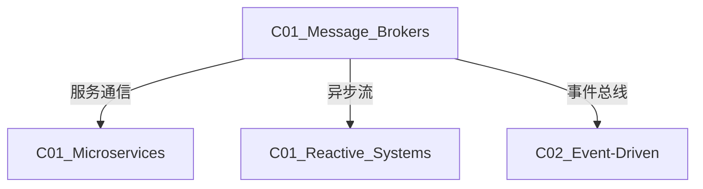

# C01 Message Brokers - 消息队列

**领域**: A03_Design_Architecture/B04_Middleware  
**创建日期**: 2026-01-30  
**最后更新**: 2026-01-30

---

## 1. 主题定位

### 1.1 定义与本质

消息队列（Message Queue）是一种异步通信机制，允许应用程序通过发送和接收消息进行解耦通信。消息队列作为中间件，在生产者和消费者之间提供缓冲，实现系统的异步、削峰填谷和解耦。

消息队列是现代分布式系统的核心基础设施，广泛应用于微服务架构、事件驱动架构、流处理等场景。

### 1.2 核心模型

```
┌─────────────────────────────────────────────────────────────────┐
│                    消息队列核心模型                              │
├─────────────────────────────────────────────────────────────────┤
│                                                                 │
│  点对点模式 (Point-to-Point):                                   │
│                                                                 │
│  ┌─────────┐      ┌─────────┐      ┌─────────┐                 │
│  │Producer │─────►│  Queue  │─────►│Consumer │                 │
│  │  (P1)   │      │         │      │  (C1)   │                 │
│  └─────────┘      │  msg1   │      └─────────┘                 │
│  ┌─────────┐      │  msg2   │                                  │
│  │Producer │─────►│  msg3   │      ┌─────────┐                 │
│  │  (P2)   │      │         │─────►│Consumer │                 │
│  └─────────┘      └─────────┘      │  (C2)   │                 │
│                                    └─────────┘                 │
│                                                                 │
│  特征:                                                           │
│  • 每条消息只被一个消费者处理                                     │
│  • 支持负载均衡                                                   │
│  • 支持消息持久化                                                 │
│  • 消费者之间竞争消息                                             │
│                                                                 │
├─────────────────────────────────────────────────────────────────┤
│                                                                 │
│  发布订阅模式 (Pub-Sub):                                        │
│                                                                 │
│  ┌─────────┐                                                   │
│  │Publisher│                                                   │
│  │  (P1)   │                                                   │
│  └────┬────┘                                                   │
│       │                                                        │
│       ▼                                                        │
│  ┌─────────┐      ┌─────────┐      ┌─────────┐                │
│  │  Topic  │─────►│ Queue 1 │─────►│Consumer │                │
│  │         │      │ (C1订阅) │      │  (C1)   │                │
│  │  msg1   │      └─────────┘      └─────────┘                │
│  │  msg2   │                                                   │
│  │  msg3   │      ┌─────────┐      ┌─────────┐                │
│  │         │─────►│ Queue 2 │─────►│Consumer │                │
│  └─────────┘      │ (C2订阅) │      │  (C2)   │                │
│                   └─────────┘      └─────────┘                │
│                                                                 │
│  特征:                                                           │
│  • 每条消息可被多个消费者接收                                     │
│  • 支持消息广播                                                   │
│  • 消费者之间相互独立                                             │
│                                                                 │
└─────────────────────────────────────────────────────────────────┘
```

---

## 2. 核心概念

### 2.1 消息可靠性保证

```
┌─────────────────────────────────────────────────────────────────┐
│                    消息可靠性级别                                │
├─────────────────────────────────────────────────────────────────┤
│                                                                 │
│  At Most Once (至多一次):                                       │
│  ┌─────────┐    ┌─────────┐    ┌─────────┐                     │
│  │Producer │───►│  Broker │───►│Consumer │                     │
│  └─────────┘    └─────────┘    └─────────┘                     │
│       │ fire       │              │ forget                     │
│       └────────────┴──────────────┘                            │
│  风险: 可能丢失消息                                              │
│  场景: 日志采集，可容忍丢失                                      │
│                                                                 │
├─────────────────────────────────────────────────────────────────┤
│                                                                 │
│  At Least Once (至少一次):                                      │
│  ┌─────────┐    ┌─────────┐    ┌─────────┐                     │
│  │Producer │───►│  Broker │───►│Consumer │                     │
│  │   ◄─────┤ack │         │ack  │─────►   │                     │
│  └─────────┘    └─────────┘    └─────────┘                     │
│  风险: 可能重复消费                                              │
│  场景: 大多数业务场景                                            │
│                                                                 │
├─────────────────────────────────────────────────────────────────┤
│                                                                 │
│  Exactly Once (恰好一次):                                       │
│  ┌─────────┐    ┌─────────┐    ┌─────────┐                     │
│  │Producer │───►│  Broker │───►│Consumer │                     │
│  │idempotent│    │txn log  │    │idempotent│                     │
│  └─────────┘    └─────────┘    └─────────┘                     │
│  机制: 幂等性 + 事务                                             │
│  场景: 金融交易，订单处理                                        │
│                                                                 │
└─────────────────────────────────────────────────────────────────┘
```

### 2.2 消息队列对比

| 特性 | Kafka | RabbitMQ | RocketMQ | Pulsar |
|------|-------|----------|----------|--------|
| **设计目标** | 高吞吐流处理 | 通用消息队列 | 金融级可靠 | 云原生多租户 |
| **吞吐量** | 百万级/秒 | 万级/秒 | 十万级/秒 | 百万级/秒 |
| **延迟** | ms级 | μs级 | ms级 | ms级 |
| **持久化** | 磁盘 | 内存+磁盘 | 磁盘 | 分层存储 |
| **副本机制** | Leader-Follower | 镜像队列 | Master-Slave | BookKeeper |
| **流处理** | Kafka Streams | 不支持 | 轻量 | Pulsar Functions |
| **多租户** | 不支持 | 不支持 | 支持 | 原生支持 |
| **地理复制** | MirrorMaker | Shovel | 支持 | 原生支持 |

---

## 3. 技术实践

### 3.1 Apache Kafka实现

```java
// KafkaProducerService.java
package com.example.kafka;

import org.apache.kafka.clients.producer.*;
import org.apache.kafka.common.serialization.StringSerializer;
import org.springframework.stereotype.Service;

import java.util.Properties;
import java.util.concurrent.Future;

/**
 * Kafka生产者服务
 */
@Service
public class KafkaProducerService {
    
    private final KafkaProducer<String, String> producer;
    
    public KafkaProducerService() {
        Properties props = new Properties();
        props.put(ProducerConfig.BOOTSTRAP_SERVERS_CONFIG, "localhost:9092");
        props.put(ProducerConfig.KEY_SERIALIZER_CLASS_CONFIG, StringSerializer.class.getName());
        props.put(ProducerConfig.VALUE_SERIALIZER_CLASS_CONFIG, StringSerializer.class.getName());
        
        // 可靠性配置
        props.put(ProducerConfig.ACKS_CONFIG, "all");  // 等待所有副本确认
        props.put(ProducerConfig.RETRIES_CONFIG, 3);   // 失败重试
        props.put(ProducerConfig.ENABLE_IDEMPOTENCE_CONFIG, true);  // 幂等性
        
        // 性能配置
        props.put(ProducerConfig.BATCH_SIZE_CONFIG, 16384);
        props.put(ProducerConfig.LINGER_MS_CONFIG, 5);
        props.put(ProducerConfig.COMPRESSION_TYPE_CONFIG, "lz4");
        
        this.producer = new KafkaProducer<>(props);
    }
    
    /**
     * 同步发送
     */
    public void sendSync(String topic, String key, String value) {
        ProducerRecord<String, String> record = 
            new ProducerRecord<>(topic, key, value);
        
        try {
            RecordMetadata metadata = producer.send(record).get();
            System.out.printf("Sent to partition %d, offset %d%n",
                metadata.partition(), metadata.offset());
        } catch (Exception e) {
            throw new RuntimeException("Failed to send message", e);
        }
    }
    
    /**
     * 异步发送
     */
    public void sendAsync(String topic, String key, String value) {
        ProducerRecord<String, String> record = 
            new ProducerRecord<>(topic, key, value);
        
        producer.send(record, (metadata, exception) -> {
            if (exception != null) {
                System.err.println("Failed to send: " + exception.getMessage());
            } else {
                System.out.printf("Async sent to partition %d%n", 
                    metadata.partition());
            }
        });
    }
    
    /**
     * 事务发送
     */
    public void sendTransactional(String topic, List<Message> messages) {
        producer.initTransactions();
        
        try {
            producer.beginTransaction();
            
            for (Message msg : messages) {
                producer.send(new ProducerRecord<>(topic, msg.getKey(), msg.getValue()));
            }
            
            producer.commitTransaction();
        } catch (Exception e) {
            producer.abortTransaction();
            throw new RuntimeException("Transaction failed", e);
        }
    }
}

// KafkaConsumerService.java
@Service
public class KafkaConsumerService {
    
    private final KafkaConsumer<String, String> consumer;
    
    public KafkaConsumerService() {
        Properties props = new Properties();
        props.put(ConsumerConfig.BOOTSTRAP_SERVERS_CONFIG, "localhost:9092");
        props.put(ConsumerConfig.GROUP_ID_CONFIG, "order-consumer-group");
        props.put(ConsumerConfig.KEY_DESERIALIZER_CLASS_CONFIG, StringDeserializer.class.getName());
        props.put(ConsumerConfig.VALUE_DESERIALIZER_CLASS_CONFIG, StringDeserializer.class.getName());
        
        // 偏移量管理
        props.put(ConsumerConfig.AUTO_OFFSET_RESET_CONFIG, "earliest");
        props.put(ConsumerConfig.ENABLE_AUTO_COMMIT_CONFIG, false);
        
        // 批量处理
        props.put(ConsumerConfig.MAX_POLL_RECORDS_CONFIG, 500);
        props.put(ConsumerConfig.MAX_POLL_INTERVAL_MS_CONFIG, 300000);
        
        this.consumer = new KafkaConsumer<>(props);
        consumer.subscribe(Arrays.asList("orders", "payments"));
    }
    
    /**
     * 手动提交消费
     */
    public void consumeWithManualCommit() {
        while (true) {
            ConsumerRecords<String, String> records = consumer.poll(Duration.ofMillis(100));
            
            for (ConsumerRecord<String, String> record : records) {
                try {
                    processMessage(record);
                    
                    // 同步提交偏移量
                    consumer.commitSync(Collections.singletonMap(
                        new TopicPartition(record.topic(), record.partition()),
                        new OffsetAndMetadata(record.offset() + 1)
                    ));
                } catch (Exception e) {
                    // 处理失败，不提交偏移量，下次重试
                    System.err.println("Processing failed: " + e.getMessage());
                }
            }
        }
    }
    
    /**
     * 批量处理 + 批量提交
     */
    public void consumeBatch() {
        while (true) {
            ConsumerRecords<String, String> records = consumer.poll(Duration.ofMillis(100));
            
            Map<TopicPartition, OffsetAndMetadata> offsets = new HashMap<>();
            
            for (ConsumerRecord<String, String> record : records) {
                processMessage(record);
                offsets.put(
                    new TopicPartition(record.topic(), record.partition()),
                    new OffsetAndMetadata(record.offset() + 1)
                );
            }
            
            // 批量提交
            if (!offsets.isEmpty()) {
                consumer.commitSync(offsets);
            }
        }
    }
    
    private void processMessage(ConsumerRecord<String, String> record) {
        System.out.printf("Processing: topic=%s, partition=%d, offset=%d, key=%s, value=%s%n",
            record.topic(), record.partition(), record.offset(), record.key(), record.value());
    }
}

// KafkaStreamsProcessor.java
@Component
public class KafkaStreamsProcessor {
    
    public void buildTopology() {
        StreamsBuilder builder = new StreamsBuilder();
        
        // 1. 从orders topic读取
        KStream<String, String> orders = builder.stream("orders");
        
        // 2. 过滤和转换
        KStream<String, Order> processedOrders = orders
            .filter((key, value) -> value != null && !value.isEmpty())
            .mapValues(this::parseOrder)
            .filter((key, order) -> order.getAmount() > 0);
        
        // 3. 按用户ID分组聚合
        KTable<String, Double> userTotalAmount = processedOrders
            .groupBy((key, order) -> order.getUserId(), Grouped.with(Serdes.String(), orderSerde))
            .aggregate(
                () -> 0.0,
                (key, order, total) -> total + order.getAmount(),
                Materialized.with(Serdes.String(), Serdes.Double())
            );
        
        // 4. 结果写入output topic
        userTotalAmount.toStream().to("user-totals");
        
        // 5. 多流JOIN
        KTable<String, String> payments = builder.table("payments");
        
        processedOrders
            .selectKey((key, order) -> order.getOrderId())
            .leftJoin(payments, this::enrichWithPayment)
            .to("enriched-orders");
        
        // 启动Streams应用
        KafkaStreams streams = new KafkaStreams(builder.build(), getStreamsConfig());
        streams.start();
    }
    
    private Properties getStreamsConfig() {
        Properties props = new Properties();
        props.put(StreamsConfig.APPLICATION_ID_CONFIG, "order-processing-app");
        props.put(StreamsConfig.BOOTSTRAP_SERVERS_CONFIG, "localhost:9092");
        props.put(StreamsConfig.DEFAULT_KEY_SERDE_CLASS_CONFIG, Serdes.String().getClass());
        props.put(StreamsConfig.DEFAULT_VALUE_SERDE_CLASS_CONFIG, Serdes.String().getClass());
        props.put(StreamsConfig.PROCESSING_GUARANTEE_CONFIG, StreamsConfig.EXACTLY_ONCE_V2);
        return props;
    }
}
```

### 3.2 RabbitMQ实现 (Python)

```python
# rabbitmq_client.py
"""
RabbitMQ客户端实现
支持发布订阅、RPC、延迟队列等模式
"""

import json
import pika
from typing import Callable, Optional
from contextlib import contextmanager
import threading


class RabbitMQClient:
    """RabbitMQ客户端"""
    
    def __init__(self, host='localhost', port=5672, credentials=None):
        self.host = host
        self.port = port
        self.credentials = credentials or pika.PlainCredentials('guest', 'guest')
        self.connection = None
        self.channel = None
        self._connect()
    
    def _connect(self):
        """建立连接"""
        params = pika.ConnectionParameters(
            host=self.host,
            port=self.port,
            credentials=self.credentials,
            heartbeat=600,
            connection_attempts=3,
            retry_delay=5
        )
        self.connection = pika.BlockingConnection(params)
        self.channel = self.connection.channel()
    
    def close(self):
        """关闭连接"""
        if self.channel and not self.channel.is_closed:
            self.channel.close()
        if self.connection and not self.connection.is_closed:
            self.connection.close()
    
    # ========== 工作队列模式 ==========
    
    def publish_to_queue(self, queue_name: str, message: dict, persistent=True):
        """发布到工作队列"""
        # 声明队列（幂等）
        self.channel.queue_declare(queue=queue_name, durable=True)
        
        properties = pika.BasicProperties(
            delivery_mode=2 if persistent else 1,  # 持久化
            content_type='application/json'
        )
        
        self.channel.basic_publish(
            exchange='',
            routing_key=queue_name,
            body=json.dumps(message).encode(),
            properties=properties
        )
        print(f"Sent to {queue_name}: {message}")
    
    def consume_from_queue(
        self, 
        queue_name: str, 
        handler: Callable[[dict], bool],
        prefetch_count: int = 1
    ):
        """从工作队列消费"""
        self.channel.queue_declare(queue=queue_name, durable=True)
        
        # QoS：预取数量，公平分发
        self.channel.basic_qos(prefetch_count=prefetch_count)
        
        def callback(ch, method, properties, body):
            try:
                message = json.loads(body.decode())
                success = handler(message)
                
                if success:
                    ch.basic_ack(delivery_tag=method.delivery_tag)
                else:
                    # 处理失败，重新入队或丢弃
                    ch.basic_nack(delivery_tag=method.delivery_tag, requeue=False)
            except Exception as e:
                print(f"Error processing message: {e}")
                ch.basic_nack(delivery_tag=method.delivery_tag, requeue=False)
        
        self.channel.basic_consume(
            queue=queue_name,
            on_message_callback=callback,
            auto_ack=False
        )
        
        print(f"Waiting for messages from {queue_name}...")
        self.channel.start_consuming()
    
    # ========== 发布订阅模式 ==========
    
    def publish_to_exchange(self, exchange: str, message: dict, routing_key=''):
        """发布到交换机"""
        self.channel.exchange_declare(exchange=exchange, type='fanout')
        
        self.channel.basic_publish(
            exchange=exchange,
            routing_key=routing_key,
            body=json.dumps(message).encode()
        )
    
    def subscribe_to_exchange(
        self, 
        exchange: str, 
        handler: Callable[[dict], None]
    ):
        """订阅交换机"""
        self.channel.exchange_declare(exchange=exchange, type='fanout')
        
        # 创建临时队列
        result = self.channel.queue_declare(queue='', exclusive=True)
        queue_name = result.method.queue
        
        self.channel.queue_bind(exchange=exchange, queue=queue_name)
        
        def callback(ch, method, properties, body):
            message = json.loads(body.decode())
            handler(message)
        
        self.channel.basic_consume(queue=queue_name, on_message_callback=callback, auto_ack=True)
        self.channel.start_consuming()
    
    # ========== 路由模式 ==========
    
    def publish_with_routing(
        self, 
        exchange: str, 
        routing_key: str, 
        message: dict
    ):
        """按路由键发布"""
        self.channel.exchange_declare(exchange=exchange, type='direct')
        
        self.channel.basic_publish(
            exchange=exchange,
            routing_key=routing_key,
            body=json.dumps(message).encode()
        )
    
    def subscribe_with_routing(
        self, 
        exchange: str, 
        routing_keys: list, 
        handler: Callable[[dict], None]
    ):
        """按路由键订阅"""
        self.channel.exchange_declare(exchange=exchange, type='direct')
        
        result = self.channel.queue_declare(queue='', exclusive=True)
        queue_name = result.method.queue
        
        for key in routing_keys:
            self.channel.queue_bind(exchange=exchange, queue=queue_name, routing_key=key)
        
        def callback(ch, method, properties, body):
            message = json.loads(body.decode())
            handler(message)
        
        self.channel.basic_consume(queue=queue_name, on_message_callback=callback, auto_ack=True)
        self.channel.start_consuming()
    
    # ========== 主题模式 ==========
    
    def publish_to_topic(
        self, 
        exchange: str, 
        routing_key: str, 
        message: dict
    ):
        """发布到主题交换机"""
        self.channel.exchange_declare(exchange=exchange, type='topic')
        
        self.channel.basic_publish(
            exchange=exchange,
            routing_key=routing_key,
            body=json.dumps(message).encode()
        )
    
    def subscribe_to_topic(
        self, 
        exchange: str, 
        pattern: str, 
        handler: Callable[[dict], None]
    ):
        """订阅主题"""
        self.channel.exchange_declare(exchange=exchange, type='topic')
        
        result = self.channel.queue_declare(queue='', exclusive=True)
        queue_name = result.method.queue
        
        self.channel.queue_bind(exchange=exchange, queue=queue_name, routing_key=pattern)
        
        def callback(ch, method, properties, body):
            message = json.loads(body.decode())
            handler(message)
        
        self.channel.basic_consume(queue=queue_name, on_message_callback=callback, auto_ack=True)
        self.channel.start_consuming()
    
    # ========== RPC模式 ==========
    
    def rpc_call(self, queue_name: str, request: dict, timeout=10) -> Optional[dict]:
        """RPC调用"""
        corr_id = str(uuid.uuid4())
        result = None
        
        callback_queue = self.channel.queue_declare(queue='', exclusive=True).method.queue
        
        def on_response(ch, method, props, body):
            nonlocal result
            if corr_id == props.correlation_id:
                result = json.loads(body.decode())
        
        self.channel.basic_consume(
            queue=callback_queue,
            on_message_callback=on_response,
            auto_ack=True
        )
        
        self.channel.basic_publish(
            exchange='',
            routing_key=queue_name,
            properties=pika.BasicProperties(
                reply_to=callback_queue,
                correlation_id=corr_id,
            ),
            body=json.dumps(request).encode()
        )
        
        # 等待响应
        start_time = time.time()
        while result is None and time.time() - start_time < timeout:
            self.connection.process_data_events(time_limit=0.1)
        
        return result
    
    def rpc_server(self, queue_name: str, handler: Callable[[dict], dict]):
        """RPC服务端"""
        self.channel.queue_declare(queue=queue_name)
        
        def on_request(ch, method, props, body):
            request = json.loads(body.decode())
            response = handler(request)
            
            ch.basic_publish(
                exchange='',
                routing_key=props.reply_to,
                properties=pika.BasicProperties(correlation_id=props.correlation_id),
                body=json.dumps(response).encode()
            )
            ch.basic_ack(delivery_tag=method.delivery_tag)
        
        self.channel.basic_qos(prefetch_count=1)
        self.channel.basic_consume(queue=queue_name, on_message_callback=on_request)
        self.channel.start_consuming()


# ========== 延迟队列实现 ==========

class DelayedQueue:
    """基于死信交换机的延迟队列"""
    
    def __init__(self, client: RabbitMQClient):
        self.client = client
        self._setup_exchanges()
    
    def _setup_exchanges(self):
        """设置交换机和队列"""
        channel = self.client.channel
        
        # 主交换机
        channel.exchange_declare(exchange='delayed.exchange', type='direct')
        channel.exchange_declare(exchange='dead.letter.exchange', type='direct')
        
        # 延迟队列（带TTL）
        for delay_ms in [5000, 30000, 60000]:  # 5s, 30s, 1min
            queue_name = f'delayed.queue.{delay_ms}'
            channel.queue_declare(
                queue=queue_name,
                arguments={
                    'x-message-ttl': delay_ms,
                    'x-dead-letter-exchange': 'delayed.exchange',
                    'x-dead-letter-routing-key': 'ready'
                }
            )
        
        # 就绪队列
        channel.queue_declare(queue='ready.queue')
        channel.queue_bind(
            exchange='delayed.exchange',
            queue='ready.queue',
            routing_key='ready'
        )
    
    def publish_delayed(self, message: dict, delay_ms: int):
        """发送延迟消息"""
        queue_name = f'delayed.queue.{delay_ms}'
        
        self.client.channel.basic_publish(
            exchange='',
            routing_key=queue_name,
            body=json.dumps(message).encode()
        )
    
    def consume_ready(self, handler: Callable[[dict], None]):
        """消费就绪消息"""
        self.client.consume_from_queue('ready.queue', lambda msg: handler(msg) or True)
```

---

## 4. 资源索引

### 4.1 论文

| 论文 | 作者 | 年份 |
|------|------|------|
| Kafka: a Distributed Messaging System | LinkedIn | 2011 |
| AMPQ Specification | AMQP Working Group | 2008 |

### 4.2 工具

| 工具 | 特点 |
|------|------|
| Apache Kafka | 高吞吐流处理 |
| RabbitMQ | 企业级消息队列 |
| Apache RocketMQ | 阿里开源，金融级 |
| Apache Pulsar | 云原生，分层存储 |
| NATS | 高性能，轻量级 |

---

## 5. 关联知识



---

## 6. 学习建议

1. 理解消息队列核心概念（队列、交换机、绑定）
2. 学习至少一种消息队列（推荐Kafka或RabbitMQ）
3. 掌握消息可靠性保证机制
4. 实践事件驱动架构设计

---

## 7. 附录

| 版本 | 日期 | 变更内容 |
|------|------|----------|
| 1.0.0 | 2026-01-30 | 初始版本 |

---

> **文档维护**: 本知识库遵循持续更新原则。
