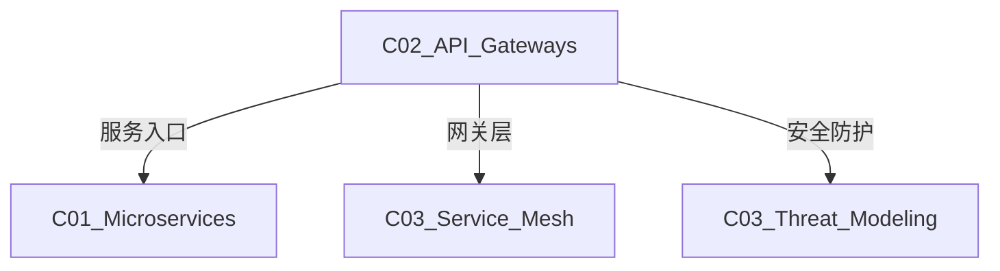

# C02 API Gateways - API网关

**领域**: A03_Design_Architecture/B04_Middleware  
**创建日期**: 2026-01-30  
**最后更新**: 2026-01-30

---

## 1. 主题定位

### 1.1 定义与本质

API网关是微服务架构中的关键组件，作为系统的统一入口，负责请求路由、协议转换、流量管理、安全防护和监控告警等功能。它位于客户端和微服务之间，提供单一接触点以访问后端服务。

API网关模式由Chris Richardson在微服务架构中系统化推广，现已成为云原生应用的标准组件。

### 1.2 架构位置

```
┌─────────────────────────────────────────────────────────────────┐
│                    API网关在架构中的位置                         │
├─────────────────────────────────────────────────────────────────┤
│                                                                 │
│  ┌─────────────┐   ┌─────────────┐   ┌─────────────┐          │
│  │  Web App    │   │ Mobile App  │   │  第三方      │          │
│  └──────┬──────┘   └──────┬──────┘   └──────┬──────┘          │
│         │                  │                  │                │
│         └──────────────────┼──────────────────┘                │
│                            │                                   │
│                    ┌───────┴───────┐                          │
│                    │  Load Balancer │                          │
│                    │   (DNS/ALB)    │                          │
│                    └───────┬───────┘                          │
│                            │                                   │
│  ┌─────────────────────────┴─────────────────────────┐        │
│  │                  API Gateway                      │        │
│  │  ┌───────────────────────────────────────────┐   │        │
│  │  │  • 认证授权 (Authentication)              │   │        │
│  │  │  • 流量控制 (Rate Limiting)               │   │        │
│  │  │  • 请求路由 (Routing)                     │   │        │
│  │  │  • 协议转换 (Protocol Translation)        │   │        │
│  │  │  • 负载均衡 (Load Balancing)              │   │        │
│  │  │  • 缓存 (Caching)                         │   │        │
│  │  │  • 监控 (Monitoring)                      │   │        │
│  │  └───────────────────────────────────────────┘   │        │
│  └─────────────────────────┬─────────────────────────┘        │
│                            │                                   │
│         ┌──────────────────┼──────────────────┐              │
│         ▼                  ▼                  ▼              │
│  ┌─────────────┐   ┌─────────────┐   ┌─────────────┐        │
│  │  订单服务    │   │  用户服务    │   │  库存服务    │        │
│  └─────────────┘   └─────────────┘   └─────────────┘        │
│                                                                 │
└─────────────────────────────────────────────────────────────────┘
```

### 1.3 网关类型

| 类型 | 代表产品 | 特点 | 适用场景 |
|------|----------|------|----------|
| **传统网关** | Nginx, HAProxy | 高性能，配置简单 | L4/L7负载均衡 |
| **微服务网关** | Spring Cloud Gateway, Zuul | Java生态集成 | Spring微服务 |
| **云原生网关** | Envoy, Istio Gateway | 服务网格集成 | Kubernetes |
| **Serverless** | AWS API Gateway, Azure APIM | 托管服务 | 云原生应用 |
| **高性能网关** | Kong, Apache APISIX | 插件丰富 | 企业级API管理 |

---

## 2. 核心概念

### 2.1 网关功能矩阵

```
┌─────────────────────────────────────────────────────────────────┐
│                    API网关功能矩阵                               │
├─────────────────────────────────────────────────────────────────┤
│                                                                 │
│  安全功能:                                                       │
│  ┌──────────────┐  ┌──────────────┐  ┌──────────────┐          │
│  │ 身份认证      │  │ 访问授权      │  │ 传输加密      │          │
│  │ JWT/OAuth2   │  │ RBAC/ABAC    │  │ TLS/mTLS     │          │
│  └──────────────┘  └──────────────┘  └──────────────┘          │
│                                                                 │
│  流量管理:                                                       │
│  ┌──────────────┐  ┌──────────────┐  ┌──────────────┐          │
│  │ 限流熔断      │  │ 负载均衡      │  │ 灰度发布      │          │
│  │ Token/滑动   │  │ 轮询/权重    │  │ 金丝雀/蓝绿   │          │
│  └──────────────┘  └──────────────┘  └──────────────┘          │
│                                                                 │
│  协议处理:                                                       │
│  ┌──────────────┐  ┌──────────────┐  ┌──────────────┐          │
│  │ 协议转换      │  │ 内容转换      │  │ 请求/响应    │          │
│  │ REST/gRPC    │  │ JSON/XML     │  │ 改写          │          │
│  └──────────────┘  └──────────────┘  └──────────────┘          │
│                                                                 │
│  可观测性:                                                       │
│  ┌──────────────┐  ┌──────────────┐  ┌──────────────┐          │
│  │ 日志记录      │  │ 指标监控      │  │ 链路追踪      │          │
│  │ 访问日志     │  │ QPS/延迟     │  │ OpenTelemetry│          │
│  └──────────────┘  └──────────────┘  └──────────────┘          │
│                                                                 │
└─────────────────────────────────────────────────────────────────┘
```

### 2.2 网关模式

```
┌─────────────────────────────────────────────────────────────────┐
│                    网关设计模式                                  │
├─────────────────────────────────────────────────────────────────┤
│                                                                 │
│  1. 背对背网关 (Backends for Frontends)                        │
│                                                                 │
│  ┌──────────┐    ┌──────────┐    ┌──────────┐                  │
│  │  Web App │───►│ Web GW   │───►│ Services │                  │
│  └──────────┘    └──────────┘    └──────────┘                  │
│  ┌──────────┐    ┌──────────┘                                  │
│  │Mobile App│───►│ Mobile GW  │                                │
│  └──────────┘    └──────────┘                                  │
│  ┌──────────┐    ┌──────────┘                                  │
│  │Third Party│──►│ Public GW  │                                │
│  └──────────┘    └──────────┘                                  │
│                                                                 │
│  优势: 针对不同客户端优化API                                      │
│                                                                 │
├─────────────────────────────────────────────────────────────────┤
│                                                                 │
│  2. 网关聚合模式 (Gateway Aggregation)                          │
│                                                                 │
│  客户端 ──► Gateway ──┬──► 订单服务 ──┐                         │
│                       ├──► 用户服务 ───┼──► 聚合响应              │
│                       └──► 库存服务 ───┘                         │
│                                                                 │
│  优势: 减少客户端请求次数                                         │
│                                                                 │
├─────────────────────────────────────────────────────────────────┤
│                                                                 │
│  3. 网关卸载模式 (Gateway Offloading)                           │
│                                                                 │
│  客户端 ──► Gateway(SSL终止) ──► Gateway(认证) ──► 服务         │
│                                                                 │
│  优势: 服务专注业务逻辑                                           │
│                                                                 │
└─────────────────────────────────────────────────────────────────┘
```

---

## 3. 技术实践

### 3.1 Spring Cloud Gateway实现

```java
// GatewayConfiguration.java
package com.example.gateway;

import org.springframework.cloud.gateway.route.RouteLocator;
import org.springframework.cloud.gateway.route.builder.RouteLocatorBuilder;
import org.springframework.context.annotation.Bean;
import org.springframework.context.annotation.Configuration;
import org.springframework.http.HttpStatus;

/**
 * Spring Cloud Gateway配置
 */
@Configuration
public class GatewayConfiguration {
    
    @Bean
    public RouteLocator customRouteLocator(RouteLocatorBuilder builder) {
        return builder.routes()
            // 订单服务路由
            .route("order-service", r -> r
                .path("/api/orders/**")
                .filters(f -> f
                    // 去除前缀
                    .stripPrefix(2)
                    // 添加请求头
                    .addRequestHeader("X-Gateway-Source", "spring-cloud-gateway")
                    // 重试
                    .retry(retryConfig -> retryConfig
                        .setRetries(3)
                        .setStatuses(HttpStatus.SERVICE_UNAVAILABLE))
                    // 熔断
                    .circuitBreaker(config -> config
                        .setName("order-service-cb")
                        .setFallbackUri("forward:/fallback/order"))
                    // 限流
                    .requestRateLimiter(rateLimiterConfig -> rateLimiterConfig
                        .setRateLimiter(redisRateLimiter())
                        .setKeyResolver(exchange -> 
                            Mono.just(exchange.getRequest().getHeaders()
                                .getFirst("X-User-Id"))))
                )
                .uri("lb://order-service")
            )
            
            // 用户服务路由
            .route("user-service", r -> r
                .path("/api/users/**")
                .filters(f -> f
                    .stripPrefix(2)
                    // 请求/响应改写
                    .modifyRequestBody(String.class, String.class, (exchange, body) -> {
                        // 添加时间戳
                        String modified = body.replace("}", ",\"gatewayTs\":\"" + 
                            System.currentTimeMillis() + "\"}");
                        return Mono.just(modified);
                    })
                )
                .uri("lb://user-service")
            )
            
            // WebSocket路由
            .route("ws-route", r -> r
                .path("/ws/**")
                .uri("ws://websocket-service:8080")
            )
            
            // 重定向路由
            .route("redirect-route", r -> r
                .path("/old-api/**")
                .filters(f -> f.redirect(301, "http://new-api.example.com"))
                .uri("no://op")
            )
            
            .build();
    }
    
    @Bean
    public RedisRateLimiter redisRateLimiter() {
        return new RedisRateLimiter(100, 200);  // replenishRate, burstCapacity
    }
}

// 全局过滤器
@Component
public class GlobalGatewayFilter implements GlobalFilter, Ordered {
    
    private static final Logger logger = LoggerFactory.getLogger(GlobalGatewayFilter.class);
    
    @Override
    public Mono<Void> filter(ServerWebExchange exchange, GatewayFilterChain chain) {
        ServerHttpRequest request = exchange.getRequest();
        String requestId = UUID.randomUUID().toString();
        
        // 添加追踪ID
        ServerHttpRequest mutatedRequest = request.mutate()
            .header("X-Request-Id", requestId)
            .header("X-Request-Time", String.valueOf(System.currentTimeMillis()))
            .build();
        
        logger.info("Request [{}] {} {} from {}", 
            requestId, 
            request.getMethod(), 
            request.getURI(),
            request.getRemoteAddress());
        
        // 记录响应时间
        return chain.filter(exchange.mutate().request(mutatedRequest).build())
            .then(Mono.fromRunnable(() -> {
                ServerHttpResponse response = exchange.getResponse();
                long duration = System.currentTimeMillis() - 
                    Long.parseLong(request.getHeaders().getFirst("X-Request-Time"));
                
                logger.info("Response [{}] status={} duration={}ms",
                    requestId,
                    response.getStatusCode(),
                    duration);
            }));
    }
    
    @Override
    public int getOrder() {
        return Ordered.HIGHEST_PRECEDENCE;
    }
}

// 认证过滤器
@Component
public class AuthenticationFilter extends AbstractGatewayFilterFactory<AuthenticationFilter.Config> {
    
    @Autowired
    private JwtTokenValidator tokenValidator;
    
    public AuthenticationFilter() {
        super(Config.class);
    }
    
    @Override
    public GatewayFilter apply(Config config) {
        return (exchange, chain) -> {
            ServerHttpRequest request = exchange.getRequest();
            
            // 跳过认证的路径
            if (config.getSkipAuthPaths().contains(request.getURI().getPath())) {
                return chain.filter(exchange);
            }
            
            // 获取Token
            String authHeader = request.getHeaders().getFirst(HttpHeaders.AUTHORIZATION);
            if (authHeader == null || !authHeader.startsWith("Bearer ")) {
                return unauthorized(exchange);
            }
            
            String token = authHeader.substring(7);
            
            // 验证Token
            return tokenValidator.validate(token)
                .flatMap(claims -> {
                    // 添加用户信息到请求头
                    ServerHttpRequest mutatedRequest = request.mutate()
                        .header("X-User-Id", claims.getSubject())
                        .header("X-User-Roles", String.join(",", claims.getRoles()))
                        .build();
                    
                    return chain.filter(exchange.mutate().request(mutatedRequest).build());
                })
                .onErrorResume(e -> unauthorized(exchange));
        };
    }
    
    private Mono<Void> unauthorized(ServerWebExchange exchange) {
        ServerHttpResponse response = exchange.getResponse();
        response.setStatusCode(HttpStatus.UNAUTHORIZED);
        return response.setComplete();
    }
    
    @Data
    public static class Config {
        private List<String> skipAuthPaths = new ArrayList<>();
    }
}
```

### 3.2 Kong网关配置

```yaml
# kong.yml - Kong声明式配置
_format_version: "3.0"

services:
  - name: order-service
    url: http://order-service:8080
    routes:
      - name: order-routes
        paths:
          - /api/orders
        strip_path: true
        methods:
          - GET
          - POST
          - PUT
          - DELETE
    plugins:
      - name: rate-limiting
        config:
          minute: 100
          policy: redis
          redis_host: redis
      - name: jwt
        config:
          uri_param_names: []
          cookie_names: []
          key_claim_name: iss
          secret_is_base64: false
          claims_to_verify:
            - exp
      - name: prometheus
      - name: file-log
        config:
          path: /var/log/kong/access.log

  - name: user-service
    url: http://user-service:8080
    routes:
      - name: user-routes
        paths:
          - /api/users
        strip_path: true

plugins:
  # 全局插件
  - name: correlation-id
    config:
      header_name: X-Request-Id
      generator: uuid
      echo_downstream: true
  
  - name: request-transformer
    config:
      add:
        headers:
          - X-Gateway:Kong
  
  - name: response-transformer
    config:
      add:
        headers:
          - X-Proxy-By:Kong

consumers:
  - username: mobile-app
    jwt_secrets:
      - algorithm: RS256
        rsa_public_key: "${JWT_PUBLIC_KEY}"
        key: "mobile-app-key"
  
  - username: web-app
    jwt_secrets:
      - algorithm: RS256
        rsa_public_key: "${JWT_PUBLIC_KEY}"
        key: "web-app-key"

# 自定义插件
plugins:
  - name: custom-auth
    config:
      auth_service_url: http://auth-service:8080/validate
```

### 3.3 Envoy代理配置

```yaml
# envoy.yaml - Envoy代理配置
static_resources:
  listeners:
    - name: listener_http
      address:
        socket_address:
          address: 0.0.0.0
          port_value: 8080
      filter_chains:
        - filters:
            - name: envoy.filters.network.http_connection_manager
              typed_config:
                "@type": type.googleapis.com/envoy.extensions.filters.network.http_connection_manager.v3.HttpConnectionManager
                stat_prefix: ingress_http
                codec_type: AUTO
                route_config:
                  name: local_route
                  virtual_hosts:
                    - name: backend
                      domains: ["*"]
                      routes:
                        - match:
                            prefix: "/api/orders"
                          route:
                            cluster: order_service
                            timeout: 30s
                            retry_policy:
                              retry_on: "5xx,connect-failure"
                              num_retries: 3
                              per_try_timeout: 10s
                        - match:
                            prefix: "/api/users"
                          route:
                            cluster: user_service
                http_filters:
                  # JWT认证
                  - name: envoy.filters.http.jwt_authn
                    typed_config:
                      "@type": type.googleapis.com/envoy.extensions.filters.http.jwt_authn.v3.JwtAuthentication
                      providers:
                        auth_provider:
                          issuer: "https://auth.example.com"
                          remote_jwks:
                            http_uri:
                              uri: https://auth.example.com/.well-known/jwks.json
                              cluster: auth_service
                              timeout: 5s
                      rules:
                        - match:
                            prefix: /api
                          requires:
                            provider_name: auth_provider
                  
                  # 限流
                  - name: envoy.filters.http.local_ratelimit
                    typed_config:
                      "@type": type.googleapis.com/envoy.extensions.filters.http.local_ratelimit.v3.LocalRateLimit
                      stat_prefix: http_local_rate_limiter
                      token_bucket:
                        max_tokens: 1000
                        tokens_per_fill: 100
                        fill_interval: 1s
                      filter_enabled:
                        runtime_key: local_rate_limit_enabled
                        default_value:
                          numerator: 100
                          denominator: HUNDRED
                      filter_enforced:
                        runtime_key: local_rate_limit_enforced
                        default_value:
                          numerator: 100
                          denominator: HUNDRED
                  
                  # 断路器
                  - name: envoy.filters.http.circuit_breaker
                    typed_config:
                      "@type": type.googleapis.com/envoy.extensions.filters.http.fault.v3.HTTPFault
                      abort:
                        http_status: 503
                        percentage:
                          numerator: 0
                          denominator: HUNDRED
                  
                  # 外部授权
                  - name: envoy.filters.http.ext_authz
                    typed_config:
                      "@type": type.googleapis.com/envoy.extensions.filters.http.ext_authz.v3.ExtAuthz
                      grpc_service:
                        envoy_grpc:
                          cluster_name: ext_authz
                        timeout: 0.5s
                  
                  # 路由
                  - name: envoy.filters.http.router
                    typed_config:
                      "@type": type.googleapis.com/envoy.extensions.filters.http.router.v3.Router

  clusters:
    - name: order_service
      connect_timeout: 5s
      type: STRICT_DNS
      lb_policy: ROUND_ROBIN
      load_assignment:
        cluster_name: order_service
        endpoints:
          - lb_endpoints:
              - endpoint:
                  address:
                    socket_address:
                      address: order-service
                      port_value: 8080
      circuit_breakers:
        thresholds:
          - priority: DEFAULT
            max_connections: 1000
            max_pending_requests: 1000
            max_requests: 1000
            max_retries: 3
      health_checks:
        - timeout: 5s
          interval: 10s
          unhealthy_threshold: 3
          healthy_threshold: 2
          http_health_check:
            path: /health

    - name: user_service
      connect_timeout: 5s
      type: STRICT_DNS
      lb_policy: LEAST_REQUEST
      load_assignment:
        cluster_name: user_service
        endpoints:
          - lb_endpoints:
              - endpoint:
                  address:
                    socket_address:
                      address: user-service
                      port_value: 8080

    - name: ext_authz
      connect_timeout: 0.5s
      type: STRICT_DNS
      lb_policy: ROUND_ROBIN
      http2_protocol_options: {}
      load_assignment:
        cluster_name: ext_authz
        endpoints:
          - lb_endpoints:
              - endpoint:
                  address:
                    socket_address:
                      address: auth-service
                      port_value: 8080

admin:
  address:
    socket_address:
      address: 0.0.0.0
      port_value: 9901
```

---

## 4. 资源索引

### 4.1 开源工具

| 工具 | 语言 | 特点 |
|------|------|------|
| Kong | Lua/OpenResty | 插件丰富，企业级 |
| Envoy | C++ | 云原生，高性能 |
| Spring Cloud Gateway | Java | Spring生态集成 |
| Apache APISIX | Lua | 高性能，动态配置 |
| Traefik | Go | 云原生，自动发现 |
| Zuul | Java | Netflix开源 |

### 4.2 云服务商

| 云服务商 | 产品 | 特点 |
|---------|------|------|
| AWS | API Gateway | 无服务器，集成度高 |
| Azure | API Management | 企业级策略 |
| GCP | Cloud Endpoints | 与GCP深度集成 |
| 阿里云 | API网关 | 国内生态完善 |

---

## 5. 关联知识



---

## 6. 学习建议

1. 理解反向代理和负载均衡基础
2. 学习一种主流网关产品
3. 掌握认证授权集成
4. 实践流量管理策略

---

## 7. 附录

| 版本 | 日期 | 变更内容 |
|------|------|----------|
| 1.0.0 | 2026-01-30 | 初始版本 |

---

> **文档维护**: 本知识库遵循持续更新原则。
