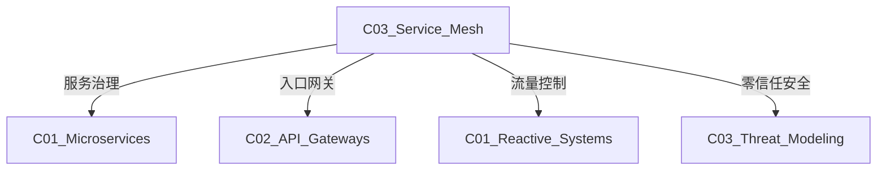

# C03 Service Mesh - 服务网格

**领域**: A03_Design_Architecture/B04_Middleware  
**创建日期**: 2026-01-30  
**最后更新**: 2026-01-30

---

## 1. 主题定位

### 1.1 定义与本质

服务网格（Service Mesh）是一种专门用于处理服务间通信的基础设施层，它通过Sidecar代理模式，将服务发现、负载均衡、加密、可观测性等功能从应用程序代码中剥离出来。

服务网格概念由Linkerd（2016年）首创，Istio（2017年）进一步推广。它代表了微服务治理的新范式——**将通信逻辑下沉到基础设施层**。

### 1.2 Sidecar模式

```
┌─────────────────────────────────────────────────────────────────┐
│                    Sidecar代理模式                               │
├─────────────────────────────────────────────────────────────────┤
│                                                                 │
│  传统模式:                           服务网格模式:               │
│                                                                 │
│  ┌─────────────┐                    ┌─────────────────────────┐ │
│  │  应用代码    │                    │        Pod              │ │
│  │             │                    │  ┌─────────────────┐   │ │
│  │  业务逻辑    │                    │  │   应用容器       │   │ │
│  │  服务发现    │                    │  │  ┌───────────┐  │   │ │
│  │  负载均衡    │                    │  │  │ 业务逻辑  │  │   │ │
│  │  熔断限流    │                    │  │  │ (纯净)    │  │   │ │
│  │  加密认证    │                    │  │  └───────────┘  │   │ │
│  │  监控日志    │                    │  └───────┬─────────┘   │ │
│  │             │                    │          │             │ │
│  │  配置复杂    │                    │  ┌───────┴─────────┐   │ │
│  │  语言绑定    │                    │  │   Sidecar容器    │   │ │
│  └─────────────┘                    │  │  ┌───────────┐  │   │ │
│                                     │  │  │Envoy/Istio│  │   │ │
│                                     │  │  │• 流量管理 │  │   │ │
│                                     │  │  │• 安全通信 │  │   │ │
│                                     │  │  │• 可观测性 │  │   │ │
│                                     │  │  └───────────┘  │   │ │
│                                     │  └─────────────────┘   │ │
│                                     └─────────────────────────┘ │
│                                                                 │
│  优势:                                                           │
│  • 应用代码零侵入                                                │
│  • 多语言统一治理                                                │
│  • 独立升级代理                                                  │
│  • 统一安全策略                                                  │
│                                                                 │
└─────────────────────────────────────────────────────────────────┘
```

### 1.3 服务网格产品对比

| 特性 | Istio | Linkerd | Consul Connect | Kuma |
|------|-------|---------|----------------|------|
| **控制平面** | 重，功能全 | 轻量 | 集成Consul | 通用 |
| **数据平面** | Envoy | Linkerd2-proxy | Envoy | Envoy |
| **资源占用** | 高 | 低 | 中 | 中 |
| **学习曲线** | 陡峭 | 平缓 | 平缓 | 平缓 |
| **mTLS默认** | 是 | 是 | 可选 | 是 |
| **多集群** | 支持 | 支持 | 支持 | 支持 |
| **CNI集成** | 可选 | 可选 | 是 | 是 |

---

## 2. 核心概念

### 2.1 服务网格架构

```
┌─────────────────────────────────────────────────────────────────┐
│                    服务网格架构 (以Istio为例)                    │
├─────────────────────────────────────────────────────────────────┤
│                                                                 │
│  ┌───────────────────────────────────────────────────────────┐ │
│  │                    控制平面 (Control Plane)                │ │
│  │                                                           │ │
│  │  ┌──────────────┐  ┌──────────────┐  ┌──────────────┐   │ │
│  │  │   Istiod     │  │   Citadel    │  │  Galley      │   │ │
│  │  │              │  │              │  │              │   │ │
│  │  │ • 服务发现   │  │ • 证书管理   │  │ • 配置验证   │   │ │
│  │  │ • 配置分发   │  │ • 密钥轮转   │  │ • 配置分发   │   │ │
│  │  │ • 证书签发   │  │ • mTLS       │  │              │   │ │
│  │  └──────────────┘  └──────────────┘  └──────────────┘   │ │
│  │                                                           │ │
│  │  ┌──────────────────────────────────────────────────┐   │ │
│  │  │  xDS API (ADS/CDS/EDS/LDS/RDS/SDS)               │   │ │
│  │  │  配置下发协议                                     │   │ │
│  │  └──────────────────────────────────────────────────┘   │ │
│  │                                                           │ │
│  └───────────────────────────────────────────────────────────┘ │
│                              │                                  │
│                              ▼                                  │
│  ┌───────────────────────────────────────────────────────────┐ │
│  │                    数据平面 (Data Plane)                   │ │
│  │                                                           │ │
│  │  ┌─────────────────────────────────────────────────────┐  │ │
│  │  │  Pod A                                              │  │ │
│  │  │  ┌─────────┐         ┌─────────┐                   │  │ │
│  │  │  │ App     │◄───────►│ Envoy   │                   │  │ │
│  │  │  │ Container│:8080   │ Sidecar│:15001              │  │ │
│  │  │  └─────────┘         └────┬────┘                   │  │ │
│  │  └───────────────────────────┼─────────────────────────┘  │ │
│  │                               │                            │ │
│  │  ┌────────────────────────────┼──────────────────────────┐ │ │
│  │  │  Pod B                     │                        │ │ │
│  │  │  ┌─────────┐              │   ┌─────────┐          │ │ │
│  │  │  │ App     │◄─────────────┴──►│ Envoy   │          │ │ │
│  │  │  │ Container│:8080             │ Sidecar│:15001     │ │ │
│  │  │  └─────────┘                  └─────────┘          │ │ │
│  │  └────────────────────────────────────────────────────┘ │ │
│  │                                                           │ │
│  │  mTLS加密通信:                                            │ │
│  │  [App A] ↔ [Envoy A] ═══════ [Envoy B] ↔ [App B]        │ │
│  │                      ↑ mTLS                               │ │
│  └───────────────────────────────────────────────────────────┘ │
│                                                                 │
└─────────────────────────────────────────────────────────────────┘
```

### 2.2 流量管理

```
┌─────────────────────────────────────────────────────────────────┐
│                    服务网格流量管理                              │
├─────────────────────────────────────────────────────────────────┤
│                                                                 │
│  1. 流量路由 (Traffic Routing)                                  │
│                                                                 │
│  ┌──────────┐     ┌──────────┐     ┌──────────┐                │
│  │ Virtual  │────►│ Service  │────►│  Pod     │                │
│  │ Service  │     │ Subset   │     │  v1/v2   │                │
│  └──────────┘     └──────────┘     └──────────┘                │
│                                                                 │
│  2. 流量分割 (Traffic Splitting)                                │
│                                                                 │
│  90% ─────────────────────────────► v1 (稳定版)                │
│  10% ─────► v2 (金丝雀发布)                                     │
│                                                                 │
│  3. 流量镜像 (Traffic Mirroring)                                │
│                                                                 │
│  Production ──► v1 (处理请求)                                   │
│       │                                                         │
│       └──Mirror─► v2 (影子流量，不影响响应)                     │
│                                                                 │
│  4. 故障注入 (Fault Injection)                                  │
│                                                                 │
│  • 延迟注入: 模拟慢响应                                          │
│  • 错误注入: 模拟服务故障                                        │
│  • 超时控制: 防止级联故障                                        │
│                                                                 │
│  5. 重试与超时 (Retries & Timeouts)                             │
│                                                                 │
│  Request ──► [Timeout: 5s] ──► [Retry: 3x] ──► Service         │
│                                                                 │
└─────────────────────────────────────────────────────────────────┘
```

---

## 3. 技术实践

### 3.1 Istio配置示例

```yaml
# istio-configuration.yaml
# Istio服务网格完整配置示例

# ========== 1. Gateway配置 ==========
apiVersion: networking.istio.io/v1beta1
kind: Gateway
metadata:
  name: public-gateway
  namespace: istio-system
spec:
  selector:
    istio: ingressgateway  # 使用Istio Ingress Gateway
  servers:
    - port:
        number: 443
        name: https
        protocol: HTTPS
      tls:
        mode: SIMPLE
        credentialName: example-cert  # TLS证书
      hosts:
        - "api.example.com"
    - port:
        number: 80
        name: http
        protocol: HTTP
      hosts:
        - "api.example.com"
      # HTTP重定向到HTTPS
      tls:
        httpsRedirect: true

---
# ========== 2. VirtualService配置 ==========
apiVersion: networking.istio.io/v1beta1
kind: VirtualService
metadata:
  name: order-service
  namespace: default
spec:
  hosts:
    - "api.example.com"
  gateways:
    - istio-system/public-gateway
  http:
    # 路由规则1: 金丝雀发布
    - match:
        - headers:
            canary:
              exact: "true"
      route:
        - destination:
            host: order-service
            subset: v2
          weight: 100
    
    # 路由规则2: 按用户分组
    - match:
        - headers:
            x-user-tier:
              exact: "premium"
      route:
        - destination:
            host: order-service
            subset: v1
          weight: 100
      # 高级路由配置
      timeout: 10s
      retries:
        attempts: 3
        perTryTimeout: 2s
        retryOn: 5xx,connect-failure,refused-stream
    
    # 默认路由
    - route:
        - destination:
            host: order-service
            subset: v1
          weight: 90
        - destination:
            host: order-service
            subset: v2
          weight: 10
      # 故障注入（测试用）
      fault:
        delay:
          percentage:
            value: 1.0
          fixedDelay: 5s
    
    # 流量镜像
    - mirror:
        host: order-service
        subset: v2
      mirrorPercentage:
        value: 10.0
      route:
        - destination:
            host: order-service
            subset: v1

---
# ========== 3. DestinationRule配置 ==========
apiVersion: networking.istio.io/v1beta1
kind: DestinationRule
metadata:
  name: order-service
  namespace: default
spec:
  host: order-service
  trafficPolicy:
    # 连接池配置
    connectionPool:
      tcp:
        maxConnections: 100
        connectTimeout: 30ms
      http:
        http1MaxPendingRequests: 100
        http2MaxRequests: 1000
        maxRequestsPerConnection: 100
        maxRetries: 3
    
    # 负载均衡
    loadBalancer:
      simple: LEAST_CONN  # 最少连接
      localityLbSetting:
        enabled: true
        failover:
          - from: us-east
            to: us-west
    
    # 健康检查
    outlierDetection:
      consecutive5xxErrors: 5
      interval: 30s
      baseEjectionTime: 30s
      maxEjectionPercent: 50
    
    # mTLS
    tls:
      mode: ISTIO_MUTUAL
  
  # 服务子集
  subsets:
    - name: v1
      labels:
        version: v1
      trafficPolicy:
        loadBalancer:
          simple: ROUND_ROBIN
    
    - name: v2
      labels:
        version: v2
      trafficPolicy:
        loadBalancer:
          simple: ROUND_ROBIN

---
# ========== 4. PeerAuthentication配置 ==========
apiVersion: security.istio.io/v1beta1
kind: PeerAuthentication
metadata:
  name: default
  namespace: default
spec:
  mtls:
    mode: STRICT  # 强制mTLS

---
# ========== 5. AuthorizationPolicy配置 ==========
apiVersion: security.istio.io/v1beta1
kind: AuthorizationPolicy
metadata:
  name: order-service-policy
  namespace: default
spec:
  selector:
    matchLabels:
      app: order-service
  action: ALLOW
  rules:
    # 规则1: 允许来自gateway的请求
    - from:
        - source:
            principals: ["cluster.local/ns/istio-system/sa/istio-ingressgateway"]
      to:
        - operation:
            methods: ["GET", "POST"]
            paths: ["/api/orders/*"]
    
    # 规则2: 允许内部服务调用
    - from:
        - source:
            namespaces: ["default"]
            principals: ["cluster.local/ns/default/sa/payment-service"]
      to:
        - operation:
            methods: ["POST"]
            paths: ["/api/orders/*/pay"]
    
    # 规则3: JWT认证
    - when:
        - key: request.auth.claims[iss]
          values: ["https://accounts.google.com"]
      to:
        - operation:
            methods: ["GET"]
            paths: ["/api/orders"]

---
# ========== 6. RequestAuthentication配置 ==========
apiVersion: security.istio.io/v1beta1
kind: RequestAuthentication
metadata:
  name: jwt-auth
  namespace: default
spec:
  selector:
    matchLabels:
      app: order-service
  jwtRules:
    - issuer: "https://accounts.google.com"
      jwksUri: "https://www.googleapis.com/oauth2/v3/certs"
      audiences: ["order-service-client-id"]
      forwardOriginalToken: true

---
# ========== 7. Telemetry配置 ==========
apiVersion: telemetry.istio.io/v1alpha1
kind: Telemetry
metadata:
  name: order-service-metrics
  namespace: default
spec:
  metrics:
    - providers:
        - name: prometheus
      overrides:
        - match:
            metric: REQUEST_COUNT
          tagOverrides:
            destination_service:
              operation: UPSERT
              value: order-service
  accessLogging:
    - providers:
        - name: envoy
      filter:
        expression: "response.code >= 400"

---
# ========== 8. WasmPlugin配置 ==========
apiVersion: extensions.istio.io/v1alpha1
kind: WasmPlugin
metadata:
  name: custom-auth
  namespace: default
spec:
  selector:
    matchLabels:
      app: order-service
  url: oci://registry.example.com/wasm-plugins/custom-auth:1.0.0
  phase: AUTHN
  pluginConfig:
    api_key_header: X-API-Key
    auth_service_url: http://auth-service.default.svc.cluster.local
```

### 3.2 服务网格可观测性

```yaml
# observability-setup.yaml
# 服务网格可观测性配置

---
# Prometheus监控配置
apiVersion: v1
kind: ConfigMap
metadata:
  name: prometheus-config
data:
  prometheus.yml: |
    global:
      scrape_interval: 15s
    
    scrape_configs:
      # Istio Control Plane
      - job_name: 'istiod'
        kubernetes_sd_configs:
          - role: endpoints
            namespaces:
              names:
                - istio-system
        relabel_configs:
          - source_labels: [__meta_kubernetes_service_name]
            action: keep
            regex: istiod
      
      # Istio Data Plane
      - job_name: 'envoy-stats'
        kubernetes_sd_configs:
          - role: pod
        relabel_configs:
          - source_labels: [__meta_kubernetes_pod_container_port_name]
            action: keep
            regex: '.*-envoy-prom'
          - source_labels: [__address__]
            action: replace
            regex: ([^:]+)(?::\d+)?
            replacement: $1:15090
            target_label: __address__

---
# Grafana Dashboard
apiVersion: v1
kind: ConfigMap
metadata:
  name: istio-dashboards
data:
  service-dashboard.json: |
    {
      "dashboard": {
        "title": "Istio Service Dashboard",
        "panels": [
          {
            "title": "Request Rate",
            "targets": [
              {
                "expr": "sum(rate(istio_requests_total[5m])) by (destination_service)"
              }
            ]
          },
          {
            "title": "Error Rate",
            "targets": [
              {
                "expr": "sum(rate(istio_requests_total{response_code=~\"5..\"}[5m])) by (destination_service)"
              }
            ]
          },
          {
            "title": "Latency (p99)",
            "targets": [
              {
                "expr": "histogram_quantile(0.99, sum(rate(istio_request_duration_milliseconds_bucket[5m])) by (le, destination_service))"
              }
            ]
          }
        ]
      }
    }

---
# Jaeger分布式追踪
apiVersion: jaegertracing.io/v1
kind: Jaeger
metadata:
  name: simplest
  namespace: observability
spec:
  strategy: production
  storage:
    type: elasticsearch
    options:
      es:
        server-urls: http://elasticsearch:9200
  ingress:
    enabled: true
```

### 3.3 多集群服务网格

```yaml
# multi-cluster-setup.yaml
# Istio多集群配置

---
# 主集群配置
apiVersion: install.istio.io/v1alpha1
kind: IstioOperator
metadata:
  name: primary
spec:
  profile: default
  meshConfig:
    trustDomain: example.com
    defaultConfig:
      proxyMetadata:
        ISTIO_META_DNS_CAPTURE: "true"
  values:
    global:
      meshID: mesh1
      multiCluster:
        clusterName: cluster1
        network: network1
      istiod:
        enableAnalysis: true

---
# 从集群配置
apiVersion: install.istio.io/v1alpha1
kind: IstioOperator
metadata:
  name: remote
spec:
  profile: remote
  values:
    global:
      meshID: mesh1
      multiCluster:
        clusterName: cluster2
        network: network2
      istiod:
        enableAnalysis: true
    istiodRemote:
      injectionURL: https://istiod.istio-system.svc:15017/inject
```

---

## 4. 资源索引

### 4.1 论文与著作

| 资源 | 作者 | 年份 |
|------|------|------|
| Istio: A service mesh for microservices | Google/IBM/Lyft | 2017 |
| Linkerd: A service mesh for Kubernetes | Buoyant | 2016 |
| The Service Mesh | InfoQ | 2018 |

### 4.2 开源工具

| 工具 | 特点 |
|------|------|
| Istio | 功能最全，企业级 |
| Linkerd | 轻量，易用 |
| Consul Connect | HashiCorp生态 |
| Kuma | 通用，多平台 |
| Open Service Mesh | 微软开源 |

---

## 5. 关联知识



---

## 6. 学习建议

1. 掌握Kubernetes基础
2. 理解Sidecar模式
3. 学习Istio核心CRD
4. 实践金丝雀发布和故障注入

---

## 7. 附录

| 版本 | 日期 | 变更内容 |
|------|------|----------|
| 1.0.0 | 2026-01-30 | 初始版本 |

---

> **文档维护**: 本知识库遵循持续更新原则。
