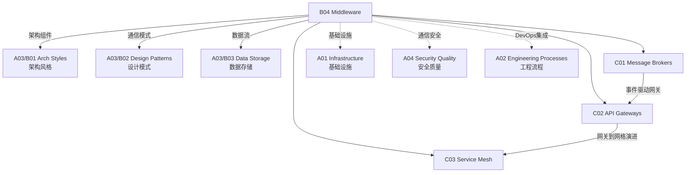

# B04 Middleware

**所属领域**: [A03_Design_Architecture](../readme.md)
**创建日期**: 2026-01-30
**最后更新**: 2026-01-30

## 📋 子领域定位

中间件是连接应用程序与底层基础设施的软件层，为分布式系统提供通信、数据管理、事务处理等通用服务。在现代微服务架构中，中间件扮演着至关重要的角色，帮助开发者处理分布式系统的复杂性。

本领域涵盖消息队列选型（Kafka、RabbitMQ、RocketMQ）、API 网关设计（Kong、Envoy、APISIX）和服务网格实现（Istio、Linkerd）三大方向。架构师需要理解不同中间件的适用场景、性能特征和运维复杂性，做出恰当的技术选型。

**核心关注点**：
- **消息队列**: 异步通信、事件驱动、流处理、消息可靠性
- **API 网关**: 流量管理、协议转换、安全防护、灰度发布
- **服务网格**: 服务发现、负载均衡、熔断限流、可观测性

## 🗂️ 专项列表

### [C01. Message_Brokers](C01_Message_Brokers/README.md)

消息队列是实现异步通信和解耦的核心组件。本专项详解 Kafka（高吞吐流处理）、RabbitMQ（灵活路由）、RocketMQ（金融级可靠）和 Pulsar（云原生多租户）的特性对比。涵盖消息模型（队列 vs 发布订阅）、消息可靠性保证（At-least-once、Exactly-once）、以及消息顺序和事务消息实现。

### [C02. API_Gateways](C02_API_Gateways/README.md)

API 网关是微服务架构的统一入口。本专项深入 Kong（插件生态）、Envoy（云原生高性能）、Apache APISIX（动态路由）和 Traefik（云原生自动发现）的特性对比。涵盖流量管理（限流、熔断、重试）、安全防护（认证、WAF）、协议转换（gRPC-Web、GraphQL）和灰度发布策略。

### [C03. Service_Mesh](C03_Service_Mesh/README.md)

服务网格为微服务提供透明的通信治理能力。本专项详解 Istio（功能全面）、Linkerd（轻量级）、Consul Connect（HashiCorp 生态）和 Kuma（多云支持）的架构对比。涵盖流量管理（虚拟服务、目标规则）、安全（mTLS、授权策略）、可观测性（分布式追踪、指标）和性能优化。

## 🛠️ 技术栈概览

### 消息队列对比

| 特性 | Kafka | RabbitMQ | RocketMQ | Pulsar |
|------|-------|----------|----------|--------|
| **吞吐量** | 极高 (100万+/s) | 高 (5万+/s) | 高 (10万+/s) | 极高 (100万+/s) |
| **延迟** | 低 (ms级) | 极低 (μs级) | 低 (ms级) | 低 (ms级) |
| **消息模型** | 发布订阅 | 队列+路由 | 队列+发布订阅 | 多租户发布订阅 |
| **持久化** | 磁盘 | 内存+磁盘 | 磁盘 | 分层存储 |
| **最佳场景** | 日志、流处理 | 企业集成 | 金融交易 | 云原生消息 |
| **官网** | https://kafka.apache.org | https://www.rabbitmq.com | https://rocketmq.apache.org | https://pulsar.apache.org |

### API 网关对比

| 特性 | Kong | Envoy | APISIX | Traefik |
|------|------|-------|--------|---------|
| **架构** | OpenResty | C++ | OpenResty | Go |
| **性能** | 高 | 极高 | 高 | 中高 |
| **插件生态** | 丰富 | 中等 | 丰富 | 中等 |
| **动态配置** | 支持 | 支持 | 支持（无需重启） | 支持（自动发现） |
| **K8s集成** | 良好 | 原生 | 良好 | 原生 |
| **官网** | https://konghq.com | https://www.envoyproxy.io | https://apisix.apache.org | https://traefik.io |

### 服务网格对比

| 特性 | Istio | Linkerd | Consul Connect | Kuma |
|------|-------|---------|----------------|------|
| **数据面** | Envoy | Linkerd2-proxy | Envoy | Envoy |
| **控制面复杂度** | 高 | 低 | 中等 | 低 |
| **资源占用** | 高 | 极低 | 中等 | 低 |
| **功能丰富度** | 极高 | 核心功能 | 中等 | 中等 |
| **多集群支持** | 优秀 | 良好 | 良好 | 优秀 |
| **官网** | https://istio.io | https://linkerd.io | https://www.consul.io | https://kuma.io |

## 💼 实践案例索引

### 案例 1: 电商订单消息流架构

**Kafka 主题设计**:
```
┌─────────────────────────────────────────────────────────────┐
│                    订单消息流架构                             │
├─────────────────────────────────────────────────────────────┤
│                                                             │
│  订单服务                                                    │
│     │                                                       │
│     ▼                                                       │
│  ┌─────────────────────────────────────────────────────┐   │
│  │              order-events (Topic)                    │   │
│  │  ┌─────────────┐  ┌─────────────┐  ┌─────────────┐  │   │
│  │  │  order.created │  │ order.paid   │  │ order.shipped│  │   │
│  │  │  Partition 0  │  │  Partition 1 │  │  Partition 2 │  │   │
│  │  └──────┬──────┘  └──────┬──────┘  └──────┬──────┘  │   │
│  └─────────┼────────────────┼────────────────┼──────────┘   │
│            │                │                │              │
│            ▼                ▼                ▼              │
│  ┌─────────────┐    ┌─────────────┐    ┌─────────────┐     │
│  │  库存服务    │    │  支付服务    │    │  物流服务    │     │
│  │  Consumer   │    │  Consumer   │    │  Consumer   │     │
│  │  Group:inv  │    │  Group:pay  │    │  Group:ship │     │
│  └─────────────┘    └─────────────┘    └─────────────┘     │
│                                                             │
│  消费者组设计:                                               │
│  - 库存服务: 消费 order.created，扣减库存                    │
│  - 支付服务: 消费 order.created，处理支付                    │
│  - 物流服务: 消费 order.paid，创建物流单                     │
└─────────────────────────────────────────────────────────────┘
```

**Kafka 生产者配置**:
```java
Properties props = new Properties();
props.put(ProducerConfig.BOOTSTRAP_SERVERS_CONFIG, "kafka:9092");
props.put(ProducerConfig.KEY_SERIALIZER_CLASS_CONFIG, StringSerializer.class.getName());
props.put(ProducerConfig.VALUE_SERIALIZER_CLASS_CONFIG, JsonSerializer.class.getName());

// 可靠性配置
props.put(ProducerConfig.ACKS_CONFIG, "all");  // 等待所有副本确认
props.put(ProducerConfig.RETRIES_CONFIG, 3);   // 失败重试
props.put(ProducerConfig.ENABLE_IDEMPOTENCE_CONFIG, true);  // 幂等性

// 事务配置（Exactly-once）
props.put(ProducerConfig.TRANSACTIONAL_ID_CONFIG, "order-producer-1");

KafkaProducer<String, OrderEvent> producer = new KafkaProducer<>(props);
producer.initTransactions();

try {
    producer.beginTransaction();
    producer.send(new ProducerRecord<>("order-events", orderId, event));
    producer.commitTransaction();
} catch (Exception e) {
    producer.abortTransaction();
}
```

### 案例 2: API 网关统一接入层

**Kong 配置示例**:
```yaml
# kong.yml - 声明式配置
_format_version: "3.0"

services:
  - name: user-service
    url: http://user-service:8080
    routes:
      - name: user-routes
        paths:
          - /api/users
    plugins:
      - name: rate-limiting
        config:
          minute: 100
          policy: redis
      - name: jwt
        config:
          uri_param_names: []
          cookie_names: []
          key_claim_name: iss
          secret_is_base64: false
          claims_to_verify:
            - exp
      - name: cors
        config:
          origins:
            - "https://app.example.com"
          methods:
            - GET
            - POST
            - PUT
            - DELETE
          headers:
            - Authorization
            - Content-Type
```

**网关架构**:
```
┌─────────────────────────────────────────────────────────────┐
│                    API 网关架构                               │
├─────────────────────────────────────────────────────────────┤
│                                                             │
│  客户端                                                      │
│     │                                                       │
│     ▼                                                       │
│  ┌─────────────────────────────────────────────────────┐   │
│  │                 Kong API 网关                        │   │
│  │  ┌─────────┐  ┌─────────┐  ┌─────────┐  ┌────────┐ │   │
│  │  │ 认证    │→│ 限流    │→│ 路由    │→│ 转换   │ │   │
│  │  │ (JWT)   │  │ (Rate)  │  │ (Path)  │  │ (协议) │ │   │
│  │  └─────────┘  └─────────┘  └─────────┘  └────────┘ │   │
│  └─────────────────────────┬───────────────────────────┘   │
│                            │                                │
│         ┌──────────────────┼──────────────────┐             │
│         ▼                  ▼                  ▼             │
│  ┌─────────────┐    ┌─────────────┐    ┌─────────────┐     │
│  │ 用户服务     │    │ 订单服务     │    │ 商品服务     │     │
│  │ /api/users  │    │ /api/orders │    │ /api/products│     │
│  └─────────────┘    └─────────────┘    └─────────────┘     │
│                                                             │
│  插件链路:                                                   │
│  请求 → 认证 → 限流 → 缓存 → 路由 → 负载均衡 → 服务           │
└─────────────────────────────────────────────────────────────┘
```

### 案例 3: Istio 服务网格实施

**流量管理配置**:
```yaml
# VirtualService - 流量路由
apiVersion: networking.istio.io/v1beta1
kind: VirtualService
metadata:
  name: user-service
spec:
  hosts:
    - user-service
  http:
    - match:
        - headers:
            x-canary:
              exact: "true"
      route:
        - destination:
            host: user-service
            subset: v2
          weight: 100
    - route:
        - destination:
            host: user-service
            subset: v1
          weight: 90
        - destination:
            host: user-service
            subset: v2
          weight: 10
      fault:
        delay:
          percentage:
            value: 0.1
          fixedDelay: 5s
      retries:
        attempts: 3
        perTryTimeout: 2s
        retryOn: gateway-error,connect-failure,refused-stream

---
# DestinationRule - 服务子集
apiVersion: networking.istio.io/v1beta1
kind: DestinationRule
metadata:
  name: user-service
spec:
  host: user-service
  trafficPolicy:
    connectionPool:
      tcp:
        maxConnections: 100
      http:
        http1MaxPendingRequests: 100
        maxRequestsPerConnection: 10
    outlierDetection:
      consecutiveErrors: 5
      interval: 30s
      baseEjectionTime: 30s
  subsets:
    - name: v1
      labels:
        version: v1
    - name: v2
      labels:
        version: v2
```

**可观测性架构**:
```
┌─────────────────────────────────────────────────────────────┐
│                    Istio 可观测性架构                         │
├─────────────────────────────────────────────────────────────┤
│                                                             │
│  数据面 (Envoy Sidecar)                                      │
│  ┌─────────┐  ┌─────────┐  ┌─────────┐                     │
│  │ 指标    │  │ 日志    │  │ 追踪    │                     │
│  │(Prometheus│  │(Access Log)│  │(OpenTelemetry)│          │
│  └────┬────┘  └────┬────┘  └────┬────┘                     │
│       │            │            │                          │
│       └────────────┼────────────┘                          │
│                    ▼                                        │
│  ┌─────────────────────────────────────────────────────┐   │
│  │               控制面 (Istiod)                        │   │
│  │  - 配置分发                                          │   │
│  │  - 证书管理                                          │   │
│  └─────────────────────────┬───────────────────────────┘   │
│                            │                                │
│       ┌────────────────────┼────────────────────┐          │
│       ▼                    ▼                    ▼          │
│  ┌─────────┐         ┌─────────┐         ┌─────────┐      │
│  │Prometheus│         │Grafana  │         │Jaeger   │      │
│  │(指标存储)│         │(可视化) │         │(分布式追踪)│    │
│  └─────────┘         └─────────┘         └─────────┘      │
│                                                             │
└─────────────────────────────────────────────────────────────┘
```

## 🔗 知识关联图谱



## 📖 学习资源

### 推荐书籍

| 书名 | 作者 | 说明 |
|------|------|------|
| 《Enterprise Integration Patterns》 | Hohpe & Woolf | 企业集成模式 |
| 《Kafka: The Definitive Guide》 | Neha Narkhede | Kafka 权威指南 |
| 《Istio in Action》 | Christian Posta | Istio 实践 |
| 《API Design Patterns》 | JJ Geewax | API 设计模式 |

### 在线资源

| 资源 | 链接 | 说明 |
|------|------|------|
| Kafka Documentation | https://kafka.apache.org/documentation | Kafka 官方文档 |
| RabbitMQ Tutorials | https://www.rabbitmq.com/getstarted.html | RabbitMQ 教程 |
| Istio Docs | https://istio.io/latest/docs | Istio 文档 |
| Kong Docs | https://docs.konghq.com | Kong 文档 |

### 开源项目

| 项目 | GitHub | 说明 |
|------|--------|------|
| Apache Kafka | https://github.com/apache/kafka | 消息队列 |
| RabbitMQ | https://github.com/rabbitmq/rabbitmq-server | 消息队列 |
| Istio | https://github.com/istio/istio | 服务网格 |
| Kong | https://github.com/Kong/kong | API 网关 |
| Envoy | https://github.com/envoyproxy/envoy | 代理 |
| Apache APISIX | https://github.com/apache/apisix | API 网关 |

## 🔄 维护说明

- **内容审查**: 每季度更新中间件版本和性能基准
- **更新机制**: 跟踪中间件社区和云厂商托管服务发展
- **质量标准**: 确保技术选型建议基于生产环境验证
- **贡献方式**: 欢迎提交中间件架构案例和性能测试数据
