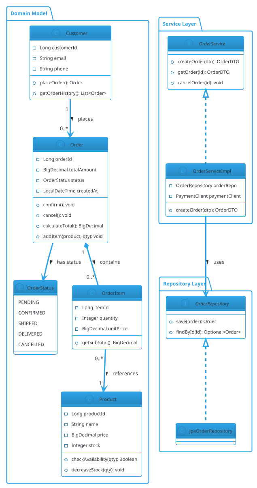
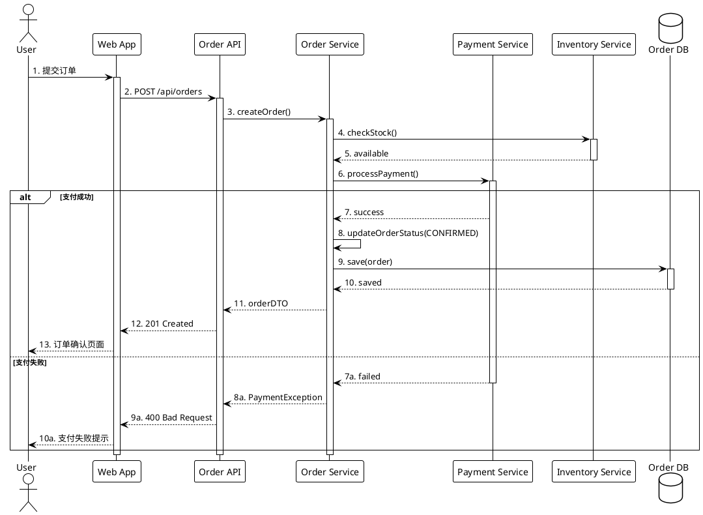
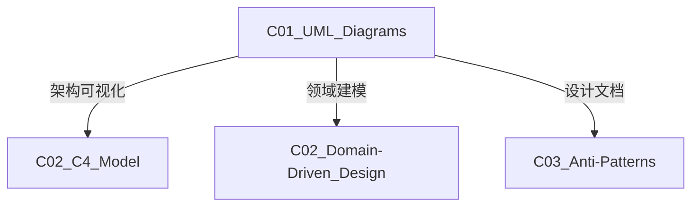

# C01 UML Diagrams - UML建模

**领域**: A03_Design_Architecture/B05_System_Modeling  
**创建日期**: 2026-01-30  
**最后更新**: 2026-01-30

---

## 1. 主题定位

### 1.1 定义与本质

统一建模语言（Unified Modeling Language, UML）是一种标准化的通用建模语言，用于可视化、描述、构造和文档化软件系统的各个方面。UML 1.0于1997年由OMG（对象管理组织）发布，UML 2.5是当前主流版本。

UML不是编程语言，而是图形化语言，它提供了从需求分析到系统部署的全生命周期建模能力。

### 1.2 UML图分类

```
┌─────────────────────────────────────────────────────────────────┐
│                    UML 2.5 图表分类                              │
├─────────────────────────────────────────────────────────────────┤
│                                                                 │
│  结构图 (Structure Diagrams) - "是什么":                         │
│  ┌──────────────┐  ┌──────────────┐  ┌──────────────┐          │
│  │ 类图         │  │ 组件图       │  │ 部署图       │          │
│  │ Class        │  │ Component    │  │ Deployment   │          │
│  │ Diagram      │  │ Diagram      │  │ Diagram      │          │
│  └──────────────┘  └──────────────┘  └──────────────┘          │
│  ┌──────────────┐  ┌──────────────┐  ┌──────────────┐          │
│  │ 对象图       │  │ 包图         │  │ 组合结构图   │          │
│  │ Object       │  │ Package      │  │ Composite    │          │
│  │ Diagram      │  │ Diagram      │  │ Structure    │          │
│  └──────────────┘  └──────────────┘  └──────────────┘          │
│  ┌──────────────┐  ┌──────────────┐                            │
│  │ 轮廓图       │  │ 用例图       │                            │
│  │ Profile      │  │ Use Case     │                            │
│  │ Diagram      │  │ Diagram      │                            │
│  └──────────────┘  └──────────────┘                            │
│                                                                 │
├─────────────────────────────────────────────────────────────────┤
│                                                                 │
│  行为图 (Behavior Diagrams) - "做什么":                          │
│  ┌──────────────┐  ┌──────────────┐  ┌──────────────┐          │
│  │ 活动图       │  │ 状态机图     │  │ 时序图       │          │
│  │ Activity     │  │ State        │  │ Sequence     │          │
│  │ Diagram      │  │ Machine      │  │ Diagram      │          │
│  └──────────────┘  └──────────────┘  └──────────────┘          │
│  ┌──────────────┐  ┌──────────────┐  ┌──────────────┐          │
│  │ 通信图       │  │ 交互概览图   │  │ 定时图       │          │
│  │ Communication│  │ Interaction  │  │ Timing       │          │
│  │ Diagram      │  │ Overview     │  │ Diagram      │          │
│  └──────────────┘  └──────────────┘  └──────────────┘          │
│                                                                 │
└─────────────────────────────────────────────────────────────────┘
```

---

## 2. 核心概念

### 2.1 类图 (Class Diagram)

```
┌─────────────────────────────────────────────────────────────────┐
│                    类图核心元素                                  │
├─────────────────────────────────────────────────────────────────┤
│                                                                 │
│  类 (Class):                                                    │
│  ┌─────────────────────┐                                       │
│  │     Order           │  <-- 类名                              │
│  ├─────────────────────┤                                       │
│  │ - orderId: Long     │  <-- 属性 (-私有, +公有, #保护)        │
│  │ - total: BigDecimal │                                       │
│  │ - status: OrderStatus│                                       │
│  ├─────────────────────┤                                       │
│  │ + confirm(): void   │  <-- 方法                              │
│  │ + cancel(): void    │                                       │
│  │ + calculateTotal(): │                                       │
│  │   BigDecimal        │                                       │
│  └─────────────────────┘                                       │
│                                                                 │
│  关系类型:                                                       │
│                                                                 │
│  继承 (Generalization):                                         │
│  ┌──────────────┐                                               │
│  │  Order       │◄────────────────────┐                        │
│  └──────────────┘                     │ 空心三角箭头            │
│         ▲                             │ 指向父类                │
│         │                             │                        │
│  ┌──────┴───────┐                     │                        │
│  │ OnlineOrder  │─────────────────────┘                        │
│  └──────────────┘                                               │
│                                                                 │
│  关联 (Association):                                            │
│  ┌──────────────┐      1          *    ┌──────────────┐        │
│  │  Customer    │──────────────────────│    Order     │        │
│  └──────────────┘      拥有              └──────────────┘        │
│                                                                 │
│  聚合 (Aggregation) - "has-a":                                   │
│  ┌──────────────┐      1          0..*  ┌──────────────┐        │
│  │  Department  │◇──────────────────────│   Employee   │        │
│  └──────────────┘      空心菱形          └──────────────┘        │
│                        整体端                                    │
│                                                                 │
│  组合 (Composition) - "owns-a":                                  │
│  ┌──────────────┐      1          1..*  ┌──────────────┐        │
│  │     Car      │◆──────────────────────│    Wheel     │        │
│  └──────────────┘      实心菱形          └──────────────┘        │
│                        整体生命周期                              │
│                                                                 │
│  依赖 (Dependency):                                             │
│  ┌──────────────┐                                               │
│  │ OrderService │ - - - - - - - -► ┌──────────────┐           │
│  └──────────────┘   虚线箭头        │ OrderRepository│           │
│                     使用            └──────────────┘           │
│                                                                 │
│  实现 (Realization):                                            │
│  ┌──────────────┐                                               │
│  │«interface»   │◄ - - - - - - - ┌──────────────┐              │
│  │ OrderService │   虚线+空心三角 │OrderServiceImpl│             │
│  └──────────────┘                 └──────────────┘              │
│                                                                 │
└─────────────────────────────────────────────────────────────────┘
```

### 2.2 时序图 (Sequence Diagram)

```
┌─────────────────────────────────────────────────────────────────┐
│                    时序图示例 - 下单流程                          │
├─────────────────────────────────────────────────────────────────┤
│                                                                 │
│  Customer      WebApp      OrderService    PaymentService       │
│     │             │              │               │              │
│     │  1: submitOrder()         │               │              │
│     │────────────►│              │               │              │
│     │             │  2: createOrder()           │              │
│     │             │─────────────►│               │              │
│     │             │              │  3: validate()│              │
│     │             │              │ ─ ─ ─ ─ ─ ─ ─ │              │
│     │             │              │◄- - - - - - - │              │
│     │             │              │               │              │
│     │             │              │  4: processPayment()         │
│     │             │              │──────────────►│              │
│     │             │              │               │              │
│     │             │              │◄──────────────┤ 5: result    │
│     │             │              │               │              │
│     │             │◄─────────────┤ 6: orderConfirmed            │
│     │             │              │               │              │
│     │◄────────────┤ 7: confirmation               │              │
│     │             │              │               │              │
│     │             │              │               │              │
│  ╔══════════════════════════════════════════════════════════╗   │
│  ║ alt [payment success]                                    ║   │
│  ║     │             │              │◄──────────────┤       ║   │
│  ║     │             │◄─────────────┤ 6a: confirm    │       ║   │
│  ║ else [payment failed]                                    ║   │
│  ║     │             │              │◄──────────────┤       ║   │
│  ║     │             │◄─────────────┤ 6b: cancel     │       ║   │
│  ╚══════════════════════════════════════════════════════════╝   │
│     │             │              │               │              │
│     │             │              │               │              │
│  ╔══════════════════════════════════════════════════════════╗   │
│  ║ loop [retry 3 times]                                     ║   │
│  ║     │             │              │ 4: processPayment()   ║   │
│  ║     │             │              │──────────────►│       ║   │
│  ╚══════════════════════════════════════════════════════════╝   │
│     │             │              │               │              │
│                                                                 │
│  图例说明:                                                       │
│  ├──► : 同步消息                                                 │
│  ─ ─► : 返回消息                                                 │
│  ─▸   : 异步消息                                                 │
│  │    : 激活条                                                   │
│  ╔╗   : 组合片段 (alt/opt/loop/par)                             │
│                                                                 │
└─────────────────────────────────────────────────────────────────┘
```

### 2.3 活动图 (Activity Diagram)

```
┌─────────────────────────────────────────────────────────────────┐
│                    活动图示例 - 订单处理                          │
├─────────────────────────────────────────────────────────────────┤
│                                                                 │
│                           [开始]                                 │
│                             │                                    │
│                             ▼                                    │
│                    ┌─────────────────┐                          │
│                    │   接收订单请求   │                          │
│                    └────────┬────────┘                          │
│                             │                                    │
│                             ▼                                    │
│                    ┌─────────────────┐                          │
│                    │   验证订单信息   │                          │
│                    └────────┬────────┘                          │
│                             │                                    │
│                    ┌────────┴────────┐                          │
│                    │ [库存充足?]      │                          │
│                    └────────┬────────┘                          │
│                    是 /     \ 否                                 │
│                        ▼      ▼                                  │
│            ┌──────────────┐  ┌──────────────┐                   │
│            │  扣减库存    │  │  返回错误    │                   │
│            └──────┬───────┘  └──────┬───────┘                   │
│                   │                  │                           │
│                   │                  ▼                           │
│                   │          ┌──────────────┐                    │
│                   │          │    [结束]    │                    │
│                   │          └──────────────┘                    │
│                   ▼                                              │
│            ┌──────────────┐                                      │
│            │  处理支付    │◄────────────┐                       │
│            └──────┬───────┘             │                       │
│                   │                     │ 循环(失败重试)         │
│            ┌──────┴───────┐             │                       │
│            │ [支付成功?]   │  否 ────────┘                       │
│            └──────┬───────┘                                      │
│            是 /   \ 失败超过3次                                   │
│                ▼      ▼                                          │
│      ┌──────────────┐  ┌──────────────┐                         │
│      │  创建订单    │  │  取消订单    │                         │
│      └──────┬───────┘  └──────┬───────┘                         │
│             │                  │                                 │
│             ▼                  ▼                                 │
│      ┌──────────────┐  ┌──────────────┐                         │
│      │  发送通知    │  │  释放库存    │                         │
│      └──────┬───────┘  └──────┬───────┘                         │
│             │                  │                                 │
│             └────────┬─────────┘                                 │
│                      ▼                                           │
│                  ┌────────┐                                      │
│                  │ [结束] │                                      │
│                  └────────┘                                      │
│                                                                 │
│  图例说明:                                                       │
│  [圆角矩形] : 活动                                                │
│  ◇        : 判断节点                                              │
│  ───►     : 控制流                                                │
│  [开始]/[结束] : 起始/终止节点                                     │
│                                                                 │
└─────────────────────────────────────────────────────────────────┘
```

---

## 3. 技术实践

### 3.1 PlantUML建模





### 3.2 Python代码生成UML

```python
# uml_generator.py
"""
从Python代码生成UML类图
使用PlantUML语法
"""

import ast
import inspect
from typing import List, Dict, Set
from dataclasses import dataclass


@dataclass
class UMLClass:
    name: str
    attributes: List[str]
    methods: List[str]
    bases: List[str]
    is_interface: bool = False


@dataclass
class UMLRelationship:
    source: str
    target: str
    type: str  # inheritance, association, composition
    cardinality: str = ""


class PythonToUML:
    """Python代码转UML类图生成器"""
    
    def __init__(self):
        self.classes: List[UMLClass] = []
        self.relationships: List[UMLRelationship] = []
    
    def parse_file(self, filepath: str):
        """解析Python文件"""
        with open(filepath, 'r') as f:
            tree = ast.parse(f.read())
        
        for node in ast.walk(tree):
            if isinstance(node, ast.ClassDef):
                self._parse_class(node)
    
    def _parse_class(self, node: ast.ClassDef):
        """解析类定义"""
        class_name = node.name
        attributes = []
        methods = []
        bases = []
        is_interface = False
        
        # 解析基类
        for base in node.bases:
            if isinstance(base, ast.Name):
                base_name = base.id
                bases.append(base_name)
                
                # 检测是否为接口
                if base_name == 'ABC' or base_name.endswith('Interface'):
                    is_interface = True
                
                # 添加继承关系
                self.relationships.append(UMLRelationship(
                    source=class_name,
                    target=base_name,
                    type="inheritance"
                ))
        
        # 解析属性和方法
        for item in node.body:
            if isinstance(item, ast.FunctionDef):
                method_name = item.name
                
                # 跳过私有方法和特殊方法
                if method_name.startswith('_') and not method_name.startswith('__'):
                    continue
                
                # 解析参数
                args = []
                for arg in item.args.args:
                    if arg.arg != 'self':
                        arg_type = ""
                        if arg.annotation and isinstance(arg.annotation, ast.Name):
                            arg_type = f": {arg.annotation.id}"
                        args.append(f"{arg.arg}{arg_type}")
                
                # 解析返回类型
                return_type = ""
                if item.returns and isinstance(item.returns, ast.Name):
                    return_type = f": {item.returns.id}"
                
                method_sig = f"{method_name}({', '.join(args)}){return_type}"
                methods.append(method_sig)
                
                # 检测关联关系（通过类型注解）
                self._detect_relationships(item, class_name)
        
        uml_class = UMLClass(
            name=class_name,
            attributes=attributes,
            methods=methods,
            bases=bases,
            is_interface=is_interface
        )
        self.classes.append(uml_class)
    
    def _detect_relationships(self, node: ast.FunctionDef, class_name: str):
        """检测类之间的关系"""
        for subnode in ast.walk(node):
            if isinstance(subnode, ast.AnnAssign):
                if isinstance(subnode.annotation, ast.Name):
                    target = subnode.annotation.id
                    # 排除基本类型
                    if target not in ['str', 'int', 'float', 'bool', 'list', 'dict']:
                        self.relationships.append(UMLRelationship(
                            source=class_name,
                            target=target,
                            type="association"
                        ))
    
    def generate_plantuml(self) -> str:
        """生成PlantUML代码"""
        lines = [
            "@startuml",
            "!theme cerulean-outline",
            "",
            "skinparam classAttributeIconSize 0",
            "skinparam classFontSize 14",
            "",
        ]
        
        # 生成类定义
        for cls in self.classes:
            if cls.is_interface:
                lines.append(f"interface {cls.name} {{")
            else:
                lines.append(f"class {cls.name} {{")
            
            # 属性
            for attr in cls.attributes:
                lines.append(f"    {attr}")
            
            if cls.attributes:
                lines.append("    --")
            
            # 方法
            for method in cls.methods:
                lines.append(f"    {method}")
            
            lines.append("}")
            lines.append("")
        
        # 生成关系
        seen = set()
        for rel in self.relationships:
            key = f"{rel.source}-{rel.target}-{rel.type}"
            if key in seen:
                continue
            seen.add(key)
            
            if rel.type == "inheritance":
                lines.append(f"{rel.target} <|-- {rel.source}")
            elif rel.type == "association":
                lines.append(f"{rel.source} --> {rel.target}")
        
        lines.append("")
        lines.append("@enduml")
        
        return "\n".join(lines)
    
    def save(self, output_path: str):
        """保存UML文件"""
        uml_code = self.generate_plantuml()
        with open(output_path, 'w') as f:
            f.write(uml_code)
        print(f"UML diagram saved to: {output_path}")


# 使用示例
if __name__ == "__main__":
    generator = PythonToUML()
    
    # 生成示例Python代码
    sample_code = '''
from abc import ABC, abstractmethod
from typing import List, Optional

class OrderRepository(ABC):
    @abstractmethod
    def save(self, order: 'Order') -> 'Order':
        pass
    
    @abstractmethod
    def find_by_id(self, order_id: int) -> Optional['Order']:
        pass

class JpaOrderRepository(OrderRepository):
    def save(self, order: 'Order') -> 'Order':
        pass
    
    def find_by_id(self, order_id: int) -> Optional['Order']:
        pass

class Order:
    def __init__(self):
        self.order_id: int = 0
        self.items: List['OrderItem'] = []
    
    def confirm(self) -> None:
        pass
    
    def cancel(self) -> None:
        pass

class OrderItem:
    def __init__(self):
        self.product_id: int = 0
        self.quantity: int = 0
    
    def get_subtotal(self) -> float:
        return 0.0
'''
    
    # 解析并生成
    tree = ast.parse(sample_code)
    for node in ast.walk(tree):
        if isinstance(node, ast.ClassDef):
            generator._parse_class(node)
    
    generator.save("/tmp/output.puml")
```

---

## 4. 资源索引

### 4.1 UML规范

| 资源 | 版本 | 链接 |
|------|------|------|
| UML 2.5.1 Specification | OMG | https://www.omg.org/spec/UML/ |
| PlantUML | Open Source | https://plantuml.com/ |
| Mermaid | Open Source | https://mermaid-js.github.io/ |

### 4.2 工具

| 工具 | 类型 | 特点 |
|------|------|------|
| Visual Paradigm | 商业 | 功能最全 |
| StarUML | 商业/免费 | 轻量 |
| draw.io | 免费 | 在线 |
| PlantUML | 开源 | 文本化 |
| IntelliJ插件 | IDE | 代码生成 |

---

## 5. 关联知识



---

## 6. 学习建议

1. 掌握核心UML图表（类图、时序图、活动图）
2. 学习PlantUML/Mermaid文本化建模
3. 实践中避免过度建模
4. 保持模型与代码同步

---

## 7. 附录

| 版本 | 日期 | 变更内容 |
|------|------|----------|
| 1.0.0 | 2026-01-30 | 初始版本 |

---

> **文档维护**: 本知识库遵循持续更新原则。
