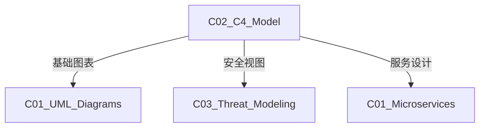

# C02 C4 Model - C4模型

**领域**: A03_Design_Architecture/B05_System_Modeling  
**创建日期**: 2026-01-30  
**最后更新**: 2026-01-30

---

## 1. 主题定位

### 1.1 定义与本质

C4模型是一种软件架构文档方法，由Simon Brown于2011年提出。它通过四个层次（Context、Container、Component、Code）以不同粒度描述软件架构，满足不同受众的需求。

C4模型的核心理念：**使用简单的图表，在不同抽象层次上讲述系统的架构故事**。

### 1.2 四级抽象层次

```
┌─────────────────────────────────────────────────────────────────┐
│                    C4模型四级抽象层次                            │
├─────────────────────────────────────────────────────────────────┤
│                                                                 │
│  Level 1: System Context (系统上下文)                           │
│  ┌───────────────────────────────────────────────────────────┐ │
│  │                                                           │ │
│  │      [用户] ───────► [电商系统] ───────► [支付网关]       │ │
│  │         │                │                   │            │ │
│  │         │                ▼                   │            │ │
│  │         └───────────► [邮件服务]             │            │ │
│  │                                                           │ │
│  │  目标: 展示系统与外部实体的关系                             │ │
│  │  受众: 所有人 (包括非技术人员)                               │ │
│  │                                                           │ │
│  └───────────────────────────────────────────────────────────┘ │
│                                                                 │
│  Level 2: Container (容器)                                      │
│  ┌───────────────────────────────────────────────────────────┐ │
│  │                                                           │ │
│  │  ┌──────────┐     ┌──────────┐     ┌──────────┐          │ │
│  │  │  Web App │────►│  API     │────►│  Database│          │ │
│  │  │ (React)  │     │ (Spring) │     │(Postgres)│          │ │
│  │  └──────────┘     └────┬─────┘     └──────────┘          │ │
│  │                        │                                  │ │
│  │                        ▼                                  │ │
│  │                   ┌──────────┐                           │ │
│  │                   │  Redis   │                           │ │
│  │                   │ (Cache)  │                           │ │
│  │                   └──────────┘                           │ │
│  │                                                           │ │
│  │  目标: 展示系统的高层次技术架构                             │ │
│  │  受众: 开发团队、运维团队                                    │ │
│  │                                                           │ │
│  └───────────────────────────────────────────────────────────┘ │
│                                                                 │
│  Level 3: Component (组件)                                      │
│  ┌───────────────────────────────────────────────────────────┐ │
│  │                                                           │ │
│  │  ┌────────────────── API Application ──────────────────┐ │ │
│  │  │                                                     │ │ │
│  │  │  ┌─────────────┐  ┌─────────────┐  ┌─────────────┐ │ │ │
│  │  │  │ Controller  │  │  Service    │  │ Repository  │ │ │ │
│  │  │  │ (REST API)  │──►│ (Business)  │──►│ (Data)      │ │ │ │
│  │  │  └─────────────┘  └─────────────┘  └─────────────┘ │ │ │
│  │  │                                                     │ │ │
│  │  └─────────────────────────────────────────────────────┘ │ │
│  │                                                           │ │
│  │  目标: 展示容器的内部结构和组件关系                         │ │
│  │  受众: 软件架构师、高级开发人员                              │ │
│  │                                                           │ │
│  └───────────────────────────────────────────────────────────┘ │
│                                                                 │
│  Level 4: Code (代码)                                           │
│  ┌───────────────────────────────────────────────────────────┐ │
│  │                                                           │ │
│  │  UML类图 / 代码片段 / ER图                                │ │
│  │                                                           │ │
│  │  ┌───────────────┐                                        │ │
│  │  │ OrderService  │                                        │ │
│  │  │───────────────│                                        │ │
│  │  │ + createOrder │                                        │ │
│  │  │ + cancelOrder │                                        │ │
│  │  └───────────────┘                                        │ │
│  │                                                           │ │
│  │  目标: 展示具体实现细节                                     │ │
│  │  受众: 开发人员在需要时查阅                                  │ │
│  │                                                           │ │
│  └───────────────────────────────────────────────────────────┘ │
│                                                                 │
│  核心原则: 每层为下一层提供"放大"视图                           │
│                                                                 │
└─────────────────────────────────────────────────────────────────┘
```

---

## 2. 核心概念

### 2.1 C4元素定义

```
┌─────────────────────────────────────────────────────────────────┐
│                    C4模型核心元素                                │
├─────────────────────────────────────────────────────────────────┤
│                                                                 │
│  Person (人员) - 系统用户:                                      │
│  ┌─────────────┐                                                │
│  │   👤        │  Customer [Person]                             │
│  │   User      │  描述: A customer of the e-commerce system    │
│  └─────────────┘                                                │
│                                                                 │
│  Software System (软件系统):                                    │
│  ┌─────────────────────┐                                        │
│  │   E-commerce System │  [Software System]                     │
│  │   ┌───────────────┐ │  描述: Allows customers to browse     │
│  │   │               │ │         and buy products               │
│  │   └───────────────┘ │                                        │
│  └─────────────────────┘                                        │
│                                                                 │
│  Container (容器) - 可独立部署/运行的单元:                       │
│  ┌─────────────────────┐                                        │
│  │   Web Application   │  [Container: React]                    │
│  │   ┌───────────────┐ │  描述: Provides e-commerce            │
│  │   │               │ │         functionality via web browser │
│  │   └───────────────┘ │                                        │
│  └─────────────────────┘                                        │
│                                                                 │
│  Component (组件):                                              │
│  ┌─────────────────────┐                                        │
│  │   Order Controller  │  [Component: Spring MVC Controller]    │
│  │   ┌───────────────┐ │  描述: Handles order-related          │
│  │   │               │ │         API requests                   │
│  │   └───────────────┘ │                                        │
│  └─────────────────────┘                                        │
│                                                                 │
│  关系类型:                                                       │
│  ───────► 使用/调用                                             │
│  ═══════► HTTP/HTTPS                                            │
│  ─ ─ ─ ► 异步消息                                               │
│  ───────┤ 数据存储                                              │
│                                                                 │
└─────────────────────────────────────────────────────────────────┘
```

### 2.2 补充视图

```
┌─────────────────────────────────────────────────────────────────┐
│                    C4补充视图                                    │
├─────────────────────────────────────────────────────────────────┤
│                                                                 │
│  System Landscape (系统全景) - 企业级视图:                       │
│  ┌───────────────────────────────────────────────────────────┐ │
│  │  [CRM System]    [ERP System]    [E-commerce]   [Mobile] │ │
│  │       │               │               │            │     │ │
│  │       └───────────────┴───────────────┴────────────┘     │ │
│  │                       │                                   │ │
│  │                  [Data Warehouse]                         │ │
│  └───────────────────────────────────────────────────────────┘ │
│                                                                 │
│  Dynamic Diagram (动态图) - 运行时行为:                          │
│  ┌───────────────────────────────────────────────────────────┐ │
│  │  User ──1──► Web ──2──► API ──3──► DB                     │ │
│  │                  ▲            │                           │ │
│  │                  └────4───────┘                           │ │
│  │  1: Submit order                                          │ │
│  │  2: POST /api/orders                                      │ │
│  │  3: INSERT INTO orders                                    │ │
│  │  4: Return orderId                                        │ │
│  └───────────────────────────────────────────────────────────┘ │
│                                                                 │
│  Deployment Diagram (部署图):                                    │
│  ┌───────────────────────────────────────────────────────────┐ │
│  │  AWS Region: us-west-2                                    │ │
│  │  ┌─────────────────────────────────────────────────────┐  │ │
│  │  │  Availability Zone: us-west-2a                      │  │ │
│  │  │  ┌───────────────┐  ┌───────────────┐              │  │ │
│  │  │  │  EC2 Instance │  │  RDS Instance │              │  │ │
│  │  │  │  (API Server) │  │  (PostgreSQL) │              │  │ │
│  │  │  └───────────────┘  └───────────────┘              │  │ │
│  │  └─────────────────────────────────────────────────────┘  │ │
│  └───────────────────────────────────────────────────────────┘ │
│                                                                 │
└─────────────────────────────────────────────────────────────────┘
```

---

## 3. 技术实践

### 3.1 Structurizr DSL

```dsl
// workspace.dsl - Structurizr DSL示例
workspace "E-commerce Platform" "Online shopping system" {
    
    # 模型定义
    model {
        # 用户
        customer = person "Customer" "A customer who browses and purchases products" "Customer"
        admin = person "Admin" "An administrator who manages products and orders" "Admin"
        
        # 外部系统
        paymentGateway = softwareSystem "Payment Gateway" "External payment processing system" "External"
        emailSystem = softwareSystem "Email System" "External email delivery service" "External"
        
        # 主系统
        ecommerceSystem = softwareSystem "E-commerce System" "Allows customers to browse products and place orders" {
            
            # 容器层
            webApp = container "Web Application" "Provides e-commerce functionality via web browser" "React" {
                tags "Web"
            }
            
            mobileApp = container "Mobile App" "Provides e-commerce functionality via mobile app" "React Native" {
                tags "Mobile"
            }
            
            apiApplication = container "API Application" "Provides e-commerce functionality via API" "Spring Boot" {
                tags "API"
                
                # 组件层
                orderController = component "Order Controller" "Handles order-related API requests" "Spring MVC Controller"
                orderService = component "Order Service" "Business logic for orders" "Spring Service"
                orderRepository = component "Order Repository" "Data access for orders" "Spring Data Repository"
                
                productController = component "Product Controller" "Handles product-related API requests" "Spring MVC Controller"
                productService = component "Product Service" "Business logic for products" "Spring Service"
                productRepository = component "Product Repository" "Data access for products" "Spring Data Repository"
                
                # 组件关系
                orderController -> orderService "Uses"
                orderService -> orderRepository "Uses"
                orderService -> productService "Uses"
                
                productController -> productService "Uses"
                productService -> productRepository "Uses"
            }
            
            database = container "Database" "Stores product, order, and customer data" "PostgreSQL" {
                tags "Database"
            }
            
            cache = container "Cache" "Caches frequently accessed data" "Redis" {
                tags "Cache"
            }
            
            messageQueue = container "Message Queue" "Handles asynchronous tasks" "RabbitMQ" {
                tags "Queue"
            }
        }
        
        # 系统上下文关系
        customer -> ecommerceSystem "Browses products and places orders using"
        admin -> ecommerceSystem "Manages products and orders using"
        ecommerceSystem -> paymentGateway "Processes payments via"
        ecommerceSystem -> emailSystem "Sends emails via"
        
        # 容器关系
        customer -> webApp "Uses"
        customer -> mobileApp "Uses"
        admin -> webApp "Uses"
        
        webApp -> apiApplication "Makes API calls to"
        mobileApp -> apiApplication "Makes API calls to"
        
        apiApplication -> database "Reads from and writes to"
        apiApplication -> cache "Reads from and writes to"
        apiApplication -> messageQueue "Publishes messages to"
        apiApplication -> paymentGateway "Processes payments via"
        
        # 组件关系（已在容器内定义）
    }
    
    # 视图定义
    views {
        
        # 系统上下文视图
        systemContext ecommerceSystem "SystemContext" {
            include *
            autolayout lr
        }
        
        # 容器视图
        container ecommerceSystem "Containers" {
            include *
            autolayout lr
        }
        
        # 组件视图
        component apiApplication "Components" {
            include *
            autolayout lr
        }
        
        # 动态视图 - 下单流程
        dynamic apiApplication "OrderProcess" "Order placement process" {
            customer -> webApp "Submits order"
            webApp -> orderController "POST /api/orders"
            orderController -> orderService "createOrder()"
            orderService -> productService "checkStock()"
            orderService -> orderRepository "save(order)"
            orderRepository -> database "INSERT"
            orderService -> messageQueue "publish(OrderCreated)"
            orderController -> webApp "Return orderId"
            autolayout lr
        }
        
        # 部署视图
        deployment ecommerceSystem "Production" "Live" {
            deploymentNode "AWS" "" "Amazon Web Services" {
                deploymentNode "us-west-2" "" "AWS Region" {
                    deploymentNode "ECS Cluster" "" "AWS ECS" {
                        containerInstance webApp
                        containerInstance apiApplication
                    }
                    
                    deploymentNode "RDS" "" "AWS RDS" {
                        containerInstance database
                    }
                    
                    deploymentNode "ElastiCache" "" "AWS ElastiCache" {
                        containerInstance cache
                    }
                    
                    deploymentNode "Amazon MQ" "" "AWS MQ" {
                        containerInstance messageQueue
                    }
                }
            }
        }
        
        # 样式定义
        styles {
            element "Person" {
                shape Person
                background #08427b
                color #ffffff
            }
            element "Customer" {
                background #08427b
            }
            element "Software System" {
                background #1168bd
                color #ffffff
            }
            element "External" {
                background #999999
                color #ffffff
            }
            element "Container" {
                background #438dd5
                color #ffffff
            }
            element "Web" {
                shape WebBrowser
            }
            element "Mobile" {
                shape MobileDevicePortrait
            }
            element "Database" {
                shape Cylinder
                background #438dd5
            }
            element "Cache" {
                shape Hexagon
                background #438dd5
            }
            element "Queue" {
                shape Pipe
                background #438dd5
            }
            element "Component" {
                background #85bbf0
                color #000000
            }
        }
    }
}
```

### 3.2 Python生成C4模型

```python
# c4_generator.py
"""
使用Python生成C4模型
输出为PlantUML格式
"""

from dataclasses import dataclass, field
from typing import List, Optional, Dict
from enum import Enum


class ElementType(Enum):
    PERSON = "person"
    SOFTWARE_SYSTEM = "software_system"
    CONTAINER = "container"
    COMPONENT = "component"


@dataclass
class Element:
    id: str
    name: str
    description: str
    type: ElementType
    technology: Optional[str] = None
    tags: List[str] = field(default_factory=list)


@dataclass
class Relationship:
    source: str
    target: str
    description: str
    technology: Optional[str] = None


class C4Model:
    """C4模型生成器"""
    
    def __init__(self, name: str, description: str):
        self.name = name
        self.description = description
        self.elements: Dict[str, Element] = {}
        self.relationships: List[Relationship] = []
    
    def add_person(self, id: str, name: str, description: str) -> Element:
        """添加人员"""
        element = Element(id, name, description, ElementType.PERSON)
        self.elements[id] = element
        return element
    
    def add_system(self, id: str, name: str, description: str, 
                   external: bool = False) -> Element:
        """添加软件系统"""
        tags = ["external"] if external else []
        element = Element(id, name, description, ElementType.SOFTWARE_SYSTEM, tags=tags)
        self.elements[id] = element
        return element
    
    def add_container(self, id: str, name: str, description: str,
                      technology: str, system_id: str) -> Element:
        """添加容器"""
        element = Element(id, name, description, ElementType.CONTAINER, 
                         technology=technology)
        self.elements[id] = element
        return element
    
    def add_component(self, id: str, name: str, description: str,
                      technology: str, container_id: str) -> Element:
        """添加组件"""
        element = Element(id, name, description, ElementType.COMPONENT,
                         technology=technology)
        self.elements[id] = element
        return element
    
    def relate(self, source: str, target: str, description: str,
               technology: Optional[str] = None):
        """添加关系"""
        self.relationships.append(Relationship(source, target, description, technology))
    
    def to_plantuml_context(self) -> str:
        """生成系统上下文视图"""
        lines = [
            "@startuml C4_Context",
            "!include https://raw.githubusercontent.com/plantuml-stdlib/C4-PlantUML/master/C4_Context.puml",
            "",
            f"LAYOUT_WITH_LEGEND()",
            "",
            f"title {self.name} - System Context",
            ""
        ]
        
        # 添加元素
        for elem in self.elements.values():
            if elem.type == ElementType.PERSON:
                lines.append(f'Person({elem.id}, "{elem.name}", "{elem.description}")')
            elif elem.type == ElementType.SOFTWARE_SYSTEM:
                if "external" in elem.tags:
                    lines.append(f'System_Ext({elem.id}, "{elem.name}", "{elem.description}")')
                else:
                    lines.append(f'System({elem.id}, "{elem.name}", "{elem.description}")')
        
        lines.append("")
        
        # 添加关系
        for rel in self.relationships:
            if rel.technology:
                lines.append(f'Rel({rel.source}, {rel.target}, "{rel.description}", "{rel.technology}")')
            else:
                lines.append(f'Rel({rel.source}, {rel.target}, "{rel.description}")')
        
        lines.append("")
        lines.append("@enduml")
        
        return "\n".join(lines)
    
    def to_plantuml_container(self, system_id: str) -> str:
        """生成容器视图"""
        lines = [
            "@startuml C4_Container",
            "!include https://raw.githubusercontent.com/plantuml-stdlib/C4-PlantUML/master/C4_Container.puml",
            "",
            f"LAYOUT_WITH_LEGEND()",
            "",
            f"title {self.name} - Container Diagram",
            ""
        ]
        
        # 添加容器
        for elem in self.elements.values():
            if elem.type == ElementType.CONTAINER:
                if "database" in elem.tags:
                    lines.append(f'ContainerDb({elem.id}, "{elem.name}", "{elem.technology}", "{elem.description}")')
                elif "web" in elem.tags:
                    lines.append(f'Container({elem.id}, "{elem.name}", "{elem.technology}", "{elem.description}")')
                else:
                    lines.append(f'Container({elem.id}, "{elem.name}", "{elem.technology}", "{elem.description}")')
        
        lines.append("")
        
        # 添加关系
        for rel in self.relationships:
            lines.append(f'Rel({rel.source}, {rel.target}, "{rel.description}")')
        
        lines.append("")
        lines.append("@enduml")
        
        return "\n".join(lines)
    
    def save(self, output_dir: str):
        """保存所有视图"""
        import os
        os.makedirs(output_dir, exist_ok=True)
        
        # 系统上下文
        with open(f"{output_dir}/context.puml", 'w') as f:
            f.write(self.to_plantuml_context())
        
        print(f"C4 diagrams saved to: {output_dir}")


# 使用示例
def example():
    model = C4Model("E-commerce System", "Online shopping platform")
    
    # 添加人员
    model.add_person("customer", "Customer", "A customer of the system")
    
    # 添加系统
    model.add_system("ecommerce", "E-commerce System", "Allows customers to shop online")
    model.add_system("payment", "Payment Gateway", "External payment system", external=True)
    
    # 添加关系
    model.relate("customer", "ecommerce", "Uses")
    model.relate("ecommerce", "payment", "Processes payments")
    
    # 保存
    model.save("/tmp/c4")


if __name__ == "__main__":
    example()
```

---

## 4. 资源索引

### 4.1 工具

| 工具 | 类型 | 链接 |
|------|------|------|
| Structurizr | 商业/开源 | https://structurizr.com/ |
| PlantUML C4 | 开源 | https://github.com/plantuml-stdlib/C4-PlantUML |
| Mermaid | 开源 | https://mermaid.js.org/ |
| IcePanel | SaaS | https://icepanel.io/ |

### 4.2 学习资源

| 资源 | 作者 | 类型 |
|------|------|------|
| Visualising Software Architecture | Simon Brown | 书籍 |
| The C4 Model for Software Architecture | Simon Brown | 网站 |
| Architecture Katas | Neal Ford | 练习 |

---

## 5. 关联知识



---

## 6. 学习建议

1. 从系统上下文开始，逐步细化
2. 保持图表简洁，避免信息过载
3. 使用工具自动生成和维护
4. 与代码库版本同步

---

## 7. 附录

| 版本 | 日期 | 变更内容 |
|------|------|----------|
| 1.0.0 | 2026-01-30 | 初始版本 |

---

> **文档维护**: 本知识库遵循持续更新原则。
